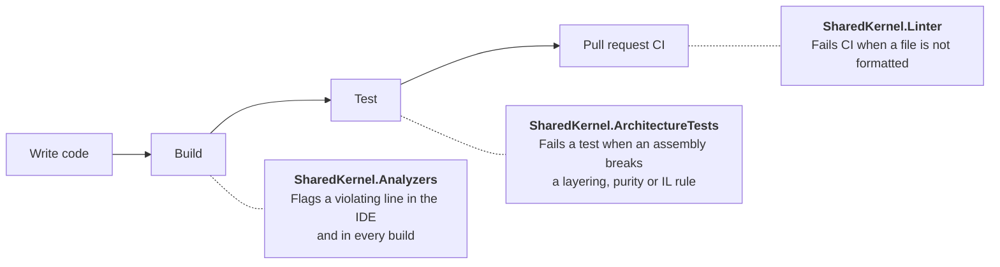

# 00.Governance

**Automated guardrails for the Platform.SharedKernel ecosystem.** Compile-time analyzers, architecture tests and a formatting gate that turn the platform's conventions into checks that run on every build, every test run and every pull request.

A shared kernel only stays coherent if every service follows the same rules: inject `IClock` instead of reading the system clock, never silently discard a `Result`, keep the domain free of persistence, never log personal data unmasked. Written down, rules like these get broken by accident, one reviewer blind spot at a time. The packages in this folder make each rule fail loudly at the point where it is broken, with a message that names the fix.

## Contents

- [How it fits together](#how-it-fits-together)
- [Packages](#packages)
- [Quick start](#quick-start)
- [Adopting governance in an existing service](#adopting-governance-in-an-existing-service)
- [Configuring severity](#configuring-severity)
- [Suppressing a diagnostic](#suppressing-a-diagnostic)
- [Analyzer rules](#analyzer-rules)
  - [Rule index](#analyzer-rule-index)
- [Analyzer rule reference](#rule-reference)
- [Architecture tests](#architecture-tests)
- [Formatting (Linter)](#formatting-linter)
- [Benchmarks](#benchmarks)
- [How these packages are verified](#how-these-packages-are-verified)

---

## How it fits together

Each package catches a different class of problem, at a different stage, so a violation is stopped as early as the check can see it.



| | Analyzers | Architecture tests | Linter |
|---|---|---|---|
| **Checks** | Individual lines of code: an API call, a registration, a constructor parameter | Whole assemblies: what references what, what a method body does in IL | File formatting and code style |
| **Runs** | IDE and every `dotnet build` | Your test suite (`dotnet test`) | CI builds only |
| **Typical catch** | `DateTime.UtcNow` in a service, a discarded `Result` | The domain layer referencing EF Core | An unformatted file in a pull request |
| **Ships to your consumers** | No, development dependency | No, development dependency | No, development dependency |

None of these packages adds a runtime dependency to your service or to any package you publish.

## Packages

| Package | What it provides | Reference it from | Documentation |
|---|---|---|---|
| **SharedKernel.Analyzers** | 44 Roslyn analyzer rules for platform conventions, security and data privacy | Every production project | [Rule reference](#analyzer-rules) on this page · [package README](SharedKernel.Analyzers/README.md) |
| **SharedKernel.ArchitectureTests** | 80+ ready-made NetArchTest rules and IL-level assertions | Your architecture test project | [Package README](SharedKernel.ArchitectureTests/README.md) |
| **SharedKernel.Linter** | A CSharpier format gate for CI and the platform's shared `.editorconfig` | Every project, or once in `Directory.Build.props` | [Package README](SharedKernel.Linter/README.md) |
| SharedKernel.Benchmarks | Standard BenchmarkDotNet configuration | Internal only, not published | [Benchmarks](#benchmarks) |

All published packages share the repository-wide version, derived from a single git tag.

## Quick start

### 1. Add the package source

SharedKernel packages are published to GitHub Packages. Add the feed once, in a `nuget.config` at your repository root:

```xml
<configuration>
  <packageSources>
    <add key="nuget.org" value="https://api.nuget.org/v3/index.json" />
    <add key="shared-kernel" value="https://nuget.pkg.github.com/Gresta-Vertex-Labs/index.json" />
  </packageSources>
  <packageSourceMapping>
    <packageSource key="shared-kernel">
      <package pattern="SharedKernel.*" />
    </packageSource>
    <packageSource key="nuget.org">
      <package pattern="*" />
    </packageSource>
  </packageSourceMapping>
</configuration>
```

GitHub Packages requires authentication even for reads: supply a personal access token with the `read:packages` scope through `dotnet nuget update source` locally, or `GITHUB_TOKEN` in GitHub Actions.

### 2. Reference the packages

Analyzers and the Linter belong on every project, so the simplest place for them is a `Directory.Build.props` at the repository root:

```xml
<Project>
  <ItemGroup>
    <PackageReference Include="SharedKernel.Analyzers" PrivateAssets="all" />
    <PackageReference Include="SharedKernel.Linter" PrivateAssets="all" />
  </ItemGroup>
</Project>
```

The version comes from `Directory.Packages.props` if you use Central Package Management, or add `Version="..."` above if you do not. Analyzers are not inherited transitively, which is why they are referenced explicitly rather than arriving with another SharedKernel package.

Architecture tests go in a test project, alongside the test runner of your choice:

```bash
dotnet add tests/MyService.ArchitectureTests package SharedKernel.ArchitectureTests
```

### 3. Build

```bash
dotnet build
```

The analyzers run immediately and report at **Warning**; nothing fails your build until you decide it should. See [Configuring severity](#configuring-severity) to make rules strict, and the [ArchitectureTests README](SharedKernel.ArchitectureTests/README.md) for your first rule.

## Adopting governance in an existing service

Turning every check on at once in a mature codebase produces noise, and noise gets suppressed. This order introduces each check where it is cheapest to act on:

1. **Add the analyzers and read the warnings.** Most rules only fire on code that uses what they govern, so a service with no MassTransit bus never sees the messaging rules. Fix or explicitly suppress what appears.
2. **Escalate the security rules to errors.** `SK0032` (CORS credentials with a wildcard origin) and `SK0035` (unmasked personal data in logs) have real security consequences. Make them non-negotiable first.
3. **Add architecture tests one rule at a time.** For each rule you adopt, introduce a deliberate violation once and watch the test fail. A rule you have never seen fail may be passing because it inspected nothing.
4. **Format once, then let CI hold the line.** Install the shared `.editorconfig`, run the formatter across the codebase as a single reviewable commit, and only then rely on the CI format check.

## Configuring severity

Every analyzer ships at **Warning**. Raise, lower or disable rules in `.editorconfig`, where the decision is versioned with your code:

```ini
[*.cs]
# Fail the build on the rules you treat as non-negotiable
dotnet_diagnostic.SK0030.severity = error

# Adopt a whole category at once
dotnet_analyzer_diagnostic.category-Security.severity = error

# Switch off a rule that does not apply to this service
dotnet_diagnostic.SK0024.severity = none

[tests/**/*.cs]
# Relax a rule for part of the tree only
dotnet_diagnostic.SK0001.severity = none
```

| Category | Meaning |
|---|---|
| `Usage` | An API is being used in a way the platform does not support. |
| `Design` | The shape of a type, a method or a DI registration is wrong. |
| `Security` | A violation with a direct security consequence. The best candidates to raise to `error` first. |
| `Advisory` | A nudge toward a better pattern, not a prohibition. Leave it at Warning. |

## Suppressing a diagnostic

When a rule is genuinely wrong for one call site, suppress it at that site **and record why**. An unexplained suppression cannot be told apart from an oversight.

```csharp
#pragma warning disable SK0202 // Cross-tenant retention purge, approved in INF-4421
var expired = await context.AuditLogs.IgnoreQueryFilters().Where(x => x.CreatedAt < cutoff).ToListAsync(ct);
#pragma warning restore SK0202
```

For a whole member or type, use `[SuppressMessage]` with a `Justification`:

```csharp
[SuppressMessage("Usage", "SK0001", Justification = "Measures wall-clock time deliberately.")]
public TimeSpan MeasureLatency() { /* ... */ }
```

Prefer either over disabling a rule in `.editorconfig`. A per-site suppression records one decision; `severity = none` removes the rule for everyone.

---

## Analyzer rules

`SharedKernel.Analyzers` contains 45 rules. Every diagnostic's help link in the IDE opens that rule's section below.

**Which rules will you actually see?** Most rules only apply to code that already uses the technology they govern. The rules that apply to almost any C# project are `SK0001` (clock access), `SK0003`–`SK0005` (exception and error shape), `SK0011` (GUID formatting), `SK0016` (type-name collisions), `SK0020`–`SK0021` (log authoring), `SK0022` (magic strings), `SK0030` (discarded results) and `SK0033` (reflection-based mappers).

<a id="analyzer-rule-index"></a>
### Rule index

#### Core standards

Primitives, domain modelling and error handling.

| Rule | Flags | Do this instead |
|---|---|---|
| [SK0001](#sk0001-directdatetimeusage) | `DateTime` / `DateTimeOffset` `.Now` or `.UtcNow` read directly | Inject `IClock` |
| [SK0002](#sk0002-directmicrosoftfeaturemanagerusage) | A Microsoft feature-management evaluator interface, or `OpenFeature.Api.Instance`, referenced directly | Inject `OpenFeature.IFeatureClient` and evaluate a `SharedKernel.FeatureManagement.FeatureFlag<T>` |
| [SK0003](#sk0003-rawexceptionthrow) | `throw new Exception(...)` or `ApplicationException` | Return a `Result` failure, or throw a typed SharedKernel exception |
| [SK0004](#sk0004-nullerrorreturn) | `null` returned where an `Error` is expected | Return `Error.None` |
| [SK0005](#sk0005-stringonlyexceptionconstructor) | A SharedKernel exception constructed from a message string only | Pass an `Error` |
| [SK0006](#sk0006-guardclausethrow) | A `Guard.Against` clause that throws | Return `Error?`; throw only from `Guard.Throw` |
| [SK0007](#sk0007-redischannelservicemessagingsubstitute) | Redis pub/sub injected where durable messaging is intended | Inject `IMessageBus` |
| [SK0008](#sk0008-aggregaterootdispatchcoupling) | Event-dispatch code depending on the full aggregate root | Depend on `IHasDomainEvents` |
| [SK0009](#sk0009-domaineventmissingversionattribute) | A domain event without a schema version | Add `[DomainEventVersion(n)]` |
| [SK0010](#sk0010-specificationorderingconflict) | A specification applying two primary orderings | One primary ordering, then `ApplyThenBy` |
| [SK0011](#sk0011-guidformatcodemisuse) | `Guid.ToString` with a non-canonical format | `ToString()` or `ToString("D")` |
| [SK0037](#sk0037-valueobjectmissingensurevalid) | A value object whose constructor never calls `EnsureValid()` | Call `EnsureValid()` last in every constructor |
| [SK0038](#sk0038-integrationeventmissingattribute) | An integration event without a wire name and version | Add `[IntegrationEvent("context.event-name", Version = n)]` |
| [SK0039](#sk0039-invalidintegrationeventattribute) | An `[IntegrationEvent]` literal name that breaks the name rule, or a `Version` below 1 | Lowercase segments such as `orders.order-placed`; versions start at 1 |

#### Application and communication

The MediatR pipeline and outbound HTTP.

| Rule | Flags | Do this instead |
|---|---|---|
| [SK0013](#sk0013-rawhttpclientconstructorinjection) | `HttpClient` injected into a constructor | A typed client via `AddRestClient<TClient>()` |
| [SK0014](#sk0014-closedgenericresiliencepipelineregistration) | A closed-generic `ResiliencePipeline<T>` registration | The string-keyed, non-generic `ResiliencePipeline` |
| [SK0015](#sk0015-streampipelinebehaviormisregistration) | A stream behavior registered as a request behavior | Register it against `IStreamPipelineBehavior<,>` |
| [SK0016](#sk0016-requesttypeshortnameusage) | `typeof(T).Name` used as a metric tag, log scope or cache key | `typeof(T).FullName ?? typeof(T).Name` |
| [SK0017](#sk0017-commandimplementscacheablequery) | A command marked cacheable | Caching is for queries only |
| [SK0018](#sk0018-queryimplementsinvalidatescache) | A query marked as invalidating the cache | Invalidation is for commands only |
| [SK0040](#sk0040-pipelinemarkerresponseshapemismatch) | `IAuthorizeRequest`/`IIdempotentRequest` on a request whose MediatR response isn't `Result`/`Result<T>` | Declare the response as `Result`/`Result<T>` |
| [SK0041](#sk0041-duplicatecacheablequeryname) | Two cacheable queries sharing a simple type name | Rename one -- cache entries are namespaced by that name |

#### Logging

How every production log statement is written.

| Rule | Flags | Do this instead |
|---|---|---|
| [SK0020](#sk0020-directiloggerextensionmethodusage) | `logger.LogInformation(...)` and the other `ILogger` extension methods | A `[LoggerMessage]` source-generated method |
| [SK0021](#sk0021-handwrittenloggermessagedefinedelegate) | A hand-written `LoggerMessage.Define` delegate | A `[LoggerMessage]` source-generated method |

#### Cross-cutting, security and data privacy

| Rule | Flags | Do this instead |
|---|---|---|
| [SK0022](#sk0022-crosscuttingmagicstringliteral) | A string literal as an HTTP header, OTel baggage/tag key, config section or claim type | A named constant, such as `WellKnownHeaders` |
| [SK0023](#sk0023-nonsingletonamazons3clientregistration) | `IAmazonS3` registered as Scoped or Transient | Register it as a singleton |
| [SK0024](#sk0024-rawsearchfieldnameliteral) | A string literal as a search field name | `nameof(...)` or a field-constants class |
| [SK0025](#sk0025-obsoleteelasticsearchclientusage) | The deprecated NEST / `Elasticsearch.Net` client | `Elastic.Clients.Elasticsearch` |
| [SK0026](#sk0026-rawintelligenceproviderclientconstructorinjection) | A raw Qdrant or Semantic Kernel client injected | The `SharedKernel.AI.Abstractions` contracts |
| [SK0027](#sk0027-rawintelligenceidentifierliteral) | A string literal as a collection, field or embedding-model name | `nameof(...)` or a constant |
| [SK0028](#sk0028-nondeterministicapiusageinsideworkflow) | A non-deterministic API inside a Temporal workflow | The deterministic `Workflow.*` equivalent |
| [SK0029](#sk0029-rawtemporalclientconstructorinjection) | A raw Temporal client injected | `IWorkflowDispatcher` or `IWorkflowHandle` |
| [SK0030](#sk0030-resultoutcomediscarded) | A `Result` returned and never inspected | Check, return or pass it, or discard with `_ =` |
| [SK0031](#sk0031-rawsecuritycontextconstructorinjection) | `IHttpContextAccessor`, `HttpContext` or `ClaimsPrincipal` injected | `IUserContext` or `ITenantProvider` |
| [SK0032](#sk0032-corswildcardoriginwithcredentials) | CORS credentials allowed with a wildcard origin | Name the allowed origins |
| [SK0033](#sk0033-reflectionbasedobjectmapperusage) | AutoMapper, or Mapster's runtime adapter | A Mapperly `[Mapper]` class, or hand-written mapping |
| [SK0034](#sk0034-amountcurrencypaircoupling) | A `decimal` amount paired with a `string` currency code | Consider `Money` (advisory) |
| [SK0035](#sk0035-unmaskedclassifieddataatloggingcallsite) | Classified or personal data logged unmasked | Classify the logging parameter, or mask it with `PiiMasking` |
| [SK0036](#sk0036-rawrpcexceptionconstruction) | `RpcException` constructed outside the gRPC presentation layer | Return a `Result` and call `ToGrpcResult()` |

#### Persistence

Multi-tenant EF Core safety, and SQL-injection prevention in the Dapper read/command layer.

| Rule | Flags | Do this instead |
|---|---|---|
| [SK0042](#sk0042-nonconstantdappersqlargument) | A non-constant `sql` argument on a Dapper query/command method | Fixed SQL text, values through parameters |
| [SK0201](#sk0201-tenanteddbcontextonmodelcreatingguard) | A tenanted `DbContext` that drops the global tenant filter | Call `base.OnModelCreating` or `ApplyTenantFilters` |
| [SK0202](#sk0202-ignorequeryfiltersoutsidetenantedrepository) | `IgnoreQueryFilters()` outside the permitted scope | Keep it inside the persistence layer or a `TenantedRepository` |

#### Messaging

MassTransit registration correctness.

| Rule | Flags | Do this instead |
|---|---|---|
| [SK0703](#sk0703-messagebussingletonregistration) | `IMessageBus` or `IEventPublisher` registered as a singleton | Register them as scoped |
| [SK0704](#sk0704-hardcodedqueueuriingetsendendpoint) | A hardcoded `queue:` or `exchange:` URI passed to `GetSendEndpoint` | `IMessageBus.SendAsync`, or `WithSendEndpointRoute<T>()` |
| [SK0705](#sk0705-faultconsumerdirectregistration) | A fault consumer registered directly in DI | `AddFaultConsumer<TMessage, TConsumer>()` |
| [SK0708](#sk0708-batchconsumerregisteredviaaddconsumer) | A batch consumer registered with `AddConsumer<T>()` | `AddBatchConsumer<T>()` |

**About the gaps in the numbering.** `SK0012`, `SK0301`–`SK0303`, `SK0701`–`SK0702` and `SK0706`–`SK0707` exist, but as [architecture tests](#architecture-tests) rather than analyzers: they need to see a whole assembly, not a single line, so they run from your test suite instead of the compiler.

---

<a id="rule-reference"></a>
## Analyzer rule reference

One section per rule: why it matters, exactly what it flags and what it deliberately does not, an example, and the diagnostic text as it appears in your build.

<a id="sk0001-directdatetimeusage"></a>
### SK0001 — DirectDateTimeUsage

**Category:** Usage · **Default severity:** Warning

Inject `IClock` instead of reading the system clock directly.

#### Why it matters

Code that reads `DateTime.UtcNow` or `DateTimeOffset.UtcNow` directly cannot be tested deterministically. There is no seam to substitute a fixed or advancing instant, so expiry windows, schedules, and audit timestamps end up tested with sleeps, tolerances, or not at all.

`DateTime.Now` and `DateTimeOffset.Now` are worse: they also read the server's local time zone, so the same code behaves differently depending on where the process runs. `IClock` (namespace `SharedKernel.Primitives.Clocks`) gives every service one injectable source of the current UTC instant.

#### What it flags

- Member access to `DateTime.UtcNow`, `DateTime.Now`, `DateTimeOffset.UtcNow`, or `DateTimeOffset.Now`.
- Both the bare form (`DateTime.UtcNow`) and the `System`-qualified form (`System.DateTime.UtcNow`).
- The match is purely textual (no symbol resolution), so a type of your own named `DateTime` or `DateTimeOffset` with a `UtcNow` or `Now` member is also flagged.

#### What it does not flag

- Code inside a namespace whose name starts with `SharedKernel.Primitives`, where `IClock` itself is implemented.
- `DateTime.Today`, which is deliberately out of scope.
- Other receiver shapes: `global::System.DateTime.UtcNow`, a `using` alias for `DateTime`, or `using static System.DateTime;` followed by a bare `UtcNow`.
- A member chain where `DateTime` is just a property name, such as `settings.DateTime.UtcNow`.
- Generated code.

#### Example

```csharp
// Flagged: SK0001
public sealed class OrderFactory
{
    public Order Create() => new() { CreatedAt = DateTimeOffset.UtcNow };
}
```

```csharp
// Compliant
public sealed class OrderFactory(IClock clock)
{
    public Order Create() => new() { CreatedAt = clock.UtcNow };
}
```

#### Diagnostic

```text
warning SK0001: Direct access to 'DateTimeOffset.UtcNow' is not allowed — inject IClock via DI instead
```

#### Suppressing

The only legitimate direct clock read is inside an `IClock` implementation. SharedKernel's own implementation is exempt automatically. If you write your own adapter outside `SharedKernel.Primitives`, suppress at that single line:

```csharp
#pragma warning disable SK0001 // IClock adapter: the one place the real clock is read
public DateTimeOffset UtcNow => DateTimeOffset.UtcNow;
#pragma warning restore SK0001
```

---

<a id="sk0002-directmicrosoftfeaturemanagerusage"></a>
### SK0002 — DirectMicrosoftFeatureManagerUsage

**Category:** Usage · **Default severity:** Warning

Depend on OpenFeature's `IFeatureClient`, not on a Microsoft feature-management evaluator interface or the process-global OpenFeature `Api.Instance`.

> Redesigned for P-555 (2026-09-18): `SharedKernel.FeatureManagement`'s own `IFeatureManager`/`FeatureDefinition`/`FeatureVariant` abstractions were deleted in favor of the CNCF-standard OpenFeature evaluator. This rule now points at that redesign.

#### Why it matters

`SharedKernel.FeatureManagement` registers OpenFeature's `IFeatureClient` (scoped) via `AddSharedKernelFeatureManagement(configuration)`, backed internally by `Microsoft.FeatureManagement`. Two ways of reaching past that seam are both wrong, for different reasons:

- Injecting a Microsoft evaluator interface directly (`IFeatureManager`, `IVariantFeatureManager`, `IFeatureManagerSnapshot`, `IVariantFeatureManagerSnapshot`) takes a hard dependency on that library's API and skips the ambient user/tenant targeting, per-request evaluation consistency, fail-safe defaults, and telemetry the SharedKernel wiring adds.
- Reading `OpenFeature.Api.Instance` — the process-global OpenFeature API — is not merely redundant, it is silently wrong: `AddSharedKernelFeatureManagement` registers an **isolated** `Api` instance in DI (`OpenFeature.Hosting`'s `CreateIsolated()`), so the global singleton has no provider attached. A client obtained from `Api.Instance` reports the OpenFeature "No-op Provider" and every evaluation quietly returns the caller-supplied default — no exception, no log.

#### What it flags

- A parameter, field, or property declared as `Microsoft.FeatureManagement.IFeatureManager`, `IVariantFeatureManager`, `IFeatureManagerSnapshot`, or `IVariantFeatureManagerSnapshot`. This covers method, constructor, primary constructor, and explicitly typed lambda parameters.
- Any reference to the static property `OpenFeature.Api.Instance`, written bare (`Api.Instance`, after `using OpenFeature;`) or fully qualified (`OpenFeature.Api.Instance`) — both resolve to the same property symbol.
- The declaration-shape comparison uses the fully qualified resolved type name. If the type cannot be resolved at all (for example, a missing package reference), any declaration whose simple type name matches one of the four forbidden interfaces is flagged instead. The `Api.Instance` shape has no such fallback — an unresolved member access is never flagged.

#### What it does not flag

- `OpenFeature.IFeatureClient`.
- The Microsoft interface used as a generic type argument, a local variable, or a method return type (the declaration-shape check only covers parameters, fields, and properties).
- Code compiled inside `SharedKernel.FeatureManagement` itself — its internal OpenFeature provider adapter legitimately implements against `Microsoft.FeatureManagement.IVariantFeatureManager` to bridge it into OpenFeature.

#### Example

```csharp
// Flagged: SK0002
using Microsoft.FeatureManagement;

public sealed class CheckoutService(IFeatureManager features)
{
    public Task<bool> IsExpressCheckoutEnabled() => features.IsEnabledAsync("ExpressCheckout");
}
```

```csharp
// Flagged: SK0002 — the isolated DI registration means this silently returns the default
using OpenFeature;

public sealed class CheckoutService
{
    public Task<bool> IsExpressCheckoutEnabled() =>
        Api.Instance.GetClient().GetBooleanValueAsync("ExpressCheckout", false);
}
```

```csharp
// Compliant
using OpenFeature;
using SharedKernel.FeatureManagement;

public sealed class CheckoutService(IFeatureClient features)
{
    public static readonly FeatureFlag<bool> ExpressCheckout = FeatureFlag.Boolean("ExpressCheckout");

    public ValueTask<bool> IsExpressCheckoutEnabled(CancellationToken ct) =>
        features.IsEnabledAsync(ExpressCheckout, ct);
}
```

#### Diagnostic

```text
warning SK0002: Do not reference 'Microsoft.FeatureManagement.IFeatureManager' directly. Bypassing IFeatureClient skips the ambient user/tenant targeting, per-request evaluation consistency, fail-safe defaults and telemetry that SharedKernel.FeatureManagement adds. Inject OpenFeature's 'OpenFeature.IFeatureClient' and evaluate a 'SharedKernel.FeatureManagement.FeatureFlag<T>' instead.
```

```text
warning SK0002: Do not reference 'OpenFeature.Api.Instance' directly. AddSharedKernelFeatureManagement registers an isolated OpenFeature Api instance in DI, so Api.Instance has no provider attached and silently returns every flag's default. Inject OpenFeature's 'OpenFeature.IFeatureClient' and evaluate a 'SharedKernel.FeatureManagement.FeatureFlag<T>' instead.
```

#### Suppressing

`SharedKernel.FeatureManagement`'s own internal OpenFeature provider adapter is exempt automatically (its compiling assembly is `SharedKernel.FeatureManagement`). Anywhere else, a genuinely justified bridge to the Microsoft interface should be narrow and documented:

```csharp
#pragma warning disable SK0002 // adapter: bridges Microsoft's evaluator into a custom OpenFeature provider
public sealed class CustomFeatureProvider(Microsoft.FeatureManagement.IVariantFeatureManager inner)
#pragma warning restore SK0002
{
    // ...
}
```

---

<a id="sk0003-rawexceptionthrow"></a>
### SK0003 — RawExceptionThrow

**Category:** Design · **Default severity:** Warning

Do not throw `Exception` or `ApplicationException` directly. Return a `Result<T>` failure or throw a typed exception that carries an `Error`.

#### Why it matters

A raw `Exception` carries only free text. It has no error code and no error type, so the global exception handler cannot map it to a meaningful HTTP status or a stable problem-details code. Clients see a generic 500, and logs and dashboards cannot group the failure.

SharedKernel handles expected failures with `Result<T>.Failure(error)`, and unexpected ones with the typed `SharedKernelException` hierarchy (`DomainException`, `NotFoundException`, and others), both of which carry an `Error`.

#### What it flags

- `throw new Exception(...)` and `throw new ApplicationException(...)` as a throw statement.
- The same constructions in a throw expression, such as `value ?? throw new Exception(...)`.
- Only these two exact types. The thrown type is resolved semantically, so `System.Exception` written in any form is matched.

#### What it does not flag

- Any subclass, including BCL types such as `ArgumentNullException` and `InvalidOperationException`, and SharedKernel's typed exceptions.
- A construction where any constructor argument's type is named `Error`.
- Throwing a variable or a factory result (`throw ex;`, `throw CreateException();`).
- Target-typed construction (`throw new("...")`).

#### Example

```csharp
// Flagged: SK0003
public Order GetOrder(Guid id) =>
    orders.Find(id) ?? throw new Exception($"Order {id} was not found");
```

```csharp
// Compliant: return a failure
public Result<Order> FindOrder(Guid id) =>
    orders.Find(id) is { } order
        ? Result<Order>.Success(order)
        : Result<Order>.Failure(Error.NotFound("Order.NotFound", $"Order {id} was not found"));

// Compliant: throw a typed exception carrying an Error
public Order GetOrder(Guid id) =>
    orders.Find(id)
    ?? throw new NotFoundException(Error.NotFound("Order.NotFound", $"Order {id} was not found"));
```

#### Diagnostic

```text
warning SK0003: Throwing 'Exception' directly is not allowed — use Result<T>.Failure(error) or a typed SharedKernel exception carrying an Error payload
```

---

<a id="sk0004-nullerrorreturn"></a>
### SK0004 — NullErrorReturn

**Category:** Design · **Default severity:** Warning

Return `Error.None` instead of `null` from a member that returns `Error`.

#### Why it matters

`Error` has a dedicated "no error" value, `Error.None`. Returning `null` instead forces every caller to null-check before it can inspect the result, and it creates two different ways to say "nothing went wrong". Callers that check one and not the other end up treating success as failure, or the reverse.

#### What it flags

- A `return null;` statement inside a method, local function, or property accessor whose return type is `Error` or `Error?`.
- The type is matched by simple name only, so any type named `Error` counts, regardless of namespace or whether it is a class, record, or struct.
- The enclosing member is found by walking up the syntax tree, so a `return null;` inside a lambda is judged by the method that contains the lambda, not by the lambda's own return type.

#### What it does not flag

- `null` returned any other way: an expression body (`=> null`), a conditional (`isValid ? null : error`), `return default;`, or a cast such as `return (Error?)null;`.
- Async members returning `Task<Error?>` or `ValueTask<Error?>`.
- Indexers and operators.
- `return null;` in members that return any other type.

#### Example

```csharp
// Flagged: SK0004
public Error? ValidateAge(int age)
{
    if (age < 0)
        return Error.Validation("Age.Negative", "Age must be non-negative.");

    return null;
}
```

```csharp
// Compliant
public Error ValidateAge(int age)
{
    if (age < 0)
        return Error.Validation("Age.Negative", "Age must be non-negative.");

    return Error.None;
}
```

#### Diagnostic

```text
warning SK0004: Returning null for type 'Error' is not allowed — return 'Error.None' to indicate the absence of an error
```

#### Suppressing

Guard clauses on the `Guard.Against` functional path are the one deliberate exception. By contract they return `null` when the guard passes, and must not use `Error.None`. A custom guard written with a block body is flagged, so suppress it there:

```csharp
public static Error? NotInFuture(this IGuardClause guard, DateTimeOffset value, DateTimeOffset now, string paramName)
{
    if (value > now)
        return Error.Validation("Date.InFuture", $"'{paramName}' must not be in the future.");

#pragma warning disable SK0004 // guard-clause contract: null means the guard passed
    return null;
#pragma warning restore SK0004
}
```

---

<a id="sk0005-stringonlyexceptionconstructor"></a>
### SK0005 — StringOnlyExceptionConstructor

**Category:** Design · **Default severity:** Warning

Construct `SharedKernelException` subclasses with an `Error`, not a bare string literal.

#### Why it matters

The `SharedKernelException` hierarchy exists so that an `Error`, with its code and type, travels with the throw. SharedKernel's built-in exceptions only accept an `Error`. A custom subclass that also offers a string-only constructor lets callers skip that, which produces an exception with no stable error code: it cannot be correlated in logs or translated into a specific problem-details response.

#### What it flags

- An object creation with exactly one argument, where that argument is a string literal (regular, verbatim, or raw), and the constructed type derives, directly or indirectly, from a type named `SharedKernelException`.
- Any such construction, whether or not it is thrown on the same line.
- The base type is matched by simple name, so a `SharedKernelException` in any namespace counts.

#### What it does not flag

- Interpolated strings (`$"Order {id} not found"`), constants, `nameof(...)`, concatenations, or any other non-literal single argument.
- Constructors with two or more arguments, such as `new PaymentDeclinedException("Payment.Declined", "Card was declined")`.
- Target-typed construction (`new("...")`).
- Exceptions that do not derive from `SharedKernelException`, such as `ArgumentException`.

#### Example

```csharp
// Flagged: SK0005
throw new PaymentDeclinedException("Card was declined");
```

```csharp
// Compliant
throw new PaymentDeclinedException(
    Error.BusinessRule("Payment.Declined", "Card was declined"));
```

#### Diagnostic

```text
warning SK0005: 'PaymentDeclinedException' is constructed with a string-only argument — supply an Error payload instead (e.g., new PaymentDeclinedException(error))
```

---

<a id="sk0006-guardclausethrow"></a>
### SK0006 — GuardClauseThrow

**Category:** Design · **Default severity:** Warning

Guard clauses on the functional path must return `Error?`, never throw.

#### Why it matters

SharedKernel guards come in two forms. `Guard.Against.*` is the functional path: extension methods on `IGuardClause` (namespace `SharedKernel.Guards`) that return `null` when the check passes and an `Error` when it fails. `Guard.Throw.*` is the imperative path, which throws `DomainException` on failure.

Callers compose functional guards into `Result<T>` flows without try/catch. A custom guard that throws breaks that composition silently: the caller's failure branch never runs, and the exception escapes as an unhandled error instead of a validation result.

#### What it flags

A `throw` statement or `throw` expression inside a method, local function, accessor, constructor, finalizer, or operator, when either of these is true:

- The nearest containing type implements `SharedKernel.Guards.IGuardClause`.
- The containing method is a static extension method whose `this` parameter is `IGuardClause` or a type that implements it.

A throw inside a lambda is attributed to the method that contains the lambda.

#### What it does not flag

- Methods in a type named `Throw` nested inside a type named `Guard` (the imperative companion).
- Throwing from any type that does not implement `IGuardClause` and is not an `IGuardClause` extension method, including your own wrappers that call a functional guard and throw its `Error`.
- A throw inside a local function declared within an `IGuardClause` extension method. Only the enclosing method declaration is checked for the extension shape.

#### Example

```csharp
// Flagged: SK0006
public static class AgeGuardExtensions
{
    public static Error? NegativeAge(this IGuardClause guard, int age, string paramName)
    {
        if (age < 0)
            throw new ArgumentOutOfRangeException(paramName, "Age cannot be negative.");

        return null;
    }
}
```

```csharp
// Compliant: functional guard returns the Error
public static class AgeGuardExtensions
{
    public static Error? NegativeAge(this IGuardClause guard, int age, string paramName) =>
        age < 0
            ? Error.Validation("Age.Negative", $"'{paramName}' must be non-negative.")
            : null;
}

// Compliant: an imperative wrapper outside the IGuardClause contract may throw
public static class AgeGuard
{
    public static void ThrowIfNegative(int age, string paramName)
    {
        if (Guard.Against.NegativeAge(age, paramName) is { } error)
            throw new DomainException(error);
    }
}
```

#### Diagnostic

```text
warning SK0006: Method 'NegativeAge' on type 'AgeGuardExtensions' implements IGuardClause but contains a throw — use the functional path (return Error?) instead, or move throw behavior to the Guard.Throw companion class
```

---

<a id="sk0007-redischannelservicemessagingsubstitute"></a>
### SK0007 — RedisChannelServiceMessagingSubstitute

**Category:** Design · **Default severity:** Warning

Use `IMessageBus` for commands and events, not Redis pub/sub.

#### Why it matters

`IRedisChannelService` (`SharedKernel.Caching.Abstractions`) wraps Redis pub/sub. Pub/sub is fire-and-forget: a message published while a subscriber is disconnected, restarting, or partitioned from Redis is simply gone. There is no retry, no dead-letter queue, and no outbox. That is fine for cache invalidation hints and presence signals, where a lost message costs a stale read.

Commands, domain events, and integration events need guaranteed delivery. When a command handler or event publisher sends them over Redis pub/sub, the code works in development and loses messages silently in production. `IMessageBus` (`SharedKernel.Messaging.Abstractions`) provides durable, retried, outbox-backed delivery.

#### What it flags

- A class whose own name, or any enclosing namespace name, contains `Command`, `Event`, `DomainEvent`, or `IntegrationEvent` (case-sensitive substring match).
- Inside such a class, each of the following whose type is written as `IRedisChannelService` (or `IRedisChannelService?`):
  - a parameter of an explicitly declared constructor,
  - a field declaration,
  - a property declaration.
- Each matching declaration is reported separately, so a field plus the constructor parameter that assigns it produces two diagnostics.

#### What it does not flag

- Any class inside a namespace that starts with `SharedKernel.Caching`, where the service is defined and implemented.
- Records and structs. Only `class` declarations are inspected.
- Primary constructor parameters, method parameters, and local variables.
- A fully qualified type reference such as `SharedKernel.Caching.Abstractions.IRedisChannelService`. The match is on the simple type name as written.
- The context check is a plain substring match, so it can also fire on unrelated names that happen to contain a term, such as `EventSourcingBackfillJob` or a `CommandLine` namespace.

#### Example

```csharp
// Flagged: SK0007 (twice: the field and the constructor parameter)
namespace Ordering.Application.Commands;

public sealed class PlaceOrderCommandHandler
{
    private readonly IRedisChannelService _channel;

    public PlaceOrderCommandHandler(IRedisChannelService channel) => _channel = channel;

    public ValueTask HandleAsync(PlaceOrder command, CancellationToken ct) =>
        _channel.PublishAsync("orders", command.OrderId.ToString(), ct);
}
```

```csharp
// Compliant
namespace Ordering.Application.Commands;

public sealed class PlaceOrderCommandHandler(IMessageBus bus)
{
    public Task HandleAsync(PlaceOrder command, CancellationToken ct) =>
        bus.PublishAsync(new OrderPlaced(command.OrderId), ct);
}
```

#### Diagnostic

```text
warning SK0007: 'PlaceOrderCommandHandler' injects IRedisChannelService in a messaging-context class — inject IMessageBus (SharedKernel.Messaging.Abstractions) for durable command/event delivery instead
```

#### Suppressing

The rule looks only at names, so it also fires when a command handler legitimately uses Redis pub/sub for a cache invalidation hint alongside `IMessageBus`. Naming the field differently does not help. Confirm the Redis message is genuinely disposable, then suppress at the declaration:

```csharp
#pragma warning disable SK0007 // Cache invalidation hint only; the order itself goes through IMessageBus.
private readonly IRedisChannelService _cacheInvalidation;
#pragma warning restore SK0007
```

---

<a id="sk0008-aggregaterootdispatchcoupling"></a>
### SK0008 — AggregateRootDispatchCoupling

**Category:** Design · **Default severity:** Warning

Dispatch code should depend on `IHasDomainEvents`, not `IAggregateRoot<TId>`.

#### Why it matters

Interceptors, publishers, outbox processors, and dispatchers only need to read an aggregate's pending domain events and clear them. `IHasDomainEvents` exposes exactly that: `DomainEvents` and `ClearDomainEvents()`.

`IAggregateRoot<TId>` extends `IHasDomainEvents` but also carries entity identity through `IEntity<TId>`. Taking the wider interface ties dispatch infrastructure to a specific identifier type, so one dispatcher cannot serve aggregates with different `TId`s, and any change to the aggregate identity contract ripples into code that never needed it.

#### What it flags

- A parameter of an explicitly declared constructor whose type name contains `IAggregateRoot`. This covers `IAggregateRoot<TId>`, a non-generic `IAggregateRoot`, qualified and nullable forms, and any other type whose name contains that text.
- Only when the constructor belongs to a class whose own name, or any enclosing namespace name, contains `Interceptor`, `Publisher`, `Outbox`, or `Dispatcher` (case-sensitive substring match).

#### What it does not flag

- `IAggregateRoot<TId>` in classes whose name and namespaces contain none of the dispatch terms, such as a domain-layer factory.
- Primary constructor parameters, fields, properties, and method parameters.
- Constructors declared in records or structs.

#### Example

```csharp
// Flagged: SK0008
namespace Ordering.Infrastructure.Messaging;

public sealed class DomainEventPublisher
{
    public DomainEventPublisher(IAggregateRoot<Guid> aggregate) { }
}
```

```csharp
// Compliant
namespace Ordering.Infrastructure.Messaging;

public sealed class DomainEventPublisher
{
    public DomainEventPublisher(IHasDomainEvents aggregate) { }
}
```

#### Diagnostic

```text
warning SK0008: Constructor parameter 'aggregate' in dispatch-context class 'DomainEventPublisher' is typed as IAggregateRoot — inject IHasDomainEvents instead for narrower coupling
```

---

<a id="sk0009-domaineventmissingversionattribute"></a>
### SK0009 — DomainEventMissingVersionAttribute

**Category:** Design · **Default severity:** Warning

Declare a schema version on every concrete type that implements `IDomainEvent`.

#### Why it matters

A domain event's shape is a contract with every handler and every stored or in-flight copy of it. Adding, removing, or renaming a property breaks consumers that still read the old shape, and nothing in the type itself says the shape changed.

`[DomainEventVersion(N)]` (`SharedKernel.Domain.Events`) records the schema version on the event type. Infrastructure reads it through `DomainEventVersionHelper.GetVersion(Type)` to route an event to the right deserializer or handler. Requiring the attribute makes every breaking change an explicit, reviewable version bump.

#### What it flags

- A non-abstract `class` or `record` whose own base list names `IDomainEvent` (simple or qualified name) and that carries no attribute named `DomainEventVersion` or `DomainEventVersionAttribute`.
- Matching is by name only, so any interface called `IDomainEvent` and any attribute called `DomainEventVersion` count.
- Each partial declaration is checked on its own: the part that lists `IDomainEvent` must carry the attribute.

#### What it does not flag

- Abstract classes and records.
- Types that implement `IDomainEvent` only through a base type. A record deriving from SharedKernel's abstract `DomainEvent` base record, for example, is not checked.
- Structs and record structs.
- Types that do not list `IDomainEvent`, whether or not they carry the attribute.

#### Example

```csharp
// Flagged: SK0009
public sealed record OrderPlaced(Guid Id, Guid OrderId, DateTimeOffset OccurredOn) : IDomainEvent;
```

```csharp
// Compliant
[DomainEventVersion(1)]
public sealed record OrderPlaced(Guid Id, Guid OrderId, DateTimeOffset OccurredOn) : IDomainEvent;
```

When you make a breaking change to the event's properties, increment the version:

```csharp
[DomainEventVersion(2)] // Added CustomerId.
public sealed record OrderPlaced(Guid Id, Guid OrderId, Guid CustomerId, DateTimeOffset OccurredOn)
    : IDomainEvent;
```

#### Diagnostic

```text
warning SK0009: Type 'OrderPlaced' implements IDomainEvent but is missing the [DomainEventVersion] attribute — add [DomainEventVersion(N)] to declare the schema version
```

---

<a id="sk0010-specificationorderingconflict"></a>
### SK0010 — SpecificationOrderingConflict

**Category:** Design · **Default severity:** Warning

Set one primary sort direction per specification constructor.

#### Why it matters

A specification has one primary sort. `Specification<T>` throws `InvalidOperationException` when a constructor applies a second one, so a constructor calling both `ApplyOrderBy` and `ApplyOrderByDescending` fails the first time the specification is created, typically at request time. This rule reports it at compile time instead.

Secondary sorts belong in `ApplyThenBy(selector)` or `ApplyThenByDescending(selector)`.

#### What it flags

- Any constructor whose body (block or expression-bodied) contains an invocation named `ApplyOrderBy` and an invocation named `ApplyOrderByDescending`, called directly or through member access such as `this.ApplyOrderBy(...)`.
- Calls anywhere inside the constructor body count, including inside lambdas, local functions, and conditional branches.
- The check is by method name only and is not restricted to `Specification<T>` subclasses.
- The diagnostic is reported once, on the constructor name.

#### What it does not flag

- A constructor that calls only one of the two methods, or neither.
- Conflicts spread across constructors (for example through `: this(...)` chaining) or across helper methods the constructor calls. Only calls written inside a single constructor body are seen.

#### Example

```csharp
// Flagged: SK0010
public sealed class ActiveOrdersSpec : Specification<Order>
{
    public ActiveOrdersSpec()
    {
        AddCriteria(o => o.IsActive);
        ApplyOrderBy(o => o.CreatedAt);
        ApplyOrderByDescending(o => o.Total);
    }
}
```

```csharp
// Compliant
public sealed class ActiveOrdersSpec : Specification<Order>
{
    public ActiveOrdersSpec()
    {
        AddCriteria(o => o.IsActive);
        ApplyOrderByDescending(o => o.Total);
        ApplyThenBy(o => o.CreatedAt);
    }
}
```

#### Diagnostic

```text
warning SK0010: Constructor 'ActiveOrdersSpec' calls both ApplyOrderBy and ApplyOrderByDescending — use only one primary ordering direction and apply secondary sorting via ThenBy/ThenByDescending
```

---

<a id="sk0011-guidformatcodemisuse"></a>
### SK0011 — GuidFormatCodeMisuse

**Category:** Design · **Default severity:** Warning

Format GUIDs with `ToString()` or `ToString("D")`.

#### Why it matters

The platform's canonical GUID string is the lowercase, hyphenated form, such as `d3e4f5a6-1b2c-3d4e-5f6a-7b8c9d0e1f2a`. It is what audit columns like `CreatedBy` and `ModifiedBy` store, and what other services compare against.

The `"N"` (no hyphens), `"B"` (braces), `"P"` (parentheses), and `"X"` (hexadecimal struct) formats produce different strings for the same value. Once one service writes a compact or braced form, lookups, joins, and equality checks against canonical values quietly stop matching.

#### What it flags

- A call of the form `receiver.ToString("N")` where:
  - the receiver's type is `System.Guid` (checked with the semantic model),
  - there is exactly one argument,
  - that argument is a string literal equal to `N`, `B`, `P`, or `X`, in either case.
- This applies everywhere, not only in audit code.

#### What it does not flag

- `ToString()`, `ToString("D")`, and `ToString("G")`.
- `ToString("N")` on non-GUID types, such as numeric format strings on `int` or `double`.
- A format code supplied through a constant, variable, or interpolated string.
- The two-argument `ToString(format, provider)` overload.
- Null-conditional calls such as `id?.ToString("N")` on a `Guid?`.
- Interpolation format specifiers such as `$"{id:N}"`, and `TryFormat`.

#### Example

```csharp
// Flagged: SK0011
public static string BuildActor(Guid userId) => userId.ToString("N");
```

```csharp
// Compliant
public static string BuildActor(Guid userId) => userId.ToString();
```

#### Diagnostic

```text
warning SK0011: Guid.ToString("N") produces a non-canonical format — use ToString() or ToString("D") for the hyphenated lowercase format required by audit column values
```

#### Suppressing

Some external formats genuinely need a compact GUID, such as a URL segment or a third-party identifier field. Suppress at that call site and say why:

```csharp
#pragma warning disable SK0011 // The payment provider's reference field rejects hyphens.
var reference = paymentId.ToString("N");
#pragma warning restore SK0011
```

---

<a id="sk0013-rawhttpclientconstructorinjection"></a>
### SK0013 — RawHttpClientConstructorInjection

**Category:** Usage · **Default severity:** Warning

Use a typed client registered with `AddRestClient<TClient>()` instead of injecting `HttpClient`.

#### Why it matters

An `HttpClient` that is not managed by `IHttpClientFactory` goes wrong in one of two ways. Creating one per use exhausts sockets under load. Keeping one alive forever pins its connections and never picks up DNS changes, which breaks after a Kubernetes service or load balancer moves.

It also skips the platform's HTTP pipeline. Typed clients registered through `AddSharedKernelRestCommunication().AddRestClient<TClient>()` get standard resilience (retry, circuit breaker, timeout) plus correlation-id and tenant-id propagation. A raw `HttpClient` gets none of these.

#### What it flags

- A parameter of an explicitly declared constructor whose type is written as `HttpClient` or a qualified name ending in `HttpClient`, such as `System.Net.Http.HttpClient`. The check is syntax-only, so any type named `HttpClient` matches.

#### What it does not flag

- Constructors inside a namespace that starts with `SharedKernel.Communication.Rest`.
- Constructors of a class whose own base list names `DelegatingHandler`. Handlers are part of the factory pipeline rather than consumers of it. A class that derives from `DelegatingHandler` indirectly is not exempt.
- Primary constructor parameters. This is the form a typed client normally uses to receive its factory-managed `HttpClient`.
- `HttpClient?` parameters.
- `IHttpClientFactory` parameters, fields, properties, and method parameters.

#### Example

```csharp
// Flagged: SK0013
public sealed class CheckoutService
{
    private readonly HttpClient _http;

    public CheckoutService(HttpClient http) => _http = http;
}
```

```csharp
// Compliant
services
    .AddSharedKernelRestCommunication()
    .AddRestClient<PaymentGatewayClient>("payment-gateway", options =>
        options.BaseAddress = "https://payments.example.com");

// The factory supplies a pipeline-configured HttpClient to the typed client.
public sealed class PaymentGatewayClient(HttpClient http)
{
    public Task<HttpResponseMessage> ChargeAsync(HttpContent body, CancellationToken ct) =>
        http.PostAsync("/charges", body, ct);
}

// Everything else injects the typed client.
public sealed class CheckoutService(PaymentGatewayClient gateway);
```

#### Diagnostic

```text
warning SK0013: Constructor parameter 'http' is typed as HttpClient directly. Inject the named typed-client interface (TClient) via IHttpClientFactory-managed AddRestClient<TClient>() instead. Direct HttpClient injection bypasses connection pooling, DNS refresh cycles, and handler lifetime management.
```

#### Suppressing

The rule cannot tell a factory-managed typed client from a hand-wired one. A typed client registered with `AddRestClient<TClient>()` that declares an explicit constructor taking `HttpClient` is flagged. Prefer a primary constructor; if the explicit constructor must stay, suppress it:

```csharp
#pragma warning disable SK0013 // Typed client; HttpClient is supplied by AddRestClient<PaymentGatewayClient>().
public PaymentGatewayClient(HttpClient http, ILogger<PaymentGatewayClient> logger)
#pragma warning restore SK0013
```

---

<a id="sk0014-closedgenericresiliencepipelineregistration"></a>
### SK0014 — ClosedGenericResiliencePipelineRegistration

**Category:** Usage · **Default severity:** Warning

Use the non-generic, string-keyed `ResiliencePipeline` instead of `ResiliencePipeline<T>`.

#### Why it matters

The platform registers Polly v8 resilience pipelines by string key and resolves them as the non-generic `Polly.ResiliencePipeline` from `ResiliencePipelineProvider<string>` — the shape `SharedKernel.Communication.Rest`'s typed clients use, and the one a consuming service should follow for its own pipelines.

A closed-generic `ResiliencePipeline<TResponse>` ties resolution to the exact closed response type as well as the key. When the two do not line up, the call silently falls back to a no-op pipeline. Retry and circuit-breaker protection is lost, and nothing at runtime tells you.

#### What it flags

- Any generic name spelled `ResiliencePipeline` with exactly one type argument, wherever it appears in source: a DI registration type argument (`AddSingleton<ResiliencePipeline<T>>(...)`), a constructor or method parameter, a field, a property, a local variable type, or a `typeof(...)` expression.
- The diagnostic is reported on the generic name itself, so a type used in both a field and a constructor parameter produces two diagnostics.

#### What it does not flag

- The non-generic `ResiliencePipeline`, and other Polly types such as `ResiliencePipelineProvider<string>` or `ResiliencePipelineBuilder<T>`.
- A typed pipeline that never appears by name, for example `var pipeline = provider.GetPipeline<HttpResponseMessage>("key");`. The check is syntax-only, so an inferred type is a known false negative.
- The check matches on the name alone and does not resolve the namespace. A type of your own called `ResiliencePipeline<T>` is flagged too.

#### Example

```csharp
// Flagged: SK0014
public sealed class PaymentGatewayClient(ResiliencePipeline<HttpResponseMessage> pipeline)
{
    // ...
}
```

```csharp
// Compliant
public sealed class PaymentGatewayClient(ResiliencePipelineProvider<string> provider)
{
    private readonly ResiliencePipeline _pipeline = provider.GetPipeline("payment-gateway");
}
```

#### Diagnostic

```text
warning SK0014: ResiliencePipeline<HttpResponseMessage> uses the arity-1 generic form. Register and resolve Polly v8 resilience pipelines via the non-generic, string-keyed Polly.ResiliencePipeline type instead — a closed-generic registration silently falls back to a no-op pipeline when the resolved key does not exactly match the closed type used at the call site.
```

#### Suppressing

Suppress only where a third-party API you do not control requires the typed pipeline.

```csharp
#pragma warning disable SK0014 // Vendor SDK's RetryHandler constructor only accepts ResiliencePipeline<HttpResponseMessage>
var handler = new VendorRetryHandler(typedPipeline);
#pragma warning restore SK0014
```

---

<a id="sk0015-streampipelinebehaviormisregistration"></a>
### SK0015 — StreamPipelineBehaviorMisregistration

**Category:** Usage · **Default severity:** Warning

Register streaming behaviors against `IStreamPipelineBehavior<,>`, not `IPipelineBehavior<,>`.

#### Why it matters

MediatR sends streaming requests (`IStreamRequest<TResponse>`, including `IStreamQuery<TResponse>`) through `IStreamPipelineBehavior<,>` only. A streaming behavior registered as `IPipelineBehavior<,>` is never invoked. There is no exception and no warning: your logging, metrics, or authorization step simply does not run for streams.

#### What it flags

- A call to `AddTransient`, `AddScoped`, or `AddSingleton` with exactly two arguments, both `typeof(...)` expressions, where:
  - the first (service) type resolves to `MediatR.IPipelineBehavior<,>` (open or closed), and
  - the second (implementation) type implements `MediatR.IStreamPipelineBehavior<,>`, directly or through a base type.
- Interfaces are resolved with the semantic model, so the check does not depend on a `Stream*` naming convention.

#### What it does not flag

- Any registration inside a method named `AddStreamingBehaviors` — the conventional name for a service's own streaming-behavior composition helper. The exemption matches the method name only, not the containing type.
- Generic registration overloads such as `AddTransient<IPipelineBehavior<TReq, TRes>, TImpl>()`, `TryAdd*` calls, `ServiceDescriptor` construction, and MediatR's own `AddOpenBehavior(...)` configuration.
- Implementation types that implement only `IPipelineBehavior<,>`.

#### Example

```csharp
// Flagged: SK0015
services.AddTransient(typeof(IPipelineBehavior<,>), typeof(StreamAuditBehavior<,>));
```

```csharp
// Compliant: a custom streaming behavior registered against the streaming interface
services.AddTransient(typeof(IStreamPipelineBehavior<,>), typeof(StreamAuditBehavior<,>));
```

#### Diagnostic

```text
warning SK0015: 'StreamAuditBehavior' implements IStreamPipelineBehavior<,> but is registered against IPipelineBehavior<,>. MediatR dispatches streaming requests through IStreamPipelineBehavior<,> only — this registration is silently never invoked. Register it against IStreamPipelineBehavior<,> instead.
```

#### Suppressing

A hybrid type that deliberately implements both interfaces is flagged when registered for its unary role. Suppress that registration and register the streaming role separately.

```csharp
#pragma warning disable SK0015 // AuditBehavior implements both interfaces; this line registers its unary role
services.AddTransient(typeof(IPipelineBehavior<,>), typeof(AuditBehavior<,>));
#pragma warning restore SK0015
services.AddTransient(typeof(IStreamPipelineBehavior<,>), typeof(AuditBehavior<,>));
```

---

<a id="sk0016-requesttypeshortnameusage"></a>
### SK0016 — RequestTypeShortNameUsage

**Category:** Design · **Default severity:** Warning

Use `typeof(T).FullName ?? typeof(T).Name` for request-type tags and keys.

#### Why it matters

Two request types with the same short name in different namespaces, for example `Orders.CreateCommand` and `Invoices.CreateCommand`, both produce `CreateCommand` from `typeof(X).Name`. When that string becomes a metric tag, log scope value, resilience pipeline key, or cache key, the two requests share one series or one entry. Dashboards merge unrelated traffic, and a cache or pipeline configured for one request applies to the other.

#### What it flags

- A `typeof(X).Name` member access in a file whose namespace declaration starts with `SharedKernel.Application`. This covers `SharedKernel.Application`, `SharedKernel.Application.Behaviors`, and their sub-namespaces.
- `typeof(A).FullName ?? typeof(B).Name` where `A` and `B` are not written identically.

Unlike most rules, the namespace is a condition for firing, not an exemption. The rule targets the MediatR pipeline code that builds request-type tags and keys. Code in your own service namespaces is not checked.

#### What it does not flag

- `typeof(X).FullName ?? typeof(X).Name`, where both sides name the same type text.
- `typeof(X).Name` in any namespace that does not start with `SharedKernel.Application`.
- Indirect forms, such as `request.GetType().Name` or `var t = typeof(TRequest); t.Name`. The check is syntax-only.

#### Example

```csharp
namespace SharedKernel.Application.Behaviors.Metrics;

// Flagged: SK0016
var requestName = typeof(TRequest).Name;
```

```csharp
namespace SharedKernel.Application.Behaviors.Metrics;

// Compliant
var requestName = typeof(TRequest).FullName ?? typeof(TRequest).Name;
```

#### Diagnostic

```text
warning SK0016: typeof(TRequest).Name is not collision-safe across assemblies. Use typeof(TRequest).FullName ?? typeof(TRequest).Name for any metric tag, log scope key, or cache key that must remain unique.
```

#### Suppressing

Suppress only when the short name is display text and never used as an identifier.

```csharp
#pragma warning disable SK0016 // Human-readable label in an exception message; not a tag or key
throw new InvalidOperationException($"No handler registered for {typeof(TRequest).Name}.");
#pragma warning restore SK0016
```

---

<a id="sk0017-commandimplementscacheablequery"></a>
### SK0017 — CommandImplementsCacheableQuery

**Category:** Design · **Default severity:** Warning

A command must not implement `ICacheableQuery<TResponse>`.

#### Why it matters

`CachingBehavior` returns a cached response when the cache key is already present, without calling the handler. For a command, that means a repeated `CancelOrderCommand` reports success while the cancellation never runs. Caching is for queries only.

#### What it flags

- A non-abstract class, record, or struct that implements both `ICommandBase` and `ICacheableQuery<TResponse>`.
- Both interfaces are resolved through the full interface closure, so it catches `ICommandBase` inherited through `ICommand<TResponse>` or `ICommand`, and interfaces inherited from a base class.
- Matching is by interface name, arity, and a containing namespace that starts with `SharedKernel.Application`.

#### What it does not flag

- Abstract types. A concrete type deriving from a flagged abstract base is still flagged.
- Interface declarations and `record struct` declarations.
- Look-alike interfaces with the same name declared outside `SharedKernel.Application*` namespaces.

#### Example

```csharp
using SharedKernel.Application.Behaviors.Caching;
using SharedKernel.Application.Messaging;
using SharedKernel.Caching.Abstractions;

// Flagged: SK0017
public sealed record CancelOrderCommand(Guid OrderId) : ICommand<Guid>, ICacheableQuery<Guid>
{
    public string CacheKey => $"orders:{OrderId}:cancel";
    public CachePolicy CachePolicy => CachePolicy.Default;
}
```

```csharp
using SharedKernel.Application.Messaging;

// Compliant
public sealed record CancelOrderCommand(Guid OrderId) : ICommand<Guid>;
```

#### Diagnostic

```text
warning SK0017: 'CancelOrderCommand' implements both ICommandBase and ICacheableQuery<TResponse>. Caching is queries-only by design — remove ICacheableQuery<TResponse> from the command type, or model the operation as a query instead.
```

---

<a id="sk0018-queryimplementsinvalidatescache"></a>
### SK0018 — QueryImplementsInvalidatesCache

**Category:** Design · **Default severity:** Warning

A query must not implement `IInvalidatesCache`.

#### Why it matters

A query should be free of side effects. A query that evicts cache entries makes a read change what other callers see, and repeated reads, retries, or dashboards polling it will keep clearing the cache. `CacheInvalidationBehavior` is also constrained to `ICommandBase`, so on a pure query the marker is misleading at best. Put invalidation on the command that changes the data.

#### What it flags

- A non-abstract class, record, or struct that implements `IQuery<TResponse>` and `IInvalidatesCache`, and does not implement `ICommandBase`.
- Interfaces are resolved through the full interface closure, including those inherited from a base class. Matching is by interface name, arity, and a containing namespace that starts with `SharedKernel.Application`.

#### What it does not flag

- Types that also implement `ICommandBase`. SK0017 does not cover that combination either unless the type also implements `ICacheableQuery<TResponse>`.
- Types that implement `IInvalidatesCache` without `IQuery<TResponse>`.
- Abstract types, interface declarations, and `record struct` declarations.

#### Example

```csharp
using SharedKernel.Application.Behaviors.CacheInvalidation;
using SharedKernel.Application.Messaging;

// Flagged: SK0018
public sealed record GetOrderQuery(Guid OrderId) : IQuery<OrderDto>, IInvalidatesCache
{
    public IReadOnlyCollection<string> CacheKeysToInvalidate => [$"orders:{OrderId}"];
}
```

```csharp
using SharedKernel.Application.Behaviors.CacheInvalidation;
using SharedKernel.Application.Messaging;

// Compliant: the query only reads; the command that changes the order invalidates
public sealed record GetOrderQuery(Guid OrderId) : IQuery<OrderDto>;

public sealed record ShipOrderCommand(Guid OrderId) : ICommand<Guid>, IInvalidatesCache
{
    public IReadOnlyCollection<string> CacheKeysToInvalidate => [$"orders:{OrderId}"];
}
```

#### Diagnostic

```text
warning SK0018: 'GetOrderQuery' implements IQuery<TResponse> and IInvalidatesCache without also implementing ICommandBase. Cache invalidation is commands-only by design — remove IInvalidatesCache from the query type, or model the operation as a command instead.
```

---

<a id="sk0040-pipelinemarkerresponseshapemismatch"></a>
### SK0040 — PipelineMarkerResponseShapeMismatch

**Category:** Design · **Default severity:** Warning

A request implementing `IAuthorizeRequest` or `IIdempotentRequest` must declare its MediatR response as `Result` or a closed `Result<T>`.

#### Why it matters

`AuthorizationBehavior` and `IdempotencyBehavior` short-circuit through the internal `FailureResponse.Create<TResponse>()`, which binds to a public static `Failure(Error)` factory the first time a closed `TResponse` is used — `Result` takes a hardcoded fast path, and every other `TResponse` must expose that factory or the call throws `InvalidOperationException`. If a request implementing either marker declares a plain DTO as its response, nothing fails at compile time — the first authorization denial or duplicate submission throws in production. This rule moves that failure to compile time.

Reading `FailureResponse.cs` and every behavior that calls it found exactly two callers: `AuthorizationBehavior` (gated by `IAuthorizeRequest`) and `IdempotencyBehavior` (gated by `IIdempotentRequest`). `AuditingBehavior` (`IAuditableRequest<TResponse>`) and `LoggingBehavior` (`ILoggableRequest<TResponse>`) never call it — both only forward the response `next()` already produced and read it through `ResponseOutcome.TryGetError`, which treats a non-`Result` response as a success rather than requiring a `Failure(Error)` factory. This rule does not check those two markers.

#### What it flags

- A non-abstract class, record, or struct implementing `IAuthorizeRequest` and/or `IIdempotentRequest`, and `MediatR.IRequest<TResponse>` (directly or transitively), whose resolved `TResponse` is not `Result` or a closed `Result<T>` (`SharedKernel.Primitives.Results`, arity 0 or 1).
- Reported on the type name, naming every matched marker and the actual response type.

#### What it does not flag

- `IAuditableRequest<TResponse>` and `ILoggableRequest<TResponse>` — neither behavior constructs a failure response.
- A marker implemented with no `IRequest<TResponse>` at all — no behavior can ever resolve into that type's pipeline.
- A response type that is itself still an open type parameter (or unresolved) — the eventual closed shape cannot be determined at the declaration site.
- A closed `Result<T>` whose own type argument `T` is an open type parameter — only the outer `Result`/`Result<T>` shape is checked.
- Abstract types.

#### Example

```csharp
using MediatR;
using SharedKernel.Application.Behaviors.Authorization;

// Flagged: SK0040 — OrderDto has no static Failure(Error) factory
public sealed record ApproveOrderCommand(Guid OrderId) : IAuthorizeRequest, IRequest<OrderDto>
{
    public IReadOnlyCollection<string> RequiredPermissions => ["orders.approve"];
}
```

```csharp
using MediatR;
using SharedKernel.Application.Behaviors.Authorization;
using SharedKernel.Primitives.Results;

// Compliant
public sealed record ApproveOrderCommand(Guid OrderId) : IAuthorizeRequest, IRequest<Result<OrderDto>>
{
    public IReadOnlyCollection<string> RequiredPermissions => ["orders.approve"];
}
```

#### Diagnostic

```text
warning SK0040: 'ApproveOrderCommand' implements IAuthorizeRequest, which short-circuits with a failed response via FailureResponse.Create<TResponse> — but its MediatR response type is 'OrderDto', not Result or a closed Result<T>. This throws InvalidOperationException the first time the behavior short-circuits, at runtime. Declare the response as Result or Result<T>, or remove IAuthorizeRequest.
```

---

<a id="sk0041-duplicatecacheablequeryname"></a>
### SK0041 — DuplicateCacheableQueryName

**Category:** Design · **Default severity:** Warning

Two types implementing `ICacheableQuery<TValue>` must not share a simple type name within one compilation.

#### Why it matters

The caching behavior namespaces every entry by the query's simple type name: the key is `{service}:{QueryType}:{CacheKey}`. That namespace is what stops two unrelated queries that happen to pick the same `CacheKey` from reading each other's entries. Two query types with the same simple name in different namespaces collapse back into one namespace and reintroduce the collision it exists to prevent.

The collision is silent. An entry holds the bare `TValue` as JSON, with no type discriminator, so the second query deserializes the first query's payload into its own type on a best-effort basis — unmatched members stay at their defaults and nothing throws. The failure surfaces as a partially-populated object far from its cause, which is why this is a compile-time rule rather than a documentation note.

The simple name is used rather than the full name deliberately: the entity segment appears in every key, and a namespace-qualified name makes keys unreadable in a cache browser. The platform takes the shorter key and pays for it with this rule.

#### What it flags

- Two or more non-abstract classes, records, or structs in one compilation that implement `ICacheableQuery<TValue>` (directly or transitively) and share both a simple type name and an arity.
- Reported on every colliding declaration, naming the others.

#### What it does not flag

- A namesake that is not a cacheable query — it never writes an entry.
- The same name at a different arity (`LookupQuery` and `LookupQuery<T>`), which produce different runtime entity names.
- Several partial declarations of one type, which are one query.
- Abstract types, matching the exemption SK0009/SK0017/SK0018/SK0040 already apply.
- Queries in separately-compiled services. Only types compiled together are compared, and `ICacheKeyProvider` already prefixes every key with the owning service name.

#### Example

```csharp
using SharedKernel.Application.Behaviors.Caching;

namespace Orders;

// Flagged: SK0041 — shares a cache namespace with Billing.GetSummaryQuery
public sealed record GetSummaryQuery(Guid Id) : ICacheableQuery<OrderSummary>
{
    public CachePolicy CachePolicy => CachePolicy.Default;
    public string CacheKey => Id.ToString();
}
```

```csharp
using SharedKernel.Application.Behaviors.Caching;

namespace Orders;

// Compliant — a name of its own, so a namespace of its own
public sealed record GetOrderSummaryQuery(Guid Id) : ICacheableQuery<OrderSummary>
{
    public CachePolicy CachePolicy => CachePolicy.Default;
    public string CacheKey => Id.ToString();
}
```

#### Diagnostic

```text
warning SK0041: 'Orders.GetSummaryQuery' shares its simple type name with Billing.GetSummaryQuery, and both implement ICacheableQuery<TValue>. Cache entries are namespaced by the query's simple type name, so these queries share one namespace: if they ever produce the same CacheKey, one is served the other's cached value, deserialized into the wrong type without an error. Rename one of them.
```

---

<a id="sk0042-nonconstantdappersqlargument"></a>
### SK0042 — NonConstantDapperSqlArgument

**Category:** Security · **Default severity:** Warning

The `sql` argument passed to a `SharedKernel.Persistence.Dapper` query/command method, or to a raw Dapper `SqlMapper` extension method, must be a compile-time constant.

#### Why it matters

`IDbSession.Command(sql, ...)` (the Dapper session of `SharedKernel.Persistence.Dapper`) and every Dapper `SqlMapper` extension method take their SQL as a plain `string` parameter named `sql`. Nothing in the type system stops a caller from building that string with `$"...{value}..."` or string concatenation instead of a parameterized placeholder — the code compiles identically either way, and the difference only shows up as a SQL-injection vulnerability at runtime, against whichever value reaches the interpolated hole. `06.Persistence/CLAUDE.md`'s "parameterized queries only" rule was prose with no compiler enforcement behind it until this analyzer.

#### What it flags

- An interpolated string passed as the `sql` argument of a matching method — always flagged, since an interpolated string is never a compile-time constant.
- Any other `sql` argument expression the compiler cannot prove is a compile-time constant (`SemanticModel.GetConstantValue` returns no value) — a plain local variable built earlier by concatenation, a method call, a field that is not `const`, and so on.
- Matched call sites: an invocation whose target method declares a `string sql` parameter, on `SharedKernel.Persistence.Dapper.Sessions.IDbSession` or a type implementing it, or on `Dapper.SqlMapper` itself (raw Dapper calls on the session's connection).

#### What it does not flag

- A string literal, a `const` field or local, or a concatenation of only such constants passed as `sql` — the exact case a parameterized query's fixed SQL text is written as.
- A call to an unrelated method that happens to have a `string sql` parameter but is not declared on an `IDbSession` type or `Dapper.SqlMapper`.
- Every other argument to a matched method (the `parameters` argument is meant to carry caller-supplied values — that is the whole point of a parameterized query).

#### Example

```csharp
using Dapper;
using SharedKernel.Persistence.Dapper.Sessions;

public sealed class OrderQueries(IDbSessionFactory sessions)
{
    public async Task<IEnumerable<OrderRow>> FindByStatusAsync(string status, CancellationToken ct)
    {
        await using var session = await sessions.OpenReadOnlyAsync(ct);

        // Flagged: SK0042 — string interpolation builds the SQL text itself
        // session.Command($"SELECT * FROM orders WHERE status = '{status}'", cancellationToken: ct)

        // Compliant — fixed SQL text, the value flows through a real parameter
        return await session.Connection.QueryAsync<OrderRow>(
            session.Command("SELECT * FROM orders WHERE status = @status", new { status }, ct));
    }
}
```

#### Diagnostic

```text
warning SK0042: The 'sql' argument passed to 'QueryAsync' is not a compile-time constant. Build SQL from literal/const text only and pass values through parameters — string interpolation or concatenation here is a SQL-injection vulnerability.
```

---

<a id="sk0020-directiloggerextensionmethodusage"></a>
### SK0020 — DirectILoggerExtensionMethodUsage

**Category:** Design · **Default severity:** Warning

Author log statements with the `[LoggerMessage]` source generator instead of calling `ILogger` extension methods directly.

#### Why it matters

Every production log statement on the platform uses a `[LoggerMessage]` partial method with an explicit `EventId` from the owning domain's reserved range. That keeps logs queryable and alertable by `EventId` across every service, and it avoids the per-call template parsing and argument boxing that `LogInformation(...)` and friends pay on every call.

A direct `_logger.LogWarning(...)` call has no stable `EventId`, so dashboards and alerts that key on one silently miss it.

#### What it flags

- An invocation written as a member access (`receiver.Method(...)`) whose method name starts with `Log` and resolves, through the semantic model, to either:
  - a method declared on `Microsoft.Extensions.Logging.LoggerExtensions` (`LogTrace`, `LogDebug`, `LogInformation`, `LogWarning`, `LogError`, `LogCritical`, and the `Log` overloads), including calls through `ILogger<T>` and the static form `LoggerExtensions.LogWarning(logger, ...)`; or
  - `Microsoft.Extensions.Logging.ILogger.Log` itself.

#### What it does not flag

- Methods with the same names on unrelated types (Serilog's `ILogger`, NLog, custom wrappers). Matching is by the exact declaring type, not by name.
- Other `ILogger` members that do not start with `Log`, such as `BeginScope` and `IsEnabled`.
- Compiler-generated code, including the bodies the `[LoggerMessage]` generator emits, which call `ILogger.Log` internally.
- Code inside a namespace whose name starts with `SharedKernel.Testing`, where the in-memory logger test double exercises the `ILogger` surface directly.
- Null-conditional calls such as `_logger?.LogInformation(...)`, which are not member-access invocations. This is a known gap.

#### Example

```csharp
// Flagged: SK0020
public sealed class OrderHandler(ILogger<OrderHandler> logger)
{
    public void Handle(string orderId) => logger.LogInformation("Order {OrderId} handled", orderId);
}
```

```csharp
// Compliant
public sealed partial class OrderHandler(ILogger<OrderHandler> logger)
{
    public void Handle(string orderId) => LogOrderHandled(logger, orderId);

    [LoggerMessage(EventId = 5001, Level = LogLevel.Information, Message = "Order {OrderId} handled")]
    private static partial void LogOrderHandled(ILogger logger, string orderId);
}
```

#### Diagnostic

```text
warning SK0020: Call to 'LogInformation' resolves directly to Microsoft.Extensions.Logging.LoggerExtensions. Author this log statement via the [LoggerMessage] source-generated partial-method pattern with an explicit EventId inside the calling assembly's domain-reserved range instead of a direct ILogger call.
```

---

<a id="sk0021-handwrittenloggermessagedefinedelegate"></a>
### SK0021 — HandWrittenLoggerMessageDefineDelegate

**Category:** Design · **Default severity:** Warning

Replace hand-written `LoggerMessage.Define` delegates with `[LoggerMessage]` partial methods.

#### Why it matters

`LoggerMessage.Define` was the pre-generator way to get high-performance logging. It works, but it is verbose, and the template and the delegate's type arguments can drift apart without any compile-time check. The `[LoggerMessage]` source generator produces the same efficient code, validates the template against the method parameters, and keeps the `EventId` next to the message.

Allowing both styles means two shapes to review and two ways to get `EventId` assignment wrong.

#### What it flags

- Any invocation of the form `LoggerMessage.Define...(...)`: a member access whose qualifier's simple name is `LoggerMessage` and whose method name starts with `Define`. This covers `Define` and `DefineScope` at every generic arity, and the fully qualified `Microsoft.Extensions.Logging.LoggerMessage.Define(...)` form.

#### What it does not flag

- Compiler-generated code.
- Code inside a namespace whose name starts with `SharedKernel.Testing`.
- A call reached through `using static Microsoft.Extensions.Logging.LoggerMessage;` and written as a bare `Define(...)`, since there is no `LoggerMessage.` qualifier.

The check is syntax-only, so a `Define*` call on an unrelated type that also happens to be named `LoggerMessage` is flagged as well.

#### Example

```csharp
// Flagged: SK0021
public static class OrderLog
{
    private static readonly Action<ILogger, string, Exception?> OrderHandledDelegate =
        LoggerMessage.Define<string>(LogLevel.Information, new EventId(5001), "Order {OrderId} handled");

    public static void OrderHandled(this ILogger logger, string orderId) =>
        OrderHandledDelegate(logger, orderId, null);
}
```

```csharp
// Compliant
public static partial class OrderLog
{
    [LoggerMessage(EventId = 5001, Level = LogLevel.Information, Message = "Order {OrderId} handled")]
    public static partial void OrderHandled(this ILogger logger, string orderId);
}
```

#### Diagnostic

```text
warning SK0021: Hand-written call to 'LoggerMessage.Define' bypasses the [LoggerMessage] source generator. Replace the static delegate field and Define call with a [LoggerMessage]-attributed static partial method.
```

---

<a id="sk0022-crosscuttingmagicstringliteral"></a>
### SK0022 — CrossCuttingMagicStringLiteral

**Category:** Usage · **Default severity:** Warning

Use a named constant, not a raw string literal, for header names, telemetry keys, configuration sections, and claim types.

#### Why it matters

Header names, OpenTelemetry baggage and tag keys, configuration section names, and claim types are contracts. Two components that must agree on them usually live in different packages or services. When each one retypes the literal, a single-character difference (`"correlation.id"` versus `"CorrelationId"`) compiles cleanly and fails silently at runtime: correlation IDs stop flowing into logs, tenant IDs go missing, or a claim check never matches.

A shared constant makes that mismatch structurally impossible. Use `WellKnownHeaders`, `WellKnownBaggageKeys`, or `WellKnownTagKeys` from `SharedKernel.Primitives.Propagation` for correlation and tenant identifiers shared across domains, and a small constants class in your own package for anything local to it.

#### What it flags

A string literal (`"..."`) at one of these positions. The rule looks at the type of the object the call is made on, so inherited members, extension methods and concrete implementations are all covered, and null-conditional calls (`x?.SetTag(...)`) are matched like ordinary ones:

- **HTTP headers:** on any object that is or implements `Microsoft.AspNetCore.Http.IHeaderDictionary`, or is or derives from `System.Net.Http.Headers.HttpHeaders`: the key in an indexer, and the first argument of `Add`, `Append` or `TryAddWithoutValidation`.
- **Activity:** the first argument of `System.Diagnostics.Activity.SetBaggage`, `SetTag`, `AddBaggage` or `AddTag`, including `Activity.Current?.SetTag(...)`.
- **Configuration:** the first argument of `GetSection` or `GetRequiredSection` on any object that is or implements `Microsoft.Extensions.Configuration.IConfiguration`, including `ConfigurationManager` (`builder.Configuration` in a minimal-hosting `Program.cs`).
- **Claims:** the first `string` parameter of `HasClaim`, `FindFirst`, or `FindAll` on `ClaimsPrincipal` or `ClaimsIdentity` (the claim type, not the value); either side of `claim.Type == "..."` or `claim.Type != "..."`; and the single argument of `claim.Type.Equals("...")`.

#### What it does not flag

- Any expression that is not itself a string literal: a `const` or `static readonly` field from any class, `nameof(...)`, an interpolated string, or a concatenation. The rule never checks which class declares the constant.
- A literal first assigned to a local variable and then passed in. Only the call site is inspected.
- The same method names on unrelated objects, such as `Add` on a `Dictionary<string, string>` or a `GetSection` method on your own type.
- Other shapes that carry the same kind of string: `IConfiguration["Key"]`, `GetValue<T>("Key")`, `new Claim("type", value)`, `claim.Type.Equals("...", StringComparison.Ordinal)`, `string.Equals(claim.Type, "...")`, and `claim.Type is "..."`.

#### Example

```csharp
// Flagged: SK0022 (twice)
public void Apply(HttpRequestMessage request, Activity activity, string correlationId)
{
    request.Headers.Add("X-Correlation-Id", correlationId);
    activity.SetBaggage("correlation.id", correlationId);
}
```

```csharp
// Compliant
using SharedKernel.Primitives.Propagation;

public void Apply(HttpRequestMessage request, Activity activity, string correlationId)
{
    request.Headers.Add(WellKnownHeaders.CorrelationId, correlationId);
    activity.SetBaggage(WellKnownBaggageKeys.CorrelationId, correlationId);
}
```

#### Diagnostic

```text
warning SK0022: Raw string literal at a cross-cutting call site. Declare a named constant instead: use SharedKernel.Primitives.Propagation.WellKnownHeaders/WellKnownBaggageKeys (01.Core) if this value is a platform-shared correlation/tenant identifier consumed across multiple domains, or a domain-local static readonly/const constants class (mirroring SecurityClaimTypes, WebhookSignatureHeaders, HubGroupNaming) if it is specific to this package.
```

---

<a id="sk0023-nonsingletonamazons3clientregistration"></a>
### SK0023 — NonSingletonAmazonS3ClientRegistration

**Category:** Usage · **Default severity:** Warning

Register `IAmazonS3` as a singleton.

#### Why it matters

`AmazonS3Client` is thread-safe and holds its own HTTP connection pool and credential cache. Registering `IAmazonS3` as scoped or transient builds a new client for every scope or resolution, with a fresh connection pool each time. Under load this wastes CPU and memory, adds TLS handshakes to every request, and can exhaust ephemeral ports.

The SharedKernel S3 and OBS storage providers already register the client as a singleton. This rule catches a service that registers its own client with the wrong lifetime. It is the inverse of [SK0703](#sk0703-messagebussingletonregistration), which requires `IMessageBus` to be scoped.

#### What it flags

- A generic call to a method named `AddScoped` or `AddTransient` whose first type argument has the simple name `IAmazonS3` (`IAmazonS3` or `Amazon.S3.IAmazonS3`). Both the factory form `AddScoped<IAmazonS3>(sp => ...)` and the two-type-argument form `AddTransient<IAmazonS3, AmazonS3Client>()` are covered.

#### What it does not flag

- `AddSingleton<IAmazonS3>(...)`.
- Registrations that use a different method name or no generic type argument: `TryAddScoped`, `AddKeyedScoped`, `AddScoped(typeof(IAmazonS3), ...)`, `ServiceDescriptor.Scoped(...)`, and `AddAWSService<IAmazonS3>(ServiceLifetime.Scoped)`.
- `IAmazonS3` referenced through a `using` alias with a different name.

The check is syntax-only. It does not verify the receiver is an `IServiceCollection` or that `IAmazonS3` is the AWS type, so a same-named interface from another library is flagged too.

#### Example

```csharp
// Flagged: SK0023
services.AddScoped<IAmazonS3>(_ => new AmazonS3Client(RegionEndpoint.EUCentral1));
```

```csharp
// Compliant
services.AddSingleton<IAmazonS3>(_ => new AmazonS3Client(RegionEndpoint.EUCentral1));
```

#### Diagnostic

```text
warning SK0023: IAmazonS3 must be registered as Singleton, not AddScoped. Use AddSingleton<IAmazonS3, ...>() instead.
```

#### Suppressing

Suppress only where a short-lived client is genuinely required, such as a test fixture that swaps credentials per test.

```csharp
#pragma warning disable SK0023 // each test gets isolated MinIO credentials
services.AddScoped<IAmazonS3>(sp => sp.GetRequiredService<MinioFixture>().CreateClient());
#pragma warning restore SK0023
```

---

<a id="sk0024-rawsearchfieldnameliteral"></a>
### SK0024 — RawSearchFieldNameLiteral

**Category:** Usage · **Default severity:** Warning

Reference search field names through `nameof(...)` or a field-constants class, not raw string literals.

#### Why it matters

A misspelled field name behaves differently depending on the search engine. Meilisearch rejects it before any I/O with `SearchErrors.FieldNotFilterable`, `FieldNotSortable`, or `FieldNotFacetable`. Elasticsearch accepts a nonexistent field reference as valid query syntax and returns zero results, with no error.

The same typo can therefore pass every test against one provider and silently return empty pages in production against the other. A `nameof` expression or shared constant turns the typo into a compile error and survives property renames.

#### What it flags

A string literal passed as a field name to these `SharedKernel.Search.Abstractions` members, resolved to their exact declaring type:

- `IQueryBuilder<TDocument>` and `SearchQueryBuilder<TDocument>`: the argument of `OrderBy` and `OrderByDescending`, and every argument of the `params string[]` methods `SearchingIn`, `Faceting`, `WithNumericFacetStats`, and `Returning`. Literals inside an array creation (`new[] { "a" }`, `new string[] { "a" }`) or a collection expression (`["a"]`) passed to these methods are flagged individually.
- `SearchFilter` static factories `Eq`, `Ne`, `In`, `Between`, and `Exists`: the first argument, which is the field name.

#### What it does not flag

- `nameof(...)`, a `const` or `static readonly` field from any class, or any other non-literal expression.
- The value arguments of `SearchFilter` factories, such as the `SearchValue` in `Eq(field, value)`.
- LINQ's `OrderBy`, `Where`, and similar methods, or same-named methods on any other type.
- A field name held in a local variable before the call.

#### Example

```csharp
// Flagged: SK0024 (twice)
var request = SearchQuery.For<ProductDocument>()
    .Where(SearchFilter.Eq("status", SearchValue.From("active")))
    .OrderBy("title")
    .Build();
```

```csharp
// Compliant
public static class ProductDocumentFields
{
    public const string Status = "status";
    public const string Title = "title";
}

var request = SearchQuery.For<ProductDocument>()
    .Where(SearchFilter.Eq(ProductDocumentFields.Status, SearchValue.From("active")))
    .OrderBy(ProductDocumentFields.Title)
    .Build();
```

#### Diagnostic

```text
warning SK0024: Raw string literal supplied as a search field name. Reference the field via nameof(TDocument.PropertyName) or a domain-local field-constants class member instead — never a raw string literal. A typo'd literal is a visible rejection on Meilisearch and a silent zero-result on ElasticSearch.
```

---

<a id="sk0025-obsoleteelasticsearchclientusage"></a>
### SK0025 — ObsoleteElasticsearchClientUsage

**Category:** Usage · **Default severity:** Warning

Use `Elastic.Clients.Elasticsearch` instead of the deprecated `NEST` and `Elasticsearch.Net` clients.

#### Why it matters

`NEST` and `Elasticsearch.Net` have been feature-frozen since client version 8.13, and their support window closed at the end of 2025. They receive no security fixes and no support for new Elasticsearch server features. The platform standardizes on `Elastic.Clients.Elasticsearch`, which `SharedKernel.Search.ElasticSearch` pins.

A service that pulls in NEST directly takes on an unsupported dependency, whether or not it also uses the SharedKernel search provider.

#### What it flags

- Any identifier or generic name in source that resolves to a type whose containing assembly is named exactly `NEST` or `Elasticsearch.Net`. This covers every type in both packages without listing them, for example `ElasticClient`, `ConnectionSettings`, `QueryContainer`, and `ElasticLowLevelClient`, whether written bare after `using Nest;`, fully qualified as `Nest.ElasticClient`, or inside a `using` alias.

#### What it does not flag

- Types from `Elastic.Clients.Elasticsearch`, which live in a different assembly.
- Same-named types from other libraries. Matching is by assembly, not by name.
- A `using Nest;` directive on its own, or the `Nest.` namespace part of a qualified name. The diagnostic is reported on the type reference that follows.
- The `var` keyword, even when it infers a NEST type. The explicit type in the initializer is reported instead.
- Method calls on a NEST client instance, and types that are only inferred (for example lambda parameters in NEST's fluent query API).
- A NEST `PackageReference` with no type used in source.

#### Example

```csharp
// Flagged: SK0025 (on ElasticClient and ConnectionSettings)
using Nest;

public sealed class ProductSearchClient
{
    private readonly ElasticClient _client = new(new ConnectionSettings(new Uri("http://localhost:9200")));
}
```

```csharp
// Compliant
using Elastic.Clients.Elasticsearch;

public sealed class ProductSearchClient
{
    private readonly ElasticsearchClient _client = new(new Uri("http://localhost:9200"));
}
```

#### Diagnostic

```text
warning SK0025: 'ElasticClient' resolves to the deprecated 'NEST' package — feature-frozen since client 8.13, support window closed at end-2025. Use Elastic.Clients.Elasticsearch (the platform-sanctioned client, pinned in SharedKernel.Search.ElasticSearch) instead.
```

---

<a id="sk0026-rawintelligenceproviderclientconstructorinjection"></a>
### SK0026 — RawIntelligenceProviderClientConstructorInjection

**Category:** Usage · **Default severity:** Warning

Inject the `SharedKernel.AI.Abstractions` contracts instead of a raw Qdrant or Semantic Kernel client.

#### Why it matters

The neutral AI contracts (`IVectorCollection<TRecord>`, `IEmbeddingGenerator`, `ISemanticKernel`, `IVectorCollectionProvisioner`) enforce tenant scoping on every read and filtered write, and validate the collection's embedding model, dimension, and distance metric before any I/O. A raw `QdrantClient` or `Kernel` skips all of that. A query issued through it can return another tenant's vectors, and the calling code is now tied to one provider.

#### What it flags

- A constructor parameter whose type resolves, through the semantic model, to exactly `Qdrant.Client.QdrantClient` or `Microsoft.SemanticKernel.Kernel`.
- The exemption is per client type: a `QdrantClient` parameter is allowed only inside a namespace starting with `SharedKernel.AI.Qdrant`, and a `Kernel` parameter only inside a namespace starting with `SharedKernel.AI.SemanticKernel`. A `QdrantClient` injected inside `SharedKernel.AI.SemanticKernel` is still flagged.

#### What it does not flag

- Unrelated types that happen to be named `Kernel` or `QdrantClient` in another namespace. The match is on the full type name, not the simple name.
- Parameters of a primary constructor (`class Foo(QdrantClient client)`). Only explicit constructor declarations are analyzed.
- Raw clients obtained any other way: `IServiceProvider.GetRequiredService<QdrantClient>()`, method parameters, properties, or `new QdrantClient(...)`.

#### Example

```csharp
namespace Catalog.Application.Recommendations;

// Flagged: SK0026
public sealed class RecommendationService
{
    public RecommendationService(Qdrant.Client.QdrantClient client) { }
}
```

```csharp
// Compliant
namespace Catalog.Application.Recommendations;

using SharedKernel.AI.Abstractions.Abstractions;

public sealed class RecommendationService
{
    public RecommendationService(IVectorCollection<ProductChunk> collection) { }
}
```

#### Diagnostic

```text
warning SK0026: Constructor parameter 'client' is typed as the raw provider client 'Qdrant.Client.QdrantClient'. Inject the neutral SharedKernel.AI.Abstractions contracts instead (IVectorCollection<TRecord>, IEmbeddingGenerator, ISemanticKernel, IVectorCollectionProvisioner, IVectorProviderDescriptor, ICompletionProviderDescriptor). A raw-client escape hatch, if genuinely required, must follow the platform's three-gate pattern (opt-in builder call, startup Warning, governance architecture test) and its XML doc must state IN CAPITALS that it bypasses tenant scoping.
```

---

<a id="sk0027-rawintelligenceidentifierliteral"></a>
### SK0027 — RawIntelligenceIdentifierLiteral

**Category:** Usage · **Default severity:** Warning

Reference vector collection names, field names, and embedding model ids through a named constant or `nameof(...)`, never a raw string literal.

#### Why it matters

A typo in a collection name fails visibly: both vector providers reject it before any I/O. A typo in an embedding model id does not. The collection definition and every record or query that must supply the same model id have no compile-time link. If the same misspelled literal is copy-pasted into both places, the model-identity check passes, and the corpus is embedded and queried under a model that does not exist. Neither Qdrant nor any other engine can detect that mismatch.

A single named constant makes the definition site and every use site share one value.

#### What it flags

A string literal at an identifier argument of these `SharedKernel.AI.Abstractions` members, each resolved to its exact declaring type:

- `VectorFilter.Eq`, `Ne`, `In`, `Between`, `Exists`: the field name (first argument).
- `IVectorCollectionProvisioner.CollectionExistsAsync`, `DeleteCollectionAsync`, `ProbeAsync`: the collection name (first argument).
- `VectorCollectionDefinition.Create`: the collection name (first argument) and the embedding model id (second argument), checked independently. Two literals produce two diagnostics.
- `VectorCollectionDefinitionBuilder.EmbeddingModel`: the model id (first argument).
- `VectorCollectionDefinitionBuilder.Field`: the field name (first argument).

#### What it does not flag

- `nameof(...)` expressions, constant references, local variables, and interpolated strings. Only a plain string literal token triggers the rule.
- The `VectorCollectionDefinitionBuilder` constructor (`new VectorCollectionDefinitionBuilder("...")`) and `VectorCollectionDefinitionBuilder.TenantField(...)`.
- Object-initializer property assignments, such as `VectorCollectionCutoverRequest.StagingCollectionName` and `LiveCollectionName`. The rule inspects method-call arguments only.
- Model ids supplied on records or queries through other members. Only the definition-side members above are covered.
- Arguments are checked by position. A named argument passed out of declaration order is checked at the position it appears in.
- Methods with the same names on unrelated types.

#### Example

```csharp
// Flagged: SK0027 (twice)
Result<VectorCollectionDefinition> definition =
    new VectorCollectionDefinitionBuilder(ProductChunkCollection.Name)
        .EmbeddingModel("text-embedding-3-small", 1536)
        .Field("category", VectorFieldKind.String, filterable: true)
        .Build();
```

```csharp
// Compliant
public static class ProductChunkCollection
{
    public const string Name = "product-chunks";
    public const string EmbeddingModelId = "text-embedding-3-small";
    public const string CategoryField = "category";
}

Result<VectorCollectionDefinition> definition =
    new VectorCollectionDefinitionBuilder(ProductChunkCollection.Name)
        .EmbeddingModel(ProductChunkCollection.EmbeddingModelId, 1536)
        .Field(ProductChunkCollection.CategoryField, VectorFieldKind.String, filterable: true)
        .Build();
```

#### Diagnostic

```text
warning SK0027: Raw string literal supplied as a collection name, field name, or embedding model id. Reference the identifier via nameof(...) or a domain-local identifier-constants class member instead — never a raw string literal. A copy-pasted, typo'd embeddingModelId literal silently embeds/queries the corpus under a phantom model identity with zero engine-detectable error.
```

---

<a id="sk0028-nondeterministicapiusageinsideworkflow"></a>
### SK0028 — NonDeterministicApiUsageInsideWorkflow

**Category:** Design · **Default severity:** Warning

Use Temporal's deterministic `Workflow.*` APIs inside workflow code, and move clock, random, environment, and file access into activities.

#### Why it matters

Temporal rebuilds workflow state by replaying the workflow's code against its recorded history. On every replay, the code must issue exactly the same commands in the same order. A workflow that reads the system clock, generates a random value or GUID, or schedules work on the .NET thread pool produces different results on replay. The code compiles, passes tests, and works on first execution. It fails later, in production, when a worker restarts or a deploy triggers replay, and it breaks every in-flight execution of that workflow type at once.

Activities are ordinary code and run once per attempt, so the same APIs are correct there.

#### What it flags

A type is in scope when it carries `[Workflow]` (`Temporalio.Workflows.WorkflowAttribute`) or derives, directly or indirectly, from `SharedKernel.Workflows.Temporal.Authoring.WorkflowBase`. Inside such a type, the rule flags:

- `DateTime.UtcNow`, `DateTime.Now`, `DateTimeOffset.UtcNow`, `DateTimeOffset.Now`. Suggests `Workflow.UtcNow`.
- `Guid.NewGuid()`. Suggests `Workflow.NewGuid()`.
- `new Random(...)`, in both explicit and target-typed `new()` forms, with or without a seed. Suggests `Workflow.Random`.
- `Task.Run(...)` and `Task.Delay(...)`. Suggests `Workflow.DelayAsync(...)` for delays and the SDK's own task combinators otherwise.
- `ConfigureAwait(false)`, written with a literal `false`, on a `Task`, `Task<T>`, `ValueTask`, or `ValueTask<T>`.
- Any property or method on `System.Environment` (for example `Environment.MachineName`, `Environment.GetEnvironmentVariable(...)`), and any method on `System.IO.File`.
- A constructor parameter of type `ILogger<T>` (`Microsoft.Extensions.Logging`). Suggests `Workflow.Logger`, which `WorkflowBase` exposes as `Logger`.
- A constructor parameter of type `IClock` (`SharedKernel.Primitives.Clocks.IClock`). Suggests `Workflow.UtcNow`.

Each API is resolved to its exact declaring type, so a same-named member on your own types is not flagged. Code in lambdas and local functions inside the workflow type is in scope.

#### What it does not flag

- Any type deriving from `SharedKernel.Workflows.Temporal.Authoring.ActivityBase`, or carrying `Temporalio.Activities.ActivityAttribute` at the type level. This exclusion is checked first and wins even when the type is also workflow-attributed.
- Helper classes called from a workflow, and nested types declared inside it. Analysis covers only the members of the in-scope type itself, not what it calls.
- `ConfigureAwait(true)`, `ConfigureAwait` with a non-literal argument or `ConfigureAwaitOptions`, `Task.WhenAll`, `Task.Factory.StartNew`, `DateTime.Today`, `Random.Shared`, and non-generic `ILogger`.
- `HttpClient` and other I/O. These are also forbidden in workflow code but are outside this rule's trigger set.
- Parameters of a primary constructor. Only explicit constructor declarations are checked for `IClock` and `ILogger<T>`.

#### Example

```csharp
// Flagged: SK0028
[Workflow]
public sealed class OrderWorkflow : WorkflowBase
{
    [WorkflowRun]
    public async Task RunAsync(Guid orderId)
    {
        var startedAt = DateTime.UtcNow;
        await Workflow.ExecuteActivityAsync((ReserveStockActivity a) => a.RunAsync(orderId, startedAt), Options);
    }
}
```

```csharp
// Compliant
[Workflow]
public sealed class OrderWorkflow : WorkflowBase
{
    [WorkflowRun]
    public async Task RunAsync(Guid orderId)
    {
        var startedAt = Workflow.UtcNow;
        await Workflow.ExecuteActivityAsync((ReserveStockActivity a) => a.RunAsync(orderId, startedAt), Options);
    }
}
```

#### Diagnostic

```text
warning SK0028: 'DateTime.UtcNow' is forbidden inside the [Workflow]-scoped type 'OrderWorkflow' — workflow code is replay code and must produce byte-identical commands on every replay. Use Workflow.UtcNow instead; if this API is genuinely required, move it into an activity (a type deriving ActivityBase).
```

---

<a id="sk0029-rawtemporalclientconstructorinjection"></a>
### SK0029 — RawTemporalClientConstructorInjection

**Category:** Usage · **Default severity:** Warning

Inject `IWorkflowDispatcher` or `IWorkflowHandle` instead of a raw Temporal SDK client, worker, or handle.

#### Why it matters

`IWorkflowDispatcher` requires a tenant scope on every dispatch, composes workflow ids through `IWorkflowIdFactory`, and propagates correlation and tenant headers into the workflow. A raw `ITemporalClient` does none of this. A workflow started through it runs without tenant context, and its id can collide with or duplicate an execution the platform considers idempotent.

For needs the neutral surface does not cover (Visibility API queries, schedules, namespace administration, Nexus), use `ITemporalRawClientAccessor`. It is available only after an explicit opt-in at the composition root, logs a startup warning, and is tracked by an architecture test.

#### What it flags

- A constructor parameter whose type resolves to `Temporalio.Client.ITemporalClient`, `Temporalio.Client.TemporalClient`, or `Temporalio.Worker.TemporalWorker`.
- A constructor parameter whose type is `Temporalio.Client.WorkflowHandle`, generic or not.
- Types inside a namespace starting with `SharedKernel.Workflows.Temporal` are exempt.

#### What it does not flag

- Types with the same simple names in other namespaces. Matching is on the resolved type and namespace.
- Parameters of a primary constructor. Only explicit constructor declarations are analyzed.
- Raw clients resolved from `IServiceProvider`, passed as method parameters, or created with `TemporalClient.ConnectAsync(...)`.

#### Example

```csharp
namespace Orders.Application;

using Temporalio.Client;

// Flagged: SK0029
public sealed class OrderOrchestrationService
{
    public OrderOrchestrationService(ITemporalClient client) { }
}
```

```csharp
// Compliant
namespace Orders.Application;

using SharedKernel.Workflows.Temporal.Dispatch;

public sealed class OrderOrchestrationService
{
    public OrderOrchestrationService(IWorkflowDispatcher dispatcher) { }
}
```

#### Diagnostic

```text
warning SK0029: Constructor parameter 'client' is typed as the raw Temporal type 'Temporalio.Client.ITemporalClient'. Inject IWorkflowDispatcher (to start/signal/query workflows) or IWorkflowHandle (to interact with an already-started execution) instead. If a genuine Visibility-API/schedule/namespace-administration/Nexus need remains unmet, use the three-gate ITemporalRawClientAccessor escape hatch instead of a raw constructor-injected client.
```

---

<a id="sk0030-resultoutcomediscarded"></a>
### SK0030 — ResultOutcomeDiscarded

**Category:** Usage · **Default severity:** Warning

Do not call a `Result`-returning member as a bare statement. Check the outcome, return it, or discard it explicitly.

#### Why it matters

`Result` and `Result<T>` replace exceptions with a value the caller must inspect. When a call that returns a `Result` is written as a bare statement, the failure is dropped. The compiler gives no warning, the code keeps running as if the operation succeeded, and nothing in logs shows the failure. It is the `Result` equivalent of an unawaited `Task`.

#### What it flags

- A bare expression statement whose outermost expression is a method invocation or an `await`, and whose type is, or implements, `IHasSuccessFlag` in a namespace starting with `SharedKernel.Primitives` (in practice `Result` and `Result<T>`).
- `await` is unwrapped: `await SaveAsync();` is flagged when `SaveAsync` returns `Task<Result>`, `Task<Result<T>>`, `ValueTask<Result>`, or `ValueTask<Result<T>>`.
- A fluent chain whose final call still returns a `Result`, such as `order.Cancel(now).Map(x => x.Id);`. The last `Result` in the chain is the one being dropped.

#### What it does not flag

- Assignments, including local declarations (`var result = Foo();`), re-assignments, field assignments, and the explicit discard `_ = Foo();`.
- `return Foo();`, and `Foo()` passed as an argument (`Log(Foo());`).
- A chain whose final call returns something other than a `Result`, such as `Foo().Match(onSuccess, onFailure);` returning `void`.
- Conditional-access calls (`service?.Save();`) and object creation expressions. `Result` is produced through static factories, so the latter does not occur in practice.
- `Task` or `Task<T>` results that are not awaited. That case is the compiler's CS4014.

#### Example

```csharp
// Flagged: SK0030
public void CancelOrder(Order order) =>
    order.Cancel(clock.UtcNow);
```

```csharp
// Compliant
public Result CancelOrder(Order order) =>
    order.Cancel(clock.UtcNow);
```

#### Diagnostic

```text
warning SK0030: This Result's outcome is never checked — a failure will pass silently. Assign it, branch on it, return it, pass it as an argument, or explicitly discard it with '_ = ...'.
```

#### Suppressing

When the outcome is genuinely irrelevant at a call site, prefer an explicit discard over a pragma. It needs no suppression and documents the intent in code:

```csharp
// Best-effort cache warm-up; a failure here is harmless and retried on the next request.
_ = cacheWarmer.Warm(tenantId);
```

---

<a id="sk0031-rawsecuritycontextconstructorinjection"></a>
### SK0031 — RawSecurityContextConstructorInjection

**Category:** Usage · **Default severity:** Warning

Inject `IUserContext` or `ITenantProvider` instead of `IHttpContextAccessor`, `ClaimsPrincipal`, or `HttpContext`.

#### Why it matters

`IUserContext` and `ITenantProvider` apply the platform's claim mapping, identity kinds (user, service principal, system), and tenant resolution consistently. Code that reads `ClaimsPrincipal` or `HttpContext` directly re-implements that logic, usually with the wrong claim type names. It also breaks outside an HTTP request: in a message consumer, a scheduled job, or a Temporal activity, `IHttpContextAccessor.HttpContext` is `null`, while `IUserContext` can be bound to `SystemUserContext` there.

#### What it flags

- A constructor parameter whose type name is exactly `IHttpContextAccessor`, `ClaimsPrincipal`, or `HttpContext`, written as a simple name or a qualified name (`System.Security.Claims.ClaimsPrincipal`).
- Types inside a namespace starting with `SharedKernel.Security.Oidc` or `SharedKernel.Security.ApiKey` are exempt. These packages turn the raw ASP.NET Core authentication result into an `IUserContext` (through their `IUserContextMapper`).

#### What it does not flag

- The check is syntax-only and name-based, with no semantic resolution. A parameter written through a `using` alias (`using Principal = System.Security.Claims.ClaimsPrincipal;`), or as a nullable type (`ClaimsPrincipal?`), is not flagged. Conversely, a type of your own named `HttpContext` in any namespace is flagged.
- Other `SharedKernel.Security.*` packages, such as `SharedKernel.Security.Mtls` and `SharedKernel.Security.Totp`, are not exempt.
- Parameters of a primary constructor. Only explicit constructor declarations are analyzed.
- Method parameters, such as `InvokeAsync(HttpContext context)` in middleware, and `HttpContext` accessed through properties.

#### Example

```csharp
namespace Orders.Application;

using Microsoft.AspNetCore.Http;

// Flagged: SK0031
public sealed class OrderService
{
    public OrderService(IHttpContextAccessor httpContextAccessor) { }
}
```

```csharp
// Compliant
namespace Orders.Application;

using SharedKernel.Security.Abstractions;

public sealed class OrderService
{
    public OrderService(IUserContext userContext, ITenantProvider tenantProvider) { }
}
```

#### Diagnostic

```text
warning SK0031: Constructor parameter 'httpContextAccessor' is typed as 'IHttpContextAccessor' directly. Inject SharedKernel.Security.Abstractions.IUserContext (for identity) or ITenantProvider (for tenant identity) instead of a raw HttpContext-family type. Application-layer and domain-adjacent code must never reach past the platform's identity/tenant abstraction into ASP.NET Core hosting internals.
```

#### Suppressing

A service that ships its own authentication provider, building an `IUserContext` from the request outside the exempt namespaces, has a legitimate reason to take the raw type:

```csharp
#pragma warning disable SK0031 // Custom IUserContext implementation for the partner-gateway auth scheme.
public PartnerGatewayUserContext(IHttpContextAccessor httpContextAccessor)
#pragma warning restore SK0031
```

---

<a id="sk0032-corswildcardoriginwithcredentials"></a>
### SK0032 — CorsWildcardOriginWithCredentials

**Category:** Security · **Default severity:** Warning

Never combine an allow-any-origin CORS policy with `AllowCredentials()`. List the trusted origins explicitly.

#### Why it matters

A credentialed CORS policy tells the browser that another site may send requests carrying the user's cookies or auth headers and read the response. If every origin is trusted, any website the user visits can act as that user against your API.

ASP.NET Core rejects `AllowAnyOrigin()` together with `AllowCredentials()`, but only when the policy is built or evaluated, typically on the first CORS request rather than at build time. `SetIsOriginAllowed(_ => true)` is worse: it is accepted and echoes back whatever origin the caller sends, which silently produces the insecure configuration.

#### What it flags

- An `AllowCredentials()` call (no arguments) on a receiver whose type is `Microsoft.AspNetCore.Cors.Infrastructure.CorsPolicyBuilder`, when the same builder also has either:
  - an `AllowAnyOrigin()` call, or
  - a `SetIsOriginAllowed(...)` call whose single argument is a lambda that is syntactically always true: an expression body of exactly `true`, or a block body of exactly `return true;`.
- Both call shapes are detected: one fluent chain (`policy.AllowAnyOrigin().AllowCredentials()`), and separate statements against the same local variable, parameter, or field inside one method, accessor, local function, or lambda body. When the builder is a tracked variable, the order of the calls does not matter.
- The diagnostic is reported on the `AllowCredentials()` call.

#### What it does not flag

- Calls on any type other than `CorsPolicyBuilder`, even if the method names match.
- `SetIsOriginAllowed` with a lambda that is always true only indirectly (a `const bool`, a helper method that returns `true`, a method group). No data-flow analysis is performed.
- A builder passed to a separate helper method that calls `AllowCredentials()` or `AllowAnyOrigin()` there. Tracking stops at the method or lambda boundary.
- A chain that starts from `new CorsPolicyBuilder()` rather than a variable: only the calls before `AllowCredentials()` in that same chain are checked.
- Generated code.

#### Example

```csharp
// Flagged: SK0032
services.AddCors(options =>
    options.AddPolicy("web", policy => policy.AllowAnyOrigin().AllowCredentials()));
```

```csharp
// Compliant
services.AddCors(options =>
    options.AddPolicy("web", policy =>
        policy.WithOrigins("https://app.example.com").AllowCredentials()));
```

#### Diagnostic

```text
warning SK0032: CorsPolicyBuilder combines AllowCredentials() with AllowAnyOrigin() in the same scope — this is rejected only at request time by ASP.NET Core's CorsService, not at startup; replace AllowAnyOrigin() with an explicit origin allowlist
```

---

<a id="sk0033-reflectionbasedobjectmapperusage"></a>
### SK0033 — ReflectionBasedObjectMapperUsage

**Category:** Usage · **Default severity:** Warning

Use a Mapperly `[Mapper]` partial class or hand-written mapping code instead of AutoMapper.

#### Why it matters

AutoMapper builds its mappings at runtime through reflection. Mistakes such as a renamed property or a missing member surface as runtime exceptions or silently unmapped fields, not compile errors, and the reflection makes the code unfriendly to trimming and native AOT.

Mapperly generates plain mapping code at compile time. Mapping errors become build diagnostics, there is no runtime reflection, and the generated code can be read and debugged like any other method.

#### What it flags

Each shape is confirmed with the semantic model: the resolved type or method must come from the assembly named exactly `AutoMapper`, so unrelated types called `Profile` are never matched.

- A class declaration whose base type is `AutoMapper.Profile`. Reported on the base type.
- A method, local function, or lambda parameter with an explicit type of `AutoMapper.IMapperConfigurationExpression`. Reported on the parameter type.
- An invocation of `AddAutoMapper` declared in the `AutoMapper` assembly. Reported on the invocation.

#### What it does not flag

- Lambda parameters with an inferred type, such as `new MapperConfiguration(cfg => cfg.CreateMap<Order, OrderDto>())`. Only explicitly typed parameters are checked.
- Calls through `IMapper` (for example `mapper.Map<OrderDto>(order)`) and construction of `MapperConfiguration`.
- A class that derives from `Profile` indirectly through an intermediate base class. Only the class that names `Profile` directly is flagged.
- `AddAutoMapper` from a different assembly, such as the older `AutoMapper.Extensions.Microsoft.DependencyInjection` package.
- Mapster. Its runtime API and its source-generated API use identical call syntax, so the analyzer cannot tell them apart without false positives.
- Generated code.

#### Example

```csharp
// Flagged: SK0033
using AutoMapper;

public sealed class CustomerProfile : Profile
{
    public CustomerProfile() => CreateMap<Customer, CustomerDto>();
}
```

```csharp
// Compliant
using Riok.Mapperly.Abstractions;

[Mapper]
public partial class CustomerMapper
{
    public partial CustomerDto ToDto(Customer customer);
}
```

#### Diagnostic

```text
warning SK0033: 'CustomerProfile' uses AutoMapper's reflection-based mapping API via an AutoMapper.Profile base class. Replace with a Riok.Mapperly [Mapper] partial class (compile-time source-generated, zero runtime reflection, AOT-clean) or hand-written mapping code, colocated in whichever package/service owns the mapping direction.
```

---

<a id="sk0034-amountcurrencypaircoupling"></a>
### SK0034 — AmountCurrencyPairCoupling

**Category:** Advisory · **Default severity:** Warning

Consider `Money` instead of a raw `decimal` amount next to a `string` currency code.

#### Why it matters

When an amount and its currency live in two unrelated fields, nothing stops code from adding a EUR amount to a USD amount, rounding a JPY value to two decimal places, or updating one field without the other. `SharedKernel.Domain`'s `Money` value object keeps the two together, rounds to the currency's ISO 4217 minor units, and rejects arithmetic across currencies.

This is the only rule in the `Advisory` category. It uses a naming heuristic, so it is a nudge rather than a prohibition. It is not intended to be escalated to Error.

#### What it flags

- A `class`, `struct`, `record`, or `record struct` that declares, directly in its own body, both:
  - a property or field typed `decimal` or `decimal?` whose name ends with `Amount`, `Price`, `Total`, or `Balance`, and
  - a property or field typed `string` or `string?` whose name ends with `Currency` or `CurrencyCode`.
- Suffix matching is case-sensitive (`SubTotal` matches, `Subtotal` does not). The check is syntax-only: types must be written with the `decimal` and `string` keywords.
- The diagnostic is reported once per type, on the type name, and lists every matching member.

#### What it does not flag

- Interfaces.
- Inherited members, and members of nested types (each nested type is checked on its own).
- Positional record parameters, such as `record PaymentDto(decimal Amount, string Currency)`.
- A pair split across two `partial` declarations of the same type.
- Members written as `System.Decimal` or `System.String` instead of the keywords.
- Any type named `Money`.
- Generated code.

#### Example

```csharp
// Flagged: SK0034
public sealed class Payment
{
    public decimal Amount { get; init; }
    public string Currency { get; init; } = string.Empty;
}
```

```csharp
// Compliant
using SharedKernel.Domain.ValueObjects.Money;

public sealed class Payment
{
    public required Money Amount { get; init; }
}
```

#### Diagnostic

```text
warning SK0034: 'Payment' declares a decimal-shaped amount member (Amount) alongside a string-shaped currency-code member (Currency). Consider replacing this pair with SharedKernel.Domain.ValueObjects.Money, which enforces ISO 4217 minor-unit-correct rounding and rejects cross-currency arithmetic. This is an advisory nudge — suppress with a one-line comment naming the reason when this is a deliberate wire-format/read-model choice.
```

#### Suppressing

A separate amount and currency code is legitimate on a wire contract or a flat read model, where a rich domain type does not belong. Name the reason:

```csharp
#pragma warning disable SK0034 // Wire contract: amount and ISO 4217 code are separate JSON fields
public sealed record PaymentDto
{
    public decimal Amount { get; init; }
    public string Currency { get; init; } = string.Empty;
}
#pragma warning restore SK0034
```

---

<a id="sk0035-unmaskedclassifieddataatloggingcallsite"></a>
### SK0035 — UnmaskedClassifiedDataAtLoggingCallSite

**Category:** Security · **Default severity:** Warning

Classified data must reach a `[LoggerMessage]` method through a parameter that log redaction masks, or be masked with `PiiMasking` first.

#### Why it matters

Logs are copied to aggregators, retained for months, and read by many more people than the production database. An email address, card number, or national ID written to a log is a data-protection incident that is hard to clean up.

`SharedKernel.DataPrivacy` classifies personal data with Microsoft's compliance model: attributes such as `[EmailAddressData]`, `[PaymentCardData]` or `[HealthData]`, all deriving from `Microsoft.Extensions.Compliance.Classification.DataClassificationAttribute`. With `EnableRedaction()`, the logging source generator redacts a parameter that carries one of these attributes, and honors member classifications on a parameter marked `[LogProperties]`. A classified value passed to any other parameter is written in clear text. This rule catches that.

#### What it flags

The rule only runs in a project where `Microsoft.Extensions.Logging.LoggerMessageAttribute` and `Microsoft.Extensions.Compliance.Classification.DataClassificationAttribute` both resolve. A member is classified when it carries an attribute that is, or derives at any depth from, `DataClassificationAttribute`, except `[NoDataClassification]` (and types derived from it). For each argument of a call to a `[LoggerMessage]` method, the rule reports when either:

- **Direct member:** the argument is a classified property or field and the receiving parameter carries no classification attribute. `[LogProperties]` on the parameter does not help here.
- **Whole object:** the argument's static type declares a classified property or field, and the receiving parameter is neither classified nor `[LogProperties]`. The object would be logged with `ToString()`, bypassing redaction.

The diagnostic is reported on the argument.

#### What it does not flag

- An argument that is a direct call to a `SharedKernel.DataPrivacy.Masking.PiiMasking` method or to any `SharedKernel.DataPrivacy.Masking.Pseudonymizer` method.
- Members marked `[NoDataClassification]`.
- Parameters typed `LogLevel` or `Exception` (including derived exception types).
- A classified value copied into a local variable first, or returned from a helper method. Values are not traced through locals or calls; this is a pattern check, not data-flow analysis. A local whose type declares a classified member is still caught by the whole-object check.
- Classified members inherited from a base type of the argument's type.
- Calls through `ILogger.LogInformation` and similar methods (see SK0020 for that rule).
- Generated code.

#### Example

```csharp
// Flagged: SK0035
public sealed class Customer
{
    [EmailAddressData]
    public string Email { get; init; } = string.Empty;
}

public static partial class CustomerLog
{
    [LoggerMessage(EventId = 1, Level = LogLevel.Information, Message = "Welcome email sent to {Email}")]
    public static partial void WelcomeEmailSent(this ILogger logger, string email);
}

logger.WelcomeEmailSent(customer.Email);
```

```csharp
// Compliant: the parameter is classified, so log redaction masks it
[LoggerMessage(EventId = 1, Level = LogLevel.Information, Message = "Welcome email sent to {Email}")]
public static partial void WelcomeEmailSent(this ILogger logger, [EmailAddressData] string email);

// Compliant: masked before the call
logger.WelcomeEmailSent(PiiMasking.Email(customer.Email));
```

#### Diagnostic

```text
warning SK0035: 'Customer.Email' carries [EmailAddressData] and is passed to [LoggerMessage] parameter 'email', which is not classified. Mark the parameter with the same classification attribute so log redaction masks it, or mask it with SharedKernel.DataPrivacy.PiiMasking first.
```

---

<a id="sk0036-rawrpcexceptionconstruction"></a>
### SK0036 — RawRpcExceptionConstruction

**Category:** Usage · **Default severity:** Warning

Return a `Result` and convert it with `ToGrpcResult()` instead of constructing `RpcException` or `Status` yourself.

#### Why it matters

`SharedKernel.Presentation.Grpc` maps each `ErrorType` to a gRPC status code in one place. A hand-built `RpcException` picks its own status code, so the same failure can reach clients as `NotFound` from one service and `Internal` from another. Clients then cannot rely on status codes for retries or error handling.

`GrpcResultExtensions.ToGrpcResult()` and `ToGrpcResult<T>()` throw an `RpcException` with the mapped status code and the error message on failure, and return the value on success.

#### What it flags

- `new RpcException(...)` where the type resolves to `Grpc.Core.RpcException`.
- `new Status(...)` where the type resolves to `Grpc.Core.Status`, including a status built on its own for later use.
- A nested `new RpcException(new Status(...))` produces two diagnostics, one per constructor.
- The type is resolved with the semantic model, so unrelated types named `Status` (order status, health status) are never flagged.

#### What it does not flag

- Code inside a namespace declaration whose name starts with `SharedKernel.Presentation.Grpc`, where the sanctioned mapping and interceptors live. The match is a plain name prefix.
- Target-typed construction, such as `Status status = new(StatusCode.NotFound, "...")`.
- Static members such as `Status.DefaultSuccess`, and types derived from `RpcException`.
- Generated code.

#### Example

```csharp
// Flagged: SK0036
using Grpc.Core;

public override Task<OrderReply> GetOrder(GetOrderRequest request, ServerCallContext context) =>
    throw new RpcException(new Status(StatusCode.NotFound, "Order not found."));
```

```csharp
// Compliant
using SharedKernel.Presentation.Grpc.Results;

public override async Task<OrderReply> GetOrder(GetOrderRequest request, ServerCallContext context)
{
    Result<OrderReply> result = await orders.GetAsync(request.OrderId, context.CancellationToken);
    return result.ToGrpcResult();
}
```

#### Diagnostic

```text
warning SK0036: Direct construction of Grpc.Core.RpcException is prohibited outside SharedKernel.Presentation.Grpc. Use SharedKernel.Presentation.Grpc.Results.GrpcResultExtensions.ToGrpcResult()/.ToGrpcResult<T>() to map a Result<T> outcome to an RpcException instead of hand-constructing one.
warning SK0036: Direct construction of Grpc.Core.Status is prohibited outside SharedKernel.Presentation.Grpc. Use SharedKernel.Presentation.Grpc.Results.GrpcResultExtensions.ToGrpcResult()/.ToGrpcResult<T>() to map a Result<T> outcome to an RpcException instead of hand-constructing one.
```

---

<a id="sk0037-valueobjectmissingensurevalid"></a>
### SK0037 — ValueObjectMissingEnsureValid

**Category:** Design · **Default severity:** Warning

Call `EnsureValid()` as the last statement of every value object constructor.

#### Why it matters

`ValueObject`'s base constructor does not validate. A value object assigns its members, then calls `EnsureValid()`, which runs `Validate()` against the finished object and throws a `ValidationException` carrying every error. A constructor that forgets the call compiles and runs, and every value it creates skips its rules: an invalid email or a date range ending before it starts flows through the domain unnoticed.

#### What it flags

- A concrete class deriving from `SharedKernel.Domain.ValueObjects.ValueObject`, resolved with the semantic model.
- It is reported on the class name when no class between it and `ValueObject` has every constructor either calling `EnsureValid()` (directly, or as `this.EnsureValid()`/`base.EnsureValid()`) or delegating with `: this(...)`.
- A class with no declared constructor, or only a primary constructor, has no constructor body that could call it, so it is flagged.

#### What it does not flag

- Classes deriving from `SingleValueObject<TValue>`, which calls `EnsureValid()` itself.
- Abstract classes; their concrete subclasses are checked, and an abstract intermediate whose constructors call `EnsureValid()` satisfies them.
- A value object whose effective `Validate()` override declares no rules: an expression body of `[]`, `null`, `default`, `Array.Empty<…>()` or `Enumerable.Empty<…>()`, or a block containing only `yield break;` or a `return` of one of those.
- Classes named `ValueObject` in other namespaces, and generated code.

#### Example

```csharp
// Flagged: SK0037
public sealed class DateRange : ValueObject
{
    public DateRange(DateOnly start, DateOnly end)
    {
        Start = start;
        End = end;
    }
    // GetEqualityComponents and a Validate() that rejects End < Start ...
}
```

```csharp
// Compliant
public sealed class DateRange : ValueObject
{
    public DateRange(DateOnly start, DateOnly end)
    {
        Start = start;
        End = end;
        EnsureValid();
    }
    // ...
}
```

#### Diagnostic

```text
warning SK0037: 'DateRange' derives from ValueObject but a constructor completes without calling EnsureValid(), so the rules in Validate() never run. Call EnsureValid() as the last statement of every constructor.
```

---

<a id="sk0038-integrationeventmissingattribute"></a>
### SK0038 — IntegrationEventMissingAttribute

**Category:** Design · **Default severity:** Warning

Declare a wire name and schema version on every concrete type that implements `IIntegrationEvent`.

#### Why it matters

An integration event's wire name is what brokers route on, subscriptions filter on and consumers branch on. `SharedKernel.Contracts` never derives it from the class name, because a rename or a namespace move would then silently break every consumer. Instead `[IntegrationEvent(name, Version = n)]` declares it once, and it becomes the CloudEvents `type` and `dataversion` of the envelope.

`EventEnvelope.Wrap` and `IntegrationEventDescriptor.For` throw `InvalidOperationException` for an event without the attribute — but only at run time, the first time the event is published or consumed. This rule reports it at compile time.

#### What it flags

- A non-abstract `class` or `record` whose own base list names `IIntegrationEvent` (simple or qualified name) and that carries no attribute named `IntegrationEvent` or `IntegrationEventAttribute`.
- Matching is by name only, so any interface called `IIntegrationEvent` and any attribute called `IntegrationEvent` count.
- Each partial declaration is checked on its own: the part that lists `IIntegrationEvent` must carry the attribute.

#### What it does not flag

- Abstract classes and records.
- Types that implement `IIntegrationEvent` only through a base type.
- Structs and record structs.

#### Example

```csharp
// Flagged: SK0038
public sealed record OrderPlaced(Guid EventId, DateTimeOffset OccurredOn, Guid OrderId) : IIntegrationEvent;
```

```csharp
// Compliant
[IntegrationEvent("orders.order-placed", Version = 1)]
public sealed record OrderPlaced(Guid EventId, DateTimeOffset OccurredOn, Guid OrderId) : IIntegrationEvent;
```

For a breaking change to the event's shape, keep the name and increment the version, publishing both versions until every consumer has moved.

#### Diagnostic

```text
warning SK0038: Type 'OrderPlaced' implements IIntegrationEvent but has no [IntegrationEvent] attribute, so publishing or consuming it throws at run time — add [IntegrationEvent("context.event-name", Version = N)] to declare its wire name and schema version
```

---

<a id="sk0039-invalidintegrationeventattribute"></a>
### SK0039 — InvalidIntegrationEventAttribute

**Category:** Design · **Default severity:** Warning

Give an `[IntegrationEvent]` attribute a valid wire name and a version of at least 1.

#### Why it matters

`IntegrationEventDescriptor` rejects an invalid name or version with `InvalidOperationException` the first time the event type is used. A typo in a name literal therefore ships and fails in production on the first publish. This rule applies the same rule to literals at compile time.

#### What it flags

On a type that SK0038 would check (a non-abstract `class` or `record` listing `IIntegrationEvent`) and that carries the attribute:

- A string-literal name, passed first or as `name: "..."`, that is empty, longer than 128 characters, or not made of lowercase ASCII letters and digits in segments separated by a single `.`, `-` or `_` with no leading or trailing separator. `Orders.OrderPlaced`, `orders..placed` and `orders.` are all flagged.
- A `Version = n` integer literal below 1, including a negative literal.

The diagnostic is reported on the offending argument; a bad name and a bad version on one attribute are reported separately.

#### What it does not flag

- A name or version given as a constant, `nameof`, an interpolated string or any other non-literal expression. The run-time check still covers these.
- Types SK0038 does not check.
- Uniqueness: two types declaring the same name and version are only detected at run time, by `IntegrationEventDescriptor`.

#### Example

```csharp
// Flagged: SK0039 (twice)
[IntegrationEvent("Orders.OrderPlaced", Version = 0)]
public sealed record OrderPlaced(Guid EventId, DateTimeOffset OccurredOn, Guid OrderId) : IIntegrationEvent;
```

```csharp
// Compliant
[IntegrationEvent("orders.order-placed", Version = 1)]
public sealed record OrderPlaced(Guid EventId, DateTimeOffset OccurredOn, Guid OrderId) : IIntegrationEvent;
```

#### Diagnostic

```text
warning SK0039: Type 'OrderPlaced' has an invalid [IntegrationEvent] attribute: the name 'Orders.OrderPlaced' is invalid — a name is 1 to 128 lowercase ASCII letters and digits, in segments separated by a single '.', '-' or '_', such as 'orders.order-placed'
warning SK0039: Type 'OrderPlaced' has an invalid [IntegrationEvent] attribute: Version is 0, but versions start at 1
```

---

<a id="sk0201-tenanteddbcontextonmodelcreatingguard"></a>
### SK0201 — TenantedDbContextOnModelCreatingGuard

**Category:** Design · **Default severity:** Warning

An `OnModelCreating` override on a `TenantedDbContext` subclass must call `base.OnModelCreating(...)` or `ApplyTenantFilters(...)`.

#### Why it matters

`TenantedDbContext.OnModelCreating` installs the global EF Core query filter that limits every query to the current tenant's rows. A subclass that overrides the method and never calls the base implementation removes that filter. Nothing fails: queries still run, they just return every tenant's data.

This is a silent cross-tenant data leak, and it is easy to introduce when adding entity configuration to a context.

#### What it flags

- A method named `OnModelCreating` with the `override` modifier, declared in a class whose base list names `TenantedDbContext` (simple-name match, so `TenantedDbContext`, a qualified `SharedKernel.Persistence.EfCore.MultiTenancy.TenantedDbContext`, or a generic form all count). A nested class inside such a class is checked too.
- The diagnostic is reported on the method name when its body (block or expression body) contains neither of these invocations:
  - `base.OnModelCreating(...)`
  - `ApplyTenantFilters(...)`, called by simple name or through any receiver such as `this.ApplyTenantFilters(...)`

#### What it does not flag

- Indirect inheritance. Only the class's own base list is inspected, so `OrderDbContext : AppDbContextBase` is not checked even when `AppDbContextBase : TenantedDbContext` is declared in the same file.
- Overrides without a body (`abstract` or `extern`).
- Ordering and reachability. The rule only checks that a qualifying call exists somewhere in the body. A call inside an `if` that never runs, or an `ApplyTenantFilters` call placed before your entity configuration, still passes. `ApplyTenantFilters` only covers the `IHasTenant` entity types already in the model when it runs, so call it after your own configuration.

#### Example

```csharp
// Flagged: SK0201
public sealed class OrderDbContext(/* ... */) : TenantedDbContext(/* ... */)
{
    protected override void OnModelCreating(ModelBuilder modelBuilder)
    {
        modelBuilder.Entity<Order>().ToTable("orders");
    }
}
```

```csharp
// Compliant: the base call applies assembly configurations, then the tenant filter
public sealed class OrderDbContext(/* ... */) : TenantedDbContext(/* ... */)
{
    protected override void OnModelCreating(ModelBuilder modelBuilder)
    {
        base.OnModelCreating(modelBuilder);
        modelBuilder.HasDefaultSchema("ordering");
    }
}
```

```csharp
// Compliant: explicit filter registration after custom configuration
protected override void OnModelCreating(ModelBuilder modelBuilder)
{
    modelBuilder.ApplyConfiguration(new OrderConfiguration());
    ApplyTenantFilters(modelBuilder);
}
```

#### Diagnostic

```text
warning SK0201: 'OrderDbContext.OnModelCreating' overrides TenantedDbContext but does not call 'base.OnModelCreating' or 'ApplyTenantFilters' — the global tenant query filter will be silently removed
```

#### Suppressing

Suppress only when the tenant filter is installed by a mechanism the syntax check cannot see, and name that mechanism in the justification:

```csharp
#pragma warning disable SK0201 // Tenant filter installed by TenantFilterConvention, registered in ConfigureConventions
protected override void OnModelCreating(ModelBuilder modelBuilder)
{
    modelBuilder.ApplyConfigurationsFromAssembly(typeof(OrderDbContext).Assembly);
}
#pragma warning restore SK0201
```

---

<a id="sk0202-ignorequeryfiltersoutsidetenantedrepository"></a>
### SK0202 — IgnoreQueryFiltersOutsideTenantedRepository

**Category:** Design · **Default severity:** Warning

Keep `IgnoreQueryFilters()` inside the platform persistence layer or a `TenantedRepository` class.

#### Why it matters

`IgnoreQueryFilters()` removes every global query filter on the query, including the tenant filter installed by `TenantedDbContext` and the soft-delete filter. Called from an application service or handler, it returns other tenants' rows, and deleted rows, with no error and no record that the bypass was intended.

`TenantedRepository<TAggregate, TId>` already offers named, reviewed cross-tenant reads (`GetByIdForTenantAsync`, `GetByIdForTenantIncludingDeletedAsync`) that re-apply the conditions a caller still needs.

#### What it flags

- Any invocation named `IgnoreQueryFilters` with zero arguments, called as an extension (`query.IgnoreQueryFilters()`) or by simple name.

#### What it does not flag

- Calls inside a namespace whose name starts with `SharedKernel.Persistence.EfCore` (block or file-scoped). This is a plain string prefix check.
- Calls whose innermost containing class is named exactly `TenantedRepository` (a generic `TenantedRepository<TAggregate, TId>` matches too). The match is on the declaring class only: a subclass such as `OrderRepository : TenantedRepository<Order, OrderId>` is not exempt, and neither is a class named `TenantedRepositoryBase`.
- Overloads that take arguments, such as EF Core's named-filter form `IgnoreQueryFilters(["SoftDelete"])`.
- The check is name-based: it does not confirm the method is EF Core's.

#### Example

```csharp
// Flagged: SK0202
namespace Ordering.Application;

public sealed class OrderLookup(OrderingDbContext db)
{
    public Task<Order?> FindAsync(OrderId id, Guid tenantId, CancellationToken ct) =>
        db.Orders.IgnoreQueryFilters()
            .FirstOrDefaultAsync(o => o.Id == id && o.TenantId == tenantId, ct);
}
```

```csharp
// Compliant: use the repository's explicit tenant-scoped read
namespace Ordering.Application;

public sealed class OrderLookup(OrderRepository orders)
{
    public Task<Order?> FindAsync(OrderId id, Guid tenantId, CancellationToken ct) =>
        orders.GetByIdForTenantAsync(id, tenantId, ct);
}
```

#### Diagnostic

```text
warning SK0202: 'IgnoreQueryFilters()' must only be called inside the 'SharedKernel.Persistence.EfCore' namespace or from a class named 'TenantedRepository' — unrestricted use silently bypasses the global tenant query filter
```

#### Suppressing

A deliberate cross-tenant operation, such as a retention purge job, may justify a suppression. Record who approved the access and why:

```csharp
#pragma warning disable SK0202 // Cross-tenant retention purge, approved by platform security (INF-4421)
var deleted = await db.Set<AuditLog>()
    .IgnoreQueryFilters()
    .Where(x => x.CreatedAt < cutoff)
    .ExecuteDeleteAsync(ct);
#pragma warning restore SK0202
```

---

<a id="sk0703-messagebussingletonregistration"></a>
### SK0703 — MessageBusSingletonRegistration

**Category:** Usage · **Default severity:** Warning

Do not register `IMessageBus` or `IEventPublisher` as a singleton.

#### Why it matters

`MessagingBusBuilder` registers `IMessageBus` and `IEventPublisher` as scoped. Their implementations depend on scoped services: MassTransit's publish and send endpoint providers (which, inside a consumer, are bound to the current consume context and outbox) and the platform's scoped header propagators and send-endpoint resolver.

A singleton registration overrides that. The single instance captures whichever scope resolved it first and is then shared by every request and every concurrently consumed message, so correlation, tenant headers and outbox participation leak between unrelated operations, or fail once the captured scope is disposed.

#### What it flags

- A generic `AddSingleton<...>` call (by simple name or through a receiver such as `services.AddSingleton<...>`) where any type argument's simple name is exactly `IMessageBus` or `IEventPublisher`. Qualified names are matched on their last segment. Both `AddSingleton<IMessageBus, TImpl>()` and `AddSingleton<IMessageBus>(factory)` are covered.

#### What it does not flag

- Non-generic registrations such as `AddSingleton(typeof(IMessageBus), ...)`, and `TryAddSingleton<...>`.
- Contracts that only share the prefix, such as `IMessageBusProbe`. It is correctly a singleton, and `MessagingBusBuilder` registers it that way itself.
- The match is on the simple name, not the resolved type, so an unrelated interface of your own named exactly `IMessageBus` is also flagged.

#### Example

```csharp
// Flagged: SK0703
services.AddSingleton<IMessageBus, MassTransitMessageBus>();
```

```csharp
// Compliant: Build() registers both as scoped
services.AddSharedKernelMessaging(o => o.ServiceName = "ordering")
    .Build();
```

#### Diagnostic

```text
warning SK0703: IMessageBus and IEventPublisher must be registered as Scoped, not Singleton. Use AddScoped<IMessageBus, ...>() instead.
```

#### Suppressing

A stateless stub with no scoped dependencies, for example in a test host, is safe as a singleton:

```csharp
#pragma warning disable SK0703 // Stateless no-op stub for the integration-test host, no scoped dependencies
services.AddSingleton<IMessageBus, NullMessageBus>();
#pragma warning restore SK0703
```

---

<a id="sk0704-hardcodedqueueuriingetsendendpoint"></a>
### SK0704 — HardcodedQueueUriInGetSendEndpoint

**Category:** Usage · **Default severity:** Warning

Do not pass a literal `queue:` or `exchange:` URI to `GetSendEndpoint`.

#### Why it matters

A literal address such as `new Uri("queue:order-commands")` fixes the destination at the call site. When the receiving service renames its queue, its naming convention changes, or the transport changes, every producer holding a copy of that string keeps sending to the old address. Messages then pile up in an orphaned queue or fail to route, and nothing points back to the stale literal.

`IMessageBus.SendAsync` resolves the destination by convention from the message type, and `MessagingBusBuilder.WithSendEndpointRoute<T>(queueName)` keeps any override in one registration.

#### What it flags

- A call named `GetSendEndpoint` where any argument is:
  - `new Uri("...")` (or a qualified `new System.Uri("...")`), or
  - a target-typed `new("...")`,
- whose first constructor argument is a string literal starting with `queue:` or `exchange:`, compared case-insensitively.

#### What it does not flag

- Non-literal addresses: variables, constants, fields and interpolated strings such as `new Uri($"queue:{name}")`.
- Other schemes, including full broker URIs like `rabbitmq://host/order-commands` and `https://` addresses.
- Literal URIs built outside the `GetSendEndpoint` argument list and passed in through a variable.

#### Example

```csharp
// Flagged: SK0704
var endpoint = await sendEndpointProvider.GetSendEndpoint(new Uri("queue:order-commands"));
await endpoint.Send(new SubmitOrder(orderId), ct);
```

```csharp
// Compliant: convention-based routing through the platform bus
await messageBus.SendAsync(new SubmitOrder(orderId), ct);

// Optional, at the composition root, when the target queue does not follow the convention
messaging.WithSendEndpointRoute<SubmitOrder>("fulfilment-service-submit-order");
```

#### Diagnostic

```text
warning SK0704: Do not pass a hardcoded queue or exchange URI string to GetSendEndpoint. Use convention-based endpoint resolution via IEndpointNameFormatter.
```

---

<a id="sk0705-faultconsumerdirectregistration"></a>
### SK0705 — FaultConsumerDirectRegistration

**Category:** Usage · **Default severity:** Warning

Register fault consumers with `MessagingBusBuilder.AddFaultConsumer<TMessage, TConsumer>()`, not directly in DI.

#### Why it matters

An `IFaultConsumer<TMessage>` is only invoked because `AddFaultConsumer` registers an internal MassTransit consumer for `Fault<TMessage>` that translates each fault and calls your `HandleAsync`. Registering the implementation with `AddScoped` or `AddSingleton` puts it in the container, but nothing subscribes to `Fault<TMessage>` on its behalf.

The code compiles and the service starts, yet dead-lettered messages are never handled: compensation and alerting you believe are in place simply do not run.

#### What it flags

- A generic `AddScoped<...>` or `AddSingleton<...>` call where any type argument is written as `IFaultConsumer<...>`, for example `AddScoped<IFaultConsumer<OrderPlaced>, OrderFaultConsumer>()` or `AddSingleton<IFaultConsumer<OrderPlaced>>()`.

#### What it does not flag

- `AddTransient<...>`, `TryAddScoped<...>`/`TryAddSingleton<...>`, and non-generic `typeof(...)` registrations.
- A namespace-qualified type argument such as `SharedKernel.Messaging.Abstractions.Faults.IFaultConsumer<OrderPlaced>`.
- Registering the concrete class alone, such as `AddScoped<OrderFaultConsumer>()`.

#### Example

```csharp
// Flagged: SK0705
services.AddScoped<IFaultConsumer<OrderPlaced>, OrderFaultConsumer>();
```

```csharp
// Compliant
services.AddSharedKernelMessaging(o => o.ServiceName = "ordering")
    .AddFaultConsumer<OrderPlaced, OrderFaultConsumer>()
    .Build();
```

#### Diagnostic

```text
warning SK0705: IFaultConsumer<TMessage> must not be registered directly via AddScoped. Use MessagingBusBuilder.AddFaultConsumer<TMessage, TConsumer>() to wire the Fault<T> adapter chain.
```

---

<a id="sk0708-batchconsumerregisteredviaaddconsumer"></a>
### SK0708 — BatchConsumerRegisteredViaAddConsumer

**Category:** Usage · **Default severity:** Warning

Register batch consumers with `MessagingBusBuilder.AddBatchConsumer<T>()`, not `AddConsumer<T>()`.

#### Why it matters

`AddBatchConsumer<T>(configure)` applies the platform's `BatchOptions` (`MessageLimit`, `TimeLimit`, `ConcurrencyLimit`) to the consumer's endpoint. Registering a `BatchConsumerBase<TMessage>` subclass through `AddConsumer<T>()` skips that step, so the batch size and time window you configured are never applied.

The consumer still runs, which makes the mistake easy to miss until throughput or latency in production does not match the configuration.

#### What it flags

- A generic call named `AddConsumer` with exactly one type argument whose simple name contains `BatchConsumer` (case-sensitive substring, last segment of a qualified name). Arguments to the call, such as a configure lambda, do not affect the check.

#### What it does not flag

- Batch consumers whose class name does not contain `BatchConsumer`. The rule is a naming heuristic, so name batch consumers `{Purpose}BatchConsumer` to stay covered.
- The two-type-argument form `AddConsumer<TConsumer, TDefinition>()`.
- The check does not know which `AddConsumer` is being called, so MassTransit's own `x.AddConsumer<OrderBatchConsumer>(c => c.Options<BatchOptions>(...))` inside `AddMassTransit` is flagged as well.

#### Example

```csharp
// Flagged: SK0708
messaging.AddConsumer<OrderBatchConsumer>();
```

```csharp
// Compliant
messaging.AddBatchConsumer<OrderBatchConsumer>(o =>
{
    o.MessageLimit = 100;
    o.TimeLimit = TimeSpan.FromSeconds(5);
});
```

#### Diagnostic

```text
warning SK0708: 'OrderBatchConsumer' appears to be a batch consumer (name contains 'BatchConsumer') but is registered via AddConsumer<T>(). Use MessagingBusBuilder.AddBatchConsumer<T>() to apply MessageLimit and TimeLimit batch configuration.
```

---

## Architecture tests

`SharedKernel.ArchitectureTests` catches what no single line of code reveals: which assembly references which, whether a layer stays pure, and what a method body actually does once compiled. It ships more than 80 ready-made rules across 38 rule classes, built on [NetArchTest](https://github.com/BenMorris/NetArchTest) and Mono.Cecil, that you assert from your own test suite with any test runner.

```csharp
using System.Reflection;
using SharedKernel.ArchitectureTests.Helpers;
using SharedKernel.ArchitectureTests.Rules;
using Xunit;

public sealed class ArchitectureTests : ArchitectureRuleBase
{
    private static readonly Assembly Domain = typeof(Order).Assembly;

    [Fact]
    public void Domain_does_not_read_the_system_clock() =>
        AssertRule(DomainLayerPurityRules.DomainAssembliesNeverCallSystemClock(Domain));

    [Fact]
    public void Domain_does_not_reference_persistence() =>
        AssertRule(SharedKernelLayeringRules.DomainNeverReferencesPersistence(Domain));
}
```

A violation fails the test and names every offending type. Every rule is also an ordinary unevaluated `ConditionList`, so you can skip the base class and assert on `GetResult()` with your own assertion library.

| Rule family | What it protects |
|---|---|
| Layering | Dependencies flow downward only: the domain never reaches persistence or messaging, the application layer depends on abstractions |
| Domain and contracts purity | No infrastructure, clock access or event handlers in the domain; contracts stay behaviour-free DTOs |
| Persistence | `SaveChanges` is called in one place, repositories never expose `IQueryable`, transactions go through the abstraction |
| Provider topology | Abstractions stay free of vendor SDKs, and sibling provider packages (S3 and OBS, Meilisearch and ElasticSearch) never reference each other |
| Security and cryptography | No per-request identity captured in a singleton, no raw cipher outside the cryptography package |
| Host composition and health checks | Dependency checks gate readiness rather than liveness, and upward layering exceptions stay confined to their readiness probes |
| IL assertions | Logging `EventId` values are unique and in range, secure option defaults stay secure, registrations happen in the required order |

> [!IMPORTANT]
> Some rule classes police this platform's own package boundaries and name `SharedKernel.*` packages internally. Pointed at a service that references none of those packages, they pass without inspecting anything. The package README lists which rules are **portable** to your own assemblies and which are **platform** rules. Whichever you adopt, make each rule fail once on purpose before you trust it.

**Full rule catalog, anchor types and custom-rule authoring:** [SharedKernel.ArchitectureTests README](SharedKernel.ArchitectureTests/README.md)

---

## Formatting (Linter)

`SharedKernel.Linter` makes formatting mechanical. It contains no DLL and no analyzers; it adds three things to a project:

| Capability | How you use it |
|---|---|
| A **format check** that fails CI on unformatted code and stays silent on local builds | Automatic once referenced; active when `ContinuousIntegrationBuild=true` |
| A **one-command format** using the exact CSharpier version CI checks against, with no global tool to install | `dotnet build -t:SharedKernelLinterFormat` |
| The platform's shared **`.editorconfig`**: naming, language style and nullable diagnostics | `dotnet build -t:InstallSharedKernelLinterConfig -p:SharedKernelLinterConfigDestination=.`, then commit the file |

To reproduce a CI formatting failure locally, build with `-p:SharedKernelLinterEnforceFormatting=true`. The installer never overwrites an existing `.editorconfig` unless you pass `-p:SharedKernelLinterOverwriteConfig=true`.

CSharpier also formats `.csproj`, `.props` and `.targets` files, so expect a large first pass on a codebase that has never been formatted. Run the format target once as its own commit before relying on the CI check.

**Configuration details, the single-config-file design and adoption guidance:** [SharedKernel.Linter README](SharedKernel.Linter/README.md)

---

## Benchmarks

`SharedKernel.Benchmarks` is internal tooling for the SharedKernel packages themselves and is not published. It provides one BenchmarkDotNet configuration so results stay comparable across packages and CI runs:

```csharp
[SharedKernelBenchmark]
public class ResultBenchmarks
{
    [Benchmark]
    public Result<int> Success() => Result<int>.Success(42);
}
```

`[SharedKernelBenchmark]` applies `SharedKernelBenchmarkConfig`: a short run (1 warmup, 3 iterations), allocation tracking with `MemoryDiagnoser`, GitHub-flavoured Markdown output, and the columns that vary between CI machines hidden. Run benchmarks from the console entry point with `BenchmarkRunner.Run<T>()`, never through `dotnet test`.

---

## How these packages are verified

Governance tooling that silently stops working is worse than none, because a green build then means nothing. Each package is therefore tested both from source and as the package a consumer would actually restore:

- **Rule tests.** Every analyzer and architecture rule has tests proving it flags the violation and stays quiet on compliant code.
- **Packed-package consumers.** On every CI run, the packages are packed and consumed by three standalone projects in [`_verification/`](_verification). The analyzer consumer's build must report `SK0001`, or CI fails: an analyzer that loads but enforces nothing cannot pass as green.
- **Working help links.** A test fails the build if any analyzer's IDE help link points to a section missing from this page.
