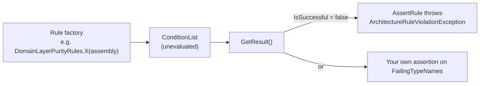

# SharedKernel.ArchitectureTests

[](https://dotnet.microsoft.com/)
[](https://github.com/Gresta-Vertex-Labs/platform-shared-kernel/blob/main/LICENSE)


> **Ready-made NetArchTest and Mono.Cecil rules you assert from your own test suite: domain purity, provider
> isolation, forbidden injection patterns and IL-level secure-default checks that no compiler warning can express.**

| You get | So that |
| --- | --- |
| 79 static rule factories in 29 classes, returning `ConditionList` | A prose architecture rule becomes a failing test |
| `ArchitectureRuleBase.AssertRule`/`AssertRules` | A violation fails with every offending type named |
| Caller-supplied anchor types, validated | Rules work against your own markers and never pass vacuously on a wrong anchor |
| IL assertion helpers (`SecureDefaultsAssertion`, `PipelineOrderAssertion`, …) | A secure default or a registration order cannot drift silently |
| Public `ICustomRule` predicates | You compose your own rules from the same building blocks |
| No test runner, no assertion library | Use xUnit, NUnit or MSTest, and any assertion style |

## Contents

- [Install](#install)
- [Quick start](#quick-start)
- [How it works](#how-it-works)
- [Recipes](#recipes)
- [Reference](#reference)
- [Testing](#testing)
- [Pitfalls](#pitfalls)
- [Design decisions](#design-decisions)

## Install

```xml
<PackageReference Include="SharedKernel.ArchitectureTests" PrivateAssets="all" />
```

The version comes from your central `SharedKernelVersion` property — every SharedKernel package ships at the same
version. See [Using the packages](https://github.com/Gresta-Vertex-Labs/platform-shared-kernel#using-the-packages).

| Requirement | Value |
| --- | --- |
| Target framework | `net10.0` |
| Tier | Tooling — reference it from a **test project** only (it is a development dependency) |
| Depends on | `NetArchTest.Rules`, `Mono.Cecil`, `Microsoft.Extensions.DependencyInjection.Abstractions`; no other SharedKernel package |
| Namespaces | `SharedKernel.ArchitectureTests.Rules`, `.Helpers`, `.Predicates`, `SharedKernel.ArchitectureTests` (assertions) |

Add a test runner yourself. The package ships its XML documentation, so each rule's offending and compliant patterns
are in IntelliSense.

## Quick start

```csharp
using System.Reflection;
using SharedKernel.ArchitectureTests.Helpers;
using SharedKernel.ArchitectureTests.Rules;
using Xunit;

public sealed class ArchitectureTests : ArchitectureRuleBase
{
    private static readonly Assembly Domain = typeof(Order).Assembly;

    [Fact]
    public void Domain_does_not_read_the_system_clock() =>
        AssertRule(DomainLayerPurityRules.DomainAssembliesNeverCallSystemClock(Domain));

    [Fact]
    public void Domain_does_not_reference_persistence() =>
        AssertRule(PersistenceLayerProtectionRules.DomainAssembliesNeverReferencePersistenceStack(Domain));
}
```

```text
ArchitectureRuleViolationException:
  Architecture rule violated. Failing types: MyApp.Domain.Orders.Order, MyApp.Domain.Pricing.Discount
```

The same names are on `ArchitectureRuleViolationException.FailingTypeNames`.

## How it works



- **Nothing is inspected until `GetResult()`.** Every rule is a static factory; assert through `ArchitectureRuleBase` or
  skip the base class and assert on the result yourself.
- **Arrays.** `RedisTopologyRules.CapabilityPackagesNeverReferenceEachOther`,
  `SearchTopologyRules.ProviderPackagesNeverReferenceEachOther` and
  `IntelligenceTopologyRules.ProviderPackagesNeverReferenceEachOther` return `ConditionList[]` (one per assembly) — pass
  them to `AssertRules(...)`. `StorageTopologyRules.*ForbiddenAssemblyReferences` and
  `PersistenceNamespaceConventionRules.FindMisplacedExtensions` return `IReadOnlyList<string>`: empty when clean.
- **Anchors come from you.** Rules that select types by interface or base class take that type as a parameter and
  validate it (`RuleAnchor`): a class passed where an interface is required throws `ArgumentException` instead of
  selecting zero types and reporting a vacuous pass.
- **IL, not text.** Assertion helpers and several predicates read compiled method bodies through Mono.Cecil, so a check
  cannot pass by reading a comment that still says the right thing.

## Recipes

### 1. Pass your own anchor types

```csharp
AssertRule(GuardPurityRules.GuardAgainstMethodsMustNotThrow(typeof(IGuardClause).Assembly, typeof(IGuardClause)));
AssertRule(DomainGoldStandardRules.DomainServicesMustExtendAbstractBase(
    domain, typeof(IDomainService), typeof(DomainService)));
AssertRule(DomainGoldStandardRules.AggregateFactoriesMustCreateValidationResults(
    domain, typeof(IAggregateFactory<,>), typeof(ValidationResult<>)));
AssertRule(ContractsPurityRules.IntegrationEventImplementationsMustBeSealed(contracts, typeof(IIntegrationEvent)));
```

### 2. Lock a secure default in IL

```csharp
using SharedKernel.ArchitectureTests;

// The options default must stay the secure value.
SecureDefaultsAssertion.AssertEnumPropertyDefaultEquals(
    typeof(MyTlsOptions), nameof(MyTlsOptions.Mode), nameof(TlsMode.VerifyFull));

// Behaviors must be registered in this relative order.
PipelineOrderAssertion.AssertRegistrationOrder(services, typeof(MyAuditBehavior<,>), typeof(MyRetryBehavior<,>));
```

### 3. Compose your own rule

```csharp
Types.InAssembly(myAssembly)
     .That().ImplementInterface(typeof(IMyMarker))
     .Should().MeetCustomRule(new SingleConstructorPredicate());
```

Or implement NetArchTest's `ICustomRule` — `MeetsRule(TypeDefinition)` receives the Mono.Cecil type, so bodies,
attributes and opcodes are reachable. `StringConstantsClassDetector` recognises `static class` of `const string` /
`static readonly string` and collects every such literal, for "no bare literal where a constant exists" checks.

### 4. Make every adopted rule fail once

Add the violation, watch the test go red, remove it. A rule never seen failing may be passing because it inspected
nothing.

## Reference

### Portable and platform rules

Most rules take every assembly, type and forbidden term from you — point them at your own assemblies. Ten classes
police this platform's own package boundaries and name `SharedKernel.*` packages internally; against a service that
references none of those packages they pass trivially: `SharedKernelLayeringRules`, `RedisTopologyRules`,
`CommunicationLayeringRules`, `ApplicationPipelineRules`, `ContractsPurityRules`, `IntelligenceTopologyRules`,
`SearchTopologyRules`, `StorageTopologyRules`, `PersistenceLayerProtectionRules`, `PresentationLayeringRules`.

Package-to-package tier edges are **not** here: every kernel `.csproj` declares a `<SharedKernelTier>` and the build
fails with `SKTIER*` on a forbidden edge. The rules below cover only what the tier matrix cannot express.

### Rule catalog

| Class | Rules |
| --- | --- |
| `SharedKernelLayeringRules` | `ContractsNeverReferencesDomain`, `DomainNeverReferencesContracts`, `ModelNeverReferencesLogging`, `TestingNeverReferencedByProduction` |
| `DomainLayerPurityRules` | `DomainAssembliesNeverReferenceInfrastructure`, `DomainAssembliesNeverContainEventHandlers`, `DomainAssembliesNeverCallSystemClock`, `DomainServicesHaveNoInfrastructureConstructorParameters` |
| `DomainGoldStandardRules` | `DomainServicesMustExtendAbstractBase`, `AggregateFactoriesMustCreateValidationResults` (a factory's `Create` returns `ValidationResult<T>`, never throws) |
| `GuardPurityRules` | `GuardAgainstMethodsMustNotThrow` (no `throw` IL on the functional path) |
| `CoreArchitectureRules` | `DiExtensionsUseTryAddRegistrationConvention` |
| `ContractsPurityRules` | `IntegrationEventsHaveNoNonTrivialMethods`, `ContractsAssembliesHaveNoDomainTypeOnPublicSurface`, `ContractsAssembliesHaveNoResultTypeOnPublicSurface`, `IntegrationEventImplementationsMustBeSealed` |
| `ApplicationPipelineRules` | `BehaviorsNeverReferenceConcreteInfrastructure`, `NoExistingBehaviorMatchesStreamRequestConstraint`, `PipelineNeverReferencesCachingPollyOrHosting`, `PipelineCachingNeverReferencesConcreteInfrastructure` |
| `UnitOfWorkSeamRules` | `SharedContractsAreNotRedeclared` (`IUnitOfWork`, `IRequestContext`, `IAuditTrailWriter` only in `SharedKernel.Execution`) |
| `MetricsInstrumentationRules` | `RequestDurationRecordsIncludeOutcomeTag` |
| `PersistenceLayerProtectionRules` | `OnlyEfUnitOfWorkMayCallSaveChanges`, `RepositoriesMustNotExposeIQueryable`, `DomainAssembliesNeverReferencePersistenceStack` |
| `PersistenceInterfaceOwnershipRules` | `IUserContextDeclaredOnlyInSecurityAbstractions`, `TenantIdentityInterfacesAreNeverRedeclared`, `IReadRepositoryMustNotExposeIQueryable`, `ReadOnlyRepositoriesNeverTrack` |
| `RepositoryContractCompletenessRules` | `AllReadRepositoryImplementorsMustHaveGetByIdAsync`, `AllReadRepositoryImplementorsMustHaveGetByIdsAsync` |
| `EfCorePackageHygieneRules` | `NoSpecificationEvaluatorDowncastInEfCoreAssembly`, `IUnitOfWorkImplementorsMustHaveExactlyOneConstructor`, `ApplicationLayerMustNotReferenceDbContextTransaction`, `NoDirectEfPropertyUsageInEfCoreAssembly` |
| `PersistenceNamespaceConventionRules` | `FindMisplacedExtensions` → `IReadOnlyList<string>` |
| `RedisTopologyRules` | `RedisCoreNeverReferencesCapabilityPackages`, `CapabilityPackagesNeverReferenceEachOther` `[]`, `PubSubNeverReferencesMessaging`, `MessagingNeverReferencesCaching`, `CachingAbstractionsHasNoInfrastructureDependencies`, `CachingAbstractionsReferencesOnlyDependencyInjectionAbstractions`, `CachingAbstractionsDeclaresNoProviderSpecificTypes`, `DistributedLockingNeverReferencesRedLock` |
| `MessagingArchitectureRules` | `NoDirectBusInjectionOutsideMessaging`, `NoEventPublisherInDomainLayer` |
| `ExtendedMessagingArchitectureRules` | `NoDirectMassTransitSchedulerInjection` |
| `StorageTopologyRules` | `AbstractionsHasNoThirdPartyDependencies`, `AbstractionsForbiddenAssemblyReferences` → names, `S3NeverReferencesObs`, `S3ForbiddenAssemblyReferences` → names, `OnlyProviderPackagesMayReferenceAmazonS3` |
| `SearchTopologyRules` | `AbstractionsHasNoThirdPartyDependencies`, `ProviderPackagesNeverReferenceEachOther` `[]` |
| `IntelligenceTopologyRules` | `AbstractionsHasNoThirdPartyDependencies`, `ProviderPackagesNeverReferenceEachOther` `[]`, `NoHealthChecksDependencyAcrossIntelligencePackages` |
| `WorkflowTopologyRules` | `NoRawClientAccessorConsumptionInRepo`, `NoHealthChecksDependencyInWorkflows` |
| `CommunicationLayeringRules` | `NoDirectGrpcInterceptorInheritanceOutsideCommunicationGrpc`, `NoDirectHotChocolateFilterSortInheritanceOutsideGraphQL`, `GrpcNeverReferencesContracts` |
| `PresentationLayeringRules` | `NoDirectProblemDetailsConstructionOutsideWebApi`, `NoInlineResultBranchBeforeHttpResultOutsideWebApi`, `NoOpenApiStackDependencyOutsideOpenApiAddOn`, `GrpcNeverReferencesContracts` |
| `SecurityArchitectureRules` | `DomainNeverReferencesRequestContext`, `NoSingletonRegistrationOfSecurityContextTypes`, `DpopProofValidationNeverDuplicatedOutsideOidc`, `ClientCertificateAccessNeverDuplicatedOutsideMtls` |
| `CryptoIsolationRules` | `CryptographyCoreHasNoThirdPartyDependencies`, `NoRawSymmetricCipherOutsideCryptography` |
| `EncryptionPatternGuardRules` | `NoCryptoCipherInDomainOrApplication`, `NoEncryptionAttributeOnDomainEntities`, `NoEncryptionRotationJobInjectionInDomainOrApplication` |
| `HealthCheckTagIntegrityRules` | `NoConflictingLivenessReadinessTags`, `DependencyHealthChecksCarryReadyNotLive` |
| `HealthCheckConstantsUsageRules` | `NoBareHealthCheckLiteralWhereConstantsExist` |
| `ReflectionGuardRules` | `NoMakeGenericMethodReflection` (exemptions via `ReflectionExemptionRegistry.IsExempt`) |

### Assertion helpers

| Helper | Asserts |
| --- | --- |
| `LoggingEventIdIntegrityAssertion.AssertGloballyUniqueAndInRange` | Every `[LoggerMessage]` `EventId` is unique and inside its domain's range |
| `PipelineOrderAssertion.AssertRegistrationOrder` | Registrations occur in the required relative order (by type, or by simple name for the kernel's internal behaviors) |
| `WellKnownConstantOwnershipAssertion.AssertSoleDeclaration` | A shared constant is declared in exactly one place |
| `SecureDefaultsAssertion.AssertEnumPropertyDefaultEquals` | An options enum defaults to the secure value |
| `SecureDefaultsAssertion.AssertStringCollectionPropertyDefaultEquals` / `…DefaultExcludes` | A default collection matches exactly / omits a forbidden entry |
| `SecureDefaultsAssertion.AssertMethodBodyInvokesMethod` | A method really calls the validation or registration it claims to |
| `SecureDefaultsAssertion.AssertMethodBodyRegistersSingleton` | A registration is actually present |
| `SecureDefaultsAssertion.AssertMethodBodyThrowsExceptionType` | A guard really throws rather than logging and continuing |

### Base class

| Member | Purpose |
| --- | --- |
| `AssertRule(ConditionList)` | Throws `ArchitectureRuleViolationException` listing failing types |
| `AssertRules(params ConditionList[])` | Same, for array-returning rules |
| `GetAssemblyTypes(Assembly)` / `ShouldNotReference(Assembly, string)` | Shortcuts for ad-hoc rules |

## Testing

This package **is** the test tooling: put it in an architecture test project in the unit lane (no Docker needed —
rules read compiled assemblies). Load real assemblies with `typeof(SomeType).Assembly`; never an empty fixture, which
passes vacuously.

## Pitfalls

| Don't | Do | Why |
| --- | --- | --- |
| Trust a rule you have never seen fail | Introduce the violation once, then remove it | A rule that inspects nothing looks identical to one that found nothing |
| Point a platform rule at a service with none of the named packages | Use the portable rules for your own layering | Platform rules pass trivially there |
| Filter by `TypeDefinition.Namespace` in a custom predicate | Walk `DeclaringType` to the outermost type first | Mono.Cecil reports an empty namespace for nested types |
| Use `NotHaveDependencyOn` for an assembly-reference question | Use `AssemblyReferenceAllowListPredicate` | NetArchTest matches namespace prefixes, not assembly names |
| Restate a package tier edge as a rule | Rely on the `SKTIER*` build check | The tier matrix already fails the build |
| Ignore a `ConditionList[]` return | Pass it to `AssertRules` | An unasserted array is never evaluated |

## Design decisions

**Why factories returning `ConditionList`?** The caller chooses runner and assertion style; the package carries neither.

**Why caller-supplied anchors?** The package references no other SharedKernel package, and the same rule works against
your own marker interfaces.

**Why IL assertions?** A secure default is only secure while nobody edits it; checking compiled bodies catches the edit.

---

Part of [Platform.SharedKernel](https://github.com/Gresta-Vertex-Labs/platform-shared-kernel) ·
[00.Governance domain](https://github.com/Gresta-Vertex-Labs/platform-shared-kernel/blob/main/00.Governance/README.md) ·
[MIT license](https://github.com/Gresta-Vertex-Labs/platform-shared-kernel/blob/main/LICENSE)
