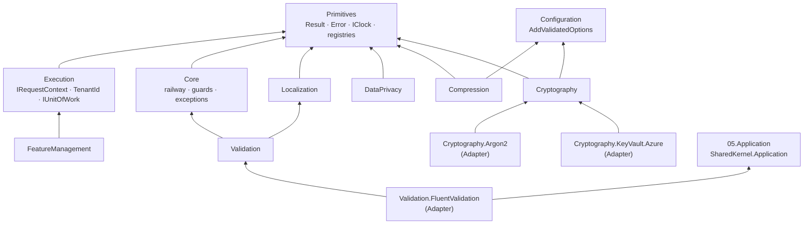

<div align="center">

# 01.Core

**The foundation every Platform.SharedKernel service builds on — results instead of exceptions, one execution context,
validated configuration, and cryptography with nothing to get wrong.**

[](https://dotnet.microsoft.com/)
[](../LICENSE)


</div>

## What this domain gives you

- **Failures as values.** `Result<T>`, `Error` with stable codes and an `ErrorType` that maps mechanically to HTTP and
  gRPC status — plus railway chaining, guard clauses and exception boundaries that never leak exception text.
- **One execution context.** `IRequestContext` answers "who is calling, for which tenant, under which correlation id"
  the same way for HTTP, gRPC, messages, workflows and jobs, and `IUnitOfWork` gives every package one retry-safe transaction.
- **Startup, not first-request, failures.** `AddValidatedOptions` binds and validates configuration, so a wrong
  setting stops the deployment.
- **Security primitives with safe defaults.** AES-256-GCM, signing, password hashing, TOTP, secure random and
  fixed-time comparison — keys from providers you register, including Azure Key Vault.
- **Data you can trust at the edge.** Validated identifiers (`Iban`, `VatNumber`, `CardNumber` …), personal-data
  classification that is redacted in every log line, and translated error messages.
- **Registries that stop drift.** One place for wire header names, baggage and tag keys, and logging `EventId` blocks.

## Packages

| Package | Tier | When you need it |
| --- | --- | --- |
| [SharedKernel.Primitives](SharedKernel.Primitives/README.md) | Foundation | Always — `Result`, `Error`, `IClock`, `SmartEnum`, `IReadinessProbe`, the `WellKnown*` registries |
| [SharedKernel.Execution](SharedKernel.Execution/README.md) | Foundation | Reading the caller or tenant, propagating context, a transaction, an audit record |
| [SharedKernel.Core](SharedKernel.Core/README.md) | Foundation | Chaining results (`Map`, `Bind`, `Ensure`), guard clauses, `ResultTry`, the exception hierarchy |
| [SharedKernel.Configuration](SharedKernel.Configuration/README.md) | Foundation | Registering any options type (`AddValidatedOptions`) |
| [SharedKernel.FeatureManagement](SharedKernel.FeatureManagement/README.md) | Foundation | Feature flags, rollouts, A/B variants through OpenFeature |
| [SharedKernel.Cryptography](SharedKernel.Cryptography/README.md) | Foundation | Encryption, signing, password hashing, TOTP, secure tokens |
| [SharedKernel.Cryptography.Argon2](SharedKernel.Cryptography.Argon2/README.md) | Adapter | Argon2id password hashing instead of PBKDF2 |
| [SharedKernel.Cryptography.KeyVault.Azure](SharedKernel.Cryptography.KeyVault.Azure/README.md) | Adapter | Encryption and signing keys held in Azure Key Vault |
| [SharedKernel.Compression](SharedKernel.Compression/README.md) | Foundation | Compressing payloads with truncation detection and a decompression-bomb cap |
| [SharedKernel.Validation](SharedKernel.Validation/README.md) | Foundation | Parsing IBANs, VAT numbers, cards, national IDs, phone numbers, ISO codes at the edge |
| [SharedKernel.Validation.FluentValidation](SharedKernel.Validation.FluentValidation/README.md) | Adapter | FluentValidation rules for those identifiers, and running `IValidator<T>` in the request pipeline |
| [SharedKernel.DataPrivacy](SharedKernel.DataPrivacy/README.md) | Foundation | Keeping personal data out of logs; GDPR/KVKK export and erasure |
| [SharedKernel.Localization](SharedKernel.Localization/README.md) | Foundation | Translated error messages with typed, named arguments |

Foundation packages reference only other Foundation packages and may be referenced from any project of a service. The
three Adapter packages each wrap one third-party library (Konscious, the Azure SDK, FluentValidation) so it never
becomes a transitive dependency of the base package; reference them from Infrastructure (or the host).

## How the packages fit together



Everything above sits under the rest of the kernel: persistence implements `IUnitOfWork` and `IAuditTrailWriter`, every
inbound adapter opens the `RequestContextScope`, every outbound adapter propagates it with `RequestContextPropagation`,
every provider with an external dependency implements `IReadinessProbe`, and the presentation layer maps `ErrorType` to
HTTP/gRPC status and translates messages through the Localization catalog.

## Get started

The smallest useful setup: results and guards, validated options, and field encryption.

**1. Reference the packages** (the version comes from your central `SharedKernelVersion` property — every package ships
at the same version):

```xml
<PackageReference Include="SharedKernel.Primitives" />
<PackageReference Include="SharedKernel.Core" />
<PackageReference Include="SharedKernel.Configuration" />
<PackageReference Include="SharedKernel.Cryptography" />
```

**2. Register** in `Program.cs`:

```csharp
using SharedKernel.Configuration.Extensions;
using SharedKernel.Cryptography.Extensions;
using SharedKernel.Cryptography.Symmetric;
using SharedKernel.Primitives.Clocks;

builder.Services.AddClock();
builder.Services.AddValidatedOptions<PayoutOptions>(builder.Configuration);   // fails StartAsync when invalid

IConfigurationSection keys = builder.Configuration.GetRequiredSection("Encryption:Keys");
builder.Services.AddSingleton<IEncryptionKeyProvider>(new StaticEncryptionKeyProvider(
    currentKeyId: "2026-09",
    keys.GetChildren().Select(k => new CryptographicKey(k.Key, Convert.FromBase64String(k.Value!)))));
builder.Services.AddSharedKernelCryptography(builder.Configuration).AddSymmetricEncryption();
```

**3. Configure** `appsettings.json` (keys belong in your secret store):

```json
{
  "Payouts": { "MaxAmount": 10000 },
  "Encryption": { "Keys": { "2026-09": "<base64 of 32 random bytes>" } }
}
```

**4. Use it:**

```csharp
using System.ComponentModel.DataAnnotations;
using System.Text;
using Microsoft.Extensions.Options;
using SharedKernel.Configuration;
using SharedKernel.Core.Extensions;
using SharedKernel.Cryptography.Symmetric;
using SharedKernel.Guards;
using SharedKernel.Primitives.Errors;
using SharedKernel.Primitives.Results;

public sealed class PayoutOptions : ISectionBoundOptions
{
    public static string SectionName => "Payouts";

    [Range(1, 1_000_000)] public decimal MaxAmount { get; set; }
}

public sealed class PayoutService(IOptions<PayoutOptions> options, ISymmetricEncryptionService encryption)
{
    public async Task<Result<string>> PrepareAsync(Guid payoutId, string? accountNumber, decimal amount, CancellationToken ct) =>
        await (Guard.Against.NullOrWhiteSpace(accountNumber) ?? Guard.Against.NegativeOrZero(amount))
            .ToResult(() => amount)
            .Ensure(a => a <= options.Value.MaxAmount,
                    Error.BusinessRule("payout.over_limit", "The payout exceeds the configured limit."))
            .Map(_ => encryption.EncryptToStringAsync(
                accountNumber!, Encoding.UTF8.GetBytes($"payouts/{payoutId}/account"), ct).AsTask());
}
```

A missing or out-of-range `Payouts:MaxAmount` stops the host at startup; a blank account number or a negative amount
comes back as a `validation.*` error; an amount over the limit as `payout.over_limit`; and the stored account number is
bound to its payout, so it cannot be copied to another row.

## Where it is used

Every service in [`samples/`](../samples/README.md) is built on these packages; [`samples/OrderApi`](../samples/OrderApi)
is the reference for wiring a new service, with an architecture test on each project's kernel references. Request context
and correlation propagation are proven end to end across HTTP, gRPC, messaging and workflows by the platform's own
integration tests.

## Guarantees

- **No exceptions for expected failures.** Decrypting, decompressing, parsing an identifier or translating a message
  returns a `Result` or falls back — it never throws on bad input.
- **Validated at startup.** Every options type is registered through `AddValidatedOptions` with `ValidateOnStart`.
- **No secrets in output.** `ResultTry` never copies exception text into an `Error`; error messages never repeat a
  rejected identifier; card and national-ID numbers mask themselves; classified personal data is redacted in logs.
- **Fail closed on tenancy.** "No tenant" is `null`, never `Guid.Empty`; a propagated header never grants a permission.
- **Stable wire formats.** Header, baggage and tag names, error codes, `ErrorType` values, encrypted payload, envelope,
  password-hash and compression frame formats are versioned or permanent.
- **Tracked public API.** Every package records its API with `PublicApiAnalyzers`, documents every public member, and
  registers services with `TryAdd`, so a registration you make first always wins.
- **BCL-only where it matters.** Primitives, Execution, Core, Cryptography and Compression take no third-party dependency.

## For maintainers

Maintainer rules live in [CLAUDE.md](CLAUDE.md), phase history in [state-map.md](state-map.md), and contribution
guidelines in [CONTRIBUTING.md](../CONTRIBUTING.md).
