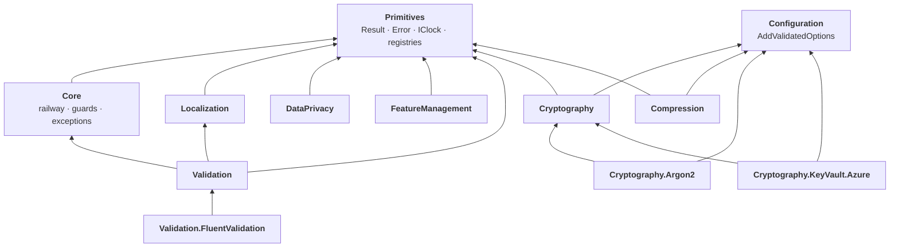

# 01.Core

[](https://dotnet.microsoft.com/)
[](https://github.com/Gresta-Vertex-Labs/platform-shared-kernel/blob/main/LICENSE)


> **The foundation of Platform.SharedKernel: twelve small NuGet packages every .NET 10 service builds on. Results
> instead of exceptions, validated configuration, cryptography with nothing to get wrong, validated identifiers,
> personal-data protection, translated errors, feature flags and safe compression.**

Everything in the platform sits on this layer, and this layer depends on nothing else in the platform. Each package
does one job, installs on its own, and follows the same rules: expected failures come back as `Result` values with a
stable error code, misconfiguration stops the host at startup instead of failing the first request, and nothing it
logs or returns leaks a secret.

```csharp
// One handler, five packages: a feature flag, a translated error, a validated IBAN, a railway chain.
public async Task<Result<Guid>> HandleAsync(CreatePayout command, CancellationToken ct)
{
    if (!await flags.IsEnabledAsync(Flags.InstantPayouts, ct))                       // FeatureManagement
        return PayoutMessages.Disabled.ToError(ErrorType.Forbidden);                  // Localization

    return await Iban.Create(command.Iban)                                           // Validation
        .Ensure(iban => iban.CountryCode != blockedCountry, PayoutErrors.CountryBlocked)   // Core
        .Bind(iban => payouts.CreateAsync(iban, command.Amount, ct));                 // Result<Guid>, never a throw
}
```

## Contents

- [The packages](#the-packages)
- [Which package do I need?](#which-package-do-i-need)
- [How the packages fit together](#how-the-packages-fit-together)
- [Install](#install)
- [A tour in code](#a-tour-in-code)
- [Conventions every package follows](#conventions-every-package-follows)
- [Status and versions](#status-and-versions)
- [Analyzers that guard this layer](#analyzers-that-guard-this-layer)
- [Deliberately not here](#deliberately-not-here)
- [AI quick reference](#ai-quick-reference)

## The packages

| Package | What you get | Beyond `Microsoft.Extensions.*` |
| --- | --- | --- |
| [**Primitives**](SharedKernel.Primitives/README.md) | `Result<T>`, `Error` with stable codes, `ValidationResult`, `IClock`, `IIdGenerator` (UUID v7), `SmartEnum`, and the shared registries: `LoggingEventIdRanges`, `WellKnownHeaders`, `WellKnownBaggageKeys`, `WellKnownTagKeys` | — |
| [**Core**](SharedKernel.Core/README.md) | Railway chaining (`Map`, `Bind`, `Ensure`, `Tap`, `Match`), `ResultTry`, `ResultCombine`, guard clauses (`Guard.Against` returns an error, `Guard.Throw` throws), an exception hierarchy that carries an `Error` | — |
| [**Configuration**](SharedKernel.Configuration/README.md) | `AddValidatedOptions`: bind, validate, fail at startup. `ISectionBoundOptions` puts the section path on the type; opt-in strictness rejects misspelled sections and keys | — |
| [**Cryptography**](SharedKernel.Cryptography/README.md) | AES-256-GCM (async and synchronous), envelope encryption, HKDF subkeys, key rotation, RSA/ECDSA signing, HMAC, PBKDF2 password hashing with pepper and rehash-on-verify, TOTP/HOTP with replay protection, secure random, fixed-time comparison | — |
| [**Cryptography.Argon2**](SharedKernel.Cryptography.Argon2/README.md) | Argon2id behind `IOneWayHasher`, switched on by one setting; existing hashes upgrade as users sign in | Konscious.Security.Cryptography.Argon2 |
| [**Cryptography.KeyVault.Azure**](SharedKernel.Cryptography.KeyVault.Azure/README.md) | Azure Key Vault encryption keys wrapped by a master key that never leaves the vault, signing inside the vault, one-call rotation, a readiness probe | Azure.Security.KeyVault.Keys, Azure.Security.KeyVault.Secrets, Azure.Identity |
| [**Compression**](SharedKernel.Compression/README.md) | Framed Brotli (default) and gzip that detect truncation, a raw mode for external interop, a 64 MiB decompression cap against bombs | — |
| [**Validation**](SharedKernel.Validation/README.md) | Value types parsed at the edge: `Iban` (full SWIFT registry), `Bic`, `CardNumber` (masked), `VatNumber` (EU, UK, CH, NO, TR), `NationalId`, `PhoneNumber`, ISO country and currency codes, `Lei`, ABA, SEPA creditor ID. Errors are translatable; Turkish ships in the box | — |
| [**Validation.FluentValidation**](SharedKernel.Validation.FluentValidation/README.md) | A rule for every Validation type: `MustBeValidIban()`, `MustBeValidVatNumber(x => x.Country)` … | FluentValidation |
| [**DataPrivacy**](SharedKernel.DataPrivacy/README.md) | 23 kinds of personal data, including every GDPR and KVKK special category, as attributes that mask values in logs; masking helpers, HMAC pseudonymization, idempotent data-subject export and erasure | — |
| [**Localization**](SharedKernel.Localization/README.md) | Typed message definitions whose errors carry their values, named placeholders, one immutable catalog from JSON or `.resx`, validated at startup | — |
| [**FeatureManagement**](SharedKernel.FeatureManagement/README.md) | Feature flags on OpenFeature's `IFeatureClient`: typed `FeatureFlag<T>`, the caller's user and tenant (from the accessor your service registers) applied to every evaluation, one answer per request, never throws, checked at startup | OpenFeature, Microsoft.FeatureManagement |

Every package targets `net10.0`. A dash means the package needs nothing beyond the .NET runtime and
`Microsoft.Extensions.*` abstractions.

## Which package do I need?

| I want to… | Package | Start with |
| --- | --- | --- |
| Return a failure without throwing | Primitives | `Result<T>`, `Error.NotFound(code, message)` |
| Chain steps that can fail | Core | `.Ensure(...).Bind(...).Map(...)` |
| Check arguments and invariants | Core | `Guard.Against.*` returns `Error?`; `Guard.Throw.*` throws |
| Turn a throwing call into a result | Core | `ResultTry.TryAsync(...)` |
| Report every validation error at once | Primitives, Core | `ValidationResult`, `ResultCombine.Combine(...)` |
| Read the time in a testable way | Primitives | inject `IClock` |
| Generate database-friendly ids | Primitives | `UuidV7IdGenerator` |
| Bind settings that must be valid | Configuration | `AddValidatedOptions<T>(configuration)` |
| Encrypt a field, a message or a file | Cryptography | `ISymmetricEncryptionService`, `IEnvelopeEncryptionService` |
| Hash a password or an API key | Cryptography (+ Argon2) | `IOneWayHasher` |
| Sign a receipt or a token | Cryptography (+ KeyVault.Azure) | `IAsymmetricSignatureService` |
| Add two-factor codes | Cryptography | `ITotpGenerator`, `ITotpVerifier` |
| Keep keys in Azure Key Vault | Cryptography.KeyVault.Azure | `.AddAzureKeyVaultEncryption(configuration)` |
| Compress a payload safely | Compression | `IPayloadCompressor` |
| Accept an IBAN, card, VAT number or national ID | Validation | `Iban.Create(value)` → `Result<Iban>` |
| Validate those in FluentValidation | Validation.FluentValidation | `RuleFor(x => x.Iban).MustBeValidIban()` |
| Keep personal data out of logs | DataPrivacy | `[EmailAddressData]` + `SetPrivacyRedactors()` |
| Answer a GDPR or KVKK export or erasure request | DataPrivacy | `IDataSubjectRequestHandler` |
| Show errors in the caller's language | Localization | `LocalizedMessage.Define(...)` + a JSON catalog |
| Turn a feature on for some users or tenants | FeatureManagement | `FeatureFlag.Boolean(...)` + `IFeatureClient` |

## How the packages fit together



*An arrow points from a package to one it references. Primitives and Configuration reference no other SharedKernel
package, so a service can take either on its own.*

**Where this layer sits.** Every other domain in the platform (`03.Domain`, `05.Application`, `14.Presentation`, …)
builds on these packages, and `01.Core` references nothing above it. That is what lets a domain model, a contract
package and an HTTP host share one `Result`, one `Error` and one set of error codes.

## Install

The packages are published to GitHub Packages. Add the feed once, in a `nuget.config` at your repository root:

```xml
<configuration>
  <packageSources>
    <add key="nuget.org" value="https://api.nuget.org/v3/index.json" />
    <add key="shared-kernel" value="https://nuget.pkg.github.com/Gresta-Vertex-Labs/index.json" />
  </packageSources>
  <packageSourceMapping>
    <packageSource key="shared-kernel"><package pattern="SharedKernel.*" /></packageSource>
    <packageSource key="nuget.org"><package pattern="*" /></packageSource>
  </packageSourceMapping>
</configuration>
```

GitHub Packages needs a token even to read: a personal access token with `read:packages` locally, or `GITHUB_TOKEN`
in GitHub Actions. Then install what you use:

```shell
dotnet add package SharedKernel.Primitives
dotnet add package SharedKernel.Core
dotnet add package SharedKernel.Configuration
# …and any other package from the table above
```

## A tour in code

Each snippet comes from its package's README, where the full story, recipes and pitfalls live.

**Primitives and Core: failures are values.**

```csharp
Result<Order> Find(Guid id) =>
    repository.Get(id) is { } order
        ? order
        : Error.NotFound("order.not_found", $"Order {id} does not exist.");

Result<OrderDto> dto = Find(id)
    .Ensure(order => order.IsOpen, OrderErrors.Closed)
    .Map(order => order.ToDto());
```

**Configuration: wrong settings stop the deployment.**

```csharp
public sealed class DatabaseOptions : ISectionBoundOptions
{
    public static string SectionName => "MyService:Database";

    [Required]       public string ConnectionString { get; set; } = string.Empty;
    [Range(1, 1000)] public int    MaxConnections   { get; set; } = 10;
}

builder.Services.AddValidatedOptions<DatabaseOptions>(builder.Configuration);   // missing or out of range: the host does not start
```

**Cryptography: the context is part of the ciphertext.**

```csharp
builder.Services.AddSharedKernelCryptography(builder.Configuration).AddSymmetricEncryption();

string stored = await encryption.EncryptToStringAsync(diagnosis, Encoding.UTF8.GetBytes($"patients/{id}/diagnosis"), ct);
// Copied into another row or column, it fails to decrypt.
```

**Validation: parse once at the edge, keep the typed value.**

```csharp
Result<Iban> iban = Iban.Create("de89 3704 0044 0532 0130 00");    // Value "DE89370400440532013000"
CardNumber card = CardNumber.Parse("4111 1111 1111 1111", null);   // card.ToString() == "411111******1111"

public sealed record CreatePayout(Iban Iban, CurrencyCode Currency, decimal Amount);   // binds from JSON and routes
```

**DataPrivacy: mark it once, masked in every log line.**

```csharp
[LoggerMessage(EventId = 5101, Level = LogLevel.Information, Message = "Customer {Email} signed up.")]
public static partial void SignedUp(ILogger logger, [EmailAddressData] string email);   // "Customer j***@example.com signed up."
```

**Localization: one definition, every language.**

```csharp
public static readonly LocalizedMessage<Guid> NotFound = LocalizedMessage.Define<Guid>(
    "order.not_found", "Order {orderId} was not found.", "orderId");

return OrderMessages.NotFound.ToError(ErrorType.NotFound, orderId);   // tr-TR caller: "… numaralı sipariş bulunamadı."
```

**FeatureManagement: typed flags that know who is asking.**

```csharp
public static readonly FeatureFlag<bool> NewCheckout = FeatureFlag.Boolean("NewCheckout");

if (await flags.IsEnabledAsync(NewCheckout, ct)) { ... }   // targets the user and tenant your accessor reports; never throws
```

**Compression: a cut-off payload is an error, not a shorter result.**

```csharp
byte[] packed = compressor.Compress(json);
Result<byte[]> unpacked = compressor.Decompress(stored);   // "compression.truncated_payload", never a valid-looking prefix
```

## Conventions every package follows

| Convention | What it means for you |
| --- | --- |
| **Expected failures are `Result` values** | Invalid input, a missing record or a failed decryption comes back as an `Error` with a stable `Code` such as `validation.iban.invalid_check_digits`. Exceptions are for bugs |
| **Error codes are contracts** | Dot-separated, lowercase, never interpolated. Clients branch on them, dashboards group by them, Localization translates by them |
| **Misconfiguration fails at startup** | Options, localization catalogs and flags declared with `ValidateOnStart` are checked when the host starts, not when a request first needs them |
| **Registering is safe to repeat** | Registrations use `TryAdd`, so an implementation you register *before* the package's call wins. `AddLocalizationCatalog` and `AddSharedKernelFeatureManagement` throw on a second call instead of silently ignoring your settings |
| **Time comes from `IClock`** | No package reads `DateTime.UtcNow`, so tests control time |
| **No secrets in messages** | Error messages may reach users and logs, so they never carry exception text, keys, card numbers or national IDs |
| **Structured logging** | Packages that log use `[LoggerMessage]` with `EventId`s from this layer's range, 1000-1999, one 100-wide block per package |
| **Documented, tracked public API** | Every package ships XML docs and fails the build on an undocumented public member or an untracked API change (`PublicApiAnalyzers`), so an accidental breaking change cannot slip into a release |
| **Reflection only where it cannot be avoided** | JSON goes through source-generated `JsonTypeInfo<T>`. Configuration binding is reflective by nature, so Configuration and the registration methods that bind options are not trim- or AOT-safe, and neither is FeatureManagement, whose backend binds filters by reflection |

## Status and versions

All twelve packages are on GitHub Packages. Each went through a pre-publish review that could still change its API
before the first release.

| Package | Latest version | Review |
| --- | --- | --- |
| FeatureManagement | `1.0.0-alpha.0.1112` | P-555: OpenFeature, working targeting, one answer per request |
| Primitives | `1.0.0-alpha.0.1112` | republished with each review |
| DataPrivacy | `1.0.0-alpha.0.1106` | P-554: Microsoft compliance model, GDPR/KVKK taxonomy |
| Validation, Validation.FluentValidation | `1.0.0-alpha.0.1100` | P-553: value types, full SWIFT registry, translatable errors |
| Localization | `1.0.0-alpha.0.1100` | P-552: typed messages, validated catalogs |
| Core | `1.0.0-alpha.0.1100` | republished with P-553 |
| Compression | `1.0.0-alpha.0.1088` | P-551: truncation-detecting frame, decompression cap |
| Configuration | `1.0.0-alpha.0.1088` | republished with P-551 |
| Cryptography | `1.0.0-alpha.0.1066` | P-545: FIPS-approved defaults, async and synchronous services |
| Cryptography.Argon2, Cryptography.KeyVault.Azure | `1.0.0-alpha.0.998` | P-545 |

Versions come from one repository-wide counter (MinVer), so a higher number always contains every earlier change. They
differ here only because each package was published when its own review finished; a package's dependencies are always
published at a version at least as new as the package itself.

## Analyzers that guard this layer

`SharedKernel.Analyzers`, from `00.Governance`, turns the rules above into build warnings in the services that use
these packages:

| Rule | Flags |
| --- | --- |
| SK0001 | `DateTime.UtcNow` or `DateTimeOffset.UtcNow` instead of an injected `IClock` |
| SK0002 | `Microsoft.FeatureManagement`'s evaluators or OpenFeature's `Api.Instance` instead of `IFeatureClient` |
| SK0022 | A raw string where a header, baggage or tag constant from Primitives exists |
| SK0030 | A `Result` returned by a call and never checked |
| SK0035 | A value marked as personal data passed to an unmarked log parameter |

## Deliberately not here

- **Business vocabulary.** `Money`, entities and aggregates are `03.Domain`; this layer has no domain concepts.
- **HTTP.** Turning an `Error` into a ProblemDetails response is `14.Presentation`; no package here references ASP.NET
  Core.
- **Health-check wiring.** Probes such as the Key Vault readiness probe are defined here and wired into health
  endpoints by `13.ServiceDefaults`.
- **Test doubles.** `FakeFeatureClient`, the cryptography fakes and the others live in `16.Testing`, so no production
  package carries test code.

## AI quick reference

```text
LAYER       01.Core references nothing else in the platform; every other domain may reference it. net10.0.
RESULTS     Result<T> / Result / ValidationResult (Primitives). Error(Code, Message, Type): Error.Validation | NotFound |
            Conflict | Unauthorized | Forbidden | BusinessRule | Unexpected | Unavailable (503) | Timeout (504). Codes
            dot.separated.lowercase, stable, never interpolated; check ErrorCodes first. Error.None, never null. Value on a
            failure throws.
CHAINING    Core: Map Bind Ensure Tap Match (sync, Task, ValueTask); ResultTry.Try/TryAsync; ResultCombine.Combine;
            Guard.Against.X(value) -> Error? (null = passed); Guard.Throw.X(value) throws DomainException.
TIME / IDS  inject IClock (SK0001); IIdGenerator / UuidV7IdGenerator; LoggingEventIdRanges.Core = 1000.
OPTIONS     AddValidatedOptions<T>(configuration) with ISectionBoundOptions.SectionName; fails at host start;
            OptionsStrictness.RequireSection | RejectUnknownKeys.
CRYPTO      AddSharedKernelCryptography(configuration).AddSymmetricEncryption() / AddEnvelopeEncryption() /
            AddAsymmetricSigning() / AddTotpVerification(); associated data required on every encrypt and decrypt;
            IOneWayHasher (PBKDF2 default; .AddArgon2id); FixedTimeComparison; ISecureRandomGenerator.
            Key Vault: .AddAzureKeyVaultEncryption(configuration) / .AddAzureKeyVaultSigning(configuration).
COMPRESS    AddSharedKernelCompression(configuration); IPayloadCompressor.Compress -> byte[]; Decompress -> Result<byte[]>.
VALIDATE    Iban / Bic / CardNumber / VatNumber / NationalId / PhoneNumber / CountryCode / CurrencyCode / Lei .Create(v)
            -> Result<T>; IParsable + JSON converters; FluentValidation: MustBeValidIban() etc.;
            catalog.AddValidationTranslations() adds Turkish.
PRIVACY     [XxxData] attributes (23 kinds) + services.AddRedaction(r => r.SetPrivacyRedactors()) +
            logging.EnableRedaction(o => o.ApplyDiscriminator = false); PiiMasking.*; Pseudonymizer; IDataSubjectRequestHandler.
LOCALIZE    LocalizedMessage.Define<T..>(code, "text {name}", "name").ToError(type, value);
            AddLocalizationCatalog(c => c.AddJsonDirectory(path)), once.
FLAGS       FeatureFlag.Boolean / String / Integer / Double / Object<T>; inject OpenFeature IFeatureClient (scoped);
            IsEnabledAsync / GetValueAsync / GetDetailsAsync;
            AddSharedKernelFeatureManagement(rootConfiguration, o => o.ValidateOnStart(...)); register your own
            IFeatureTargetingContextAccessor for targeting (none by default; never read from baggage).
DI          TryAdd everywhere: register overrides BEFORE the package call. AddLocalizationCatalog and
            AddSharedKernelFeatureManagement throw on a second call.
FORBIDDEN   DateTime.UtcNow; throwing for expected failures; interpolated error codes; secrets in messages;
            ILogger.LogX / LoggerMessage.Define; raw header, baggage or tag strings; Microsoft IFeatureManager; Api.Instance.
```

Part of [Platform.SharedKernel](https://github.com/Gresta-Vertex-Labs/platform-shared-kernel). Maintainer rules for this
layer are in [`CLAUDE.md`](CLAUDE.md), and its phase history is in [`state-map.md`](state-map.md).
