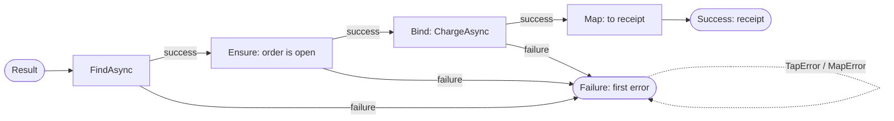

# SharedKernel.Core


**Result chaining, guard clauses, and exception boundaries for .NET services built on [`SharedKernel.Primitives`](../SharedKernel.Primitives/README.md).**

`SharedKernel.Primitives` defines `Result<T>`, `Result`, and `Error`. This package gives you the operations you use them with every day:

- **Railway extensions:** chain steps that can fail with `Map`, `Bind`, `Ensure`, `Tap`, and `Match`, synchronously or with `Task` and `ValueTask`.
- **Guard clauses:** validate input on two paths. `Guard.Against` returns an `Error`, and `Guard.Throw` throws.
- **Exception boundaries:** `ResultTry` turns a throwing call into a failed result without leaking the exception text.
- **Aggregation:** `ResultCombine` and `Guard.Collect` report every failure, not just the first.
- **An exception hierarchy** in which every exception carries a structured `Error`, plus `error.ToException()`.

## Contents

- [Install](#install)
- [At a glance](#at-a-glance)
- [Namespaces](#namespaces)
- [Guard clauses](#guard-clauses)
  - [Choosing a path](#choosing-a-path)
  - [Functional path: Guard.Against](#functional-path-guardagainst)
  - [Imperative path: Guard.Throw](#imperative-path-guardthrow)
  - [Guard reference](#guard-reference)
  - [Guard behaviour](#guard-behaviour)
  - [Writing your own guard](#writing-your-own-guard)
- [Railway extensions](#railway-extensions)
  - [How a chain flows](#how-a-chain-flows)
  - [Operation reference](#operation-reference)
  - [Async chains](#async-chains)
  - [Leaving the railway](#leaving-the-railway)
- [Exception boundaries: ResultTry](#exception-boundaries-resulttry)
- [Reporting every failure](#reporting-every-failure)
- [Exceptions](#exceptions)
- [Identifier and collection helpers](#identifier-and-collection-helpers)
- [Error codes used by this package](#error-codes-used-by-this-package)
- [Compatibility and guarantees](#compatibility-and-guarantees)
- [Deliberately not included](#deliberately-not-included)

## Install

```shell
dotnet add package SharedKernel.Core
```

| Requirement | Value |
| --- | --- |
| Target framework | `net10.0` |
| Dependencies | `SharedKernel.Primitives` only (which itself depends on `Microsoft.Extensions.DependencyInjection.Abstractions`) |
| Registration | None. Everything is a static method or an extension method. |

## At a glance

```csharp
using SharedKernel.Core.Exceptions;
using SharedKernel.Core.Extensions;
using SharedKernel.Guards;
using SharedKernel.Primitives.Errors;
using SharedKernel.Primitives.Results;

public sealed class Customer
{
    public string Name { get; }
    public string Email { get; }

    // Invariants: a violation throws DomainException.
    public Customer(string? name, string? email)
    {
        Guard.Throw.NullOrWhiteSpace(name);
        Guard.Throw.Email(email);

        Name = name;      // the compiler knows these are non-null now
        Email = email;
    }

    // Expected failures: return an Error instead of throwing.
    public static Result<Customer> Create(string? name, string? email) =>
        (Guard.Against.NullOrWhiteSpace(name) ?? Guard.Against.Email(email))
            .ToResult(() => new Customer(name, email));
}

public sealed class RegisterCustomer(ICustomerRepository customers, IWelcomeMailer mailer)
{
    public Task<Result<Guid>> HandleAsync(string? name, string? email, CancellationToken ct) =>
        Customer.Create(name, email)
            .Ensure(customer => !customers.EmailExists(customer.Email),
                    Error.Conflict(ErrorCodes.Conflict.Duplicate, "That email address is already registered."))
            .Bind(customer => ResultTry.TryAsync(token => customers.AddAsync(customer, token), ct))
            .Tap(id => mailer.QueueWelcome(id));
}
```

Every step after a failure is skipped, and the first `Error` reaches the caller unchanged. `customers.AddAsync` throws on a database fault; `ResultTry` turns that into a failed result with a safe message and records the exception on the current trace.

## Namespaces

| Namespace | Contains |
| --- | --- |
| `SharedKernel.Guards` | `Guard`, `Guard.Against.*`, `Guard.Throw.*`, `Guard.Collect`, `ToResult`, `IGuardClause` |
| `SharedKernel.Core.Extensions` | `ResultExtensions`, `ResultTry`, `ResultCombine`, string, sequence, and date helpers |
| `SharedKernel.Core.Exceptions` | `SharedKernelException` and its subclasses, `ToException` |

## Guard clauses

A guard checks one precondition. Every guard exists on both paths, with the same name and parameters, and a violation produces the same `Error` on either path.

### Choosing a path

| | `Guard.Against.*` | `Guard.Throw.*` |
| --- | --- | --- |
| **Returns** | `Error?`: `null` when valid | nothing |
| **On violation** | returns a validation `Error` | throws `DomainException` carrying that `Error` |
| **Use in** | factory methods, handlers, anything returning `Result<T>` | constructors, aggregate methods, invariants |
| **Means** | invalid input is an expected outcome | a violation is a broken invariant |

### Functional path: Guard.Against

Chain with `??` to stop at the first violation:

```csharp
public static Result<Money> Create(decimal amount, string? currency) =>
    (Guard.Against.Negative(amount)
     ?? Guard.Against.NullOrWhiteSpace(currency)
     ?? Guard.Against.LongerThan(currency, maxLength: 3))
    .ToResult(() => new Money(amount, currency!));
```

`ToResult` has three forms:

| Call | Result when every guard passed |
| --- | --- |
| `error.ToResult()` | `Result.Success()` |
| `error.ToResult(value)` | `Result<T>.Success(value)`; the value is evaluated first |
| `error.ToResult(() => value)` | `Result<T>.Success(factory())`; the factory runs only when every guard passed |

When a guard fails, each form returns a failure carrying that error. Use the factory form when building the value would throw for invalid input.

To report every violation at once, run all the guards and collect them:

```csharp
ValidationResult validation = Guard.Collect(
    Guard.Against.NullOrWhiteSpace(request.Name),
    Guard.Against.Email(request.Email),
    Guard.Against.OutOfRange(request.Quantity, 1, 100),
    Guard.Against.NotUtc(request.DeliverAt));

if (!validation.IsValid)
{
    // validation.Errors holds one Error per failed guard, in argument order.
}
```

### Imperative path: Guard.Throw

```csharp
public sealed class Payment
{
    public Payment(decimal amount, string? currency, IReadOnlyList<PaymentLine>? lines)
    {
        Guard.Throw.NegativeOrZero(amount);
        Guard.Throw.NullOrWhiteSpace(currency);
        Guard.Throw.Empty(lines);

        Amount = amount;
        Currency = currency;   // [NotNull]: no nullable warning
        Lines = lines;
    }

    public decimal Amount { get; }
    public string Currency { get; }
    public IReadOnlyList<PaymentLine> Lines { get; }
}
```

A violation throws `DomainException`. Its `Error` has type `Validation`, so a presentation layer that maps by `Error.Type` returns HTTP 400 with the guard's message.

### Guard reference

`{name}` is the source text of the checked argument, for example `request.Email`.

| Guard | Violation | `Error.Code` | Message |
| --- | --- | --- | --- |
| `Null(value)` | `null` (reference or `Nullable<T>`) | `validation.required` | `'{name}' must not be null.` |
| `NullOrEmpty(value)` | `null` or `""` | `validation.required` | `'{name}' must not be null or empty.` |
| `NullOrWhiteSpace(value)` | `null`, `""`, or only whitespace | `validation.required` | `'{name}' must not be null, empty, or whitespace.` |
| `ShorterThan(value, minLength)` | `Length < minLength` | `validation.min_length` | `'{name}' must be at least {minLength} character(s) long.` |
| `LongerThan(value, maxLength)` | `Length > maxLength` | `validation.max_length` | `'{name}' must be at most {maxLength} character(s) long.` |
| `Negative(value)` | `< 0` or `NaN`; any numeric type | `validation.out_of_range` | `'{name}' must be zero or greater.` |
| `NegativeOrZero(value)` | `<= 0` or `NaN`; any numeric type | `validation.out_of_range` | `'{name}' must be greater than zero.` |
| `OutOfRange(value, min, max)` | outside `[min, max]` | `validation.out_of_range` | `'{name}' must be between {min} and {max} (inclusive).` |
| `LessThan(value, min)` | `< min` | `validation.out_of_range` | `'{name}' must be at least {min}.` |
| `GreaterThan(value, max)` | `> max` | `validation.out_of_range` | `'{name}' must be at most {max}.` |
| `Default(value)` | equals `default(T)` | `validation.required` | `'{name}' must not be the default value for its type.` |
| `InvalidGuid(value)` | `Guid.Empty` | `validation.required` | `'{name}' must not be an empty GUID.` |
| `InvalidEnumValue(value)` | not a named member, e.g. `(Status)99` | `validation.out_of_range` | `'{name}' is not a defined {EnumType} value.` |
| `NotUtc(DateTimeOffset)` | offset is not zero | `validation.invalid_format` | `'{name}' must be a UTC date and time.` |
| `NotUtc(DateTime)` | kind is `Local` or `Unspecified` | `validation.invalid_format` | `'{name}' must be a UTC date and time.` |
| `InvalidFormat(value, pattern)` | no regex match, or match timed out | `validation.invalid_format` | `'{name}' is not in the required format.` |
| `Email(value)` | not shaped like `local@domain.tld` | `validation.invalid_format` | `'{name}' is not a valid email address.` |
| `Empty(source)` | no elements | `validation.required` | `'{name}' must not be an empty collection.` |
| `MinCount(source, min)` | fewer than `min` elements | `validation.out_of_range` | `'{name}' must contain at least {min} element(s).` |
| `MaxCount(source, max)` | more than `max` elements | `validation.out_of_range` | `'{name}' must contain at most {max} element(s).` |
| `InvalidSmartEnum<TEnum, TValue>(value)` | no member has the value | `validation.out_of_range` | `'{name}' value '{value}' is not a valid {EnumType}.` |
| `True(condition, error)` | `condition` is `false` | your error's code | your error's message |
| `False(condition, error)` | `condition` is `true` | your error's code | your error's message |

A `null` input to `ShorterThan`, `LongerThan`, `OutOfRange`, `LessThan`, `GreaterThan`, `InvalidFormat`, `Empty`, `MinCount`, or `MaxCount` is reported as `validation.required` with the message `'{name}' must not be null.` A blank input to `Email` is reported as `validation.required` with the `NullOrWhiteSpace` message.

### Guard behaviour

- **A guard never throws because of the value it checks.** `Guard.Against` is safe on raw request data, including `null`. It throws only for mistakes in its own arguments: `ArgumentNullException` for a `null` pattern or a `null` error passed to `True`/`False`, and `ArgumentException` for a malformed regular expression.
- **The parameter name is automatic.** Guards use `[CallerArgumentExpression]`, as `ArgumentNullException.ThrowIfNull` does. Passing a name explicitly overrides it.
- **Messages don't depend on the server's culture.** They're formatted with the invariant culture, so `1.25` never becomes `1,25`. Branch and translate on `Error.Code`.
- **The regex pattern is never shown.** `InvalidFormat` leaves it out of the message, because the message can reach an HTTP response.
- **Regex matching is bounded.** Each pattern is compiled once and cached (up to 256 patterns, oldest evicted first). Matching stops after 250 ms, and a timeout is reported as a format violation, not thrown.
- **Collections are read no further than needed.** `Empty` reads at most one element, `MinCount` at most `min`, and `MaxCount` at most `max + 1`. A collection that exposes its count is not enumerated at all.
- **The `Guard.Throw` annotations help the compiler.** Reference, string, and collection parameters are `[NotNull]`, and `True`/`False` are `[DoesNotReturnIf]`, so the compiler's null-state analysis continues after the call.

### Writing your own guard

Write an extension method on `IGuardClause` that returns `Error?` and never throws:

```csharp
using System.Runtime.CompilerServices;
using SharedKernel.Guards;
using SharedKernel.Primitives.Errors;

public static class SkuGuards
{
    public static Error? InvalidSku(
        this IGuardClause guard,
        string? value,
        [CallerArgumentExpression(nameof(value))] string? paramName = null)
        => value is { Length: 8 } && value.All(char.IsAsciiLetterOrDigit)
            ? null
            : Error.Validation("sku.invalid", $"'{paramName}' must be 8 letters or digits.");
}

Error? error = Guard.Against.InvalidSku(request.Sku);
```

It appears under `Guard.Against.` alongside the built-in guards. Analyzer `SK0006` (from `SharedKernel.Analyzers`) reports a `throw` inside guard code.

## Railway extensions

```csharp
using SharedKernel.Core.Extensions;
```

### How a chain flows



Plain-text version, for viewers that don't render Mermaid:

```text
FindAsync ──ok──► Ensure ──ok──► Bind(ChargeAsync) ──ok──► Map ──► Success(receipt)
    │               │                 │
    └──fail─────────┴──────fail───────┴─────────────────────────► Failure(first error)
```

```csharp
Result<ReceiptDto> receipt = await orders.FindAsync(orderId, ct)     // Task<Result<Order>>
    .Ensure(order => order.IsOpen, OrderErrors.Closed)
    .Bind(order => payments.ChargeAsync(order, ct))                   // Task<Result<Payment>>
    .Map(payment => payment.ToReceipt())
    .TapError(error => Log.CheckoutFailed(logger, error.Code));
```

### Operation reference

Every operation exists for `Result<T>` and for the non-generic `Result`.

| Operation | On success | On failure | Returns |
| --- | --- | --- | --- |
| `Map(value => newValue)` | transforms the value | skipped | `Result<TOut>` |
| `Bind(value => nextResult)` | runs the next step | skipped | the step's `Result<TOut>` or `Result` |
| `Ensure(value => condition, error)` | fails with `error` when the condition is false | skipped | same result type |
| `Ensure(value => condition, value => error)` | builds the error from the rejected value | skipped | `Result<T>` |
| `Tap(value => sideEffect)` | runs the side effect | skipped | the source result |
| `TapError(error => sideEffect)` | skipped | runs the side effect | the source result |
| `MapError(error => newError)` | skipped | transforms the error | same result type |
| `Match(onSuccess, onFailure)` | runs `onSuccess` | runs `onFailure` | the function's output |
| `Match(Action, Action<Error>)` | runs the action (`Result` only) | runs the action | `void` |
| `GetValueOrThrow()` | returns the value (`Result<T>` only) | throws `error.ToException()` | `T` |
| `ThrowIfFailure()` | does nothing (`Result` only) | throws `error.ToException()` | `void` |

For `Result`, the delegates take no value: `Map(() => value)`, `Bind(() => nextResult)`, `Tap(() => ...)`, `Ensure(() => condition, error)`.

Every operation throws `ArgumentNullException` for a `null` source `Result<T>` or delegate before running anything. An exception thrown inside a step propagates unchanged; wrap throwing calls in [`ResultTry`](#exception-boundaries-resulttry).

### Async chains

| Source | Synchronous steps | Asynchronous steps | Returns |
| --- | --- | --- | --- |
| `Result<T>` / `Result` | yes | `Task`-returning | `Task<…>` |
| `Task<Result<T>>` / `Task<Result>` | yes | `Task`-returning | `Task<…>` |
| `ValueTask<Result<T>>` / `ValueTask<Result>` | yes | `ValueTask`-returning | `ValueTask<…>` |

```csharp
// Plain result, async step
Result<Invoice> invoice = await Order.Create(command)
    .Bind(order => billing.CreateInvoiceAsync(order, ct));

// ValueTask source, ValueTask step
Result<Price> price = await cache.GetPriceAsync(sku)                  // ValueTask<Result<Price>>
    .Ensure(async p => await rules.IsSellableAsync(p), PricingErrors.NotSellable);
```

Four rules make async chains predictable:

1. **A source takes steps of its own awaitable type.** Mixing `Task` and `ValueTask` steps on one source would make every `async` lambda ambiguous, so it isn't offered. Convert with `AsTask()` when you need to cross over.
2. **Failures and cancellation are not swallowed.** Awaiting a chain rethrows a faulted source's original exception and a cancelled source's `OperationCanceledException`. Neither is turned into a failed result.
3. **A step must not return a `null` task.** A `Task`-returning step that does throws `InvalidOperationException` naming the problem when the chain is awaited.
4. **A lambda whose body only throws needs a return type.** `() => throw new X()` has no return type, so it matches both the sync and async overloads. Write `Result () => throw new X()`.

### Leaving the railway

| You want | Use |
| --- | --- |
| One value for both branches | `Match(onSuccess, onFailure)` |
| The value, or an exception | `GetValueOrThrow()` |
| An exception when a command failed | `ThrowIfFailure()` |
| The matching exception for an error | `error.ToException()` |

## Exception boundaries: ResultTry

```csharp
Result<Invoice> invoice = await ResultTry.TryAsync(
    ct => billingClient.GetInvoiceAsync(invoiceId, ct),
    cancellationToken);
```

| Member | Returns |
| --- | --- |
| `Try<T>(Func<T> [, onException])` | `Result<T>` |
| `Try(Action [, onException])` | `Result` |
| `TryAsync<T>(Func<Task<T>> [, onException])` | `Task<Result<T>>` |
| `TryAsync(Func<Task> [, onException])` | `Task<Result>` |
| `TryAsync<T>(Func<CancellationToken, Task<T>> [, onException], CancellationToken)` | `Task<Result<T>>` |
| `TryAsync(Func<CancellationToken, Task> [, onException], CancellationToken)` | `Task<Result>` |

**Default mapping.** Without `onException`, any exception becomes:

```csharp
Error.Unexpected("unexpected.exception", "An unexpected error occurred while executing the operation.")
```

The exception's own type and message are never copied into the error. A driver or SDK message can contain host names, user names, or connection details, and an error message can reach an HTTP response. The exception is recorded on the current OpenTelemetry `Activity` (`Activity.Current.AddException`) instead, once per inner exception of an `AggregateException`. When no activity is current, it is recorded nowhere; supply a mapper to log or capture it yourself.

**Custom mapping.** `onException` receives the exception unchanged and returns the error to fail with:

```csharp
Result<Customer> customer = ResultTry.Try(
    () => crm.GetCustomer(customerId),
    ex => ex is CrmNotFoundException
        ? Error.NotFound("customer.not_found", $"Customer {customerId} does not exist.")
        : Error.Unexpected(ErrorCodes.Unexpected.Default, ResultTry.DefaultUnexpectedMessage));
```

**Cancellation is never caught.** `OperationCanceledException` and `TaskCanceledException` always propagate, with or without a mapper, so a cancelled request is not reported as a failure. The `CancellationToken` overloads also don't call the delegate when the token is already cancelled.

## Reporting every failure

| Tool | Input | Stops at first failure? | Output |
| --- | --- | --- | --- |
| `??` between guards | `Error?` | yes | `Error?` |
| `Bind` | `Result` / `Result<T>` | yes | `Result` / `Result<T>` |
| `Guard.Collect(...)` | `Error?` | no | `ValidationResult` |
| `ResultCombine.Combine(...)` | `Result` values | no | `ValidationResult` |
| `ResultCombine.Combine(...)` | `Result<T>` values | no | `ValidationResult<IReadOnlyList<T>>` (every value, in order, when all succeed) |

```csharp
ValidationResult<IReadOnlyList<LineItem>> lines = ResultCombine.Combine(
    request.Lines.Select(line => LineItem.Create(line.Sku, line.Quantity)));

if (lines.IsValid)
{
    Order order = Order.Create(lines.Value);
}
```

`Combine` accepts `params` arrays and any `IEnumerable`, enumerates it once, and throws `ArgumentException` for a `null` `Result<T>` element.

## Exceptions

Every exception derives from `SharedKernelException` and carries a non-null `Error`. There are no string-only constructors; analyzer `SK0005` reports one on a subclass.

| Exception | Pair with `ErrorType` | HTTP status |
| --- | --- | --- |
| `ValidationException` | `Validation` (one or many errors, in `Errors`) | 400 |
| `UnauthorizedException` | `Unauthorized`: not authenticated | 401 |
| `ForbiddenException` | `Forbidden`: authenticated but not permitted | 403 |
| `NotFoundException` | `NotFound` | 404 |
| `ConflictException` | `Conflict`: duplicate, concurrency | 409 |
| `DomainException` (not sealed) | `BusinessRule` (422), or the error of a `Guard.Throw` violation | from `Error.Type` |

```csharp
throw new ConflictException(
    Error.Conflict(ErrorCodes.Conflict.Default, "The order was changed by someone else."),
    concurrencyException);

// Or let the error choose the exception type:
throw error.ToException();
```

`error.ToException()` maps `Validation`, `NotFound`, `Conflict`, `Unauthorized`, and `Forbidden` to their exceptions, and every other type to `DomainException`. It throws `ArgumentException` for `Error.None`.

Two things to keep in mind:

- **The HTTP status follows `Error.Type`, not the exception class.** The SharedKernel presentation layer maps by type, so `new NotFoundException(Error.Validation(...))` returns 400. Keep the class and the type consistent, or use `ToException()`.
- **`Exception.Message` is `Error.Message`, and it may reach the client.** Keep secrets and raw exception text out of it; pass the underlying exception as `innerException` instead.

## Identifier and collection helpers

**Casing.** All four conversions split words the same way (at `_`, `-`, whitespace, a lower-to-upper change, and the end of an acronym) and use invariant casing.

| Input | `ToSnakeCase` | `ToKebabCase` | `ToCamelCase` | `ToPascalCase` |
| --- | --- | --- | --- | --- |
| `OrderLineItem` | `order_line_item` | `order-line-item` | `orderLineItem` | `OrderLineItem` |
| `HTMLParser` | `html_parser` | `html-parser` | `htmlParser` | `HtmlParser` |
| `user-id` | `user_id` | `user-id` | `userId` | `UserId` |
| `Order2Line` | `order2_line` | `order2-line` | `order2Line` | `Order2Line` |

Acronyms are not preserved (`HTMLParser` becomes `HtmlParser`). The methods are meant for identifiers such as column, key, and route names.

**Sequences.**

| Method | Behaviour |
| --- | --- |
| `source.IsNullOrEmpty()` | `true` for `null` or empty; when `false`, the compiler treats `source` as non-null. Reads at most one element. |
| `source.WhereNotNull()` | Drops `null` elements and narrows the type, for reference types and `Nullable<T>`. Deferred. |

**Dates.** `value.StartOfDay()` returns midnight of the value's day with the same offset. For a whole day, query `start <= x && x < start.AddDays(1)`; an inclusive end at 23:59:59.999 misses the last ticks of the day.

For batching, use `Enumerable.Chunk`. For Unix time, use `DateTimeOffset.ToUnixTimeMilliseconds`.

## Error codes used by this package

All codes are constants on `ErrorCodes` in `SharedKernel.Primitives`.

| Code | Constant | Produced by |
| --- | --- | --- |
| `validation.required` | `ErrorCodes.Validation.Required` | null, empty, default, and empty-collection guards; length, format, range, and collection guards given `null` |
| `validation.min_length` | `ErrorCodes.Validation.MinLength` | `ShorterThan` |
| `validation.max_length` | `ErrorCodes.Validation.MaxLength` | `LongerThan` |
| `validation.out_of_range` | `ErrorCodes.Validation.OutOfRange` | numeric, comparison, enum, SmartEnum, and count guards |
| `validation.invalid_format` | `ErrorCodes.Validation.InvalidFormat` | `InvalidFormat`, `Email`, `NotUtc` |
| `unexpected.exception` | `ErrorCodes.Unexpected.Default` | `ResultTry` default mapping |

## Compatibility and guarantees

- **No reflection-based member lookup, no `dynamic`, no runtime code generation.** The package builds with zero warnings under the trim, AOT, and single-file analyzers. `Email` uses a source-generated regular expression. `InvalidFormat` compiles caller-supplied patterns at runtime, which Native AOT runs in interpreted mode.
- **No third-party dependencies.** The only package dependency is `SharedKernel.Primitives`.
- **Nullable annotations throughout**, including `[NotNull]` on `Guard.Throw` parameters and `[NotNullWhen(false)]` on `IsNullOrEmpty`.
- **Documented public API.** Every public member has XML documentation (summary, parameters, return value, and exceptions), shipped in the package for IntelliSense.
- **A tracked public API.** The API surface is recorded with `Microsoft.CodeAnalysis.PublicApiAnalyzers`, so any change to it is a reviewed change.
- **Versioning.** All SharedKernel packages share one version, taken from the repository's git tag. Install matching versions of `SharedKernel.Core` and `SharedKernel.Primitives`.

## Deliberately not included

| Not here | Why | Instead |
| --- | --- | --- |
| A `ValueTask` overload of `ResultTry` | It would make every `async` lambda ambiguous. | `TryAsync` with `Task`, or `.AsTask()` |
| A metadata bag on `Error` | It breaks the type's value equality and complicates serialization. | Shape extra detail at the HTTP boundary |
| An `IsNullOrWhiteSpace` string extension, `ToBatches`, Unix-time helpers | The BCL already provides them. | `string.IsNullOrWhiteSpace`, `Enumerable.Chunk`, `ToUnixTimeMilliseconds` |
| An inclusive `EndOfDay` | It silently drops the last ticks of the day. | `StartOfDay()` with an exclusive `AddDays(1)` end |
| A dependency-injection registration | Nothing needs one. | Call the static members directly |

---

Part of [Platform.SharedKernel](https://github.com/Gresta-Vertex-Labs/platform-shared-kernel). See the [01.Core overview](../README.md) for the other core packages. Licensed under MIT.
