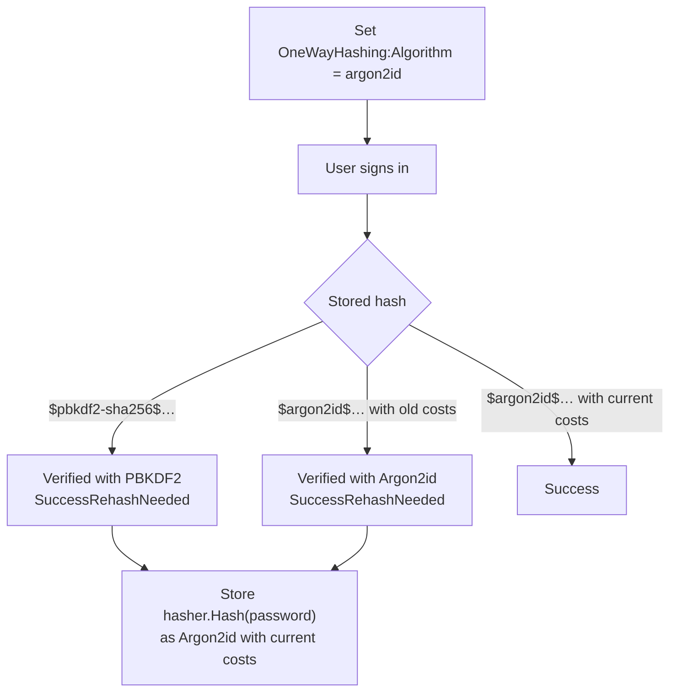

# SharedKernel.Cryptography.Argon2

[](https://dotnet.microsoft.com/)
[](https://github.com/Gresta-Vertex-Labs/platform-shared-kernel/blob/main/LICENSE)


-blueviolet)

> **Argon2id password hashing for `SharedKernel.Cryptography`'s `IOneWayHasher`: one line to register, one setting to
> switch, and existing hashes upgrade themselves as users sign in.**

Argon2id won the Password Hashing Competition and is OWASP's first choice for password storage. It is memory-hard: every
guess costs an attacker memory as well as time, which removes most of the advantage GPUs and ASICs have against PBKDF2.

| You get | So that |
| --- | --- |
| `AddArgon2id(configuration)` on the cryptography builder | An `argon2id` algorithm joins the `IOneWayHasher` you already use; sign-in code does not change |
| Self-migrating hashes | PBKDF2 hashes keep verifying and report `SuccessRehashNeeded`, so users move to Argon2id as they sign in |
| Standard PHC strings (`$argon2id$v=19$…`) | Other Argon2 libraries can verify unpeppered hashes |
| Bounded costs on verification | A stored hash crafted to exhaust memory or CPU is rejected before any work |
| Fully managed implementation (Konscious) | Runs anywhere .NET 10 runs, including Alpine and ARM64, with no native binaries |

## Contents

- [Install](#install)
- [Quick start](#quick-start)
- [How it works](#how-it-works)
- [Recipes](#recipes)
- [Configuration](#configuration)
- [Reference](#reference)
- [Testing](#testing)
- [Pitfalls](#pitfalls)
- [Design decisions](#design-decisions)

## Install

```xml
<PackageReference Include="SharedKernel.Cryptography.Argon2" />
```

The version comes from your central `SharedKernelVersion` property — every SharedKernel package ships at the same
version. See [Using the packages](https://github.com/Gresta-Vertex-Labs/platform-shared-kernel#using-the-packages).

| Requirement | Value |
| --- | --- |
| Target framework | `net10.0` |
| Tier | Adapter — reference it from your **Infrastructure** project (or the host that registers cryptography) |
| Depends on | [`SharedKernel.Cryptography`](https://github.com/Gresta-Vertex-Labs/platform-shared-kernel/blob/main/01.Core/SharedKernel.Cryptography/README.md), `SharedKernel.Configuration`, `Konscious.Security.Cryptography.Argon2` |
| Namespaces | `SharedKernel.Cryptography.Argon2` |

## Quick start

```csharp
using SharedKernel.Cryptography.Argon2;
using SharedKernel.Cryptography.Extensions;

builder.Services.AddSharedKernelCryptography(builder.Configuration)
    .AddArgon2id(builder.Configuration);   // SharedKernel:Cryptography:Argon2
```

```json
{
  "SharedKernel": {
    "Cryptography": {
      "OneWayHashing": { "Algorithm": "argon2id" },
      "Argon2": { "MemorySizeKb": 19456, "Iterations": 2, "DegreeOfParallelism": 1 }
    }
  }
}
```

Keep using `IOneWayHasher` (`Hash`, `Verify`). New hashes look like this:

```text
$argon2id$v=19$m=19456,t=2,p=1$vkLX6IXN27EMoS2ZU4YrMA$YSXgtX5N1hgFObxW00/HCmJ63stqYZIEbBoFK9Jewh4
   algorithm, Argon2 1.3, memory KiB, passes, lanes, 16-byte salt, 32-byte hash
```

The `Argon2` section is optional; the values above are the defaults.

## How it works



- Each hash records its algorithm and costs, so no migration script is needed. PBKDF2 is always registered, so users who
  never sign in keep a hash that still verifies.
- `OneWayHashing:Algorithm` decides which algorithm writes new hashes; every registered algorithm keeps verifying.
- A configured pepper (core package) applies to Argon2id hashes too.
- Verification rejects, as `Failed` and before hashing, any hash that is not version 19 or exceeds 1 GiB memory,
  10 passes or 16 lanes, has under 8 KiB per lane, a salt outside 8–64 bytes or an output outside 16–64 bytes. Outputs
  are compared in fixed time.
- The algorithm is a thread-safe singleton that reads cost changes through `IOptionsMonitor`; changing costs never
  invalidates stored hashes — they verify with their own costs and report `SuccessRehashNeeded`.

| | PBKDF2-HMAC-SHA256 (core default) | Argon2id (this package) |
| --- | --- | --- |
| Resistance to GPU/ASIC cracking | Good with high iterations | Better: every guess needs memory |
| FIPS 140-3 approved | Yes | No |
| Memory per hash | Negligible | `MemorySizeKb` (19 MiB by default) |
| Choose it when | FIPS is required, or memory is tightly constrained | Neither applies |

## Recipes

### 1. Move an existing PBKDF2 system to Argon2id

1. Make sure sign-in stores a new hash on `SuccessRehashNeeded` (the core package's password sign-in recipe).
2. Add this package and call `.AddArgon2id(builder.Configuration)`.
3. Load-test sign-in with your chosen costs (recipe 2).
4. Set `OneWayHashing:Algorithm` to `argon2id` and deploy.
5. Track progress by counting stored hashes that start with `$pbkdf2-sha256$`.

### 2. Choose costs for your hardware

Raise memory first, then passes, while sign-in stays within your latency budget under peak concurrency:

```csharp
IConfiguration configuration = new ConfigurationBuilder()
    .AddInMemoryCollection(new Dictionary<string, string?>
    {
        ["SharedKernel:Cryptography:OneWayHashing:Algorithm"] = Argon2idOneWayHashAlgorithm.Id,
        ["SharedKernel:Cryptography:Argon2:MemorySizeKb"] = "47104",
        ["SharedKernel:Cryptography:Argon2:Iterations"] = "2",
    })
    .Build();

var services = new ServiceCollection();
services.AddSharedKernelCryptography(configuration).AddArgon2id(configuration);
using ServiceProvider provider = services.BuildServiceProvider();
IOneWayHasher hasher = provider.GetRequiredService<IOneWayHasher>();

hasher.Hash("warm-up");
long start = Stopwatch.GetTimestamp();
hasher.Hash("correct horse battery staple");
Console.WriteLine(Stopwatch.GetElapsedTime(start));
```

Memory is per hash and hashes run concurrently: with `MemorySizeKb = 65536`, fifty simultaneous sign-ins need about
3.2 GiB. Size container limits for your peak sign-in rate, or rate-limit sign-in.

### 3. Keep FIPS environments on PBKDF2

Register Argon2id everywhere and choose the algorithm per environment
(`appsettings.Fips.json`: `"OneWayHashing": { "Algorithm": "pbkdf2-sha256" }`). Argon2id hashes moved into a FIPS
environment keep verifying and are rewritten as PBKDF2 at sign-in.

### 4. Verify hashes from another language

Unpeppered hashes are standard PHC strings — for example, Python's `argon2-cffi`:
`PasswordHasher().verify(stored_hash, password)`. `IOneWayHasher` normalizes secrets to Unicode NFKC first (ASCII passwords
are unaffected), and a pepper adds a `k=` parameter other libraries do not understand; normalize with NFKC on the other
side too.

## Configuration

Section `SharedKernel:Cryptography:Argon2` (`Argon2Options.SectionName`), optional, validated when the host starts.

| Key | Type | Default | Meaning |
| --- | --- | --- | --- |
| `SharedKernel:Cryptography:Argon2:MemorySizeKb` | `int` | `19456` (19 MiB) | Memory per hash, 7,168 – 1,048,576; the main defence against GPUs |
| `SharedKernel:Cryptography:Argon2:Iterations` | `int` | `2` | Passes over memory, 2 – 10; raises time linearly |
| `SharedKernel:Cryptography:Argon2:DegreeOfParallelism` | `int` | `1` | Lanes, 1 – 16; each uses a thread-pool thread while hashing |
| `SharedKernel:Cryptography:OneWayHashing:Algorithm` | `string` | `pbkdf2-sha256` | Set to `argon2id` (`Argon2idOneWayHashAlgorithm.Id`) to write new hashes with Argon2id (core package option) |

## Reference

### Registration

| Method | Registers |
| --- | --- |
| `ICryptographyBuilder.AddArgon2id(IConfiguration)` | `Argon2Options` (validated) and `Argon2idOneWayHashAlgorithm` as an `IOneWayHashAlgorithm` (singleton) |

### Types

| Type | Purpose |
| --- | --- |
| `Argon2idOneWayHashAlgorithm` | `AlgorithmId` = `Id` = `"argon2id"`; `Hash`, `Verify`, `RequiresRehash` over `PhcHashString` |
| `Argon2Options` | `MemorySizeKb`, `Iterations`, `DegreeOfParallelism`; bound constants `MinimumMemorySizeKb`, `MaximumMemorySizeKb`, `MinimumIterations`, `MaximumIterations`, `MaximumDegreeOfParallelism` |

### Errors

None of its own: a failed verification is `HashVerificationResult.Failed`. Setting `Algorithm` to `argon2id` without
`AddArgon2id` fails startup validation (`OptionsValidationException`).

### Logging

The package does not log.

## Testing

Use `FakeOneWayHasher` from
[`SharedKernel.Cryptography.Testing`](https://github.com/Gresta-Vertex-Labs/platform-shared-kernel/blob/main/16.Testing/SharedKernel.Cryptography.Testing/README.md)
for fast sign-in tests (it is PBKDF2-based). To exercise Argon2id itself, register it with the minimum costs
(`MemorySizeKb = 7168`, `Iterations = 2`) to keep tests quick.

## Pitfalls

| Don't | Do | Why |
| --- | --- | --- |
| Set `Algorithm` to `argon2id` without `AddArgon2id` | Call both | Startup validation rejects an unregistered algorithm |
| Use Argon2id where FIPS 140-3 is required | Keep `pbkdf2-sha256` there | Argon2id is not approved |
| Raise `MemorySizeKb` without a load test | Measure peak concurrent sign-ins | Memory use multiplies with concurrency |
| Lower costs to make sign-in faster | Scale out, or rate-limit sign-in | Lower costs help attackers as much as you |
| Ignore `SuccessRehashNeeded` | Store `Hash(password)` again | Old PBKDF2 hashes would stay forever |
| Hash API keys or tokens with Argon2id | An HMAC lookup hash from the core package | High-entropy secrets do not need a slow hash |

## Design decisions

**Why a separate package?** It keeps the Konscious dependency off every consumer of the BCL-only core package.

**Why Konscious?** It is fully managed — no native binaries to ship per platform.

**What does it not protect against?** Online guessing (rate-limit sign-in), weak passwords (enforce a policy and check
breached-password lists), and memory exhaustion from legitimate concurrent sign-ins (size memory for peak load). Report
vulnerabilities privately as described in the
[security policy](https://github.com/Gresta-Vertex-Labs/platform-shared-kernel/blob/main/SECURITY.md).

---

Part of [Platform.SharedKernel](https://github.com/Gresta-Vertex-Labs/platform-shared-kernel) ·
[Core domain](https://github.com/Gresta-Vertex-Labs/platform-shared-kernel/blob/main/01.Core/README.md) ·
[MIT license](https://github.com/Gresta-Vertex-Labs/platform-shared-kernel/blob/main/LICENSE)
