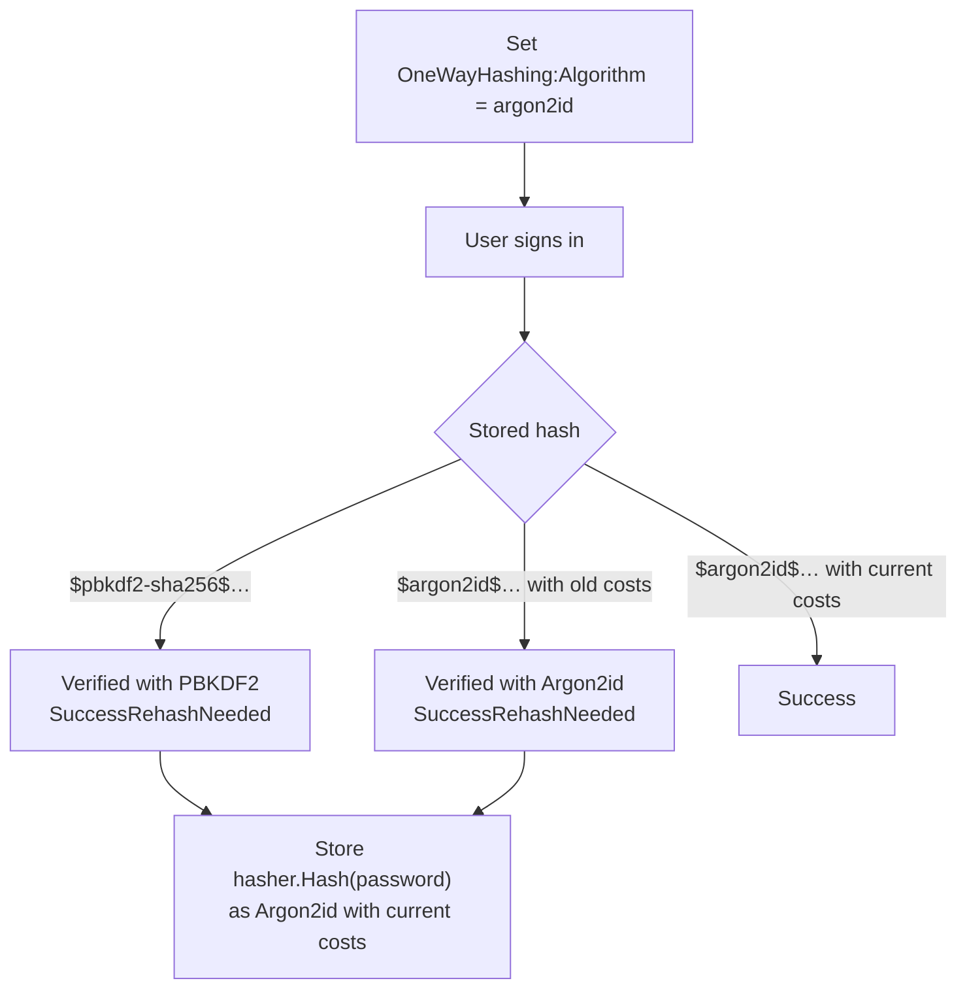

# SharedKernel.Cryptography.Argon2

[](https://dotnet.microsoft.com/)
[](https://github.com/Gresta-Vertex-Labs/platform-shared-kernel/blob/main/LICENSE)
-blueviolet)


> **Argon2id password hashing for
> [`SharedKernel.Cryptography`](https://github.com/Gresta-Vertex-Labs/platform-shared-kernel/tree/main/01.Core/SharedKernel.Cryptography).
> One line to register, one setting to switch, and existing hashes upgrade themselves as users sign in.**

Argon2id won the Password Hashing Competition and is OWASP's first choice for password storage. It is memory-hard:
every guess costs an attacker memory as well as time, which takes away most of the advantage GPUs and ASICs have
against PBKDF2. This package plugs it into `IOneWayHasher`, so your sign-in code does not change.

| ⚡ Drop-in | 🔄 Self-migrating | 🌍 Interoperable | 🛡️ Hostile-hash safe |
| --- | --- | --- | --- |
| Adds an `argon2id` algorithm to the `IOneWayHasher` you already use | PBKDF2 hashes keep verifying and report `SuccessRehashNeeded` | Standard PHC strings other Argon2 libraries read | Costs in a stored hash are bounded before any work |

## Contents

- [Install](#install)
- [Quick start](#quick-start)
- [Argon2id or PBKDF2?](#argon2id-or-pbkdf2)
- [How migration works](#how-migration-works)
- [Recipes](#recipes)
- [Configuration](#configuration)
- [Security model](#security-model)
- [Pitfalls](#pitfalls)
- [Compatibility and guarantees](#compatibility-and-guarantees)

## Install

```shell
dotnet add package SharedKernel.Cryptography.Argon2
```

| Requirement | Value |
| --- | --- |
| Target framework | `net10.0` |
| Dependencies | `SharedKernel.Cryptography`, `SharedKernel.Configuration`, [`Konscious.Security.Cryptography.Argon2`](https://www.nuget.org/packages/Konscious.Security.Cryptography.Argon2) (fully managed, no native binaries) |
| Namespace | `SharedKernel.Cryptography.Argon2` |

## Quick start

**1. Register** the algorithm next to the core package:

```csharp
// Program.cs
builder.Services.AddSharedKernelCryptography(builder.Configuration)
    .AddArgon2id(builder.Configuration);
```

**2. Make it the algorithm for new hashes:**

```json
{
  "SharedKernel": {
    "Cryptography": {
      "OneWayHashing": { "Algorithm": "argon2id" },
      "Argon2": { "MemorySizeKb": 19456, "Iterations": 2, "DegreeOfParallelism": 1 }
    }
  }
}
```

**3. Keep using `IOneWayHasher`.** New hashes look like this:

```text
$argon2id$v=19$m=19456,t=2,p=1$vkLX6IXN27EMoS2ZU4YrMA$YSXgtX5N1hgFObxW00/HCmJ63stqYZIEbBoFK9Jewh4
   │        │    │       │   │   │                      └ hash (32 bytes)
   │        │    │       │   │   └ salt (16 random bytes)
   │        │    │       │   └ lanes
   │        │    │       └ passes over memory
   │        │    └ memory in KiB
   │        └ Argon2 version 1.3
   └ algorithm
```

> [!NOTE]
> The `Argon2` section is optional; the values above are the defaults. Every value is validated when the host starts.

## Argon2id or PBKDF2?

| | PBKDF2-HMAC-SHA256 (core default) | Argon2id (this package) |
| --- | --- | --- |
| Resistance to GPU/ASIC cracking | Good with high iterations | Better: every guess needs memory |
| FIPS 140-3 approved | ✅ Yes | ❌ No |
| Memory per hash | Negligible | `MemorySizeKb` (19 MiB by default) |
| OWASP recommendation | 600,000 iterations | m=19 MiB, t=2, p=1 or stronger |
| Choose it when | FIPS compliance is required, or memory is tightly constrained | Neither applies |

Both can be registered at once; `OneWayHashing:Algorithm` decides which one writes new hashes, and both keep verifying.

## How migration works

Nothing needs a migration script. The algorithm used for each hash is recorded in the hash itself.



Users who never sign in keep their old hash, which still verifies. PBKDF2 is always registered, so they are never
locked out.

## Recipes

### 1. Move an existing PBKDF2 system to Argon2id

Your sign-in code already handles `SuccessRehashNeeded` if it follows the core package's
[password sign-in recipe](https://github.com/Gresta-Vertex-Labs/platform-shared-kernel/tree/main/01.Core/SharedKernel.Cryptography#5-sign-users-in-with-passwords).
Then:

1. Add this package and call `.AddArgon2id(builder.Configuration)`.
2. Load-test sign-in with your chosen costs ([recipe 2](#2-choose-costs-for-your-hardware)).
3. Set `OneWayHashing:Algorithm` to `argon2id` and deploy.
4. Track progress by counting stored hashes that start with `$pbkdf2-sha256$`.

A configured pepper applies to Argon2id hashes too, so peppered PBKDF2 hashes migrate without losing it.

### 2. Choose costs for your hardware

Raise memory first, then passes, while sign-in stays within your latency budget under peak concurrency. This console
snippet measures one hash per candidate:

```csharp
using System.Diagnostics;
using System.Globalization;
using SharedKernel.Cryptography.Argon2;
using SharedKernel.Cryptography.Extensions;
using SharedKernel.Cryptography.Hashing;

public static class Argon2Benchmark
{
    public static void Run()
    {
        foreach ((int memoryKb, int iterations) in new[] { (19_456, 2), (47_104, 2), (65_536, 3) })
        {
            TimeSpan elapsed = MeasureHash(memoryKb, iterations);
            Console.WriteLine($"m={memoryKb} KiB, t={iterations}: {elapsed.TotalMilliseconds:F0} ms");
        }
    }

    private static TimeSpan MeasureHash(int memoryKb, int iterations)
    {
        IConfiguration configuration = new ConfigurationBuilder()
            .AddInMemoryCollection(new Dictionary<string, string?>
            {
                ["SharedKernel:Cryptography:OneWayHashing:Algorithm"] = Argon2idOneWayHashAlgorithm.Id,
                ["SharedKernel:Cryptography:Argon2:MemorySizeKb"] = memoryKb.ToString(CultureInfo.InvariantCulture),
                ["SharedKernel:Cryptography:Argon2:Iterations"] = iterations.ToString(CultureInfo.InvariantCulture),
            })
            .Build();

        var services = new ServiceCollection();
        services.AddSharedKernelCryptography(configuration).AddArgon2id(configuration);
        using ServiceProvider provider = services.BuildServiceProvider();
        IOneWayHasher hasher = provider.GetRequiredService<IOneWayHasher>();

        hasher.Hash("warm-up");
        long start = Stopwatch.GetTimestamp();
        hasher.Hash("correct horse battery staple");
        return Stopwatch.GetElapsedTime(start);
    }
}
```

> [!WARNING]
> Memory is per hash, and hashes run concurrently. With `MemorySizeKb = 65536`, fifty simultaneous sign-ins need
> about 3.2 GiB. Size container memory limits for your peak sign-in rate, or rate-limit sign-in.

Changing costs never invalidates stored hashes: they verify with the costs written in them and report
`SuccessRehashNeeded`.

### 3. Keep FIPS environments on PBKDF2

Register Argon2id everywhere, and choose the algorithm per environment:

```json
// appsettings.Fips.json
{
  "SharedKernel": { "Cryptography": { "OneWayHashing": { "Algorithm": "pbkdf2-sha256" } } }
}
```

Moving a database from an Argon2id environment into a FIPS one works in the other direction too: Argon2id hashes
keep verifying (the algorithm is still registered) and are rewritten as PBKDF2 at sign-in.

### 4. Verify hashes from another language

Hashes without a pepper are standard PHC strings. For example, in Python with
[`argon2-cffi`](https://pypi.org/project/argon2-cffi/):

```python
from argon2 import PasswordHasher

PasswordHasher().verify(stored_hash, password)  # raises VerifyMismatchError on a wrong password
```

> [!IMPORTANT]
> `IOneWayHasher` normalizes secrets to Unicode NFKC before hashing, and a pepper adds a `k=` parameter other
> libraries do not understand. Interoperability holds for unpeppered hashes of passwords that are already
> NFKC-normalized (all ASCII passwords are). Normalize with NFKC on the other side too.

## Configuration

Section `SharedKernel:Cryptography:Argon2` (`Argon2Options`):

| Setting | Default | Allowed | Effect |
| --- | --- | --- | --- |
| `MemorySizeKb` | 19,456 (19 MiB) | 7,168 – 1,048,576 | Memory for each hash; the main defence against GPUs |
| `Iterations` | 2 | 2 – 10 | Passes over memory; raises time linearly |
| `DegreeOfParallelism` | 1 | 1 – 16 | Lanes; each uses a thread-pool thread while hashing |

Select the algorithm with `SharedKernel:Cryptography:OneWayHashing:Algorithm = argon2id` (the constant
`Argon2idOneWayHashAlgorithm.Id`). Setting it without calling `AddArgon2id` fails startup validation.

## Security model

| Threat | Protection |
| --- | --- |
| Offline cracking of a stolen table with GPUs or ASICs | Memory-hard Argon2id with a 16-byte random salt per hash |
| Offline cracking with the table alone | Optional pepper from the core package, kept outside the database |
| A stored hash crafted to exhaust memory or CPU | Rejected as `Failed` before hashing when it is not version 19 or exceeds 1 GiB memory, 10 passes or 16 lanes, has under 8 KiB per lane, a salt outside 8–64 bytes or an output outside 16–64 bytes |
| Timing differences on verification | Hash outputs compared in fixed time |
| Unicode lookalike input | NFKC normalization before hashing |

**Not covered:** online guessing (rate-limit sign-in), weak passwords (enforce a policy and check breached-password
lists), and memory exhaustion from legitimate concurrent sign-ins (size memory for peak load).

**FIPS 140-3:** Argon2id is not an approved algorithm. Where FIPS compliance is required, keep PBKDF2.

**Reporting a vulnerability:** please report privately through the repository's
[Security tab](https://github.com/Gresta-Vertex-Labs/platform-shared-kernel/security), as described in the
[security policy](https://github.com/Gresta-Vertex-Labs/platform-shared-kernel/blob/main/SECURITY.md).

## Pitfalls

| ❌ Don't | ✅ Do | Why |
| --- | --- | --- |
| Set `Algorithm` to `argon2id` without `AddArgon2id` | Call both | Startup validation rejects an unregistered algorithm |
| Use Argon2id where FIPS 140-3 is required | Keep `pbkdf2-sha256` there | Argon2id is not approved |
| Raise `MemorySizeKb` without a load test | Measure peak concurrent sign-ins | Memory use multiplies with concurrency |
| Lower costs to make sign-in faster | Scale out, or rate-limit sign-in | Lower costs help attackers as much as you |
| Ignore `SuccessRehashNeeded` | Store `Hash(password)` again | Old PBKDF2 hashes would stay forever |
| Hash API keys or tokens with Argon2id | Use an HMAC lookup hash from the core package | High-entropy secrets do not need a slow hash |

## Compatibility and guarantees

- **Public API is tracked** with `Microsoft.CodeAnalysis.PublicApiAnalyzers`.
- **Standard output:** PHC strings with unpadded standard Base64 salt and hash, Argon2 version 1.3 (`v=19`).
- **Fully managed:** no native binaries, so it runs anywhere .NET 10 runs, including Alpine and ARM64 containers.
- **Thread-safe:** the algorithm is a singleton and reads cost changes through `IOptionsMonitor`.
