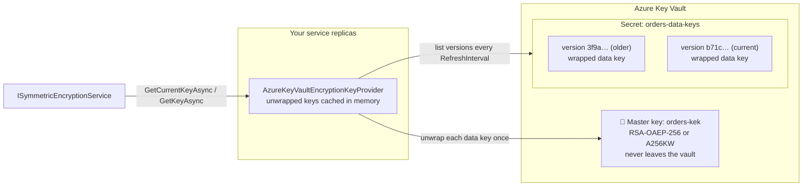
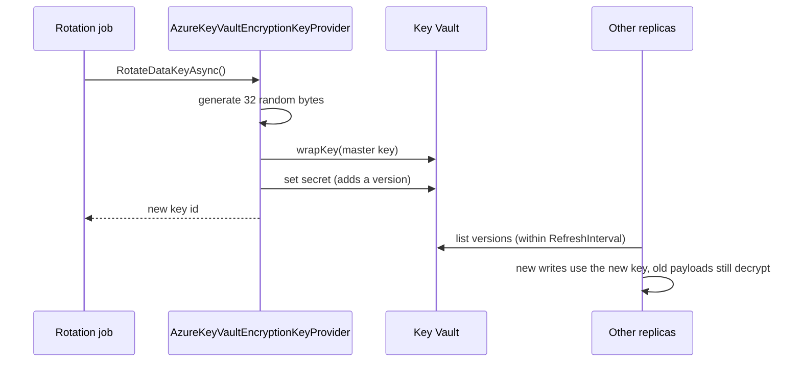
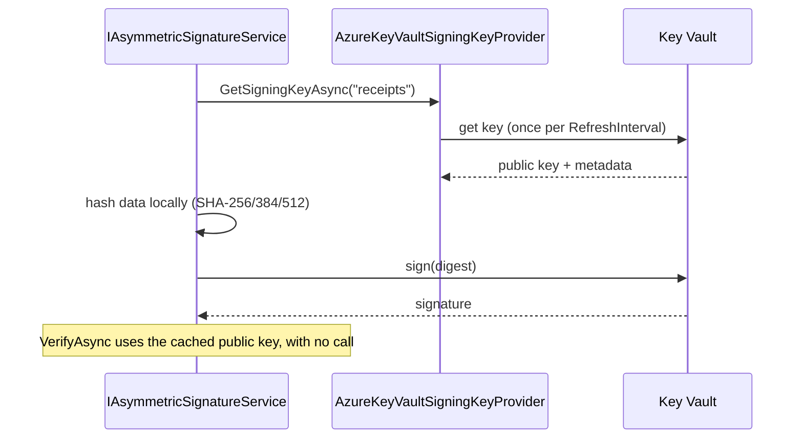

# SharedKernel.Cryptography.KeyVault.Azure

[](https://dotnet.microsoft.com/)
[](https://github.com/Gresta-Vertex-Labs/platform-shared-kernel/blob/main/LICENSE)


> **Azure Key Vault behind
> [`SharedKernel.Cryptography`](https://github.com/Gresta-Vertex-Labs/platform-shared-kernel/tree/main/01.Core/SharedKernel.Cryptography):
> encryption keys wrapped by a master key that never leaves the vault, and signing keys that sign inside it.**

Your code keeps using `ISymmetricEncryptionService`, `IEnvelopeEncryptionService` and `IAsymmetricSignatureService`.
This package supplies their keys from Key Vault, caches them so encryption stays in-process and fast, rotates them
with one call, and refuses to let a forged payload steer it toward keys you did not configure.

| 🔑 Encryption keys | 📦 Envelope encryption | ✍️ Remote signing | 🩺 Operations |
| --- | --- | --- | --- |
| AES-256 data keys wrapped by an RSA or HSM master key | A fresh data key per file | RSA and ECDSA keys sign inside Key Vault | One-call rotation, readiness probe |
| Shared by every replica, cached in memory | Only configured master keys unwrap | Verification runs locally | Managed identity and workload identity |

## Contents

- [Install](#install)
- [Quick start](#quick-start)
- [How it works](#how-it-works)
- [Recipes](#recipes)
- [Configuration](#configuration)
- [Behaviour reference](#behaviour-reference)
- [Permissions](#permissions)
- [Security model](#security-model)
- [Pitfalls](#pitfalls)
- [Compatibility and guarantees](#compatibility-and-guarantees)

## Install

```shell
dotnet add package SharedKernel.Cryptography.KeyVault.Azure
```

| Requirement | Value |
| --- | --- |
| Target framework | `net10.0` |
| Dependencies | `SharedKernel.Cryptography`, `SharedKernel.Configuration`, `Azure.Security.KeyVault.Keys`, `Azure.Security.KeyVault.Secrets`, `Azure.Identity` |
| Namespace | `SharedKernel.Cryptography.KeyVault.Azure` |
| Azure resources | A key vault (or managed HSM) with a master key, a secret name for data keys, and signing keys if you sign |

## Quick start

**1. Register** a credential and the providers you need:

```csharp
// Program.cs
builder.Services.AddSingleton<TokenCredential>(new ManagedIdentityCredential(ManagedIdentityId.SystemAssigned));

builder.Services.AddSharedKernelCryptography(builder.Configuration)
    .AddAzureKeyVaultEncryption(builder.Configuration)   // encryption keys, envelope keys, readiness probe
    .AddSymmetricEncryption()
    .AddEnvelopeEncryption()
    .AddAzureKeyVaultSigning(builder.Configuration)      // signing keys
    .AddAsymmetricSigning();
```

**2. Configure** the vault, keys and secret:

```json
{
  "SharedKernel": {
    "Cryptography": {
      "KeyVault": {
        "Azure": {
          "Encryption": {
            "VaultUri": "https://contoso-prod.vault.azure.net/",
            "MasterKeyName": "orders-kek",
            "DataKeySecretName": "orders-data-keys"
          },
          "Signing": {
            "VaultUri": "https://contoso-prod.vault.azure.net/",
            "Keys": {
              "receipts": { "KeyName": "receipt-signing", "Algorithm": "ES256" }
            }
          }
        }
      }
    }
  }
}
```

**3. Create the first data key** once per environment, with the
[rotation tool](#1-create-and-rotate-data-keys). Until then, encryption throws `InvalidOperationException`.

**4. Use the core services** exactly as the
[core recipes](https://github.com/Gresta-Vertex-Labs/platform-shared-kernel/tree/main/01.Core/SharedKernel.Cryptography#recipes)
show. Nothing in your application code refers to Key Vault.

> [!TIP]
> Only register what you use. `AddAzureKeyVaultEncryption` and `AddAzureKeyVaultSigning` are independent, and each
> can point at a different vault.

## How it works

### Data keys

Data keys are ordinary AES-256 keys generated in your process. Each one is wrapped (encrypted) by the master key and
stored as a new version of one Key Vault secret. The secret version id is the key id written into every payload.



The newest enabled version is the current key. Encryption and decryption run entirely in memory once a key is
unwrapped, so a busy service makes a handful of Key Vault calls, not one per operation.

### Rotation



Concurrent rotations each add their own version; nothing is overwritten. Re-encrypt old payloads with the core
package's `ReEncryptAsync` before disabling old versions.

### Remote signing



The private key never leaves Key Vault, and Key Vault never sees your data, only its digest.

## Recipes

### 1. Create and rotate data keys

Run rotation from one place: a deployment step, a scheduled job, or an admin endpoint. Never from every replica at
startup.

```csharp
// rotate-data-key/Program.cs: run once when the environment is created, then on a schedule
// (for example a Kubernetes CronJob). Never from every replica at startup.
HostApplicationBuilder builder = Host.CreateApplicationBuilder(args);
builder.Services.AddSharedKernelCryptography(builder.Configuration)
    .AddAzureKeyVaultEncryption(builder.Configuration);

using IHost host = builder.Build();
var keyVault = host.Services.GetRequiredService<AzureKeyVaultEncryptionKeyProvider>();

string keyId = await keyVault.RotateDataKeyAsync();
Console.WriteLine($"Current data key is now {keyId}.");
```

After rotating, move old payloads to the new key with the core
[re-encryption job](https://github.com/Gresta-Vertex-Labs/platform-shared-kernel/tree/main/01.Core/SharedKernel.Cryptography#2-rotate-keys-without-downtime),
then disable (never delete) versions nothing uses.

### 2. Move to a new master key

1. Create the new key (`orders-kek-2027`) and grant the service identity access to it.
2. Point configuration at it, keeping the old one readable:

   ```json
   "Encryption": {
     "MasterKeyName": "orders-kek-2027",
     "PreviousMasterKeyNames": [ "orders-kek" ]
   }
   ```

3. Deploy, then run the rotation tool: the new data key is wrapped by `orders-kek-2027`.
4. Re-encrypt payloads so none use data keys wrapped by `orders-kek`. Envelope payloads need a decrypt and encrypt.
5. Disable the old data key versions, remove `orders-kek` from `PreviousMasterKeyNames`, deploy, and disable the old
   master key.

Rotating the master key's own version in Key Vault (same name) needs no configuration change: all enabled versions of
a configured name are accepted.

### 3. Sign with Key Vault keys and rotate them safely

Configure one key id per purpose. Pin a version when signatures must stay verifiable after the key rotates, and give
each pinned version its own key id:

```json
"Signing": {
  "VaultUri": "https://contoso-prod.vault.azure.net/",
  "Keys": {
    "receipts-2026": { "KeyName": "receipt-signing", "KeyVersion": "2f3c8a9d4b5e6f708192a3b4c5d6e7f8", "Algorithm": "ES256" },
    "receipts-2027": { "KeyName": "receipt-signing", "KeyVersion": "9a8b7c6d5e4f30211203f4e5d6c7b8a9", "Algorithm": "ES256" },
    "partner-api":   { "KeyName": "partner-rsa", "Algorithm": "PS256" }
  }
}
```

Sign with the newest id and write it into the token (for example a JWS `kid`). When verifying, accept the token's
`kid` only if it is in the list for that purpose (here `receipts-2026` or `receipts-2027`), never any configured id:
otherwise a token signed with `partner-api` would pass as a receipt. The core
[token recipe](https://github.com/Gresta-Vertex-Labs/platform-shared-kernel/tree/main/01.Core/SharedKernel.Cryptography#7-sign-and-verify-a-token)
shows the single-key case.

### 4. Add a readiness check

```csharp
using Microsoft.Extensions.Diagnostics.HealthChecks;
using SharedKernel.Cryptography.Symmetric;

public sealed class KeyVaultReadinessCheck(IEncryptionKeyProviderProbe probe) : IHealthCheck
{
    public async Task<HealthCheckResult> CheckHealthAsync(
        HealthCheckContext context, CancellationToken cancellationToken = default)
    {
        EncryptionKeyProviderHealth health = await probe.ProbeAsync(cancellationToken);
        return health.IsHealthy
            ? HealthCheckResult.Healthy(health.Description)
            : HealthCheckResult.Unhealthy(health.Description);
    }
}
```

```csharp
// Program.cs
builder.Services.AddHealthChecks()
    .AddCheck<KeyVaultReadinessCheck>("key-vault", tags: ["ready"]);
```

The probe reads the master key's metadata, never performs a cryptographic operation, and reports failures by HTTP
status or exception type without exception messages.

### 5. Develop locally

Use a real development vault with your own Azure login:

```csharp
if (builder.Environment.IsDevelopment())
{
    builder.Services.AddSingleton<TokenCredential>(new AzureCliCredential()); // after `az login`
}
```

Or skip Key Vault entirely on a developer machine:

```csharp
var cryptography = builder.Services.AddSharedKernelCryptography(builder.Configuration);

if (builder.Environment.IsDevelopment())
{
    // No vault: a random key per run. Data encrypted in one run cannot be read in the next.
    builder.Services.AddSingleton<IEncryptionKeyProvider>(new StaticEncryptionKeyProvider(
        "dev", [new CryptographicKey("dev", RandomNumberGenerator.GetBytes(32))]));
}
else
{
    cryptography.AddAzureKeyVaultEncryption(builder.Configuration);
}

cryptography.AddSymmetricEncryption();
```

### 6. Provision the Azure resources

With the Azure CLI and Azure RBAC:

```shell
# Master key (RSA 3072). In a managed HSM, create an AES-256 key instead.
az keyvault key create --vault-name contoso-prod --name orders-kek --kty RSA --size 3072

# Service identity: unwrap data keys, read the data key secret.
az role assignment create --assignee <service-principal-id> --role "Key Vault Crypto User" \
  --scope "$(az keyvault show --name contoso-prod --query id -o tsv)/keys/orders-kek"
az role assignment create --assignee <service-principal-id> --role "Key Vault Secrets User" \
  --scope "$(az keyvault show --name contoso-prod --query id -o tsv)/secrets/orders-data-keys"

# Rotation identity: also writes new data key versions.
az role assignment create --assignee <rotation-principal-id> --role "Key Vault Secrets Officer" \
  --scope "$(az keyvault show --name contoso-prod --query id -o tsv)/secrets/orders-data-keys"
```

### 7. Encrypt from synchronous code

This provider is asynchronous, and the core package never blocks on it. EF Core value converters and other
synchronous code need keys already in memory:

- **EF Core columns:** `SharedKernel.Persistence.EfCore` warms Key Vault keys at startup, refreshes them in the
  background and serves them synchronously.
- **Anything else:** load keys into a `StaticEncryptionKeyProvider` at startup and register
  `ISynchronousSymmetricEncryptionService` over it, refreshing it on your own schedule.

## Configuration

### Encryption: `SharedKernel:Cryptography:KeyVault:Azure:Encryption`

| Setting | Required | Default | Rules |
| --- | --- | --- | --- |
| `VaultUri` | ✅ | | Absolute `https` URI of the vault or managed HSM |
| `MasterKeyName` | ✅ | | 1–127 letters, digits or hyphens |
| `PreviousMasterKeyNames` | | `[]` | Master keys still accepted for unwrapping |
| `DataKeySecretName` | ✅ | | 1–127 letters, digits or hyphens |
| `RefreshInterval` | | `00:05:00` | 1 second – 1 day; how often versions are re-listed |

### Signing: `SharedKernel:Cryptography:KeyVault:Azure:Signing`

| Setting | Required | Default | Rules |
| --- | --- | --- | --- |
| `VaultUri` | ✅ | | Absolute `https` URI |
| `Keys:<keyId>:KeyName` | ✅ | | 1–127 letters, digits or hyphens |
| `Keys:<keyId>:KeyVersion` | | latest | 32 lowercase hex characters |
| `Keys:<keyId>:Algorithm` | ✅ | | `PS256`–`PS512`, `RS256`–`RS512`, `ES256`–`ES512` |
| `RefreshInterval` | | `01:00:00` | 1 minute – 1 day; how often key metadata is re-read |

Invalid configuration stops the host at startup.

### Services registered

| Method | Registers |
| --- | --- |
| `AddAzureKeyVaultEncryption` | `AzureKeyVaultEncryptionKeyProvider` as itself, `IEncryptionKeyProvider`, `IEnvelopeEncryptionProvider` and `IEncryptionKeyProviderProbe` |
| `AddAzureKeyVaultSigning` | `AzureKeyVaultSigningKeyProvider` as itself and `ISigningKeyProvider` |
| Both | `TokenCredential` (`DefaultAzureCredential` if you registered none), `TimeProvider.System`, `ISecureRandomGenerator` |

All registrations use `TryAdd`, so anything you register first wins.

## Behaviour reference

### Encryption keys

| Topic | Behaviour |
| --- | --- |
| Current key | The newest enabled version of `DataKeySecretName` |
| Key ids | Secret version ids (32 lowercase hex characters) |
| Caching | Versions listed once per `RefreshInterval`; each data key unwrapped once and kept in memory. Do not wrap in `CachedEncryptionKeyProvider`. |
| Unknown key ids | Ids that are not 32 lowercase hex characters return `null` without a call. An unknown well-formed id forces a fresh listing at most once every 10 seconds. |
| No data key yet | `GetCurrentKeyAsync` throws `InvalidOperationException` |
| Disabled versions | Stop encrypting and decrypting within `RefreshInterval` |
| Vault unreachable | Calls keep working until the version list is due for refresh, then throw until the vault is back |
| Master keys | RSA keys wrap with RSA-OAEP-256; managed-HSM AES keys with A256KW |
| Unwrapping | Only enabled versions of `MasterKeyName` and `PreviousMasterKeyNames`. Any other key or version returns `cryptography.data_key_unwrap_failed` without calling Key Vault. |

### Envelope encryption

`GenerateDataKeyAsync` creates a random data key and wraps it with the current master key; `UnwrapDataKeyAsync`
unwraps with a configured master key only. Each call is one Key Vault operation, which suits files and exports rather
than many small values.

### Signing keys

| Topic | Behaviour |
| --- | --- |
| Lookup | Only ids under `Signing:Keys` resolve; any other id returns `null` without a call |
| Validation | The Key Vault key must match its algorithm: RSA ≥ 2048 bits for `PS*`/`RS*`, the named curve for `ES*`. A mismatch throws `InvalidOperationException`. |
| Signing | Key Vault `sign` over the locally computed digest |
| Verification | Local, with the cached public key |
| Versions | Without `KeyVersion`, the latest version, re-read every `RefreshInterval` |

## Permissions

| Identity | Needs | Built-in role |
| --- | --- | --- |
| Service (encrypt and decrypt) | `keys/get`, `keys/list`, `keys/unwrapKey` on each master key; `keys/wrapKey` too for envelope encryption; `secrets/get`, `secrets/list` on the data key secret | Key Vault Crypto User + Key Vault Secrets User |
| Rotation job | The above, plus `keys/wrapKey` and `secrets/set` | Key Vault Crypto User + Key Vault Secrets Officer |
| Signing | `keys/get`, `keys/sign` on each signing key | Key Vault Crypto User |
| Readiness probe | `keys/get` on the master key | Included above |

Scope role assignments to individual keys and secrets, not the whole vault.

### Authentication

Both registrations use the `TokenCredential` in the container. Register a specific one in production,
`ManagedIdentityCredential` or `WorkloadIdentityCredential`, before calling them: `DefaultAzureCredential` probes
several sources, starts slower, and can pick up an unintended identity.

## Security model

| Threat | Protection |
| --- | --- |
| A stolen database or backup | Payloads are useless without data keys, which are useless without the master key in Key Vault |
| A stolen data key secret | Wrapped data keys need `unwrapKey` on the master key |
| Forged key ids flooding Key Vault | Malformed ids never reach Key Vault; unknown ids re-list at most once every 10 seconds |
| A payload naming an attacker's master key | Unwrapping uses configured master keys only |
| Theft of a signing private key | It stays in Key Vault and is used only through `sign`; revoke access or disable the key |
| Algorithm or curve confusion | The Key Vault key must match the configured algorithm |
| Leaking details through health endpoints | The probe reports status codes and exception types only |

**Not covered:**

- **Untrusted writers with RSA master keys.** Anyone with the RSA master public key can wrap their own data key and
  create envelope payloads that decrypt. Use a managed-HSM AES master key, or sign payloads, when writers are
  untrusted.
- **Compromised service identities.** An identity that can unwrap can decrypt. Scope roles narrowly and monitor Key
  Vault logs.
- **Vault outages longer than `RefreshInterval`.** Cached keys keep working until the version list is next due for a
  refresh; after that, encryption and decryption fail until the vault is reachable. A longer interval tolerates longer
  outages but picks up rotations and disabled versions more slowly. Enable soft delete and purge protection.

**Reporting a vulnerability:** please report privately through the repository's
[Security tab](https://github.com/Gresta-Vertex-Labs/platform-shared-kernel/security), as described in the
[security policy](https://github.com/Gresta-Vertex-Labs/platform-shared-kernel/blob/main/SECURITY.md).

## Pitfalls

| ❌ Don't | ✅ Do | Why |
| --- | --- | --- |
| Deploy without creating a data key | Run `RotateDataKeyAsync` once per environment | Encryption throws until a key exists |
| Rotate from every replica at startup | Rotate from one job or endpoint | Every restart would add a key |
| Delete a data key secret version | Disable it, after re-encrypting | Deleted keys are gone, and so is the data |
| Remove an old master key name right after moving | Keep it in `PreviousMasterKeyNames` until data keys are re-wrapped | Its data keys can no longer be unwrapped |
| Wrap this provider in `CachedEncryptionKeyProvider` | Use it directly | It already caches, with forged-id protection |
| Use an RSA master key for envelopes from untrusted writers | Use a managed-HSM AES key, or sign payloads | Anyone with the public key can wrap a data key |
| Rely on `DefaultAzureCredential` in production | Register `ManagedIdentityCredential` or `WorkloadIdentityCredential` | It can use the wrong identity |
| Let a token choose any Key Vault key | Configure the allowed key ids | Only configured ids resolve, by design |
| Rotate a signing key in place while old signatures must verify | Pin `KeyVersion` per key id | Verification uses the configured version |
| Grant vault-wide roles | Scope roles to each key and secret | Limits what a compromised identity reaches |

## Compatibility and guarantees

- **Public API is tracked** with `Microsoft.CodeAnalysis.PublicApiAnalyzers`.
- **Master and signing keys never leave Key Vault.** Only data keys, generated locally, are held in memory.
- **Fails closed.** An unreachable vault, a missing permission or a corrupt data key record throws; only the readiness
  probe reports failures as data.
- **Thread-safe.** Providers are singletons shared by every request.
