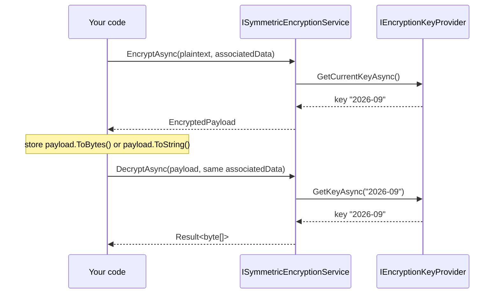
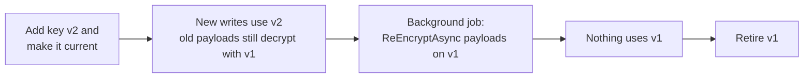
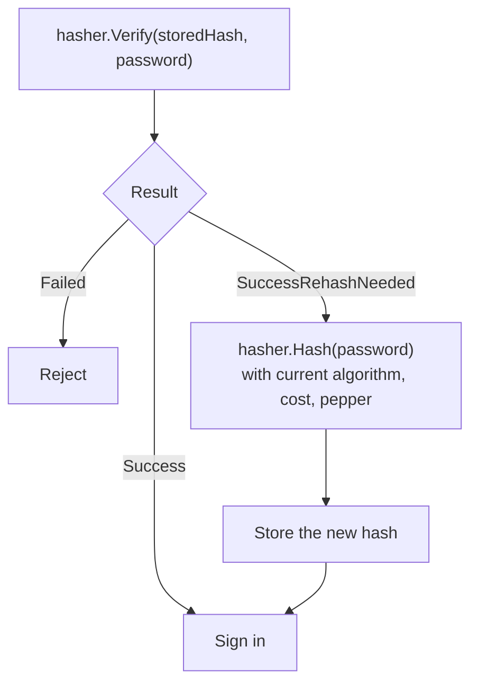
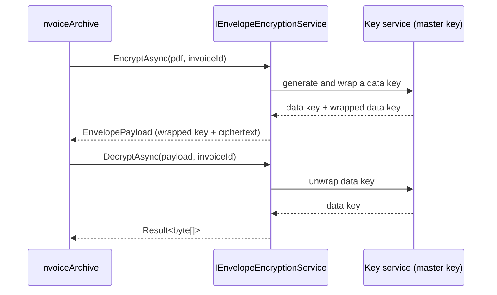

# SharedKernel.Cryptography

[](https://dotnet.microsoft.com/)
[](https://github.com/Gresta-Vertex-Labs/platform-shared-kernel/blob/main/LICENSE)


> **Encryption, signing, password hashing, secure randomness and one-time passwords for .NET services, with safe
> defaults and nothing to tune by accident.**

Cryptography goes wrong in the details: a reused nonce, a missing authentication tag, a fast hash on a password, a
`==` on a token, an algorithm chosen by the attacker. This package makes those details impossible to get wrong. Every
primitive picks a vetted algorithm, hides its parameters, and returns failures as values you can handle. Keys come
from providers you register, so the same code runs with in-memory keys in a test and a key management service in
production.

| 🔒 Encrypt | ✍️ Sign | 🧂 Hash secrets | 🔢 One-time codes |
| --- | --- | --- | --- |
| AES-256-GCM, bound to its context | RSA-PSS, RSA PKCS #1 v1.5, ECDSA | PBKDF2-HMAC-SHA256 (default), Argon2id (companion) | RFC 6238 TOTP, RFC 4226 HOTP |
| Async and synchronous services | Algorithm bound to the key | PHC strings, pepper, rehash-on-verify | Replay protection per time step |
| Envelope encryption, HKDF subkeys | Remote keys (KMS/HSM) supported | Hostile-hash cost limits | Recovery codes, provisioning URIs |
| Key rotation helpers | HMAC-SHA256 | SHA-256 content fingerprints | Fixed-time comparison, secure random |

## Contents

- [Install](#install)
- [Quick start](#quick-start)
- [Which type do I need?](#which-type-do-i-need)
- [How it works](#how-it-works)
- [Recipes](#recipes)
- [Reference](#reference)
- [Security model](#security-model)
- [Pitfalls](#pitfalls)
- [AI quick reference](#ai-quick-reference)
- [Compatibility and guarantees](#compatibility-and-guarantees)

## Install

```shell
dotnet add package SharedKernel.Cryptography
```

| Requirement | Value |
| --- | --- |
| Target framework | `net10.0` |
| Dependencies | [`SharedKernel.Primitives`](https://github.com/Gresta-Vertex-Labs/platform-shared-kernel/tree/main/01.Core/SharedKernel.Primitives), [`SharedKernel.Configuration`](https://github.com/Gresta-Vertex-Labs/platform-shared-kernel/tree/main/01.Core/SharedKernel.Configuration); nothing outside the .NET base class library |
| Registration | `AddSharedKernelCryptography(configuration)`, then opt in to key-dependent services |

| Companion package | Adds |
| --- | --- |
| [`SharedKernel.Cryptography.Argon2`](https://github.com/Gresta-Vertex-Labs/platform-shared-kernel/tree/main/01.Core/SharedKernel.Cryptography.Argon2) | Argon2id password hashing |
| [`SharedKernel.Cryptography.KeyVault.Azure`](https://github.com/Gresta-Vertex-Labs/platform-shared-kernel/tree/main/01.Core/SharedKernel.Cryptography.KeyVault.Azure) | Encryption and signing keys held in Azure Key Vault |

## Quick start

**1. Register** the services and a key provider.

```csharp
// Program.cs
// Keys from your secret store: "Encryption:Keys:2026-09" = base64 of 32 random bytes.
IConfigurationSection keys = builder.Configuration.GetRequiredSection("Encryption:Keys");
var keyProvider = new StaticEncryptionKeyProvider(
    currentKeyId: "2026-09",
    keys.GetChildren().Select(key => new CryptographicKey(key.Key, Convert.FromBase64String(key.Value!))));

builder.Services.AddSingleton<IEncryptionKeyProvider>(keyProvider);
builder.Services.AddSharedKernelCryptography(builder.Configuration)
    .AddSymmetricEncryption();
```

**2. Inject and use** the service. Associated data ties each ciphertext to the record it belongs to.

```csharp
using System.Text;
using SharedKernel.Cryptography.Symmetric;
using SharedKernel.Primitives.Results;

public sealed record Patient(Guid Id, string Name, string EncryptedDiagnosis);

public sealed class PatientRecords(ISymmetricEncryptionService encryption)
{
    public async Task<Patient> CreateAsync(string name, string diagnosis, CancellationToken ct)
    {
        Guid id = Guid.CreateVersion7();
        string encrypted = await encryption.EncryptToStringAsync(diagnosis, DiagnosisContext(id), ct);
        return new Patient(id, name, encrypted);
    }

    public async Task<string> ReadDiagnosisAsync(Patient patient, CancellationToken ct)
    {
        Result<string> diagnosis = await encryption.DecryptToStringAsync(
            patient.EncryptedDiagnosis, DiagnosisContext(patient.Id), ct);

        return diagnosis.IsSuccess
            ? diagnosis.Value
            : throw new InvalidOperationException($"Diagnosis of patient {patient.Id}: {diagnosis.Error.Code}");
    }

    // Associated data binds the ciphertext to this patient and this column.
    // Copied into another row or column, it fails to decrypt.
    internal static byte[] DiagnosisContext(Guid patientId) =>
        Encoding.UTF8.GetBytes($"patients/{patientId}/diagnosis");
}
```

**3. Password hashing, random tokens, HMAC and TOTP need no keys:** inject `IOneWayHasher`,
`ISecureRandomGenerator`, `IHmacSigner` or `ITotpGenerator` directly.

> [!TIP]
> Every registration uses `TryAdd`. A service you register before calling `AddSharedKernelCryptography` wins, which is
> how you replace an implementation.

## Which type do I need?

| I need to… | Use | Recipe |
| --- | --- | --- |
| Encrypt a value and decrypt it later | `ISymmetricEncryptionService` | [Encrypt a field](#1-encrypt-a-field-bound-to-its-record) |
| Encrypt from code that cannot await (EF Core value converters, serializers) | `ISynchronousSymmetricEncryptionService` | [Key providers](#key-providers) |
| Move stored data to a new key | `IsEncryptedWithCurrentKeyAsync`, `ReEncryptAsync` | [Rotate keys](#2-rotate-keys-without-downtime) |
| Give every tenant its own key | `provider.ForPurpose(...)`, `SubkeyDerivation` | [Per-tenant keys](#3-give-every-tenant-its-own-key) |
| Encrypt files or exports, one key per file | `IEnvelopeEncryptionService` | [Envelope encryption](#4-encrypt-files-with-envelope-encryption) |
| Store passwords and upgrade their hashes over time | `IOneWayHasher` | [Password sign-in](#5-sign-users-in-with-passwords) |
| Issue API keys and look them up safely | `ISecureRandomGenerator`, `IHmacSigner` | [API keys](#6-issue-and-check-api-keys) |
| Sign data others verify with a public key | `IAsymmetricSignatureService` | [Signed tokens](#7-sign-and-verify-a-token) |
| Add an authenticator app as a second factor | `ITotpVerifier`, `TotpProvisioningUri`, `IRecoveryCodeGenerator` | [Two-factor](#8-add-authenticator-app-two-factor) |
| Load keys from Vault, AWS KMS or an internal service | `IEncryptionKeyProvider`, `CachedEncryptionKeyProvider` | [Custom key service](#9-load-keys-from-your-key-service) |
| Compare a presented secret with the expected one | `FixedTimeComparison` | [Reference](#fixed-time-comparison) |
| Fingerprint content (ETags, deduplication, hash chains) | `IContentHasher` | [Reference](#content-hashing) |
| Generate tokens, salts or random codes | `ISecureRandomGenerator` | [Reference](#secure-random-values) |

## How it works

### Encryption and decryption

The service asks the key provider for the current key, encrypts with a fresh random nonce, and returns a payload that
names the key it used. Decryption looks that key up again, so payloads written before a rotation keep working.



The stored payload is compact and versioned:

```text
EncryptedPayload (format 0x01)
┌──────┬──────────────┬────────────────┬────────────┬──────────┬────────────┐
│ 0x01 │ key id: 1 B  │ key id (UTF-8) │ nonce: 12 B│ tag: 16 B│ ciphertext │
│      │ length       │ ≤ 255 bytes    │            │          │            │
└──────┴──────────────┴────────────────┴────────────┴──────────┴────────────┘
ToString() = the same bytes as unpadded Base64Url
```

Associated data is authenticated but never stored. Decrypting with different associated data fails exactly like a
tampered payload, which is what stops a ciphertext from being copied into another row, tenant or message.

### Key rotation

Rotation never breaks existing data: new writes use the new key while old payloads still decrypt with theirs.



### Password hashes that upgrade themselves

Every hash records its algorithm, cost and pepper. When any of those changes, a successful sign-in tells you to store
a new hash, so the whole database migrates as users sign in.



```text
$pbkdf2-sha256$i=600000$<salt>$<hash>              PBKDF2, no pepper
$pbkdf2-sha256$i=600000,k=p1$<salt>$<hash>         PBKDF2 with pepper "p1"
$argon2id$v=19$m=19456,t=2,p=1$<salt>$<hash>       Argon2id (companion package)
```

## Recipes

Complete, compiling examples. Each one lists the `using` directives it needs.

### 1. Encrypt a field bound to its record

The [quick start](#quick-start) is this recipe: `PatientRecords` encrypts a diagnosis with associated data built from
the patient id and the column name. The same pattern fits any stored secret: national ids, bank details, notes,
access tokens. Pick associated data that identifies where the value lives, and rebuild it byte for byte when reading.

> [!IMPORTANT]
> Associated data is required on every call. Pass `ReadOnlyMemory<byte>.Empty` only when nothing identifies the
> context; otherwise an attacker with database access can swap ciphertexts between rows and they still decrypt.

### 2. Rotate keys without downtime

Add the new key to your provider and make it current. Then run a job that moves stored payloads to it:

```csharp
using SharedKernel.Cryptography.Symmetric;
using SharedKernel.Primitives.Results;

public interface IDiagnosisStore
{
    IAsyncEnumerable<(Guid PatientId, string EncryptedDiagnosis)> ReadAllAsync(CancellationToken ct);

    Task UpdateAsync(Guid patientId, string encryptedDiagnosis, CancellationToken ct);
}

public sealed class DiagnosisReEncryptionJob(IDiagnosisStore store, ISymmetricEncryptionService encryption)
    : BackgroundService
{
    protected override async Task ExecuteAsync(CancellationToken stoppingToken)
    {
        await foreach ((Guid patientId, string stored) in store.ReadAllAsync(stoppingToken))
        {
            if (!EncryptedPayload.TryParse(stored, out EncryptedPayload? payload)
                || await encryption.IsEncryptedWithCurrentKeyAsync(payload, stoppingToken))
            {
                continue; // not a payload, or already on the current key
            }

            Result<EncryptedPayload> rotated = await encryption.ReEncryptAsync(
                payload, PatientRecords.DiagnosisContext(patientId), stoppingToken);

            if (rotated.IsSuccess)
            {
                await store.UpdateAsync(patientId, rotated.Value.ToString(), stoppingToken);
            }
        }
    }
}
```

Retire the old key only when the job finds nothing left on it. A payload whose key is gone fails with
`cryptography.unknown_key_id`.

### 3. Give every tenant its own key

Derive a separate AES key per tenant from one root key with HKDF. There is nothing extra to store or rotate.

```csharp
using SharedKernel.Cryptography.KeyDerivation;
using SharedKernel.Cryptography.Symmetric;

public sealed class TenantEncryption(IEncryptionKeyProvider rootKeys)
{
    // Each tenant gets its own AES key, derived with HKDF from the current root key.
    // Payloads keep the root key id, so rotating the root key rotates every tenant.
    public ISymmetricEncryptionService For(Guid tenantId) =>
        new AesGcmEncryptionService(rootKeys.ForPurpose("tenant-data", tenantId.ToByteArray()));
}
```

A payload encrypted for one tenant fails to decrypt with any other tenant's service. For synchronous code use
`ForPurposeSynchronous`; for raw key bytes use `SubkeyDerivation.DeriveKey(rootKey, purpose, context)`.

### 4. Encrypt files with envelope encryption

Each file gets its own data key, wrapped by a master key that never leaves your key service. Requires an
`IEnvelopeEncryptionProvider`, such as
[`SharedKernel.Cryptography.KeyVault.Azure`](https://github.com/Gresta-Vertex-Labs/platform-shared-kernel/tree/main/01.Core/SharedKernel.Cryptography.KeyVault.Azure),
and `.AddEnvelopeEncryption()`.

```csharp
using SharedKernel.Cryptography.Envelope;
using SharedKernel.Primitives.Results;

public interface IBlobStore
{
    Task UploadAsync(string name, byte[] content, CancellationToken ct);

    Task<byte[]> DownloadAsync(string name, CancellationToken ct);
}

public sealed class InvoiceArchive(IEnvelopeEncryptionService envelope, IBlobStore blobs)
{
    public async Task StoreAsync(Guid invoiceId, byte[] pdf, CancellationToken ct)
    {
        // A fresh data key for this file, wrapped by the key service's master key.
        EnvelopePayload payload = await envelope.EncryptAsync(pdf, invoiceId.ToByteArray(), ct);
        await blobs.UploadAsync($"invoices/{invoiceId}", payload.ToBytes(), ct);
    }

    public async Task<byte[]?> LoadAsync(Guid invoiceId, CancellationToken ct)
    {
        byte[] stored = await blobs.DownloadAsync($"invoices/{invoiceId}", ct);
        if (!EnvelopePayload.TryParse(stored, out EnvelopePayload? payload))
        {
            return null;
        }

        Result<byte[]> pdf = await envelope.DecryptAsync(payload, invoiceId.ToByteArray(), ct);
        return pdf.IsSuccess ? pdf.Value : null;
    }
}
```



Every encryption and decryption calls the key service once, so use envelopes for files and exports, and
`ISymmetricEncryptionService` for many small values.

### 5. Sign users in with passwords

```csharp
using SharedKernel.Cryptography.Hashing;

public sealed record User(Guid Id, string Email, string PasswordHash);

public interface IUserStore
{
    Task<User?> FindByEmailAsync(string email, CancellationToken ct);

    Task UpdatePasswordHashAsync(Guid userId, string passwordHash, CancellationToken ct);
}

// Register as a singleton: the decoy hash is computed once.
public sealed class PasswordSignIn(IUserStore users, IOneWayHasher hasher)
{
    // Verified when the email is unknown, so both cases take the same time.
    private readonly string _decoyHash = hasher.Hash("decoy-password-never-used");

    public async Task<Guid?> SignInAsync(string email, string password, CancellationToken ct)
    {
        User? user = await users.FindByEmailAsync(email, ct);
        HashVerificationResult result = hasher.Verify(user?.PasswordHash ?? _decoyHash, password);

        if (user is null || result == HashVerificationResult.Failed)
        {
            return null;
        }

        if (result == HashVerificationResult.SuccessRehashNeeded)
        {
            // Algorithm, cost or pepper changed since this hash was stored: upgrade it now.
            await users.UpdatePasswordHashAsync(user.Id, hasher.Hash(password), ct);
        }

        return user.Id;
    }
}
```

Add a pepper so a stolen database alone is not enough to test guesses offline:

```json
{
  "SharedKernel": {
    "Cryptography": {
      "OneWayHashing": {
        "CurrentPepperId": "p1",
        "Peppers": { "p1": "<base64 of 32+ random bytes, from your secret store>" }
      }
    }
  }
}
```

Existing hashes without a pepper keep verifying and report `SuccessRehashNeeded`. To rotate, add `p2`, make it
current, and keep `p1` until no stored hash uses it.

### 6. Issue and check API keys

API keys are long random tokens, so a fast keyed hash is the right storage: it can be indexed and checked on every
request. Use `IOneWayHasher` for passwords and other low-entropy secrets, not here.

```csharp
using System.Text;
using SharedKernel.Cryptography.Random;
using SharedKernel.Cryptography.Signing;

/// <summary>At least 32 random bytes from your secret store, never from the database.</summary>
public sealed record ApiKeyLookupKey(byte[] Material);

public sealed class ApiKeys(ISecureRandomGenerator random, IHmacSigner hmac, ApiKeyLookupKey lookupKey)
{
    /// <summary>Returns the key to show the client once, and the only value you store.</summary>
    public (string ApiKey, string LookupHash) Issue()
    {
        string apiKey = "sk_" + random.GetToken(); // 256 random bits
        return (apiKey, LookupHash(apiKey));
    }

    /// <summary>Hash the presented key and look the client up by this value.</summary>
    public string LookupHash(string presentedApiKey) =>
        Convert.ToHexString(hmac.Sign(Encoding.UTF8.GetBytes(presentedApiKey), lookupKey.Material));
}
```

```csharp
// Program.cs
builder.Services.AddSingleton(new ApiKeyLookupKey(
    Convert.FromBase64String(builder.Configuration["ApiKeys:LookupKey"]!)));
builder.Services.AddSingleton<ApiKeys>();
```

A database leak reveals only lookup hashes, which are useless without the lookup key. When a key comes from
configuration instead of a database, compare it with `FixedTimeComparison.AreEqual` (or `AreEqualToAny` during a
rotation window).

### 7. Sign and verify a token

A compact JWS-style token signed with ES256. The algorithm belongs to the key, so no call site can pick a weaker one.

```csharp
// Program.cs: in production, load keys from a key service (for example Azure Key Vault).
builder.Services.AddSingleton<ISigningKeyProvider>(new InMemorySigningKeyProvider(
[
    SigningKey.FromECDsa("receipts", ECDsa.Create(ECCurve.NamedCurves.nistP256)),     // ES256
    SigningKey.FromRsa("partner-api", RSA.Create(3072), SignatureAlgorithm.PS256),   // RSASSA-PSS
]));

builder.Services.AddSharedKernelCryptography(builder.Configuration)
    .AddAsymmetricSigning();
```

```csharp
using System.Buffers.Text;
using System.Text;
using System.Text.Json;
using SharedKernel.Cryptography.Signing;

public sealed class ReceiptTokens(IAsymmetricSignatureService signatures)
{
    private const string KeyId = "receipts";

    public async Task<string> SignAsync<TReceipt>(TReceipt receipt, CancellationToken ct)
    {
        SignatureAlgorithm algorithm = await signatures.GetAlgorithmAsync(KeyId, ct); // e.g. ES256

        string header = Encode(JsonSerializer.SerializeToUtf8Bytes(new { alg = algorithm.ToString(), kid = KeyId }));
        string payload = Encode(JsonSerializer.SerializeToUtf8Bytes(receipt));
        byte[] signature = await signatures.SignAsync(Encoding.ASCII.GetBytes($"{header}.{payload}"), KeyId, ct);

        return $"{header}.{payload}.{Encode(signature)}";
    }

    public async Task<TReceipt?> ReadAsync<TReceipt>(string token, CancellationToken ct)
    {
        string[] parts = token.Split('.');
        if (parts.Length != 3)
        {
            return default;
        }

        try
        {
            // The key is chosen here, never by the token's header.
            bool valid = await signatures.VerifyAsync(
                Encoding.ASCII.GetBytes($"{parts[0]}.{parts[1]}"), Base64Url.DecodeFromChars(parts[2]), KeyId, ct);

            return valid ? JsonSerializer.Deserialize<TReceipt>(Base64Url.DecodeFromChars(parts[1])) : default;
        }
        catch (FormatException)
        {
            return default; // not Base64Url
        }
    }

    private static string Encode(byte[] bytes) => Base64Url.EncodeToString(bytes);
}
```

ECDSA signatures use the IEEE P1363 format JWS expects. For full JWT validation (expiry, audience, issuer) use a JWT
library for claims and this service for keys and signatures.

### 8. Add authenticator-app two-factor

Enrollment creates a secret, encrypts it, and shows a QR code and recovery codes once. Verification throttles
attempts, decrypts the secret and rejects replayed codes.

```csharp
using System.Data.Common;
using System.Security.Cryptography;
using System.Text;
using SharedKernel.Cryptography.Hashing;
using SharedKernel.Cryptography.Random;
using SharedKernel.Cryptography.Symmetric;
using SharedKernel.Cryptography.Totp;
using SharedKernel.Primitives.Results;

public interface ITwoFactorStore
{
    Task SaveAsync(Guid userId, string encryptedSecret, IReadOnlyList<string> recoveryCodeHashes, CancellationToken ct);

    Task<string?> FindEncryptedSecretAsync(Guid userId, CancellationToken ct);
}

public sealed class TwoFactor(
    ISecureRandomGenerator random,
    ISymmetricEncryptionService encryption,
    IOneWayHasher hasher,
    IRecoveryCodeGenerator recoveryCodes,
    ITotpVerifier verifier,
    ITotpAttemptThrottle throttle,
    ITwoFactorStore store)
{
    public async Task<(Uri QrCode, IReadOnlyList<string> RecoveryCodes)> EnrollAsync(
        Guid userId, string email, CancellationToken ct)
    {
        byte[] secret = TotpSecret.Generate(random);
        try
        {
            Uri qrCode = TotpProvisioningUri.Build("Contoso", email, secret);
            EncryptedPayload encryptedSecret = await encryption.EncryptAsync(secret, SecretContext(userId), ct);

            IReadOnlyList<string> codes = recoveryCodes.GenerateCodes();
            string[] codeHashes = [.. codes.Select(code => hasher.Hash(RecoveryCodeGenerator.Normalize(code)))];

            await store.SaveAsync(userId, encryptedSecret.ToString(), codeHashes, ct);
            return (qrCode, codes); // show both once
        }
        finally
        {
            CryptographicOperations.ZeroMemory(secret);
        }
    }

    public async Task<bool> VerifyAsync(Guid userId, string code, CancellationToken ct)
    {
        string identity = userId.ToString();
        if (await throttle.IsThrottledAsync(identity, ct))
        {
            return false;
        }

        await throttle.RecordAttemptAsync(identity, ct);

        string? stored = await store.FindEncryptedSecretAsync(userId, ct);
        if (!EncryptedPayload.TryParse(stored, out EncryptedPayload? payload))
        {
            return false;
        }

        Result<byte[]> secret = await encryption.DecryptAsync(payload, SecretContext(userId), ct);
        if (secret.IsFailure)
        {
            return false;
        }

        try
        {
            TotpVerificationResult result = await verifier.VerifyAsync(identity, secret.Value, code, cancellationToken: ct);
            return result == TotpVerificationResult.Valid; // Replayed: the code was already used
        }
        finally
        {
            CryptographicOperations.ZeroMemory(secret.Value);
        }
    }

    private static byte[] SecretContext(Guid userId) => Encoding.UTF8.GetBytes($"users/{userId}/totp-secret");
}
```

The replay guard must compare and store in one atomic operation. A PostgreSQL implementation:

```csharp
/// <summary>PostgreSQL replay guard: one atomic statement, so two requests cannot both accept a code.</summary>
public sealed class PostgresTotpReplayGuard(DbDataSource database) : ITotpReplayGuard
{
    private const string Sql = """
        INSERT INTO totp_last_step (identity_key, time_step) VALUES (@identity, @step)
        ON CONFLICT (identity_key) DO UPDATE SET time_step = EXCLUDED.time_step
        WHERE totp_last_step.time_step < EXCLUDED.time_step
        """;

    public async ValueTask<bool> TryAcceptTimeStepAsync(
        string identityKey, long timeStep, TimeSpan retention, CancellationToken cancellationToken = default)
    {
        await using DbCommand command = database.CreateCommand(Sql);
        AddParameter(command, "identity", identityKey);
        AddParameter(command, "step", timeStep);

        // One row changes when the step is new or later; none when it is a replay.
        return await command.ExecuteNonQueryAsync(cancellationToken) == 1;
    }

    private static void AddParameter(DbCommand command, string name, object value)
    {
        DbParameter parameter = command.CreateParameter();
        parameter.ParameterName = name;
        parameter.Value = value;
        command.Parameters.Add(parameter);
    }
}
```

```csharp
// Program.cs
builder.Services.AddSingleton<ITotpReplayGuard, PostgresTotpReplayGuard>();
builder.Services.AddSingleton<ITotpAttemptThrottle, MyAttemptThrottle>(); // e.g. 5 attempts per 15 minutes
builder.Services.AddSharedKernelCryptography(builder.Configuration)
    .AddSymmetricEncryption()
    .AddTotpVerification();
```

With Redis, use a Lua script and expire the entry after `retention` (`TotpParameters.ValidityWindow`).

### 9. Load keys from your key service

Wrap your client in an `IEncryptionKeyProvider`, then cache it so encryption does not call the service every time.

```csharp
using System.Security.Cryptography;
using SharedKernel.Cryptography.Symmetric;

/// <summary>Your client for the key service (Vault, AWS KMS, an internal API).</summary>
public interface IKeyServiceClient
{
    Task<(string KeyId, byte[] Material)> GetCurrentKeyAsync(CancellationToken ct);

    Task<byte[]?> FindKeyAsync(string keyId, CancellationToken ct);
}

public sealed class KeyServiceEncryptionKeyProvider(IKeyServiceClient client) : IEncryptionKeyProvider
{
    public async ValueTask<CryptographicKey> GetCurrentKeyAsync(CancellationToken cancellationToken = default)
    {
        (string keyId, byte[] material) = await client.GetCurrentKeyAsync(cancellationToken);
        return ToKey(keyId, material);
    }

    public async ValueTask<CryptographicKey?> GetKeyAsync(string keyId, CancellationToken cancellationToken = default)
    {
        // Key ids come from stored payloads and may be forged: reject anything your service never issues.
        if (keyId.Length is 0 or > 64 || !keyId.All(char.IsAsciiLetterOrDigit))
        {
            return null;
        }

        byte[]? material = await client.FindKeyAsync(keyId, cancellationToken);
        return material is null ? null : ToKey(keyId, material);
    }

    private static CryptographicKey ToKey(string keyId, byte[] material)
    {
        try
        {
            return new CryptographicKey(keyId, material); // copies the material
        }
        finally
        {
            CryptographicOperations.ZeroMemory(material);
        }
    }
}
```

```csharp
// Program.cs
builder.Services.AddSingleton<KeyServiceEncryptionKeyProvider>();
builder.Services.AddSingleton<IEncryptionKeyProvider>(sp => new CachedEncryptionKeyProvider(
    sp.GetRequiredService<KeyServiceEncryptionKeyProvider>(),
    TimeProvider.System,
    timeToLive: TimeSpan.FromMinutes(5)));

builder.Services.AddSharedKernelCryptography(builder.Configuration)
    .AddSymmetricEncryption();
```

`CachedEncryptionKeyProvider` shares one in-flight lookup between concurrent callers, bounds its size, never caches a
missing key, and never serves an expired one.

### 10. Test code that encrypts

No mocks needed: use a real service with a random in-memory key.

```csharp
var encryption = new AesGcmEncryptionService(new StaticEncryptionKeyProvider(
    "test", [new CryptographicKey("test", RandomNumberGenerator.GetBytes(32))]));
```

## Reference

### Namespaces

| Namespace | Types |
| --- | --- |
| `SharedKernel.Cryptography.Extensions` | `AddSharedKernelCryptography`, `ICryptographyBuilder` and its `Add…` methods |
| `SharedKernel.Cryptography.Symmetric` | `ISymmetricEncryptionService`, `ISynchronousSymmetricEncryptionService`, `EncryptedPayload`, `CryptographicKey`, key providers |
| `SharedKernel.Cryptography.Envelope` | `IEnvelopeEncryptionService`, `IEnvelopeEncryptionProvider`, `EnvelopePayload`, `EnvelopeDataKey` |
| `SharedKernel.Cryptography.KeyDerivation` | `SubkeyDerivation`, `ForPurpose`, `ForPurposeSynchronous` |
| `SharedKernel.Cryptography.Signing` | `IAsymmetricSignatureService`, `ISigningKeyProvider`, `SigningKey`, `SignatureAlgorithm`, `IHmacSigner` |
| `SharedKernel.Cryptography.Hashing` | `IOneWayHasher`, `HashVerificationResult`, `IOneWayHashAlgorithm`, `PhcHashString`, `IContentHasher` |
| `SharedKernel.Cryptography.Random` | `ISecureRandomGenerator` |
| `SharedKernel.Cryptography.Totp` | `ITotpVerifier`, `ITotpGenerator`, `IHotpGenerator`, `TotpParameters`, `TotpSecret`, `TotpProvisioningUri`, `ITotpReplayGuard`, `ITotpAttemptThrottle`, `IRecoveryCodeGenerator`, `Base32` |
| `SharedKernel.Cryptography.Options` | `CryptographyOptions`, `OneWayHashingOptions`, `Pbkdf2Options` |
| `SharedKernel.Cryptography` | `FixedTimeComparison`, `CryptographyErrorCodes` |

### Registration

```csharp
services.AddSharedKernelCryptography(configuration)   // key-free services, always
    .AddSymmetricEncryption()                         // needs IEncryptionKeyProvider
    .AddSynchronousSymmetricEncryption()              // needs ISynchronousEncryptionKeyProvider
    .AddEnvelopeEncryption()                          // needs IEnvelopeEncryptionProvider
    .AddAsymmetricSigning()                           // needs ISigningKeyProvider
    .AddTotpVerification()                            // needs ITotpReplayGuard
    .AddOneWayHashAlgorithm<MyAlgorithm>();           // an extra IOneWayHashAlgorithm
```

| Registered by `AddSharedKernelCryptography` | Implementation |
| --- | --- |
| `IOneWayHasher` | `OneWayHasher` over every registered `IOneWayHashAlgorithm` (PBKDF2 always included) |
| `ISecureRandomGenerator` | `SecureRandomGenerator` |
| `IContentHasher` | `Sha256ContentHasher` |
| `IHmacSigner` | `HmacSha256Signer` |
| `IHotpGenerator`, `ITotpGenerator`, `IRecoveryCodeGenerator` | `HotpGenerator`, `TotpGenerator`, `RecoveryCodeGenerator` |
| `IClock` | From `SharedKernel.Primitives`, used by TOTP |
| Options | `CryptographyOptions`, `Pbkdf2Options`, validated at startup |

All services are thread-safe singletons. Nothing that needs a provider you have not registered is added, so container
validation passes.

### Symmetric encryption

| Topic | Behaviour |
| --- | --- |
| Algorithm | AES-256-GCM, 96-bit random nonce, 128-bit tag. Keys must be exactly 32 bytes. |
| Associated data | Required; authenticated, never stored |
| Async and sync | `ISymmetricEncryptionService` and `ISynchronousSymmetricEncryptionService` produce identical payloads and read each other's |
| Text | `EncryptToString(Async)` encrypts UTF-8 and returns Base64Url; `DecryptToString(Async)` reverses it |
| Storage | `payload.ToBytes()` / `EncryptedPayload.TryParse(bytes, out …)`, or `ToString()` / `TryParse(text, out …)` |
| Rotation | `IsEncryptedWithCurrentKey(Async)`, `ReEncrypt(Async)` |
| Failures | Bad input returns a failed `Result`, never an exception. A wrong key length or an unreachable key service throws. |

### Key providers

| Type | Use |
| --- | --- |
| `IEncryptionKeyProvider` | Async lookup: key management services |
| `ISynchronousEncryptionKeyProvider` | Lookup from memory: code that cannot await |
| `StaticEncryptionKeyProvider` | Implements both, over keys loaded at startup |
| `CachedEncryptionKeyProvider` | Caches another provider with a time to live, shared in-flight lookups and a size bound (default 1,024) |
| `PurposeBoundEncryptionKeyProvider` / `…Synchronous…` | Derives a purpose- and context-specific key from each key of another provider |
| `IReadinessProbe` (`SharedKernel.Primitives.Health`) | Implemented by remote providers, e.g. the Azure Key Vault provider (`encryption-key-provider`); in-memory providers need none |

There is no bridge from async to sync. A synchronous service needs keys already in memory, for example a
`StaticEncryptionKeyProvider` filled from your key service at startup.

### Envelope encryption

| Topic | Behaviour |
| --- | --- |
| Format | `[0x02][master key id][wrapped key][nonce][tag][ciphertext]`; the header is authenticated with your associated data |
| Data keys | 32 random bytes per payload, zeroed after use |
| Cost | One key service call per encryption and per decryption |
| Unwrap failure | `cryptography.data_key_unwrap_failed` |

### Subkey derivation

HKDF-SHA256 (RFC 5869). The root key must be at least 32 bytes; subkeys are 16 to 64 bytes (default 32). Purpose and
context are length-prefixed, so no two different pairs produce the same key.

### Signing

| Algorithm | Key | Digest | Encoding |
| --- | --- | --- | --- |
| `PS256`, `PS384`, `PS512` | RSA ≥ 2048 bits | SHA-256 / 384 / 512 | RSASSA-PSS (preferred for RSA) |
| `RS256`, `RS384`, `RS512` | RSA ≥ 2048 bits | SHA-256 / 384 / 512 | RSASSA-PKCS1-v1_5 |
| `ES256`, `ES384`, `ES512` | P-256, P-384, P-521 | SHA-256 / 384 / 512 | IEEE P1363 (default) or DER |

| Topic | Behaviour |
| --- | --- |
| Keys | `SigningKey.FromRsa(id, rsa, algorithm)`, `SigningKey.FromECDsa(id, ecdsa)` (algorithm from the curve), or a subclass for a remote key |
| Hashing | Data is hashed locally; a remote key receives only the digest. Stream overloads hash without buffering. |
| Unknown key | `SignAsync` throws `KeyNotFoundException`; `VerifyAsync` returns `false` |
| Malformed signature | `VerifyAsync` returns `false` |
| JWS | `GetAlgorithmAsync(keyId)` returns the `alg` value |

### HMAC

`IHmacSigner.Sign(data, key)` computes HMAC-SHA256; `Verify` compares in fixed time. Keys shorter than 32 bytes throw.

### Password and secret hashing

| Topic | Behaviour |
| --- | --- |
| Default | PBKDF2-HMAC-SHA256, 600,000 iterations, 16-byte salt, 32-byte hash |
| Format | PHC string; a pepper adds `k=<pepper id>` |
| Rehash | `SuccessRehashNeeded` when the algorithm, cost, pepper or format is out of date |
| Pepper | HMAC-SHA256 of the secret with a key from configuration (≥ 32 bytes), applied before hashing |
| Normalization | Unicode NFKC, so the same password typed on different keyboards matches |
| Hostile hashes | Costs are checked before any work: PBKDF2 at most 2,000,000 iterations, salt 16–64 bytes |
| Algorithms | PBKDF2 always; Argon2id via the companion package; your own via `IOneWayHashAlgorithm` |

### Content hashing

`IContentHasher` computes SHA-256 over spans or streams; `ComputeHashHex` and `ComputeHashBase64` return text. It is
fast and unsalted by design: never use it for passwords or other secrets.

### Fixed-time comparison

```csharp
bool ok = FixedTimeComparison.AreEqual(presented, expected);                // strings: hides length and position
bool okDuringRotation = FixedTimeComparison.AreEqualToAny(presented, [current, previous]);
bool bytesEqual = FixedTimeComparison.AreEqual(macA, macB);                  // spans: time depends on length only
```

### Secure random values

| Member | Returns |
| --- | --- |
| `GetBytes(length)`, `Fill(span)` | Random bytes from the operating system generator |
| `GetInt32(toExclusive)` | Uniform integer in `[0, toExclusive)` |
| `GetString(alphabet, length)` | Uniform characters from `alphabet` |
| `GetToken(byteCount = 32)` | Unpadded Base64Url token; at least 16 bytes (43 characters for 32) |

### One-time passwords

| Topic | Behaviour |
| --- | --- |
| Parameters | `TotpParameters`: 6–8 digits (default 6), 15–300 s step (default 30), 0–5 drift steps (default 1), SHA-1 / SHA-256 / SHA-512 (default SHA-1, which authenticator apps expect) |
| Secrets | At least 16 bytes; `TotpSecret.Generate` creates 20 |
| Codes | Spaces and hyphens ignored; compared in fixed time across the whole drift window |
| Replay | `ITotpReplayGuard` stores the last accepted time step per identity; the same or an older step is `Replayed` |
| Throttling | Your `ITotpAttemptThrottle`; RFC 4226 requires limiting attempts |
| Recovery codes | `XXXXX-XXXXX` from the Base32 alphabet, 50 bits each; `RecoveryCodeGenerator.Normalize` before hashing or comparing |
| Provisioning | `TotpProvisioningUri.Build(issuer, account, secret, parameters)` returns the `otpauth://` URI for a QR code |

### Error codes

`CryptographyErrorCodes` constants, returned in `Result.Error.Code`:

| Code | Type | When |
| --- | --- | --- |
| `cryptography.malformed_payload` | Validation | Input is not a payload, or decrypted text is not UTF-8 |
| `cryptography.decryption_failed` | Validation | Tampered payload, different associated data, or different key material |
| `cryptography.unknown_key_id` | Unexpected | The payload names a key the provider does not have |
| `cryptography.data_key_unwrap_failed` | Validation | The key service rejected an envelope's data key |
| `cryptography.invalid_base32_encoding` | Validation | `Base32.Decode` input is invalid |

### Configuration

```json
{
  "SharedKernel": {
    "Cryptography": {
      "OneWayHashing": {
        "Algorithm": "pbkdf2-sha256",
        "CurrentPepperId": "p1",
        "Peppers": { "p1": "<base64 of 32+ random bytes>" }
      },
      "Pbkdf2": { "Iterations": 600000 }
    }
  }
}
```

| Setting | Default | Validation |
| --- | --- | --- |
| `OneWayHashing:Algorithm` | `pbkdf2-sha256` | Must be a registered algorithm id |
| `OneWayHashing:CurrentPepperId` | none | Must exist in `Peppers` |
| `OneWayHashing:Peppers` | empty | Ids of 1–32 letters, digits or hyphens; values Base64 of at least 32 bytes |
| `Pbkdf2:Iterations` | 600,000 | 100,000 – 2,000,000 |

Invalid configuration stops the host at startup. Every section is optional.

## Security model

### What each primitive guarantees

| Threat | Protection |
| --- | --- |
| Reading or altering stored ciphertext | AES-256-GCM: confidentiality and integrity; any change fails decryption |
| Moving a ciphertext to another row, tenant or message | Associated data must match exactly |
| Forged key ids in stored payloads | Unknown ids fail closed; `CachedEncryptionKeyProvider` never caches misses and bounds its size |
| A leaked data key or tenant key | Envelope data keys and HKDF subkeys limit exposure to one value or one tenant |
| Algorithm confusion in signatures | The algorithm is fixed by the key; RSA keys under 2048 bits and mismatched curves are rejected |
| Offline cracking of a stolen password table | Slow salted hashes; with a pepper, the table alone is not enough |
| A stored hash crafted to exhaust CPU or memory | Costs are bounded before hashing |
| Timing attacks on secrets and codes | Fixed-time comparison for tokens, HMACs and TOTP codes |
| Predictable tokens | Operating system random generator only |
| Replayed one-time codes | Atomic last-accepted time step per identity |

### What it does not protect against

- **A compromised process.** Keys and plaintext live in memory while in use. Protect the host.
- **Plaintext length.** Ciphertext length reveals plaintext length; pad values first if that matters.
- **Key ids.** The key id in a payload and the master key id in an envelope are stored in clear.
- **Brute force against low-entropy secrets without throttling.** Rate-limit sign-in and TOTP attempts.
- **Untrusted writers of RSA-wrapped envelopes.** Anyone with an RSA master public key can wrap a data key and create
  payloads that decrypt. Use a symmetric master key (for example a managed HSM) or sign the payloads.
- **Logging.** Never log plaintext, keys, secrets, codes or full payloads.

### FIPS 140-3

Every algorithm here is FIPS 140-3 approved when the operating system's cryptographic provider runs in FIPS mode:
AES-256-GCM, HKDF-SHA256, PBKDF2-HMAC-SHA256, RSA-PSS, RSA PKCS #1 v1.5, ECDSA P-256/P-384/P-521, HMAC-SHA256,
SHA-256/384/512 and the system random generator. TOTP defaults to HMAC-SHA1 as authenticator apps require; HMAC-SHA1
remains approved for this use. Argon2id (companion package) is not approved: keep PBKDF2 where FIPS compliance is
required. This package is not itself a validated module; validation belongs to the platform provider .NET calls.

### Reporting a vulnerability

Please do not open a public issue. Report privately through the repository's
[Security tab](https://github.com/Gresta-Vertex-Labs/platform-shared-kernel/security) (**Report a vulnerability**),
as described in the [security policy](https://github.com/Gresta-Vertex-Labs/platform-shared-kernel/blob/main/SECURITY.md).

## Pitfalls

| ❌ Don't | ✅ Do | Why |
| --- | --- | --- |
| Pass empty associated data by habit | Pass the row, tenant or message identity | Otherwise ciphertexts can be swapped between records |
| Block on the async service (`.Result`) in a converter | Use `ISynchronousSymmetricEncryptionService` over in-memory keys | Blocking on a key service starves the thread pool |
| Call a remote key service on every encryption | Wrap it in `CachedEncryptionKeyProvider` | Latency, cost and rate limits |
| Delete an old key right after rotating | Re-encrypt with `ReEncryptAsync`, then retire it | Old payloads fail with `unknown_key_id` |
| Hash passwords with `IContentHasher` or SHA-256 | Use `IOneWayHasher` | Fast hashes allow billions of guesses per second |
| Hash API keys with `IOneWayHasher` on every request | Use an HMAC lookup hash ([recipe](#6-issue-and-check-api-keys)) | Slow hashes on every request exhaust CPU |
| Ignore `SuccessRehashNeeded` | Store the new hash | Old costs and algorithms stay forever |
| Remove a pepper still in use | Keep it until no hash references it | Those users can no longer sign in |
| Compare secrets with `==` or `SequenceEqual` | Use `FixedTimeComparison` | Early exit leaks how much of a guess was right |
| Use `System.Random` or `Guid.NewGuid()` for secrets | Use `ISecureRandomGenerator` | Predictable or not guaranteed random |
| Store TOTP secrets in plain text | Encrypt them | Anyone who reads the secret can generate codes |
| Verify TOTP codes without a throttle | Limit attempts per identity | Six digits are guessable without limits |
| Let a token's header choose the verification key | Choose the key id in code | An attacker would pick their own key |

## AI quick reference

Rules for generating code with this package. Each line is a rule.

```text
REGISTER     services.AddSharedKernelCryptography(configuration) then opt in: .AddSymmetricEncryption(),
             .AddSynchronousSymmetricEncryption(), .AddEnvelopeEncryption(), .AddAsymmetricSigning(),
             .AddTotpVerification(). Register the matching provider yourself.
ENCRYPT      Async: ISymmetricEncryptionService.EncryptAsync(plaintext, associatedData, ct).
             Sync (EF Core converters, serializers): ISynchronousSymmetricEncryptionService over an
             ISynchronousEncryptionKeyProvider. Never block on the async service.
             Always pass associatedData identifying the record (row id + column, tenant id, message type).
STORE        payload.ToBytes() / EncryptedPayload.TryParse(bytes, out p); payload.ToString() / TryParse(text, out p).
DECRYPT      Returns Result<byte[]>; check IsSuccess. Codes: malformed_payload, decryption_failed (Validation),
             unknown_key_id (Unexpected).
KEYS         In memory: StaticEncryptionKeyProvider (both interfaces). Remote: your IEncryptionKeyProvider wrapped in
             CachedEncryptionKeyProvider. Per tenant/purpose: provider.ForPurpose("purpose", contextBytes).
ROTATE       IsEncryptedWithCurrentKeyAsync + ReEncryptAsync in a background job before retiring a key.
ENVELOPE     IEnvelopeEncryptionService for files/exports; needs IEnvelopeEncryptionProvider.
SIGN         ISigningKeyProvider returns SigningKey.FromRsa(id, rsa, PS256..RS512) / FromECDsa(id, ecdsa).
             IAsymmetricSignatureService.SignAsync(data, keyId) / VerifyAsync(data, signature, keyId).
             Never pass an algorithm at call sites; never take the key id from an untrusted token.
HMAC         IHmacSigner.Sign(data, key) with key >= 32 bytes.
PASSWORDS    IOneWayHasher.Hash / Verify; on SuccessRehashNeeded store Hash(secret) again.
API KEYS     ISecureRandomGenerator.GetToken(); store HMAC-SHA256(token, server key) hex as the lookup value.
CONTENT      IContentHasher (SHA-256), never for secrets.
COMPARE      FixedTimeComparison.AreEqual(a, b) / AreEqualToAny(candidate, expected).
RANDOM       ISecureRandomGenerator.GetBytes / GetToken / GetString(alphabet, length) / GetInt32.
TOTP         TotpSecret.Generate(random) (encrypt before storing); TotpProvisioningUri.Build(issuer, account, secret);
             throttle, then ITotpVerifier.VerifyAsync(identityKey, secret, code) -> Valid | Invalid | Replayed;
             implement ITotpReplayGuard.TryAcceptTimeStepAsync atomically.
FORBIDDEN    System.Random or Guid.NewGuid() for secrets; == on secrets; raw Aes/AesGcm/RSA outside this package;
             SHA-256 for passwords; .Result/.GetAwaiter().GetResult() on crypto calls; logging secrets.
```

## Compatibility and guarantees

- **Public API is tracked** with `Microsoft.CodeAnalysis.PublicApiAnalyzers`; changes are deliberate and reviewed.
- **Every public member is documented**, including the exceptions it throws.
- **No third-party dependencies**: only the .NET base class library and two SharedKernel packages.
- **Versioned formats**: payloads, envelopes and hashes carry a version or algorithm id, so future formats are read
  alongside current ones.
- **Thread-safe**: every service and provider can be a singleton.

**Deliberately not included:** key storage (bring a provider), sync-over-async bridges, streaming encryption (use
envelopes per file or chunk), post-quantum algorithms (ML-DSA and ML-KEM will fit the key-carries-algorithm design
once platform support matures), and attempt throttling or replay stores (they need a shared store your service owns).
