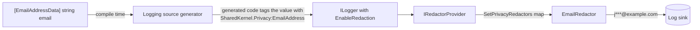
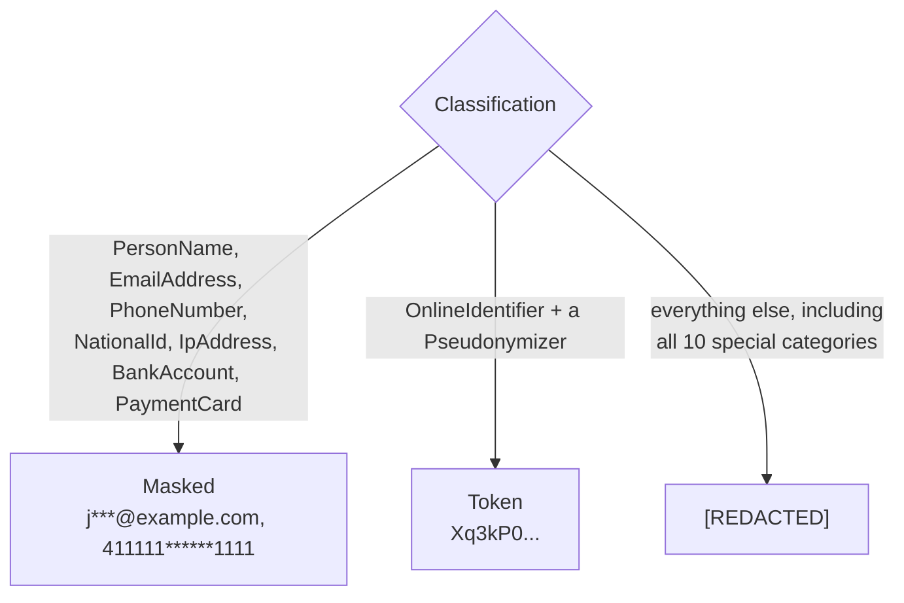

# SharedKernel.DataPrivacy

[](https://dotnet.microsoft.com/)
[](https://github.com/Gresta-Vertex-Labs/platform-shared-kernel/blob/main/LICENSE)


> **Mark personal data once, and it is masked in every log line. Plus masking helpers, pseudonymization, and the
> contract each service implements to export or erase a person's data under GDPR and KVKK.**

Personal data leaks into logs one `{Email}` placeholder at a time, and nobody notices until an auditor or a breach
does. This package builds on .NET's own compliance model (`Microsoft.Extensions.Compliance`). You put
`[EmailAddressData]` on a property or a `[LoggerMessage]` parameter, and the logging pipeline writes
`j***@example.com` instead of the address, with no reflection and no masking code at the call site.

```text
Before   Customer ayse.yilmaz@example.com (TCKN 10000000146, card 4111111111111111) was diagnosed with asthma.
After    Customer a***@example.com (TCKN *******0146, card 411111******1111) was diagnosed with [REDACTED].
```

| You get | So that |
| --- | --- |
| 23 kinds of personal data, including every GDPR and KVKK special category | Health, biometric, religion, criminal records and the rest have a name and a rule, not a code comment |
| One attribute per kind, on properties, fields and `[LoggerMessage]` parameters | The logging source generator sees the classification at compile time, with no runtime reflection |
| `SetPrivacyRedactors()`, a redactor for every kind | A marked value is masked (`411111******1111`) or erased (`[REDACTED]`) whenever it is logged |
| `PiiMasking` for email, phone, card, IBAN, national ID, name, IP address, and a general `Partial` | Support screens, audit records and emails show the same masked form as the logs |
| `Pseudonymizer`, a stable HMAC-SHA256 token per value | You can still count one user's errors across log lines without logging who the user is |
| `IDataSubjectRequestHandler` with request ids and retention receipts | A retried erasure is not done twice, and the invoices you must keep are recorded with their legal basis |
| Card and national ID masks identical to `SharedKernel.Validation` | `CardNumber.ToString()` and a redacted log line show the same `411111******1111` |
| An analyzer (SK0035) for the one path redaction cannot see | A marked value passed to an unmarked log parameter is a build warning, not a production leak |

## Contents

- [Install](#install)
- [Quick start](#quick-start)
- [Which type do I need?](#which-type-do-i-need)
- [How it works](#how-it-works)
- [The taxonomy](#the-taxonomy)
- [Masking](#masking)
- [Pseudonymization](#pseudonymization)
- [Data subject requests](#data-subject-requests)
- [GDPR and KVKK map](#gdpr-and-kvkk-map)
- [Recipes](#recipes)
- [Reference](#reference)
- [Security model](#security-model)
- [Pitfalls](#pitfalls)
- [Design decisions](#design-decisions)
- [Deliberately not included](#deliberately-not-included)
- [AI quick reference](#ai-quick-reference)
- [Compatibility and guarantees](#compatibility-and-guarantees)

## Install

```shell
dotnet add package SharedKernel.DataPrivacy

# In the host only, for log redaction (Microsoft packages):
dotnet add package Microsoft.Extensions.Compliance.Redaction
dotnet add package Microsoft.Extensions.Telemetry
```

| Requirement | Value |
| --- | --- |
| Target framework | `net10.0` |
| Depends on | `SharedKernel.Primitives` (`Result`, `Error`), `Microsoft.Extensions.Compliance.Abstractions` (classification and redactor types) |
| Namespaces | `SharedKernel.DataPrivacy.Classification`, `.Masking`, `.Redaction`, `.DataSubjectRequests` |

Domain, contract and application projects reference this package alone to put attributes on their types. Only the
host needs the two Microsoft packages that do the redacting.

## Quick start

**1. Mark the data.** On a positional record, put `property:` in front so the attribute lands on the property.

```csharp
using SharedKernel.DataPrivacy.Classification;

public sealed record Customer(
    [property: PersonNameData] string Name,
    [property: EmailAddressData] string Email,
    [property: NationalIdData] string NationalId,
    [property: HealthData] string? Allergies,
    string Segment);
```

**2. Turn on redaction in the host.**

```csharp
using SharedKernel.DataPrivacy.Redaction;

builder.Services.AddRedaction(redaction => redaction.SetPrivacyRedactors());
builder.Logging.EnableRedaction(options => options.ApplyDiscriminator = false);
```

Set `ApplyDiscriminator = false`. By default, .NET appends the field name to every value before redacting it. That
helps hash-based redactors but garbles masks: a masked IBAN ends in `…ount`. See [Pitfalls](#pitfalls).

**3. Log as usual.** A marked parameter, or a `[LogProperties]` object with marked members, is redacted.

```csharp
public static partial class CustomerLog
{
    [LoggerMessage(EventId = 5101, Level = LogLevel.Information, Message = "Customer {Email} signed up.")]
    public static partial void SignedUp(ILogger logger, [EmailAddressData] string email);

    [LoggerMessage(EventId = 5102, Level = LogLevel.Information, Message = "Customer updated.")]
    public static partial void Updated(ILogger logger, [LogProperties] Customer customer);
}
```

```text
Customer j***@example.com signed up.
Customer updated.  customer.Name=A*** Y***  customer.Email=a***@example.com
                   customer.NationalId=*******0146  customer.Allergies=[REDACTED]  customer.Segment=retail
```

Unmarked members (`Segment`) are logged as they are; marked ones are masked or erased.

## Which type do I need?

| I want to… | Use |
| --- | --- |
| Keep a field of a DTO or entity out of logs | Its `…DataAttribute`, plus `SetPrivacyRedactors()` in the host |
| Keep a single log argument out of logs | The attribute on the `[LoggerMessage]` parameter |
| Log a user id and still group log lines by user | `[OnlineIdentifierData]` + `SetPrivacyRedactors(pseudonymizer)` |
| Show a masked value on a screen, in an email or an audit record | `PiiMasking.Email`, `.CardNumber`, `.Iban` … |
| Store a lookup key that must not be the raw value | `Pseudonymizer.Pseudonymize` |
| Name a kind of data this package does not have | Your own `DataClassification` and attribute ([recipe 1](#1-add-a-kind-of-data-your-service-has)) |
| Change how one kind is logged | `SetRedactor<T>(classification)` after `SetPrivacyRedactors()` |
| Answer "send me my data" | `IDataSubjectRequestHandler.ExportAsync` → `DataSubjectExport` |
| Answer "delete my data" | `IDataSubjectRequestHandler.EraseAsync` → `DataSubjectErasureReceipt` |
| Record what you had to keep | `RetainedData` in the receipt |
| Test code that calls a handler | `RecordingDataSubjectRequestHandler` from `SharedKernel.Testing` |

## How it works

### From attribute to log line



*The classification is read once, by the source generator, when you build. At run time the logger asks the redactor
provider which redactor belongs to the value's classification and writes only what the redactor returns.*

`SetPrivacyRedactors()` registers the map below. Classifications from other taxonomies go to the builder's fallback
redactor, which stays your choice.



### A data subject request across services

```mermaid
sequenceDiagram
    participant P as Person
    participant O as Orchestrator (your workflow)
    participant A as customers-api
    participant B as billing-api
    P->>O: "Delete my data"
    O->>A: EraseAsync(RequestId r-1, SubjectId c-42)
    A-->>O: Receipt: 3 erased, nothing retained
    O->>B: EraseAsync(r-1, c-42)
    B-->>O: Receipt: 1 anonymized, invoices retained until 2031 (tax law)
    Note over O,B: A retry sends r-1 again; each service returns its first receipt
    O->>P: Done, with what was kept and why
```

*Every service gets the same `DataSubjectRequest`. A service that has never heard of the subject answers with an
empty receipt, so the orchestrator never needs to know who holds what.*

## The taxonomy

Every kind is a `DataClassification` in `PrivacyTaxonomy`, taxonomy name `SharedKernel.Privacy`, with an attribute
named after it plus `Data`. The last column is what `SetPrivacyRedactors()` writes to the log.

| Classification | Attribute | Covers | Logged as |
| --- | --- | --- | --- |
| `PersonName` | `[PersonNameData]` | Name, surname, initials | `A*** Y***` |
| `EmailAddress` | `[EmailAddressData]` | Email address | `j***@example.com` |
| `PhoneNumber` | `[PhoneNumberData]` | Phone number | `+** *** *** 45 67` |
| `PostalAddress` | `[PostalAddressData]` | Postal or home address | `[REDACTED]` |
| `DateOfBirth` | `[DateOfBirthData]` | Date of birth | `[REDACTED]` |
| `NationalId` | `[NationalIdData]` | TCKN, passport, tax or social security number | `*******0146` |
| `OnlineIdentifier` | `[OnlineIdentifierData]` | User id, customer number, device id, cookie | `[REDACTED]`, or a token with a `Pseudonymizer` |
| `IpAddress` | `[IpAddressData]` | IP address | `192.168.1.0` |
| `Location` | `[LocationData]` | Coordinates, geohash, cell location | `[REDACTED]` |
| `BankAccount` | `[BankAccountData]` | IBAN or account number | `TR********************1326` |
| `PaymentCard` | `[PaymentCardData]` | Card number, expiry, cardholder name | `411111******1111` |
| `Financial` | `[FinancialData]` | Income, balance, credit score, transactions | `[REDACTED]` |
| `Credential` | `[CredentialData]` | Password, API key, token, recovery code | `[REDACTED]` |

**Special categories** (GDPR Articles 9 and 10, KVKK Article 6) need an explicit legal basis to process, and are
always erased in logs. They are grouped in `PrivacyTaxonomy.SpecialCategories`, and
`PrivacyTaxonomy.IsSpecialCategory(c)` tests for them.

| Classification | Attribute | Covers |
| --- | --- | --- |
| `Health` | `[HealthData]` | Physical or mental health, disability, medical records |
| `Genetic` | `[GeneticData]` | Genetic data |
| `Biometric` | `[BiometricData]` | Fingerprint, face or voice template used for identification |
| `EthnicOrigin` | `[EthnicOriginData]` | Racial or ethnic origin |
| `PoliticalOpinion` | `[PoliticalOpinionData]` | Political opinions |
| `Belief` | `[BeliefData]` | Religious, philosophical or other beliefs, sect |
| `Membership` | `[MembershipData]` | Trade union (GDPR); association, foundation or union (KVKK) |
| `SexLife` | `[SexLifeData]` | Sex life or sexual orientation |
| `CriminalRecord` | `[CriminalRecordData]` | Convictions, offences, security measures |
| `Appearance` | `[AppearanceData]` | Appearance and dress (KVKK only) |

A value that is deliberately not personal data can say so with Microsoft's `[NoDataClassification]`.

## Masking

`PiiMasking` is for the places redaction does not reach: a support screen, an audit record, a confirmation email.
Every method accepts `null`, never throws, and returns `""` for empty input. Only letters and digits are replaced
(including non-Latin digits); spaces, hyphens and other separators stay where they are.

| Method | Example | Rule |
| --- | --- | --- |
| `Email(v)` | `j.doe@example.com` → `j***@example.com` | First character + fixed `***`, so the length is hidden |
| `Email(v, revealDomain: false)` | `ali@alidinc.com.tr` → `a***@***.tr` | For personal domains |
| `Phone(v)` | `+1 (555) 123-4567` → `+* (***) ***-4567` | Last 4 digits; last 2 when there are only 2–3 |
| `CardNumber(v)` | `4111 1111 1111 1111` → `4111 11** **** 1111` | First 6 + last 4 (the PCI DSS maximum); fewer than 12 digits → all masked |
| `Iban(v)` | `DE89 3704 0044 0532 0130 00` → `DE** **** **** **** **30 00` | Country + last 4; fewer than 10 characters → all masked |
| `NationalId(v)` | `10000000146` → `*******0146` | Last 4; 4 or fewer → all masked |
| `PersonName(v)` | `Ayşe Nur Yılmaz` → `A*** N*** Y***` | Initial of each word + fixed `***` |
| `IpAddress(v)` | `192.168.1.23` → `192.168.1.0` | Last IPv4 octet zeroed; IPv6 keeps its first 48 bits; not an IP → `[REDACTED]` |
| `Partial(v, 4, 3)` | `ORD-2024-000123` → `ORD-********123` | Your own window; if it would cover everything, all is masked |
| `Suppress(v)` | anything → `[REDACTED]` | `PiiMasking.RedactedSentinel`, always |

A short value is never shown in full. When a value is too short to hide anything behind a partial reveal, every
character is masked.

## Pseudonymization

`Pseudonymizer` turns a value into a 22-character token with HMAC-SHA256 and a key of at least 32 bytes. The same
value always gives the same token, so dashboards and log searches still work per user. Without the key, the token
cannot be turned back into the value.

```csharp
var pseudonymizer = new Pseudonymizer(keyFromSecretStore);   // byte[] of 32+ bytes
pseudonymizer.Pseudonymize("customer-42");                   // 22 characters, the same every time

// Tokens instead of [REDACTED] for [OnlineIdentifierData] values in logs:
builder.Services.AddRedaction(redaction => redaction.SetPrivacyRedactors(pseudonymizer));
```

A token is still personal data (GDPR Recital 26), because whoever holds the key can link it back. Keep the key in a
secret store, apart from the logs. Rotating the key changes every token. Normalize the input first when spellings
differ, for example with `email.ToLowerInvariant()`.

## Data subject requests

A person may ask what you hold about them (GDPR Articles 15 and 20, KVKK Article 11) or ask you to erase it (GDPR
Article 17, KVKK Article 7). Each service implements `IDataSubjectRequestHandler` against its own data.

```csharp
public sealed class CustomerPrivacyHandler(ICustomerStore customers, IClock clock) : IDataSubjectRequestHandler
{
    public async Task<Result<DataSubjectExport>> ExportAsync(DataSubjectRequest request, CancellationToken cancellationToken = default)
    {
        Customer? customer = await customers.FindAsync(request.SubjectId, cancellationToken);
        DataSubjectRecord[] records = customer is null
            ? []
            : [DataSubjectRecord.Create("profile", customer, AppJsonContext.Default.Customer) with { Purpose = "Account management" }];

        return new DataSubjectExport(request, "customers-api", clock.UtcNow, records);
    }

    public async Task<Result<DataSubjectErasureReceipt>> EraseAsync(DataSubjectRequest request, CancellationToken cancellationToken = default)
    {
        if (await customers.FindReceiptAsync(request.RequestId, cancellationToken) is { } earlier)
        {
            return earlier;                                         // same request again: same outcome
        }

        int anonymized = await customers.AnonymizeAsync(request.SubjectId, cancellationToken);
        var receipt = new DataSubjectErasureReceipt(request, "customers-api", clock.UtcNow,
            ErasedRecords: 0, AnonymizedRecords: anonymized,
            Retained: [new RetainedData("invoices", "Tax Procedure Law 213, Art. 253", clock.UtcNow.AddYears(5))]);

        await customers.SaveReceiptAsync(receipt, cancellationToken);
        return receipt;
    }
}
```

The rules every handler follows:

| Situation | What to return |
| --- | --- |
| The service knows nothing about the subject | Success with no records, or a receipt with zeros. Never a failure, so every request can go to every service |
| The same `RequestId` arrives again | The first outcome, without doing the work again |
| Some data must be kept (tax law, a legal hold) | Erase the rest, and list what was kept in `Retained` with the legal basis and when it will go. `IsComplete` is then `false` |
| The `RequestId` was used for another subject | `Error.Conflict(DataPrivacyErrorCodes.RequestIdConflict, …)` |
| It cannot be done right now (a restore is running) | `Error.Unexpected(DataPrivacyErrorCodes.TemporarilyUnavailable, …)`; the orchestrator retries |

`DataSubjectExport.WriteTo(Utf8JsonWriter)` writes the export as one JSON document, the "structured, commonly used and
machine-readable format" Article 20 asks for:

```json
{
  "requestId": "r-1",
  "subjectId": "customer-42",
  "source": "customers-api",
  "exportedAt": "2026-09-18T12:00:00+00:00",
  "records": [
    { "category": "profile", "purpose": "Account management", "data": { "name": "Ayşe Yılmaz", "email": "ayse@example.com" } }
  ]
}
```

## GDPR and KVKK map

Where each obligation meets this package. The package is a tool, not compliance on its own: your processes, legal
bases and records of processing remain yours.

| Obligation | GDPR | KVKK | In this package |
| --- | --- | --- | --- |
| Know what personal data you process | Art. 4(1), 30 | Art. 3, 16 | The taxonomy and its attributes make it visible in code |
| Special categories need an explicit basis | Art. 9, 10 | Art. 6 | `SpecialCategories`, always erased in logs |
| Data minimization, privacy by design | Art. 5(1)(c), 25 | Art. 4(2) | Log redaction by default; masking for screens and audit |
| Pseudonymization as a security measure | Art. 4(5), 32 | Art. 12 | `Pseudonymizer`, `PseudonymizingRedactor` |
| Right of access | Art. 15 | Art. 11 | `ExportAsync`, records with a `Purpose` |
| Data portability | Art. 20 | — | `DataSubjectExport.WriteTo` (JSON) |
| Right to erasure, and its exceptions | Art. 17, 17(3) | Art. 7, 11 | `EraseAsync`, `RetainedData` with the legal basis |

## Recipes

### 1. Add a kind of data your service has

```csharp
public static class LoyaltyTaxonomy
{
    public static DataClassification LoyaltyTier { get; } = new(PrivacyTaxonomy.TaxonomyName, "LoyaltyTier");
}

[AttributeUsage(AttributeTargets.Property | AttributeTargets.Field | AttributeTargets.Parameter)]
public sealed class LoyaltyTierDataAttribute() : DataClassificationAttribute(LoyaltyTaxonomy.LoyaltyTier);

builder.Services.AddRedaction(redaction => redaction
    .SetPrivacyRedactors()
    .SetRedactor<SuppressingRedactor>(LoyaltyTaxonomy.LoyaltyTier));
```

To show part of it instead, derive from `MaskingRedactor` and override `Mask` with any `PiiMasking` rule. Calling
`SetRedactor` after `SetPrivacyRedactors()` also replaces the rule of a built-in kind.

### 2. Log a user id and still group by user

```csharp
[LoggerMessage(EventId = 5104, Level = LogLevel.Warning, Message = "Payment failed for {UserId}.")]
public static partial void PaymentFailed(ILogger logger, [OnlineIdentifierData] string userId);

var pseudonymizer = new Pseudonymizer(Convert.FromBase64String(builder.Configuration["Privacy:PseudonymKey"]!));
builder.Services.AddRedaction(redaction => redaction.SetPrivacyRedactors(pseudonymizer));
```

Every failure for one user now carries the same token, and a support engineer who needs the real id asks whoever
holds the key.

### 3. Mask a value for an audit record or a support screen

```csharp
var auditSnapshot = new
{
    CustomerId = customer.Id,
    Email = PiiMasking.Email(customer.Email),
    Card = PiiMasking.CardNumber(customer.CardNumber),
};
```

`06.Persistence`'s audit trail stores what you give it; it does not know which fields are personal.

### 4. Write an export to a file

```csharp
await using FileStream file = File.Create(path);
await using (var writer = new Utf8JsonWriter(file, new JsonWriterOptions { Indented = true }))
{
    export.WriteTo(writer);
}
```

### 5. Test a caller with the recording fake

`SharedKernel.Testing` ships `RecordingDataSubjectRequestHandler`. It records every request, returns an empty export
and an empty receipt by default, returns the first outcome for a repeated request id, and returns a configured
result per subject set with `SetExportResult` and `SetErasureResult`.

## Reference

| Type | Namespace | Purpose |
| --- | --- | --- |
| `PrivacyTaxonomy` | `.Classification` | The 23 classifications, `SpecialCategories`, `All`, `IsSpecialCategory` |
| `…DataAttribute` (23) | `.Classification` | One per classification; derived from Microsoft's `DataClassificationAttribute` |
| `PiiMasking` | `.Masking` | Masking rules, `RedactedSentinel` |
| `Pseudonymizer` | `.Masking` | HMAC-SHA256 tokens; `MinimumKeyLength` 32, `TokenLength` 22 |
| `PrivacyRedactionBuilderExtensions` | `.Redaction` | `SetPrivacyRedactors()`, `SetPrivacyRedactors(pseudonymizer)` |
| `MaskingRedactor` and 7 sealed redactors | `.Redaction` | `EmailRedactor`, `PhoneNumberRedactor`, `CardNumberRedactor`, `BankAccountRedactor`, `NationalIdRedactor`, `PersonNameRedactor`, `IpAddressRedactor` |
| `SuppressingRedactor`, `PseudonymizingRedactor` | `.Redaction` | `[REDACTED]`, or a token |
| `IDataSubjectRequestHandler` | `.DataSubjectRequests` | `ExportAsync`, `EraseAsync` |
| `DataSubjectRequest` | `.DataSubjectRequests` | `RequestId`, `SubjectId`, `RequestedAt`, `TenantId` |
| `DataSubjectExport`, `DataSubjectRecord` | `.DataSubjectRequests` | Records as `JsonElement` with `Category` and `Purpose`; `WriteTo`, `Create<T>` |
| `DataSubjectErasureReceipt`, `RetainedData` | `.DataSubjectRequests` | Erased, anonymized and retained; `IsComplete` |
| `DataPrivacyErrorCodes` | `.DataSubjectRequests` | `RequestIdConflict`, `TemporarilyUnavailable` |

## Security model

| Threat | What stops it |
| --- | --- |
| A developer logs a personal field | The attribute makes the logging pipeline redact it; SK0035 warns when a marked value reaches an unmarked parameter |
| Masking reveals a short value in full | Every rule masks the whole value when it is too short to hide anything |
| A mask leaks the value's length | Email and name masks use a fixed `***`; card, IBAN and ID masks keep the value's length, as payment and identity screens expect |
| Log tokens are reversed | HMAC-SHA256 with a key of at least 32 bytes; without the key a token is 128 bits of noise |
| A default or shared key | There is none: tokens exist only when you pass your own `Pseudonymizer` |
| A retried erasure runs twice | The `RequestId` contract returns the first outcome |
| Forgetting `ApplyDiscriminator = false` | Masks come out unreadable, but a test proves no value leaks |
| Special categories shown partly | They are always `[REDACTED]`; no masking rule applies to them |

What it does not stop: a direct call such as `logger.LogInformation($"…{email}")` or a hand-written
`LoggerMessage.Define` delegate skips the source generator entirely. The platform's SK0020 and SK0021 analyzers flag
both.

## Pitfalls

- **Forgetting `ApplyDiscriminator = false`.** .NET's default appends `:FieldName` to each value before redacting it.
  Nothing leaks, but masks come out wrong: an IBAN keeps the last four characters of the field name, and an IP
  address becomes `[REDACTED]`.
- **An attribute on a positional record parameter without `property:`.** It then marks only the constructor
  parameter, and `[LogProperties]` does not see it.
- **Passing a marked member to an unmarked parameter.** `SignedUp(logger, customer.Email)` into a plain
  `string email` parameter logs the raw address. Mark the parameter too; SK0035 flags this.
- **Treating a token as anonymous.** A pseudonymized value is still personal data; data is anonymous only when no key
  exists that can link it back.
- **Reusing a `RequestId`.** It identifies one request for one subject, across all services and retries.

## Design decisions

| Decision | Why |
| --- | --- |
| Microsoft's compliance model instead of our own attributes | The logging source generator already understands it, so redaction needs no code at call sites and no reflection. The package's earlier attributes were read by nothing at run time |
| One classification per kind of data, no sensitivity tiers | Redaction is chosen per classification. A `Restricted` tier said how sensitive a value was but not how to mask it |
| Masking for identifiers, erasing for everything else | An operator needs `411111******1111` to find a payment; nobody needs a diagnosis in a log |
| Online identifiers erased unless you give a key | Tokens need a secret, and a built-in key would make every token reversible |
| Card and national ID masks copied from `SharedKernel.Validation` | The same value must never appear masked two ways; a test compares both |
| An unknown subject is a success | An orchestrator sends every request to every service; failing on "not found" would stall every request |
| Export records as `JsonElement` | Each service owns its data's shape, and the export must still be one portable JSON document |

## Deliberately not included

- **No orchestrator.** Sending one request to every service is a workflow (`17.Workflows`) or a job
  (`19.Scheduling`) your platform composes on top of this contract.
- **No identity verification.** Confirming that the person asking is the data subject happens before a
  `DataSubjectRequest` is created.
- **No consent management or records of processing.** They are business processes, not a kernel type.
- **No encryption.** Encrypting stored personal data is `SharedKernel.Cryptography`, and encrypting a column is
  `06.Persistence`'s `.Encrypt()`.
- **No retention scheduler.** `RetainedData.RetainUntil` records the date; deleting on that date is your job.

## AI quick reference

```text
CLASSIFY    [XxxData] on property / field / [LoggerMessage] parameter; positional records: [property: XxxData].
            Xxx: PersonName EmailAddress PhoneNumber PostalAddress DateOfBirth NationalId OnlineIdentifier IpAddress
            Location BankAccount PaymentCard Financial Credential | special: Health Genetic Biometric EthnicOrigin
            PoliticalOpinion Belief Membership SexLife CriminalRecord Appearance. PrivacyTaxonomy.Xxx = DataClassification
            (taxonomy "SharedKernel.Privacy"). Not personal: [NoDataClassification] (Microsoft).
REDACT      services.AddRedaction(b => b.SetPrivacyRedactors());                 // or SetPrivacyRedactors(pseudonymizer)
            logging.EnableRedaction(o => o.ApplyDiscriminator = false);          // required for correct masks
            masked: PersonName Email Phone NationalId IpAddress BankAccount PaymentCard; OnlineIdentifier -> token only
            with a pseudonymizer; everything else -> "[REDACTED]". Override one: .SetRedactor<T>(classification) after.
            Custom kind: new DataClassification(taxonomy, value) + attribute : DataClassificationAttribute + SetRedactor.
MASK        PiiMasking.Email(v[, revealDomain]) Phone CardNumber Iban NationalId PersonName IpAddress Partial(v,s,e)
            Suppress. Null-safe, never throws, "" for blank, short input fully masked. Card = first6+last4 (= Validation).
PSEUDONYM   new Pseudonymizer(key >= 32 bytes).Pseudonymize(v) -> 22-char base64url of HMAC-SHA256[..16]. Still personal data.
DSR         IDataSubjectRequestHandler.ExportAsync / EraseAsync(DataSubjectRequest(requestId, subjectId, requestedAt, tenantId?)).
            Unknown subject = success, empty. Same RequestId = first outcome. Kept data -> Retained(Category, LegalBasis, RetainUntil).
            Export: DataSubjectRecord.Create(category, value, JsonTypeInfo<T>) { Purpose }; WriteTo(Utf8JsonWriter).
            Errors: DataPrivacyErrorCodes.RequestIdConflict (Conflict), TemporarilyUnavailable (Unexpected).
TEST        SharedKernel.Testing: RecordingDataSubjectRequestHandler, PiiMaskingAssertions.ShouldBeMasked.
FORBIDDEN   Marked member into an unmarked log parameter (SK0035); ILogger.LogX calls or LoggerMessage.Define (SK0020/21);
            treating tokens as anonymous; a shared or hard-coded pseudonymization key; partial masks for special categories.
```

## Compatibility and guarantees

- **Public API is tracked** with `Microsoft.CodeAnalysis.PublicApiAnalyzers`, and every public member is documented.
- **Classification names are stable.** `SharedKernel.Privacy:EmailAddress` and the rest are part of the contract,
  because redaction configuration refers to them.
- **Masking rules change only in a release,** and a change never reveals more than before.
- **No reflection** in the package; a test scans the compiled assembly for reflection types.
- **Thread-safe.** Masking is static and pure; `Pseudonymizer` and the redactors are immutable.
- **Tested end to end** through `AddRedaction` and `EnableRedaction`, and every code sample in this README runs as a
  test.

Part of [Platform.SharedKernel](https://github.com/Gresta-Vertex-Labs/platform-shared-kernel).
