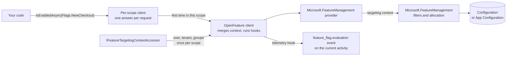
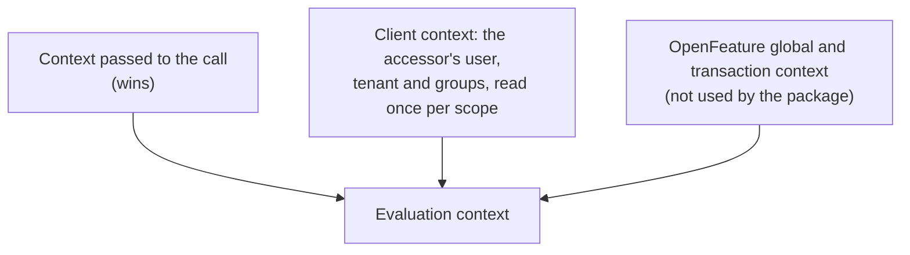
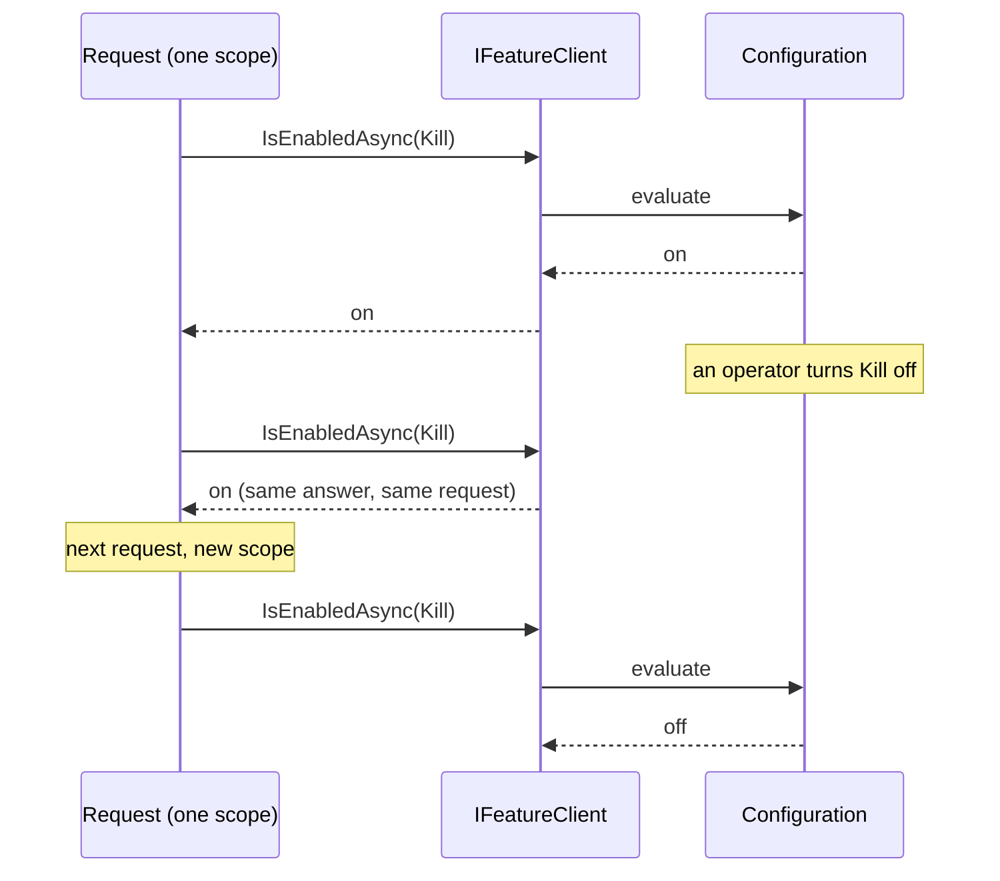

# SharedKernel.FeatureManagement

[](https://dotnet.microsoft.com/)
[](https://github.com/Gresta-Vertex-Labs/platform-shared-kernel/blob/main/LICENSE)
[-5d5fef)](https://openfeature.dev/)


> **Feature flags on the OpenFeature standard. Declare a flag once as a typed constant, and every evaluation targets
> the right user and tenant, stays the same for the whole request, never throws, and is checked at startup.**

Services inject OpenFeature's `IFeatureClient`, the vendor-neutral API from the CNCF, and ask for a typed
`FeatureFlag<T>` rather than a string. Behind it, `Microsoft.FeatureManagement` reads flags from configuration (or
Azure App Configuration), with percentage rollouts, user, group and tenant targeting, time windows and A/B variants.
The package adds what services need on top: the caller's identity applied to every evaluation, one answer per
request, and startup that fails on a misspelled flag instead of silently turning a feature off.

```csharp
public static class Flags
{
    public static readonly FeatureFlag<bool> NewCheckout = FeatureFlag.Boolean("NewCheckout");
    public static readonly FeatureFlag<string> CheckoutTheme = FeatureFlag.String("CheckoutTheme", defaultValue: "classic");
}

if (await flags.IsEnabledAsync(Flags.NewCheckout, ct)) { ... }       // targets the current user and tenant
string theme = await flags.GetValueAsync(Flags.CheckoutTheme, ct);   // "dark" for the users in the experiment
```

```text
Flags.NewCheckout     alice (listed user)          -> true
                      bob, tenant acme (listed)    -> true
                      bob, tenant other            -> false    reason TARGETING_MATCH
Flags.CheckoutTheme   alice                        -> "dark"   variant Dark     reason TARGETING_MATCH
                      bob                          -> "classic" variant Classic
FeatureFlag.Boolean("NewChekout")   (typo)         -> false    error FLAG_NOT_FOUND, and startup fails if declared
```

| You get | So that |
| --- | --- |
| OpenFeature's `IFeatureClient` as the API | Services code against a CNCF standard; moving to LaunchDarkly, flagd or ConfigCat changes the provider, not the call sites |
| Typed `FeatureFlag<T>` constants: boolean, string, integer, double and JSON object | No flag key is typed twice, and a variant's JSON arrives as your own record, read without reflection |
| `IFeatureTargetingContextAccessor`, implemented once per service | Percentage rollouts and user, group and tenant targeting work without passing context on every call |
| One evaluation per flag per request (`EvaluateOncePerScope`) | A configuration reload cannot switch a flag halfway through a request or a message |
| Evaluation that never throws | A missing flag, a type mismatch or a failing filter returns your default, with the reason and error in the details |
| `ValidateOnStart(...)` | A misspelled key or a variant that does not parse stops startup, listing every problem |
| The OpenTelemetry `feature_flag.evaluation` event, per flag | Traces show who got which variant, and never record the user id |
| `FakeFeatureClient` in `SharedKernel.FeatureManagement.Testing` | Unit tests set flag values in one line, with no configuration or host |

## Contents

- [Install](#install)
- [Quick start](#quick-start)
- [Which type do I need?](#which-type-do-i-need)
- [How it works](#how-it-works)
- [Configuring flags](#configuring-flags)
- [Targeting](#targeting)
- [Variants and typed values](#variants-and-typed-values)
- [One answer per request](#one-answer-per-request)
- [Startup validation](#startup-validation)
- [Telemetry](#telemetry)
- [When evaluation fails](#when-evaluation-fails)
- [Recipes](#recipes)
- [Reference](#reference)
- [Pitfalls](#pitfalls)
- [Design decisions](#design-decisions)
- [Deliberately not included](#deliberately-not-included)
- [AI quick reference](#ai-quick-reference)
- [Compatibility and guarantees](#compatibility-and-guarantees)

## Install

```shell
dotnet add package SharedKernel.FeatureManagement
```

| Requirement | Value |
| --- | --- |
| Target framework | `net10.0` |
| Depends on | `OpenFeature` and `OpenFeature.Hosting` 2.14 (the API), `Microsoft.FeatureManagement` 4.7 (the backend), `SharedKernel.Primitives` |
| Namespace | `SharedKernel.FeatureManagement`; plus `OpenFeature` for `IFeatureClient` |

Libraries that only evaluate flags need `IFeatureClient` from `OpenFeature` and the `FeatureFlag<T>` declarations; only
the host calls `AddSharedKernelFeatureManagement`.

## Quick start

**1. Declare the flags** in one class, next to the code that uses them.

```csharp
using SharedKernel.FeatureManagement;

public static class Flags
{
    public static readonly FeatureFlag<bool> NewCheckout =
        FeatureFlag.Boolean("NewCheckout", description: "The redesigned checkout flow.");

    public static readonly FeatureFlag<string> CheckoutTheme =
        FeatureFlag.String("CheckoutTheme", defaultValue: "classic");
}
```

**2. Configure them** in `appsettings.json`, using Microsoft's Feature Management schema.

```json
{
  "feature_management": {
    "feature_flags": [
      {
        "id": "NewCheckout",
        "enabled": true,
        "conditions": {
          "client_filters": [
            {
              "name": "Microsoft.Targeting",
              "parameters": {
                "Audience": {
                  "Users": [ "alice" ],
                  "Groups": [ { "Name": "acme", "RolloutPercentage": 100 } ],
                  "DefaultRolloutPercentage": 0
                }
              }
            }
          ]
        }
      },
      {
        "id": "CheckoutTheme",
        "enabled": true,
        "variants": [
          { "name": "Classic", "configuration_value": "classic" },
          { "name": "Dark", "configuration_value": "dark" }
        ],
        "allocation": {
          "default_when_enabled": "Classic",
          "user": [ { "variant": "Dark", "users": [ "alice" ] } ]
        }
      }
    ]
  }
}
```

**3. Register** in the host, with the accessor that tells flags who is calling.

```csharp
builder.Services.AddScoped<IFeatureTargetingContextAccessor, UserFeatureTargeting>();
builder.Services.AddSharedKernelFeatureManagement(builder.Configuration, flags => flags
    .ValidateOnStart(Flags.NewCheckout, Flags.CheckoutTheme));

public sealed class UserFeatureTargeting(IUserContext user) : IFeatureTargetingContextAccessor
{
    public FeatureTargetingContext? GetTargetingContext() =>
        user.IsAuthenticated
            ? new FeatureTargetingContext(user.SubjectId, user.TenantId, user.Roles)
            : null;
}
```

`IUserContext` is `SharedKernel.Security.Abstractions`; any identity source works.

**4. Evaluate.** `IFeatureClient` is scoped; inject it like any request service.

```csharp
using OpenFeature;
using SharedKernel.FeatureManagement;

public sealed class CheckoutEndpoint(IFeatureClient flags)
{
    public async Task<string> GetLayoutAsync(CancellationToken ct) =>
        await flags.IsEnabledAsync(Flags.NewCheckout, ct)
            ? $"new-checkout/{await flags.GetValueAsync(Flags.CheckoutTheme, ct)}"
            : "legacy-checkout";
}
```

```text
alice             -> new-checkout/dark
bob, tenant acme  -> new-checkout/classic
bob, no tenant    -> legacy-checkout
```

## Which type do I need?

| I want to… | Use |
| --- | --- |
| Turn a feature on or off | `FeatureFlag.Boolean` + `IsEnabledAsync` |
| Pick one of several values (a theme, a page size, a discount) | `FeatureFlag.String` / `.Integer` / `.Double` + `GetValueAsync` |
| Get a settings object for the assigned variant | `FeatureFlag.Object<T>(key, default, MyJsonContext.Default.T)` |
| Know which variant someone got, and why | `GetDetailsAsync` → `Variant`, `Reason`, `ErrorType` |
| Target users, roles, plans or tenants | Implement `IFeatureTargetingContextAccessor` once |
| Evaluate for someone other than the caller | Pass `FeatureTargetingContext.ToEvaluationContext()` to the call |
| Roll out to a percentage of tenants | `FeatureTargetingContext.ForTenant(id)` ([recipe 3](#3-roll-out-to-a-percentage-of-tenants)) |
| Fail startup on a missing or broken flag | `ValidateOnStart(...)` |
| See flag decisions in traces | `"telemetry": { "enabled": true }` on the flag |
| Add a condition of your own | An `IFeatureFilter` + `AddFeatureFilter<T>()` ([recipe 6](#6-add-your-own-condition)) |
| Test code that reads flags | `FakeFeatureClient` from `SharedKernel.FeatureManagement.Testing` |

## How it works



*A request's first evaluation of a flag goes through OpenFeature to `Microsoft.FeatureManagement`; later ones in the
same scope reuse it. The caller comes from the accessor, and a context passed to a call wins over it.*

The package's provider hands `Microsoft.FeatureManagement` an explicit targeting context: the targeting key as the user
id, and the groups plus the tenant id as groups. That same context drives the on/off state (the `Microsoft.Targeting`
filter) and variant allocation, so both always agree about who the caller is.



## Configuring flags

Flags live in configuration: `appsettings.json`, environment variables, Azure App Configuration, anything
`IConfiguration` reads. Both of Microsoft's schemas work, and a configuration reload takes effect on the next scope.

| Condition | Configuration | Behavior |
| --- | --- | --- |
| Always on / off | `{ "id": "X", "enabled": true }` or `"enabled": false` | Reason `STATIC` / `DISABLED` |
| Users, groups, tenants, percentage | `"client_filters": [ { "name": "Microsoft.Targeting", "parameters": { "Audience": { ... } } } ]` | Sticky per user: the same user always gets the same answer |
| A date range, or a recurring window | `"name": "Microsoft.TimeWindow"`, `"parameters": { "Start": "...", "End": "..." }` | On inside the window |
| A random percentage of calls | `"name": "Microsoft.Percentage"`, `"parameters": { "Value": 20 }` | Not sticky; see [Pitfalls](#pitfalls) |
| All or any of several filters | `"conditions": { "requirement_type": "All", "client_filters": [ ... ] }` | Default is `Any` |
| Variants | `"variants"` + `"allocation"` (`default_when_enabled`, `user`, `group`, `percentile`) | See [Variants](#variants-and-typed-values) |
| Your own condition | `"name": "YourAlias"` + `AddFeatureFilter<T>()` | [Recipe 6](#6-add-your-own-condition) |

The older schema still works for plain on/off flags:

```json
{ "FeatureManagement": { "NewCheckout": true } }
```

Pass `builder.Configuration` itself to `AddSharedKernelFeatureManagement`, never `GetSection(...)`: the two schemas
live under different root keys.

## Targeting

`FeatureTargetingContext` describes the caller: a user id, a tenant id and groups (roles, plans, cohorts).

| Value | Used for |
| --- | --- |
| `UserId` | `Audience.Users`, `allocation.user`, and the hash behind every percentage |
| `TenantId` | Added to the groups, so a tenant is targeted under `Audience.Groups` or `allocation.group` |
| `Groups` | `Audience.Groups` (with a rollout percentage each) and `allocation.group` |
| `TargetingKey` | `UserId`, or `TenantId` when there is no user |

**Where it comes from.** The registered `IFeatureTargetingContextAccessor`, read once when a scope first resolves
`IFeatureClient`. Register it with any lifetime, scoped included. Without one, the tenant comes from the `TenantId`
`Activity` baggage item (`WellKnownBaggageKeys.TenantId`) and there is no user.

**Evaluating for someone else.** Pass a context to the call; its values replace the caller's.

```csharp
bool on = await flags.IsEnabledAsync(Flags.NewCheckout, new FeatureTargetingContext("bob", "acme").ToEvaluationContext(), ct);
```

## Variants and typed values

A variant is a named value in the flag's configuration. `allocation` decides who gets which: listed users, listed
groups, a percentile range, and defaults for enabled and disabled.

| Flag | Reads `configuration_value` as | On a value that does not fit |
| --- | --- | --- |
| `FeatureFlag.String` | Text | Default, `TYPE_MISMATCH` |
| `FeatureFlag.Integer` | Whole number, invariant culture | Default, `TYPE_MISMATCH` |
| `FeatureFlag.Double` | Number, invariant culture (`"0.15"`) | Default, `TYPE_MISMATCH` |
| `FeatureFlag.Object<T>` | A JSON object, through a source-generated `JsonTypeInfo<T>` | Default, `PARSE_ERROR` |

An object variant is read by the shape of `T`. Configuration keeps every value as text, so each one is converted to the
type of the property it fills: `3` to an `int`, `true` to a `bool`, and `"007"` stays `"007"` for a `string` property.

```csharp
public sealed record CheckoutSettings(int Steps, bool ExpressPay, IReadOnlyList<string> Providers);

[JsonSerializable(typeof(CheckoutSettings))]
internal sealed partial class AppJsonContext : JsonSerializerContext;

public static readonly FeatureFlag<CheckoutSettings?> Checkout =
    FeatureFlag.Object<CheckoutSettings?>("Checkout", null, AppJsonContext.Default.CheckoutSettings);
```

```json
{
  "id": "Checkout",
  "enabled": true,
  "variants": [
    { "name": "OneStep", "configuration_value": { "Steps": 1, "ExpressPay": true, "Providers": [ "card", "iban" ] } }
  ],
  "allocation": { "default_when_enabled": "OneStep" }
}
```

## One answer per request

With `EvaluateOncePerScope` (the default), the first evaluation of a flag in a scope is reused until the scope ends:
one HTTP request, one message, one job run. A configuration change still takes effect, from the next scope.



- A result is reused only for the same flag, default and explicit context; `alice` and `bob` in one scope are
  evaluated separately.
- A failed evaluation is never reused, and neither is a call that passes its own `FlagEvaluationOptions`.
- `ScopeResultLifetime` (default one minute) caps the reuse, so a long-running scope still sees a kill switch within a
  minute.
- Set `EvaluateOncePerScope = false` to evaluate every call.

## Startup validation

```csharp
builder.Services.AddSharedKernelFeatureManagement(builder.Configuration, flags => flags
    .ValidateOnStart(Flags.NewCheckout, Flags.CheckoutTheme, Flags.Checkout));
```

When the host starts, each declared flag must be configured, and for string, number and object flags every variant's
value must fit the flag's type. Otherwise `StartAsync` throws a `FeatureFlagValidationException` with every problem:

```text
Feature flag configuration is invalid:
- 'NewChekout' is not configured.
- 'PageSize' variant 'Large': its configuration_value is not a whole number.
- 'Checkout' has no variants; a FeatureFlag.Object flag reads its value from one.
```

## Telemetry

A flag with `"telemetry": { "enabled": true }` adds the OpenTelemetry `feature_flag.evaluation` event to the current
`Activity`, so a trace shows which variant a request got:

```text
feature_flag.evaluation
  feature_flag.key             = CheckoutTheme
  feature_flag.result.variant  = Dark
  feature_flag.result.value    = dark
  feature_flag.result.reason   = targeting_match
  feature_flag.provider.name   = Microsoft.FeatureManagement
  feature_flag.version         = 7           (from "telemetry": { "metadata": { "version": "7" } })
```

`Telemetry = FeatureTelemetryMode.AllFlags` emits it for every flag; `Off` for none. The event never contains the
targeting key, user id or tenant id. `Microsoft.FeatureManagement`'s own `FeatureFlag` event, which records the user
id as `TargetingId`, is suppressed. For evaluation counters, add OpenFeature's `MetricsHook`
([recipe 8](#8-count-evaluations-with-opentelemetry-metrics)).

## When evaluation fails

Evaluation never throws. Every problem returns the flag's declared default, and `GetDetailsAsync` says why.

| Situation | Value | `ErrorType` | `Reason` |
| --- | --- | --- | --- |
| Flag not in configuration | Default | `FlagNotFound` | `ERROR` |
| Variant value does not fit a string or number flag | Default | `TypeMismatch` | `ERROR` |
| Variant object does not fit `T` | Default | `ParseError` | `ERROR` |
| A filter or the configuration throws | Default | `General` (warning logged, EventId 1301) | `ERROR` |
| Provider not initialized yet (no host started) | Default | `ProviderNotReady` | `ERROR` |
| Flag enabled, no variant allocated | Default | `None` | `DEFAULT` |
| Flag disabled | `false`, or the `default_when_disabled` variant | `None` | `DISABLED` |

The error message names the flag and variant; it never includes the exception's message, which may quote
configuration.

## Recipes

### 1. A kill switch

```json
{ "feature_management": { "feature_flags": [ { "id": "Payments", "enabled": true } ] } }
```

```csharp
public static readonly FeatureFlag<bool> Payments = FeatureFlag.Boolean("Payments", defaultValue: true);
```

`defaultValue: true` keeps payments on if the flag is ever missing; set `"enabled": false` to stop them from the next
request, with no deployment.

### 2. Roll out to 10% of users

```json
{
  "id": "NewSearch",
  "enabled": true,
  "conditions": {
    "client_filters": [ { "name": "Microsoft.Targeting", "parameters": { "Audience": { "DefaultRolloutPercentage": 10 } } } ]
  }
}
```

Each user id hashes to a fixed bucket, so a user in the 10% stays in it; raising the number only adds users.

### 3. Roll out to a percentage of tenants

Evaluate with the tenant as the targeting key, so every user of a tenant gets the same answer:

```csharp
bool on = await flags.IsEnabledAsync(Flags.NewSearch, FeatureTargetingContext.ForTenant(tenantId).ToEvaluationContext(), ct);
```

To name tenants instead, list them as groups: `"Groups": [ { "Name": "acme", "RolloutPercentage": 100 } ]`.

### 4. Launch at a set time

```json
{
  "id": "BlackFriday",
  "enabled": true,
  "conditions": {
    "client_filters": [
      { "name": "Microsoft.TimeWindow", "parameters": { "Start": "2026-11-27T00:00:00Z", "End": "2026-11-30T23:59:59Z" } }
    ]
  }
}
```

### 5. An A/B experiment

```json
{
  "id": "CheckoutButton",
  "enabled": true,
  "variants": [
    { "name": "Control", "configuration_value": "Buy now" },
    { "name": "Test", "configuration_value": "Complete purchase" }
  ],
  "allocation": {
    "default_when_enabled": "Control",
    "percentile": [ { "variant": "Control", "from": 0, "to": 50 }, { "variant": "Test", "from": 50, "to": 100 } ],
    "seed": "checkout-button-2026-09"
  }
}
```

```csharp
FlagEvaluationDetails<string> button = await flags.GetDetailsAsync(Flags.CheckoutButton, ct);
Purchases.Add(1, new KeyValuePair<string, object?>("variant", button.Variant));   // compare conversion per variant
```

Each user always lands in the same half. Change `seed` for the next experiment so users are shuffled again.

### 6. Add your own condition

```csharp
[FilterAlias("Plan")]
public sealed class PlanFilter(IPlanLookup plans) : IFeatureFilter
{
    public async Task<bool> EvaluateAsync(FeatureFilterEvaluationContext context) =>
        await plans.CurrentPlanAsync() == context.Parameters["Plan"];
}

builder.Services.AddSharedKernelFeatureManagement(builder.Configuration, flags => flags.AddFeatureFilter<PlanFilter>());
```

```json
{ "id": "Exports", "enabled": true, "conditions": { "client_filters": [ { "name": "Plan", "parameters": { "Plan": "enterprise" } } ] } }
```

If the filter throws, the flag returns its default and a warning is logged.

### 7. Test code that reads flags

```csharp
var flags = new FakeFeatureClient()
    .SetEnabled(Flags.NewCheckout)
    .Set(Flags.CheckoutTheme, "dark")
    .Set(Flags.Exports, ctx => ctx.GetValue(FeatureContextKeys.TenantId)?.AsString == "0b7ad0a4-2d8c-4b9e-8a8e-4f5b1ce1e0d2");

var endpoint = new CheckoutEndpoint(flags);
Assert.Equal("new-checkout/dark", await endpoint.GetLayoutAsync(CancellationToken.None));
Assert.True(flags.WasEvaluated(Flags.NewCheckout));
```

In an application test, `services.AddFakeFeatureFlags(f => f.SetEnabled(Flags.NewCheckout))` replaces the real
registration. A flag the test never set returns its default with `FlagNotFound`, like the real client.

### 8. Count evaluations with OpenTelemetry metrics

```csharp
builder.Services.AddSharedKernelFeatureManagement(builder.Configuration, flags => flags
    .ConfigureOpenFeature(openFeature => openFeature.AddHook(new MetricsHook(MetricsHookOptions.Default))));
builder.Services.AddOpenTelemetry().WithMetrics(m => m.AddMeter("OpenFeature"));
```

## Reference

| Type | Purpose |
| --- | --- |
| `FeatureFlag` | Base: `Key`, `Kind`, `Description`; factories `Boolean`, `String`, `Integer`, `Double`, `Object<T>` |
| `FeatureFlag<T>` | A declared flag; `DefaultValue` |
| `FeatureFlagKind` | `Boolean`, `String`, `Integer`, `Double`, `Object` |
| `FeatureClientExtensions` | On `IFeatureClient`: `IsEnabledAsync`, `GetValueAsync`, `GetDetailsAsync`, each with or without an `EvaluationContext` |
| `FeatureTargetingContext` | `UserId`, `TenantId`, `Groups`, `TargetingKey`; `ForTenant`, `ToEvaluationContext` |
| `IFeatureTargetingContextAccessor` | `GetTargetingContext()`: the current caller |
| `FeatureContextKeys` | Evaluation-context attribute names: `TenantId` = `"tenantId"`, `Groups` = `"groups"` |
| `FeatureFlagOptions` | `EvaluateOncePerScope`, `ScopeResultLifetime`, `Telemetry`, `ValidateOnStart`, `AddFeatureFilter<T>`, `ConfigureOpenFeature` |
| `FeatureTelemetryMode` | `ConfiguredFlags` (default), `AllFlags`, `Off` |
| `FeatureFlagValidationException` | Startup failure with `Failures` |
| `FeatureManagementServiceCollectionExtensions` | `AddSharedKernelFeatureManagement(configuration, configure?)` |

From OpenFeature: `IFeatureClient` (scoped), `EvaluationContext`, `FlagEvaluationDetails<T>`, `ErrorType`, `Reason`.

## Pitfalls

- **Pre-scoping the configuration.** `AddSharedKernelFeatureManagement(configuration.GetSection("FeatureManagement"))`
  hides every flag in the `feature_management` schema, with no error. Pass the root configuration.
- **`Microsoft.Percentage` for a rollout.** It draws a random number on every evaluation, so a user sees the feature
  on one request and not the next. Use `Microsoft.Targeting` with `DefaultRolloutPercentage`, which is sticky per user.
- **Resolving `IFeatureClient` from the root provider.** It is scoped. In a `BackgroundService`, create a scope per unit
  of work; a client held for the whole process would reuse results for up to `ScopeResultLifetime`.
- **`Api.Instance`.** The package registers an isolated OpenFeature API in dependency injection. The global
  `Api.Instance` has no provider and returns every default. SK0002 flags it.
- **Injecting `Microsoft.FeatureManagement`'s `IFeatureManager` or `IVariantFeatureManager`.** It skips targeting,
  per-request consistency, fail-safe defaults and telemetry. SK0002 flags it.
- **Relying on the default when a flag is missing.** Declare the flag in `ValidateOnStart`, so a typo fails startup.
- **Culture-formatted numbers.** `configuration_value` is read with the invariant culture: `"0.15"`, never `"0,15"`.
- **A plain `ServiceProvider` in a test.** The provider is initialized when the host starts; otherwise call
  `IFeatureLifecycleManager.EnsureInitializedAsync()`, or every evaluation returns `ProviderNotReady`.

## Design decisions

| Decision | Why |
| --- | --- |
| OpenFeature's `IFeatureClient` instead of our own interface | It is the CNCF standard; our former `IFeatureManager` was a smaller copy of it. Providers exist for most flag services, so the backend can change without touching callers |
| `Microsoft.FeatureManagement` as the backend | Flags stay in configuration and Azure App Configuration, with targeting, time windows and variants, and no new service to run |
| Our own provider, not Microsoft's preview OpenFeature provider | It was a 0.1 preview; ours maps targeting both ways, reports reasons and never throws |
| Typed `FeatureFlag<T>` constants | A key typed once, a default declared next to it, and a type the compiler checks |
| An accessor for the caller, read once per scope | Targeting must not depend on every call site remembering to pass context. The former API's context never reached `Microsoft.Targeting`, so targeting was silently off |
| Tenant added to the groups | `Microsoft.FeatureManagement` targets only users and groups; this makes tenants targetable with no schema change |
| One answer per scope, capped at one minute | A flag must not change halfway through a request; a kill switch must still act within a minute |
| Telemetry off at `Microsoft.FeatureManagement`, on through OpenFeature | Microsoft's own event records the user id; the OpenTelemetry event does not |
| Startup validation opt-in, per flag | Only the service knows which flags it depends on |

## Deliberately not included

- **No endpoint or MediatR feature gates.** An endpoint filter returning 404 when a flag is off, and a MediatR marker,
  belong to `14.Presentation` and `05.Application`; they are planned there.
- **No flag management UI or storage.** Flags are configuration; Azure App Configuration or your deployment pipeline
  edits them.
- **No experiment analysis.** The package tells you who got which variant; comparing results is your metrics system's job.
- **No `Track` support.** OpenFeature's `Track` does nothing with this provider; record outcomes as metrics tagged
  with the variant ([recipe 5](#5-an-ab-experiment)).

## AI quick reference

```text
DECLARE     static readonly FeatureFlag<bool> X = FeatureFlag.Boolean("Key", defaultValue: false);
            FeatureFlag.String(key, default) | .Integer | .Double | .Object<T>(key, default, JsonContext.Default.T)
            Key = configuration id, ordinal. Never pass raw strings at call sites.
REGISTER    services.AddSharedKernelFeatureManagement(builder.Configuration /* ROOT, never GetSection */, o => o
                .ValidateOnStart(Flags.X, ...)          // startup fails on missing flag / bad variant
                .AddFeatureFilter<TFilter>()            // custom IFeatureFilter with [FilterAlias]
                .ConfigureOpenFeature(b => b.AddHook(...)));
            o.EvaluateOncePerScope = true (default); o.ScopeResultLifetime = 1 min; o.Telemetry = ConfiguredFlags|AllFlags|Off
            services.AddScoped<IFeatureTargetingContextAccessor, MyAccessor>();   // user, tenant, groups of the caller
EVALUATE    inject OpenFeature.IFeatureClient (SCOPED). await client.IsEnabledAsync(Flags.X, ct);
            GetValueAsync(flag, ct); GetDetailsAsync(flag, ct) -> Value, Variant, Reason, ErrorType, ErrorMessage.
            Other target: pass new FeatureTargetingContext(userId, tenantId, groups).ToEvaluationContext() before ct.
            Per tenant: FeatureTargetingContext.ForTenant(tenantId). Never throws; failure -> flag default + ErrorType.
TARGETING   TargetingKey = UserId ?? TenantId. TenantId is added to groups. Audience.Users / Groups / DefaultRolloutPercentage;
            allocation.user / group / percentile. Context keys: targetingKey, "tenantId", "groups".
CONFIG      feature_management.feature_flags[]: id, enabled, conditions.client_filters[] (Microsoft.Targeting,
            Microsoft.TimeWindow, Microsoft.Percentage = random per call), requirement_type All|Any, variants[{name,
            configuration_value}], allocation{default_when_enabled, default_when_disabled, user, group, percentile, seed},
            telemetry{enabled, metadata{version}}. Legacy: FeatureManagement:Key = true/false.
TEST        SharedKernel.FeatureManagement.Testing (namespace SharedKernel.Testing.FeatureManagement): new FakeFeatureClient().SetEnabled(flag).Set(flag, value | ctx => value)
            .SetObject(flag, value, typeInfo); services.AddFakeFeatureFlags(f => ...); WasEvaluated(flag).
            Plain ServiceProvider: await sp.GetRequiredService<IFeatureLifecycleManager>().EnsureInitializedAsync().
FORBIDDEN   Microsoft.FeatureManagement IFeatureManager/IVariantFeatureManager(+Snapshot) and OpenFeature Api.Instance (SK0002);
            IFeatureClient from the root provider; Microsoft.Percentage for sticky rollouts; pre-scoped configuration.
```

## Compatibility and guarantees

- **Public API is tracked** with `Microsoft.CodeAnalysis.PublicApiAnalyzers`, and every public member is documented.
- **Evaluation never throws** for flag problems; the tests cover every row of [When evaluation fails](#when-evaluation-fails).
- **Flag keys and context attribute names are stable:** `"tenantId"` and `"groups"` are part of the contract.
- **No user id in telemetry**, tested against a real `ActivityListener`.
- **Thread-safe.** Declarations are immutable; the per-scope client is safe for concurrent calls, and concurrent first
  evaluations in one scope return the same answer.
- **Tested end to end** through real JSON configuration, a real host and `Microsoft.FeatureManagement` 4.7, and every
  code sample in this README runs as a test.

Part of [Platform.SharedKernel](https://github.com/Gresta-Vertex-Labs/platform-shared-kernel).
