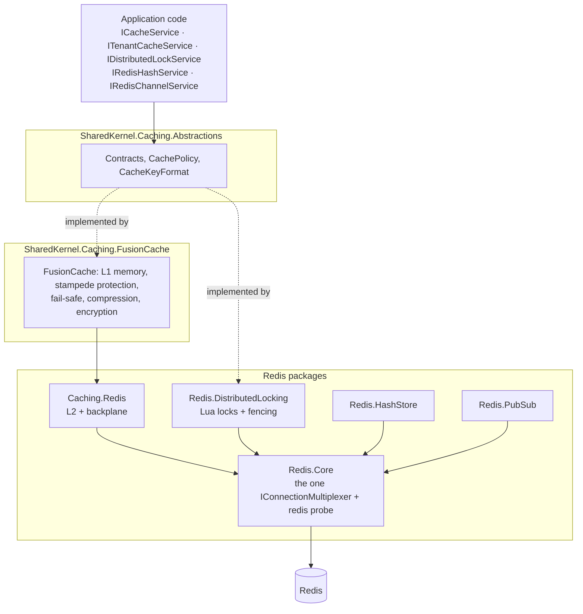

<div align="center">

# SharedKernel Caching

**Hybrid in-memory + Redis caching for multi-tenant .NET services — each value computed once, tenants kept apart by
construction — plus Redis locks with fencing tokens, hash storage and loss-tolerant Pub/Sub over one shared
connection.**

[](https://dotnet.microsoft.com/)
[](../LICENSE)

[](https://github.com/ZiggyCreatures/FusionCache)
[](https://github.com/StackExchange/StackExchange.Redis)

[Packages](#packages) · [How it fits together](#how-it-fits-together) · [Get started](#get-started) ·
[See it run](#see-it-run) · [Guarantees](#guarantees)

</div>

---

## What this domain gives you

- **One read path that survives load.** `ICacheService.GetOrSetAsync` runs the factory once per key however many
  callers miss together, keeps a cached `null` or `0` distinct from a miss (`CacheLookup<T>`), and can serve a stale
  value (fail-safe) while the source of truth is down.
- **Tenant isolation you cannot bypass.** `ITenantCacheService` takes an explicit `TenantId` on every call and builds
  every key and tag itself; `RemoveTenantAsync` drops one tenant and nothing else.
- **Invalidation that reaches every instance.** With the Redis layer added, `RemoveAsync`, `ExpireAsync`, tag removal
  and `ClearAsync` travel over the FusionCache backplane — no invalidation messages of your own.
- **Locks that never lie.** `IDistributedLockService` returns `null` only for contention, throws
  `DistributedLockUnavailableException` for an outage, reports a lost lock before another replica can take it, and
  issues a fencing token in the same atomic step as the acquisition.
- **Redis configured once.** `AddRedisConnection` is the only registration that reads connection settings (TLS, mutual
  TLS, timeouts, fail-fast); every other Redis package runs over that one multiplexer and its `redis` readiness probe.

## Packages

| Package | Tier | When you need it |
| --- | --- | --- |
| [SharedKernel.Caching.Abstractions](SharedKernel.Caching.Abstractions/README.md) | Abstractions | Always — application code injects `ICacheService`, `ITenantCacheService`, `ICacheKeyProvider` and `IDistributedLockService` from here. No provider dependency |
| [SharedKernel.Caching.FusionCache](SharedKernel.Caching.FusionCache/README.md) | Adapter | The cache itself: memory layer, stampede protection, fail-safe, Brotli compression, encryption at rest, startup warmup, the `cache` probe |
| [SharedKernel.Caching.Redis.Core](SharedKernel.Caching.Redis.Core/README.md) | Adapter | Any Redis package — the one shared connection (`AddRedisConnection`) and the `redis` probe |
| [SharedKernel.Caching.Redis](SharedKernel.Caching.Redis/README.md) | Adapter | Instances of a service should share entries: Redis as the distributed layer and backplane (`AddRedisL2`) |
| [SharedKernel.Caching.Redis.DistributedLocking](SharedKernel.Caching.Redis.DistributedLocking/README.md) | Adapter | Only one replica may run a section or claim a job occurrence (`AddRedisDistributedLocking`) |
| [SharedKernel.Caching.Redis.HashStore](SharedKernel.Caching.Redis.HashStore/README.md) | Adapter | Sessions, settings snapshots or counters stored as Redis hashes (`IRedisHashService`, `ITypedHashStore<T>`) |
| [SharedKernel.Caching.Redis.PubSub](SharedKernel.Caching.Redis.PubSub/README.md) | Adapter | Loss-tolerant, at-most-once signals between instances (`IRedisChannelService`) — never for work that must happen |

Related packages outside this folder:

| Package | Adds |
| --- | --- |
| [SharedKernel.Application.Pipeline.Caching](../05.Application/SharedKernel.Application.Pipeline.Caching/README.md) | `app.WithCaching()` — caches `ICacheableQuery` results and evicts after `IInvalidatesCache` commands, over `ICacheService` |
| [SharedKernel.ServiceDefaults](../13.ServiceDefaults/SharedKernel.ServiceDefaults/README.md) | `AddHealthChecks().AddSharedKernelReadiness()` maps the `cache` and `redis` probes to `/health/ready`; `WithCachingTelemetry()` exports the `SharedKernel.Caching` meter and traces |
| [SharedKernel.Caching.Testing](../16.Testing/SharedKernel.Caching.Testing/README.md) | `AddFakeCachingServices()`, `AddFakeTenantCacheService()` — in-memory cache and lock fakes, no Redis |
| [SharedKernel.Caching.Redis.Testing](../16.Testing/SharedKernel.Caching.Redis.Testing/README.md) | `AddFakeRedisServices()` — in-memory hash store and Pub/Sub fakes |

## How it fits together



- **Any subset.** A service with only an in-process cache references no Redis package; a lock-only worker needs no
  cache. Every Redis registration throws at startup when `AddRedisConnection` has not been called first.
- **Role packages never reference each other.** Each Redis package depends only on `Redis.Core` (and the abstractions);
  `Redis` and `FusionCache` never reference each other. The build enforces it.
- **Caching is not messaging.** No caching package references `SharedKernel.Messaging.*` and vice versa. Pub/Sub stays
  here because its contract is deliberately weaker than durable messaging.

## Get started

```json
{
  "SharedKernel": {
    "Caching": {
      "ServiceName": "orders",
      "Redis": { "ConnectionString": "redis.internal:6380", "Ssl": true }
    }
  }
}
```

```csharp
using SharedKernel.Caching.FusionCache.Extensions;
using SharedKernel.Caching.Redis.Core.Extensions;
using SharedKernel.Caching.Redis.DistributedLocking.Extensions;
using SharedKernel.Caching.Redis.Extensions;

builder.Services.AddRedisConnection(builder.Configuration);    // SharedKernel:Caching:Redis — once

builder.Services
    .AddSharedKernelCaching(builder.Configuration)             // SharedKernel:Caching — ServiceName is required
    .AddTenantCacheService()                                   // ITenantCacheService
    .AddRedisL2()                                              // shared entries + backplane
    .AddRedisDistributedLocking();                             // IDistributedLockService

builder.Services.AddHealthChecks().AddSharedKernelReadiness(); // "cache" and "redis" on /health/ready
```

```csharp
using SharedKernel.Caching.Abstractions;
using SharedKernel.Execution.Tenancy;

public sealed class InvoiceReader(ITenantCacheService cache, IInvoiceRepository invoices)
{
    private static readonly CachePolicy Policy = CachePolicy.Default.WithTags("invoices");

    public ValueTask<Invoice?> GetAsync(TenantId tenantId, string invoiceId, CancellationToken ct) =>
        cache.GetOrSetAsync(tenantId, "invoice", invoiceId, t => invoices.FindAsync(tenantId, invoiceId, t), Policy, ct);
}
```

Each package README has the full configuration table, recipes and pitfalls. Start with
[SharedKernel.Caching.Abstractions](SharedKernel.Caching.Abstractions/README.md) for the contracts.

## See it run

No reference service uses caching yet. [`consumer-verify/SharedKernel.Caching.ConsumerVerify`](consumer-verify/SharedKernel.Caching.ConsumerVerify/Program.cs)
consumes all seven packages as packed NuGet packages and starts five real hosts against a Testcontainers Redis: L1
only, L1 + Redis L2, locking only, hash store only and Pub/Sub only. The query-caching pipeline stage that builds on
this domain is shown in [samples/OrderApi](../samples/OrderApi/README.md)'s registration.

## Guarantees

| Guarantee | How |
| --- | --- |
| **One factory run per key** | `GetOrSetAsync` serialises concurrent misses; a value the factory marks with `SkipCaching()` is returned only to the caller whose factory ran, never to waiters |
| **No cross-tenant reads or evictions** | Tenant keys are `{service}:@{tenant}:{entity}:{id}`, tenant tags `@{tenant}:{tag}`; caller parts are escaped and global tags may not start with `@` |
| **No key collisions between services** | `ServiceName` has no default and is validated at startup; it prefixes every key |
| **No silent outages** | Locks throw `DistributedLockUnavailableException`; an unreachable Redis is logged, fails fast by default, and the cache continues from memory behind FusionCache's circuit breakers |
| **Loss before expiry** | A lock that cannot be extended is reported lost at five sixths of its expiry, before the key can expire on the server |
| **No secrets or ids in telemetry** | Metrics, spans and logs carry `{service}:{entity}` only; connection strings never appear in logs, validation messages or probe descriptions |
| **Values bound to their key** | `AddCacheEncryption()` encrypts with AES-256-GCM using the cache key as associated data; a value copied to another key or tenant fails to decrypt and is a miss |

**Deliberately out of scope:** an invalidation bus (the backplane does it), sliding expiration, RedLock, and durable
messaging (see [07.Messaging](../07.Messaging/README.md)).

---

**For maintainers:** design rules and invariants live in [CLAUDE.md](CLAUDE.md); phase history in
[state-map.md](state-map.md).
