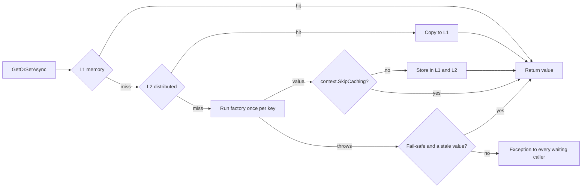
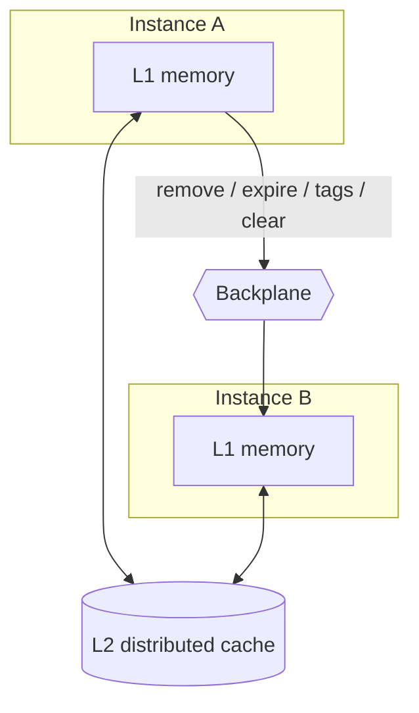
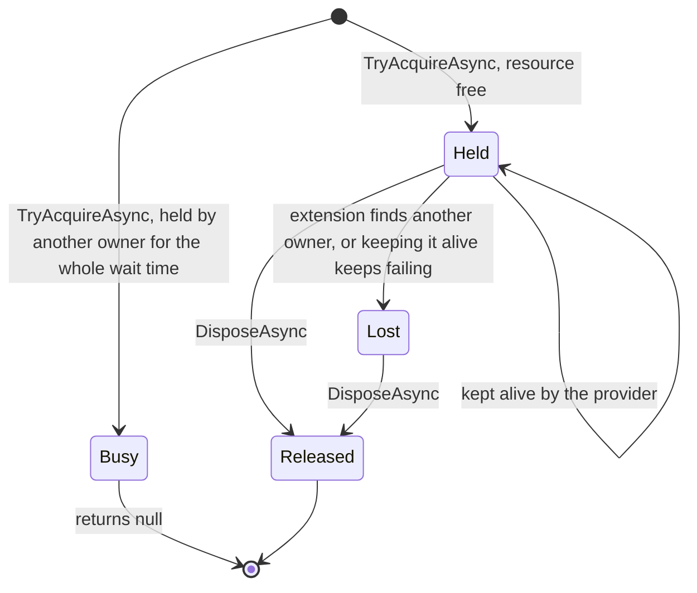

# SharedKernel.Caching.Abstractions

[](https://dotnet.microsoft.com/)
[](https://github.com/Gresta-Vertex-Labs/platform-shared-kernel/blob/main/LICENSE)


> **Caching and distributed-locking contracts for .NET services: a hybrid cache that computes each value once,
> keeps tenants apart by construction, and locks that never mistake an outage for a busy resource.**

Caching goes wrong in ways that only show up under load or in production:

- a hundred requests miss the same key and hit the database a hundred times;
- two tenants tag entries `"orders"` and evict each other's data;
- a cached "not found" looks exactly like a miss;
- a lock that fails because Redis is down is read as "someone else has it", and a job silently never runs.

This package defines the contracts that make those mistakes hard to write. Application code depends only on it; the
composition root picks the implementation.

| You get | So that |
| --- | --- |
| `ICacheService.GetOrSetAsync` | A missing value is computed once per key, however many callers miss at the same time |
| `CacheFactoryContext` | The factory decides per result whether to cache it, for example never caching a failure |
| `CacheLookup<T>` from `TryGetAsync` | A cached `null` or `0` is never confused with a miss |
| `ITenantCacheService` and `CacheKeyFormat` | No tenant can read, overwrite or evict another tenant's entries |
| `CachePolicy` | Durations, fail-safe, timeouts, jitter and tags are one immutable, validated value |
| `IDistributedLockService` | Locks stay held until released, report loss, carry fencing tokens, and throw on an outage instead of returning "busy" |

## Contents

- [Install](#install)
- [Quick start](#quick-start)
- [How it works](#how-it-works)
- [Recipes](#recipes)
- [Reference](#reference)
- [Testing](#testing)
- [Pitfalls](#pitfalls)
- [Design decisions](#design-decisions)

## Install

```xml
<PackageReference Include="SharedKernel.Caching.Abstractions" />
```

The version comes from your central `SharedKernelVersion` property — every SharedKernel package ships at the same
version. See [Using the packages](https://github.com/Gresta-Vertex-Labs/platform-shared-kernel#using-the-packages).

| Requirement | Value |
| --- | --- |
| Target framework | `net10.0` |
| Tier | Abstractions — reference it from your **Application** project |
| Depends on | `SharedKernel.Execution` (for `TenantId`) and `Microsoft.Extensions.DependencyInjection.Abstractions` only |
| Registration | None in this package; the host registers a provider (see [Providers](#providers)) |
| Namespace | `SharedKernel.Caching.Abstractions` |

## Quick start

Register a provider once, in the host:

```csharp
builder.Services.AddRedisConnection(builder.Configuration);   // SharedKernel.Caching.Redis.Core (with Redis only)

builder.Services
    .AddSharedKernelCaching(o => o.ServiceName = "orders")   // SharedKernel.Caching.FusionCache
    .AddRedisL2();                                           // SharedKernel.Caching.Redis (optional)
```

Then depend on the contracts:

```csharp
using SharedKernel.Caching.Abstractions;

public sealed class ProductReader(ICacheService cache, ICacheKeyProvider keys, IProductRepository products)
{
    public ValueTask<Product?> GetAsync(Guid id, CancellationToken ct) =>
        cache.GetOrSetAsync(
            keys.BuildKey("product", id.ToString("D")),   // "orders:product:3f2c…"
            token => products.FindAsync(id, token),       // runs once per key, even under a stampede
            CachePolicy.Default.WithTags("products"),
            ct);
}
```

A missing product is cached as `null`, so it isn't looked up again until the entry expires.

## How it works

### Which type do I need?

| I want to… | Use |
| --- | --- |
| Read a value, computing it on a miss | `ICacheService.GetOrSetAsync` |
| Read tenant data | `ITenantCacheService.GetOrSetAsync` |
| Decide after computing whether to cache | The `GetOrSetAsync` overload with `CacheFactoryContext` |
| Check whether something is cached, without computing | `ICacheService.TryGetAsync` → `CacheLookup<T>` |
| Store a value I already have | `ICacheService.SetAsync` |
| Build a key | `ICacheKeyProvider.BuildKey` (tenant: `ITenantCacheKeyProvider.BuildTenantKey`) |
| Configure durations, tags, fail-safe, timeouts | `CachePolicy` |
| Drop one entry / a group / a tenant / everything | `RemoveAsync` or `ExpireAsync` / `RemoveByTagAsync` / `RemoveTenantAsync` / `ClearAsync` |
| Pre-fill the cache at startup | `ICacheWarmupStrategy` |
| Make sure only one process runs a critical section | `IDistributedLockService.TryAcquireAsync` → `IDistributedLock` |
| Claim a one-off occurrence across replicas | `IDistributedLockService.TryAcquireLeaseAsync` → `DistributedLease` |
| Reject writes from a holder that lost its lock | `FencingToken` on the lock or lease |

### Reading through the cache



*Read path: memory first, then the distributed layer, then the factory. Concurrent callers for the same key wait for
one factory run. A failing factory falls back to the stale value when fail-safe allows it.*

Concurrent callers for a key share one factory run and all receive its value. `CacheFactoryContext` only changes
what is written. **Eager refresh** recomputes a value in the background shortly before it expires, so readers keep
getting fast hits. A **soft timeout** lets a slow factory finish in the background while callers get the stale value.

### Layers and instances



*Each instance keeps its own memory layer. The distributed layer is shared. Removals, expirations, tag evictions and
clears travel over the backplane so every instance drops its memory copy.*

Without a distributed layer, the cache is per process and every operation is local. With one, you need no
invalidation messages of your own.

### Locks and leases



*A lock is held until disposed and kept alive in the background. If it is lost, `IsHeld` turns false and `LostToken`
is cancelled.*

A **lease** has no lifecycle to manage. It is claimed once, never extended or released, and simply expires after its
duration. Both return `null` only when another holder has the resource. When the lock store is unreachable they throw
`DistributedLockUnavailableException`.

### Providers

This package contains no implementation. The platform ships these providers:

| Package | Registers | Registration |
| --- | --- | --- |
| `SharedKernel.Caching.FusionCache` | `ICacheService`, `ICacheKeyProvider`, `ITenantCacheKeyProvider`, optional `ITenantCacheService` | `AddSharedKernelCaching(o => o.ServiceName = "…")`, `.AddTenantCacheService()` |
| `SharedKernel.Caching.Redis.Core` | The shared Redis connection every Redis provider uses | `services.AddRedisConnection(configuration)`, once, before any other Redis registration |
| `SharedKernel.Caching.Redis` | The Redis distributed layer and backplane | `.AddRedisL2()` on the caching builder |
| `SharedKernel.Caching.Redis.DistributedLocking` | `IDistributedLockService` over Redis | `services.AddRedisDistributedLocking()` or `.AddRedisDistributedLocking()` on the caching builder |

No Redis registration other than `AddRedisConnection` takes a connection string; the connection is configured once in
`SharedKernel:Caching:Redis`.

A typical service:

```csharp
builder.Services.AddRedisConnection(builder.Configuration);

builder.Services
    .AddSharedKernelCaching(o => o.ServiceName = "orders")
    .AddTenantCacheService()
    .AddRedisL2()
    .AddRedisDistributedLocking();
```

A worker that only needs locks:

```csharp
builder.Services
    .AddRedisConnection(builder.Configuration)
    .AddRedisDistributedLocking();
```

`ServiceName` is required. It prefixes every key, so services that share a Redis instance never collide, and startup
fails if it is missing or invalid. Optional features such as compression, encryption and warmup are documented in the
provider READMEs.

`AddSharedKernelCaching` registers a `cache` readiness probe and `AddRedisConnection` a `redis` one
(`SharedKernel.Primitives.Health.IReadinessProbe`); a host reports both with
`services.AddHealthChecks().AddSharedKernelReadiness()` from `SharedKernel.ServiceDefaults`.

## Recipes

### 1. Cache a query

```csharp
private static readonly CachePolicy CustomerPolicy =
    CachePolicy.For(TimeSpan.FromMinutes(2), TimeSpan.FromMinutes(30)).WithTags("customers");

public ValueTask<CustomerDto?> GetCustomerAsync(Guid id, CancellationToken ct) =>
    cache.GetOrSetAsync(keys.BuildKey("customer", id.ToString("D")), t => LoadAsync(id, t), CustomerPolicy, ct);
```

Keep policies in `static readonly` fields. They are immutable and thread-safe.

### 2. Never cache a failure

```csharp
Result<Quote> quote = await cache.GetOrSetAsync(
    keys.BuildKey("quote", request.Id),
    async (context, token) =>
    {
        Result<Quote> result = await pricing.QuoteAsync(request, token);
        if (result.IsFailure)
            context.SkipCaching();                       // returned to callers, never stored
        else if (result.Value.IsIndicative)
            context.SetDurations(TimeSpan.FromSeconds(5), TimeSpan.FromSeconds(5)); // refresh soon
        return result;
    },
    CachePolicy.For(TimeSpan.FromMinutes(1), TimeSpan.FromMinutes(10)),
    ct);
```

### 3. Invalidate after a write

```csharp
await customers.UpdateAsync(customer, ct);
await cache.RemoveAsync(keys.BuildKey("customer", customer.Id.ToString("D")), ct); // one entry
await cache.RemoveByTagAsync("customer-lists", ct);                                  // every list containing it
```

| Call | Next read | Fail-safe fallback |
| --- | --- | --- |
| `RemoveAsync` | Recomputes | None: the old value is gone |
| `ExpireAsync` | Recomputes | Serves the old value if recomputing fails |
| `RemoveByTagAsync` / `RemoveByTagsAsync` | Recomputes each tagged key | None |
| `ClearAsync` | Recomputes everything, all tenants | None |

Invalidate **after** the write commits. Invalidating before it lets a concurrent reader cache the old value again.

### 4. Cache tenant data

```csharp
public sealed class InvoiceReader(ITenantCacheService cache, IInvoiceRepository invoices)
{
    private static readonly CachePolicy Policy = CachePolicy.Default.WithTags("invoices");

    public ValueTask<Invoice?> GetAsync(TenantId tenantId, string invoiceId, CancellationToken ct) =>
        cache.GetOrSetAsync(tenantId, "invoice", invoiceId, t => invoices.FindAsync(tenantId, invoiceId, t), Policy, ct);

    public ValueTask OnInvoicesImportedAsync(TenantId tenantId, CancellationToken ct) =>
        cache.RemoveByTagAsync(tenantId, "invoices", ct);   // this tenant only

    public ValueTask OnTenantOffboardedAsync(TenantId tenantId, CancellationToken ct) =>
        cache.RemoveTenantAsync(tenantId, ct);              // every entry of the tenant
}
```

Pass the policy unscoped; the service scopes it. The tenant is always an argument, never ambient state: a `SharedKernel.Execution.Tenancy.TenantId` (`default(TenantId)` throws), written into keys and tags as its lowercase GUID. A caller that holds the nullable `IRequestContext.TenantId` decides what a missing tenant means before it calls.

### 5. Survive an outage of the source

```csharp
private static readonly CachePolicy CatalogPolicy = CachePolicy
    .For(TimeSpan.FromMinutes(1), TimeSpan.FromMinutes(10))
    .WithFailSafe(TimeSpan.FromHours(6))              // serve up to 6 h stale if the catalog is down
    .WithFactoryTimeouts(
        softTimeout: TimeSpan.FromMilliseconds(300),  // slow source: answer with stale data, refresh in background
        hardTimeout: TimeSpan.FromSeconds(3))         // no stale data: fail instead of hanging
    .WithJitter(TimeSpan.FromSeconds(30));            // entries written together don't expire together
```

Turn fail-safe **off** (`WithoutFailSafe()`) where stale data is unsafe, such as permissions or a tenant's
suspended status.

### 6. Guard a critical section

```csharp
await using IDistributedLock? handle = await locks.TryAcquireAsync(
    $"billing:invoice:{invoiceId}",
    new DistributedLockOptions { Expiry = TimeSpan.FromSeconds(30), WaitTime = TimeSpan.FromSeconds(5) },
    ct);

if (handle is null)
    return Result.Failure(Error.Conflict("invoice.busy", "The invoice is being settled."));

using var work = CancellationTokenSource.CreateLinkedTokenSource(ct, handle.LostToken);
await invoices.SettleAsync(invoiceId, handle.FencingToken, work.Token);
```

- `Expiry` is how long the lock survives a crashed holder. The provider extends it while you hold it.
- A `DistributedLockUnavailableException` means the store is down. Let it propagate, or retry later; don't treat it as
  "busy".

### 7. Run something once across replicas

```csharp
DistributedLease? lease = await locks.TryAcquireLeaseAsync(
    $"reports:monthly-statement:{period:yyyy-MM}",
    TimeSpan.FromHours(2),
    ct);

if (lease is null)
    return; // another replica claimed this period

await statements.GenerateAsync(period, lease.FencingToken, ct);
```

Put the occurrence (date, period, scheduled time) in the resource name. Never release a lease: releasing it early would
let a slower replica claim the same occurrence.

### 8. Enforce a fencing token

A holder can lose its lock without noticing, for example during a long GC pause, while another holder takes over. The
protected resource must reject the stale holder:

```sql
UPDATE invoices
SET    status = 'Settled', fencing_token = @token
WHERE  id = @id AND fencing_token < @token;   -- 0 rows: a newer holder already wrote
```

Tokens for a resource strictly increase across all locks and leases on it; gaps are normal.

## Reference

### Public types

| Type | Kind | Purpose |
| --- | --- | --- |
| `ICacheService` | Interface | Hybrid cache: get-or-set, read, write, remove, expire, tag removal, clear |
| `ITenantCacheService` | Interface | Tenant-isolated cache with `RemoveTenantAsync` |
| `CacheLookup<T>` | Struct | Hit (with a value that may be `null`) or miss |
| `CacheFactoryContext` | Class | A factory's caching decision: `SkipCaching`, `SetDurations` |
| `CachePolicy` | Record | Immutable, validated storage settings |
| `CacheKeyFormat` | Static class | The canonical key and tag format and escaping |
| `ICacheKeyProvider` / `ITenantCacheKeyProvider` | Interfaces | Service-prefixed key builders |
| `ICacheWarmupStrategy` | Interface | Startup routine that pre-fills the cache |
| `ICachingBuilder` | Interface | Chains provider registrations |
| `IDistributedLockService` | Interface | Locks and leases |
| `IDistributedLock` | Interface | A held lock: `Resource`, `FencingToken`, `IsHeld`, `LostToken` |
| `DistributedLockOptions` | Record | `Expiry` (30 s), `WaitTime` (0), `RetryInterval` (200 ms) |
| `DistributedLease` | Record | `Resource`, `FencingToken`, `ExpiresAt` |
| `DistributedLockUnavailableException` | Exception | The lock store could not be reached |

### `CachePolicy`

| Setting | Default | Set with | Validation |
| --- | --- | --- | --- |
| `L1Duration` / `L2Duration` | 5 min / 30 min | `For(l1, l2)`, `For(duration)` | Positive; L1 ≤ L2; `TimeSpan.MaxValue` = never expires |
| `Tags` | none | `WithTags(...)` | Non-empty, non-whitespace, not starting with `@`; copied |
| `IsFailSafeEnabled` / `FailSafeMaxDuration` | on / provider default | `WithFailSafe(max)`, `WithoutFailSafe()` | Positive |
| `FactorySoftTimeout` / `FactoryHardTimeout` | none | `WithFactoryTimeouts(soft, hard)` | Positive; soft < hard; soft needs fail-safe |
| `EagerRefreshThreshold` | 0.9 | `WithEagerRefresh(t)`, `WithoutEagerRefresh()` | Open range (0, 1) |
| `JitterMaxDuration` | none | `WithJitter(max)` | Positive |
| `IsLocalOnly` | false | `LocalOnly()` | |
| `IsTenantScoped` | false | `ForTenant(tenantId)` | Once only; no `WithTags` afterwards |

Presets: `CachePolicy.Default`, and `CachePolicy.NeverExpire` (no time-based expiry, no eager refresh).

### Key and tag format

| Kind | Format | Example |
| --- | --- | --- |
| Key | `{service}:{entity}:{id}[:{segment}…]` | `orders:invoice:42:en-GB` |
| Tenant key | `{service}:@{tenant}:{entity}:{id}[:{segment}…]` | `orders:@3f2b…e91c:invoice:42` |
| Tenant tag | `@{tenant}:{tag}` | `@3f2b…e91c:invoices` |
| Tenant-wide tag | `@{tenant}` | `@3f2b…e91c` |

- **Tenant.** `{tenant}` is the `TenantId` written as its lowercase GUID (`TenantId.ToString()`); `default(TenantId)` throws `ArgumentException`.
- **Escaping.** Every other caller-supplied part is escaped: `%` → `%25`, `:` → `%3A`, `@` → `%40`.
- **Service names.** 1–64 characters of lowercase `a-z`, `0-9`, `.`, `_` or `-`, starting with a letter or digit.

### Exceptions

| Exception | Thrown by | When |
| --- | --- | --- |
| `ArgumentException` | Every cache method, key builders | A key, tag, entity or id is null or whitespace; a `default(TenantId)`; an invalid service name; a tag starting with `@` |
| `ArgumentNullException` | Every method | A factory, policy or collection is `null` |
| `ArgumentOutOfRangeException` | `CachePolicy`, `CacheFactoryContext.SetDurations`, `DistributedLockOptions`, `DistributedLease` | A duration, threshold or token is out of range |
| `InvalidOperationException` | `CachePolicy.ForTenant`, `WithTags`, `WithFactoryTimeouts`; `CacheLookup<T>.Value` | Scoping twice; soft timeout without fail-safe; reading the value of a miss |
| `DistributedLockUnavailableException` | `TryAcquireAsync`, `TryAcquireLeaseAsync` | The lock store could not be reached |

## Testing

Reference [`SharedKernel.Caching.Testing`](https://github.com/Gresta-Vertex-Labs/platform-shared-kernel/blob/main/16.Testing/SharedKernel.Caching.Testing/README.md)
from your test project (namespace `SharedKernel.Testing.Caching`):

```csharp
services.AddFakeCachingServices()          // ICacheService, ICacheKeyProvider, ITenantCacheKeyProvider, IDistributedLockService
        .AddFakeTenantCacheService();      // ITenantCacheService
```

- `FakeCacheService` is faithful where it matters: hit versus miss (including a cached `null`), tags, `SkipCaching()`
  and stampede protection. Durations, fail-safe and eager refresh are not simulated. Assert with `Count`,
  `FactoryInvocationCount` and `GetTags(key)`.
- `FakeDistributedLockService` has `SimulateContention`, `SimulateUnavailable`, `AcquiredLocks`, `AcquiredLeases`; a
  `FakeDistributedLock` can `SimulateLoss()`.
- `AddFakeCacheWarmupStrategy(name, order, executionLog)` registers a recording `ICacheWarmupStrategy`.
- Redis-specific fakes (hash store, Pub/Sub) are in
  [`SharedKernel.Caching.Redis.Testing`](https://github.com/Gresta-Vertex-Labs/platform-shared-kernel/blob/main/16.Testing/SharedKernel.Caching.Redis.Testing/README.md).

## Pitfalls

| Don't | Do | Why |
| --- | --- | --- |
| `TryGetAsync`, then compute, then `SetAsync` | `GetOrSetAsync` | Only `GetOrSetAsync` runs the factory once per key under concurrency |
| Check `lookup.Value is null` to detect a miss | Check `lookup.IsHit` | A cached `null` is a hit |
| Build keys with `$"{service}:{id}"` | `ICacheKeyProvider.BuildKey` | Unescaped parts can collide, and the service prefix gets forgotten |
| Put a tenant id in a hand-built key or tag | `ITenantCacheService` | Tags are global; two tenants would evict each other |
| Cache a failed `Result` | `context.SkipCaching()` | Every caller would get the failure until it expires |
| Use eager refresh or timeouts with a scoped `DbContext` factory | `WithoutEagerRefresh()`, `WithFactoryTimeouts(null, null)` | The factory would run after the request scope was disposed |
| Keep fail-safe on for permissions or tenant status | `WithoutFailSafe()` | An outage would keep serving revoked access |
| Invalidate before the database commit | Invalidate after it | A concurrent read re-caches the old value |
| Treat `DistributedLockUnavailableException` as "busy" | Fail or retry later | Otherwise a Redis outage silently skips work everywhere |
| Release a lease, or dispose a lock early to "unblock" others | Let a lease expire; hold a lock for the whole section | Releasing reopens the window the claim exists to close |
| Trust a lock without checking the fencing token at the resource | Reject tokens that are not greater than the last accepted | A paused holder can write after losing its lock |
| Use one resource name for every occurrence of a job | Include the occurrence in the name | The next run would be blocked by the previous lease |

## Design decisions

**Why our own interface instead of `HybridCache`?** `Microsoft.Extensions.Caching.Hybrid.HybridCache` has no read
without computing, no fail-safe or eager refresh settings, no per-result caching decision and no tenant model. This
interface keeps FusionCache's full feature set behind a provider-neutral contract and adds tenant isolation that
cannot be bypassed.

**Why is there no cache invalidation bus?** Removing, expiring or tag-evicting an entry already reaches every instance
through the distributed layer's backplane. A separate bus would duplicate that, and an event another service publishes
is the wrong way to invalidate a cache it does not own.

**Why does `null` mean only "busy" for locks?** A job that treats "Redis is down" as "another replica is running it"
never runs, on any replica, and nobody notices. An exception makes the outage visible.

**Why both locks and leases?** A lock guards a critical section and must end when the work ends. A lease claims an
occurrence and must *not* end when the work ends: releasing it lets a slower replica run the same occurrence again.

**Why escape key parts and mark tenants with `@`?** Without escaping, `("a:b", "c")` and `("a", "b:c")` produce the
same key, and a global tag named `tenant-a:orders` equals tenant A's `orders` tag. Escaping plus a reserved marker
makes every key and tag unambiguous.

**Why does `CachePolicy` reject `L1 > L2`?** A memory entry that outlives the distributed entry lets instances
disagree for longer than the shared layer allows, which is never what a service wants.

**Why no `KeyVersion` or sliding expiration?** A version belongs in the key (`"invoice-v2"`), not in a policy that
the cache ignores. Sliding expiration cannot be honoured by the distributed layer, so it would behave differently per
layer.

**What is guaranteed?**

- **Provider-neutral by rule.** Architecture tests fail CI if this package references anything but
  `SharedKernel.Execution` and `Microsoft.Extensions.DependencyInjection.Abstractions`, or declares a provider-specific
  type.
- **Always-valid values.** `CachePolicy`, `DistributedLockOptions` and `DistributedLease` validate on construction;
  `CachePolicy` copies caller arrays and compares tags by value.
- **Stable formats.** The key and tag format is part of the contract; a change is a breaking change.

**What is deliberately not included?**

- **No implementation.** Providers live in `SharedKernel.Caching.FusionCache`, `SharedKernel.Caching.Redis` and
  `SharedKernel.Caching.Redis.DistributedLocking`.
- **No Redis-specific contracts.** Hash storage and Pub/Sub live in `SharedKernel.Caching.Redis.HashStore` and
  `SharedKernel.Caching.Redis.PubSub`.
- **No ambient tenant.** Tenant identity is always an explicit `TenantId` argument, resolved at the edge.
- **No lock renewal API.** Locks are kept alive by the provider until disposed; there is nothing to renew by hand.

---

Part of [Platform.SharedKernel](https://github.com/Gresta-Vertex-Labs/platform-shared-kernel) ·
[Caching domain](https://github.com/Gresta-Vertex-Labs/platform-shared-kernel/blob/main/02.Caching/README.md) ·
[MIT license](https://github.com/Gresta-Vertex-Labs/platform-shared-kernel/blob/main/LICENSE)
