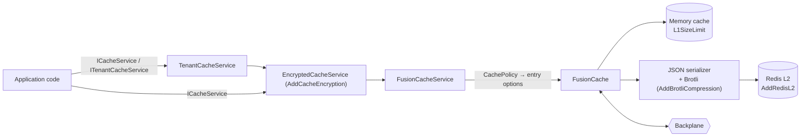

# SharedKernel.Caching.FusionCache

[](https://dotnet.microsoft.com/)
[](https://github.com/Gresta-Vertex-Labs/platform-shared-kernel/blob/main/LICENSE)
[](https://github.com/ZiggyCreatures/FusionCache)


> **The production implementation of the SharedKernel caching contracts, built on FusionCache: stampede
> protection, fail-safe and eager refresh, validated configuration, tenant-safe telemetry, and opt-in compression,
> encryption and startup warmup.**

Application code depends on [`SharedKernel.Caching.Abstractions`](https://github.com/Gresta-Vertex-Labs/platform-shared-kernel/blob/main/02.Caching/SharedKernel.Caching.Abstractions/README.md)
(`ICacheService`, `ITenantCacheService`, `CachePolicy`). This package makes those contracts work. Register it once at
the composition root, and add [`SharedKernel.Caching.Redis`](https://github.com/Gresta-Vertex-Labs/platform-shared-kernel/blob/main/02.Caching/SharedKernel.Caching.Redis/README.md) when instances
should share entries.

| You get | So that |
| --- | --- |
| `AddSharedKernelCaching(configuration)` | Settings bind from `SharedKernel:Caching` and a bad value fails at startup, not in production traffic |
| A required, validated `ServiceName` | Services sharing a Redis instance never collide on keys |
| Service-wide distributed-cache timeouts | A slow or unreachable Redis costs a bounded time per call instead of stalling requests |
| Tenant-safe metrics, traces and logs | Dashboards group by `{service}:{entity}`; tenant ids and entity ids never reach telemetry |
| `AddBrotliCompression()` | Large distributed entries take less memory and network |
| `AddCacheEncryption()` | Values are AES-GCM encrypted at rest, bound to their key and tenant |
| `AddCacheWarmup<T>()` with `WaitForWarmup` | A new pod takes no traffic until its cache is warm |

## Contents

- [Install](#install)
- [Quick start](#quick-start)
- [Configuration](#configuration)
- [How it works](#how-it-works)
- [Recipes](#recipes)
  - [1. Share the cache across instances](#1-share-the-cache-across-instances)
  - [2. Bound the cost of a slow Redis](#2-bound-the-cost-of-a-slow-redis)
  - [3. Compress large entries](#3-compress-large-entries)
  - [4. Encrypt cached values](#4-encrypt-cached-values)
  - [5. Warm the cache before taking traffic](#5-warm-the-cache-before-taking-traffic)
  - [6. Trim or publish as NativeAOT](#6-trim-or-publish-as-nativeaot)
- [Telemetry](#telemetry)
- [Reference](#reference)
- [Pitfalls](#pitfalls)
- [Design decisions](#design-decisions)
- [AI quick reference](#ai-quick-reference)
- [Compatibility and guarantees](#compatibility-and-guarantees)

## Install

```shell
dotnet add package SharedKernel.Caching.FusionCache
```

| Requirement | Value |
| --- | --- |
| Target framework | `net10.0` |
| Depends on | `SharedKernel.Caching.Abstractions`, `SharedKernel.Configuration`, `SharedKernel.Cryptography`, `SharedKernel.Primitives`, `ZiggyCreatures.FusionCache` 2.6 |
| Namespace | `SharedKernel.Caching.FusionCache.Extensions` |

## Quick start

```json
{
  "SharedKernel": {
    "Caching": {
      "ServiceName": "orders"
    }
  }
}
```

```csharp
using SharedKernel.Caching.FusionCache.Extensions;

builder.Services
    .AddSharedKernelCaching(builder.Configuration)   // ICacheService, ICacheKeyProvider, ITenantCacheKeyProvider
    .AddTenantCacheService();                        // ITenantCacheService
```

Inject the contracts anywhere:

```csharp
public sealed class OrderSummaryReader(ICacheService cache, ICacheKeyProvider keys, IOrderRepository orders)
{
    private static readonly CachePolicy Policy = CachePolicy.For(TimeSpan.FromMinutes(1), TimeSpan.FromMinutes(10));

    public ValueTask<OrderSummary?> GetAsync(Guid id, CancellationToken ct) =>
        cache.GetOrSetAsync(keys.BuildKey("order-summary", id.ToString("D")), t => orders.SummaryAsync(id, t), Policy, ct);
}
```

Without configuration files, set the options in code:

```csharp
builder.Services.AddSharedKernelCaching(o => o.ServiceName = "orders");
```

## Configuration

Section `SharedKernel:Caching`, bound and validated at startup. A `configure` delegate passed to either overload runs
after binding.

| Setting | Default | Meaning |
| --- | --- | --- |
| `ServiceName` | _(required)_ | Prefix of every key. 1–64 lowercase `a-z`, `0-9`, `.`, `_`, `-`, starting with a letter or digit |
| `L1SizeLimit` | `10000` | Maximum number of memory-cache entries (an entry count, not bytes) |
| `DistributedCacheSoftTimeout` | none | How long a distributed-layer operation may take before fail-safe serves the expired value, when one exists |
| `DistributedCacheHardTimeout` | none | How long any distributed-layer operation may take before the cache continues without it |
| `FailSafeThrottleDuration` | 30 s | How long a fail-safe value is reused before the factory is tried again |
| `WaitForWarmup` | `false` | Hold host startup until every warmup strategy has run |
| `SerializerContext` | none | Source-generated JSON context for cached types; code only, needed for trimming/NativeAOT |

The timeouts and throttle apply to every entry. Everything else about an entry comes from its `CachePolicy`.

Startup fails with a clear message when `ServiceName` is missing or invalid, a duration is not positive, the soft
timeout is not shorter than the hard timeout, or `L1SizeLimit` is below 1.

## How it works



_The registration chain: the tenant cache scopes keys and tags; encryption, when added, wraps the cache service; the
FusionCache service maps each `CachePolicy` onto FusionCache entry options; the serializer, optionally with Brotli,
writes distributed entries._

- **Settings are read late.** Options are read when the cache is first resolved, after configuration binding and
  every `configure` delegate, so values from `appsettings.json`, environment variables or Key Vault all take effect.
- **Entry options start from the service-wide defaults.** Each call starts from `DistributedCacheSoftTimeout`,
  `DistributedCacheHardTimeout` and `FailSafeThrottleDuration`, then applies the policy's durations, fail-safe, factory
  timeouts, eager refresh, jitter and `LocalOnly`.
- **Factory decisions become per-write options.** `CacheFactoryContext.SkipCaching()` turns off the memory write, the
  distributed write and backplane notifications for that one write. `SetDurations` replaces its durations.
- **The distributed layer is optional.** With only this package, every operation is local to the process.

## Recipes

### 1. Share the cache across instances

```csharp
builder.Services.AddRedisConnection(builder.Configuration);   // SharedKernel:Caching:Redis, once

builder.Services
    .AddSharedKernelCaching(builder.Configuration)
    .AddRedisL2();
```

The Redis connection (connection string, TLS, timeouts) is configured once with `AddRedisConnection` from
[`SharedKernel.Caching.Redis.Core`](https://github.com/Gresta-Vertex-Labs/platform-shared-kernel/blob/main/02.Caching/SharedKernel.Caching.Redis.Core/README.md);
`AddRedisL2` takes no connection string. Entries are shared by every instance of the service. Removals, expirations, tag evictions and clears reach every
instance through the backplane. See [`SharedKernel.Caching.Redis`](https://github.com/Gresta-Vertex-Labs/platform-shared-kernel/blob/main/02.Caching/SharedKernel.Caching.Redis/README.md).

### 2. Bound the cost of a slow Redis

```json
{
  "SharedKernel": {
    "Caching": {
      "ServiceName": "orders",
      "DistributedCacheSoftTimeout": "00:00:00.100",
      "DistributedCacheHardTimeout": "00:00:01",
      "FailSafeThrottleDuration": "00:00:30"
    }
  }
}
```

- **Soft timeout.** When Redis takes longer than 100 ms and an expired value exists, fail-safe serves it while the
  operation finishes in the background.
- **Hard timeout.** No distributed operation holds a request for more than a second.
- **Throttle.** While the source of truth is down, the factory is retried at most every 30 seconds per key.

### 3. Compress large entries

```csharp
builder.Services
    .AddSharedKernelCaching(builder.Configuration)
    .AddRedisL2()
    .AddBrotliCompression(o => o.ThresholdBytes = 2048);
```

Entries of 2 KB or more are compressed before they reach Redis; smaller ones are stored as they are. Compressed payloads
carry a marker, so entries written before compression was enabled stay readable. Memory-cache entries are never
compressed.

### 4. Encrypt cached values

```csharp
builder.Services.AddSingleton<IEncryptionKeyProvider>(keyProvider);
builder.Services.AddSharedKernelCryptography(builder.Configuration).AddSymmetricEncryption();

builder.Services
    .AddSharedKernelCaching(builder.Configuration)
    .AddTenantCacheService()
    .AddRedisL2()
    .AddBrotliCompression()     // before encryption: values are compressed, then encrypted
    .AddCacheEncryption();      // last
```

- **What is protected.** Every value is AES-GCM encrypted with the cache key as associated data. A value copied to
  another key, or to another tenant's key, fails to decrypt and is treated as a miss.
- **Compression still applies.** It runs on the plaintext, with the configured threshold and level.
- **Deploying it.** Turning encryption on or off changes the stored format, so distributed entries are recomputed
  once after the deployment.

### 5. Warm the cache before taking traffic

```csharp
public sealed class CurrencyWarmup(ICurrencyRepository currencies, ICacheKeyProvider keys) : ICacheWarmupStrategy
{
    public string Name => "currencies";
    public int Order => 0;

    public async ValueTask WarmupAsync(ICacheService cache, CancellationToken ct)
    {
        foreach (var currency in await currencies.ListAsync(ct))
            await cache.SetAsync(keys.BuildKey("currency", currency.Code), currency, CachePolicy.NeverExpire, ct);
    }
}

builder.Services
    .AddSharedKernelCaching(o => { o.ServiceName = "pricing"; o.WaitForWarmup = true; })
    .AddCacheWarmup<CurrencyWarmup>();
```

- **With `WaitForWarmup`.** Warmup runs before any hosted service starts, including the web server, so the pod neither
  listens nor reports ready until it finishes. Give the Kubernetes `startupProbe` enough headroom for the slowest
  warmup.
- **Without it.** Warmup runs in the background after startup.
- **Failures.** A failing strategy is logged, and the next one runs.

### 6. Trim or publish as NativeAOT

```csharp
[JsonSerializable(typeof(Currency))]
[JsonSerializable(typeof(OrderSummary))]
internal sealed partial class CacheJsonContext : JsonSerializerContext;

builder.Services.AddSharedKernelCaching(builder.Configuration, o => o.SerializerContext = CacheJsonContext.Default);
```

Every type stored in the distributed layer, or encrypted, must be in the context. Without a context, serialization
is reflection-based, which works for ordinary JIT deployments.

## Telemetry

Instrumentation name `SharedKernel.Caching` for both the meter and the activity source.
`13.ServiceDefaults`' `WithCachingTelemetry()` subscribes to it.

| Instrument | Type | Tags |
| --- | --- | --- |
| `cache.hits` | Counter | `cache.key_prefix`, `cache.level` (`l1` memory, `l2` distributed) |
| `cache.misses` | Counter | `cache.key_prefix` — a `TryGet` miss or a `GetOrSet` factory run |
| `cache.factory.duration` | Histogram (ms) | `cache.key_prefix` |
| `cache.errors` | Counter | `cache.error_type` |
| `cache.evictions` | Counter | `cache.eviction_reason` |

Spans: `cache.get`, `cache.set` and `cache.get_or_set`, tagged `cache.key_prefix` and `cache.outcome` (`hit` or `miss`).

**No ids, no tenants.** `cache.key_prefix` is `{service}:{entity}`, including for tenant keys, whose tenant segment
is dropped. Logs use the same prefix, and tenant tags appear as `@tenant:{tag}`.

| Event id | Level | Event |
| --- | --- | --- |
| 2000–2007 | Information–Error | Warmup lifecycle; 2006 is a failed strategy |
| 2010–2014, 2016 | Debug | Miss, set, factory run, remove, tag removal, expire |
| 2015 | Warning | An encrypted entry failed to decrypt and was evicted |
| 2017 | Warning | The cache was cleared |

## Reference

### Registration

| Method | Purpose |
| --- | --- |
| `AddSharedKernelCaching(IConfiguration, Action<CachingOptions>?)` | Register from `SharedKernel:Caching` |
| `AddSharedKernelCaching(Action<CachingOptions>)` | Register from code |
| `.AddTenantCacheService()` | Register `ITenantCacheService` |
| `.AddBrotliCompression(Action<CacheCompressionOptions>?)` | Compress distributed entries (`ThresholdBytes` 1024, `Level` Fastest) |
| `.AddCacheEncryption()` | Encrypt values; requires `ISymmetricEncryptionService` |
| `.AddCacheWarmup<TStrategy>()` | Run a warmup strategy at startup |

### Registered services

| Service | Lifetime |
| --- | --- |
| `ICacheService` | Singleton (wrapped by encryption when added) |
| `ICacheKeyProvider`, `ITenantCacheKeyProvider` | Singleton, one instance for both |
| `ITenantCacheService` | Singleton, with `AddTenantCacheService` |
| `IFusionCache` | Singleton; not for application code |

### Exceptions at registration

| Exception | When |
| --- | --- |
| `ArgumentNullException` | `services`, `configuration`, `configure` or `builder` is `null` |
| `ArgumentException` | `CacheCompressionOptions.ThresholdBytes` is not positive |
| `InvalidOperationException` | `AddBrotliCompression` after `AddCacheEncryption`; `AddCacheEncryption` without `ISymmetricEncryptionService` or before `AddSharedKernelCaching` |
| `OptionsValidationException` | At startup, when `CachingOptions` is invalid |

## Pitfalls

| Don't | Do | Why |
| --- | --- | --- |
| Inject `IFusionCache` in application code | Inject `ICacheService` / `ITenantCacheService` | The contracts carry tenant isolation, key format and factory decisions |
| Call `AddBrotliCompression` after `AddCacheEncryption` | Compression first, encryption last | Encrypted bytes do not compress; the registration throws |
| Set a soft timeout without fail-safe | Keep fail-safe on, or use the hard timeout | A soft timeout only applies when an expired value exists |
| Use `WaitForWarmup` without a `startupProbe` | Size the probe for the slowest warmup | Liveness probes would restart a pod that is still warming |
| Put a new cached type in the JSON context only after an AOT failure | Add every cached type to `SerializerContext` up front | Missing types fail at runtime, not at build time |
| Log or tag full cache keys in your own code | Use `{service}:{entity}` prefixes | Keys contain ids and tenant ids |
| Give two services the same `ServiceName` | One name per service | Their keys and tags would collide in a shared Redis |
| Enable `Debug` logs for the `ZiggyCreatures.Caching.Fusion` category in production | Keep that category at `Information` or above | FusionCache's own debug logs include full cache keys; this package's logs and telemetry never do |

## Design decisions

**Why read options when the cache is built, not at registration?** Reading at registration saw only the `configure`
delegate, so values from configuration validated but were silently ignored. Reading from `IOptions<CachingOptions>`
honours every source.

**Why no `CacheName`?** Only one cache instance is registered per service, so the option did nothing. A future
multi-cache need would be designed explicitly, not left as a dead setting.

**Why does encryption take over compression?** The serializer never sees the cache key, so key-bound encryption must
happen above it. Compression must run on plaintext, so it moves into the encryption layer and keeps its threshold
and level.

**Why is `WaitForWarmup` in `StartingAsync`?** The web server starts listening in its own `StartAsync`. Waiting any
later lets traffic and readiness arrive before the cache is warm.

**Why keep our own instrumentation instead of FusionCache's OpenTelemetry package?** The platform's dashboards and
`WithCachingTelemetry` already use `SharedKernel.Caching`. Owning the tags is what guarantees that no tenant or id
reaches telemetry.

## AI quick reference

```text
REGISTER      [builder.Services.AddRedisConnection(builder.Configuration);]  // once, only with Redis
              builder.Services.AddSharedKernelCaching(builder.Configuration)[.AddTenantCacheService()][.AddRedisL2()]
              [.AddBrotliCompression(o => o.ThresholdBytes = n)][.AddCacheEncryption()][.AddCacheWarmup<T>()]
              Order: caching -> tenant -> redis -> brotli -> encryption. Code-only: AddSharedKernelCaching(o => o.ServiceName = "svc").
CONFIG        Section SharedKernel:Caching. ServiceName required (lowercase a-z0-9._-). L1SizeLimit, DistributedCacheSoftTimeout,
              DistributedCacheHardTimeout, FailSafeThrottleDuration, WaitForWarmup. SerializerContext only via configure delegate.
USE           Inject ICacheService / ITenantCacheService / ICacheKeyProvider. Never IFusionCache.
ENCRYPTION    Requires AddSharedKernelCryptography(configuration).AddSymmetricEncryption() and an IEncryptionKeyProvider first.
WARMUP        class X : ICacheWarmupStrategy { Name; Order; WarmupAsync(ICacheService, ct) }. WaitForWarmup=true blocks startup.
AOT           [JsonSerializable(typeof(T))] partial class Ctx : JsonSerializerContext; o.SerializerContext = Ctx.Default.
TELEMETRY     Meter/ActivitySource "SharedKernel.Caching". Tags use {service}:{entity}; never log full keys yourself.
```

## Compatibility and guarantees

- **Public API is tracked** with `Microsoft.CodeAnalysis.PublicApiAnalyzers`, and every public member is documented.
- **Validated at startup.** Invalid options fail host start, never the first request.
- **Tenant-free telemetry.** Metric tags, span tags and log messages carry `{service}:{entity}` prefixes only.
- **Readable across changes.** Adding compression keeps existing uncompressed entries readable. Changing encryption
  recomputes entries once.
