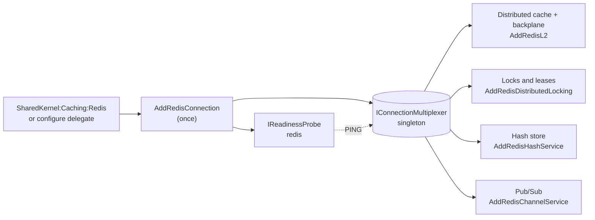

# SharedKernel.Caching.Redis.Core

[](https://dotnet.microsoft.com/)
[](https://github.com/Gresta-Vertex-Labs/platform-shared-kernel/blob/main/LICENSE)
[](https://github.com/StackExchange/StackExchange.Redis)


> **The one Redis connection every SharedKernel Redis package shares: configured once, validated at startup, with
> timeouts, fail-fast behaviour during outages, TLS and mutual TLS, connection logs and a readiness probe.**

The distributed cache, its backplane, distributed locks, the hash store and Pub/Sub all run over the connection this
package registers. You configure Redis in exactly one place, so TLS, timeouts and health apply to all of them, and no
other registration takes a connection string.

| You get | So that |
| --- | --- |
| `AddRedisConnection(configuration)` | The connection binds from `SharedKernel:Caching:Redis` and a bad value fails host start, not the first request |
| One shared `IConnectionMultiplexer` | Cache, backplane, locks, hashes and Pub/Sub use one set of sockets and one set of settings |
| `ConnectTimeout` and `CommandTimeout` | A slow or unreachable Redis costs a bounded time per call |
| `FailFastWhenDisconnected` (on by default) | During a failover, commands fail at once, the cache serves fail-safe values and callers see the outage immediately |
| `Ssl`, `ClientCertificates`, `CertificateValidation` | Traffic is encrypted, a private CA can be trusted, and servers that require mutual TLS accept the connection |
| A warning for non-loopback endpoints without TLS | Unencrypted production traffic is visible in the logs |
| The `redis` readiness probe | Readiness reports what every Redis package actually sees, without a second connection |

## Contents

- [Install](#install)
- [Quick start](#quick-start)
- [How it works](#how-it-works)
- [Recipes](#recipes)
- [Configuration](#configuration)
- [Reference](#reference)
- [Testing](#testing)
- [Pitfalls](#pitfalls)
- [Design decisions](#design-decisions)

## Install

Most services get this package through a capability package (`SharedKernel.Caching.Redis`,
`.Redis.DistributedLocking`, `.Redis.HashStore` or `.Redis.PubSub`), but they still call `AddRedisConnection`
themselves.

```xml
<PackageReference Include="SharedKernel.Caching.Redis.Core" />
```

The version comes from your central `SharedKernelVersion` property — every SharedKernel package ships at the same
version. See [Using the packages](https://github.com/Gresta-Vertex-Labs/platform-shared-kernel#using-the-packages).

| Requirement | Value |
| --- | --- |
| Target framework | `net10.0` |
| Tier | Adapter — reference it from your **Infrastructure** project |
| Depends on | `SharedKernel.Configuration`, `SharedKernel.Primitives`, `StackExchange.Redis`, `Microsoft.Extensions.Options.DataAnnotations` |
| Namespaces | `SharedKernel.Caching.Redis.Core` (options), `SharedKernel.Caching.Redis.Core.Extensions` (registration), `SharedKernel.Caching.Redis.Core.Health` (`RedisReadinessProbeNames`) |

## Quick start

```json
{
  "SharedKernel": {
    "Caching": {
      "Redis": {
        "ConnectionString": "redis.internal:6380",
        "Ssl": true
      }
    }
  }
}
```

```csharp
using SharedKernel.Caching.Redis.Core.Extensions;

builder.Services.AddRedisConnection(builder.Configuration);   // call once, before any other Redis registration

// Then add what the service needs; none of these take a connection string:
builder.Services.AddSharedKernelCaching(builder.Configuration).AddRedisL2();   // SharedKernel.Caching.Redis
builder.Services.AddRedisDistributedLocking();                                // SharedKernel.Caching.Redis.DistributedLocking
builder.Services.AddRedisHashService();                                       // SharedKernel.Caching.Redis.HashStore
builder.Services.AddRedisChannelService();                                    // SharedKernel.Caching.Redis.PubSub
```

Without configuration files, set the options in code:

```csharp
builder.Services.AddRedisConnection(o =>
{
    o.ConnectionString = builder.Configuration.GetConnectionString("redis")!;
    o.Ssl = true;
});
```

## How it works



_One registration builds one multiplexer. Every capability package resolves it from dependency injection; the probe
checks the same connection._

- **Registration order is enforced.** `AddRedisL2`, `AddRedisDistributedLocking`, `AddRedisHashService`,
  `AddTypedHashStore` and `AddRedisChannelService` throw `InvalidOperationException` at registration when
  `AddRedisConnection` has not been called. Calling `AddRedisConnection` twice also throws: there is exactly one
  connection.
- **Settings are read late.** Options are read when the multiplexer is first resolved, after configuration binding and
  every `configure` delegate, so values from `appsettings.json`, environment variables or a secret store all apply.
- **Connecting.** The first resolution opens the connection, waiting at most about `ConnectTimeout`. If Redis is not
  reachable, a warning (2103) is logged, the host keeps starting, and StackExchange.Redis keeps reconnecting in the
  background.
- **During an outage.** With `FailFastWhenDisconnected`, commands fail immediately with a `RedisConnectionException`.
  Each package decides what that means: the cache opens its circuit breaker and serves memory or fail-safe values, lock
  acquisition throws `DistributedLockUnavailableException`, and hash store and Pub/Sub calls throw.
- **After a reconnect.** StackExchange.Redis restores the connection and every Pub/Sub subscription on its own.
  Connection failures and restorations are logged (2101, 2100).
- **No secrets in output.** Validation messages, log events and probe descriptions never contain the connection string.

## Recipes

### 1. Keep the password out of source control

Leave the password out of `appsettings.json` and supply the whole string from the environment or a secret store:

```shell
SharedKernel__Caching__Redis__ConnectionString="redis.internal:6380,password=<from-secret-store>,ssl=true"
```

With Azure Key Vault as a configuration source, name the secret `SharedKernel--Caching--Redis--ConnectionString`.
Nothing changes in code: `AddRedisConnection(builder.Configuration)` reads the value from whichever source supplies it.

### 2. Turn on TLS

```json
{ "SharedKernel": { "Caching": { "Redis": { "ConnectionString": "redis.internal:6380", "Ssl": true } } } }
```

A server whose certificate chains to a root the machine already trusts, as with most managed Redis offerings, needs
nothing more.

When Redis runs on another host without TLS, the log shows warning 2102 once per process. Leave `Ssl` off only when a
service mesh or sidecar terminates TLS in front of Redis.

### 3. Mutual TLS with a private certificate authority

```csharp
X509Certificate2 clientCertificate = X509CertificateLoader.LoadPkcs12FromFile(certPath, certPassword);
X509Certificate2 privateRoot = X509CertificateLoader.LoadCertificateFromFile(caPath);

builder.Services.AddRedisConnection(builder.Configuration, o =>
{
    o.Ssl = true;
    o.ClientCertificates = [clientCertificate];
    o.CertificateValidation = (certificate, chain, errors) =>
    {
        if (errors == SslPolicyErrors.None)
            return true;

        using var customChain = new X509Chain();
        customChain.ChainPolicy.TrustMode = X509ChainTrustMode.CustomRootTrust;
        customChain.ChainPolicy.CustomTrustStore.Add(privateRoot);
        customChain.ChainPolicy.RevocationMode = X509RevocationMode.NoCheck;
        return (errors & ~SslPolicyErrors.RemoteCertificateChainErrors) == SslPolicyErrors.None
            && customChain.Build(certificate);
    };
});
```

- **Load certificates from a secret store**, never from files committed to the repository.
- **Validate, don't accept.** A callback that returns `true` unconditionally turns TLS into encryption without
  authentication: anyone on the network path can impersonate Redis.
- **A missing server certificate is always rejected**; the callback is not called for it.

### 4. Ride out short reconnects instead of failing fast

```json
{ "SharedKernel": { "Caching": { "Redis": { "FailFastWhenDisconnected": false, "CommandTimeout": "00:00:02" } } } }
```

Commands issued while disconnected then wait for the reconnect, up to `CommandTimeout`, instead of failing at once.
This suits background workers that prefer a short delay to an error. Request-serving services usually keep the
default: a waiting command holds the request, and the cache cannot serve its fail-safe value until the command gives
up.

### 5. Report readiness

`AddRedisConnection` registers an `IReadinessProbe` (`SharedKernel.Primitives.Health`) named `redis`. A host reports it,
together with every other registered probe, through ASP.NET Core health checks:

```csharp
builder.Services.AddHealthChecks().AddSharedKernelReadiness();   // SharedKernel.ServiceDefaults
```

To run it yourself, for example in a smoke test:

```csharp
using SharedKernel.Caching.Redis.Core.Health;
using SharedKernel.Primitives.Health;

ReadinessReport report = await services
    .GetRequiredReadinessProbe(RedisReadinessProbeNames.Connection)
    .ProbeAsync(ct);
// report.Status: Healthy (with report.Latency, the PING round trip) or Unhealthy
```

- **Unhealthy, never thrown.** A disconnected multiplexer, or a `PING` that fails with `RedisException` or
  `TimeoutException`, returns an `Unhealthy` report. Only cancellation throws.
- **Safe to expose.** The description never contains the connection string or an exception message.
- **Readiness, not liveness.** A Redis outage should take the pod out of the load balancer, not restart it.

## Configuration

Section `SharedKernel:Caching:Redis`, bound and validated when the host starts. The `configure` delegate of the
configuration overload runs after binding; use it for the two settings configuration cannot carry.

| Key | Type | Default | Meaning |
| --- | --- | --- | --- |
| `SharedKernel:Caching:Redis:ConnectionString` | `string` | — (required) | StackExchange.Redis connection string, for example `redis.internal:6379,password=…`; must parse and name at least one endpoint |
| `SharedKernel:Caching:Redis:ConnectTimeout` | `TimeSpan` | `00:00:05` | How long a connection attempt may take; 100 ms – 1 min |
| `SharedKernel:Caching:Redis:CommandTimeout` | `TimeSpan` | `00:00:05` | How long a command may wait for its reply, synchronous and asynchronous; 100 ms – 1 min |
| `SharedKernel:Caching:Redis:FailFastWhenDisconnected` | `bool` | `true` | Fail a command at once while no connection is available, instead of waiting up to `CommandTimeout` for a reconnect |
| `SharedKernel:Caching:Redis:Ssl` | `bool` | `false` | Use TLS. When off and an endpoint is not a loopback address, a warning is logged |
| `ClientCertificates` (code only) | `X509Certificate2Collection?` | `null` | Certificates presented in the TLS handshake, for servers that require mutual TLS |
| `CertificateValidation` (code only) | `Func<X509Certificate2, X509Chain?, SslPolicyErrors, bool>?` | `null` | Validates the server certificate; `null` uses the platform's validation |

**Precedence over the connection string.**

- `ConnectTimeout` and `CommandTimeout` always replace any timeouts in the string.
- TLS is on when `Ssl` is `true` or the string enables it; `Ssl = false` never turns off TLS the string enables.
- `abortConnect` is always `false`: a server that is unreachable at startup never fails the host.

**Startup fails** with `OptionsValidationException` when `ConnectionString` is missing, does not parse or names no
endpoint, or a timeout is outside its range. The message never echoes the connection string, which may contain a
password.

## Reference

### Registration

| Method | Purpose |
| --- | --- |
| `AddRedisConnection(IConfiguration, Action<RedisConnectionOptions>?)` | Register from `SharedKernel:Caching:Redis`; the delegate runs after binding |
| `AddRedisConnection(Action<RedisConnectionOptions>)` | Register from code; must at least set `ConnectionString` |
| `EnsureRedisConnectionRegistered(string caller)` | For packages built on the shared connection: throws when `AddRedisConnection` has not been called. Application code does not need it |

### Registered services

| Service | Lifetime | Notes |
| --- | --- | --- |
| `IConnectionMultiplexer` | Singleton | Created on first resolution; for SharedKernel packages, not application code |
| `IReadinessProbe` named `redis` (`RedisReadinessProbeNames.Connection`) | Singleton | `ProbeAsync(ct)` → `ReadinessReport` (`Healthy` with the `PING` latency, or `Unhealthy`) |
| `IOptions<RedisConnectionOptions>` | Singleton | Validated with data annotations and `RedisConnectionOptionsValidator`, on start |

### Exceptions

| Exception | When |
| --- | --- |
| `ArgumentNullException` | `services`, `configuration` or `configure` is `null` |
| `InvalidOperationException` | At registration: `AddRedisConnection` is called a second time, or another Redis registration runs before it |
| `OptionsValidationException` | At host start, or when the multiplexer is first resolved without a host: invalid options |
| `OperationCanceledException` | `ProbeAsync` was cancelled |

### Logging

Category `SharedKernel.Caching.Redis.Core.RedisConnection`.

| Event id | Level | Event |
| --- | --- | --- |
| 2100 | Information | Connection to `{EndPoint}` restored |
| 2101 | Warning | Connection to `{EndPoint}` failed (`{FailureType}`); reconnecting in the background |
| 2102 | Warning | Endpoint `{EndPoint}` is not a loopback address and TLS is off; logged once, for the first such endpoint |
| 2103 | Warning | Redis is not reachable at startup; the connection keeps retrying |

No event contains the connection string, a password or a key.

### Health

Registers the `redis` readiness probe (`RedisReadinessProbeNames.Connection`); `AddSharedKernelReadiness()` exposes it
on `/health/ready`. See [recipe 5](#5-report-readiness).

## Testing

Application code never sees the connection, so unit tests replace the Redis-backed services instead: reference
[`SharedKernel.Caching.Testing`](https://github.com/Gresta-Vertex-Labs/platform-shared-kernel/blob/main/16.Testing/SharedKernel.Caching.Testing/README.md)
(`AddFakeCachingServices()`, including `IDistributedLockService`) and
[`SharedKernel.Caching.Redis.Testing`](https://github.com/Gresta-Vertex-Labs/platform-shared-kernel/blob/main/16.Testing/SharedKernel.Caching.Redis.Testing/README.md)
(`AddFakeRedisServices()` for the hash store and Pub/Sub). Neither needs `AddRedisConnection`.

To test the real composition, start Redis with Testcontainers and point `ConnectionString` at it:

```csharp
services.AddRedisConnection(o => o.ConnectionString = redisContainer.GetConnectionString());
```

## Pitfalls

| Don't | Do | Why |
| --- | --- | --- |
| Put the password in `appsettings.json` | Supply the connection string from environment variables or a secret store | Configuration files end up in source control and images |
| Call `AddRedisConnection` in several modules "to be safe" | Call it once at the composition root | A second call throws; one connection means one set of settings |
| Register your own `IConnectionMultiplexer` or call `ConnectionMultiplexer.Connect` | Use `AddRedisConnection` | A second connection escapes the TLS, timeout and health settings |
| Inject `IConnectionMultiplexer` in application code | Inject `ICacheService`, `IDistributedLockService`, `IRedisHashService` or `IRedisChannelService` | Those contracts carry key formats, tenant isolation and outage semantics |
| Leave `Ssl` off for a remote Redis because it works | Turn TLS on, or terminate it in a mesh sidecar | Passwords and cached data cross the network in clear text |
| Return `true` from `CertificateValidation` unconditionally | Validate against your private root | Accepting every certificate lets anyone impersonate Redis |
| Raise `CommandTimeout` to the maximum | Keep it short and let the cache's fail-safe and circuit breaker absorb outages | A long timeout holds every request for that long while Redis is down |
| Use the readiness probe as a liveness probe | Use it for readiness only | Restarting pods does not fix Redis and makes the outage worse |

## Design decisions

**Why one shared connection?** When each registration takes its own connection string, extra connections escape the
TLS, mutual-TLS, timeout and health settings, and conflicting strings are silently ignored. One `AddRedisConnection`
removes the question of which settings win: there is only one set, and no SharedKernel package opens a Redis connection
of its own.

**Why does registering twice throw instead of "first caller wins"?** A silent first-wins rule let a library's defaults
override the service's real settings with no trace. An exception at registration points at the duplicate immediately.

**Why fail fast while disconnected by default?** StackExchange.Redis's default queues commands during a reconnect, so
every request waits up to the command timeout before anything can react. Failing fast lets the cache's circuit breaker
and fail-safe take over at once and makes an outage visible.

**Why no circuit breaker in this package?** The distributed cache and backplane use FusionCache's own circuit breakers
(`SharedKernel.Caching.Redis`), and fail-fast gives every other package an immediate error during an outage.

**Why a probe instead of a health state property?** A state tracked from connection events can claim "connected" before
any connection exists. A probe that sends `PING` over the shared connection reports what Redis actually answers.

**Why a warning, not an error, for plaintext non-loopback endpoints?** TLS is often terminated by a service mesh in front
of Redis, where the application legitimately connects without TLS.

---

Part of [Platform.SharedKernel](https://github.com/Gresta-Vertex-Labs/platform-shared-kernel) ·
[Caching domain](https://github.com/Gresta-Vertex-Labs/platform-shared-kernel/blob/main/02.Caching/README.md) ·
[MIT license](https://github.com/Gresta-Vertex-Labs/platform-shared-kernel/blob/main/LICENSE)
