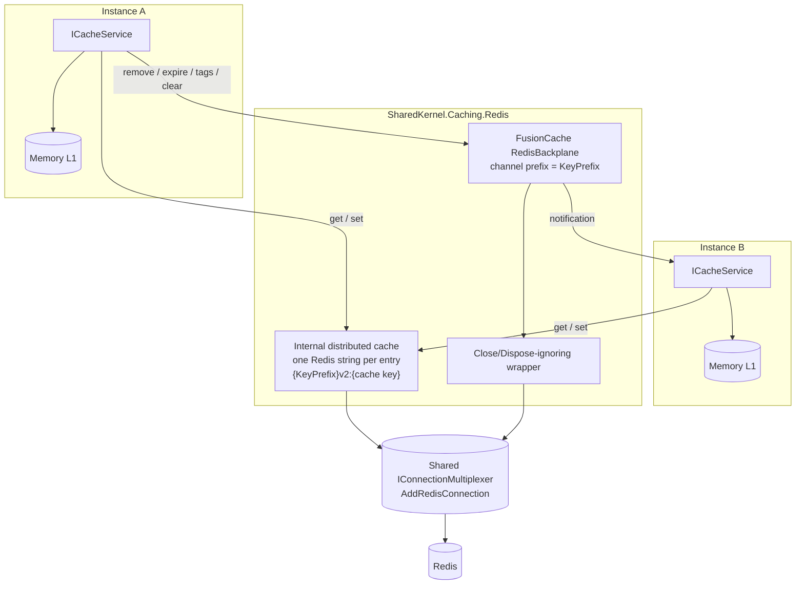

# SharedKernel.Caching.Redis

[](https://dotnet.microsoft.com/)
[](https://github.com/Gresta-Vertex-Labs/platform-shared-kernel/blob/main/LICENSE)
[](https://github.com/ZiggyCreatures/FusionCache)


> **Redis as the distributed layer and backplane of the SharedKernel cache: every instance of a service shares its
> entries, every removal reaches every instance, and an unreachable Redis never slows every request.**

[`SharedKernel.Caching.FusionCache`](https://github.com/Gresta-Vertex-Labs/platform-shared-kernel/blob/main/02.Caching/SharedKernel.Caching.FusionCache/README.md)
alone keeps a cache per process. Add this package and the same `ICacheService` calls read and write Redis too, over the
shared connection from
[`SharedKernel.Caching.Redis.Core`](https://github.com/Gresta-Vertex-Labs/platform-shared-kernel/blob/main/02.Caching/SharedKernel.Caching.Redis.Core/README.md).
Application code does not change.

| You get | So that |
| --- | --- |
| `AddRedisL2()` | Entries computed on one instance are hits on every other instance |
| The FusionCache Redis backplane | `RemoveAsync`, `ExpireAsync`, tag removal and `ClearAsync` reach every instance, with no invalidation messages of your own |
| The shared connection | TLS, mutual TLS and timeouts configured in `AddRedisConnection` apply to cache traffic |
| FusionCache circuit breakers | After a Redis failure the cache runs on memory for a short time instead of waiting on Redis in every request |
| `KeyPrefix` | Environments or deployments that share one Redis keep their entries and their backplane notifications apart |
| Configuration binding validated at startup | A bad value fails host start, not production traffic |

## Contents

- [Install](#install)
- [Quick start](#quick-start)
- [How it works](#how-it-works)
- [Recipes](#recipes)
- [Configuration](#configuration)
- [Reference](#reference)
- [Testing](#testing)
- [Pitfalls](#pitfalls)
- [Design decisions](#design-decisions)

## Install

```xml
<PackageReference Include="SharedKernel.Caching.Redis" />
```

The version comes from your central `SharedKernelVersion` property — every SharedKernel package ships at the same
version. See [Using the packages](https://github.com/Gresta-Vertex-Labs/platform-shared-kernel#using-the-packages).

| Requirement | Value |
| --- | --- |
| Target framework | `net10.0` |
| Tier | Adapter — reference it from your **Infrastructure** project |
| Depends on | `SharedKernel.Caching.Abstractions`, `SharedKernel.Caching.Redis.Core`, `SharedKernel.Configuration`, `ZiggyCreatures.FusionCache`, `ZiggyCreatures.FusionCache.Backplane.StackExchangeRedis` |
| Also needs | `SharedKernel.Caching.FusionCache` (`AddSharedKernelCaching` returns the builder this package extends) |
| Namespace | `SharedKernel.Caching.Redis.Extensions` |

## Quick start

```json
{
  "SharedKernel": {
    "Caching": {
      "ServiceName": "orders",
      "Redis": {
        "ConnectionString": "redis.internal:6380",
        "Ssl": true
      }
    }
  }
}
```

```csharp
using SharedKernel.Caching.FusionCache.Extensions;
using SharedKernel.Caching.Redis.Core.Extensions;
using SharedKernel.Caching.Redis.Extensions;

builder.Services.AddRedisConnection(builder.Configuration);        // the shared connection, once

builder.Services
    .AddSharedKernelCaching(builder.Configuration)                 // ICacheService
    .AddRedisL2(builder.Configuration);                            // distributed layer + backplane
```

`AddRedisL2()` without arguments uses the defaults below. Nothing else changes: code that injects `ICacheService` or
`ITenantCacheService` now shares entries across instances.

## How it works



_Both instances read and write entries through the internal distributed cache, and publish removals through the
backplane, over the one shared connection. Neither component can close that connection; instance B drops its memory copy
when the notification arrives._

- **Reads.** Memory first, then Redis, then the factory. A Redis hit is copied into memory.
- **Writes.** A computed or set value goes to memory and to Redis, serialized by the serializer
  `AddSharedKernelCaching` registered (with its JSON context, and Brotli or encryption when added).
- **Invalidation.** Removals, expirations, tag evictions and clears are written to Redis and announced on the backplane;
  every other instance evicts its memory entry and reads the new state on the next access. Tag removal writes a marker
  instead of deleting keys one by one, so it costs the same for one entry or a million.
- **Stored entries.** One Redis string per entry at `{KeyPrefix}v2:{cache key}`, for example `staging:v2:orders:invoice:42`
  (FusionCache adds the `v2:` segment),
  holding FusionCache's serialized entry. The key's TTL is the entry's absolute expiration; sliding expiration is not
  supported, and FusionCache never uses it.
- **Notifications.** With a non-empty `KeyPrefix`, the prefix is also FusionCache's backplane channel prefix, so a
  deployment receives only its own notifications.
- **Connection ownership.** The distributed cache is handed only to FusionCache and is not registered as
  `IDistributedCache`. The backplane receives the shared connection through a wrapper that ignores `Close` and
  `Dispose`. The DI container disposes the connection once, so locks, the hash store and Pub/Sub keep working until the
  host shuts down.
- **When Redis fails.** FusionCache logs the failure and the call continues from memory, the factory,
  or a fail-safe value. The circuit breaker then skips Redis for its duration, so the next requests do not each wait for
  a timeout. When it closes, the next operation tries Redis again.
- **`LocalOnly` entries.** A `CachePolicy.LocalOnly()` entry is never written to Redis and never announced on the
  backplane.

## Recipes

### 1. A typical service

```csharp
builder.Services.AddRedisConnection(builder.Configuration);

builder.Services
    .AddSharedKernelCaching(builder.Configuration)
    .AddTenantCacheService()
    .AddRedisL2()
    .AddRedisDistributedLocking();   // SharedKernel.Caching.Redis.DistributedLocking, same connection
```

### 2. Survive a Redis outage

Combine the connection's fail-fast behaviour, the cache's timeouts and fail-safe, and the circuit breakers:

```json
{
  "SharedKernel": {
    "Caching": {
      "ServiceName": "catalog",
      "DistributedCacheHardTimeout": "00:00:00.500",
      "Redis": {
        "ConnectionString": "redis.internal:6380",
        "Ssl": true,
        "FailFastWhenDisconnected": true,
        "L2": { "DistributedCacheCircuitBreakerDuration": "00:00:05" }
      }
    }
  }
}
```

- **Disconnected.** Commands fail immediately; the breaker opens for five seconds and requests are served from memory.
- **Connected but slow.** No distributed operation holds a request for more than 500 ms.
- **Stale values.** Policies with fail-safe keep serving the last good value when the factory also fails.

While the backplane breaker is open, other instances are not told about removals. They keep serving their memory copy
until it expires, so keep memory durations short (`CachePolicy.For(l1, l2)`) for data that must converge quickly.

### 3. Separate environments that share a Redis

```json
{ "SharedKernel": { "Caching": { "Redis": { "L2": { "KeyPrefix": "staging:" } } } } }
```

Entries are stored under keys starting with `staging:`, and backplane notifications travel on a `staging:`-prefixed channel, so a
production deployment on the same Redis neither reads staging entries nor receives staging notifications. Without a
prefix, every cache on the Redis shares FusionCache's default channel: harmless for different `ServiceName`s, whose keys
never match, but wasted traffic. Use a separate Redis instance where environments must not share credentials or
capacity.

### 4. Keep an entry on one instance

```csharp
private static readonly CachePolicy PerInstance = CachePolicy.For(TimeSpan.FromSeconds(30)).LocalOnly();

await cache.SetAsync(keys.BuildKey("rate-window", clientId), window, PerInstance, ct);
```

Use it for values that are only meaningful to one process, or too large to be worth a network round trip.

## Configuration

Section `SharedKernel:Caching:Redis:L2`, optional, validated when the host starts. The connection itself (connection string, TLS, timeouts) lives one
level up in `SharedKernel:Caching:Redis`; see
[`SharedKernel.Caching.Redis.Core`](https://github.com/Gresta-Vertex-Labs/platform-shared-kernel/blob/main/02.Caching/SharedKernel.Caching.Redis.Core/README.md#configuration).

```json
{
  "SharedKernel": {
    "Caching": {
      "Redis": {
        "ConnectionString": "redis.internal:6380",
        "L2": {
          "KeyPrefix": "staging:",
          "DistributedCacheCircuitBreakerDuration": "00:00:02",
          "BackplaneCircuitBreakerDuration": "00:00:02"
        }
      }
    }
  }
}
```

| Key | Type | Default | Meaning |
| --- | --- | --- | --- |
| `SharedKernel:Caching:Redis:L2:KeyPrefix` | `string` | `""` | Not `null`, at most 64 characters. Prefix of every key the distributed layer writes and, when not empty, of the backplane channel. Cache keys already start with the service name; use it only to separate environments or deployments that share one Redis |
| `SharedKernel:Caching:Redis:L2:DistributedCacheCircuitBreakerDuration` | `TimeSpan` | `00:00:02` | 0 – 10 min. How long the cache stops using Redis for entries after an operation on it fails. `00:00:00` turns the breaker off |
| `SharedKernel:Caching:Redis:L2:BackplaneCircuitBreakerDuration` | `TimeSpan` | `00:00:02` | 0 – 10 min. How long the cache stops using the backplane after a backplane operation fails; meanwhile removals and expirations are not sent to other instances. `00:00:00` turns the breaker off |

The service-wide timeouts for distributed operations (`DistributedCacheSoftTimeout`, `DistributedCacheHardTimeout`)
are `CachingOptions` in `SharedKernel.Caching.FusionCache`. Startup fails with `OptionsValidationException` when a
setting breaks its rule.

## Reference

### Registration

| Method | Purpose |
| --- | --- |
| `ICachingBuilder.AddRedisL2(Action<RedisL2Options>?)` | Add the distributed layer and backplane with options from code or defaults |
| `ICachingBuilder.AddRedisL2(IConfiguration, Action<RedisL2Options>?)` | Same, with options bound from `SharedKernel:Caching:Redis:L2`; the delegate runs after binding |

Call `AddRedisConnection` first. Call `AddRedisL2` once.

### Registered services

| Service | Lifetime | Notes |
| --- | --- | --- |
| FusionCache distributed layer | Singleton, inside `IFusionCache` | Internal Redis cache over the shared connection. **Not registered as `IDistributedCache`** |
| FusionCache backplane | Singleton, inside `IFusionCache` | `RedisBackplane` over the shared connection, through a wrapper that ignores `Close` and `Dispose` |
| `IOptions<RedisL2Options>` | Singleton | Validated on start |

The cache's `IFusionCacheSerializer`, options and `ICacheService` are those registered by `AddSharedKernelCaching`; this
package does not replace them. A service that needs `IDistributedCache` for something else (session state, output
caching) registers its own; it is independent of this cache.

### Exceptions at registration

| Exception | When |
| --- | --- |
| `ArgumentNullException` | `builder` or `configuration` is `null` |
| `InvalidOperationException` | `AddRedisConnection` has not been called, or `AddRedisL2` was already called |
| `OptionsValidationException` | At startup, when `RedisL2Options` is invalid |

### Logging and health

The package writes no log events of its own; FusionCache logs distributed-cache and backplane failures. Connection
health is the `redis` readiness probe of `AddRedisConnection`; cache health is the `cache` probe of
`AddSharedKernelCaching`.

## Testing

Unit tests do not need the distributed layer: reference
[`SharedKernel.Caching.Testing`](https://github.com/Gresta-Vertex-Labs/platform-shared-kernel/blob/main/16.Testing/SharedKernel.Caching.Testing/README.md)
and call `services.AddFakeCachingServices()` (plus `AddFakeTenantCacheService()`), which replaces `ICacheService`
without FusionCache or Redis.

To prove cross-instance behaviour, run two independent `ServiceProvider`s with the production registration against one
Testcontainers Redis, remove an entry on one, and poll the other until it misses — never a fixed delay.

## Pitfalls

| Don't | Do | Why |
| --- | --- | --- |
| Look for a connection string parameter on `AddRedisL2` | Configure the connection once with `AddRedisConnection` | Every Redis package shares that connection and its TLS and timeout settings |
| Inject `IFusionCache` in application code | Inject `ICacheService` or `ITenantCacheService` | Raw access bypasses key formats, tenant isolation, serialization and encryption |
| Expect `AddRedisL2` to register `IDistributedCache` | Register your own `IDistributedCache` if another component needs one | The cache's distributed layer is private to FusionCache |
| Hand the shared connection to `AddStackExchangeRedisCache` through `ConnectionMultiplexerFactory` | Give it its own connection string, or use `ICacheService` | Its `RedisCache` closes the connection it is given when disposed, which would break every Redis package |
| Read cache entries from Redis with `HGET` | Read through `ICacheService` | Entries are plain strings at `{KeyPrefix}v2:{cache key}`, holding FusionCache's internal envelope |
| Build your own Pub/Sub invalidation on top of the cache | Call `RemoveAsync`, `ExpireAsync` or `RemoveByTagAsync` | The backplane already reaches every instance |
| Set the circuit breaker durations to zero to "always use Redis" | Keep a few seconds | Without a breaker every request waits on a failing Redis |
| Use long memory durations for data that must converge across instances | Keep `L1Duration` short for such data | Notifications missed while the backplane breaker is open are not replayed |
| Use `KeyPrefix` to separate services | Give each service its own `ServiceName` | Keys already start with the service name |
| Point production and test at the same Redis without a prefix | Separate instances, or at least a `KeyPrefix` per environment | Without a prefix they share entries and notifications |

## Design decisions

**Why no connection string here?** A distributed cache and backplane built from their own connection string would open
extra connections that ignore TLS, mutual TLS, the connect timeout and health checks. Both reuse the multiplexer from
`AddRedisConnection`, and neither can close it.

**Why our own distributed cache instead of `Microsoft.Extensions.Caching.StackExchangeRedis`?** Its `RedisCache` assumes
it owns its connection: disposing it closed the multiplexer it reached through `IDatabase.Multiplexer`, which is the
shared connection every Redis package uses. The replacement is a small `IDistributedCache` that stores one Redis string
per entry, never closes the connection, and is handed only to FusionCache, so nothing else can resolve and dispose it.
FusionCache only needs absolute expiration, so sliding expiration and `Refresh` are not implemented.

**Why wrap the connection for the backplane?** FusionCache's `RedisBackplane` disposes the connection its factory
returns when it unsubscribes. The wrapper forwards every call except `Close` and `Dispose`, leaving the DI container as
the only owner.

**Why does `KeyPrefix` also prefix the backplane channel?** A prefix exists to separate deployments sharing a Redis.
Separating stored keys but not notifications would let each deployment evict the other's memory entries.

**Why FusionCache's circuit breakers instead of Polly?** FusionCache already wraps every distributed-cache and backplane
operation and knows how to continue from memory and fail-safe values while its breaker is open, so its breakers are
the ones that protect cache traffic. There is no Polly anywhere in the caching packages.

**Why keep the serializer `AddSharedKernelCaching` registered?** Replacing it with a default serializer would drop the
service's JSON context and any compression or encryption decoration. `AddRedisL2` wires FusionCache to the registered
serializer only.

**Why does a second `AddRedisL2` throw?** Registering the distributed cache and backplane twice stacks registrations and
leaves it unclear which options apply.

---

Part of [Platform.SharedKernel](https://github.com/Gresta-Vertex-Labs/platform-shared-kernel) ·
[Caching domain](https://github.com/Gresta-Vertex-Labs/platform-shared-kernel/blob/main/02.Caching/README.md) ·
[MIT license](https://github.com/Gresta-Vertex-Labs/platform-shared-kernel/blob/main/LICENSE)
