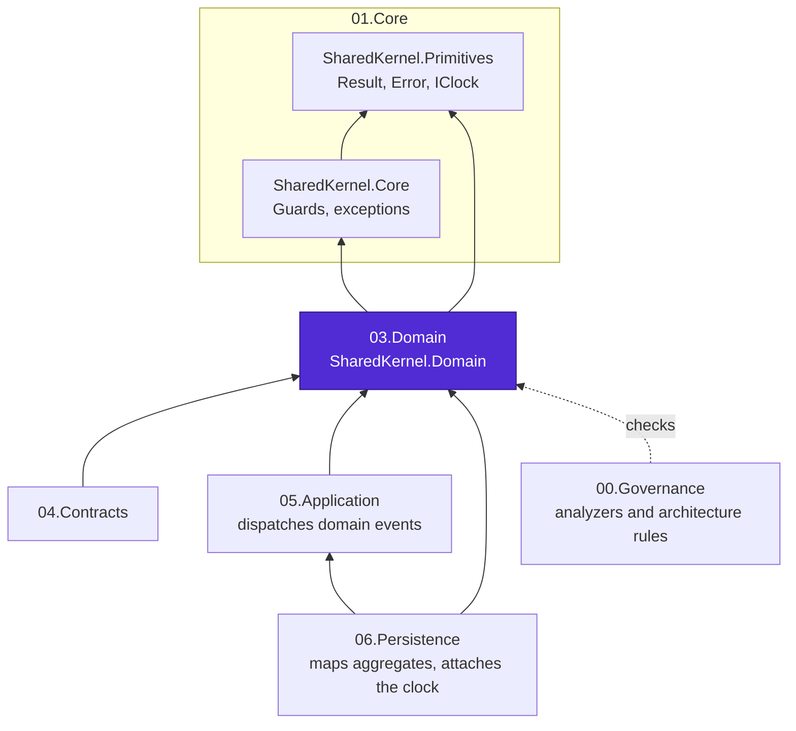
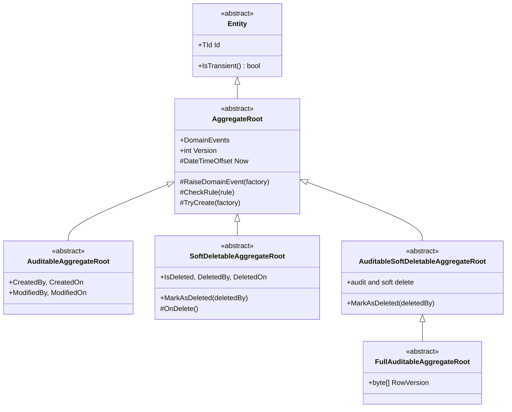
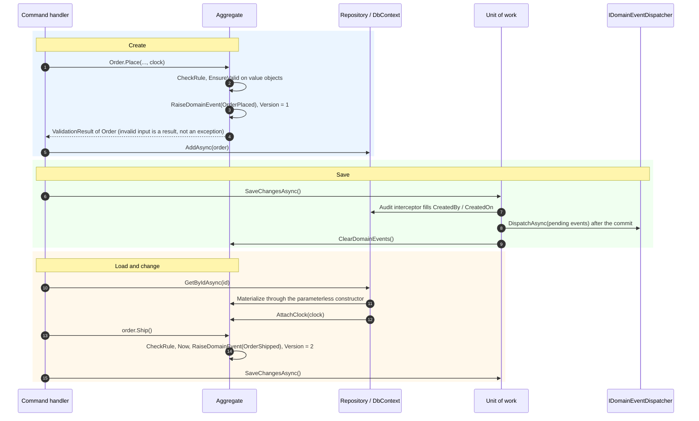

# 03.Domain


**The domain-driven design layer of Platform.SharedKernel.** Every aggregate, entity, value object, identifier
and domain event in a downstream service is built on the types in this folder.

> Looking for how to use the package? Read the
> [**SharedKernel.Domain README**](SharedKernel.Domain/README.md): quick start, decision guide, walkthrough,
> pitfalls and full reference.

## Contents

- [What lives here](#what-lives-here)
- [Where the layer sits](#where-the-layer-sits)
- [Type map](#type-map)
- [Aggregate lifecycle](#aggregate-lifecycle)
- [Design principles](#design-principles)
- [Design decisions](#design-decisions)
- [Guardrails](#guardrails)
- [Build and test](#build-and-test)
- [Contributing, for people and AI agents](#contributing-for-people-and-ai-agents)

## What lives here

| Path | What it is |
| --- | --- |
| [`SharedKernel.Domain/`](SharedKernel.Domain/) | The package: aggregates, entities, value objects, identifiers, events, rules, policies, specifications, `Money` |
| [`SharedKernel.Domain/SharedKernel.Domain.Tests/`](SharedKernel.Domain/SharedKernel.Domain.Tests/) | Unit tests, including the hardening suites that pin every fixed defect |
| [`SharedKernel.Domain.ConsumerVerify/`](SharedKernel.Domain.ConsumerVerify/) | Restores the **published** package from the feed and exercises its public API as a consumer would |
| [`CLAUDE.md`](CLAUDE.md) | The domain brain: implementation rules, decisions and traps for maintainers and AI agents |
| [`state-map.md`](state-map.md) | Phase and task history for this domain |

## Where the layer sits

Arrows point from a layer to what it depends on. The domain depends only on `01.Core`; nothing in it knows
about databases, messaging, HTTP or dependency injection.



## Type map

The base classes a service extends, and the interfaces persistence reads. Each aggregate base also has a
`Tenanted…` counterpart that adds `TenantId`.



| Base | Interfaces persistence reads |
| --- | --- |
| `Entity<TId>` | `IEntity<TId>` |
| `AggregateRoot<TId>` | `IAggregateRoot<TId>` (includes `IHasDomainEvents`), `IHasClock`, `IHasVersion` |
| `AuditableAggregateRoot<TId>` | `IHasAudit` |
| `SoftDeletableAggregateRoot<TId>` | `ISoftDeletable` |
| `AuditableSoftDeletableAggregateRoot<TId>` | `IHasAudit`, `ISoftDeletable` |
| `FullAuditableAggregateRoot<TId>` | `IHasConcurrency` |
| `Tenanted…AggregateRoot<TId>` (one per base above) | `IHasTenant` |

The rest of the model, by role:

| Role | Types |
| --- | --- |
| Values | `ValueObject`, `SingleValueObject<TValue>`, `StronglyTypedId<TValue>`, `Money`, `Currency` |
| Decisions | `IBusinessRule` (invariants), `IPolicy<T>` (decisions about a subject) |
| Queries | `Specification<T>`, `PagedSpecification<T>`, `KeysetSpecification<T, TKey>` |
| Events | `IDomainEvent`, `DomainEvent`, `DomainEvent<TPayload>`, `[DomainEventVersion]` |
| Ports | `IDomainEventDispatcher`, `IExchangeRateProvider` |

## Aggregate lifecycle

How an aggregate moves through a request in a service that uses the SharedKernel persistence and application
packages.



## Design principles

1. **Pure domain.** No I/O, no system clock, no logging, no dependency injection. Time comes from an injected
   `IClock`; external data comes through ports such as `IExchangeRateProvider`.
2. **Invalid input is a result.** Creation goes through `TryCreate` and returns `ValidationResult<T>`. Exceptions
   are for defects and for invariants broken by a method call.
3. **Report every error.** Value objects validate the fully built object and return all failures, not the first.
4. **Fail loudly, never silently.** A missing clock throws instead of recording year 0001; a second primary sort
   throws instead of silently winning.
5. **Explicit over implicit.** No implicit conversions from identifiers or value objects; validation is an
   explicit `EnsureValid()` call.
6. **Stable codes.** Every rule and error carries a code that clients and localization rely on.

## Design decisions

| Decision | Why | Rejected alternative |
| --- | --- | --- |
| Value objects call `EnsureValid()` explicitly | A base constructor would call the virtual `Validate()` before subclass members are assigned | Validation in the base constructor (runs too early), factory-only validation (easy to bypass) |
| Loaded aggregates get the clock attached through `IHasClock` | An ORM cannot pass a clock to a parameterless constructor | Passing time into every method (large API break), a null clock returning `MinValue` (silent wrong data) |
| `TryCreate` returns `ValidationResult<T>` | Keeps every validation error | `Result<T>`, which holds a single error |
| `IBusinessRule.Code` is required | A shared fallback code makes different violations indistinguishable to clients | An optional code with a generic default |
| `Version` is the event sequence number | Consumers need to detect missing or out-of-order events; concurrency already has `RowVersion` | Using it as a concurrency token |
| Explicit conversions on identifiers | An implicit conversion lets an `OrderId` flow into any `Guid` parameter | Implicit conversions for convenience |
| Equality through `GetEqualityComponents()` on classes | Full control over which members count and how constructors validate | C# records, whose generated equality and constructors cannot enforce validation |
| `Money` in its own `Monetary` namespace | A namespace named `Money` collided with the type | Keeping it under `ValueObjects.Money` |
| Reflection is allowed where it gives the best API | AOT and trimming are not constraints for this package | Restricting JSON identifiers to four hand-written value types |

## Guardrails

These checks run in every build and fail or warn before a mistake ships.

| Check | Kind | Catches |
| --- | --- | --- |
| `SK0001` | Analyzer | `DateTime.UtcNow` or `DateTimeOffset.UtcNow` instead of `IClock` |
| `SK0009` | Analyzer | A domain event without `[DomainEventVersion]` |
| `SK0010` | Analyzer | A specification with two primary sorts |
| `SK0037` | Analyzer | A value object constructor that never calls `EnsureValid()` |
| `SK0034` | Advisory analyzer | A raw `decimal` amount paired with a `string` currency code; suggests `Money` |
| `DomainReferencesOnlyCore` | Architecture rule | Any dependency outside `01.Core` |
| `DomainNeverReferencesPersistence`, `DomainNeverReferencesMessaging` | Architecture rules | Infrastructure leaking into the domain |
| `AggregateFactoriesMustCreateValidationResults` | Architecture rule | An `IAggregateFactory` without a `Create` returning `ValidationResult<TAggregate>` |
| Public API analyzers | Build | Any public API change not recorded in `PublicAPI.Unshipped.txt` |
| Documentation | Build | A public member without XML documentation |

Analyzer details: [`00.Governance/README.md`](../00.Governance/README.md).

## Build and test

```shell
dotnet build 03.Domain/SharedKernel.Domain/SharedKernel.Domain.csproj -c Release
dotnet test  03.Domain/SharedKernel.Domain/SharedKernel.Domain.Tests -c Release
```

`SharedKernel.Domain.ConsumerVerify` needs access to the package feed, because it restores the published
package instead of referencing the project.

## Contributing, for people and AI agents

Read [`CLAUDE.md`](CLAUDE.md) before changing code. It holds the rules that are not obvious from the source.
The short version:

- **Keep the domain pure.** No new dependency beyond `01.Core`; no I/O, clock reads, logging or DI types.
- **Record public API changes** in `PublicAPI.Unshipped.txt`; the build fails until you do.
- **Document every public member**, including the exceptions it throws. Summaries never mention ticket IDs or
  history.
- **Pin behaviour with tests.** A fixed defect gets a test that fails when the fix is reverted.
- **Update the package README** when behaviour a consumer can observe changes, and update `ConsumerVerify` when
  the public API changes.
- **Cross-layer effects** (persistence mapping, application dispatch, governance rules) are changed in their own
  layers, never by referencing them from here.
