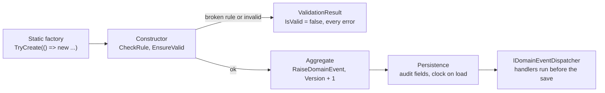

# SharedKernel.Domain

[](https://dotnet.microsoft.com/)
[](https://github.com/Gresta-Vertex-Labs/platform-shared-kernel/blob/main/LICENSE)


> **Domain-driven design building blocks for .NET services — aggregates, value objects, strongly-typed identifiers,
> business rules, specifications, policies and money — as pure domain code with no I/O, no system clock and no
> infrastructure dependency.**

| You get | So that |
| --- | --- |
| Aggregates that read time from an injected `IClock` | Events and timestamps are testable and never silently wrong |
| Value objects that report **every** validation error | A form shows all its problems at once |
| `TryCreate` returning `ValidationResult<T>` | Invalid input is a result, not an exception |
| Business rules with a stable error `Code` | Clients branch on codes; localization looks messages up by them |
| Strongly-typed identifiers | An `OrderId` can never be passed where a `CustomerId` is expected |
| Specifications with an inline builder and typed `ThenInclude` | Queries are named, reusable and composable; paging stays at the call site |
| `Money` with ISO 4217 minor units | Rounding, allocation and currency mismatches are handled once, correctly |
| Audit, soft-delete and `Tenanted…` base classes | Persistence fills audit fields, filters deleted rows and isolates tenants from the interfaces alone |

## Contents

- [Install](#install)
- [Quick start](#quick-start)
- [How it works](#how-it-works)
- [Recipes](#recipes)
- [Reference](#reference)
- [Testing](#testing)
- [Pitfalls](#pitfalls)
- [Design decisions](#design-decisions)

## Install

```xml
<PackageReference Include="SharedKernel.Domain" />
```

The version comes from your central `SharedKernelVersion` property — every SharedKernel package ships at the same
version. See [Using the packages](https://github.com/Gresta-Vertex-Labs/platform-shared-kernel#using-the-packages).

| Requirement | Value |
| --- | --- |
| Target framework | `net10.0` |
| Tier | Model — reference it from your **Domain** project |
| Depends on | `SharedKernel.Primitives`, `SharedKernel.Core`, `SharedKernel.Execution` (all Foundation tier); no third-party package |
| Registration | None: everything is a base class, an interface, an extension method or a static factory |
| Namespaces | `SharedKernel.Domain.*` — see [Which type do I need?](#which-type-do-i-need) |

## Quick start

```csharp
using SharedKernel.Domain.Aggregates;
using SharedKernel.Domain.BusinessRules;
using SharedKernel.Domain.Events;
using SharedKernel.Domain.Monetary;
using SharedKernel.Domain.StronglyTypedIds;
using SharedKernel.Primitives.Clocks;
using SharedKernel.Primitives.Results;

public sealed record InvoiceId(Guid Value) : StronglyTypedId<Guid>(Value);

[DomainEventVersion(1)]
public sealed record InvoiceIssued(InvoiceId InvoiceId, Money Amount) : DomainEvent;

public sealed class AmountMustBePositive(Money amount) : IBusinessRule
{
    public string Code => "invoice.amount_not_positive";
    public string Message => "An invoice amount must be greater than zero.";
    public bool IsBroken() => !amount.IsPositive;
}

public sealed class Invoice : AggregateRoot<InvoiceId>
{
    private Invoice(InvoiceId id, Money amount, IClock clock) : base(id, clock)
    {
        CheckRule(new AmountMustBePositive(amount));
        Amount = amount;
        RaiseDomainEvent(at => new InvoiceIssued(id, amount) { OccurredOn = at });
    }

    private Invoice() { } // ORM

    public Money Amount { get; private set; } = null!;

    public static ValidationResult<Invoice> Issue(InvoiceId id, Money amount, IClock clock) =>
        TryCreate(() => new Invoice(id, amount, clock));
}
```

```csharp
var result = Invoice.Issue(new InvoiceId(Guid.CreateVersion7()), Money.Zero(Currency.Usd), clock);

result.IsValid;          // false
result.Errors[0].Code;   // "invoice.amount_not_positive"
```

## How it works



_Construction either yields a valid aggregate or a `ValidationResult<T>` holding every error; state changes raise
events that infrastructure dispatches. The domain itself performs no I/O._

### Which type do I need?

| I need to model… | Use | Namespace |
| --- | --- | --- |
| A consistency boundary that is loaded and saved as a whole | `AggregateRoot<TId>` or one of its [audit, soft-delete and tenant bases](#base-classes) | `Aggregates` |
| A thing with identity that lives inside an aggregate | `Entity<TId>` or one of its bases | `Entities` |
| A concept defined only by its values (address, date range) | `ValueObject` | `ValueObjects` |
| A concept that wraps exactly one value (quantity, email) | `SingleValueObject<TValue>` | `ValueObjects` |
| An identifier that cannot be confused with another | `StronglyTypedId<TValue>` | `StronglyTypedIds` |
| Something that happened, for other parts of the system to react to | `DomainEvent` with `[DomainEventVersion(n)]` | `Events` |
| An invariant the aggregate must never break | `IBusinessRule` + `CheckRule` | `BusinessRules` |
| A decision about any subject, with an explanation ("is this customer eligible?") | `IPolicy<T>` | `Policies` |
| A reusable, named query | `Specification<T>` | `Specifications` |
| A one-off query built inline | `Spec.For<T>()` | `Specifications` |
| A query that projects to a DTO | `ProjectionSpecification<T, TResult>` or `Spec.For<T>()...Select(...)` | `Specifications` |
| Logic that spans several aggregates and belongs to none | `DomainService` | `DomainServices` |
| Creation that needs collaborators (uniqueness check, ID generator) | A class implementing `IAggregateFactory<TAggregate, TId>` | `Abstractions` |
| A monetary amount | `Money` and `Currency` | `Monetary` |

The difference between the three decision types is the question they answer:

| Type | Answers | Bound to |
| --- | --- | --- |
| `IBusinessRule` | "Is this invariant broken?" | The data it was constructed with |
| `IPolicy<T>` | "Does this subject comply, and if not, why?" | Any subject passed in |
| `Specification<T>` | "Which rows match?" | A query, translated by the persistence layer |

### Time and events

- An aggregate reads time only from its `IClock`, through the protected `Now` property. Analyzer `SK0001`
  reports any direct `DateTime.UtcNow` or `DateTimeOffset.UtcNow`.
- Raise events with the factory overload so the timestamp is the clock's time when the event is recorded:
  `RaiseDomainEvent(at => new OrderShipped(Id) { OccurredOn = at })`.
- Each raised event advances `Version` by one. `Version` is the aggregate's **event sequence number**, not a
  concurrency token; consumers can use it to detect a missing or out-of-order event.
- Every `DomainEvent` gets a version 7 UUID as its `Id`. It is time-ordered and survives serialization, so
  deduplication by `Id` still works after an outbox round trip.
- Every concrete event declares `[DomainEventVersion(n)]`; analyzer `SK0009` reports a missing one.
- An aggregate never clears its own events. Persistence hands them to `IDomainEventDispatcher` before each save,
  inside the same transaction, then clears them.

### Loading: attaching the clock

An ORM creates an aggregate through its parameterless constructor, which cannot receive a clock. Until
infrastructure calls `IHasClock.AttachClock`, anything that reads the time throws `InvalidOperationException`.

`SharedKernel.Persistence.EfCore` attaches the clock as each aggregate is materialized. If you load aggregates
another way, call `((IHasClock)aggregate).AttachClock(clock)` yourself. Failing loudly is deliberate: the
alternative is an event stamped `0001-01-01`.

### Entity equality

Two entities are equal when they have the same concrete type and the same non-default `Id`. An entity whose
`Id` is still the default is **transient**: it equals only itself, and its hash code changes once the database
assigns its key.

## Recipes

### 1. Model an order domain

Six steps build a small, complete ordering model, with `OrderId` and `CustomerId` declared like `InvoiceId` in
the [Quick start](#quick-start).

**1. Value objects**

A single-value wrapper only implements `Validate()`; the base class calls `EnsureValid()` for you.

```csharp
public sealed class Quantity : SingleValueObject<int>
{
    public Quantity(int value) : base(value) { }

    protected override IEnumerable<Error> Validate()
    {
        if (Value is < 1 or > 999)
            yield return Error.Validation("quantity.out_of_range", "Quantity must be between 1 and 999.");
    }
}
```

A multi-value object assigns every member, then calls `EnsureValid()` as the constructor's last statement.

```csharp
public sealed class ShippingAddress : ValueObject
{
    private ShippingAddress(string countryCode, string city, string street)
    {
        CountryCode = countryCode;
        City = city;
        Street = street;
        EnsureValid(); // always the last statement
    }

    public string CountryCode { get; }
    public string City { get; }
    public string Street { get; }

    public static ValidationResult<ShippingAddress> Create(string countryCode, string city, string street) =>
        TryCreate(() => new ShippingAddress(countryCode, city, street));

    protected override IEnumerable<object?> GetEqualityComponents()
    {
        yield return CountryCode;
        yield return City;
        yield return Street;
    }

    protected override IEnumerable<Error> Validate()
    {
        if (CountryCode is not { Length: 2 })
            yield return Error.Validation("address.country_code", "Use a two-letter ISO 3166 country code.");
        if (string.IsNullOrWhiteSpace(City))
            yield return Error.Validation("address.city_required", "City is required.");
        if (string.IsNullOrWhiteSpace(Street))
            yield return Error.Validation("address.street_required", "Street is required.");
    }
}
```

**2. A child entity**

```csharp
public sealed class OrderLine : Entity<Guid>
{
    public OrderLine(Guid id, string sku, Quantity quantity, Money unitPrice) : base(id)
    {
        Sku = sku;
        Quantity = quantity;
        UnitPrice = unitPrice;
    }

    private OrderLine() { } // ORM

    public string Sku { get; private set; } = string.Empty;
    public Quantity Quantity { get; private set; } = null!;
    public Money UnitPrice { get; private set; } = null!;
    public Money Total => UnitPrice * Quantity.Value;
}
```

**3. Rules and events**

```csharp
public sealed class OrderMustHaveLines(int lineCount) : IBusinessRule
{
    public string Code => "order.no_lines";
    public string Message => "An order needs at least one line.";
    public bool IsBroken() => lineCount == 0;
}

public sealed class OrderMustNotBeShipped(DateTimeOffset? shippedOn) : IBusinessRule
{
    public string Code => "order.already_shipped";
    public string Message => "The order has already been shipped.";
    public bool IsBroken() => shippedOn is not null;
}

[DomainEventVersion(1)]
public sealed record OrderPlaced(OrderId OrderId, Money Total) : DomainEvent;

[DomainEventVersion(1)]
public sealed record OrderShipped(OrderId OrderId) : DomainEvent;
```

**4. The aggregate**

`TenantId` is `SharedKernel.Execution.Tenancy.TenantId`, the platform's one tenant identifier.

```csharp
public sealed class Order : TenantedAuditableAggregateRoot<OrderId>
{
    private readonly List<OrderLine> _lines = [];

    private Order(
        OrderId id, TenantId tenantId, CustomerId customerId, ShippingAddress shipTo,
        IReadOnlyList<OrderLine> lines, IClock clock)
        : base(id, tenantId, clock)
    {
        CheckRule(new OrderMustHaveLines(lines.Count));

        CustomerId = customerId;
        ShipTo = shipTo;
        _lines.AddRange(lines);
        Total = lines.Select(line => line.Total).Sum();

        RaiseDomainEvent(at => new OrderPlaced(id, Total) { OccurredOn = at });
    }

    private Order() { } // ORM

    public CustomerId CustomerId { get; private set; } = null!;
    public ShippingAddress ShipTo { get; private set; } = null!;
    public Money Total { get; private set; } = null!;
    public DateTimeOffset? ShippedOn { get; private set; }
    public IReadOnlyList<OrderLine> Lines => _lines;

    public static ValidationResult<Order> Place(
        OrderId id, TenantId tenantId, CustomerId customerId, ShippingAddress shipTo,
        IReadOnlyList<OrderLine> lines, IClock clock) =>
        TryCreate(() => new Order(id, tenantId, customerId, shipTo, lines, clock));

    public void Ship()
    {
        CheckRule(new OrderMustNotBeShipped(ShippedOn));
        ShippedOn = Now;
        RaiseDomainEvent(at => new OrderShipped(Id) { OccurredOn = at });
    }
}
```

What the base class gives this aggregate: `TenantId` (a `SharedKernel.Execution.Tenancy.TenantId`, never `default`), `CreatedBy`/`CreatedOn`/`ModifiedBy`/`ModifiedOn`
filled by persistence, `DomainEvents`, and `Version`, the event sequence number.

**5. Queries**

```csharp
public sealed class OrdersOfCustomer : Specification<Order>
{
    public OrdersOfCustomer(TenantId tenantId, CustomerId customerId)
    {
        AddCriteria(order => order.TenantId == tenantId);
        AddCriteria(order => order.CustomerId == customerId); // combined with AND
        AddInclude(order => order.Lines); // continue a path with .ThenInclude(line => line.Nav)
        ApplyOrderByDescending(order => order.CreatedOn);
        ApplyThenByDescending(order => order.Id);
    }
}

// The same thing inline, for a one-off query:
var spec = Spec.For<Order>()
    .Where(order => order.CustomerId == customerId)
    .Include(order => order.Lines)
    .OrderByDescending(order => order.CreatedOn)
    .ThenByDescending(order => order.Id);
```

Paging is decided at the call site, not in the specification: the persistence repositories take a
`PageRequest` (offset pages) or a `CursorPageRequest` plus a key selector (keyset pages) from
`SharedKernel.Contracts`.

**6. Use it**

```csharp
var address = ShippingAddress.Create("Turkey", "", "Bagdat Cd. 1");
// address.IsValid == false, with two errors:
//   address.country_code: Use a two-letter ISO 3166 country code.
//   address.city_required: City is required.

var price = Money.Create(19.99m, Currency.Usd).Value;
var lines = new[] { new OrderLine(Guid.CreateVersion7(), "SKU-1", new Quantity(3), price) };

var placed = Order.Place(orderId, tenantId, customerId, shipTo, lines, clock);
var order = placed.Value;           // Total 59.97 USD, 1 event, Version 1

order.Ship();                       // 2 events, Version 2
order.Ship();                       // throws BusinessRuleViolationException, Rule.Code "order.already_shipped"

var empty = Order.Place(orderId, tenantId, customerId, shipTo, [], clock);
// empty.IsValid == false, Errors[0].Code "order.no_lines", Errors[0].Type ErrorType.BusinessRule
```

### 2. Persist and load with EF Core

With [`SharedKernel.Persistence.EfCore`](https://github.com/Gresta-Vertex-Labs/platform-shared-kernel/blob/main/06.Persistence/SharedKernel.Persistence.EfCore/README.md)
the infrastructure concerns of this model are handled for you:

| Concern | Handled by |
| --- | --- |
| Filling `CreatedBy`, `CreatedOn`, `ModifiedBy`, `ModifiedOn` | The audit interceptor, on save |
| Attaching the clock to an aggregate the database loads | The clock materialization interceptor, on load |
| Mapping `Version` so event numbering continues after a reload | The entity type configuration base |
| Dispatching `DomainEvents` before each save, in the same transaction, then clearing them | The context, through `IDomainEventDispatcher` |
| Tenant isolation | `TenantedDbContext`'s global query filter |

```csharp
var order = await orders.GetByIdAsync(orderId, ct); // clock attached as the row is materialized
order!.Ship();
await unitOfWork.SaveChangesAsync(ct);              // OrderShipped is dispatched before the write
```

### 3. Soft-delete and restore an aggregate

```csharp
public sealed class Customer : SoftDeletableAggregateRoot<CustomerId>
{
    public void Close(string closedBy) => MarkAsDeleted(closedBy);

    protected override void OnDelete() =>
        RaiseDomainEvent(at => new CustomerClosed(Id) { OccurredOn = at });
}
```

| Case | Behaviour |
| --- | --- |
| First delete | Records the actor and the clock's time, then calls `OnDelete` once |
| Already deleted | Changes nothing and raises no second event |
| Blank actor | Throws `DomainException` |
| Entity (no clock) | `MarkAsDeleted(deletedBy, deletedOn)` takes the owning aggregate's time, which must be UTC |
| Restore | `Restore()` clears `IsDeleted`, `DeletedOn` and `DeletedBy`, then calls `OnRestore`; load the aggregate with a specification that includes deleted rows first |

`OnDelete` and `OnRestore` do nothing unless overridden; override them only to raise an event.

## Reference

### Base classes

| Base class | Adds |
| --- | --- |
| `AggregateRoot<TId>` | Events, rules, `TryCreate`, clock, `Version` |
| `AuditableAggregateRoot<TId>` | `CreatedBy`, `CreatedOn`, `ModifiedBy`, `ModifiedOn` |
| `SoftDeletableAggregateRoot<TId>` | `IsDeleted`, `DeletedOn`, `DeletedBy`, `MarkAsDeleted`, `OnDelete` |
| `AuditableSoftDeletableAggregateRoot<TId>` | Audit and soft delete |
| `FullAuditableAggregateRoot<TId>` | Audit, soft delete and a `RowVersion` concurrency token |

- Each aggregate base has a `Tenanted…` counterpart that adds `TenantId` (`SharedKernel.Execution.Tenancy.TenantId`):
  fixed at construction; `default(TenantId)` throws `DomainException`, and `TenantId` itself rejects `Guid.Empty`.
  Supply it from the caller, typically `IRequestContext.TenantId`.
- Entities mirror the non-tenanted set: `Entity<TId>`, `AuditableEntity<TId>`, `SoftDeletableEntity<TId>`,
  `AuditableSoftDeletableEntity<TId>`, `FullAuditableEntity<TId>`.
- Persistence reads only the interfaces (`IHasAudit`, `ISoftDeletable`, `IHasTenant`, `IHasConcurrency`). For a
  combination not listed, extend `AggregateRoot<TId>` and implement the interfaces.

### Business rules

A rule has a stable `Code`, a human-readable `Message` and `IsBroken()`. `CheckRule(rule)` throws
`BusinessRuleViolationException` when the rule is broken. Its error has type `ErrorType.BusinessRule`
(HTTP 422 at the API boundary) and the rule's own code.

| Composition | Broken when | Reports |
| --- | --- | --- |
| `a.And(b)` | Either operand is broken | The first broken operand's code; the broken operands' messages, separated by semicolons |
| `a.Or(b)` | Both operands are broken | `a`'s code; both messages |
| `a.Not(code, message)` | `a` holds | The code and message you supply |

`CheckRule` is available on `AggregateRoot<TId>`, `ValueObject` and `DomainService`.

### TryCreate

Aggregates and value objects expose a protected `TryCreate(() => new …)` that returns `ValidationResult<T>`.

| The constructor throws | Result |
| --- | --- |
| Nothing | Valid, holding the object |
| `ValidationException` (from `EnsureValid`) | Invalid, holding **every** error |
| `BusinessRuleViolationException` | Invalid, holding the rule's error |
| Any other `DomainException`, including every `Guard.Throw` violation | Invalid, holding its error |
| Anything else | Rethrown: it is a defect, not invalid input |

Construction stops at the first throw, so a result holds one error unless a value object reports several.
Reading `Value` on an invalid result throws `InvalidOperationException`; check `IsValid` first.

### Value objects

| Rule | Detail |
| --- | --- |
| Validation | Assign every member, then call `EnsureValid()` last. It runs `Validate()` and throws `ValidationException` with all errors. |
| The base constructor | Never validates: a virtual call from it would run before your members are assigned |
| Forgetting `EnsureValid()` | The object is never validated. Analyzer `SK0037` reports it at build time. |
| `SingleValueObject<TValue>` | Calls `EnsureValid()` itself; a subclass only implements `Validate()`. A null value throws `DomainException` (`validation.required`). |
| Equality | Same runtime type and equal components. A sequence component (other than `string`) compares element by element. |
| Conversion | Explicit only: `(int)quantity` or `quantity.Value` |

### Strongly-typed identifiers

```csharp
public sealed record OrderId(Guid Value) : StronglyTypedId<Guid>(Value);

Guid raw = orderId.Value;   // or (Guid)orderId
```

There is no implicit conversion, so an identifier never flows silently into a parameter that expects another
concept's `Guid`. Register the converter factory once and every identifier serializes as its bare value,
including as a dictionary key:

```csharp
var options = new JsonSerializerOptions();
options.Converters.Add(new StronglyTypedIdJsonConverterFactory());

JsonSerializer.Serialize(new { order.Id }, options); // {"Id":"01a0a4d5-b229-7b13-a618-37a291ff0bcf"}
```

The factory supports any `TValue` that System.Text.Json can serialize.

### Specifications

| Member | Behaviour |
| --- | --- |
| `AddCriteria` | Each call is combined with AND |
| `ApplyOrderBy` / `ApplyOrderByDescending` | One primary sort; a second call throws. Add keys with `ApplyThenBy`, which throws without a primary sort. |
| `ApplyPaging(skip, take)`, `ApplyTake(take)` | Fixed windows only ("the ten most recent"); page-by-page access takes a page request at the repository |
| `AddInclude(...).ThenInclude(...)`, `AddStringInclude` | Eager loading; `ThenInclude` is type-checked through collections |
| `ApplySplitQuery`, `ApplyDistinct` | Query-shape flags for the evaluator; tracking is decided by the repository |
| `IncludeSoftDeleted()` | Returns soft-deleted rows too; tenant isolation stays |
| `IsSatisfiedBy(entity)` | Evaluates the criteria in memory |
| `Specification<T>.Create(criteria)` | An ad hoc specification without a subclass |
| `a.And(b)`, `a.Or(b)`, `a.Not()` | Combine criteria, includes and flags; carry the ordering of the one operand that has it; **throw** when both operands are ordered or either pages. `Not` of a specification without criteria matches nothing. |
| `AllSpecification<T>`, `EmptySpecification<T>` | Match everything or nothing |

### Policies

```csharp
if (!policy.IsCompliant(order))
    return Error.BusinessRule("shipping.not_free", policy.Explain(order));

// Or enforce it as an invariant inside an aggregate:
CheckRule(policy.ToRule(order, "shipping.not_free"));
```

- `Explain` returns an empty string when the subject complies.
- `a.And(b)` and `a.Or(b)` combine the explanations, separated by semicolons; `a.Not(explanation)` requires
  its own explanation.
- `IPolicy<in T>` is contravariant: a policy written for a base type can be used where a policy for a derived
  type is expected.

### Money

```csharp
var price = Money.Create(19.99m, Currency.Usd).Value;

var total = price * 3;                              // 59.97 USD
var split = total.Allocate(2);                      // 29.98 USD, 29.99 USD — adds up exactly
var net = total.Divide(1.2m, RoundingPolicy.Floor); // 49.97 USD
var sum = new[] { price, total }.Sum();             // 79.96 USD

total.ToString();                                           // "59.97 USD", invariant culture
total.ToString("N2", CultureInfo.GetCultureInfo("tr-TR"));  // "59,97 USD"
```

| Topic | Behaviour |
| --- | --- |
| Rounding | Always to the currency's minor unit. `RoundingPolicy`: `BankersRounding` (default), `AwayFromZero`, `ToZero`, `Ceiling`, `Floor`. |
| Arithmetic | `+`, `-`, `*`, `/`, `Negate`, `Abs`, `Multiply` and `Divide` with a rounding policy |
| Predicates | `IsZero`, `IsPositive`, `IsNegative`; comparison operators; `Min`, `Max` |
| Currency mismatch | `+`, `-`, comparisons, `Min`, `Max` and `Sum` throw `BusinessRuleViolationException` with code `money.currency_mismatch` |
| Allocation | `Allocate(parts)` or `Allocate(ratios)`, largest remainder: parts differ by at most one minor unit and always add up to the original |
| Sum | `amounts.Sum()` throws on an empty sequence; `amounts.Sum(currency)` returns zero in that currency |
| Conversion | `await money.ConvertAsync(target, rateProvider)` through your `IExchangeRateProvider`; returns `Result<Money>` |
| Currencies | `Currency.Create("try")` accepts any casing and returns `ValidationResult<Currency>`. `Currency.Usd`, `.Eur`, `.Gbp`, `.Jpy`, `.Try` are ready-made. `CurrencyCatalog` holds every active ISO 4217 currency as of `CurrencyCatalog.RegistryAsOf`. |

### Error codes

| Code | Raised by |
| --- | --- |
| The rule's own `Code` | `BusinessRuleViolationException` from `CheckRule` |
| `money.currency_mismatch` | Money operations across currencies |
| `currency.code.invalid_format` | `Currency.Create` with input that is not three letters |
| `currency.code.unknown` | `Currency.Create` with a code outside the catalog |
| `validation.required` | A null strongly-typed identifier or single value, and guard violations |
| `not_found.default` | `DomainNotFoundException` |

### Logging and analyzers

The package is logging-free by design: `ILogger` is never injected into a domain type. Build-time guardrails come from
[`SharedKernel.Analyzers`](https://github.com/Gresta-Vertex-Labs/platform-shared-kernel/blob/main/00.Governance/SharedKernel.Analyzers/README.md):
`SK0001` (direct clock access), `SK0009` (event without a version), `SK0010` (two primary sorts in a specification),
`SK0034` (a raw amount and currency pair instead of `Money`), `SK0037` (value object without `EnsureValid()`).

## Testing

Reference [`SharedKernel.Testing`](https://github.com/Gresta-Vertex-Labs/platform-shared-kernel/blob/main/16.Testing/SharedKernel.Testing/README.md)
from your test project. Domain code needs no fakes beyond a clock:

| Helper | Namespace | Use |
| --- | --- | --- |
| `FakeClock` | `SharedKernel.Testing.Clocks` | Pass to aggregate constructors; `Advance(delta)`, `Set(value)` |
| `BusinessRuleAssertions` | `SharedKernel.Testing.Domain` | `rule.ShouldBeBroken()`, `rule.ShouldNotBeBroken()` |
| `DomainEventAssertions` | `SharedKernel.Testing.Domain` | `events.ContainsEventOfType<OrderShipped>()`, `HasNoEvents()`, `HasRaisedExactlyNEvents(n)` |
| `DomainVersionAssertions` | `SharedKernel.Testing.Domain` | `ShouldBeVersioned<TEvent>()`, `ShouldHaveVersion<TEvent>(n)` |
| `SpecificationAssert`, `SpecificationTestBuilder<T>` | `SharedKernel.Testing.Domain` | `SpecificationAssert.Satisfies(spec, entity)` / `DoesNotSatisfy` — in memory, no database |
| `MoneyFaker`, `FakeExchangeRateProvider` | `SharedKernel.Testing.Domain` | Random valid `Money`; seeded exchange rates (`SeedRate`, `SimulateFailure`) |

```csharp
var clock = new FakeClock();
var order = Order.Place(orderId, tenantId, customerId, shipTo, lines, clock).Value;

order.Ship();

order.DomainEvents.ContainsEventOfType<OrderShipped>();
new OrderMustNotBeShipped(order.ShippedOn).ShouldBeBroken();
```

## Pitfalls

| Don't | Do | Why |
| --- | --- | --- |
| Load aggregates with your own mapper and call a method straight away | Call `IHasClock.AttachClock` as each one is created | Without a clock, reading the time throws `InvalidOperationException` |
| Write a `ValueObject` constructor without `EnsureValid()` | End every constructor with `EnsureValid()` | Nothing else validates it; `SK0037` warns |
| Keep an unsaved entity in a `HashSet` or dictionary across the save | Add it after the save, or key by something else | Its hash code changes when the database assigns its key |
| Assume `IncludeSoftDeleted()` widens the tenant too | Enter a cross-tenant scope when a query must see other tenants | It lifts only the soft-delete filter; the persistence tenant filter (and row-level security) still apply |
| Put ordering on more than one operand of `And`/`Or`/`Not`, or paging on any | Order at most one operand; page at the repository call site | Composites carry the one ordering and throw `InvalidOperationException` for two orderings or any paging |
| Remove an aggregate through the repository when others must react | Call a domain method such as `Close()` that raises an event | Repository deletion soft-deletes without a domain event |
| Rely on events being handled without a dispatcher | Register one — `AddSharedKernelApplication(...)` from `SharedKernel.Application.Pipeline` does | Persistence discards undispatched events at the save, with a warning |
| Compare or add `Money` of possibly different currencies | Check `Currency` first, or convert with `ConvertAsync` | Mismatches throw `BusinessRuleViolationException` |
| Call `.Sum()` on a possibly empty list of `Money` | Call `.Sum(currency)` | An empty sequence has no currency to return |
| Read `result.Value` without checking | Check `result.IsValid` first | `Value` on an invalid result throws |
| Read `DateTime.UtcNow` in domain code | Use `Now` or the event factory's timestamp | Time must come from the clock; `SK0001` reports it |
| Clear events inside the aggregate | Leave it to infrastructure | Clearing before dispatch loses them |

## Design decisions

**Why must a value object call `EnsureValid()` itself?** Validation in the base constructor would run before the
subclass assigns its members, and records' generated constructors and `with` bypass validation. An explicit last call is
the only reliable point; `SK0037` catches an omission.

**Why does `Now` throw when no clock is attached?** A null or sentinel clock stamps `0001-01-01` on loaded aggregates
without anyone noticing. Failing loudly turns a missing attach into a defect found by the first test.

**Why does `TryCreate` return `ValidationResult<T>`, not `Result<T>`?** It keeps every error a value object reports;
`Result<T>` holds one.

**Why is `IBusinessRule.Code` required?** Clients branch on codes and localization looks messages up by them; a default
code would make every rule look the same.

**Why explicit conversions only on identifiers and single value objects?** An implicit operator lets an `OrderId` flow
into any `Guid` parameter, which is the mistake strongly-typed identifiers exist to prevent.

**Why is `Version` an event sequence, not a concurrency token?** Optimistic concurrency is PostgreSQL `xmin`, exposed as
`EntityVersion` by the persistence packages. `Version` counts events so consumers can detect a gap.

**Why are paging and tracking not on specifications?** One place, the repository call site, validates page input, and
the same specification serves tracked and untracked reads.

**What is deliberately not included?**

- **No event handlers or dispatcher implementation.** Handlers (`IDomainEventHandler<T>`, in `SharedKernel.Application`)
  and the dispatcher (registered by `AddSharedKernelApplication(...)` in `SharedKernel.Application.Pipeline`) live in
  the application packages; this package defines `IDomainEventDispatcher` only.
- **No persistence.** Repositories, EF Core mappings and the clock-attaching interceptor live in the persistence
  packages; the domain never references them.
- **No exchange rates.** `IExchangeRateProvider` is a port; your service supplies the rate source.
- **No trimming or NativeAOT promise.** The strongly-typed id JSON factory and the event-version lookup use reflection.

---

Part of [Platform.SharedKernel](https://github.com/Gresta-Vertex-Labs/platform-shared-kernel) ·
[Domain building blocks](https://github.com/Gresta-Vertex-Labs/platform-shared-kernel/blob/main/03.Domain/README.md) ·
[MIT license](https://github.com/Gresta-Vertex-Labs/platform-shared-kernel/blob/main/LICENSE)
