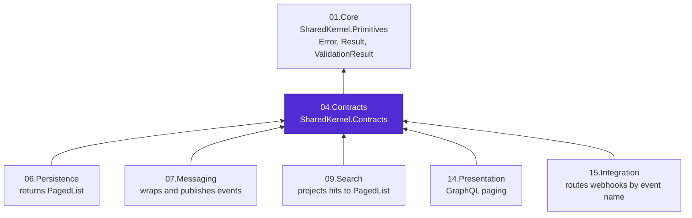
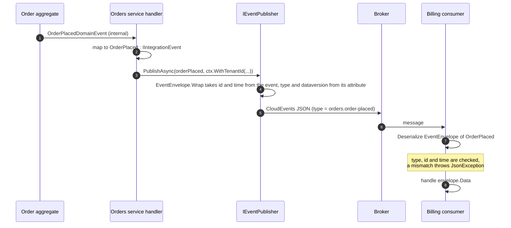
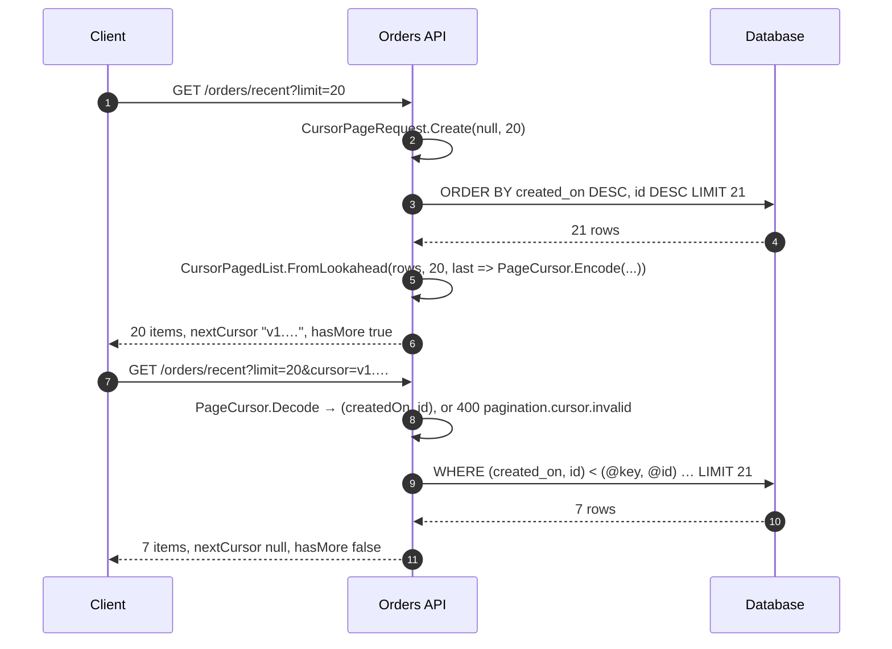

# 04.Contracts


**The wire contracts of Platform.SharedKernel.** Everything one service sends another, and every page an
API returns, has its shape defined here.

> Looking for how to use the package? Read the
> [**SharedKernel.Contracts README**](SharedKernel.Contracts/README.md): quick start, decision guide, walkthrough,
> pitfalls and full reference.

## Contents

- [What lives here](#what-lives-here)
- [Where the package sits](#where-the-package-sits)
- [How an integration event travels](#how-an-integration-event-travels)
- [How cursor paging works](#how-cursor-paging-works)
- [Design principles](#design-principles)
- [Design decisions](#design-decisions)
- [Guardrails](#guardrails)
- [Build and test](#build-and-test)
- [Contributing, for people and AI agents](#contributing-for-people-and-ai-agents)

## What lives here

| Path | What it is |
| --- | --- |
| [`SharedKernel.Contracts/`](SharedKernel.Contracts/) | The package: integration events, the CloudEvents envelope, paged results, page requests, the cursor codec |
| [`SharedKernel.Contracts/SharedKernel.Contracts.Tests/`](SharedKernel.Contracts/SharedKernel.Contracts.Tests/) | Unit tests for every construction and deserialization rule |
| [`SharedKernel.Contracts.ConsumerVerify/`](SharedKernel.Contracts.ConsumerVerify/) | Restores the **packed** package from a feed and exercises its public API as a consumer would |
| [`CLAUDE.md`](CLAUDE.md) | The domain brain: implementation rules, decisions and traps for maintainers and AI agents |
| [`state-map.md`](state-map.md) | Phase and task history for this domain |

## Where the package sits

Arrows point from a package to what it depends on. `SharedKernel.Contracts` is a **Model**-tier package that
depends only on `SharedKernel.Primitives`, so a service can share its contracts without sharing its domain model.
The build enforces the tier; a separate architecture rule keeps it from referencing `SharedKernel.Domain`, the
other Model-tier package.



## How an integration event travels

The domain event stays inside the producing service. What crosses the wire is a deliberate projection of it,
named by an attribute and wrapped in a CloudEvents envelope.



## How cursor paging works

The client never sees the sort key or id directly; it holds an opaque cursor and sends it back.



## Design principles

| Principle | In practice |
| --- | --- |
| A contract is a public API | Every public member is tracked and documented; a breaking change is a new event version, not an edit |
| The wire shape is fixed | JSON names come from attributes and constants, never from the serializer's naming policy |
| No invalid instance can exist | Factories and JSON constructors enforce the same rules; there is no public constructor or setter to bypass them |
| Bad client input is a result | Page and cursor requests return `ValidationResult<T>` with every error; cursor decoding returns `Result<T>` |
| Contracts carry no domain | No reference to `03.Domain`; events carry primitives, not aggregates or identifiers |
| One format per concern | Events are CloudEvents; HTTP errors are RFC 9457 ProblemDetails; there is no second response envelope |

## Design decisions

| Decision | Chosen | Instead of |
| --- | --- | --- |
| What goes on the wire | Integration events | Domain events, which leak internals and couple consumers to the producer |
| Event identity | Required `[IntegrationEvent("name", Version = n)]` | The class name, which changes on a rename |
| Event format | CloudEvents 1.0 structured JSON | A platform-specific envelope no external tool understands |
| Success and error responses | Raw body plus ProblemDetails | An `{ isSuccess, value, error }` envelope no server actually produced |
| Serialization | Reflection-based `System.Text.Json` | A source-generated context that could not cover consumers' generic types |
| Totals | `long` | `int`, which large tables and search engines exceed |
| Cursors | Unsigned, versioned, strictly decoded | Signed cursors that need a key in every service |

## Guardrails

| Guard | What it catches |
| --- | --- |
| `PublicApiAnalyzers` (RS0016 and siblings as errors) | Any unrecorded change to the public API |
| `CS1591` as an error | An undocumented public member |
| Internal `[JsonConstructor]`s that validate | Invalid envelopes, pages and requests arriving over the wire |
| `IntegrationEventDescriptor` | Missing or malformed event names, versions below 1, two types claiming one name and version |
| `00.Governance` `ContractsPurityRules` | Domain or infrastructure types leaking into a contracts assembly |
| Tier check (`SKTIER001`, `SKTIER003`) and `ContractsNeverReferencesDomain` | A reference to anything but Foundation packages, a third-party package, or `SharedKernel.Domain` |

## Build and test

```shell
dotnet build 04.Contracts/SharedKernel.Contracts/SharedKernel.Contracts.csproj -c Release
dotnet test  04.Contracts/SharedKernel.Contracts/SharedKernel.Contracts.Tests -c Release
dotnet test  04.Contracts/SharedKernel.Contracts.ConsumerVerify -c Release -p:SharedKernelPackageVersion=<version>   # needs the package on a feed
```

The test project references only the package, so it builds and runs in seconds.

## Contributing, for people and AI agents

1. Read [`CLAUDE.md`](CLAUDE.md) first: its rules tables say what may and may not change, and its
   cross-domain couplings table lists what breaks elsewhere.
2. Record every public API change in `SharedKernel.Contracts/PublicAPI.Unshipped.txt`.
3. Add a test for the factory path **and** the JSON path of every new rule.
4. Never add business logic, a `03.Domain` reference, or a serializer context.
5. Keep outputs in the package README real: run the snippet and paste what it prints.
