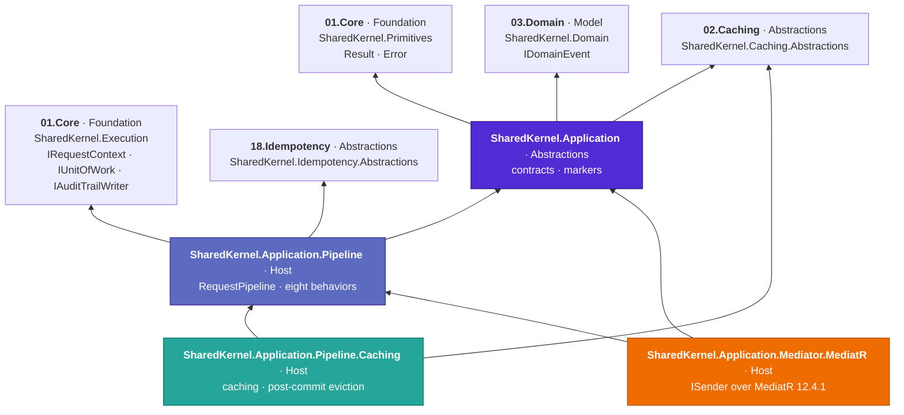
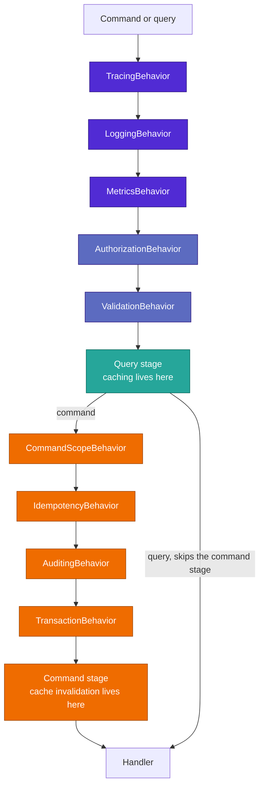

# 05.Application

[](https://dotnet.microsoft.com/)
[](https://github.com/Gresta-Vertex-Labs/platform-shared-kernel/blob/main/LICENSE)


> **The CQRS layer of Platform.SharedKernel: a kernel-owned command and query vocabulary with no mediator library
> in it, a native domain-event dispatcher, and the cross-cutting concerns every handler would otherwise
> re-implement — tracing, logging, metrics, authorization, validation, idempotency, transactions, auditing and
> caching — composed in one fixed order you never have to get right yourself.**

Handlers here do one thing: take a command or query and return a `Result`. Everything around them is a pipeline
behavior you opt into, and every behavior that touches infrastructure does so through a contract from a
Foundation or Abstractions-tier package (`SharedKernel.Execution`, `SharedKernel.Idempotency.Abstractions`,
`SharedKernel.Caching.Abstractions`) — never a reference to the real thing. MediatR is only the transport behind
`ISender`, in one adapter package; replacing it changes no command, query, handler or behavior.

```csharp
// The whole surface of a guarded, validated, idempotent, cached, audited operation.
[RequirePermission("orders.approve")]
public sealed record ApproveOrderCommand(Guid OrderId, string IdempotencyKey)
    : ICommand, IIdempotentRequest, IInvalidatesCache
{
    public IReadOnlyCollection<CacheKeyRef> CacheKeysToInvalidate => [CacheKeyRef.For<GetOrderQuery>(OrderId.ToString())];
}

internal sealed class ApproveOrderHandler(IOrderRepository orders) : ICommandHandler<ApproveOrderCommand>
{
    public async Task<Result> Handle(ApproveOrderCommand command, CancellationToken ct)
    {
        // No permission check. No validation. No try/catch. No SaveChanges. No cache call.
        var order = await orders.FindAsync(command.OrderId, ct);
        return order is null
            ? Error.NotFound("order.not_found", $"Order {command.OrderId} does not exist.")
            : order.Approve();
    }
}
```

```text
unauthenticated caller        -> 401  Error.Unauthorized        handler never runs
missing orders.approve        -> 403  Error.Forbidden           handler never runs
validation failure            -> 400  Error.Validation(errors)  handler never runs
same idempotency key, retried -> the first response, replayed   handler never runs
handler returns a failure     -> no commit, no eviction, key released for a later retry
handler succeeds              -> commit, then audit, then cache eviction, in that order
```

## Contents

- [The packages](#the-packages)
- [Which package do I need?](#which-package-do-i-need)
- [How the packages fit together](#how-the-packages-fit-together)
- [Install](#install)
- [The pipeline order](#the-pipeline-order)
- [The command-scope and commit flow](#the-command-scope-and-commit-flow)
- [Contracts the behaviors consume](#contracts-the-behaviors-consume)
- [A tour in code](#a-tour-in-code)
- [Conventions every package follows](#conventions-every-package-follows)
- [Status](#status)
- [Analyzers that guard this layer](#analyzers-that-guard-this-layer)
- [Deliberately not here](#deliberately-not-here)
- [Build and test](#build-and-test)
- [AI quick reference](#ai-quick-reference)
- [Contributing, for people and AI agents](#contributing-for-people-and-ai-agents)

## The packages

Four packages, split strictly by what each one forces on a consumer. A service's application-layer project needs
only the contracts; the pipeline, the mediator and the cache belong to its composition root.

| Package | Tier | What you get | Beyond `Microsoft.Extensions.*` |
| --- | --- | --- | --- |
| [**Application**](SharedKernel.Application/README.md) | Abstractions | The kernel mediator contracts (`IRequest<T>`, `IRequestHandler<,>`, `ISender`, `IPipelineBehavior<,>`), `ICommand`/`ICommand<T>`/`IQuery<T>`/`IStreamQuery<T>` and their handler aliases, `IRequestValidator<T>`, `IDomainEventHandler<T>`, `[RequirePermission]`, and every request marker (`IIdempotentRequest`, `IAuditableRequest<T>`, `ILoggableRequest<T>`, `ICacheableQuery<T>`, `IInvalidatesCache`, `ICommandScope`) | SharedKernel.Primitives, SharedKernel.Domain, SharedKernel.Caching.Abstractions |
| [**Application.Pipeline**](SharedKernel.Application.Pipeline/README.md) | Host | The one registration call `AddSharedKernelApplication(assemblies, app => …)` — handler, validator and domain-event-handler discovery, seams checked at host start — `RequestPipeline<,>`, eight internal behaviors (Tracing, Logging, Metrics and Authorization and Validation always on; Idempotency, Transaction, Auditing opt-in), `PipelineStage` and `WithBehavior` for your own, and the native domain-event dispatcher. **No mediator, no FluentValidation, no cache, no Polly, no hosting** | SharedKernel.Execution, SharedKernel.Idempotency.Abstractions |
| [**Application.Pipeline.Caching**](SharedKernel.Application.Pipeline.Caching/README.md) | Host | Query caching over `ICacheableQuery<TValue>` and post-commit eviction over `IInvalidatesCache`, partitioned by query type, tenant and caller | SharedKernel.Caching.Abstractions |
| [**Application.Mediator.MediatR**](SharedKernel.Application.Mediator.MediatR/README.md) | Host | `app.UseMediatR()`: MediatR 12.4.1 as the transport behind `ISender`. The only SharedKernel package that references MediatR | MediatR |

Every package targets `net10.0`.

## Which package do I need?

| I want to… | Package | Start with |
| --- | --- | --- |
| Model a write operation | Application | `ICommand` / `ICommand<TResponse>` |
| Model a read operation | Application | `IQuery<TResponse>` |
| Stream a large result set | Application | `IStreamQuery<TResponse>` |
| Know who the caller is, inside a handler | `SharedKernel.Execution` | inject `IRequestContext` |
| Dispatch from a job or workflow with no HTTP request | `SharedKernel.Execution` | `SystemRequestContext` |
| Send a command or query | Application + Pipeline + Mediator.MediatR | inject `ISender`; `AddSharedKernelApplication(assemblies, app => app.UseMediatR())` |
| React to a domain event | Application + Pipeline | `IDomainEventHandler<TEvent>` (discovered by `AddSharedKernelApplication`, or `AddDomainEventHandler<TEvent, THandler>()`) |
| Stop writing the same logging in every handler | Application.Pipeline | `AddSharedKernelApplication` (tracing, logging, metrics always on) |
| Gate an operation on a permission | Application (+ Pipeline enforces it) | `[RequirePermission("x")]` on the command or query — always enforced |
| Validate a request before the handler runs | Application.Pipeline | `IRequestValidator<T>` (or FluentValidation via `AddFluentValidationRequestValidators(assembly)`) — validation is always on |
| Make a double-submitted command safe | Application.Pipeline | `IIdempotentRequest` + `WithIdempotency()` + an `IIdempotencyStore` for `IdempotencyPurpose.Request` (`18.Idempotency`) |
| Commit once, at the outermost command | Application.Pipeline | `WithTransactions()` + `IUnitOfWork` |
| Record who changed what | Application.Pipeline | `IAuditableRequest<TResponse>` + `WithAuditing()` + `IAuditTrailWriter` |
| Run work after the commit lands | Application.Pipeline | `ICommandScope.OnCompleted` |
| Add your own cross-cutting behavior | Application.Pipeline | `app.WithBehavior(typeof(T<,>), PipelineStage.X, requiredServices)` |
| Cache a hot read | Application.Pipeline.Caching | `ICacheableQuery<TValue>` + `app.WithCaching()` |
| Evict what a write made stale | Application.Pipeline.Caching | `IInvalidatesCache` + `CacheKeyRef.For<TQuery>(key)` |

**Where to start.** Put `SharedKernel.Application` in the application-layer project and write handlers that
return `Result`. Put `.Mediator.MediatR` and `.Pipeline` in the API/worker project and call
`AddSharedKernelApplication(assembly, app => app.UseMediatR())`. Add the opt-in behaviors the first time you catch yourself writing the same permission
check, commit or duplicate-submission guard in a second handler. Add `.Pipeline.Caching` only when a measured read
is worth caching. `samples/OrderApi` is the reference layout.

## How the packages fit together

Arrows point from a package to what it depends on.



**Where this layer sits.** Folder numbers are not layers; each project declares a `<SharedKernelTier>` and the build
enforces it (SKTIER errors). `SharedKernel.Application` is Abstractions tier, so it may reference Foundation, Model
and Abstractions packages only — never an adapter, never MediatR. The three Host-tier packages are for composition
roots. None of them references `06.Persistence`, `07.Messaging`, `12.Security` or a concrete cache — those
implement the [consumed contracts](#contracts-the-behaviors-consume) instead.

## Install

Add the GitHub Packages feed once (see the repository's `PLATFORM.md`, "Consuming the kernel") and reference the
packages without versions — every SharedKernel package ships at one repo-wide version, set once in your
`SharedKernelVersion` property:

```xml
<!-- Application-layer project -->
<PackageReference Include="SharedKernel.Application" />

<!-- API / worker project -->
<PackageReference Include="SharedKernel.Application.Mediator.MediatR" />
<PackageReference Include="SharedKernel.Application.Pipeline" />
<PackageReference Include="SharedKernel.Application.Pipeline.Caching" />   <!-- optional -->
```

Then compose once, at the composition root:

```csharp
builder.Services.AddSharedKernelApplication(typeof(PlaceOrderHandler).Assembly, app => app
    .UseMediatR()          // ISender (SharedKernel.Application.Mediator.MediatR)
    .WithCaching()         // needs ICacheService + ITenantCacheKeyProvider (SharedKernel.Application.Pipeline.Caching)
    .WithIdempotency()     // needs the IdempotencyPurpose.Request store + IRequestContext
    .WithTransactions()    // needs IUnitOfWork
    .WithAuditing());      // needs IAuditTrailWriter
builder.Services.AddFluentValidationRequestValidators(typeof(PlaceOrderHandler).Assembly); // optional FluentValidation bridge

// Infrastructure implements the consumed contracts itself — no adapters. Before or after the call above.
builder.Services.AddSharedKernelRequestContext();                             // ServiceDefaults.Security -> IRequestContext
builder.AddSharedKernelPostgres<OrderDbContext>("orders", p => p.UseAuditTrail()); // 06 -> IUnitOfWork, IAuditTrailWriter
builder.Services.AddRedisIdempotency(p => p.ForRequests());                   // 18 -> IIdempotencyStore (Request)
builder.Services.AddSharedKernelCaching(o => o.ServiceName = "orders");       // 02 -> ICacheService
```

Tracing, logging, metrics, authorization (`[RequirePermission]`) and validation are always on. Call order does not
matter — the behaviors land in the canonical order below. A missing contract fails the **host start** with one message
naming every missing service, not the first request that needed it; a second `AddSharedKernelApplication` call throws.

## The pipeline order

Fixed regardless of `With…` call order — outermost first. A query stops after the Query
stage; only a command (`ICommandBase`) enters the Command stage.



Two positions are deliberate and worth knowing:

- **Authorization runs before Validation.** An unauthorized caller must never learn a request's validation rules,
  and a validator may itself hit the database.
- **`CommandScopeBehavior` is registered first among command-stage behaviors.** Registration order is not
  execution order for post-`next()` code: the first-registered behavior in a stage is outermost, so its code
  *after* `next()` runs **last**. That is what lets it observe `TransactionBehavior`'s commit as already complete
  when it runs queued `OnCompleted` callbacks.

## The command-scope and commit flow

A handler sending a nested command (`ISender.Send` from inside another handler) shares the outer command's DI
scope, so one `ICommandScope` observes the whole nesting depth. A nested command's `OnCompleted` callback is
merged into the outer frame; it runs once, after the **outermost** command has committed.

```mermaid
sequenceDiagram
    autonumber
    participant Caller
    participant Scope as CommandScopeBehavior
    participant Idem as IdempotencyBehavior
    participant Txn as TransactionBehavior
    participant H as Outer handler
    participant Sender as ISender (nested send)
    participant H2 as Inner handler
    participant UoW as IUnitOfWork

    Caller->>Scope: Send(OuterCommand)
    Scope->>Scope: Enter, depth 1
    Scope->>Idem: next()
    Idem->>Idem: TryBeginAsync reserves the key
    Idem->>Txn: next()
    Txn->>H: next()
    H->>Sender: Send(InnerCommand)
    Sender->>Scope: Enter, depth 2, IsNested true
    Scope->>H2: next() (Idempotency skips when IsNested; Transaction joins the running transaction)
    H2->>Scope: OnCompleted(callback)
    H2-->>Sender: Result success
    Scope->>Scope: Exit, merges the callback into the depth-1 frame
    Sender-->>H: Result success
    H-->>Txn: Result success
    Txn->>UoW: ExecuteInTransactionAsync saves, then commits (the handler ran inside it)
    Txn-->>Idem: Result success
    Idem->>Idem: CompleteAsync stores the serialized response
    Idem-->>Scope: Result success
    Scope->>Scope: Exit, depth 0 — runs the queued callback now the commit is complete
    Scope-->>Caller: Result success
```

A failed or faulted command — nested or outermost — discards its frame's callbacks; nothing runs. This is why
cache eviction can promise "after the commit" without any registration-order trickery of its own.

## Contracts the behaviors consume

Each behavior that touches infrastructure depends on a contract declared in a Foundation or Abstractions-tier
package. Infrastructure implements it directly; there is exactly one of each and no adapter in between.

| Contract | Declared in | Implemented by |
| --- | --- | --- |
| `IRequestContext` | `SharedKernel.Execution` (`.Context`) | `SharedKernel.ServiceDefaults.Security`'s `AddSharedKernelRequestContext()` (over `12.Security`); `SystemRequestContext`/`AnonymousRequestContext`/`PropagatedRequestContext` for non-HTTP callers |
| `IUnitOfWork` | `SharedKernel.Execution` (`.Transactions`) | `06.Persistence.EfCore` |
| `IAuditTrailWriter` | `SharedKernel.Execution` (`.Auditing`) | `06.Persistence.EfCore.Auditing` |
| `IIdempotencyStore` (purpose `Request`) | `SharedKernel.Idempotency.Abstractions` | `18.Idempotency` (`AddRedisIdempotency`, `AddEfCoreIdempotency`) |
| `ICacheService`, `ITenantCacheKeyProvider` | `SharedKernel.Caching.Abstractions` | `02.Caching.FusionCache` (`AddSharedKernelCaching`) |
| `IDomainEventDispatcher` (implemented here) | `SharedKernel.Domain` | `DomainEventDispatcher` (registered by `AddSharedKernelApplication`), called by `06.Persistence`'s save pipeline |

This is what keeps this layer buildable and testable with no infrastructure package on disk.

## A tour in code

Each snippet comes from a package README, where the full story, recipes and pitfalls live.

**Vocabulary: a handler returns a `Result`, never throws for an expected failure.**

```csharp
public sealed record GetOrderQuery(Guid OrderId) : IQuery<OrderDto>;

internal sealed class GetOrderHandler(IOrderRepository orders) : IQueryHandler<GetOrderQuery, OrderDto>
{
    public async Task<Result<OrderDto>> Handle(GetOrderQuery query, CancellationToken ct) =>
        await orders.FindAsync(query.OrderId, ct) is { } order
            ? order.ToDto()
            : Error.NotFound("order.not_found", $"Order {query.OrderId} does not exist.");
}
```

**Authorization: declared on the use case, always enforced, and never says which permission was missing.**

```csharp
[RequirePermission("orders.approve")]
public sealed record ApproveOrderCommand(Guid OrderId) : ICommand;
// Anonymous -> Error.Unauthorized (401). Missing permission -> Error.Forbidden (403).
// Enforced on every path the command is sent from: HTTP, a message consumer, a job, a workflow activity.
```

**Idempotency: a retried submission replays the first answer.**

```csharp
public sealed record PlaceOrderCommand(Guid BasketId, string IdempotencyKey) : ICommand<Guid>, IIdempotentRequest
{
    public string? Fingerprint => BasketId.ToString();   // pin what identifies the request
}
// Same key + same fingerprint, already completed -> the stored response, handler never runs.
// Same key + different fingerprint              -> Error.Conflict("idempotency.key_reused").
// Still in flight                               -> Error.Conflict("idempotency.in_progress").
```

**Post-commit work: `ICommandScope` runs it once, and only on success.**

```csharp
public async Task<Result> Handle(ShipOrderCommand command, CancellationToken ct)
{
    var result = order.Ship();
    if (result.IsSuccess)
        scope.OnCompleted(ct2 => notifications.SendShippedEmailAsync(order.Id, ct2));   // after the commit
    return result;
}
```

**Caching: one interface on the query, one on the command.**

```csharp
public sealed record GetOrderQuery(Guid OrderId) : ICacheableQuery<OrderDto>
{
    public CachePolicy CachePolicy => CachePolicy.For(TimeSpan.FromMinutes(1), TimeSpan.FromMinutes(10));
    public string CacheKey => OrderId.ToString();      // partitioned by query type, tenant and caller for you
}

public sealed record ApproveOrderCommand(Guid OrderId) : ICommand, IInvalidatesCache
{
    public IReadOnlyCollection<CacheKeyRef> CacheKeysToInvalidate => [CacheKeyRef.For<GetOrderQuery>(OrderId.ToString())];
}
```

**Domain events: raised in the aggregate, handled against the raw event.**

```csharp
public sealed class SendConfirmationHandler(IEmailSender email) : IDomainEventHandler<OrderPlacedDomainEvent>
{
    public Task Handle(OrderPlacedDomainEvent domainEvent, CancellationToken ct) => email.SendAsync(domainEvent.Email, ct);
}
// Discovered by AddSharedKernelApplication(assemblies, …); dispatched serially, in the order the aggregate raised them.
```

## Conventions every package follows

| Convention | What it means for you |
| --- | --- |
| **The kernel owns the mediator abstraction** | `ICommand`/`IQuery<T>` are vocabulary over the kernel's own `IRequest<TResponse>`. MediatR is a transport behind `ISender`, referenced only by `.Mediator.MediatR` (locked by `00.Governance`) |
| **No response envelope** | Handlers return `Result`/`Result<T>` only. `14.Presentation` maps a failure to RFC 9457 ProblemDetails; `11.Communication` maps it back |
| **A short-circuit is a `Result` failure, never an exception** | Unauthorized, invalid and duplicate are foreseeable outcomes, not faults. Every behavior short-circuits by constructing a failed response |
| **Contracts, never a reference to the real thing** | The behaviors consume `SharedKernel.Execution`, `SharedKernel.Idempotency.Abstractions` and `SharedKernel.Caching.Abstractions`; infrastructure implements them |
| **Fixed pipeline order** | `AddSharedKernelApplication` registers in the same five-stage order whatever order you called the `With…` methods in |
| **Missing prerequisites fail at startup** | A missing contract fails the host start (`ValidateOnStart`), one message naming every missing service |
| **Only the outermost command commits** | Nested commands skip idempotency and join the running transaction (a nested failure makes it rollback-only); one logical operation, one commit |
| **Structured logging** | `[LoggerMessage]` with `EventId`s from this layer's range, 5000-5999, one 100-wide block per package |
| **Documented, tracked public API** | Every package ships XML docs and fails the build on an undocumented public member or an untracked API change |

## Status

All four packages are released together with every other SharedKernel package by the repo-wide release train (one
`v*` tag, one version). The WO-086 refactor (P-564, P-567, P-568) moved the caller/transaction/audit contracts to
`SharedKernel.Execution`, made the mediator kernel-owned, renamed `.Behaviors` to `.Pipeline` and unified
idempotency in `18.Idempotency`; the renames are listed in the repository's `MIGRATION.md` and the phase history in
[`state-map.md`](state-map.md).

Removed before first publish and not coming back: fire-and-forget dispatch, a `ResilienceBehavior`, parallel
domain-event dispatch and a generic dual-approval behavior. See [`CLAUDE.history.md`](CLAUDE.history.md) for why
each once existed.

## Analyzers that guard this layer

`SharedKernel.Analyzers`, from `00.Governance`, turns this layer's rules into build warnings in the services that
use it:

| Rule | Flags |
| --- | --- |
| SK0016 | `typeof(T).Name` used as a metric tag, log scope or cache key — it collides across namespaces |
| SK0017 | A command implementing `ICacheableQuery` — caching is for queries |
| SK0018 | A query implementing `IInvalidatesCache` — invalidation is for commands |
| SK0030 | A `Result` returned by a call and never checked |
| SK0040 | `[RequirePermission]`/`IIdempotentRequest` on a request whose response is not `Result`/`Result<T>` — the behavior would throw on its first short-circuit |
| SK0041 | Two `ICacheableQuery` types sharing a simple type name — their cache key namespaces collapse |

`00.Governance` also holds an executed, cross-domain lock proving cache eviction observably follows the commit
against the real compiled assemblies — independent of this layer's own tests.

## Deliberately not here

- **No retry policy.** Retry belongs to the infrastructure call a handler makes — a typed HTTP client's resilience
  pipeline in `11.Communication` — not a blind command-level retry that risks re-running a side effect.
- **No maker-checker approval.** Binding an approval to a specific pending change is application-specific domain
  work, not a platform pipeline primitive. A generic one keyed on a caller-supplied string is replayable.
- **No built-in streaming behaviors.** `IStreamPipelineBehavior<,>` exists and `StreamRequestPipeline<,>` runs any
  a service registers, but this layer ships none.
- **No fire-and-forget dispatch.** A service that wants background work can queue it without this layer policing
  the footgun it created.
- **No validation library in the pipeline.** Validators implement `IRequestValidator<T>`; FluentValidation joins
  through `01.Core`'s `SharedKernel.Validation.FluentValidation` bridge.
- **No test doubles in production packages.** The fakes live in `16.Testing`'s Testing-tier packages.

## Build and test

```shell
dotnet build 05.Application/SharedKernel.Application/SharedKernel.Application.csproj -c Release
dotnet build 05.Application/SharedKernel.Application.Pipeline/SharedKernel.Application.Pipeline.csproj -c Release
dotnet build 05.Application/SharedKernel.Application.Pipeline.Caching/SharedKernel.Application.Pipeline.Caching.csproj -c Release
dotnet build 05.Application/SharedKernel.Application.Mediator.MediatR/SharedKernel.Application.Mediator.MediatR.csproj -c Release

dotnet test 05.Application/SharedKernel.Application/SharedKernel.Application.Tests -c Release
dotnet test 05.Application/SharedKernel.Application.Pipeline/SharedKernel.Application.Pipeline.Tests -c Release
dotnet test 05.Application/SharedKernel.Application.Pipeline.Caching/SharedKernel.Application.Pipeline.Caching.Tests -c Release
dotnet test 05.Application/SharedKernel.Application.Mediator.MediatR/SharedKernel.Application.Mediator.MediatR.Tests -c Release
```

Pipeline order and cross-behavior interaction are proved through a real `ServiceCollection`, a real
`RequestPipeline<,>` (or `ISender` via `app.UseMediatR()`) and a real dispatch, never a hand-rolled stand-in.
`SharedKernel.Application.ConsumerVerify` runs a command end to end against the packed packages.

## AI quick reference

```text
TIERS       SharedKernel.Application = Abstractions (Primitives, Domain, Caching.Abstractions only; NO MediatR).
            .Pipeline / .Pipeline.Caching / .Mediator.MediatR = Host. MediatR 12.4.x ONLY in .Mediator.MediatR.
VOCABULARY  IRequest<T>, IRequestHandler<Req,T>, ISender (Send, CreateStream), IPipelineBehavior<Req,T>
            (next() takes no args). ICommand : IRequest<Result>  ICommand<T> : IRequest<Result<T>>
            IQuery<T> : IRequest<Result<T>>  IStreamQuery<T>. ICommandBase / IQueryBase = zero-member markers.
            Handlers: ICommandHandler<C> | ICommandHandler<C,T> | IQueryHandler<Q,T>. ALWAYS return Result/Result<T>.
CONTRACTS   IRequestContext, IUnitOfWork, IAuditTrailWriter (SharedKernel.Execution) -> ServiceDefaults.Security /
            06.Persistence. IIdempotencyStore keyed IdempotencyPurpose.Request (Idempotency.Abstractions) -> 18.
            IRequestValidator<T> (Application.Validation) -> your validators or AddFluentValidationRequestValidators().
PIPELINE    Fixed order, outermost first, independent of call order:
              Observability : Tracing, Logging, Metrics
              Authorization : AuthorizationBehavior
              Validation    : ValidationBehavior
              Query         : caching behavior (custom Query-stage behaviors)
              Command       : CommandScope, Idempotency, Auditing (Failed), Transaction, Auditing (Succeeded), cache invalidation
            Queries SKIP the command stage. First registered is outermost, so its post-next() code runs LAST.
REGISTER    services.AddSharedKernelApplication(typeof(Handler).Assembly, app => app   // ONE call; a second throws
                .UseMediatR()                 // ISender (Mediator.MediatR); ISender is always required at host start
                .WithCaching() .WithIdempotency() .WithTransactions() .WithAuditing()
                .WithBehavior(typeof(My<,>), PipelineStage.Query, typeof(IDep)));
            Always on: Tracing, Logging, Metrics, Authorization, Validation. Seams checked at HOST START (ValidateOnStart),
            every missing service in one message. Handlers/validators/domain-event handlers scanned from the assemblies.
            FluentValidation: services.AddFluentValidationRequestValidators(assembly).
MARKERS     [RequirePermission("a","b")] — one attribute = alternatives, several = all; always enforced; 401/403.
            IIdempotentRequest (IdempotencyKey, Fingerprint?) — commands only.
            IAuditableRequest<T> (Action, ResourceType, ResourceId, BeforeSnapshot, GetAfterSnapshot).
            ILoggableRequest<T> (self-supplied loggable fields; never reflection over the request).
            ICacheableQuery<T> (queries only, SK0017). IInvalidatesCache (commands only, SK0018).
COMMITS     Only the OUTERMOST command commits. Nested (ICommandScope.IsNested) skips idempotency, joins the transaction.
            ICommandScope.OnCompleted(cb) runs after the outermost command SUCCEEDS; failure/throw discards it.
LOGGING     [LoggerMessage] with explicit EventId. 5100-5199 Pipeline, 5200-5299 Pipeline.Caching.
            Meter + ActivitySource both named "SharedKernel.Application" (WithApplicationTelemetry exports them).
FORBIDDEN   Throwing for an expected failure. A response envelope. MediatR outside .Mediator.MediatR. Implementing
            MediatR's IRequestHandler/INotificationHandler (not discovered). typeof(T).Name as a tag or key (SK0016).
```

## Contributing, for people and AI agents

1. Read [`CLAUDE.md`](CLAUDE.md) first: its rules tables say what may and may not change, and its cross-domain
   couplings table lists what breaks elsewhere.
2. Record every public API change in the affected package's own `PublicAPI.Unshipped.txt`.
3. Keep the fixed pipeline order. A new built-in behavior needs a documented position, never an implicit one; a
   sibling package extends the pipeline through `PipelineStage`/`WithBehavior` instead.
4. Never add a reference from `SharedKernel.Application`/`.Pipeline` to concrete infrastructure or a mediator —
   consume a Foundation/Abstractions contract and let infrastructure implement it.
5. Read [`CLAUDE.history.md`](CLAUDE.history.md) only to understand *why* a since-removed capability once existed —
   never as a description of the code on disk today.

### Docs in this folder

| File | What it is |
| --- | --- |
| [`CLAUDE.md`](CLAUDE.md) | The domain brain: implementation rules, decisions and traps for maintainers and AI agents |
| [`CLAUDE.history.md`](CLAUDE.history.md) | Pre-2026-09-15 work-order history — types this domain has since removed or redesigned |
| [`state-map.md`](state-map.md) | Phase and task history for this domain |

Part of [Platform.SharedKernel](https://github.com/Gresta-Vertex-Labs/platform-shared-kernel).
