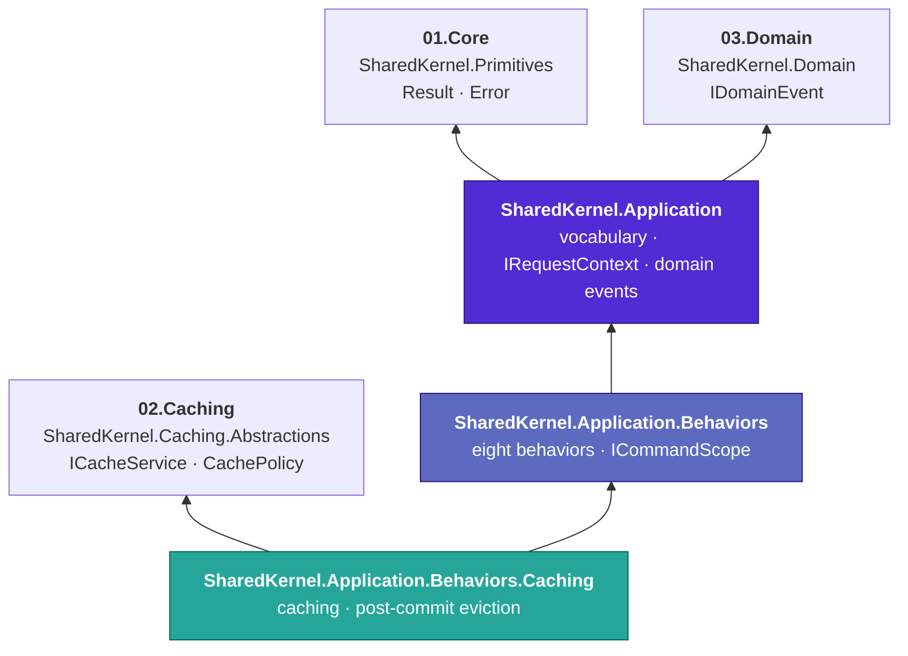
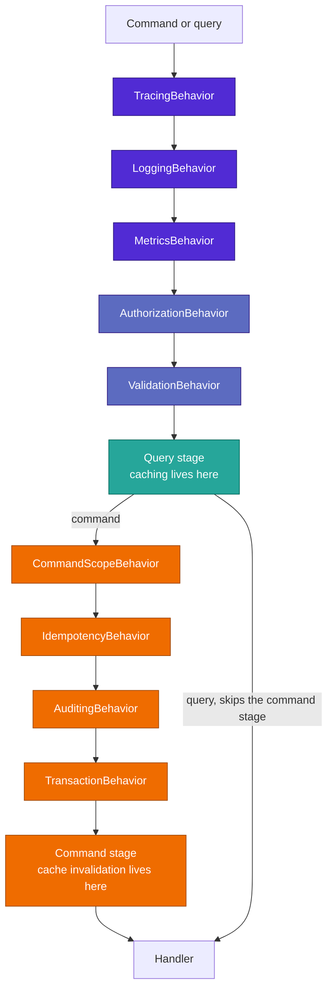

# 05.Application

[](https://dotnet.microsoft.com/)
[](https://github.com/Gresta-Vertex-Labs/platform-shared-kernel/blob/main/LICENSE)
[-5c6bc0)](https://github.com/jbogard/MediatR)


> **The CQRS layer of Platform.SharedKernel: a command and query vocabulary, the domain-event bridge, and the
> cross-cutting concerns every handler would otherwise re-implement — tracing, logging, metrics, authorization,
> validation, idempotency, transactions, auditing and caching — composed in one fixed order you never have to
> get right yourself.**

Handlers here do one thing: take a command or query and return a `Result`. Everything around them is a MediatR
pipeline behavior you opt into, and every behavior that touches infrastructure does so through a **local seam**
this layer owns — never a reference to the real thing. Your service bridges each seam to its real implementation
at its own composition root, so `05.Application` never references persistence, security, messaging or a cache.

```csharp
// The whole surface of a guarded, validated, idempotent, cached, audited operation.
public sealed record ApproveOrderCommand(Guid OrderId, string IdempotencyKey)
    : ICommand, IAuthorizeRequest, IIdempotentRequest, IInvalidatesCache
{
    public IReadOnlyCollection<string> RequiredPermissions => ["orders.approve"];
    public IReadOnlyCollection<CacheKeyRef> CacheKeysToInvalidate => [CacheKeyRef.For<GetOrderQuery>(OrderId.ToString())];
}

internal sealed class ApproveOrderHandler(IOrderRepository orders) : ICommandHandler<ApproveOrderCommand>
{
    public async Task<Result> Handle(ApproveOrderCommand command, CancellationToken ct)
    {
        // No permission check. No validation. No try/catch. No SaveChanges. No cache call.
        var order = await orders.FindAsync(command.OrderId, ct);
        return order is null
            ? Error.NotFound("order.not_found", $"Order {command.OrderId} does not exist.")
            : order.Approve();
    }
}
```

```text
unauthenticated caller         -> 401  Error.Unauthorized        handler never runs
missing orders.approve         -> 403  Error.Forbidden           handler never runs
validation failure             -> 400  Error.Validation(errors)  handler never runs
same caller, same key, retried -> the first response, replayed   handler never runs
another caller, same key       -> its own execution              keys are reserved per tenant and caller
handler returns a failure      -> no commit, no eviction, key released for a later retry
handler succeeds               -> commit, then audit, then cache eviction, in that order
```

## Contents

- [The packages](#the-packages)
- [Which package do I need?](#which-package-do-i-need)
- [How the packages fit together](#how-the-packages-fit-together)
- [Install](#install)
- [The pipeline order](#the-pipeline-order)
- [The command-scope and commit flow](#the-command-scope-and-commit-flow)
- [Local seams](#local-seams)
- [A tour in code](#a-tour-in-code)
- [Conventions every package follows](#conventions-every-package-follows)
- [Status and versions](#status-and-versions)
- [Analyzers that guard this layer](#analyzers-that-guard-this-layer)
- [Deliberately not here](#deliberately-not-here)
- [Build and test](#build-and-test)
- [AI quick reference](#ai-quick-reference)
- [Contributing, for people and AI agents](#contributing-for-people-and-ai-agents)

## The packages

Four packages, split strictly by what each one forces on a consumer. A service that only wants the vocabulary
should not inherit FluentValidation; a service that wants behaviors should not inherit a cache.

| Package | What you get | Beyond `Microsoft.Extensions.*` |
| --- | --- | --- |
| [**Application.Abstractions**](SharedKernel.Application.Abstractions/README.md) | The contracts the pipeline shares with infrastructure — `IRequestContext` (+ `ActorKind`, `SystemRequestContext`, `AnonymousRequestContext`), the one `IUnitOfWork`, `IAuditTrailWriter`/`AuditEntry`. `06.Persistence` and `13.ServiceDefaults.Security` implement them, so nothing needs an adapter | SharedKernel.Primitives only |
| [**Application**](SharedKernel.Application/README.md) | `ICommand`, `ICommand<T>`, `IQuery<T>`, `IStreamQuery<T>` and their handler aliases; the domain-event → MediatR bridge (it type-forwards `IRequestContext` and friends from `.Abstractions`) | MediatR, SharedKernel.Primitives, SharedKernel.Domain, SharedKernel.Application.Abstractions |
| [**Application.Behaviors**](SharedKernel.Application.Behaviors/README.md) | Eight behaviors — Tracing, Logging, Metrics, Authorization, Validation, Idempotency, Transaction, Auditing — plus `ICommandScope`, `PipelineStage` and `AddBehavior` for your own. **No cache, no Polly, no hosting** | FluentValidation |
| [**Application.Behaviors.Caching**](SharedKernel.Application.Behaviors.Caching/README.md) | Query caching over `ICacheableQuery<TValue>` and post-commit eviction over `IInvalidatesCache`, partitioned by query type, tenant and caller | SharedKernel.Caching.Abstractions |

Every package targets `net10.0`.

## Which package do I need?

| I want to… | Package | Start with |
| --- | --- | --- |
| Model a write operation | Application | `ICommand` / `ICommand<TResponse>` |
| Model a read operation | Application | `IQuery<TResponse>` |
| Stream a large result set | Application | `IStreamQuery<TResponse>` (no behaviors apply — see below) |
| Know who the caller is, inside a handler | Application | inject `IRequestContext` |
| Dispatch from a job or workflow with no HTTP request | Application | `SystemRequestContext` |
| Publish a domain event as a MediatR notification | Application | `AddDomainEventHandler<TEvent, THandler>()` |
| Stop writing the same logging in every handler | Application.Behaviors | `AddDefaultBehaviors()` |
| Gate an operation on a permission | Application.Behaviors | `IAuthorizeRequest` |
| Validate a request before the handler runs | Application.Behaviors | FluentValidation + `AddValidationBehavior()` |
| Make a double-submitted command safe | Application.Behaviors | `IIdempotentRequest` + `IRequestIdempotencyStore` |
| Commit once, at the outermost command | Application.Behaviors | `AddTransactionBehavior()` + `IUnitOfWork` |
| Record who changed what | Application.Behaviors | `IAuditableRequest<TResponse>` + `IAuditTrailWriter` |
| Run work after the commit lands | Application.Behaviors | `ICommandScope.OnCompleted` |
| Add your own cross-cutting behavior | Application.Behaviors | `AddBehavior(typeof(T<,>), PipelineStage.X, requiredServices)` |
| Cache a hot read | Application.Behaviors.Caching | `ICacheableQuery<TValue>` |
| Evict what a write made stale | Application.Behaviors.Caching | `IInvalidatesCache` + `CacheKeyRef.For<TQuery>(key)` |

**Where to start.** Take `SharedKernel.Application` and write handlers that return `Result`. Add `.Behaviors` the
first time you catch yourself writing the same permission check, commit or duplicate-submission guard in a second
handler. Add `.Caching` only when a measured read is worth caching.

## How the packages fit together

Arrows point from a package to what it depends on. Only the caching sibling reaches into `02.Caching`.



**Where this layer sits.** `05.Application` may reference `01`–`04`. It must never reference `06.Persistence`,
`07.Messaging`, `12.Security` or any other concrete infrastructure — those arrive through
[local seams](#local-seams) instead. `06.Persistence`, `17.Workflows` and `19.Scheduling` reference *this* layer,
not the other way round.

## Install

The packages are published to GitHub Packages. Add the feed once, in a `nuget.config` at your repository root:

```xml
<configuration>
  <packageSources>
    <add key="nuget.org" value="https://api.nuget.org/v3/index.json" />
    <add key="shared-kernel" value="https://nuget.pkg.github.com/Gresta-Vertex-Labs/index.json" />
  </packageSources>
  <packageSourceMapping>
    <packageSource key="shared-kernel"><package pattern="SharedKernel.*" /></packageSource>
    <packageSource key="nuget.org"><package pattern="*" /></packageSource>
  </packageSourceMapping>
</configuration>
```

GitHub Packages needs a token even to read: a personal access token with `read:packages` locally, or `GITHUB_TOKEN`
in GitHub Actions.

```shell
dotnet add package SharedKernel.Application
dotnet add package SharedKernel.Application.Behaviors          # optional
dotnet add package SharedKernel.Application.Behaviors.Caching  # optional
```

Then compose the pipeline once, at the composition root:

```csharp
services.AddMediatR(cfg => cfg.RegisterServicesFromAssemblyContaining<Program>());
services.AddValidatorsFromAssemblyContaining<Program>();
services.AddSharedKernelApplication();                                        // domain-event bridge

// Infrastructure implements the shared contracts itself — no adapters.
services.AddSharedKernelRequestContext();                                     // 13.ServiceDefaults.Security -> IRequestContext
builder.AddSharedKernelPostgres<OrderDbContext>("orders", p => p.UseAuditTrail()); // 06 -> IUnitOfWork, IAuditTrailWriter
services.AddScoped<IRequestIdempotencyStore, RedisIdempotencyStore>();        // -> 18.Idempotency
services.AddSharedKernelCaching(o => o.ServiceName = "orders");               // -> 02.Caching

services.AddSharedKernelApplicationBehaviors()
    .AddDefaultBehaviors()        // Tracing, Logging, Metrics, Validation — no prerequisites
    .AddAuthorizationBehavior()   // needs IRequestContext
    .AddCachingBehaviors()        // needs ICacheService + ITenantCacheKeyProvider
    .AddIdempotencyBehavior()     // needs IRequestIdempotencyStore + IRequestContext
    .AddTransactionBehavior()     // needs IUnitOfWork
    .AddAuditingBehavior()        // needs IAuditTrailWriter
    .Build();                     // throws here, at startup, naming anything missing
```

Call order does not matter — `Build()` always registers in the canonical order below. Opting into a behavior
without its seam fails at `Build()`, not at the first request that needed it.

## The pipeline order

Fixed regardless of `.AddXBehavior()`/`AddBehavior` call order — outermost first. A query stops after the Query
stage; only a command (`ICommandBase`) enters the Command stage.



Two positions are deliberate and worth knowing:

- **Authorization runs before Validation.** An unauthorized caller must never learn a request's validation rules,
  and a validator may itself hit the database.
- **`CommandScopeBehavior` is registered first among command-stage behaviors.** Registration order is not
  execution order for post-`next()` code: the first-registered behavior in a stage is outermost, so its code
  *after* `next()` runs **last**. That is what lets it observe `TransactionBehavior`'s commit as already complete
  when it runs queued `OnCompleted` callbacks.

## The command-scope and commit flow

A handler sending a nested command (`ISender.Send` from inside another handler) shares the outer command's DI
scope, so one `ICommandScope` observes the whole nesting depth. A nested command's `OnCompleted` callback is
merged into the outer frame; it runs once, after the **outermost** command has committed.

```mermaid
sequenceDiagram
    autonumber
    participant Caller
    participant Scope as CommandScopeBehavior
    participant Idem as IdempotencyBehavior
    participant Txn as TransactionBehavior
    participant H as Outer handler
    participant Sender as ISender (nested send)
    participant H2 as Inner handler
    participant UoW as IUnitOfWork

    Caller->>Scope: Send(OuterCommand)
    Scope->>Scope: Enter, depth 1
    Scope->>Idem: next()
    Idem->>Idem: TryBeginAsync reserves the key
    Idem->>Txn: next()
    Txn->>H: next()
    H->>Sender: Send(InnerCommand)
    Sender->>Scope: Enter, depth 2, IsNested true
    Scope->>H2: next() (Idempotency skips when IsNested; Transaction joins the running transaction)
    H2->>Scope: OnCompleted(callback)
    H2-->>Sender: Result success
    Scope->>Scope: Exit, merges the callback into the depth-1 frame
    Sender-->>H: Result success
    H-->>Txn: Result success
    Txn->>UoW: ExecuteInTransactionAsync saves, then commits (the handler ran inside it)
    Txn-->>Idem: Result success
    Idem->>Idem: CompleteAsync stores the serialized response
    Idem-->>Scope: Result success
    Scope->>Scope: Exit, depth 0 — runs the queued callback now the commit is complete
    Scope-->>Caller: Result success
```

A failed or faulted command — nested or outermost — discards its frame's callbacks; nothing runs. This is why
cache eviction can promise "after the commit" without any registration-order trickery of its own.

## Local seams

Each behavior that touches infrastructure depends on a **minimal interface this layer owns**, deliberately smaller
than the real contract it stands for. Your service implements the bridge at its composition root.

| Seam | In | Bridges to |
| --- | --- | --- |
| `IRequestContext` | Application.Abstractions | `13.ServiceDefaults.Security` (`AddSharedKernelRequestContext()`, over `12.Security`), or your own |
| `IUnitOfWork` | Application.Abstractions | `06.Persistence.EfCore` — implemented directly |
| `IRequestIdempotencyStore` | Application.Behaviors | `18.Idempotency`, or your own store |
| `IAuditTrailWriter` | Application.Abstractions | `06.Persistence.EfCore.Auditing` — implemented directly |

This is one pattern applied four times, not four patterns. It is what keeps this layer buildable and testable with
no infrastructure package on disk — every test project here references only the package it tests.

## A tour in code

Each snippet comes from a package README, where the full story, recipes and pitfalls live.

**Vocabulary: a handler returns a `Result`, never throws for an expected failure.**

```csharp
public sealed record GetOrderQuery(Guid OrderId) : IQuery<OrderDto>;

internal sealed class GetOrderHandler(IOrderRepository orders) : IQueryHandler<GetOrderQuery, OrderDto>
{
    public async Task<Result<OrderDto>> Handle(GetOrderQuery query, CancellationToken ct) =>
        await orders.FindAsync(query.OrderId, ct) is { } order
            ? order.ToDto()
            : Error.NotFound("order.not_found", $"Order {query.OrderId} does not exist.");
}
```

**Authorization: fail closed, and never say which permission was missing.**

```csharp
public sealed record ApproveOrderCommand(Guid OrderId) : ICommand, IAuthorizeRequest
{
    public IReadOnlyCollection<string> RequiredPermissions => ["orders.approve"];
}
// Anonymous -> Error.Unauthorized (401). Missing permission -> Error.Forbidden (403).
// Declaring IAuthorizeRequest with an EMPTY permission set is refused, not waved through.
```

**Idempotency: a retried submission replays the first answer.**

```csharp
public sealed record PlaceOrderCommand(Guid BasketId, string IdempotencyKey) : ICommand<Guid>, IIdempotentRequest
{
    public string? Fingerprint => BasketId.ToString();   // pin what identifies the request
}
// Same key + same fingerprint, already completed -> the stored response, handler never runs.
// Same key + different fingerprint              -> Error.Conflict("idempotency.key_reused").
// Still in flight                               -> Error.Conflict("idempotency.in_progress").
// Blank key                                     -> Error.Validation("idempotency.key_required").
// Keys are reserved per tenant AND caller: another caller using the same key gets its own execution,
// never the stored response. Anonymous callers share one scope per tenant — only the fingerprint separates them.
```

**Post-commit work: `ICommandScope` runs it once, and only on success.**

```csharp
public async Task<Result> Handle(ShipOrderCommand command, CancellationToken ct)
{
    var result = order.Ship();
    if (result.IsSuccess)
        scope.OnCompleted(ct2 => notifications.SendShippedEmailAsync(order.Id, ct2));   // after the commit
    return result;
}
```

**Caching: one interface on the query, one on the command.**

```csharp
public sealed record GetOrderQuery(Guid OrderId) : ICacheableQuery<OrderDto>
{
    public CachePolicy CachePolicy => CachePolicy.For(TimeSpan.FromMinutes(1), TimeSpan.FromMinutes(10));
    public string CacheKey => OrderId.ToString();      // partitioned by query type, tenant and caller for you
}

public sealed record ApproveOrderCommand(Guid OrderId) : ICommand, IInvalidatesCache
{
    public IReadOnlyCollection<CacheKeyRef> CacheKeysToInvalidate => [CacheKeyRef.For<GetOrderQuery>(OrderId.ToString())];
}
```

**Domain events: raised in the aggregate, handled as a MediatR notification.**

```csharp
services.AddDomainEventHandler<OrderPlacedDomainEvent, SendConfirmationHandler>();
// Dispatched serially, in the order the aggregate raised them.
```

## Conventions every package follows

| Convention | What it means for you |
| --- | --- |
| **MediatR is the abstraction** | `ICommand`/`IQuery<T>` are thin vocabulary over `IRequest<TResponse>`. There is no second mediator underneath, and no wrapper you have to learn |
| **No response envelope** | Handlers return `Result`/`Result<T>` only. `14.Presentation` maps a failure to RFC 9457 ProblemDetails; `11.Communication` maps it back |
| **A short-circuit is a `Result` failure, never an exception** | Unauthorized, invalid and duplicate are foreseeable outcomes, not faults. Every behavior short-circuits by constructing a failed response |
| **Seams, never a reference to the real thing** | Four minimal interfaces this layer owns; infrastructure implements them (three live in `.Abstractions` so persistence can, without MediatR) |
| **Fixed pipeline order** | `Build()` registers in the same five-stage order whatever order you called things in |
| **Missing prerequisites fail at startup** | Opting into an infrastructure-gated behavior without its seam throws at `Build()`, naming the type |
| **Only the outermost command commits** | Nested commands skip idempotency and join the running transaction (a nested failure makes it rollback-only); one logical operation, one commit |
| **Structured logging** | `[LoggerMessage]` with `EventId`s from this layer's range, 5000-5999, one 100-wide block per package |
| **Documented, tracked public API** | Every package ships XML docs and fails the build on an undocumented public member or an untracked API change |

## Status and versions

| Package | Latest version | Review |
| --- | --- | --- |
| Application | `1.0.0-alpha.0.1116` | P-544: pre-publish redesign — `IQueryBase`, `IRequestContext`, fail-closed authorization, `Result`-only short-circuits |
| Application.Behaviors | `1.0.0-alpha.0.1116` | P-544, then a hardening pass: single-`Build()` guard, validated options, stateless idempotency reservations |
| Application.Behaviors.Caching | `1.0.0-alpha.0.1116` | P-556: key namespacing by query type and scope, fail-closed `CacheScope`, `CacheKeyRef` targets, uncancellable post-commit eviction, EventIds 5200-5299 |

Versions come from one repository-wide counter (MinVer), so a higher number always contains every earlier change.

P-544 removed a good deal of unpublished surface rather than shipping it: fire-and-forget dispatch, a
`ResilienceBehavior`, every streaming pipeline behavior, parallel domain-event dispatch and a generic dual-approval
behavior. Nothing had reached a feed, so every removal was free. See
[`CLAUDE.history.md`](CLAUDE.history.md) for why each once existed.

## Analyzers that guard this layer

`SharedKernel.Analyzers`, from `00.Governance`, turns this layer's rules into build warnings in the services that
use it:

| Rule | Flags |
| --- | --- |
| SK0016 | `typeof(T).Name` used as a metric tag, log scope or cache key — it collides across namespaces |
| SK0017 | A command implementing `ICacheableQuery` — caching is for queries |
| SK0018 | A query implementing `IInvalidatesCache` — invalidation is for commands |
| SK0030 | A `Result` returned by a call and never checked |
| SK0040 | `IAuthorizeRequest`/`IIdempotentRequest` on a request whose response is not `Result`/`Result<T>` — the behavior would throw on its first short-circuit |
| SK0041 | Two `ICacheableQuery` types sharing a simple type name — their cache key namespaces collapse |

`00.Governance` also holds an executed, cross-domain lock proving cache eviction observably follows the commit
against the real compiled assemblies — independent of this layer's own tests.

## Deliberately not here

- **No retry policy.** Retry belongs to the infrastructure call a handler makes — a typed HTTP client's resilience
  pipeline in `11.Communication` — not a blind command-level retry that risks re-running a side effect.
- **No maker-checker approval.** Binding an approval to a specific pending change is application-specific domain
  work, not a platform pipeline primitive. A generic one keyed on a caller-supplied string is replayable.
- **No behaviors for streaming.** MediatR treats unary and streaming requests as disjoint generic hierarchies, so
  every streaming behavior was a hand-duplicated copy. `IStreamQuery<T>` vocabulary stays; behaviors do not apply.
- **No fire-and-forget dispatch.** A service that wants background work can queue it without this layer policing
  the footgun it created.
- **No MediatR registration.** These packages never call `AddMediatR`. Your service owns assembly scanning.
- **No test doubles in production packages.** The fakes live in `16.Testing`.

## Build and test

```shell
dotnet build 05.Application/SharedKernel.Application/SharedKernel.Application.csproj -c Release
dotnet build 05.Application/SharedKernel.Application.Behaviors/SharedKernel.Application.Behaviors.csproj -c Release
dotnet build 05.Application/SharedKernel.Application.Behaviors.Caching/SharedKernel.Application.Behaviors.Caching.csproj -c Release

dotnet test 05.Application/SharedKernel.Application/SharedKernel.Application.Tests -c Release
dotnet test 05.Application/SharedKernel.Application.Behaviors/SharedKernel.Application.Behaviors.Tests -c Release
dotnet test 05.Application/SharedKernel.Application.Behaviors.Caching/SharedKernel.Application.Behaviors.Caching.Tests -c Release
```

Every test project references only the package it tests — never `16.Testing` or `00.Governance`'s
`SharedKernel.ArchitectureTests` — so each builds and runs without any other domain on disk. Pipeline order and
cross-behavior interaction are proved through a real `ServiceCollection`, a real MediatR pipeline and a real
dispatch, never a hand-rolled stand-in.

## AI quick reference

```text
LAYER       05.Application may reference 01-04 only. NEVER 06.Persistence / 07.Messaging / 12.Security / any concrete
            infrastructure — those arrive via local seams. net10.0. MediatR pinned 12.4.x (last MIT major).
VOCABULARY  ICommand : IRequest<Result>          ICommand<T> : IRequest<Result<T>>
            IQuery<T> : IRequest<Result<T>>      IStreamQuery<T> (no behaviors apply)
            ICommandBase / IQueryBase = zero-member markers behaviors constrain on.
            Handlers: ICommandHandler<C> | ICommandHandler<C,T> | IQueryHandler<Q,T>. ALWAYS return Result/Result<T>.
SEAMS       IRequestContext, IUnitOfWork, IAuditTrailWriter (Application.Abstractions) -> implemented by 13.ServiceDefaults
            .Security / 06.Persistence directly. IRequestIdempotencyStore (Behaviors) -> 18.Idempotency.
PIPELINE    Fixed order, outermost first, independent of call order:
              Observability : Tracing, Logging, Metrics
              Authorization : AuthorizationBehavior
              Validation    : ValidationBehavior
              Query         : caching behavior (custom Query-stage behaviors)
              Command       : CommandScope, Idempotency, Auditing (Failed), Transaction, Auditing (Succeeded), cache invalidation
            Queries SKIP the command stage. Registration order != post-next() execution order: first registered is
            outermost, so its post-next() code runs LAST.
REGISTER    services.AddSharedKernelApplicationBehaviors()
                .AddDefaultBehaviors()        // Tracing+Logging+Metrics+Validation, zero prerequisites
                .AddAuthorizationBehavior() .AddCachingBehaviors() .AddIdempotencyBehavior()
                .AddTransactionBehavior() .AddAuditingBehavior()
                .AddBehavior(typeof(My<,>), PipelineStage.Query, typeof(IDep))
                .Build();                     // THROWS at startup naming any missing required service
            Build() is once-only. These packages NEVER call AddMediatR.
MARKERS     IAuthorizeRequest (RequiredPermissions, PermissionMatch All|Any) — empty set = Forbidden, fail closed.
            IIdempotentRequest (IdempotencyKey, Fingerprint?) — commands only. Reserved per tenant + caller (the
            store gets a SHA-256 digest, never the raw key); anonymous callers share one scope per tenant.
            Blank key -> idempotency.key_required. AddIdempotencyBehavior() needs IRequestContext.
            IAuditableRequest<T> (Action, ResourceType, ResourceId, BeforeSnapshot, GetAfterSnapshot).
            ILoggableRequest<T> (self-supplied loggable fields; never reflection over the request).
            ICacheableQuery<T> (queries only, SK0017). IInvalidatesCache (commands only, SK0018).
COMMITS     Only the OUTERMOST command commits. Nested (ICommandScope.IsNested) skips idempotency + transaction.
            ICommandScope.OnCompleted(cb) runs after the outermost command SUCCEEDS; failure/throw discards it.
LOGGING     [LoggerMessage] with explicit EventId. 5000-5099 Application, 5100-5199 Behaviors, 5200-5299 Caching.
            Meter + ActivitySource both named "SharedKernel.Application" (WithApplicationTelemetry exports them).
FORBIDDEN   Throwing for an expected failure. A response envelope. A project reference to concrete infrastructure.
            AddMediatR from inside these packages. typeof(T).Name as a tag or key (SK0016).
```

## Contributing, for people and AI agents

1. Read [`CLAUDE.md`](CLAUDE.md) first: its rules tables say what may and may not change, and its cross-domain
   couplings table lists what breaks elsewhere.
2. Record every public API change in the affected package's own `PublicAPI.Unshipped.txt`.
3. Keep the fixed pipeline order. A new built-in behavior needs a documented position, never an implicit one; a
   sibling package extends the pipeline through `PipelineStage`/`AddBehavior` instead.
4. Never add a project reference from `SharedKernel.Application`/`.Behaviors` to concrete infrastructure — add a
   local seam and bridge it at the consuming service's composition root.
5. Read [`CLAUDE.history.md`](CLAUDE.history.md) only to understand *why* a since-removed capability once existed —
   never as a description of the code on disk today.

### Docs in this folder

| File | What it is |
| --- | --- |
| [`CLAUDE.md`](CLAUDE.md) | The domain brain: implementation rules, decisions and traps for maintainers and AI agents |
| [`CLAUDE.history.md`](CLAUDE.history.md) | Pre-2026-09-15 work-order history — types this domain has since removed or redesigned |
| [`state-map.md`](state-map.md) | Phase and task history for this domain |

Part of [Platform.SharedKernel](https://github.com/Gresta-Vertex-Labs/platform-shared-kernel).
