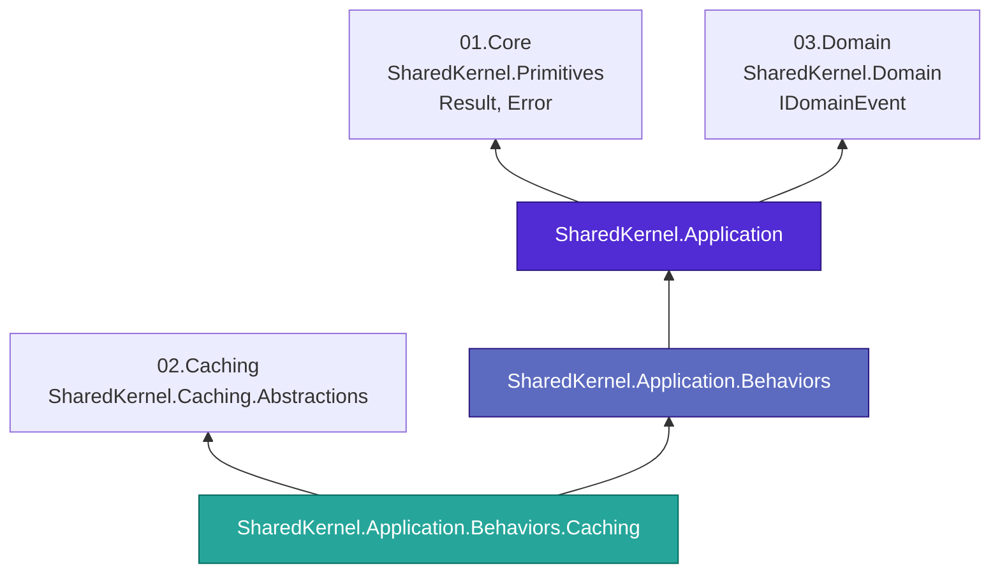
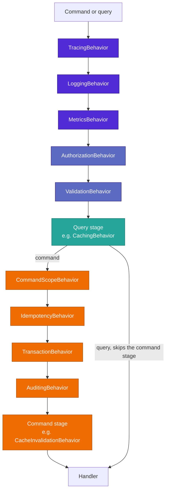
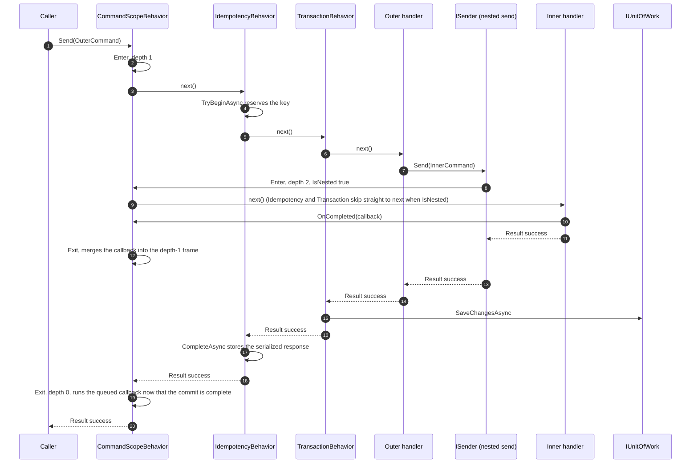

# 05.Application


**The MediatR-based CQRS plumbing layer of Platform.SharedKernel.** Command/query vocabulary, a
request-context seam, the domain-event-to-MediatR bridge, and opt-in cross-cutting pipeline behaviors —
composed in a fixed order, never invented per-service.

> Looking for how to use a package? Read its own README:
> [**SharedKernel.Application**](SharedKernel.Application/README.md) (vocabulary, always referenced),
> [**SharedKernel.Application.Behaviors**](SharedKernel.Application.Behaviors/README.md) (the eight core
> pipeline behaviors), [**SharedKernel.Application.Behaviors.Caching**](SharedKernel.Application.Behaviors.Caching/README.md)
> (caching + cache invalidation).

## Contents

- [What lives here](#what-lives-here)
- [Where the layer sits](#where-the-layer-sits)
- [The pipeline order](#the-pipeline-order)
- [The command-scope / commit flow](#the-command-scope--commit-flow)
- [Design principles](#design-principles)
- [Design decisions](#design-decisions)
- [Guardrails](#guardrails)
- [Build and test](#build-and-test)
- [Contributing, for people and AI agents](#contributing-for-people-and-ai-agents)

## What lives here

Three packages, split strictly by what each one forces on a consumer. A service that only wants the
vocabulary should not inherit FluentValidation; a service that wants behaviors should not inherit a cache.

| Package | Reference it when | It gives you | It costs you |
| --- | --- | --- | --- |
| [**`SharedKernel.Application`**](SharedKernel.Application/README.md) | Always — this is the vocabulary every other package here builds on | `ICommand`, `ICommand<TResponse>`, `IQuery<TResponse>`, `IStreamQuery<TResponse>`, the handler aliases, `IRequestContext` (+ `SystemRequestContext`/`AnonymousRequestContext`), and the domain-event → MediatR bridge | `SharedKernel.Primitives`, `SharedKernel.Domain`, `MediatR` |
| [**`SharedKernel.Application.Behaviors`**](SharedKernel.Application.Behaviors/README.md) | You want any cross-cutting concern handled outside your handlers | Tracing, Logging, Metrics, Authorization, Validation, Idempotency, Transaction, Auditing — plus `ICommandScope` and `AddBehavior` for your own | The above, plus `FluentValidation` and first-party `Microsoft.Extensions.*`. **No cache, no Polly, no hosting** |
| [**`SharedKernel.Application.Behaviors.Caching`**](SharedKernel.Application.Behaviors.Caching/README.md) | You want queries cached and commands to invalidate them | `CachingBehavior<,>`, `CacheInvalidationBehavior<,>`, and the two markers they read | The above, plus `SharedKernel.Caching.Abstractions` |

**Which do I need?** Start with `SharedKernel.Application` and write handlers that return `Result`. Add
`.Behaviors` the first time you find yourself writing the same logging, permission check, commit or
duplicate-submission guard in a second handler. Add `.Caching` only when a measured read is worth caching.

**Publication status.** `SharedKernel.Application` and `SharedKernel.Application.Behaviors` publish together.
`.Caching` is finished and tested and is published after the `02.Caching` provider packages. It caches a
query's value rather than its `Result<T>`, so entries round-trip through a Redis L2 cache.

### Docs in this folder

| File | What it is |
| --- | --- |
| [`CLAUDE.md`](CLAUDE.md) | The domain brain: implementation rules, decisions and traps for maintainers and AI agents |
| [`CLAUDE.history.md`](CLAUDE.history.md) | Pre-2026-09-15 work-order history — types this domain has since removed or redesigned |
| [`state-map.md`](state-map.md) | Phase and task history for this domain |

## Where the layer sits

Arrows point from a package to what it depends on. `SharedKernel.Application` sits directly on
`01.Core`/`03.Domain`; only the caching sibling reaches into `02.Caching`.



## The pipeline order

Fixed regardless of `.AddXBehavior()`/`AddBehavior` call order — outermost first. A query stops after
the Query stage; only a command (`ICommandBase`) enters the Command stage.



Authorization runs before Validation deliberately — an unauthorized caller must never learn a request's
validation rules. `CommandScopeBehavior` is registered first among command-stage behaviors specifically
so its post-commit callback-running code observes every other command-stage behavior's own post-`next()`
code as already complete — see `CLAUDE.md`'s Hard Rule 7 for the registration-order-vs-onion-order trap.

## The command-scope / commit flow

A handler sending a nested command (`ISender.Send` from inside another command's handler) shares the
outer command's DI scope, so `ICommandScope` observes the whole nesting depth. A nested command's
`OnCompleted` callback is merged into the outer command's frame; it runs only once, after the **outermost**
command's `TransactionBehavior` has already committed.



A failed or faulted command — nested or outermost — discards its frame's callbacks; nothing runs.

## Design principles

| Principle | In practice |
| --- | --- |
| MediatR is the abstraction | No second mediator layer underneath — `ICommand`/`IQuery<TResponse>` are thin vocabulary over `IRequest<TResponse>` |
| No response envelope | Handlers return `Result`/`Result<T>` exclusively; `14.Presentation` maps a failure to ProblemDetails at the HTTP boundary |
| A short-circuit is a `Result` failure, never an exception | Authorization, Validation, and Idempotency all fail the railway way — an unauthorized/invalid/duplicate request is a foreseeable outcome, not a fault |
| Local seams, never a reference to the real thing | `IRequestContext`, `IUnitOfWork`, `IRequestIdempotencyStore`, `IAuditTrailWriter` are minimal interfaces this domain owns; the consuming service bridges each to real infrastructure at its own composition root |
| Fixed pipeline order | `ApplicationBehaviorsBuilder.Build()` always registers in the same five-stage order, regardless of call order |
| AOT is not a constraint here | Reflection is used at four documented, cached-once sites — see `CLAUDE.md` |

## Design decisions

| Decision | Chosen | Instead of |
| --- | --- | --- |
| Package split | Vocabulary / core behaviors / caching, three packages by dependency | One package mixing every dependency, forcing every consumer to pull in `SharedKernel.Caching.Abstractions` |
| `CachingBehavior`'s cache-miss path | Explicit `GetAsync`/`SetAsync`, never caches a failure | `ICacheService.GetOrSetAsync`'s built-in stampede protection |
| Fire-and-forget, resilience, streaming behaviors, dual approval | Removed outright | Kept as unpublished, unproven surface no consumer had adopted |
| Idempotency contract | A single `IRequestIdempotencyStore` (`TryBeginAsync`/`CompleteAsync`/`ReleaseAsync`) | Two separate key/response-store interfaces |

## Guardrails

| Guard | What it catches |
| --- | --- |
| `PublicApiAnalyzers` (RS0016 and siblings as errors) in every package | Any unrecorded change to the public API |
| `CS1591` as an error | An undocumented public member |
| `ApplicationBehaviorsBuilder.Build()`'s missing-dependency guards | Opting into an infrastructure-gated behavior without registering its local seam |
| `ICommandScope`'s `InvalidOperationException` | Calling `OnCompleted` when no command is active in the DI scope |
| `00.Governance` layering rules | This domain referencing `06.Persistence`, `07.Messaging`, `12.Security`, or any concrete infrastructure package |

## Build and test

```shell
dotnet build 05.Application/SharedKernel.Application/SharedKernel.Application.csproj -c Release
dotnet build 05.Application/SharedKernel.Application.Behaviors/SharedKernel.Application.Behaviors.csproj -c Release
dotnet build 05.Application/SharedKernel.Application.Behaviors.Caching/SharedKernel.Application.Behaviors.Caching.csproj -c Release

dotnet test 05.Application/SharedKernel.Application/SharedKernel.Application.Tests -c Release
dotnet test 05.Application/SharedKernel.Application.Behaviors/SharedKernel.Application.Behaviors.Tests -c Release
dotnet test 05.Application/SharedKernel.Application.Behaviors.Caching/SharedKernel.Application.Behaviors.Caching.Tests -c Release
```

Every test project references only the package it tests — never `16.Testing` or `00.Governance`'s
`SharedKernel.ArchitectureTests` — so each builds and runs without any other domain on disk.

## Contributing, for people and AI agents

1. Read [`CLAUDE.md`](CLAUDE.md) first: its rules tables say what may and may not change, and its
   cross-domain couplings table lists what breaks elsewhere.
2. Record every public API change in the affected package's own `PublicAPI.Unshipped.txt`.
3. Keep the fixed pipeline order — a new built-in behavior needs a documented position, never an
   implicit one; a sibling package extends the pipeline via `PipelineStage`/`AddBehavior` instead.
4. Never add a project reference from `SharedKernel.Application`/`.Behaviors` to concrete infrastructure —
   add a local seam and bridge it at the consuming service's composition root instead.
5. Read [`CLAUDE.history.md`](CLAUDE.history.md) only to understand *why* a since-removed capability
   (fire-and-forget, resilience, streaming behaviors, dual approval) once existed — never as a
   description of the code on disk today.
