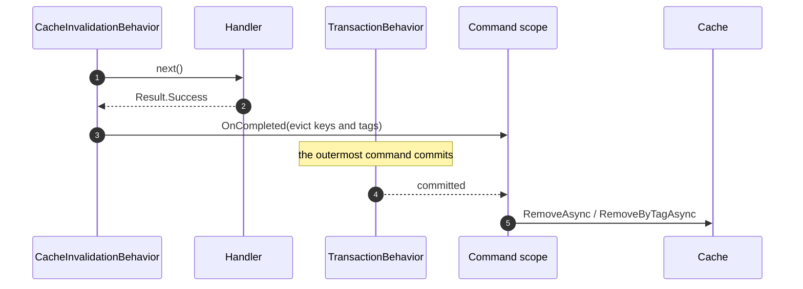

# SharedKernel.Application.Behaviors.Caching


**Two pipeline behaviors that put a cache around a query and evict it after the command that changed the
data commits.**

They are a separate package for one reason: they need `SharedKernel.Caching.Abstractions`, and
[`SharedKernel.Application.Behaviors`](../SharedKernel.Application.Behaviors/README.md) refuses to take a
cache dependency on behalf of services that never cache anything. Reference this only when you want caching.

| You get | So that |
| --- | --- |
| `CachingBehavior` over `ICacheableQuery<TResponse>` | A hot query is served from cache without the handler knowing a cache exists |
| A failed `Result` is never cached | A transient `NotFound` doesn't get pinned for the whole expiry window |
| `CacheInvalidationBehavior` over `IInvalidatesCache` | A command declares what it makes stale, and eviction is not the handler's problem |
| Eviction deferred to after the commit | Nothing evicts on the strength of a write that has not landed yet |
| Optional per-tenant key and tag scoping | One tenant cannot read or invalidate another tenant's entry |

> **Not published yet.** This package is finished and tested, but held back until the `02.Caching` pass —
> see [Known limitation](#known-limitation-l2-and-resultt) before adopting it.

## Contents

- [Install](#install)
- [Quick start](#quick-start)
- [Caching a query](#caching-a-query)
- [Invalidating after a command](#invalidating-after-a-command)
- [Tenant scoping](#tenant-scoping)
- [Known limitation: L2 and `Result<T>`](#known-limitation-l2-and-resultt)
- [Reference](#reference)
- [Pitfalls](#pitfalls)
- [Testing](#testing)
- [Package](#package)

## Install

```xml
<PackageReference Include="SharedKernel.Application.Behaviors.Caching" Version="*" />
```

```csharp
using SharedKernel.Application.Behaviors.Caching.Extensions;

builder.Services.AddSharedKernelApplicationBehaviors()
    .AddDefaultBehaviors()
    .AddCachingBehaviors()     // adds both behaviors, in their correct stages
    .Build();
```

`AddCachingBehaviors()` places `CachingBehavior` in the **Query** stage and `CacheInvalidationBehavior` in the
**Command** stage, and declares `ICacheService` as required — `Build()` throws at startup if no cache is
registered.

## Quick start

```csharp
// A query that may be served from cache.
public sealed record GetOrderQuery(Guid OrderId) : IQuery<OrderDto>, ICacheableQuery<Result<OrderDto>>
{
    public string CacheKey => $"order:{OrderId}";
    public CachePolicy CachePolicy => CachePolicy.For(TimeSpan.FromMinutes(1), TimeSpan.FromMinutes(10))
        .WithTags("orders");
}

// A command that makes it stale.
public sealed record CancelOrderCommand(Guid OrderId) : ICommand, IInvalidatesCache
{
    public IReadOnlyCollection<string> CacheKeysToInvalidate => [$"order:{OrderId}"];
    public IReadOnlyCollection<string> CacheTagsToInvalidate => ["orders"];
}
```

Nothing else changes. The handlers are untouched, and a service that never registers these behaviors runs
both requests exactly as before.

## Caching a query

`ICacheableQuery<TResponse>` is self-supplied: the query computes its own key, because only it knows the
parameters that discriminate one result from another.

```csharp
public interface ICacheableQuery<TResponse>
{
    CachePolicy CachePolicy { get; }
    string CacheKey { get; }
}
```

Declare `TResponse` as the **whole response type**, `Result<OrderDto>`, not `OrderDto` — that is what the
pipeline actually passes through.

What the behavior does, in order:

1. Reads the (tenant-scoped) key. A hit returns immediately and the handler never runs.
2. On a miss, runs the handler.
3. Stores the response **only if it is not a failed `Result`**, under the query's own `CachePolicy`.

**No stampede protection.** The cache abstraction's `GetOrSetAsync` has no way to say "do not cache this
outcome", so this behavior uses an explicit get-then-set instead. That is a deliberate trade: never caching a
failure is worth more than collapsing concurrent misses. For a genuinely hot key where the herd matters more,
call `ICacheService.GetOrSetAsync` inside the handler and leave the behavior off that query.

## Invalidating after a command

`IInvalidatesCache` is the write-side half:

```csharp
public interface IInvalidatesCache
{
    IReadOnlyCollection<string> CacheKeysToInvalidate { get; }
    IReadOnlyCollection<string> CacheTagsToInvalidate { get; }   // defaults to empty
}
```

The behavior does **not** evict when the handler returns. It registers the eviction through
`ICommandScope.OnCompleted`, so it runs after the outermost command's transaction has committed:



So the ordering guarantee is: **a reader can never repopulate the cache from pre-commit state**, because the
eviction happens strictly after the write landed. A failed `Result` or a thrown handler registers nothing —
there is nothing stale to clear. An eviction that throws is logged by the command scope and does not change
the response the caller already earned.

## Tenant scoping

When an `IRequestContext` is registered and carries a `TenantId`, both behaviors prefix keys and tags with
`tenant:{tenantId}:`. A query declaring `order:42` reads `tenant:{id}:order:42`, and a command invalidating
the tag `orders` clears `tenant:{id}:orders` only.

With no `IRequestContext` registered, or a null `TenantId`, keys are used exactly as declared — correct for a
single-tenant service, and the reason the dependency is optional.

Two things follow:

- **A cached entry cannot leak across tenants** even if two tenants' queries compute the same key.
- **A tag cannot cross-invalidate**: one tenant's command never clears another's entries.

## Known limitation: L2 and `Result<T>`

`CachingBehavior` caches the whole response — a `Result<T>`. That works in the in-process L1 cache, which
stores the object by reference. It is expected to **fail on a genuine Redis L2 round trip**, because
FusionCache's default serializer is reflection-based `System.Text.Json` and `Result<T>` has only private
constructors, so it cannot be read back.

Until that is resolved in the `02.Caching` pass, this package is not published. If you vendor it in the
meantime, either keep the cache L1-only, or register a serializer that can handle `Result<T>` (the converters
in `SharedKernel.Application.Behaviors`' idempotency serializer solve the same problem).

## Reference

| Type | Applies to | Shape |
| --- | --- | --- |
| `ICacheableQuery<TResponse>` | queries | `CacheKey`, `CachePolicy` |
| `CachingBehavior<TRequest,TResponse>` | `IQueryBase` + `ICacheableQuery<TResponse>` | Query stage; get, run on miss, set on success |
| `IInvalidatesCache` | commands | `CacheKeysToInvalidate`, `CacheTagsToInvalidate` |
| `CacheInvalidationBehavior<TRequest,TResponse>` | `ICommandBase` + `IInvalidatesCache` | Command stage; evicts after commit via `ICommandScope` |
| `AddCachingBehaviors()` | — | Registers both, requires `ICacheService` |

`CachingBehavior` constrains to `IQueryBase`, so a command cannot be cached even if someone implements the
marker on one — the behavior never resolves for it. Analyzer `SK0017` flags that mistake at build time, and
`SK0018` flags a query implementing `IInvalidatesCache`.

## Pitfalls

**Declaring `ICacheableQuery<OrderDto>` instead of `ICacheableQuery<Result<OrderDto>>`.** The constraint will
not match and the behavior silently never runs for that query.

**A key that omits a discriminating parameter.** `$"orders:{Status}"` on a query that also filters by customer
serves one customer's results to another. The key must include everything the result depends on — including
anything the tenant prefix does not already cover.

**Expecting invalidation on a failed command.** Nothing is evicted, because nothing was committed.

**Expecting eviction when no command behavior is active.** `CacheInvalidationBehavior` defers through the
command scope, which the builder registers when the command stage is in use. Adding `AddCachingBehaviors()`
covers this, since it puts a behavior in the Command stage itself.

**Caching a per-user result under a per-tenant key.** Tenant scoping is not user scoping. If a result differs
per caller, put the caller in the key.

## Testing

```csharp
var cache = new FakeCacheService();
var behavior = new CachingBehavior<GetOrderQuery, Result<OrderDto>>(cache, new FakeRequestContext { TenantId = tenant });

var first = await behavior.Handle(query, () => Task.FromResult(Result<OrderDto>.Success(dto)), default);
var second = await behavior.Handle(query, () => throw new InvalidOperationException("handler ran twice"), default);

Assert.Equal(first.Value, second.Value);
```

`16.Testing` ships `FakeCacheService` and `FakeTenantCacheService`, so a caching test needs no Redis. There is
no fake `ICommandScope`: `CacheInvalidationBehavior` needs the real one, so test eviction through
`ApplicationPipelineTestHarness` with the transaction behavior enabled, and assert that the fake cache
recorded its removal after `FakeUnitOfWork.SaveChangesCallCount` moved.

## Package

| | |
| --- | --- |
| **Depends on** | `SharedKernel.Application.Behaviors`, `SharedKernel.Caching.Abstractions` |
| **Target** | `net10.0` |
| **Public API** | Tracked; an unrecorded change fails the build |
| **Status** | Complete and tested; publication deferred pending the `02.Caching` pass |

Maintainer rules live in [`05.Application/CLAUDE.md`](../CLAUDE.md).
