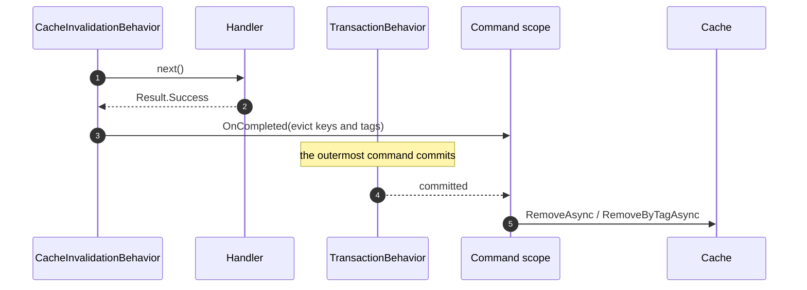

# SharedKernel.Application.Behaviors.Caching


**Two pipeline behaviors that put a cache around a query and evict it after the command that changed the
data commits.**

They are a separate package for one reason: they need `SharedKernel.Caching.Abstractions`, and
[`SharedKernel.Application.Behaviors`](../SharedKernel.Application.Behaviors/README.md) refuses to take a
cache dependency on behalf of services that never cache anything. Reference this only when you want caching.

| You get | So that |
| --- | --- |
| `CachingBehavior` over `ICacheableQuery<TValue>` | A hot query is served from cache, local or Redis, without the handler knowing a cache exists |
| A failed `Result` is never cached | A transient `NotFound` doesn't get pinned for the whole expiry window |
| `CacheInvalidationBehavior` over `IInvalidatesCache` | A command declares what it makes stale, and eviction is not the handler's problem |
| Eviction deferred to after the commit | Nothing evicts on the strength of a write that has not landed yet |
| Optional per-tenant key and tag scoping | One tenant cannot read or invalidate another tenant's entry |

> **Not published yet.** This package is finished and tested; it is published after the `02.Caching`
> provider packages it is used with.

## Contents

- [Install](#install)
- [Quick start](#quick-start)
- [Caching a query](#caching-a-query)
- [Invalidating after a command](#invalidating-after-a-command)
- [Tenant scoping](#tenant-scoping)
- [Distributed cache and `Result<T>`](#distributed-cache-and-resultt)
- [Reference](#reference)
- [Pitfalls](#pitfalls)
- [Testing](#testing)
- [Package](#package)

## Install

```xml
<PackageReference Include="SharedKernel.Application.Behaviors.Caching" Version="*" />
```

```csharp
using SharedKernel.Application.Behaviors.Caching.Extensions;

builder.Services.AddSharedKernelApplicationBehaviors()
    .AddDefaultBehaviors()
    .AddCachingBehaviors()     // adds both behaviors, in their correct stages
    .Build();
```

`AddCachingBehaviors()` places `CachingBehavior` in the **Query** stage and `CacheInvalidationBehavior` in the
**Command** stage, and declares `ICacheService` as required — `Build()` throws at startup if no cache is
registered.

## Quick start

```csharp
// A query that may be served from cache.
public sealed record GetOrderQuery(Guid OrderId) : ICacheableQuery<OrderDto>
{
    public string CacheKey => $"order:{OrderId}";
    public CachePolicy CachePolicy => CachePolicy.For(TimeSpan.FromMinutes(1), TimeSpan.FromMinutes(10))
        .WithTags("orders");
}

// A command that makes it stale.
public sealed record CancelOrderCommand(Guid OrderId) : ICommand, IInvalidatesCache
{
    public IReadOnlyCollection<string> CacheKeysToInvalidate => [$"order:{OrderId}"];
    public IReadOnlyCollection<string> CacheTagsToInvalidate => ["orders"];
}
```

Nothing else changes. The handlers are untouched, and a service that never registers these behaviors runs
both requests exactly as before.

## Caching a query

`ICacheableQuery<TValue>` is self-supplied: the query computes its own key, because only it knows the
parameters that discriminate one result from another.

```csharp
public interface ICacheableQuery<TValue> : ICacheableQuery, IQuery<TValue>
{
    // from ICacheableQuery:
    CachePolicy CachePolicy { get; }
    string CacheKey { get; }
}
```

It is also an `IQuery<TValue>`, so a query declares it alone. `TValue` is the value inside the query's
`Result<TValue>`, and it is the type stored in the cache.

What the behavior does, in one `ICacheService.GetOrSetAsync` call:

1. Looks up the (tenant-scoped) key. A hit rebuilds `Result<TValue>.Success(value)` and the handler never runs.
2. On a miss, runs the handler while holding the key, so identical concurrent queries do not all run it.
3. Stores the **value** of a successful result under the query's `CachePolicy`. A failed `Result` is
   returned and never stored; a query waiting on the same key then runs the handler itself.

Eager refresh and factory timeouts are switched off on the policy, because both could run the handler after
the request's DI scope is gone. Fail-safe, durations, tags and jitter are kept.

**The value crosses the distributed cache as JSON.** `TValue` must round-trip through `System.Text.Json`, and a
service that registers a `SerializerContext` for its cache must add `TValue` to it. The `Result` itself is never
serialized.

## Invalidating after a command

`IInvalidatesCache` is the write-side half:

```csharp
public interface IInvalidatesCache
{
    IReadOnlyCollection<string> CacheKeysToInvalidate { get; }
    IReadOnlyCollection<string> CacheTagsToInvalidate { get; }   // defaults to empty
}
```

The behavior does **not** evict when the handler returns. It registers the eviction through
`ICommandScope.OnCompleted`, so it runs after the outermost command's transaction has committed:



So the ordering guarantee is: **a reader can never repopulate the cache from pre-commit state**, because the
eviction happens strictly after the write landed. A failed `Result` or a thrown handler registers nothing —
there is nothing stale to clear. An eviction that throws is logged by the command scope and does not change
the response the caller already earned.

## Tenant scoping

When an `IRequestContext` is registered and carries a `TenantId`, both behaviors scope keys and tags to
the tenant in `CacheKeyFormat`'s tenant format, `@{tenant}:{key}`, with both parts escaped. A query declaring
`order:42` reads `@{id}:order%3A42`, and a command invalidating the tag `orders` clears `@{id}:orders` only. Every
tenant-scoped query result also carries the tenant-wide tag `@{id}`, so `ITenantCacheService.RemoveTenantAsync`
removes it.

With no `IRequestContext` registered, or a null `TenantId`, keys are used exactly as declared — correct for a
single-tenant service, and the reason the dependency is optional.

Two things follow:

- **A cached entry cannot leak across tenants** even if two tenants' queries compute the same key.
- **A tag cannot cross-invalidate**: one tenant's command never clears another's entries.

## Distributed cache and `Result<T>`

The behavior caches the query's **value**, never the `Result<TValue>`. `Result<T>` has private constructors and
properties that throw in the opposite state, so `System.Text.Json` cannot write it, let alone read it back:
caching the whole result fails as soon as FusionCache serializes it for Redis. Caching the value avoids that, and
a hit rebuilds `Result<TValue>.Success(value)`.

The package's tests prove the round trip with two FusionCache instances sharing one distributed cache: the value
written by the first is read back by the second without running the handler.

## Reference

| Type | Applies to | Shape |
| --- | --- | --- |
| `ICacheableQuery<TValue>` | queries returning `Result<TValue>` | `CacheKey`, `CachePolicy`; also an `IQuery<TValue>` |
| `CachingBehavior<TRequest,TResponse>` | `IQueryBase` + `ICacheableQuery` | Query stage; one stampede-protected get-or-set of the value; failures not cached |
| `IInvalidatesCache` | commands | `CacheKeysToInvalidate`, `CacheTagsToInvalidate` |
| `CacheInvalidationBehavior<TRequest,TResponse>` | `ICommandBase` + `IInvalidatesCache` | Command stage; evicts after commit via `ICommandScope` |
| `AddCachingBehaviors()` | — | Registers both, requires `ICacheService` |

`CachingBehavior` constrains to `IQueryBase`, so a command cannot be cached even if someone implements the
marker on one — the behavior never resolves for it. Analyzer `SK0017` flags that mistake at build time, and
`SK0018` flags a query implementing `IInvalidatesCache`.

## Pitfalls

**A value type that does not round-trip through JSON.** L1 hides it; the first read from Redis fails. Give `TValue`
a constructor or setters `System.Text.Json` can use, and add it to the cache's `SerializerContext` if the service
registers one.

**A key that omits a discriminating parameter.** `$"orders:{Status}"` on a query that also filters by customer
serves one customer's results to another. The key must include everything the result depends on — including
anything the tenant prefix does not already cover.

**Expecting invalidation on a failed command.** Nothing is evicted, because nothing was committed.

**Expecting eviction when no command behavior is active.** `CacheInvalidationBehavior` defers through the
command scope, which the builder registers when the command stage is in use. Adding `AddCachingBehaviors()`
covers this, since it puts a behavior in the Command stage itself.

**Caching a per-user result under a per-tenant key.** Tenant scoping is not user scoping. If a result differs
per caller, put the caller in the key.

## Testing

```csharp
var cache = new FakeCacheService();
var behavior = new CachingBehavior<GetOrderQuery, Result<OrderDto>>(cache, new FakeRequestContext { TenantId = tenant });

var first = await behavior.Handle(query, () => Task.FromResult(Result<OrderDto>.Success(dto)), default);
var second = await behavior.Handle(query, () => throw new InvalidOperationException("handler ran twice"), default);

Assert.Equal(first.Value, second.Value);
```

`16.Testing` ships `FakeCacheService` and `FakeTenantCacheService`, so a caching test needs no Redis. There is
no fake `ICommandScope`: `CacheInvalidationBehavior` needs the real one, so test eviction through
`ApplicationPipelineTestHarness` with the transaction behavior enabled, and assert that the fake cache
recorded its removal after `FakeUnitOfWork.SaveChangesCallCount` moved.

## Package

| | |
| --- | --- |
| **Depends on** | `SharedKernel.Application.Behaviors`, `SharedKernel.Caching.Abstractions` |
| **Target** | `net10.0` |
| **Public API** | Tracked; an unrecorded change fails the build |
| **Status** | Complete and tested; not yet published |

Maintainer rules live in [`05.Application/CLAUDE.md`](../CLAUDE.md).
