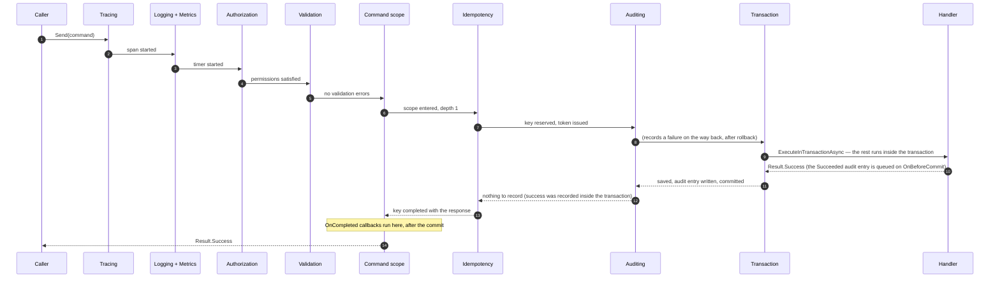
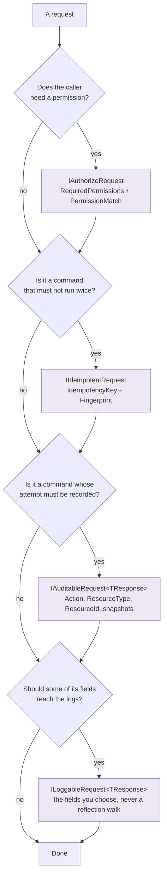
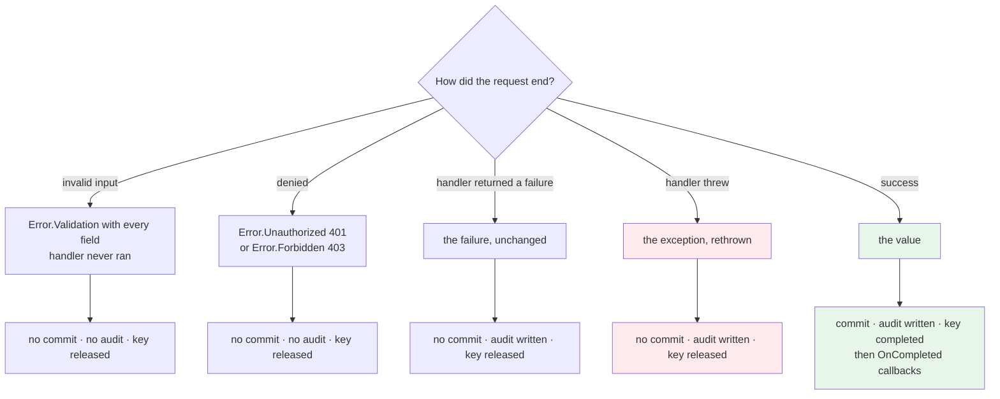

# SharedKernel.Application.Behaviors


-5c6bc0)


**The cross-cutting half of a request: tracing, logging, metrics, authorization, validation, idempotency,
transactions and auditing — composed in one fixed order, each opted into explicitly.**

A handler decides business outcomes. Everything around that decision lives here, so adding an audit trail or
an idempotency guard later changes a marker interface on a command, never a handler body. The order the
behaviors run in is fixed by this package rather than by your registration order, because the order is a
correctness property: authorization has to precede validation, a commit has to precede a cache eviction.

| You get | So that |
| --- | --- |
| A fixed five-stage pipeline you opt into per behavior | Two services compose the same request the same way, and the order can't drift |
| Expected failures as `Result` values | A denial or an invalid field returns an error the caller handles — exceptions stay for genuine faults |
| Fail-closed authorization | A request that declares no permissions is denied, not waved through |
| Commit only on success, only once | A handler that returns a failure persists nothing, and a nested command joins the outer transaction |
| `ICommandScope.OnCompleted` | Work that must follow a commit — publish, evict, notify — runs after it, or not at all |
| Idempotency with a request fingerprint | A retried submission replays its original response; the same key with a different body is rejected |
| Error-aware telemetry | Spans, metrics and logs all carry the error type and code, so a dashboard can alert on *what* failed |
| `AddBehavior(type, stage)` | Your own behavior lands in the canonical order instead of wherever it was registered |

**Dependencies:** `SharedKernel.Application`, `SharedKernel.Application.Abstractions`, `SharedKernel.Primitives`, `MediatR`, `FluentValidation`, and
first-party `Microsoft.Extensions.*` packages. **No cache, no Polly, no hosting, no `SharedKernel.Core`** —
caching behaviors live in the separate
[`SharedKernel.Application.Behaviors.Caching`](../SharedKernel.Application.Behaviors.Caching/README.md).

## Contents

- [Install](#install)
- [Quick start](#quick-start)
- [The pipeline](#the-pipeline)
- [What each behavior does](#what-each-behavior-does)
- [What happens when something fails](#what-happens-when-something-fails)
- [Seams you must register](#seams-you-must-register)
- [Nested commands and `ICommandScope`](#nested-commands-and-icommandscope)
- [Extending the pipeline](#extending-the-pipeline)
- [Telemetry reference](#telemetry-reference)
- [Pitfalls](#pitfalls)
- [Testing](#testing)
- [Package](#package)

## Install

```xml
<PackageReference Include="SharedKernel.Application.Behaviors" Version="*" />
```

## Quick start

The zero-prerequisite preset. These four behaviors need nothing registered beyond MediatR itself:

```csharp
using SharedKernel.Application.Behaviors.Extensions;

builder.Services.AddMediatR(cfg => cfg.RegisterServicesFromAssembly(typeof(PlaceOrderCommand).Assembly));
builder.Services.AddSharedKernelApplication();

builder.Services.AddSharedKernelApplicationBehaviors()
    .AddDefaultBehaviors()     // Tracing, Logging, Metrics, Validation
    .Build();                  // ← Build() is not optional: nothing is registered until you call it
```

Everything else is a deliberate opt-in, because each one needs a seam you have to provide:

```csharp
builder.Services.AddSharedKernelRequestContext();                        // IRequestContext (13.ServiceDefaults.Security)
builder.AddSharedKernelPostgres<OrderDbContext>("orders", p => p.UseAuditTrail()); // IUnitOfWork + IAuditTrailWriter (06.Persistence)
builder.Services.AddScoped<IRequestIdempotencyStore, RedisRequestIdempotencyStore>();

builder.Services.AddSharedKernelApplicationBehaviors()
    .AddDefaultBehaviors()
    .AddAuthorizationBehavior()
    .AddIdempotencyBehavior()
    .AddTransactionBehavior()
    .AddAuditingBehavior()
    .Build();
```

`Build()` fails fast: opting into a behavior whose seam is missing throws `InvalidOperationException` naming
both, at startup. It also refuses a second call on the same builder, which would otherwise register every
behavior twice.

## The pipeline

Five stages, always in this order, regardless of the order you called the `Add…` methods:

| # | Stage | Behavior | Applies to | Opt-in |
| --- | --- | --- | --- | --- |
| 1 | Observability | `TracingBehavior` | every request | `AddTracingBehavior()` |
| 2 | Observability | `LoggingBehavior` | every request | `AddLoggingBehavior()` |
| 3 | Observability | `MetricsBehavior` | every request | `AddMetricsBehavior()` |
| 4 | Authorization | `AuthorizationBehavior` | requests implementing `IAuthorizeRequest` | `AddAuthorizationBehavior()` |
| 5 | Validation | `ValidationBehavior` | every request with a registered validator | `AddValidationBehavior()` |
| 6 | Query | *(yours, or the caching package's)* | queries | `AddBehavior(…, PipelineStage.Query)` |
| 7 | Command | command scope | commands | automatic when any command behavior is on |
| 8 | Command | `IdempotencyBehavior` | commands implementing `IIdempotentRequest` | `AddIdempotencyBehavior()` |
| 9 | Command | `AuditingBehavior` (outer half: failures, after rollback) | commands implementing `IAuditableRequest<T>` | `AddAuditingBehavior()` |
| 10 | Command | `TransactionBehavior` (the rest runs inside `ExecuteInTransactionAsync`) | commands | `AddTransactionBehavior()` |
| 10b | Command | inner auditing half (`Succeeded`, queued on `OnBeforeCommit`) | commands implementing `IAuditableRequest<T>` | `AddAuditingBehavior()` |
| 11 | Command | *(yours, or `CacheInvalidationBehavior`)* | commands | `AddBehavior(…, PipelineStage.Command)` |

Tracing is outermost so every log line below it carries the trace id. **Authorization precedes validation**
deliberately: a caller who may not perform an operation should not learn its validation rules, and validators
often hit the database.

Here is one successful command, end to end:



Read the arrows down as "before the handler" and up as "after it". The `Succeeded` audit entry lands
**inside** the transaction, a `Failed` one after the rollback, the idempotency key is completed **after** the
commit, and post-commit callbacks run last of all.

## Which markers do I implement?

Tracing, logging, metrics and validation apply to every request once you opt in — a request declares nothing.
The other four are opt-in **per request**, through a marker it implements:



They compose: a refund command can be all four at once. Caching markers live in the
[caching package](../SharedKernel.Application.Behaviors.Caching/README.md).

## What each behavior does

### `TracingBehavior`

Starts an `Activity` named after the request type (`PlaceOrderCommand`), tagged `request.type` (full name)
and `request.kind` (`command`/`query`/`request`). On a failed `Result` it sets the span status to `Error`
with `error.type` and `error.code`; on an exception it sets `Error`, records the exception as a span event,
and rethrows. No listener registered means no allocation.

### `LoggingBehavior`

`Debug` on entry, then one completion line: `Information` on success, `Warning` when the elapsed time crosses
`SlowRequestThreshold` (500 ms by default), `Warning` with the error type and code on a failed `Result`, and
`Error` with the exception on a throw. Payloads are never logged unless the request opts in by implementing
`ILoggableRequest<TResponse>`, which supplies exactly the fields it considers safe:

```csharp
public sealed record PlaceOrderCommand(string Customer, string CardNumber, decimal Amount)
    : ICommand<Guid>, ILoggableRequest<Result<Guid>>
{
    public IReadOnlyDictionary<string, object?> LoggableRequestFields =>
        new Dictionary<string, object?> { ["Customer"] = Customer, ["Amount"] = Amount };   // never CardNumber

    public IReadOnlyDictionary<string, object?>? GetLoggableResponseFields(Result<Guid> response) =>
        response.IsSuccess ? new Dictionary<string, object?> { ["OrderId"] = response.Value } : null;
}
```

Configure the threshold with `services.Configure<ApplicationLoggingOptions>(…)`. It is validated at startup
and must be greater than zero.

### `MetricsBehavior`

Records one histogram measurement per request — `sharedkernel.application.request.duration`, **in seconds**,
from an `IMeterFactory` meter named `SharedKernel.Application`. Tags: `request.type`, `request.kind`,
`outcome` (`success`/`failure`/`exception`), and `error.type` when not successful. Recorded in a `finally`,
so a throw is measured too.

### `AuthorizationBehavior`

Applies to requests implementing `IAuthorizeRequest`:

```csharp
public sealed record RefundOrderCommand(Guid OrderId, decimal Amount) : ICommand, IAuthorizeRequest
{
    public IReadOnlyCollection<string> RequiredPermissions => ["orders.refund"];
    // PermissionMatch.All by default; PermissionMatch.Any when one of several is enough.
}
```

| Situation | Result |
| --- | --- |
| `IRequestContext.IsAuthenticated` is false | `Error.Unauthorized("authorization.unauthenticated")` → 401 |
| `RequiredPermissions` is empty | `Error.Forbidden("authorization.no_permissions_declared")` → 403 |
| A required permission is missing | `Error.Forbidden(ErrorCodes.Forbidden.InsufficientPermission)` → 403 |

It never throws, and it never echoes permission names into the message a caller sees. An empty list being a
denial is the point: a marker that means "authorize me" must never be satisfiable by declaring nothing.

### `ValidationBehavior`

Runs every registered `IValidator<TRequest>` **sequentially** — not in parallel, because two async validators
sharing a scoped `DbContext` would throw — collects every failure, and returns
`Error.Validation(errors)`: one error with code `validation.failed` carrying each field failure in
`Error.Details`. It does not throw. At the HTTP boundary `14.Presentation` renders that as a 400 with a
per-field `errors` map; `11.Communication.Rest` rebuilds the same detail on the calling side.

### `IdempotencyBehavior`

Applies to commands implementing `IIdempotentRequest`. It reserves the key through `IRequestIdempotencyStore`
before the handler runs, and settles it afterwards:

| `TryBeginAsync` returns | The behavior |
| --- | --- |
| `Started` | Runs the handler. On success: `CompleteAsync` with the serialized response. On a failed `Result`: `ReleaseAsync`, so the caller may retry with the same key. On an exception: `ReleaseAsync`, then rethrows |
| `Completed` | Returns the stored response — the original outcome, not a fresh conflict |
| `InProgress` | `Error.Conflict("idempotency.in_progress")` |
| `FingerprintMismatch` | `Error.Conflict("idempotency.key_reused")` |

The fingerprint defaults to a SHA-256 hash of the serialized request. **Set `Fingerprint` explicitly on any
command you expect to be retried across a deploy**, because the automatic hash changes the moment the command
type gains a property, and never matches itself when the command carries a timestamp or a generated id:

```csharp
public sealed record TransferMoney(Guid From, Guid To, decimal Amount, DateTimeOffset RequestedAt, string IdempotencyKey)
    : ICommand, IIdempotentRequest
{
    public string? Fingerprint => $"{From}:{To}:{Amount}";   // RequestedAt deliberately excluded
}
```

A nested command skips this behavior entirely — the outermost command owns the key.

### `TransactionBehavior`

Runs the rest of the pipeline and the handler **inside** `IUnitOfWork.ExecuteInTransactionAsync`
(`SharedKernel.Application.Abstractions`): the unit of work saves what was staged, runs the `OnBeforeCommit`
callbacks and commits — **only for the outermost command, and only when the response is successful**. A failed
`Result` rolls back, so a handler that mutated an aggregate before deciding to fail leaves no trace; an
exception rolls back and propagates.

- **Handlers must be re-runnable.** Under a retrying execution strategy (on by default in `06.Persistence`) a
  transient failure replays the whole delegate: the unit of work discards what the failed attempt staged and the
  handler runs again. Load what you need through repositories inside the handler; keep HTTP calls and messages
  out of it — queue them with `ICommandScope.OnCompleted`, which runs after the commit. Callbacks queued by a
  discarded attempt are dropped.
- **A command sent while a transaction is active joins it.** If the joined command fails, the transaction becomes
  rollback-only: the outer command commits nothing and, if it would have succeeded, gets
  `TransactionRolledBackException`.
- **An ambiguous commit is not retried.** `CommitOutcomeUnknownException` means the commit may or may not have
  happened — re-read (or rely on the idempotency key) before repeating.

### `AuditingBehavior`

Applies to commands implementing `IAuditableRequest<TResponse>`, which supplies its own opaque,
pre-serialized snapshots — this package never reflects over your command:

```csharp
public sealed record UpdateLimitCommand(Guid CustomerId, decimal NewLimit, string? BeforeSnapshot)
    : ICommand, IAuditableRequest<Result>
{
    public string Action => "customer.limit.update";
    public string ResourceType => "Customer";
    public string ResourceId => CustomerId.ToString("D");
    public string? GetAfterSnapshot(Result response) => response.IsSuccess ? $"{{\"limit\":{NewLimit}}}" : null;
}
```

An entry is written for **all three outcomes** — success, business failure, and a handler that throws —
because a rejected high-risk attempt is usually the compliance-relevant event. `AuditEntry.Outcome` and
`ErrorCode` carry which it was: the error code on a business failure, the exception type name on a fault.

`AddAuditingBehavior()` registers two halves around `TransactionBehavior`. The inner half queues the
`Succeeded` entry on `IUnitOfWork.OnBeforeCommit`, so it is written in the same transaction as the change it
attests to and commits or rolls back with it (a failed success write rolls the change back). The outer half,
outside the transaction, records every failure — a failed `Result`, an exception, or the commit itself failing —
**after** the rollback, on the writer's own connection. If the audit write throws while handling an exception,
the **original** exception still propagates and the audit failure is logged. Actor, tenant, time and
correlation are never in `AuditEntry`: the writer resolves them from `IRequestContext`.

## What happens when something fails



The rule in one sentence: **only a successful outcome persists anything.** The exception is the audit trail,
which records the attempt either way.

## Seams you must register

Each is a small interface owned by `05.Application` and implemented by infrastructure. That is what keeps
`05.Application` from referencing persistence, security or a cache.

| Seam | Declared in | Needed by | Implemented by |
| --- | --- | --- | --- |
| `IRequestContext` | `SharedKernel.Application.Abstractions` | Authorization, caching, auditing | `13.ServiceDefaults.Security`'s `AddSharedKernelRequestContext()` (over `12.Security`), or the shipped `SystemRequestContext` |
| `IUnitOfWork` | `SharedKernel.Application.Abstractions` | Transaction, auditing | `06.Persistence` (`AddSharedKernelPostgres`), directly — no adapter |
| `IRequestIdempotencyStore` | this package | Idempotency | `18.Idempotency`'s Redis or EF Core store |
| `IAuditTrailWriter` | `SharedKernel.Application.Abstractions` | Auditing | `06.Persistence.EfCore.Auditing` (`UseAuditTrail()`), directly |

`06.Persistence` implements the same `IUnitOfWork`/`IAuditTrailWriter`/`IRequestContext` the behaviors consume;
there is exactly one of each.

## Nested commands and `ICommandScope`

A handler that sends another command creates a nested command in the same DI scope. `ICommandScope` tracks
that so the inner one does not open a second transaction or consume its own idempotency key:

| | Outermost command | Nested command |
| --- | --- | --- |
| `TransactionBehavior` | Commits | Joins the outer transaction — no commit of its own |
| `IdempotencyBehavior` | Reserves and settles the key | Skipped entirely |
| `AuditingBehavior` | Writes an entry | Writes its own entry |

Handlers can use the same scope to queue work that must happen **after** the commit:

```csharp
public sealed class PlaceOrderHandler(IOrderRepository repository, ICommandScope scope, IEventPublisher events)
    : ICommandHandler<PlaceOrderCommand, Guid>
{
    public async Task<Result<Guid>> Handle(PlaceOrderCommand command, CancellationToken cancellationToken)
    {
        var order = Order.Place(command.Customer, command.Amount);
        await repository.AddAsync(order, cancellationToken);

        scope.OnCompleted(ct => events.PublishAsync(new OrderPlaced(order.Id.Value), ct));

        return Result<Guid>.Success(order.Id.Value);
    }
}
```

Callbacks run once, after the outermost command commits, in registration order. A nested command's callbacks
merge into the outer command's and run with them; if the nested command fails, its callbacks are discarded.
A callback that throws is logged and does not change the response — the work is already committed. Calling
`OnCompleted` outside a command throws.

## Extending the pipeline

Your own behavior goes into a named stage instead of wherever it happened to be registered:

```csharp
builder.Services.AddSharedKernelApplicationBehaviors()
    .AddDefaultBehaviors()
    .AddBehavior(typeof(FeatureFlagBehavior<,>), PipelineStage.Authorization, typeof(IFeatureManager))
    .Build();
```

The trailing types are required services: `Build()` throws if one is missing, the same way the built-in
opt-ins do. Built-ins run first within a stage, then your behaviors in the order you added them.
`Build()` also verifies the type is an open generic implementing `IPipelineBehavior<,>`, and rejects an
undefined stage value.

## Telemetry reference

| Signal | Name | Detail |
| --- | --- | --- |
| Activity source | `SharedKernel.Application` | Span name = request type short name, kind Internal |
| Span tags | | `request.type`, `request.kind`, plus `error.type`/`error.code` on failure |
| Meter | `SharedKernel.Application` | via `IMeterFactory` |
| Histogram | `sharedkernel.application.request.duration` | **seconds**; tags `request.type`, `request.kind`, `outcome`, `error.type` |

| EventId | Level | Emitted when |
| --- | --- | --- |
| 5100 | Debug | A request enters the pipeline |
| 5101 | Information | A request completed successfully |
| 5102 | Warning | A successful request crossed `SlowRequestThreshold` |
| 5103 | Warning | A request returned a failed `Result` (carries error type and code) |
| 5104 | Error | A request threw |
| 5110 | Error | A post-commit `OnCompleted` callback threw |
| 5120 | Warning | `CompleteAsync` reported the idempotency reservation was lost |
| 5130 | Error | The audit write failed while handling a handler exception |

Wire the meter and activity source into a host with `13.ServiceDefaults`' `WithApplicationTelemetry()`, which
also registers the seconds-based bucket boundaries this histogram needs.

## Pitfalls

**Forgetting `Build()`.** The `Add…` calls only set flags. Without `Build()` nothing is registered and every
request runs bare — the failure is silence, not an error. (The platform's own sample shipped this bug.)

**A response type that is not `Result`/`Result<T>`.** Authorization and idempotency short-circuit by
*constructing* a failed response. Any other response type throws `InvalidOperationException` at the first
denial. Analyzer `SK0040` catches this at build time.

**Assuming registration order matters.** It does not. The stage decides the order; `AddAuditingBehavior()`
first and `AddTracingBehavior()` last compose identically.

**Expecting a failed `Result` to roll back.** Nothing is rolled back, because nothing was committed — the
commit simply never happens. If your handler wrote through a second store directly, that write is yours to
undo.

**Reusing an idempotency key after a business failure.** The key is released on failure, so the same key is
accepted again. That is intentional: a rejected command should be correctable and resubmitted.

**Letting the automatic fingerprint ride.** Adding a property to a command changes it, and every in-flight
retry across the deploy comes back as `idempotency.key_reused`. Set `Fingerprint` on commands that matter.

**Calling `ICommandScope.OnCompleted` from a query handler.** It throws — no command is active. Post-commit
work only makes sense where there is a commit.

**Registering `IRequestContext` as a singleton over a scoped identity.** The first request's caller would be
frozen in for the lifetime of the process. Register it scoped.

## Testing

`16.Testing`'s `ApplicationPipelineTestHarness` composes a real MediatR pipeline with real behaviors:

```csharp
using var harness = new ApplicationPipelineTestHarness();

harness.Services.AddSingleton<IRequestContext>(new FakeRequestContext { Permissions = ["orders.refund"] });
harness.Services.AddScoped<IUnitOfWork, FakeUnitOfWork>();
harness.Services.AddSingleton<IRequestHandler<RefundOrderCommand, Result>, RefundOrderHandler>();
harness.AddBehaviors().AddAuthorizationBehavior().AddTransactionBehavior().Build();
harness.Build<RefundOrderCommandTests>();

var result = await harness.SendAsync(new RefundOrderCommand(orderId, 10m));

Assert.True(result.IsSuccess);
```

Useful assertions from there:

```csharp
// A denial, not an exception:
harness.Services.AddSingleton<IRequestContext>(new FakeRequestContext { Permissions = [] });
Assert.Equal(ErrorType.Forbidden, result.Error.Type);

// A failed command commits nothing:
Assert.Equal(0, fakeUnitOfWork.SaveChangesCallCount);

// What the pipeline emitted:
harness.WithActivityCapture();
Assert.Contains(harness.CapturedActivities, a => a.DisplayName == "RefundOrderCommand");
Assert.Contains(harness.CapturedMeasurements, m => m.InstrumentName == "sharedkernel.application.request.duration");
```

`AddFakeApplicationBehaviorServices()` registers `IRequestContext`, `IUnitOfWork` and
`IRequestIdempotencyStore` fakes in one call. `FakeRequestIdempotencyStore` implements the real reservation
protocol, including rejecting a stale token, so an idempotency test exercises the same states the Redis and
EF Core stores produce.

## Package

| | |
| --- | --- |
| **Depends on** | `SharedKernel.Application`, `SharedKernel.Primitives`, `MediatR` 12.4.1, `FluentValidation`, `Microsoft.Extensions.{DependencyInjection.Abstractions, Diagnostics, Logging, Logging.Abstractions, Options, Options.DataAnnotations}` |
| **Does not depend on** | Any cache, Polly, hosting, or `SharedKernel.Core` — enforced by an architecture test |
| **Target** | `net10.0` |
| **Public API** | Tracked; an unrecorded change fails the build |
| **EventId range** | 5100–5199, within `01.Core`'s `05.Application` block |

Maintainer rules live in [`05.Application/CLAUDE.md`](../CLAUDE.md); the layer overview, including the
pipeline and commit diagrams, is in [`05.Application/README.md`](../README.md).
