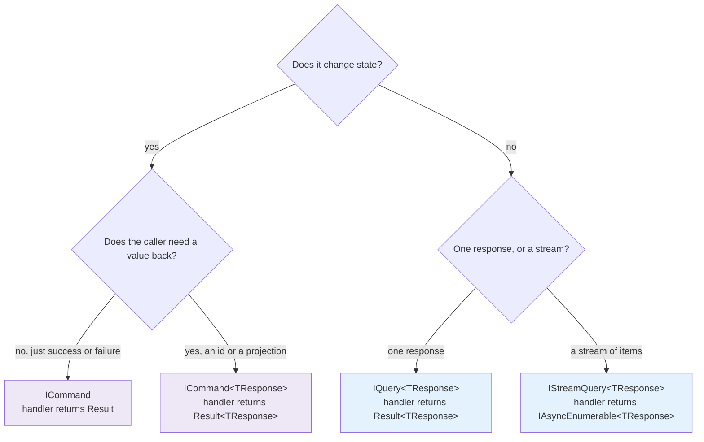

# SharedKernel.Application


-5c6bc0)


**The CQRS vocabulary every service in the platform speaks: commands, queries, their handlers, the caller
behind a request, and the bridge that turns a domain event into a MediatR notification.**

This package is deliberately small. It declares *shapes*, runs almost no logic, and performs no I/O — so
the layer that defines what a request is stays free of the concerns that act on one. The behaviors that
log, authorize, validate, commit and audit those requests live in
[`SharedKernel.Application.Behaviors`](../SharedKernel.Application.Behaviors/README.md).

| You get | So that |
| --- | --- |
| `ICommand`, `ICommand<TResponse>`, `IQuery<TResponse>` | A request's *intent* is visible in its declaration, and the pipeline can treat writes and reads differently |
| `ICommandBase` / `IQueryBase` markers | A behavior constrains to "any command" or "any query" once, and the container simply never resolves it for the other kind |
| Handler aliases (`ICommandHandler<>`, `IQueryHandler<,>`) | A handler class says what it is, instead of `IRequestHandler<PlaceOrder, Result<Guid>>` |
| Every handler returns `Result`/`Result<T>` | An expected failure is a value the caller must handle, not an exception thrown past it |
| `IRequestContext` (+ `SystemRequestContext`, `AnonymousRequestContext`) | The pipeline can ask who is calling without this layer knowing anything about HTTP or JWTs |
| `IStreamQuery<TResponse>` and its handler alias | A large read streams item by item instead of materializing in memory |
| The domain-event → MediatR bridge | `03.Domain` raises events with zero NuGet dependencies, and this layer absorbs MediatR on its behalf |

**Dependencies:** `SharedKernel.Primitives`, `SharedKernel.Domain`, `MediatR`,
`Microsoft.Extensions.DependencyInjection.Abstractions`. Nothing else — no HTTP, no persistence, no security
stack, no cache.

## Contents

- [Install](#install)
- [Quick start](#quick-start)
- [Which interface do I implement?](#which-interface-do-i-implement)
- [Walkthrough](#walkthrough)
  - [1. A command that changes state](#1-a-command-that-changes-state)
  - [2. A query that reads](#2-a-query-that-reads)
  - [3. Who is calling — `IRequestContext`](#3-who-is-calling--irequestcontext)
  - [4. Handling a domain event](#4-handling-a-domain-event)
  - [5. Streaming a large read](#5-streaming-a-large-read)
- [Reference](#reference)
- [Pitfalls](#pitfalls)
- [Testing](#testing)
- [Package](#package)

## Install

```xml
<PackageReference Include="SharedKernel.Application" Version="*" />
```

```csharp
using SharedKernel.Application.Extensions;

builder.Services.AddMediatR(cfg => cfg.RegisterServicesFromAssembly(typeof(PlaceOrderCommand).Assembly));
builder.Services.AddSharedKernelApplication();
```

`AddSharedKernelApplication()` registers **one** thing: `IDomainEventDispatcher` → `MediatRDomainEventDispatcher`
(scoped). It deliberately does **not** call `AddMediatR` — your service owns which assemblies get scanned.

## Quick start

```csharp
using MediatR;
using SharedKernel.Application.Messaging;
using SharedKernel.Presentation.WebApi;   // ToCreated (14.Presentation)
using SharedKernel.Primitives.Results;

// 1. The command: what the caller wants, and what it gets back on success.
public sealed record PlaceOrderCommand(string Customer, decimal Amount) : ICommand<Guid>;

// 2. The handler: business decisions only. No logging, no try/catch, no SaveChanges.
public sealed class PlaceOrderHandler(IOrderRepository repository, IClock clock)
    : ICommandHandler<PlaceOrderCommand, Guid>
{
    public async Task<Result<Guid>> Handle(PlaceOrderCommand command, CancellationToken cancellationToken)
    {
        var order = Order.Place(command.Customer, command.Amount, clock);
        if (order.IsFailure)
            return Result<Guid>.Failure(order.Error);   // an expected outcome, not an exception

        await repository.AddAsync(order.Value, cancellationToken);
        return Result<Guid>.Success(order.Value.Id.Value);
    }
}

// 3. The endpoint: map the Result to HTTP and stop thinking about it (201 with Location, or a problem response).
app.MapPost("/orders", (PlaceOrderCommand command, ISender sender, CancellationToken ct) =>
    sender.Send(command, ct).ToCreated(id => $"/orders/{id}"));
```

Three properties hold from here on, and they are what the rest of the platform builds on:

- **The handler never throws for an expected failure.** A blocked customer, a missing order, a rule
  violation — each is a `Result.Failure` carrying an `Error`.
- **The handler never performs cross-cutting work.** Commit, retry, cache, audit and log are the pipeline's
  job, and adding one later changes no handler.
- **The response type is `Result` or `Result<T>`.** Several behaviors short-circuit by *constructing* a
  failed response, which only those types can express.

## Which interface do I implement?



| Request type | Handler alias | Handler returns | Transaction, idempotency, auditing apply? |
| --- | --- | --- | --- |
| `ICommand` | `ICommandHandler<TCommand>` | `Result` | Yes — it is a command |
| `ICommand<TResponse>` | `ICommandHandler<TCommand,TResponse>` | `Result<TResponse>` | Yes |
| `IQuery<TResponse>` | `IQueryHandler<TQuery,TResponse>` | `Result<TResponse>` | No — those behaviors constrain to `ICommandBase` |
| `IStreamQuery<TResponse>` | `IStreamQueryHandler<TQuery,TResponse>` | `IAsyncEnumerable<TResponse>` | No — no pipeline behavior applies at all |

`ICommandBase` and `IQueryBase` carry no members. They exist so a behavior can be written once against "a
command" — the container then resolves that behavior for commands and silently skips it for everything else.
That is a registration-time fact, not an `if` inside the behavior.

## Walkthrough

### 1. A command that changes state

```csharp
public sealed record CancelOrderCommand(Guid OrderId, string Reason) : ICommand;

public sealed class CancelOrderHandler(IOrderRepository repository)
    : ICommandHandler<CancelOrderCommand>
{
    public async Task<Result> Handle(CancelOrderCommand command, CancellationToken cancellationToken)
    {
        var order = await repository.GetAsync(new OrderId(command.OrderId), cancellationToken);
        if (order is null)
            return Result.Failure(Error.NotFound("order.not_found", "The order does not exist."));

        return order.Cancel(command.Reason);   // the aggregate returns Result
    }
}
```

`ICommand` binds the response to the non-generic `Result`, so a caller still branches on `IsSuccess` without
an exception and without an unused return value.

### 2. A query that reads

```csharp
public sealed record GetOrderQuery(Guid OrderId) : IQuery<OrderDto>;

public sealed class GetOrderHandler(IOrderReadService reads) : IQueryHandler<GetOrderQuery, OrderDto>
{
    public async Task<Result<OrderDto>> Handle(GetOrderQuery query, CancellationToken cancellationToken)
    {
        var dto = await reads.FindAsync(query.OrderId, cancellationToken);
        return dto is null
            ? Result<OrderDto>.Failure(Error.NotFound("order.not_found", "The order does not exist."))
            : Result<OrderDto>.Success(dto);
    }
}
```

A query never implements `ICommandBase`, so `TransactionBehavior`, `IdempotencyBehavior` and
`AuditingBehavior` are simply absent from its pipeline. Nothing is skipped at runtime — they never resolve.

### 3. Who is calling — `IRequestContext`

`AuthorizationBehavior` needs an identity, but this layer must not reference `12.Security`. `IRequestContext`
is the seam in between:

```csharp
namespace SharedKernel.Application.Context;

public interface IRequestContext
{
    bool IsAuthenticated { get; }
    string? UserId { get; }
    Guid? TenantId { get; }
    ValueTask<bool> HasPermissionAsync(string permission, CancellationToken cancellationToken);
}
```

A service with real callers implements it over whatever it already has — typically `12.Security`'s
`IUserContext`/`ITenantProvider`:

```csharp
public sealed class UserRequestContext(IUserContext user, ITenantProvider tenants) : IRequestContext
{
    public bool IsAuthenticated => user.IsAuthenticated;
    public string? UserId => user.IsAuthenticated ? user.UserId.ToString("D") : null;
    public Guid? TenantId => tenants.TenantId == Guid.Empty ? null : tenants.TenantId;

    public ValueTask<bool> HasPermissionAsync(string permission, CancellationToken cancellationToken) =>
        ValueTask.FromResult(user.HasPermission(permission) || user.HasRole(permission));
}

builder.Services.AddScoped<IRequestContext, UserRequestContext>();
```

Two implementations ship for callers that have no HTTP request at all:

```csharp
// A Temporal activity or a scheduled job: a named identity with exactly the permissions it needs.
services.AddScoped<IRequestContext>(_ => new SystemRequestContext(
    permissions: ["orders.expire", "invoices.issue"],
    identity: "billing-worker"));

// An unauthenticated path: authenticated false, no user, no tenant, no permissions.
services.AddScoped<IRequestContext>(_ => AnonymousRequestContext.Instance);
```

`SystemRequestContext` takes an explicit permission list on purpose. There is no "system bypasses
authorization" mode, because a worker that can do everything is indistinguishable from a bug that does
everything.

### 4. Handling a domain event

`03.Domain` has no NuGet dependencies, so `IDomainEvent` cannot implement MediatR's `INotification`. This
package bridges the two: `DomainEventNotification<TDomainEvent>` wraps the raw event, and
`MediatRDomainEventDispatcher` publishes it.

```csharp
public sealed class SendOrderConfirmation(IEmailSender email) : IDomainEventHandler<OrderPlaced>
{
    public Task Handle(OrderPlaced domainEvent, CancellationToken cancellationToken) =>
        email.SendAsync(domainEvent.CustomerEmail, cancellationToken);
}

// One registration per event type — no assembly scanning, no MakeGenericType at startup.
builder.Services.AddDomainEventHandler<OrderPlaced, SendOrderConfirmation>();
```

You implement `IDomainEventHandler<TDomainEvent>` against the **raw domain event** — never MediatR's
`INotificationHandler<>`. The wrapper is an implementation detail you should not have to name.

**When events are dispatched.** `06.Persistence`'s `SharedKernelDbContext.SaveChangesAsync` collects the events
from tracked aggregates and dispatches them **before** the physical save — on every save path (the unit of
work, a seeder, a factory user) — repeating until handlers raise no more, then writes everything in one save.
Consequences worth internalising:

- **Dispatch is serial**, in list order, one handler chain at a time. There is no parallel mode: concurrent
  handlers would share one `DbContext`, which is not thread-safe.
- **A handler's database changes join the same save and the same transaction.** Inside `TransactionBehavior`
  they commit or roll back with the command.
- **A handler exception abandons the save** (the change tracker is cleared) and fails the request; nothing is
  written. Because dispatch happens before commit, a handler with an effect outside the database — sending mail,
  calling another service — must not run here: put it behind an integration event (`04.Contracts` +
  `07.Messaging`) or `ICommandScope.OnCompleted`, which runs after the commit.
- **No dispatcher registered** (`AddSharedKernelApplication()` not called): the events are discarded with a
  warning.

### 5. Streaming a large read

```csharp
public sealed record ExportOrdersQuery(DateOnly From) : IStreamQuery<OrderRow>;

public sealed class ExportOrdersHandler(IOrderReadService reads)
    : IStreamQueryHandler<ExportOrdersQuery, OrderRow>
{
    public IAsyncEnumerable<OrderRow> Handle(ExportOrdersQuery query, CancellationToken cancellationToken) =>
        reads.StreamAsync(query.From, cancellationToken);
}

await foreach (var row in sender.CreateStream(query, ct))
    await writer.WriteAsync(row, ct);
```

Two deliberate differences from every other request here:

- **Items are not wrapped in `Result<T>`.** A stream's natural error channel is an exception that ends
  enumeration. Wrapping each item would force every consumer to unwrap on every iteration, and a single
  terminal `Result` cannot say "the stream opened fine, then item 4,000 failed."
- **No pipeline behavior applies.** MediatR routes streams through a separate interface
  (`IStreamPipelineBehavior<,>`), and this platform ships none. Logging, validation and authorization for a
  stream are the handler's own responsibility.

## Reference

### Namespaces

| Namespace | Holds |
| --- | --- |
| `SharedKernel.Application.Messaging` | `ICommandBase`, `ICommand`, `ICommand<TResponse>`, `IQueryBase`, `IQuery<TResponse>`, and the three handler aliases |
| `SharedKernel.Application.Context` | `IRequestContext`, `SystemRequestContext`, `AnonymousRequestContext` |
| `SharedKernel.Application.Streaming` | `IStreamQuery<TResponse>`, `IStreamQueryHandler<TQuery,TResponse>` |
| `SharedKernel.Application.DomainEvents` | `IDomainEventHandler<TDomainEvent>`, `DomainEventNotification<TDomainEvent>`, `MediatRDomainEventDispatcher` |
| `SharedKernel.Application.Extensions` | `AddSharedKernelApplication()`, `AddDomainEventHandler<TDomainEvent,THandler>()` |

### Messaging vocabulary

| Type | Shape |
| --- | --- |
| `ICommandBase` | Marker. Implemented by both command interfaces, never by a query |
| `ICommand` | `ICommandBase`, `IRequest<Result>` |
| `ICommand<TResponse>` | `ICommandBase`, `IRequest<Result<TResponse>>` |
| `IQueryBase` | Marker. Implemented by `IQuery<TResponse>` |
| `IQuery<TResponse>` | `IQueryBase`, `IRequest<Result<TResponse>>` |
| `ICommandHandler<TCommand>` | `IRequestHandler<TCommand, Result>` |
| `ICommandHandler<TCommand,TResponse>` | `IRequestHandler<TCommand, Result<TResponse>>` |
| `IQueryHandler<TQuery,TResponse>` | `IRequestHandler<TQuery, Result<TResponse>>` |
| `IStreamQuery<TResponse>` | `IStreamRequest<TResponse>` |
| `IStreamQueryHandler<TQuery,TResponse>` | `IStreamRequestHandler<TQuery, TResponse>` |

The handler aliases add no members. They exist so a class declaration states its role.

### Request context

| Member | Meaning |
| --- | --- |
| `IsAuthenticated` | Whether a caller was identified at all. `AuthorizationBehavior` returns `Error.Unauthorized` (401) when false |
| `UserId` | The caller's opaque id, or `null` when anonymous. This package never parses or interprets it |
| `TenantId` | The tenant, or `null` when the request has none. Used for tenant-scoped cache keys |
| `HasPermissionAsync` | Whether the caller holds one permission. The string is opaque here — the implementation decides whether it is a scope, a role or a policy name |

Correlation id is deliberately absent: it flows ambiently through `Activity`/baggage, and repeating it on
every seam would invite two sources of truth.

| Implementation | `IsAuthenticated` | `UserId` | Permissions |
| --- | --- | --- | --- |
| `SystemRequestContext(permissions, identity = "system", tenantId = null)` | `true` | the supplied identity | exactly the supplied set |
| `AnonymousRequestContext.Instance` | `false` | `null` | none |

### DI extensions

| Call | Registers |
| --- | --- |
| `AddSharedKernelApplication()` | `IDomainEventDispatcher` → `MediatRDomainEventDispatcher` (scoped) |
| `AddDomainEventHandler<TDomainEvent,THandler>()` | `THandler` as `IDomainEventHandler<TDomainEvent>` (scoped), plus the internal adapter MediatR resolves (scoped) |

## Pitfalls

**A handler that throws for an expected failure.** Throwing skips the failure path the rest of the platform
is built on: the pipeline records an exception outcome instead of an error code, the transaction is not
committed *and* no `Result` reaches the caller to say why. Return `Result.Failure(error)`.

**A request whose response is not `Result`/`Result<T>`.** `IRequest<OrderDto>` compiles, and authorization or
idempotency on it throws at the first short-circuit, in production. Analyzer `SK0040` flags this at build
time — do not suppress it.

**Implementing `INotificationHandler<DomainEventNotification<T>>` yourself.** That is the adapter's job.
Implement `IDomainEventHandler<T>` and register it with `AddDomainEventHandler<,>`.

**Expecting behaviors to run for a stream.** They do not. `IStreamQuery<TResponse>` goes through MediatR's
separate streaming pipeline, and this platform registers nothing there.

**A `SystemRequestContext` with every permission.** It takes an explicit list so a worker's blast radius is
written down. Granting it everything makes the authorization behavior decorative.

**Calling `AddSharedKernelApplication()` and expecting behaviors.** It registers the domain-event dispatcher
only. Behaviors come from
[`SharedKernel.Application.Behaviors`](../SharedKernel.Application.Behaviors/README.md).

## Testing

`16.Testing`'s `SharedKernel.Testing` ships doubles for every seam here.

```csharp
var context = new FakeRequestContext { Permissions = ["orders.place"], TenantId = tenantId };

var result = await new PlaceOrderHandler(repository, new FakeClock()).Handle(command, default);

Assert.True(result.IsSuccess);
```

A handler needs no harness: it is a class returning a `Result`. To test the composed pipeline instead, use
`ApplicationPipelineTestHarness` — see the
[behaviors README](../SharedKernel.Application.Behaviors/README.md#testing).

## Package

| | |
| --- | --- |
| **Depends on** | `SharedKernel.Primitives`, `SharedKernel.Domain`, `MediatR` 12.4.1, `Microsoft.Extensions.DependencyInjection.Abstractions` |
| **Target** | `net10.0` |
| **Public API** | Tracked in `PublicAPI.Shipped.txt` / `PublicAPI.Unshipped.txt`; an unrecorded change fails the build |
| **Versioning** | One version across every package in the repo, from a single git tag (MinVer) |

**Why MediatR 12.4.1 specifically.** It is the last MIT-licensed release; v13 and later are commercial. The
version is pinned deliberately, and our interfaces inherit MediatR's, so it is part of this package's public
surface — a consuming service resolves the same 12.4.1.

Maintainer rules live in [`05.Application/CLAUDE.md`](../CLAUDE.md); the layer overview is in
[`05.Application/README.md`](../README.md).
