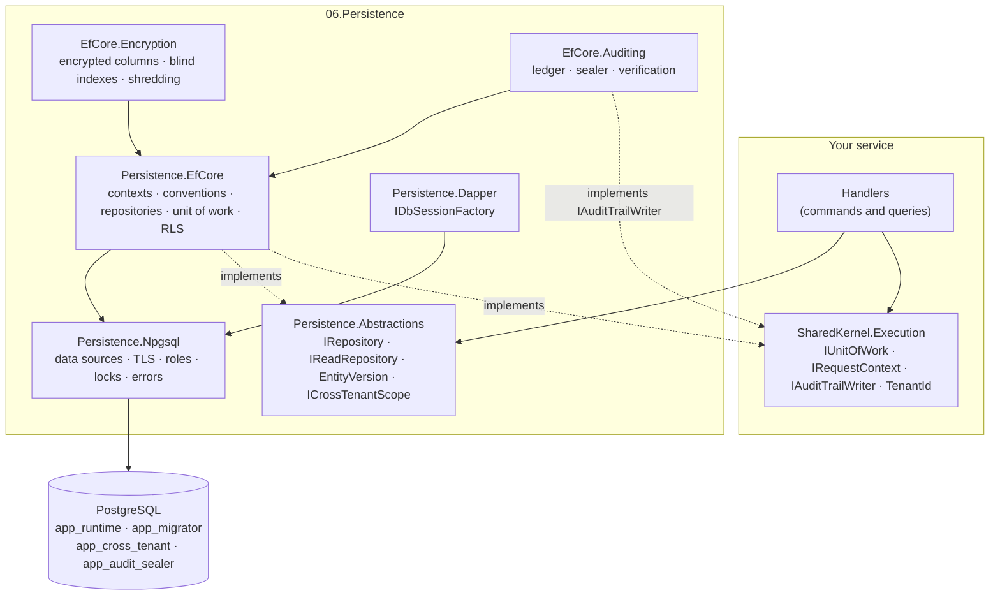
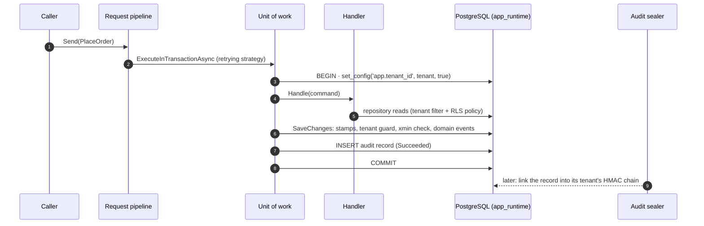

<div align="center">

# SharedKernel Persistence

**PostgreSQL persistence for multi-tenant .NET services — EF Core and Dapper, row-level security, field encryption and
a tamper-evident audit trail, registered with one call.**

[](https://dotnet.microsoft.com/)
[](../LICENSE)

[](https://www.postgresql.org/)
[](https://learn.microsoft.com/ef/core/)

[Packages](#packages) · [How they fit](#how-the-packages-fit-together) · [Get started](#get-started) · [Sample](#see-it-run) · [Guarantees](#guarantees)

</div>

---

## What this domain gives you

- **One registration call** — `builder.AddSharedKernelPostgres<TContext>("orders", p => …)` wires the data source,
  context, repositories for every aggregate and a retry-safe unit of work, validated when the host starts.
- **Tenant isolation three layers deep** — an EF Core query filter, a write guard and PostgreSQL row-level security
  bound per transaction, so hand-written SQL and a forgotten filter still see only the caller's tenant.
- **Optimistic concurrency everywhere** — `xmin` on every aggregate root, exposed as an opaque, ETag-ready
  `EntityVersion`.
- **Personal data encrypted at rest** — AES-256-GCM per column, searchable through blind indexes, rotatable and
  crypto-shreddable per tenant.
- **A trustworthy audit trail** — an append-only ledger sealed into per-tenant HMAC chains that anyone with the key
  can verify.
- **Hand-written SQL that plays by the same rules** — Dapper sessions join the unit of work, bind the tenant and pick
  the right database role.

## Packages

| Package | Tier | When you need it |
| --- | --- | --- |
| [SharedKernel.Persistence.Abstractions](SharedKernel.Persistence.Abstractions/README.md) | Abstractions | Your Application project reads or writes aggregates (`IRepository`, `IReadRepository`, `EntityVersion`, bulk, cross-tenant scope) |
| [SharedKernel.Persistence.EfCore](SharedKernel.Persistence.EfCore/README.md) | Adapter | The service uses EF Core — almost always |
| [SharedKernel.Persistence.Npgsql](SharedKernel.Persistence.Npgsql/README.md) | Adapter | Always (EfCore and Dapper bring it); holds the connection shape, TLS policy and **the canonical role script** |
| [SharedKernel.Persistence.Dapper](SharedKernel.Persistence.Dapper/README.md) | Adapter | The service writes SQL by hand |
| [SharedKernel.Persistence.EfCore.Encryption](SharedKernel.Persistence.EfCore.Encryption/README.md) | Adapter | Columns hold personal or secret data |
| [SharedKernel.Persistence.EfCore.Auditing](SharedKernel.Persistence.EfCore.Auditing/README.md) | Adapter | Commands must leave a verifiable audit trail |

Related packages elsewhere: [`SharedKernel.Execution`](../01.Core/SharedKernel.Execution/README.md) owns `IUnitOfWork`,
`IRequestContext`, `IAuditTrailWriter` and `TenantId`, which these packages implement or read;
[`SharedKernel.ServiceDefaults.Persistence`](../13.ServiceDefaults/SharedKernel.ServiceDefaults.Persistence/README.md)
provides the readiness checks; [`SharedKernel.Persistence.Testing`](../16.Testing/SharedKernel.Persistence.Testing/README.md)
provides fakes and a PostgreSQL fixture with the production role split.

## How the packages fit together



Application code depends on `SharedKernel.Execution` and `Persistence.Abstractions` only; the host references the
Adapter-tier implementations. EF Core and Dapper share one data source, one transaction and one tenant binding.

## Get started

The smallest end-to-end path: a multi-tenant service with row-level security, an audit trail and commands through the
application pipeline. These snippets are compiled and run against PostgreSQL by
[`PersistenceReadmeSampleTests`](../13.ServiceDefaults/SharedKernel.ServiceDefaults.Persistence/SharedKernel.ServiceDefaults.Persistence.Tests/Readme/PersistenceReadmeSampleTests.cs).

**1 — Packages.**

```xml
<PackageReference Include="SharedKernel.Persistence.EfCore" />
<PackageReference Include="SharedKernel.Persistence.EfCore.Auditing" />
<PackageReference Include="SharedKernel.Application.Pipeline" />          <!-- transaction + auditing behaviors -->
<PackageReference Include="SharedKernel.Application.Mediator.MediatR" />  <!-- ISender -->
<PackageReference Include="SharedKernel.ServiceDefaults.Security" />      <!-- IRequestContext over the user -->
<PackageReference Include="SharedKernel.ServiceDefaults.Persistence" />   <!-- readiness checks -->
<PackageReference Include="Microsoft.EntityFrameworkCore.Design" PrivateAssets="all" />
```

**2 — Configuration.** The connection string is always `ConnectionStrings:{name}`; every other setting of that
database is in `SharedKernel:Persistence:{name}`. The roles come from the
[canonical role script](SharedKernel.Persistence.Npgsql/README.md#1-create-the-roles-the-canonical-script).

```json
{
  "ConnectionStrings": {
    "orders": "Host=db;Database=orders;Username=app_runtime;Password=..."
  },
  "SharedKernel": {
    "Persistence": {
      "ServiceName": "orders-api",
      "orders": {
        "MigrationConnectionString": "Host=db;Database=orders;Username=app_migrator;Password=...",
        "RowLevelSecurity": {
          "CrossTenantConnectionString": "Host=db;Database=orders;Username=app_cross_tenant;Password=..."
        }
      },
      "Auditing": {
        "CurrentKeyId": "k1",
        "Keys": { "k1": { "Material": "<base64, 32 bytes or more — from your secret store>", "Order": 1 } }
      }
    }
  }
}
```

> [!TIP]
> For local development: `docker run -d --name orders-db -p 5432:5432 -e POSTGRES_PASSWORD=dev -e POSTGRES_DB=orders postgres:17`.
> A superuser bypasses row-level security, so run the role script or set
> `SharedKernel:Persistence:orders:RowLevelSecurity:PrivilegeCheck` to `Warn` in `appsettings.Development.json`.

**3 — The domain and the context.** No configuration class: conventions map the id, `Money`, audit and tenant
columns, `xmin` and snake_case names.

```csharp
public sealed record OrderId(Guid Value) : StronglyTypedId<Guid>(Value)
{
    public static OrderId New() => new(Guid.NewGuid());
}

public sealed class Order : TenantedAuditableAggregateRoot<OrderId>
{
    public Order(OrderId id, TenantId tenantId, string customer, Money total, IClock clock)
        : base(id, tenantId, clock)
    {
        Customer = customer;
        Total = total;
    }

    private Order() { } // EF Core materialization

    public string Customer { get; private set; } = string.Empty;
    public Money Total { get; private set; } = null!;
}

public sealed class OrderDbContext(DbContextOptions<OrderDbContext> options, PersistenceContextDependencies dependencies)
    : TenantedDbContext(options, dependencies)
{
    public DbSet<Order> Orders => Set<Order>();
}
```

**4 — Registration.**

```csharp
var builder = WebApplication.CreateBuilder(args);

builder.Services.AddOidcAuthentication(builder.Configuration);        // 12.Security: who is calling
builder.Services.AddSharedKernelRequestContext();                     // 13: IRequestContext (user, tenant) for everything below
builder.Services.AddSharedKernelCryptography(builder.Configuration);  // 01.Core: the audit ledger's MAC

builder.AddSharedKernelPostgres<OrderDbContext>("orders", p => p
    .UseMultiTenancy(rowLevelSecurity: true)   // tenant filter + write guard + transaction-local RLS
    .UseAuditTrail()                           // IAuditTrailWriter, sealer, self-check
    .MigrateOnStartup());                      // migrations + seeders, one replica at a time

builder.Services.AddSharedKernelApplication(typeof(Program).Assembly, app => app   // handlers, validators, domain events
    .UseMediatR()                              // ISender, with MediatR as the transport
    .WithTransactions()                        // one retry-safe transaction per command
    .WithAuditing());                          // Succeeded inside it, Failed after rollback

builder.Services.AddHealthChecks()
    .AddDatabaseReadinessCheck<OrderDbContext>()   // not ready until startup migrations finished
    .AddPersistenceStartupReadinessCheck()
    .AddSharedKernelReadiness();                   // every provider probe, including audit sealing
```

**5 — Migrations.** A design-time factory connects as the migration role and sees the same model as the service:

```csharp
public sealed class OrderDbContextFactory() : PostgresDesignTimeDbContextFactory<OrderDbContext>("orders")
{
    protected override OrderDbContext Create(DbContextOptions<OrderDbContext> options, PersistenceContextDependencies dependencies)
        => new(options, dependencies);

    // The same capabilities as the registration in step 4, so the migration is generated from the model the service
    // runs: field encryption widens encrypted columns and adds their blind-index columns.
    protected override void ConfigurePersistence(EfCorePersistenceBuilder<OrderDbContext> persistence)
        => persistence.UseMultiTenancy(rowLevelSecurity: true).UseAuditTrail();
}
```

Run `dotnet ef migrations add Initial`, then add the platform's database objects after the generated `CreateTable` calls:

```csharp
protected override void Up(MigrationBuilder migrationBuilder)
{
    // ... generated CreateTable calls ...

    migrationBuilder.EnableTenantRowLevelSecurityForModel(TargetModel!);          // every tenant table: FORCE RLS + tenant policy
    migrationBuilder.CreateAuditLedgerTable(runtimeRole: "app_runtime");           // ledger tables, triggers, exact grants
    // with .UseFieldEncryption(k => k.UseTenantDataKeys()):  migrationBuilder.CreateTenantEncryptionKeyTable();
}
```

**6 — The first command.**

```csharp
public sealed record PlaceOrder(OrderId Id, string Customer, decimal Amount)
    : ICommand<OrderId>, IAuditableRequest<Result<OrderId>>
{
    public string Action => "order.placed";
    public string ResourceType => nameof(Order);
    public string ResourceId => Id.Value.ToString();
    public string? BeforeSnapshot => null;
    public string? GetAfterSnapshot(Result<OrderId> response) => null;
}

public sealed class PlaceOrderHandler(IRepository<Order, OrderId> orders, IRequestContext caller, IClock clock)
    : ICommandHandler<PlaceOrder, OrderId>
{
    public async Task<Result<OrderId>> Handle(PlaceOrder command, CancellationToken cancellationToken)
    {
        var total = Money.Create(command.Amount, Currency.Eur).Value;
        await orders.AddAsync(new Order(command.Id, caller.TenantId!.Value, command.Customer, total, clock), cancellationToken);
        return command.Id; // no SaveChanges: TransactionBehavior saves and commits
    }
}
```

`await sender.Send(new PlaceOrder(OrderId.New(), "Ada", 42m))` runs the handler inside
`IUnitOfWork.ExecuteInTransactionAsync` (a handler may run more than once, so it keeps HTTP calls and messages out of
its body), saves, inserts the `Succeeded` audit record in the same transaction and commits — all as `app_runtime` with
`app.tenant_id` bound transaction-locally. A failed `Result` rolls everything back and writes a `Failed` record on its
own connection; the background sealer later links the record into its tenant's HMAC chain.

## One command, end to end



## See it run

[samples/BillingApi](../samples/BillingApi/README.md) is a complete multi-tenant billing API on every package, built from
the packed NuGet packages: customers with encrypted, searchable emails; invoices with `Money` lines; payments written by
Dapper and EF Core in one transaction; ETags; soft delete; bulk updates; an audited, sealed history; a cross-tenant
report; tenant erasure.

```bash
cd samples/BillingApi
dotnet publish -c Release -t:PublishContainer -p:ContainerRepository=billing-api -p:ContainerImageTag=local
docker compose up -d        # PostgreSQL with the four roles + the API, Production mode
./smoke-test.sh             # checks over HTTP
```

## Guarantees

- **No cross-tenant reads or writes** through EF Core, Dapper or raw SQL — tenant filter, write guard and
  transaction-local row-level security; the runtime role's ability to bypass RLS is checked at startup.
- **No silent misconfiguration** — options, the model, the role's privileges, policy coverage and the audit ledger's
  grants are verified when the host starts.
- **No lost updates** — `xmin` concurrency on every aggregate root; `EntityVersion` round-trips through ETag / If-Match
  as an opaque, aggregate-bound token.
- **Retry-safe transactions** — the whole unit of work replays on a transient fault; an ambiguous `COMMIT` is never
  replayed.
- **Personal data encrypted at rest** — AES-256-GCM per column, bound to row, column and tenant; erasable per tenant.
- **A trustworthy audit trail** — append-only (triggers + grants), sealed into HMAC chains, verifiable, with signed
  checkpoints and a [specified format](SharedKernel.Persistence.EfCore.Auditing/AUDIT-FORMAT.md).
- **PgBouncer-ready** — no session state outlives a transaction.

**Out of scope:** databases other than PostgreSQL, two-phase commit across databases, read-replica routing inside one
context, lazy loading, and the messaging outbox (owned by [07.Messaging](../07.Messaging/README.md)).

## Related reading

| Topic | Read |
| --- | --- |
| Registration options, transactions, several contexts, ETags, cross-tenant access | [EfCore](SharedKernel.Persistence.EfCore/README.md) |
| Connection names, TLS, PgBouncer, roles, advisory locks, error classification | [Npgsql](SharedKernel.Persistence.Npgsql/README.md) |
| Unit and integration testing | [Persistence.Testing](../16.Testing/SharedKernel.Persistence.Testing/README.md) |
| How to contribute | [CONTRIBUTING.md](../CONTRIBUTING.md) |

---

**For maintainers:** the domain rules live in [CLAUDE.md](CLAUDE.md) and the phase history in
[state-map.md](state-map.md).
