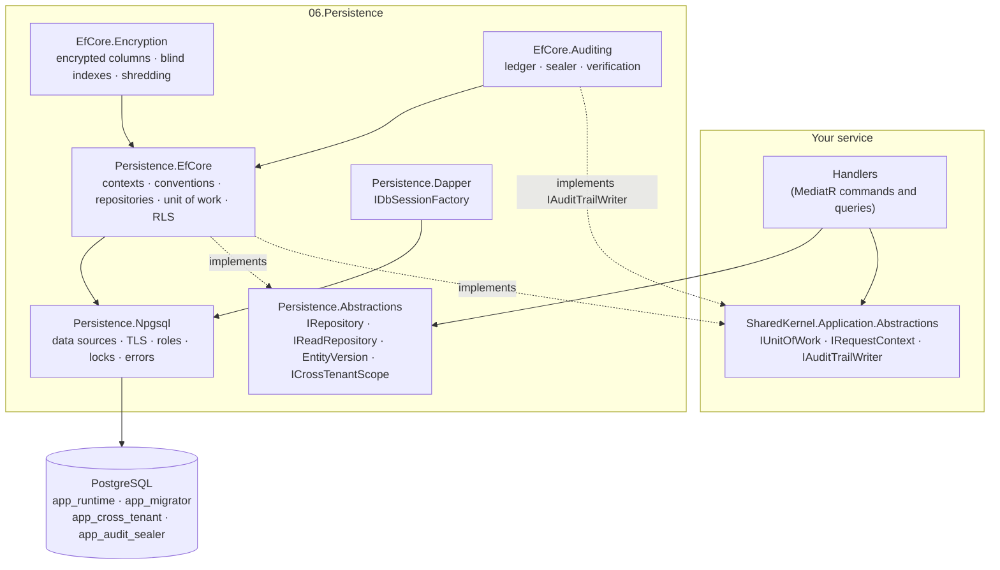
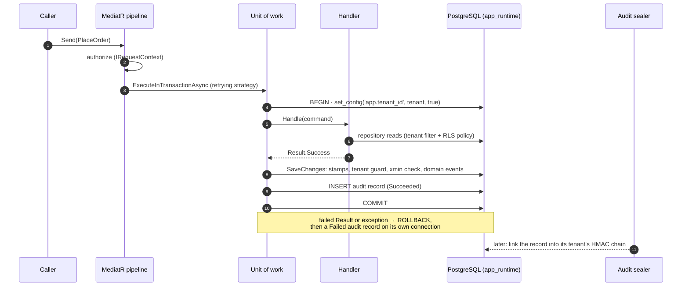
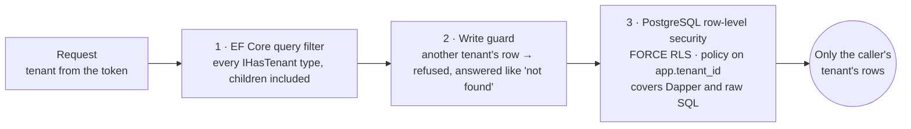

<div align="center">

# 🐘 SharedKernel Persistence

**PostgreSQL persistence for multi-tenant .NET services — EF Core and Dapper, row-level security, field
encryption and a tamper-evident audit trail, registered with one call.**

[](https://dotnet.microsoft.com/)
[](https://learn.microsoft.com/ef/core/)
[](https://www.postgresql.org/)
[](../LICENSE)


[Packages](#the-packages) · [Architecture](#architecture) · [10-minute start](#a-multi-tenant-service-in-10-minutes) · [Sample service](#see-it-run) · [Guarantees](#what-you-can-rely-on)

</div>

---

```csharp
builder.AddSharedKernelPostgres<OrderDbContext>("orders", p => p
    .UseMultiTenancy(rowLevelSecurity: true)    // every row filtered by tenant — in EF Core and in PostgreSQL
    .UseFieldEncryption()                       // personal data stored as AES-256-GCM ciphertext
    .UseAuditTrail()                            // who did what, sealed into verifiable hash chains
    .MigrateOnStartup());                       // migrations and seeders, one replica at a time
```

That is the registration of a production service. Behind it: the connection pool shared with Dapper, repositories
for every aggregate, a retry-safe unit of work, optimistic concurrency on every aggregate, domain events on every
save, tenant isolation enforced in three layers, and startup checks that refuse a misconfigured deployment before it serves a
request.

## Why

Every multi-tenant service needs the same persistence decisions, and each one is easy to get subtly wrong:

| The problem | What the packages do |
| --- | --- |
| A query forgets `WHERE tenant_id = …` and leaks another customer's data | Tenant filter in EF Core **and** a PostgreSQL row-level-security policy bound per transaction — hand-written SQL included |
| Retry on transient faults breaks explicit transactions | The whole unit of work runs inside the retrying strategy; ambiguous commits are never replayed |
| Two users overwrite each other's changes | Every aggregate root gets `xmin` optimistic concurrency, exposed as an ETag-ready `EntityVersion` |
| Backups and replicas expose personal data | Column-level AES-256-GCM, searchable through blind indexes, rotatable, erasable per tenant |
| "Who changed this?" has no trustworthy answer | An append-only ledger sealed into keyed hash chains, verifiable by anyone with the key |
| Every service wires EF Core, Dapper, TLS and roles differently | One entry point, one configuration shape, one canonical role script |

## The packages

| Package | Reference it when | What it gives you |
| --- | --- | --- |
| [**SharedKernel.Persistence.EfCore**](SharedKernel.Persistence.EfCore/README.md) | the service uses EF Core (almost always) | `AddSharedKernelPostgres<TContext>("name")`, `SharedKernelDbContext`/`TenantedDbContext`, open-generic repositories, the unit of work, conventions (snake_case, `xmin`, strongly-typed ids, `Money`), error classification, retry, row-level security, migrations and seeding, JSONB, pgvector |
| [**SharedKernel.Persistence.Abstractions**](SharedKernel.Persistence.Abstractions/README.md) | always (it comes with the others); reference it from application code | `IRepository`/`IReadRepository`, `EntityVersion`, bulk mutations, `ICrossTenantScope`, `IDbConnectionFactory` — no ORM |
| [**SharedKernel.Persistence.Npgsql**](SharedKernel.Persistence.Npgsql/README.md) | always (EfCore and Dapper bring it) | The shared `NpgsqlDataSource` per connection name, TLS policy, migration / read-only / cross-tenant data sources, advisory locks, SQLSTATE classification, **the canonical role script** |
| [**SharedKernel.Persistence.Dapper**](SharedKernel.Persistence.Dapper/README.md) | the service writes SQL by hand | `IDbSessionFactory`: a session that joins the unit of work, binds the tenant for row-level security and picks the right role; type handlers |
| [**SharedKernel.Persistence.EfCore.Encryption**](SharedKernel.Persistence.EfCore.Encryption/README.md) | columns hold personal or secret data | `.UseFieldEncryption()`: AES-256-GCM per column, blind indexes, key rotation and plaintext migration, per-tenant crypto-shredding |
| [**SharedKernel.Persistence.EfCore.Auditing**](SharedKernel.Persistence.EfCore.Auditing/README.md) | commands must leave an audit trail | `.UseAuditTrail()`: append-only ledger, background sealer, per-(tenant, resource type) HMAC chains, verification, checkpoints, GDPR payload erasure |
| [**SharedKernel.Persistence.Testing**](../16.Testing/SharedKernel.Persistence.Testing/README.md) | in **test** projects | In-memory fakes with the production rules, and a Testcontainers PostgreSQL with the production role split |

Related packages outside this folder: [`SharedKernel.Application.Abstractions`](../05.Application/SharedKernel.Application.Abstractions)
owns `IUnitOfWork`, `IRequestContext` and `IAuditTrailWriter`, which these packages implement directly;
[`SharedKernel.ServiceDefaults.Security`](../13.ServiceDefaults/SharedKernel.ServiceDefaults.Security/README.md) provides
the `IRequestContext` over the authenticated user;
[`SharedKernel.ServiceDefaults.Persistence`](../13.ServiceDefaults/SharedKernel.ServiceDefaults.Persistence/README.md)
provides the readiness checks.

## Architecture



Application code depends on the two abstraction packages only; the host references the implementations. EF Core and
Dapper share one data source, one transaction and one tenant binding.

### One command, end to end



### Tenant isolation, three layers deep



Each layer alone is correct; together a bug in one never becomes a leak. At startup the platform checks that the
runtime role cannot bypass row-level security and that every tenant table has its policy.

## A multi-tenant service in 10 minutes

The complete path for a service with tenants, row-level security, an audit trail and MediatR commands. Every snippet
below is compiled and run against PostgreSQL by
[`PersistenceReadmeSampleTests`](../13.ServiceDefaults/SharedKernel.ServiceDefaults.Persistence/SharedKernel.ServiceDefaults.Persistence.Tests/Readme/PersistenceReadmeSampleTests.cs).

### 1. Packages

```shell
dotnet add package SharedKernel.Persistence.EfCore
dotnet add package SharedKernel.Persistence.EfCore.Auditing
dotnet add package SharedKernel.Application.Behaviors            # MediatR pipeline: transaction + auditing
dotnet add package SharedKernel.ServiceDefaults.Security         # IRequestContext over the authenticated user
dotnet add package SharedKernel.ServiceDefaults.Persistence      # readiness checks
dotnet add package Microsoft.EntityFrameworkCore.Design          # dotnet ef (PrivateAssets="all")
```

### 2. Configuration

```json
{
  "ConnectionStrings": {
    "orders": "Host=db;Database=orders;Username=app_runtime;Password=..."
  },
  "SharedKernel": {
    "Persistence": {
      "ServiceName": "orders-api",
      "orders": {
        "MigrationConnectionString": "Host=db;Database=orders;Username=app_migrator;Password=...",
        "RowLevelSecurity": {
          "CrossTenantConnectionString": "Host=db;Database=orders;Username=app_cross_tenant;Password=..."
        }
      },
      "Auditing": {
        "CurrentKeyId": "k1",
        "Keys": { "k1": { "Material": "<base64, 32 bytes or more — from your secret store>", "Order": 1 } }
      }
    }
  }
}
```

- The connection string is always `ConnectionStrings:{name}` (the .NET Aspire and Testcontainers shape); every other
  setting of that database is in `SharedKernel:Persistence:{name}` —
  [full table](SharedKernel.Persistence.Npgsql/README.md#configuration-one-shape).
- TLS is `VerifyFull` unless the connection string says otherwise; a loopback host needs no TLS settings.
- The roles — `app_migrator` (owns the tables), `app_runtime` (the application: no superuser, no `BYPASSRLS`, owns
  nothing) and `app_cross_tenant` — come from **one canonical script**:
  [Npgsql README → Roles](SharedKernel.Persistence.Npgsql/README.md#roles-the-one-canonical-script). Run it once per
  database. The startup checks refuse a runtime role that can bypass row-level security.

> [!TIP]
> For local development one container is enough:
> `docker run -d --name orders-db -p 5432:5432 -e POSTGRES_PASSWORD=dev -e POSTGRES_DB=orders postgres:17`, with
> `ConnectionStrings:orders = Host=localhost;Database=orders;Username=postgres;Password=dev`. A superuser bypasses
> row-level security, so either run the role script or set
> `SharedKernel:Persistence:orders:RowLevelSecurity:PrivilegeCheck` to `Warn` in `appsettings.Development.json`.
> Isolation itself is only proven with the role split — the
> [BillingApi sample's Docker Compose file](../samples/BillingApi/docker-compose.yml) sets it up for you.

### 3. The domain and the context

```csharp
public sealed record OrderId(Guid Value) : StronglyTypedId<Guid>(Value)
{
    public static OrderId New() => new(Guid.NewGuid());
}

public sealed class Order : TenantedAuditableAggregateRoot<OrderId>
{
    public Order(OrderId id, TenantId tenantId, string customer, Money total, IClock clock)
        : base(id, tenantId, clock)
    {
        Customer = customer;
        Total = total;
    }

    private Order() { } // EF Core materialization

    public string Customer { get; private set; } = string.Empty;
    public Money Total { get; private set; } = null!;
}

public sealed class OrderDbContext(DbContextOptions<OrderDbContext> options, PersistenceContextDependencies dependencies)
    : TenantedDbContext(options, dependencies)
{
    public DbSet<Order> Orders => Set<Order>();
}
```

No configuration class is needed: `OrderId` maps to a `uuid`, `Total` to `total_amount numeric(19,4)` +
`total_currency char(3)`, the audit and tenant columns come from the interfaces the base class implements, `xmin`
becomes the concurrency token, and names are snake_case. Add `IEntityTypeConfiguration<T>` classes only for what a
convention cannot know (lengths, indexes, `.Encrypt(...)`).

In a `TenantedDbContext` **every** entity type is tenant data: a child entity implements `IHasTenant` too (an added
child with no `TenantId` takes its aggregate's), or is marked `[TenantShared]` as global reference data. Anything
else fails the model build.

### 4. Registration

```csharp
var builder = WebApplication.CreateBuilder(args);

builder.Services.AddOidcAuthentication(builder.Configuration);        // 12.Security: who is calling
builder.Services.AddSharedKernelRequestContext();                     // 13: IRequestContext (user, tenant) for everything below
builder.Services.AddSharedKernelCryptography(builder.Configuration);  // 01.Core: the audit ledger's MAC

builder.AddSharedKernelPostgres<OrderDbContext>("orders", p => p
    .UseMultiTenancy(rowLevelSecurity: true)   // tenant filter + write guard + transaction-local RLS
    .UseAuditTrail()                           // IAuditTrailWriter, sealer, self-check
    .MigrateOnStartup());                      // migrations + seeders, one replica at a time

builder.Services.AddMediatR(cfg => cfg.RegisterServicesFromAssemblyContaining<Program>());
builder.Services.AddSharedKernelApplication();                        // domain events -> MediatR
builder.Services.AddSharedKernelApplicationBehaviors()
    .AddDefaultBehaviors()
    .AddTransactionBehavior()                  // one retry-safe transaction per command
    .AddAuditingBehavior()                     // Succeeded inside it, Failed after rollback
    .Build();

builder.Services.AddHealthChecks()
    .AddDatabaseReadinessCheck<OrderDbContext>()   // not ready until startup migrations finished
    .AddPersistenceStartupReadinessCheck()
    .AddSharedKernelReadiness();                   // every provider probe, including audit sealing
```

`using SharedKernel.Persistence;` covers every persistence registration call. One call registers the data source, the
context (scoped), `IUnitOfWork`, `IRepository<,>`/`IReadRepository<,>` for every aggregate of the model,
`ICrossTenantScope`, startup validation of the model and the options, and a fail-closed anonymous `IRequestContext`
for services that register none. There is no terminal `.Build()`.

### 5. Migrations

Generate migrations with `dotnet ef` through a design-time factory that connects as the migration role:

```csharp
public sealed class OrderDbContextFactory() : PostgresDesignTimeDbContextFactory<OrderDbContext>("orders")
{
    protected override OrderDbContext Create(DbContextOptions<OrderDbContext> options, PersistenceContextDependencies dependencies)
        => new(options, dependencies);

    // The same capabilities as the registration in step 4, so the migration is generated from the model the service
    // runs: field encryption widens encrypted columns and adds their blind-index columns.
    protected override void ConfigurePersistence(EfCorePersistenceBuilder<OrderDbContext> persistence)
        => persistence.UseMultiTenancy(rowLevelSecurity: true).UseAuditTrail();
}
```

Keep the capability calls in one method that both `Program.cs` and the factory call (the
[BillingApi sample](../samples/BillingApi/Infrastructure/BillingDbContext.cs) does: `BillingDatabase.Configure`). A model
with `.Encrypt(...)` properties refuses to build at design time without `UseFieldEncryption()` here.

```bash
dotnet ef migrations add Initial
```

Then add the platform's database objects to the first migration, after the generated `CreateTable` calls:

```csharp
protected override void Up(MigrationBuilder migrationBuilder)
{
    // ... generated CreateTable calls ...

    migrationBuilder.EnableTenantRowLevelSecurityForModel(TargetModel!);          // every tenant table: FORCE RLS + tenant policy
    migrationBuilder.CreateAuditLedgerTable(runtimeRole: "app_runtime");           // ledger tables, triggers, exact grants
    // with .UseFieldEncryption(k => k.UseTenantDataKeys()):  migrationBuilder.CreateTenantEncryptionKeyTable();
}
```

`MigrateOnStartup()` applies them at startup under a cross-replica advisory lock, over `MigrationConnectionString`
when it is set. In CI you can instead publish `dotnet ef migrations script --idempotent` and apply it as
`app_migrator`. Nothing creates the database itself: the role script (or Aspire, or the container above) does.

### 6. The first command

```csharp
public sealed record PlaceOrder(OrderId Id, string Customer, decimal Amount)
    : ICommand<OrderId>, IAuditableRequest<Result<OrderId>>
{
    public string Action => "order.placed";
    public string ResourceType => nameof(Order);
    public string ResourceId => Id.Value.ToString();
    public string? BeforeSnapshot => null;
    public string? GetAfterSnapshot(Result<OrderId> response) => null;
}

public sealed class PlaceOrderHandler(IRepository<Order, OrderId> orders, IRequestContext caller, IClock clock)
    : ICommandHandler<PlaceOrder, OrderId>
{
    public async Task<Result<OrderId>> Handle(PlaceOrder command, CancellationToken cancellationToken)
    {
        var total = Money.Create(command.Amount, Currency.Eur).Value;
        await orders.AddAsync(new Order(command.Id, caller.TenantId!.Value, command.Customer, total, clock), cancellationToken);
        return command.Id; // no SaveChanges: TransactionBehavior saves and commits
    }
}
```

`await sender.Send(new PlaceOrder(OrderId.New(), "Ada", 42m))` then:

1. `AuditingBehavior` and `TransactionBehavior` run; the handler runs inside `IUnitOfWork.ExecuteInTransactionAsync`,
   in the retrying execution strategy — **a handler may run more than once**, so it loads what it needs through
   repositories and keeps HTTP calls and messages out of its body (queue them with `ICommandScope.OnCompleted`, which
   runs after the commit).
2. The unit of work saves every context of the request scope, the audit writer inserts the `Succeeded` record in the
   same transaction, and it commits. A failed `Result` or an exception rolls everything back; the `Failed` record is
   then written on its own connection.
3. Every command of that transaction ran as `app_runtime` with `app.tenant_id` bound transaction-locally, so the RLS
   policy and the EF Core tenant filter both restrict it to the caller's tenant.
4. The background sealer later links the record into its tenant's HMAC chain.

Reads go through `IReadRepository<Order, OrderId>` (never tracked) or `IRepository` (tracked, for changes — and for
reading an ETag). Queries are specifications — `Spec.For<Order>().Where(o => o.Customer == name).OrderBy(o => o.CreatedOn)`
— and paging happens at the call site: `ListPagedAsync(spec, pageRequest)`, `ListKeysetAsync(spec, cursorPageRequest,
o => o.CreatedOn)`. Optimistic concurrency with ETag/If-Match:
[EfCore README](SharedKernel.Persistence.EfCore/README.md#1-optimistic-concurrency-with-etag--if-match).

### 7. Testing

**Unit tests** replace the contracts with fakes from `SharedKernel.Persistence.Testing`:

```csharp
var services = new ServiceCollection();
var orders = services.AddFakeRepository<Order, OrderId>();
var unitOfWork = services.AddFakeUnitOfWork();
var caller = services.AddTestRequestContext(TestRequestContext.ForTenant(tenantId));
services.AddSingleton<IClock, SystemClock>();
services.AddScoped<PlaceOrderHandler>();
await using var provider = services.BuildServiceProvider();

var handler = provider.GetRequiredService<PlaceOrderHandler>();
var result = await provider.GetRequiredService<IUnitOfWork>()
    .ExecuteInTransactionAsync(ct => handler.Handle(new PlaceOrder(id, "Ada", 42m), ct));

unitOfWork.CommitCount.Should().Be(1);
orders.Items.Should().ContainKey(id);
```

`FakeUnitOfWork.TransientFailures = 2` replays the operation like the retrying strategy does, restoring the fake
repositories between runs — the cheapest proof that a handler is re-runnable.

**Integration tests** run against a real PostgreSQL with the production role split, so row-level security is actually
exercised (a superuser would bypass it):

```csharp
await using var server = await PostgresTestServer.StartAsync();         // Docker; or FromExistingServer(...)
await using var database = await server.CreateDatabaseAsync();          // owned by app_migrator, dropped on dispose
var configuration = database.BuildConfiguration("orders", auditKeys);   // ConnectionStrings:orders as app_runtime, ...

// register exactly as in step 4, with services.AddTestRequestContext(caller) instead of authentication, then:
await database.CreateSchemaAsync(context);              // as app_migrator
await database.EnableRowLevelSecurityAsync(context);    // EnableTenantRowLevelSecurityForModel
await database.CreateAuditLedgerAsync();
```

## See it run

[**samples/BillingApi**](../samples/BillingApi/README.md) is a complete multi-tenant billing API on every package,
built from the packed NuGet packages:

```bash
cd samples/BillingApi
dotnet publish -c Release -t:PublishContainer -p:ContainerRepository=billing-api -p:ContainerImageTag=local
docker compose up -d        # PostgreSQL with the four roles + the API, Production mode
./smoke-test.sh             # 28 checks over HTTP
```

Customers with encrypted, searchable emails; invoices with `Money` lines; payments written by Dapper and EF Core in
one transaction; ETags; soft delete; bulk updates; an audited, sealed history; a back-office report across tenants;
tenant erasure. Its end-to-end tests run in CI against Testcontainers PostgreSQL in the Production environment.

## What you can rely on

| Guarantee | How |
| --- | --- |
| **No cross-tenant reads or writes**, through EF Core, Dapper or raw SQL | Tenant filter + write guard + transaction-local row-level security; the runtime role cannot bypass RLS (checked at startup) |
| **No silent misconfiguration** | Options, the model, the role's privileges, policy coverage and the audit ledger's grants are verified when the host starts |
| **No lost updates** | `xmin` concurrency on every aggregate root; `EntityVersion` round-trips through ETag / If-Match |
| **Retry-safe transactions** | The whole unit of work replays on a transient fault; an ambiguous `COMMIT` is never replayed |
| **Personal data encrypted at rest** | AES-256-GCM per column, bound to row, column and tenant; erasable per tenant |
| **A trustworthy audit trail** | Append-only (triggers + grants), sealed into HMAC chains, verifiable, with signed checkpoints |
| **PgBouncer-ready** | No session state outlives a transaction |
| **Tested for real** | Every package against PostgreSQL with the role split; a sample service end to end over HTTP, in CI |

**Deliberately out of scope:** databases other than PostgreSQL, two-phase commit across databases, read-replica routing
inside one context, lazy loading.

## Where to go next

| Topic | Read |
| --- | --- |
| A complete service using every package through an HTTP API | [samples/BillingApi](../samples/BillingApi/README.md) |
| Registration options, transactions, several contexts, background work, cross-tenant access | [EfCore](SharedKernel.Persistence.EfCore/README.md) |
| Repository and specification contracts, `EntityVersion`, bulk updates | [Abstractions](SharedKernel.Persistence.Abstractions/README.md) |
| Connection names, TLS, PgBouncer, the role script, advisory locks, error classification | [Npgsql](SharedKernel.Persistence.Npgsql/README.md) |
| Hand-written SQL | [Dapper](SharedKernel.Persistence.Dapper/README.md) |
| Field encryption: keys, blind indexes, rotation, shredding | [Encryption](SharedKernel.Persistence.EfCore.Encryption/README.md) |
| Audit ledger: keys and rotation, sealer, verification, erasure | [Auditing](SharedKernel.Persistence.EfCore.Auditing/README.md) · [AUDIT-FORMAT.md](SharedKernel.Persistence.EfCore.Auditing/AUDIT-FORMAT.md) |
| Test helpers | [Persistence.Testing](../16.Testing/SharedKernel.Persistence.Testing/README.md) |
| Readiness checks | [ServiceDefaults.Persistence](../13.ServiceDefaults/SharedKernel.ServiceDefaults.Persistence/README.md) |
| Maintainer rules and invariants | [CLAUDE.md](CLAUDE.md) |

<div align="center">

Part of **[Platform.SharedKernel](../README.md)** — capability-oriented building blocks for .NET 10 microservices.

</div>
