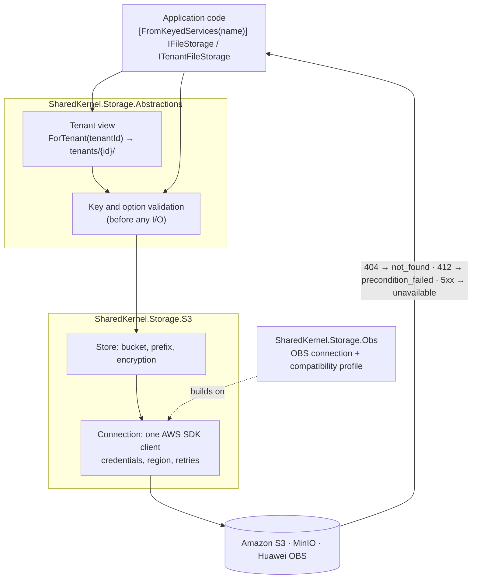

<div align="center">

# SharedKernel Storage

**Object storage for multi-tenant .NET services — Amazon S3, MinIO and Huawei Cloud OBS behind one contract, with
tenant isolation, safe concurrent writes and presigned uploads that clients cannot abuse.**

[](https://dotnet.microsoft.com/)
[](../LICENSE)

[](SharedKernel.Storage.S3/README.md)
[](SharedKernel.Storage.S3/README.md#minio-and-other-s3-compatible-services)
[](SharedKernel.Storage.Obs/README.md)

[Packages](#packages) · [How it fits together](#how-it-fits-together) · [Get started](#get-started) · [Providers](#what-each-provider-supports) · [Sample](#see-it-run) · [Guarantees](#guarantees)

</div>

---

## What this domain gives you

- **Named stores.** Code names a purpose (`[FromKeyedServices("invoices")] IFileStorage`); buckets, prefixes,
  encryption, credentials and link lifetimes are configuration, validated when the host starts.
- **Tenant isolation by construction.** A tenant store is only reachable through `ForTenant(TenantId)`; every key is
  validated and confined to `tenants/{tenantId}/`, so no key, listing or copy can reach another tenant's files.
- **No silent overwrites.** `WriteCondition.IfNotExists` and `IfMatch(etag)` are enforced atomically by the provider;
  a provider that would ignore them refuses the request with `storage.not_supported` instead.
- **Direct client uploads with limits.** Presigned forms carry a signed size range and content-type policy;
  presigned multipart lets clients upload gigabytes without the bytes passing through your service.
- **Failures as values.** Not found, conflict, throttling and outages are `Result` errors with stable `storage.*`
  codes; every store registers a `storage-{store}` readiness probe.

## Packages

| Package | Tier | When you need it |
| --- | --- | --- |
| [SharedKernel.Storage.Abstractions](SharedKernel.Storage.Abstractions/README.md) | Abstractions | Always — application code injects `IFileStorage`, `ITenantFileStorage` and `IFileStorageFactory` from here. No cloud SDK |
| [SharedKernel.Storage.S3](SharedKernel.Storage.S3/README.md) | Adapter | Your buckets are on Amazon S3, MinIO or another S3-compatible service |
| [SharedKernel.Storage.Obs](SharedKernel.Storage.Obs/README.md) | Adapter | Your buckets are on Huawei Cloud OBS (built on the S3 package; both can be used together) |

Related packages outside this folder:

| Package | Adds |
| --- | --- |
| [SharedKernel.ServiceDefaults](../13.ServiceDefaults/SharedKernel.ServiceDefaults/README.md) | `AddHealthChecks().AddSharedKernelReadiness()` maps every `storage-{store}` probe to `/health/ready`; `WithStorageTelemetry()` exports the `SharedKernel.Storage` traces and metrics |
| [SharedKernel.Storage.Testing](../16.Testing/SharedKernel.Storage.Testing/README.md) | `AddInMemoryStore(name)` / `AddInMemoryTenantStore(name)` — an in-memory store with the production rules, for unit tests |

## How it fits together



- **A store** is a bucket, optionally narrowed to a key prefix, with its own encryption, default tier and maximum
  link lifetime (`SharedKernel:Storage:Stores:{name}`).
- **A connection** is one set of credentials and one endpoint (`SharedKernel:Storage:S3`, or
  `SharedKernel:Storage:S3:{name}` for a named one; `SharedKernel:Storage:Obs`). Stores on the same connection copy
  server-side; buckets with different IAM users use named connections.
- **A tenant store** is only reachable through `ForTenant(tenantId)`; the provider never sees a key outside the
  tenant's prefix, and the caller never sees the prefix.

## Get started

**1. Reference the packages.** The Application project takes the contracts; the Infrastructure or host project takes
a provider. Every SharedKernel package ships at one version, set by your `SharedKernelVersion` property.

```xml
<PackageReference Include="SharedKernel.Storage.Abstractions" />   <!-- Application -->
<PackageReference Include="SharedKernel.Storage.S3" />             <!-- Infrastructure / host -->
```

**2. Configure the stores.** No credentials on AWS: the SDK's default chain finds the pod's IAM role.

```json
{
  "SharedKernel": {
    "Storage": {
      "S3": { "Region": "eu-central-1" },
      "Stores": {
        "invoices":  { "Bucket": "acme-invoices", "Encryption": "Kms" },
        "documents": { "Bucket": "acme-docs", "KeyPrefix": "documents/", "MaxPresignExpiry": "00:15:00" }
      }
    }
  }
}
```

**3. Register them.**

```csharp
builder.Services.AddSharedKernelStorage()
    .AddS3(builder.Configuration)
    .AddStore("invoices")
    .AddTenantStore("documents");

builder.Services.AddHealthChecks().AddSharedKernelReadiness();   // storage-invoices, storage-documents
builder.WithStorageTelemetry();
```

**4. Use them.** Application code names the store and takes the tenant from the request context:

```csharp
public sealed class ContractFiles(
    [FromKeyedServices("documents")] ITenantFileStorage documents,
    IRequestContext request)
{
    public Task<Result<FileReference>> SaveAsync(string name, Stream content, CancellationToken ct) =>
        documents.ForTenant(request.TenantId!.Value).UploadAsync($"contracts/{name}", content, new FileUploadOptions
        {
            ContentType = "application/pdf",
            Condition = WriteCondition.IfNotExists,   // never overwrite a signed contract
        }, ct);
}
```

Persist the returned `FileReference` and reopen it later with `IFileStorageFactory.Open(reference)`. In an endpoint,
`SharedKernel.Presentation.WebApi`'s typed results (`ToCreated`, `ToHttpResult`) turn a failure into an RFC 9457
problem: `storage.not_found` → 404, `storage.already_exists` → 409, `storage.unavailable` → 503.

**5. Test without a bucket.**

```csharp
services.AddSharedKernelStorage()
    .AddInMemoryStore("invoices")
    .AddInMemoryTenantStore("documents");   // SharedKernel.Storage.Testing: same validation and tenant rules
```

## What each provider supports

| Capability | Amazon S3 | MinIO | Huawei OBS |
| --- | :---: | :---: | :---: |
| Upload, download, range reads, properties, metadata, delete, batch delete | ✅ | ✅ | ✅ |
| Copy (server-side on one connection), listing with folders and paging | ✅ | ✅ | ✅ |
| Presigned download and upload URLs, presigned forms, presigned multipart | ✅ | ✅ | ✅ |
| Tenant stores, key prefixes, object tags | ✅ | ✅ | ✅ |
| SSE-S3 / SSE-KMS encryption | ✅ | needs a KMS | ✅ |
| Create-only and `If-Match` writes | ✅ | ✅ (not on deletes) | ⛔ `storage.not_supported` |
| Provider-verified SHA-256 checksums | ✅ | ✅ | ⛔ `storage.not_supported` |
| IAM roles / default AWS credential chain | ✅ | — | — |

⛔ means the request is refused **before** it is sent. OBS accepts those headers and then ignores them, which would
silently overwrite data or store unchecked bytes.

## See it run

[**samples/DocumentsApi**](../samples/DocumentsApi/README.md) is a file service on all three packages: two S3
connections with separate IAM users, a tenant store and an OBS store, behind an HTTP API. Its scenarios run against
MinIO in CI, and against real Amazon S3 and Huawei OBS when credentials are supplied.

## Guarantees

| Guarantee | How |
| --- | --- |
| **No cross-tenant access** | Tenant views prefix every key with a typed `TenantId`; keys are validated (no `..`, no leading `/`, no `\`), and a tenant store is never handed out without a tenant |
| **No silent overwrites** | Conditional writes are checked by the provider; conditional copies go through a conditional `PUT` because some services ignore conditions on copies |
| **No silent degradation** | A feature the provider lacks is refused before the request, never dropped |
| **No surprises at run time** | Buckets, prefixes, credentials, regions and limits are validated when the host starts |
| **Bounded memory** | Streams in and out; at most one multipart part in memory |
| **No exceptions for expected failures** | `Result` with a stable `storage.*` code; only cancellation, `ListAsync` and programming errors throw |
| **No leaked internals** | Errors name the store and your key, never the bucket or endpoint; object keys are never logged or traced |
| **Provider-neutral contracts** | Architecture tests fail the build if the Abstractions reference a cloud SDK; the S3 package never references OBS |

**Deliberately out of scope:** Azure Blob Storage and Google Cloud Storage (no provider yet), archive tiers that need
a restore step, bucket administration (creation, lifecycle, policies), virus scanning and client-side encryption.

---

**For maintainers:** design rules and invariants live in [CLAUDE.md](CLAUDE.md); phase history in
[state-map.md](state-map.md).
