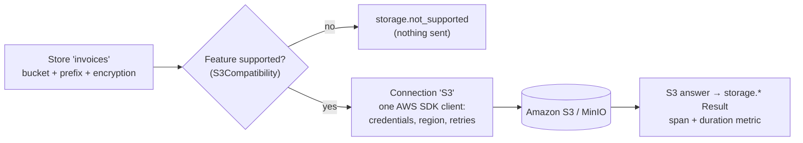

# SharedKernel.Storage.S3

[](https://dotnet.microsoft.com/)
[](https://github.com/Gresta-Vertex-Labs/platform-shared-kernel/blob/main/LICENSE)


> **Amazon S3, MinIO and any S3-compatible service behind
> [`SharedKernel.Storage.Abstractions`](https://github.com/Gresta-Vertex-Labs/platform-shared-kernel/blob/main/08.Storage/SharedKernel.Storage.Abstractions/README.md):
> IAM-role credentials, KMS encryption, streaming multipart uploads, conditional writes and presigned uploads, with
> nothing S3-specific in your application code.**

Application code injects `IFileStorage` / `ITenantFileStorage` — the Abstractions README explains the programming
model. This package connects named stores to buckets: configuration, credentials, encryption, and the translation of
every call into S3 requests and of every S3 answer into a `storage.*` result.

| You get | So that |
| --- | --- |
| The AWS default credential chain | Pods use their IAM role (IRSA, EKS Pod Identity); no keys in configuration |
| Named connections — `AddS3(configuration, "Private")` | Buckets with different IAM users, accounts or regions in one service |
| `Encryption = Kms` / `S3Managed` per store | Every object written is encrypted the way the store requires |
| `KeyPrefix` per store | Several stores share a bucket without seeing each other |
| `ExpectedBucketOwner` | A deleted and re-created bucket in someone else's account is never written to |
| `S3Compatibility` flags | A service that lacks a feature refuses the request instead of silently ignoring it |
| `SharedKernel.Storage` traces and metrics | Every operation measured, without ever recording an object key |

## Contents

- [Install](#install)
- [Quick start](#quick-start)
- [How it works](#how-it-works)
- [Recipes](#recipes)
- [Configuration](#configuration)
- [Reference](#reference)
- [Testing](#testing)
- [Pitfalls](#pitfalls)
- [Design decisions](#design-decisions)

## Install

```xml
<PackageReference Include="SharedKernel.Storage.S3" />
```

The version comes from your central `SharedKernelVersion` property — every SharedKernel package ships at the same
version. See [Using the packages](https://github.com/Gresta-Vertex-Labs/platform-shared-kernel#using-the-packages).

| Requirement | Value |
| --- | --- |
| Target framework | `net10.0` |
| Tier | Adapter — reference it from your **Infrastructure** project (or the Api/Worker host) |
| Depends on | `SharedKernel.Storage.Abstractions`, `SharedKernel.Configuration`, `AWSSDK.S3` 4.x |
| Namespaces | `SharedKernel.Storage` (registration), `SharedKernel.Storage.S3` (options) |

## Quick start

```csharp
using SharedKernel.ServiceDefaults.HealthChecks;
using SharedKernel.ServiceDefaults.Telemetry;
using SharedKernel.Storage;

builder.Services.AddSharedKernelStorage()
    .AddS3(builder.Configuration)          // SharedKernel:Storage:S3
    .AddStore("invoices")                  // SharedKernel:Storage:Stores:invoices
    .AddTenantStore("documents");          // SharedKernel:Storage:Stores:documents

builder.Services.AddHealthChecks().AddSharedKernelReadiness();   // "storage-invoices", "storage-documents"
builder.WithStorageTelemetry();                                  // SharedKernel.Storage spans and metrics
```

```json
{
  "SharedKernel": {
    "Storage": {
      "S3": { "Region": "eu-central-1" },
      "Stores": {
        "invoices":  { "Bucket": "acme-invoices", "Encryption": "Kms", "KmsKeyId": "alias/invoices" },
        "documents": { "Bucket": "acme-shared", "KeyPrefix": "documents/", "MaxPresignExpiry": "00:15:00" }
      }
    }
  }
}
```

```csharp
public sealed class InvoiceFiles([FromKeyedServices("invoices")] IFileStorage invoices)
{
    public Task<Result<FileReference>> SaveAsync(Guid id, Stream pdf, CancellationToken ct) =>
        invoices.UploadAsync($"{id}.pdf", pdf, new FileUploadOptions { ContentType = "application/pdf" }, ct);
}
```

Every setting is validated when the host starts. A bad bucket name, a missing region or half a key pair fails
`IHost.StartAsync()` naming the connection or store and the setting.

## How it works



- **Credentials.** Leave `AccessKeyId` unset on AWS: the SDK's default chain uses environment variables, the shared
  profile, a web identity token (IRSA), EKS Pod Identity, the ECS task role or the EC2 instance profile — temporary,
  automatically rotated credentials. Use static keys only for MinIO and local development, bound from a secret store
  (`SharedKernel__Storage__S3__AccessKeyId`), never from a committed file.
- **One client per connection.** Each connection creates its S3 client on first use, shares it among its stores and
  disposes it with the host. The client is **not** registered as `IAmazonS3`, so it never collides with a client your
  service registers itself.
- **Streaming.** At most one multipart part (`MultipartPartSize`) is buffered. Checksums are sent only when an
  operation needs one or a request asks for it (`WHEN_REQUIRED`), because several S3-compatible services reject the
  SDK's newer default checksum headers.
- **Object keys are never logged, traced or measured** — they often contain user data. Bucket names and S3 request
  ids are logged so a failure can be traced with AWS support.

### What happens on the wire

| Operation | S3 requests |
| --- | --- |
| `UploadAsync` | One `PutObject` for content of known length up to `MultipartPartSize` (pass `ContentLength` for a request body); otherwise a multipart upload in `MultipartPartSize` parts. With `ChecksumSha256`, always one `PutObject` (≤ 5 GiB) that the provider verifies |
| `WriteCondition` | `If-None-Match: *` / `If-Match` on `PutObject` and `CompleteMultipartUpload` |
| `DownloadAsync` | `GetObject` with `Range`, `If-Match` and `versionId` as requested |
| `GetPropertiesAsync` / `ExistsAsync` | `HeadObject` |
| `DeleteAsync` / `DeleteManyAsync` | `DeleteObject` / `DeleteObjects` (1,000 keys per request) |
| `CopyAsync` / `CopyToAsync` | `CopyObject` when both stores share a connection and no destination condition is set (≤ 5 GiB); otherwise a streamed download and conditional upload, because several S3-compatible services ignore conditions on copies |
| `ListAsync` / `ListPageAsync` | `ListObjectsV2` (with a `/` delimiter for folders) |
| Presigned URLs, forms, part URLs | Signed locally with SigV4; no request to S3 |
| Readiness probe | `HeadBucket` |

| S3 answer | Result |
| --- | --- |
| 404 | `storage.not_found` |
| 403 | `storage.access_denied` (logged with the request id) |
| 412, 409 `ConditionalRequestConflict` | `storage.already_exists` (create-only) or `storage.precondition_failed` |
| 416 | `storage.invalid_range` |
| 400 `BadDigest` / checksum mismatch | `storage.checksum_mismatch` |
| 503 `SlowDown`, other 5xx, 429, timeouts, network failures | `storage.unavailable`, after the SDK's retries |
| 301 / wrong region | `storage.provider_error`, logged as event 8105 naming the fix |
| Anything else | `storage.provider_error`, logged with status, code and request id |

### MinIO and other S3-compatible services

For a service that lacks a feature, switch its `Compatibility` flag off: a request that needs it then fails with
`storage.not_supported` **before it is sent**, instead of being silently ignored.

Current MinIO releases support everything except conditional deletes: MinIO ignores `If-Match` on `DeleteObject`, so
a stale conditional delete removes the current object; conditional writes are honored. `ConditionalWrites` switches
writes and deletes off together, so a conditional delete on MinIO is not refused — do not rely on it there.

Huawei Cloud OBS has its own package with a verified profile:
[`SharedKernel.Storage.Obs`](https://github.com/Gresta-Vertex-Labs/platform-shared-kernel/blob/main/08.Storage/SharedKernel.Storage.Obs/README.md).

## Recipes

### 1. Run on EKS with an IAM role

```json
"S3": { "Region": "eu-central-1" },
"Stores": { "uploads": { "Bucket": "acme-uploads", "ExpectedBucketOwner": "123456789012" } }
```

Annotate the service account with the role (IRSA) or create a Pod Identity association; no key goes into the
configuration.

### 2. Buckets with different IAM users

```json
"S3": {
  "Public":  { "Region": "eu-central-1", "AccessKeyId": "…", "SecretAccessKey": "…" },
  "Private": { "Region": "eu-central-1", "AccessKeyId": "…", "SecretAccessKey": "…" }
}
```

```csharp
IStorageBuilder storage = builder.Services.AddSharedKernelStorage();
storage.AddS3(builder.Configuration, "Public").AddStore("assets");
storage.AddS3(builder.Configuration, "Private").AddTenantStore("documents");
```

Each named connection has its own client and credentials. Copies between stores of different connections stream
through the service.

### 3. Encrypt with a customer-managed KMS key

```json
"Stores": { "invoices": { "Bucket": "acme-invoices", "Encryption": "Kms", "KmsKeyId": "alias/invoices" } }
```

The key policy then also decides who can read the objects. Presigned upload URLs return the encryption headers the
client must send.

### 4. Several stores in one bucket

```json
"Stores": {
  "exports": { "Bucket": "acme-data", "KeyPrefix": "exports/" },
  "imports": { "Bucket": "acme-data", "KeyPrefix": "imports/", "DefaultTier": "InfrequentAccess" }
}
```

A store never sees keys outside its prefix, and copies between the two run server-side.

### 5. Local development with MinIO

```yaml
# docker-compose.yml
minio:
  image: quay.io/minio/minio:RELEASE.2025-09-07T16-13-09Z
  command: server /data
  ports: ["9000:9000"]
```

```json
"S3": { "ServiceUrl": "http://localhost:9000", "ForcePathStyle": true, "Region": "us-east-1",
        "AccessKeyId": "minioadmin", "SecretAccessKey": "minioadmin" }
```

### 6. A service that ignores conditional headers

```json
"S3": { "ServiceUrl": "https://s3.example.net", "Region": "auto", "Compatibility": { "ConditionalWrites": false } }
```

### 7. Configure a connection or store in code

```csharp
builder.Services.AddSharedKernelStorage()
    .AddS3(builder.Configuration, s3 => s3.MaxRetries = 5)
    .AddStore("reports", store =>
    {
        store.Bucket = "acme-reports";
        store.MaxPresignExpiry = TimeSpan.FromDays(1);
    });
```

### 8. Bring your own client

```csharp
storage.AddS3Compatible("Backup", builder.Configuration, sp =>
{
    var client = new AmazonS3Client(credentials, new AmazonS3Config
    {
        ServiceURL = "https://s3.backup.example.com",
        ForcePathStyle = true,
        RequestChecksumCalculation = RequestChecksumCalculation.WHEN_REQUIRED,
        ResponseChecksumValidation = ResponseChecksumValidation.WHEN_REQUIRED,
    });
    return (client, new S3Compatibility { ConditionalWrites = false });
}).AddStore("backup");
```

The connection owns the client and disposes it with the container, so return a new one, not one registered elsewhere.

## Configuration

### The connection — `SharedKernel:Storage:S3` (`S3StorageOptions`)

A named connection, `AddS3(configuration, "Private")`, reads `SharedKernel:Storage:S3:Private` instead.

| Key | Type | Default | Meaning |
| --- | --- | --- | --- |
| `SharedKernel:Storage:S3:Region` | `string` | — | Required on AWS, e.g. `eu-central-1`. With `ServiceUrl`, the region requests are signed for |
| `SharedKernel:Storage:S3:ServiceUrl` | `string` | — | Endpoint of an S3-compatible service, e.g. `http://minio:9000`. Leave unset for AWS |
| `SharedKernel:Storage:S3:ForcePathStyle` | `bool` | `false` | Address buckets as a path segment (MinIO and most self-hosted services) |
| `SharedKernel:Storage:S3:AccessKeyId` / `SecretAccessKey` | `string` | — | Static credentials. Leave unset on AWS; set both or neither |
| `SharedKernel:Storage:S3:SessionToken` | `string` | — | For temporary static credentials |
| `SharedKernel:Storage:S3:MaxRetries` | `int` | `3` | SDK retries of throttled and failed requests (standard retry mode), 0 to 10 |
| `SharedKernel:Storage:S3:RequestTimeout` | `TimeSpan` | `00:01:40` | Per HTTP request, 1 second to 1 hour; each multipart part is its own request |
| `SharedKernel:Storage:S3:Compatibility:ConditionalWrites` | `bool` | `true` | Switch off when the service ignores `If-None-Match` / `If-Match` on writes and deletes |
| `SharedKernel:Storage:S3:Compatibility:Sha256Checksums` | `bool` | `true` | Switch off when it ignores or rejects `x-amz-checksum-sha256` |
| `SharedKernel:Storage:S3:Compatibility:ObjectTags` | `bool` | `true` | Switch off when it does not support object tagging |
| `SharedKernel:Storage:S3:Compatibility:KmsEncryption` | `bool` | `true` | Switch off when it does not support SSE-KMS |
| `SharedKernel:Storage:S3:Compatibility:PresignedPost` | `bool` | `true` | Switch off when it does not support browser form uploads |
| `SharedKernel:Storage:S3:Compatibility:ETagIsContentMd5` | `bool` | `true` | Switch off when its ETags are not the content's MD5 (full downloads are then requested as `bytes=0-`) |

### A store — `SharedKernel:Storage:Stores:{name}` (`S3StoreOptions`)

Read from configuration, then from the `configure` delegate of `AddStore(name, configure)`.

| Key | Type | Default | Meaning |
| --- | --- | --- | --- |
| `SharedKernel:Storage:Stores:{name}:Bucket` | `string` | — (required) | 3 to 63 lower-case letters, digits, `.` and `-` |
| `SharedKernel:Storage:Stores:{name}:KeyPrefix` | `string` | — | A prefix every key of the store lives under, ending with `/`; the application never sees it |
| `SharedKernel:Storage:Stores:{name}:Encryption` | `S3Encryption` | `BucketDefault` | `S3Managed` (SSE-S3) or `Kms` (SSE-KMS) on every object written; `BucketDefault` sends no header |
| `SharedKernel:Storage:Stores:{name}:KmsKeyId` | `string` | the `aws/s3` key | Key id, ARN or alias; only with `Encryption = Kms` |
| `SharedKernel:Storage:Stores:{name}:DefaultTier` | `StorageTier` | `Default` | `InfrequentAccess` writes `STANDARD_IA` unless a request chooses otherwise |
| `SharedKernel:Storage:Stores:{name}:MaxPresignExpiry` | `TimeSpan` | `01:00:00` | The longest expiry of any presigned URL or form of the store, up to 7 days |
| `SharedKernel:Storage:Stores:{name}:ExpectedBucketOwner` | `string` | — | The AWS account id the bucket must belong to; every request fails otherwise |
| `SharedKernel:Storage:Stores:{name}:MultipartPartSize` | `long` | 16 MiB | Part size of multipart uploads, 5 MiB to 5 GiB |

## Reference

### Registration

| Method | Reads | Returns |
| --- | --- | --- |
| `IStorageBuilder.AddS3(configuration, configure?)` | `SharedKernel:Storage:S3`, connection name `S3` | `S3StorageBuilder` |
| `IStorageBuilder.AddS3(configuration, connectionName, configure?)` | `SharedKernel:Storage:S3:{connectionName}` | `S3StorageBuilder` |
| `IStorageBuilder.AddS3Compatible(connectionName, configuration, sp => (client, compatibility))` | a client you build | `S3StorageBuilder` |
| `S3StorageBuilder.AddStore(name, configure?)` | `SharedKernel:Storage:Stores:{name}` | the same builder |
| `S3StorageBuilder.AddTenantStore(name, configure?)` | `SharedKernel:Storage:Stores:{name}` | the same builder |

| Service | Lifetime | Notes |
| --- | --- | --- |
| `IFileStorage` / `ITenantFileStorage` keyed by store name | Singleton | Shared / tenant stores |
| `IFileStorage` / `ITenantFileStorage` unkeyed | Singleton | Resolve only when exactly one store of that kind exists |
| `IFileStorageFactory` | Singleton | From `AddSharedKernelStorage()` |
| `IOptionsMonitor<S3StorageOptions>`, `IOptionsMonitor<S3StoreOptions>` (named by store) | Singleton | Validated on start |

`IAmazonS3` is deliberately not registered.

### Exceptions

| Exception | Thrown by | When |
| --- | --- | --- |
| `OptionsValidationException` | `IHost.StartAsync()`, or the first resolution of a store | A connection or store setting is invalid; every problem is listed |
| `ArgumentException` | `AddS3`, `AddS3Compatible`, `AddStore`, `AddTenantStore` | An invalid connection or store name |
| `InvalidOperationException` | `AddS3`, `AddS3Compatible`, `AddStore` | A connection or store name registered twice |

Errors returned as `Result` values are the `storage.*` codes of
[`SharedKernel.Storage.Abstractions`](https://github.com/Gresta-Vertex-Labs/platform-shared-kernel/blob/main/08.Storage/SharedKernel.Storage.Abstractions/README.md#errors),
mapped as in [What happens on the wire](#what-happens-on-the-wire).

### Logging

| Event id | Level | Event |
| --- | --- | --- |
| 8100 | Warning | Store `{Store}` (bucket `{Bucket}`) denied `{Operation}` (403) |
| 8101 | Warning | Store `{Store}` was unavailable for `{Operation}` (`storage.unavailable`) |
| 8102 | Error | Store `{Store}` rejected `{Operation}` for another reason (`storage.provider_error`) |
| 8103 | Debug | An expected answer: not found, a failed condition, a bad range or checksum |
| 8104 | Warning | Store `{Store}` failed its reachability probe |
| 8105 | Error | Bucket `{Bucket}` is not served by the configured endpoint or region; set the connection's `Region` |

### Telemetry

`builder.WithStorageTelemetry()` (`SharedKernel.ServiceDefaults`) exports the `SharedKernel.Storage` source and meter:

| Signal | Name | Tags |
| --- | --- | --- |
| Span | `storage {operation}` (client) | `storage.store`, `storage.operation`, `storage.provider`, `error.type` on failure |
| Histogram | `storage.client.operation.duration` (s) | the same |
| Counter | `storage.client.bytes` (By) | `storage.store`, `storage.provider`, `storage.direction` (`upload` / `download`) |

### Health

Every `AddStore` / `AddTenantStore` registers the `storage-{store}` readiness probe — a `HeadBucket` on the store's
bucket; `AddSharedKernelReadiness()` exposes it on `/health/ready`.

### IAM permissions

| Feature | Actions (objects: `arn:aws:s3:::bucket/*`; listing and probe: `arn:aws:s3:::bucket`) |
| --- | --- |
| Download, properties, download URLs | `s3:GetObject` |
| Upload, upload URLs and forms, multipart | `s3:PutObject`, `s3:AbortMultipartUpload` |
| Object tags | `s3:PutObjectTagging` |
| Delete | `s3:DeleteObject` |
| Listing, readiness probe, and `ExistsAsync` returning `false` instead of `access_denied` | `s3:ListBucket` |
| `Encryption = Kms` | `kms:GenerateDataKey`, `kms:Decrypt` on the key |

Scope a store's policy to its `KeyPrefix` when several stores share a bucket.

## Testing

Unit tests of application code need no bucket: use the in-memory stores of
[`SharedKernel.Storage.Testing`](https://github.com/Gresta-Vertex-Labs/platform-shared-kernel/blob/main/16.Testing/SharedKernel.Storage.Testing/README.md)
(`AddSharedKernelStorage().AddInMemoryStore("invoices")`), which apply the same key, option and tenant rules.

To test the S3 wiring itself, run MinIO in a container (Testcontainers or the compose file of recipe 5) and point the
connection at it with `ServiceUrl`, `ForcePathStyle` and static keys. The
[`DocumentsApi` sample](https://github.com/Gresta-Vertex-Labs/platform-shared-kernel/blob/main/samples/DocumentsApi/README.md)
does exactly that, and runs the same scenarios against real Amazon S3 when credentials are supplied.

## Pitfalls

| Don't | Do | Why |
| --- | --- | --- |
| Put access keys in `appsettings.json` | IAM roles on AWS; a secret store elsewhere | Keys in files leak and never rotate |
| Point a connection at the wrong region | Set `Region` to the bucket's region | S3 answers 301; you get `storage.provider_error` and event 8105 |
| Register an `IAmazonS3` for these stores | Configure the connection | The package manages its own client per connection |
| Share one IAM user between stores that need different access | Use named connections | Each connection has its own credentials |
| Leave `ConditionalWrites` on for a service that ignores conditions | Switch the flag off | Otherwise "create only" silently overwrites |
| Rely on `ExistsAsync` to catch a misnamed bucket | Map the `storage-{store}` readiness probe | A `HEAD` answer has no error code: a missing bucket looks like a missing object |
| Expect server-side copies above 5 GiB | Stream the copy (different connection) or upload again | `CopyObject` is limited to 5 GiB |

## Design decisions

**Why not register `IAmazonS3`?** A service often has its own S3 client. A shared registration makes the last one
registered win, so stores could silently talk to the wrong endpoint. Each connection owns a private client.

**Why refuse unsupported features instead of degrading?** An S3-compatible service that accepts `If-None-Match` and
ignores it turns "create only" into "overwrite". Refusing is the only safe answer.

**Why stream conditional copies instead of using `CopyObject`?** MinIO (and possibly others) ignore conditions on
`CopyObject`. A download followed by a conditional `PutObject` is enforced everywhere.

**Why checksum only with a known length?** A whole-object SHA-256 can only be verified by a single `PutObject`, which
needs the length; multipart checksums are checksums of parts. Asking for `ContentLength` keeps the promise honest.

---

Part of [Platform.SharedKernel](https://github.com/Gresta-Vertex-Labs/platform-shared-kernel) ·
[Storage domain](https://github.com/Gresta-Vertex-Labs/platform-shared-kernel/blob/main/08.Storage/README.md) ·
[MIT license](https://github.com/Gresta-Vertex-Labs/platform-shared-kernel/blob/main/LICENSE)
