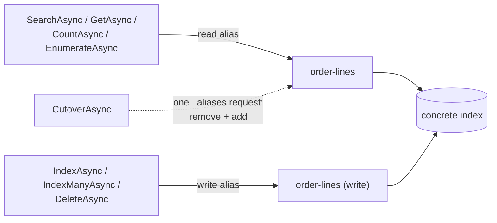

# SharedKernel.Search.ElasticSearch

[](https://dotnet.microsoft.com/)
[](https://github.com/Gresta-Vertex-Labs/platform-shared-kernel/blob/main/LICENSE)


[](https://www.elastic.co/elasticsearch)

> **The Elasticsearch provider for `SharedKernel.Search.Abstractions`: `ISearchIndex<TDocument>` over read and write
> aliases, plus aggregations, point-in-time deep pagination and completion suggestions for analytics-heavy work.**

| You get | So that |
| --- | --- |
| `AddSharedKernelElasticSearchSearch(configuration).AddIndex<T>(read, write, …).Build()` | One chain registers the client, every index, its provisioner and its readiness probe, validated at startup |
| `ISearchIndex<TDocument>` over separate read/write aliases | Reads can move to a rebuilt index while writes continue |
| `IAnalyticsSearch<TDocument>` | Terms, cardinality, stats, date-histogram and range aggregations, tenant-scoped |
| `ICursorSearch<TDocument>` | Relevance-ordered paging past `MaxTotalHits` with point-in-time + `search_after`, resumable across restarts |
| `ISuggestSearch<TDocument>` (`.WithCompletionField`) | Completion-suggester type-ahead, scoped by tenant context |
| `VerifyElasticSearchEngineVersionAsync()` | An explicit startup check that the cluster is 9.x or 10.x |
| One `search-elasticsearch-{index}` readiness probe per index | `/health/ready` reflects each index, with nothing to register |

## Contents

- [Install](#install)
- [Quick start](#quick-start)
- [How it works](#how-it-works)
- [Recipes](#recipes)
- [Configuration](#configuration)
- [Reference](#reference)
- [Testing](#testing)
- [Pitfalls](#pitfalls)
- [Design decisions](#design-decisions)

## Install

```xml
<PackageReference Include="SharedKernel.Search.ElasticSearch" />
```

The version comes from your central `SharedKernelVersion` property — every SharedKernel package ships at the same
version. See [Using the packages](https://github.com/Gresta-Vertex-Labs/platform-shared-kernel#using-the-packages).

| Requirement | Value |
| --- | --- |
| Target framework | `net10.0` |
| Tier | Adapter — reference it from your **Infrastructure** project (or the host) |
| Depends on | `SharedKernel.Search.Abstractions`, `SharedKernel.Configuration`, `Elastic.Clients.Elasticsearch` |
| Engine | Elasticsearch 9.x or 10.x (tested against 9.4.2) |
| Host must register | `IClock` (`SharedKernel.Primitives.Clocks`) and logging |
| Namespaces | `SharedKernel.Search.ElasticSearch.Extensions`, `.Options`, `.Analytics`, `.Cursors`, `.Suggest`, `.Errors`, `.Raw` |

## Quick start

```csharp
using System.Text.Json.Serialization;
using SharedKernel.Primitives.Clocks;
using SharedKernel.Search.Abstractions.Models;
using SharedKernel.Search.ElasticSearch.Extensions;

[JsonSerializable(typeof(OrderLineDocument))]
internal sealed partial class OrderLineJsonContext : JsonSerializerContext;

builder.Services.AddSingleton<IClock, SystemClock>();

builder.Services
    .AddSharedKernelElasticSearchSearch(builder.Configuration)   // section Search:ElasticSearch
    .AddIndex<OrderLineDocument>(readAlias: "order-lines", writeAlias: "order-lines", index => index
        .PrimaryKey(OrderLineFields.DocumentId)
        .TenantField(OrderLineFields.TenantId)
        .Field(OrderLineFields.TenantId, SearchFieldKind.Keyword, filterable: true)
        .Field(OrderLineFields.ProductName, SearchFieldKind.Text, searchable: true)
        .Field(OrderLineFields.Region, SearchFieldKind.Keyword, filterable: true, facetable: true)
        .Field(OrderLineFields.Revenue, SearchFieldKind.Decimal, filterable: true, sortable: true)
        .Field(OrderLineFields.OrderedAt, SearchFieldKind.DateTimeOffset, filterable: true, sortable: true))
    .WithSourceSerializerContext(OrderLineJsonContext.Default)
    .Build();

builder.Services.AddHealthChecks().AddSharedKernelReadiness();   // SharedKernel.ServiceDefaults
```

```json
{
  "Search": {
    "ElasticSearch": {
      "Nodes": [ "https://localhost:9200" ],
      "ApiKey": "<base64 API key>"
    }
  }
}
```

At startup (or in a deployment step), check the cluster and provision the index; then application code uses the
neutral `ISearchIndex<OrderLineDocument>` exactly as with any provider:

```csharp
// using SharedKernel.Primitives.Results;
Result version = await app.Services.VerifyElasticSearchEngineVersionAsync(ct);
Result ensured = await provisioner.EnsureIndexAsync(orderLinesDefinition, ct);   // creates "order-lines"
```

The document type and the neutral API are described in
[`SharedKernel.Search.Abstractions`](https://github.com/Gresta-Vertex-Labs/platform-shared-kernel/blob/main/09.Search/SharedKernel.Search.Abstractions/README.md).

## How it works



- **Registration.** `AddSharedKernelElasticSearchSearch` binds and validates `ElasticSearchOptions` and registers one
  singleton `ElasticsearchClient` (single-node or static node pool). Each `AddIndex<T>` registers scoped
  `ISearchIndex<T>`, `IAnalyticsSearch<T>` and `ICursorSearch<T>`; `WithCompletionField<T>` adds `ISuggestSearch<T>`.
  `Build()` registers `ISearchIndexProvisioner` and `ISearchProviderDescriptor` as singletons, keyed `elasticsearch`
  and unkeyed (the same instance), plus one readiness probe per index. The registered index name is the read alias.
- **Aliases.** Reads go to the read alias, writes to the write alias. A service starts with both set to the same name,
  the concrete index `EnsureIndexAsync` creates. `CutoverAsync` moves the `LiveIndexName` alias to the staging index
  in a single `_aliases` request, so reads never see an undefined alias.
- **Writes.** `SearchWriteConsistency.Accepted` returns once the write is durable; `Searchable` waits for a refresh
  (`refresh=wait_for`). Bulk writes are split by `BulkMaxBytes` and `BulkMaxDocuments`.
- **Parity ceiling.** `MaxTotalHits` defaults to 1000, and `EnsureIndexAsync` lowers `index.max_result_window` to the
  index's ceiling, so a query legal here is legal on Meilisearch. Raise it per index with `.MaxTotalHits(n)`.
- **Counts** use the `_count` API and are always exact.
- **Failures.** Invalid responses are classified onto `search.unreachable`, `search.timeout`, `search.unauthorized`
  or `search.engine_fault` (EventId 9225), the same codes the Meilisearch provider returns for exceptions.
- **Probes** report a yellow cluster as healthy (a single-node cluster is permanently yellow) and cache the result for
  `ProbeCacheSeconds`.

## Recipes

### 1. Aggregate

```csharp
using SharedKernel.Search.ElasticSearch.Analytics;

Result<AggregationResultSet> result = await analytics.AggregateAsync(
    filter: SearchFilter.Eq(OrderLineFields.Region, "emea"),
    aggregations:
    [
        AggregationRequest.Terms("byRegion", OrderLineFields.Region, size: 20,
            subAggregations: [AggregationRequest.Stats("revenue", OrderLineFields.Revenue)]),
        AggregationRequest.DateHistogram("perMonth", OrderLineFields.OrderedAt, DateHistogramInterval.Month),
    ],
    TenantScope.For(tenantId), ct);

if (result.IsSuccess && result.Value.TryGetTerms("byRegion", out var byRegion))
{
    foreach (var bucket in byRegion!.Buckets)
    {
        // bucket.Key, bucket.DocCount, bucket.SubAggregations.TryGetStats("revenue", out var stats)
    }
}
```

The closed set: `Terms`, `Cardinality`, `Stats`, `DateHistogram` (`Minute` … `Year`) and `Range`
(`AggregationBucketRange(key, from, to)`); terms and date histograms take sub-aggregations.

### 2. Page deeply or export in relevance order

```csharp
using SharedKernel.Search.ElasticSearch.Cursors;

await foreach (var hit in cursorSearch.StreamAsync(request, TenantScope.For(tenantId), TimeSpan.FromMinutes(5), ct))
{
    // hit.Document, hit.Rank
}

// Resumable across process restarts:
Result<SearchCursor> cursor = await cursorSearch.OpenCursorAsync(request, TenantScope.For(tenantId), TimeSpan.FromMinutes(5), ct);
Result<CursorPage<OrderLineDocument>> page = await cursorSearch.ReadCursorAsync(cursor.Value, ct);
// page.Value.Hits, page.Value.NextCursor, page.Value.IsExhausted
await cursorSearch.CloseCursorAsync(cursor.Value, ct);
```

Point-in-time plus `search_after`, never scroll. `SearchCursor.Token` is opaque. An expired point-in-time is
`search.elasticsearch.cursor_expired`; a malformed cursor is `search.elasticsearch.invalid_cursor`.
`StreamAsync` faults surface as `SearchStreamException`.

### 3. Completion suggestions

```csharp
builder.Services.AddSharedKernelElasticSearchSearch(builder.Configuration)
    .AddIndex<OrderLineDocument>("order-lines", "order-lines", index => index /* … */)
    .WithCompletionField<OrderLineDocument>("order-lines", OrderLineFields.ProductNameSuggest)
    .Build();

Result<IReadOnlyList<SearchSuggestion>> suggestions = await suggest.SuggestAsync(
    OrderLineFields.ProductNameSuggest, prefix: "wirel", TenantScope.For(tenantId), size: 10, fuzzy: false, ct);
```

`SearchSuggestion` carries `Text`, `DocumentId` and `Score`. The completion field is part of the mapping, so declare
it before documents are indexed (an existing index needs a rebuild); your document populates it. On a tenanted index
the tenant field is a category context on the completion mapping — the suggester ignores query filters.

### 4. Rebuild through a staging index

```csharp
await provisioner.EnsureIndexAsync(stagingDefinition, ct);     // e.g. "order-lines-v2"
// bulk-load order-lines-v2
await provisioner.CutoverAsync(new IndexCutoverRequest
{
    StagingIndexName = "order-lines-v2",
    LiveIndexName = "order-lines",                            // an ALIAS on Elasticsearch
    DeleteStagingAfterCutover = false,                        // see Pitfalls
}, ct);
```

`LiveIndexName` must be an alias: Elasticsearch cannot create an alias with the name of an existing concrete index.
Plan the alias layout (a versioned concrete index behind the read alias) before the first cutover.

### 5. Catch a write alias that points nowhere

```csharp
Result indexes = await provisioner.VerifyRegisteredIndexesAsync(ct);
```

Elasticsearch auto-creates an index on write, so a write alias that resolves to nothing does not fail: every write
lands in a new, mapping-less index no read touches. `VerifyRegisteredIndexesAsync` checks that each write alias (when
it differs from the read alias) resolves and carries the fingerprint `EnsureIndexAsync` writes, and fails with
`search.probe_failed` otherwise (EventId 9227).

### 6. Raise the ceiling for an Elasticsearch-only index

```csharp
.AddIndex<OrderLineDocument>("order-lines", "order-lines", index => index /* … */ .MaxTotalHits(10_000))
```

## Configuration

Section `Search:ElasticSearch` (`ElasticSearchOptions.SectionName`), validated when the host starts.

| Key | Type | Default | Meaning |
| --- | --- | --- | --- |
| `Search:ElasticSearch:Nodes` | `string[]` | — (required, ≥ 1) | Cluster node URIs |
| `Search:ElasticSearch:ApiKey` | `string?` | `null` | API-key authentication; wins over `Username`/`Password` |
| `Search:ElasticSearch:Username` | `string?` | `null` | Basic-auth user, used when `ApiKey` is not set |
| `Search:ElasticSearch:Password` | `string?` | `null` | Basic-auth password |
| `Search:ElasticSearch:CertificateFingerprint` | `string?` | `null` | Expected server certificate fingerprint (self-signed clusters) |
| `Search:ElasticSearch:AllowInvalidCertificates` | `bool` | `false` | Disables TLS validation; logs 9217. Never in production |
| `Search:ElasticSearch:RequestTimeoutSeconds` | `int` | `30` | Request timeout, 1–300 |
| `Search:ElasticSearch:PingTimeoutSeconds` | `int` | `2` | Ping timeout, 1–30 |
| `Search:ElasticSearch:MaxTotalHits` | `int` | `1000` | Pagination ceiling, 1–1000000 (Meilisearch parity, not the native 10 000) |
| `Search:ElasticSearch:MaxFacetValues` | `int` | `100` | Values returned per facet, 1–10000 |
| `Search:ElasticSearch:BulkMaxBytes` | `int` | `10485760` | Target payload bytes per bulk batch, 1048576–52428800 |
| `Search:ElasticSearch:BulkMaxDocuments` | `int` | `2000` | Documents per bulk batch, 1–50000 |
| `Search:ElasticSearch:PointInTimeKeepAliveSeconds` | `int` | `300` | Point-in-time keep-alive, 10–3600 |
| `Search:ElasticSearch:ProbeCacheSeconds` | `int` | `5` | How long a probe result is cached; `0` disables, 0–60 |
| `Search:ElasticSearch:NumberOfShards` | `int` | `1` | Primary shards of a newly provisioned index, 1–100 |
| `Search:ElasticSearch:NumberOfReplicas` | `int` | `1` | Replicas of a newly provisioned index, 0–10 |
| `Search:ElasticSearch:RefreshIntervalSeconds` | `int` | `1` | Refresh interval of a newly provisioned index; `-1` disables, -1–3600 |

## Reference

### Registration

| Method | Registers |
| --- | --- |
| `AddSharedKernelElasticSearchSearch(IConfiguration)` / `(IConfigurationSection)` | `ElasticSearchOptions`, `ElasticsearchClient` (singleton); returns `ElasticSearchBuilder` |
| `.AddIndex<TDocument>(readAlias, writeAlias, configure)` | `ISearchIndex<TDocument>`, `IAnalyticsSearch<TDocument>`, `ICursorSearch<TDocument>` (scoped) |
| `.WithCompletionField<TDocument>(indexName, suggestField)` | `ISuggestSearch<TDocument>` (scoped) and the completion mapping |
| `.WithSourceSerializerContext(JsonSerializerContext)` | The client's source serializer |
| `.AllowRawClientAccess()` | `IElasticSearchRawClientAccessor` (singleton; `Client`) — bypasses tenant scoping |
| `.Build()` | `ISearchIndexProvisioner`, `ISearchProviderDescriptor` (singleton, keyed `elasticsearch` + unkeyed), one readiness probe per index |
| `IServiceProvider.VerifyElasticSearchEngineVersionAsync(ct)` | — returns `Result`: `search.engine_version_unsupported` or `search.unreachable` on failure |

### Errors

Neutral codes come from `SearchErrors` (see the Abstractions README). Elasticsearch-only codes, from
`ElasticSearchErrors`:

| Code | Type | When |
| --- | --- | --- |
| `search.elasticsearch.invalid_cursor` | Validation | A cursor token that cannot be read |
| `search.elasticsearch.cursor_expired` | Conflict | The cursor's point-in-time expired |
| `search.elasticsearch.aggregation_failed` | Unexpected | The engine failed an aggregation |
| `search.elasticsearch.source_serializer_context_missing` | Unexpected | Declared for a missing `JsonSerializerContext`; not returned by the current code (see 9221) |

### Logging

| Event id | Level | Event |
| --- | --- | --- |
| 9200 | Information | Client configured for `{NodeCount}` nodes with `{IndexCount}` indexes |
| 9201 | Information | Engine version verified |
| 9202 | Error | Engine version not supported |
| 9203 | Information | Index ensured (fields, `max_result_window`) |
| 9204 | Debug | Documents indexed with a refresh mode |
| 9205 | Debug | Bulk operation completed |
| 9206 | Warning | Bulk operation partially failed |
| 9207 | Warning | Waiting for a refresh timed out |
| 9208 | Debug | Search returned hits |
| 9209 | Warning | Search request rejected before any I/O |
| 9210 | Warning | Tenanted index called with `TenantScope.Global` |
| 9211 | Information | Alias cutover completed |
| 9212 | Information | Staging index deleted after cutover |
| 9213 | Debug | Point-in-time opened |
| 9214 | Debug | Point-in-time closed |
| 9215 | Warning | Failed to close a point-in-time |
| 9216 | Warning | Raw client access enabled — bypasses tenant scoping |
| 9217 | Warning | TLS certificate validation disabled |
| 9218 | Information | Cluster health yellow, treated as healthy |
| 9219 | Warning | Probe degraded |
| 9220 | Warning | Schema fingerprint mismatch |
| 9221 | Warning | No `JsonSerializerContext` registered; the client falls back to reflection-based serialization |
| 9222 | Error | Operation faulted with a status code |
| 9223 | Debug | Aggregation executed |
| 9224 | Debug | Bulk operation throttled |
| 9225 | Warning | Operation faulted and was mapped to an error code |
| 9226 | Information | Synonyms and stop words applied |
| 9227 | Warning | Index drifted from the registered definition |
| 9228 | Information | Index verified against the registered definition |
| 9229 | Debug | Completion suggester returned suggestions |

### Health

`Build()` registers one `IReadinessProbe` per index, named `search-elasticsearch-{readAlias}`. Ready means the cluster
answers (green or yellow), the alias is addressable with this service's credentials and a zero-row search succeeds.
Expose them with `services.AddHealthChecks().AddSharedKernelReadiness()` (`SharedKernel.ServiceDefaults`).

## Testing

In a service's unit tests, replace the provider with the in-memory fakes of
[`SharedKernel.Search.Testing`](https://github.com/Gresta-Vertex-Labs/platform-shared-kernel/blob/main/16.Testing/SharedKernel.Search.Testing/README.md)
(`AddInMemorySearchIndex<TDocument>(definition)`, `AddInMemorySearchProvisioning()`). They cover the neutral contract
only: code that uses `IAnalyticsSearch<T>`, `ICursorSearch<T>` or `ISuggestSearch<T>` needs a real cluster, for
example `docker.elastic.co/elasticsearch/elasticsearch:9.4.2` with `discovery.type=single-node` in a container.

## Pitfalls

| Don't | Do | Why |
| --- | --- | --- |
| Leave `DeleteStagingAfterCutover` at its default `true` | Pass `false` and delete the *previous* backing index yourself | On Elasticsearch the staging index becomes the live alias target; deleting it deletes the live data |
| Cut over onto a live name that is a concrete index | Make the read alias an alias over a versioned index | Elasticsearch cannot create an alias with an existing index's name |
| Point a write alias at nothing | Run `VerifyRegisteredIndexesAsync` after deploying | Writes silently auto-create a mapping-less index |
| Omit `.WithSourceSerializerContext(...)` in a trimmed or AOT deployment | Register a `JsonSerializerContext` for every document type | Without it the client falls back to reflection-based JSON (warning 9221), which trimming breaks |
| Rely on the client to check the engine version | Call `VerifyElasticSearchEngineVersionAsync` from a startup task | Nothing checks it implicitly |
| Enable `AllowInvalidCertificates` in production | Use `CertificateFingerprint` for self-signed clusters | It disables TLS validation entirely |
| Forget to register `IClock` | `services.AddSingleton<IClock, SystemClock>()` | The index and cursor search resolve it |
| Assume engine-enforced tenant isolation | Configure filtered aliases and role privileges on the cluster if you need it | Document-level security is a commercial-tier feature; isolation here is application-enforced via `TenantScope` |
| Use `IElasticSearchRawClientAccessor` for routine queries | Stay on the typed contracts | The raw client bypasses tenant scoping |

## Design decisions

**Why do aggregations, cursors and suggestions live here?** Meilisearch has only facet counts and numeric min/max, no
point-in-time or `search_after`, and no completion structure. Declaring them in this package makes a provider swap a
build error at every call site instead of a runtime surprise.

**Why is the version check an explicit call?** A check inside the client factory runs at first resolution — usually
inside the first request — blocks a thread and can only log. An async call from a startup task can fail the start.

**Why `MaxTotalHits` 1000?** Parity with Meilisearch: a query that works on one provider works on the other. An index
that will never move can raise its own ceiling.

---

Part of [Platform.SharedKernel](https://github.com/Gresta-Vertex-Labs/platform-shared-kernel) ·
[Search domain](https://github.com/Gresta-Vertex-Labs/platform-shared-kernel/blob/main/09.Search/README.md) ·
[MIT license](https://github.com/Gresta-Vertex-Labs/platform-shared-kernel/blob/main/LICENSE)
