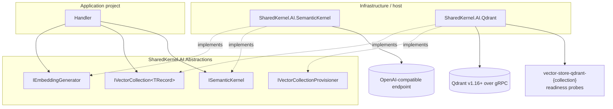

<div align="center">

# SharedKernel Intelligence

**Embeddings, tenant-scoped vector retrieval and LLM chat completion for multi-tenant .NET services. One neutral
contract over Qdrant and Semantic Kernel: every vector is bound to the model that produced it, every call reports
what it cost, and a provider swap is a build error instead of a production surprise.**

[](https://dotnet.microsoft.com/)
[](../LICENSE)

[](SharedKernel.AI.Qdrant/README.md)
[](SharedKernel.AI.SemanticKernel/README.md)

[Packages](#packages) · [Get started](#get-started) · [Guarantees](#guarantees) · [Testing](#testing)

</div>

---

## What this domain gives you

- **Embeddings with identity.** `IEmbeddingGenerator` returns a vector together with its model id, dimension and
  token usage, and vector collections refuse a vector from any other model before a single byte is sent.
- **Tenant-safe vector collections.** `IVectorCollection<TRecord>` upserts, deletes, queries, counts and scrolls with
  a mandatory `TenantScope` on every call, added by the provider as the outermost filter.
- **Portable metadata filters.** A closed eight-node `VectorFilter` that every provider must translate completely,
  never approximately.
- **Chat completion without hidden behaviour.** `ISemanticKernel` returns token usage and finish reason, hands tool
  calls back to you, and never retries or caches unless you opt in.
- **Zero-downtime re-embedding.** Provision a new collection, fill it, and `CutoverAsync` swaps it in atomically.
- **Readiness per collection.** One `vector-store-{provider}-{collection}` probe each, exposed on `/health/ready`.

## Packages

| Package | Tier | When you need it |
| --- | --- | --- |
| [`SharedKernel.AI.Abstractions`](SharedKernel.AI.Abstractions/README.md) | Abstractions | Always, in your **Application** project: the contracts handlers inject. No third-party dependencies |
| [`SharedKernel.AI.Qdrant`](SharedKernel.AI.Qdrant/README.md) | Adapter | You store and search vectors. Qdrant is the vector database provider, with hybrid (dense + sparse) queries and quantization profiles as Qdrant-only extras |
| [`SharedKernel.AI.SemanticKernel`](SharedKernel.AI.SemanticKernel/README.md) | Adapter | You generate embeddings or chat completions against an OpenAI-compatible endpoint |

The two adapters never reference each other. Each declares its own exclusive contracts (for example
`IQdrantHybridQueryAccessor<TRecord>`, `IKernelPluginAccessor`), so code that uses a provider-only feature fails to
compile when that provider is removed. All packages ship at one version, pinned by your `SharedKernelVersion`
property ([Using the packages](../README.md#using-the-packages)).

## How the pieces fit



## Get started

Register both providers in the host:

```csharp
using SharedKernel.AI.Abstractions.Models;
using SharedKernel.AI.Qdrant.Extensions;
using SharedKernel.AI.SemanticKernel.Extensions;
using SharedKernel.Primitives.Clocks;
using SharedKernel.ServiceDefaults.HealthChecks;

builder.Services.AddClock();

builder.Services
    .AddSharedKernelSemanticKernel(builder.Configuration)            // Intelligence:SemanticKernel
    .Build();

builder.Services
    .AddSharedKernelQdrant(builder.Configuration)                    // Intelligence:Qdrant
    .AddCollection<ProductChunk>("product-chunks", c => c
        .EmbeddingModel("text-embedding-3-small", dimension: 1536)
        .DistanceMetric(VectorDistanceMetric.Cosine)
        .Field("tenantId", VectorFieldKind.String, filterable: true)
        .Field("status", VectorFieldKind.String, filterable: true)
        .TenantField("tenantId"))
    .Build();

builder.Services.AddHealthChecks().AddSharedKernelReadiness();     // vector-store-qdrant-product-chunks
```

```json
{
  "Intelligence": {
    "SemanticKernel": {
      "ApiKey": "…",
      "ChatModelId": "gpt-4o-mini",
      "EmbeddingModelId": "text-embedding-3-small"
    },
    "Qdrant": { "Host": "qdrant" }
  }
}
```

Create the collection once with `IVectorCollectionProvisioner.EnsureCollectionAsync` (registration never touches the
server). Then application code sees only the neutral contracts:

```csharp
using SharedKernel.AI.Abstractions.Abstractions;
using SharedKernel.AI.Abstractions.Models;
using SharedKernel.Execution.Tenancy;
using SharedKernel.Primitives.Results;

public sealed class ProductRetrieval(IEmbeddingGenerator embeddings, IVectorCollection<ProductChunk> chunks)
{
    public async Task<Result<VectorQueryResults<ProductChunk>>> FindAsync(
        TenantId tenantId, string question, CancellationToken ct)
    {
        var embedded = await embeddings.EmbedAsync(question, ct);
        if (embedded.IsFailure)
        {
            return Result<VectorQueryResults<ProductChunk>>.Failure(embedded.Error);
        }

        var query = new VectorQuery
        {
            Vector = embedded.Value.Vector,
            ModelId = embedded.Value.ModelId,                        // checked against the collection before any I/O
            Filter = VectorFilter.Eq("status", "active"),
            Limit = 5,
        };

        return await chunks.QueryAsync(query, TenantScope.For(tenantId), ct);
    }
}
```

`ProductChunk` is your own record implementing `IVectorRecord` (`Id`, `Vector`, `ModelId`, `Metadata`). To see
telemetry, call `builder.WithIntelligenceTelemetry()` from `SharedKernel.ServiceDefaults`; it subscribes to the
`SharedKernel.AI` source and meter.

### Runnable examples

No service under [`samples/`](../samples/README.md) uses this domain yet. The two consumer-verify harnesses are the
smallest complete hosts: [`consumer-verify/Qdrant`](consumer-verify/Qdrant/Program.cs) and
[`consumer-verify/SemanticKernel`](consumer-verify/SemanticKernel/Program.cs). Each builds a real host from the
packages, resolves every contract, checks that raw-client hatches stay closed by default, and proves that missing
configuration fails at startup. Neither needs a live server.

## Guarantees

- **A vector is bound to its model.** Writes and queries are checked against the collection's embedding model and
  dimension before any I/O. A mismatch returns `intelligence.embedding_model_mismatch` or
  `intelligence.dimension_mismatch` instead of confidently wrong neighbours.
- **Tenant scope is separate and mandatory.** Every collection call takes `SharedKernel.Execution.Tenancy.TenantScope`.
  Writes stamp the tenant from it; reads filter by it as the outermost clause. A tenant-declaring collection called
  with `TenantScope.Global` fails with `intelligence.tenant_scope_missing` and sends nothing.
- **Cost is visible.** `TokenUsage` is on every embedding and completion result. Nothing retries a completion unless
  the host calls `.WithBoundedRetry(...)`, and even then only on HTTP 429 or 5xx, never on a stream.
- **The kernel never runs your tools.** Tool calls come back as `CompletionFinishReason.ToolCallsRequested`; no
  completion is ever cached.
- **Expected failures are `Result` values** with stable `intelligence.*` codes. Only `ScrollAsync` and
  `CompleteStreamingAsync` throw, as `IntelligenceStreamException`, mid-stream.
- **Content is never logged.** Prompts, completions, retrieved metadata, raw vectors and API keys never appear in a
  log message or an `Error`.
- **Misconfiguration fails at startup**, naming the missing option (`Host`, `ApiKey`, …).
- **`Score` is honest about its scale.** It is provider- and metric-specific (cosine bounded, dot product unbounded,
  Euclidean smaller-is-better); `Rank` is the portable ordering.
- **No LLM readiness probe.** The only honest check would be a real, billed completion.

## Testing

[`SharedKernel.AI.Testing`](../16.Testing/SharedKernel.AI.Testing/README.md) has an in-memory double for every
neutral contract: a deterministic embedding generator (vectors derived from a hash of the text), a vector collection
that applies the same model, dimension and tenant checks as Qdrant, a provisioner, descriptors, and a scripted
`InMemorySemanticKernel`. No model, network or vector database is needed. The Qdrant adapter's own conformance suite
runs against a real `qdrant/qdrant:v1.16.0` container.

## For maintainers

Design rules, invariants and the EventId block (10000–10999) are in [`CLAUDE.md`](CLAUDE.md); phase history is in
[`state-map.md`](state-map.md).
