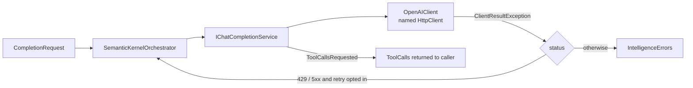

# SharedKernel.AI.SemanticKernel

[](https://dotnet.microsoft.com/)
[](https://github.com/Gresta-Vertex-Labs/platform-shared-kernel/blob/main/LICENSE)


> **The embedding and chat-completion provider for `SharedKernel.AI.Abstractions`, over any OpenAI-compatible
> endpoint. It reports token usage on every call, hands tool calls back to you, and never retries or caches a
> completion unless you ask.**

| You get | So that |
| --- | --- |
| `AddSharedKernelSemanticKernel(configuration).Build()` | One call wires embeddings and chat completion, validated at startup |
| `IEmbeddingGenerator` on OpenAI's `EmbeddingClient` | Every embedding carries its model id, dimension and real token usage |
| `ISemanticKernel` on Semantic Kernel's `IChatCompletionService` | Completions and streaming with token usage and finish reason |
| Tools offered with auto-invoke off | The model can request a tool; your code decides whether and how to run it |
| `.WithBoundedRetry(maxAttempts, baseDelay)` | Retries happen only when you opt in, only on 429 and 5xx, never on a stream |
| `ICompletionProviderDescriptor.ValidateContextWindow` | An oversized prompt is rejected before it is sent and billed |
| One `OpenAIClient` over a named `IHttpClientFactory` client | Embeddings and chat share one connection pipeline |
| `IKernelPluginAccessor` | Semantic Kernel plugins stay available without leaking into application contracts |

## Contents

- [Install](#install)
- [Quick start](#quick-start)
- [How it works](#how-it-works)
- [Recipes](#recipes)
- [Configuration](#configuration)
- [Reference](#reference)
- [Testing](#testing)
- [Pitfalls](#pitfalls)
- [Design decisions](#design-decisions)

## Install

```xml
<PackageReference Include="SharedKernel.AI.SemanticKernel" />
```

The version comes from your central `SharedKernelVersion` property. Every SharedKernel package ships at the same
version. See [Using the packages](https://github.com/Gresta-Vertex-Labs/platform-shared-kernel#using-the-packages).

| Requirement | Value |
| --- | --- |
| Target framework | `net10.0` |
| Tier | Adapter: reference it from your **Infrastructure** project |
| Depends on | `SharedKernel.AI.Abstractions`, `SharedKernel.Primitives`, `SharedKernel.Configuration`, `Microsoft.SemanticKernel` 1.78.0 (+ `Connectors.OpenAI`), `OpenAI` 2.10.0, `Microsoft.Extensions.Http` |
| Namespaces | `SharedKernel.AI.SemanticKernel.Extensions` (registration), `.Options`, `.Plugins`, `.Raw` |

## Quick start

```csharp
using SharedKernel.AI.SemanticKernel.Extensions;

builder.Services
    .AddSharedKernelSemanticKernel(builder.Configuration)   // Intelligence:SemanticKernel
    .Build();
```

```json
{
  "Intelligence": {
    "SemanticKernel": {
      "ApiKey": "…",
      "ChatModelId": "gpt-4o-mini",
      "EmbeddingModelId": "text-embedding-3-small",
      "EmbeddingDimension": 1536
    }
  }
}
```

```csharp
using SharedKernel.AI.Abstractions.Abstractions;
using SharedKernel.Primitives.Results;

public sealed class Summarizer(ISemanticKernel kernel)
{
    public async Task<Result<string>> SummarizeAsync(string text, CancellationToken ct)
    {
        var result = await kernel.CompleteAsync(new CompletionRequest
        {
            Messages =
            [
                new ChatMessage { Role = ChatRole.System, Content = "Summarize in two sentences." },
                new ChatMessage { Role = ChatRole.User, Content = text },
            ],
            MaxOutputTokens = 200,
        }, ct);

        return result.IsSuccess
            ? Result<string>.Success(result.Value.Message.Content)
            : Result<string>.Failure(result.Error);
    }
}
```

`result.Value.TokenUsage` tells you what the call cost.

## How it works



- **Embeddings.** `SemanticKernelEmbeddingGenerator` calls OpenAI's `EmbeddingClient` directly, because Semantic
  Kernel's embedding service returns no token usage. `EmbedManyAsync` rejects an empty list with
  `intelligence.invalid_query` and more than `MaxEmbeddingBatchSize` texts with `intelligence.batch_size_exceeded`,
  both before I/O.
- **Completions.** `CompletionRequest.ModelId` defaults to `ChatModelId`. Token usage and finish reason come from the
  connector's response metadata. `CompleteStreamingAsync` yields `CompletionChunk`s and throws
  `IntelligenceStreamException` on a mid-stream failure.
- **Tools.** Each `ToolDefinition` is offered to the model with `ToolCallBehavior.EnableFunctions(…, autoInvoke:
  false)`. A `ToolCallsRequested` result carries `ToolCalls`; you run them and send a follow-up request.
- **Retries.** None by default. With `.WithBoundedRetry(maxAttempts, baseDelay)`, `CompleteAsync` retries a
  `ClientResultException` with status 429 or ≥ 500, waiting `baseDelay × 2^(attempt − 1)` between attempts, up to
  `maxAttempts` attempts in total. A 4xx other than 429 is never retried, and streaming is never retried.
- **Context window.** `ICompletionProviderDescriptor.ValidateContextWindow(estimatedTokens)` compares your estimate
  with `ContextWindowTokens`. `CompleteAsync` does not estimate on its own.
- **Transport.** One `OpenAIClient` singleton uses the named `HttpClient` `SharedKernel.AI.SemanticKernel` (timeout
  `HttpTimeoutSeconds`), and `Endpoint` when set. Nothing calls `new HttpClient()`.

## Recipes

### 1. Opt in to bounded retries

```csharp
builder.Services
    .AddSharedKernelSemanticKernel(builder.Configuration)
    .WithBoundedRetry(maxAttempts: 3, baseDelay: TimeSpan.FromMilliseconds(500))
    .Build();
```

Each retry is billed again and can return a different answer. `maxAttempts` below 1 throws
`ArgumentOutOfRangeException` when `WithBoundedRetry` is called.

### 2. Use an OpenAI-compatible gateway

Set `Intelligence:SemanticKernel:Endpoint` to the gateway's base URI (a self-hosted or Azure-compatible endpoint).
Leave it unset for OpenAI itself.

### 3. Validate a prompt before sending it

```csharp
public sealed class Guarded(ISemanticKernel kernel, ICompletionProviderDescriptor limits)
{
    public async Task<Result<CompletionResult>> AskAsync(CompletionRequest request, int estimatedTokens, CancellationToken ct)
    {
        var fits = limits.ValidateContextWindow(estimatedTokens);   // intelligence.context_window_exceeded
        return fits.IsFailure
            ? Result<CompletionResult>.Failure(fits.Error)
            : await kernel.CompleteAsync(request, ct);
    }
}
```

### 4. Use Semantic Kernel plugins

Inject `IKernelPluginAccessor` and use its `Kernel`: a separate `Microsoft.SemanticKernel.Kernel` wired to the same
chat-completion service. Plugins invoked there are ordinary Semantic Kernel execution and never affect
`ISemanticKernel`. Referencing this type ties that code to this package.

## Configuration

Section `Intelligence:SemanticKernel` (`SemanticKernelOptions.SectionName`), validated when the host starts. The
`AddSharedKernelSemanticKernel(IConfigurationSection)` overload binds any other section.

| Key | Type | Default | Meaning |
| --- | --- | --- | --- |
| `Intelligence:SemanticKernel:ApiKey` | `string` | — (required) | API key for the endpoint |
| `Intelligence:SemanticKernel:ChatModelId` | `string` | — (required) | Chat model; the default for `CompletionRequest.ModelId` |
| `Intelligence:SemanticKernel:EmbeddingModelId` | `string` | — (required) | Embedding model; becomes `IEmbeddingGenerator.ModelId` |
| `Intelligence:SemanticKernel:EmbeddingDimension` | `int` | `1536` | Dimension the embedding model produces (1–1000000) |
| `Intelligence:SemanticKernel:Endpoint` | `Uri?` | `null` | OpenAI-compatible endpoint; `null` uses OpenAI |
| `Intelligence:SemanticKernel:Organization` | `string?` | `null` | Bound and validated, but not currently passed to the client |
| `Intelligence:SemanticKernel:ContextWindowTokens` | `int` | `128000` | Backs `ValidateContextWindow` (1–10000000) |
| `Intelligence:SemanticKernel:MaxOutputTokens` | `int` | `4096` | Reported as `ICompletionProviderDescriptor.MaxOutputTokens` (1–1000000) |
| `Intelligence:SemanticKernel:MaxEmbeddingBatchSize` | `int` | `2048` | Most texts per `EmbedManyAsync` call (1–100000) |
| `Intelligence:SemanticKernel:HttpTimeoutSeconds` | `int` | `60` | Timeout of the named `HttpClient` (1–600) |

## Reference

### Registration

| Method | Registers |
| --- | --- |
| `AddSharedKernelSemanticKernel(IConfiguration)` / `(IConfigurationSection)` | `SemanticKernelOptions`, the named `HttpClient`, `OpenAIClient` (singleton); returns `SemanticKernelBuilder` |
| `SemanticKernelBuilder.WithBoundedRetry(int maxAttempts, TimeSpan baseDelay)` | The retry policy for `CompleteAsync` |
| `SemanticKernelBuilder.AllowRawClientAccess()` | `IKernelRawClientAccessor` (singleton) at `Build()` |
| `SemanticKernelBuilder.Build()` | `IEmbeddingGenerator`, `IChatCompletionService`, `ISemanticKernel`, `ICompletionProviderDescriptor`, `IKernelPluginAccessor` (singletons) |

`ICompletionProviderDescriptor.ProviderName` is `semantickernel`.

### Errors

| Failure | Code |
| --- | --- |
| HTTP 401, 403 | `intelligence.unauthorized` |
| HTTP 404 | `intelligence.model_not_found` |
| HTTP 429 | `intelligence.rate_limited` (no retry-after value) |
| HTTP ≥ 500 | `intelligence.engine_fault` |
| Any other status or exception | `intelligence.completion_failed` |
| Empty `EmbedManyAsync` input | `intelligence.invalid_query` |
| More than `MaxEmbeddingBatchSize` texts | `intelligence.batch_size_exceeded` |
| Estimate above `ContextWindowTokens` | `intelligence.context_window_exceeded` |

### Logging

| Event id | Level | Event |
| --- | --- | --- |
| 10300 | Information | Provider configured with chat and embedding model ids |
| 10301 | Debug | Texts embedded, with billed token count |
| 10302 | Warning | Embedding batch above the ceiling |
| 10303 | Debug | Completion finished, with finish reason and billed tokens |
| 10304 | Debug | Streaming completion started |
| 10305 | Warning | Request rejected before any I/O (declared; not emitted by the current code) |
| 10306 | Warning | Estimated prompt above the context window (declared; not emitted by the current code) |
| 10307 | Error | Operation faulted |
| 10308 | Warning | Raw client access enabled |
| 10309 | Warning | Retrying a completion (attempt, maximum, error code) |

Prompts, completions and the API key are never logged.

### Health

No readiness probe, by design: the only honest check of an LLM endpoint is a real, billed completion.

## Testing

In a service's tests, use
[`SharedKernel.AI.Testing`](https://github.com/Gresta-Vertex-Labs/platform-shared-kernel/blob/main/16.Testing/SharedKernel.AI.Testing/README.md):
`services.AddInMemorySemanticKernel()` and `services.AddInMemoryEmbeddingGenerator(modelId, dimension)`. Script
answers with `InMemorySemanticKernel.EnqueueResponse`, `EnqueueStreamingResponse` or `EnqueueStreamingFailure`, and
assert on `SentRequests`. Never call a paid endpoint by default and never assert on generated text. A host with this
registration starts without network access, because the client makes no call until it is used.

## Pitfalls

| Don't | Do | Why |
| --- | --- | --- |
| Expect `CompleteAsync` to run tools | Execute `ToolCalls` yourself and append `ToolCallResult.ToMessage()` | Tools are offered with auto-invoke off |
| Wrap `CompleteAsync` in your own retry loop | Use `.WithBoundedRetry(...)` if you need retries at all | Your loop would also retry permanent 4xx failures and multiply cost |
| Retry a stream after it failed | Surface the failure, or start a new request knowingly | Content already yielded would be duplicated |
| Change `EmbeddingModelId` without re-embedding | Re-embed into a new collection and cut over | Vector collections reject the new model id with `embedding_model_mismatch` |
| Rely on `Organization` | Scope access with the API key or the gateway | The value is not passed to the OpenAI client today |
| Inject `Kernel`, `IChatCompletionService` or `OpenAIClient` in application code | Inject `ISemanticKernel` and `IEmbeddingGenerator` | A provider swap stays a composition-root change (analyzer `SK0026`) |
| Use `IKernelRawClientAccessor` for routine calls | Use the contracts; opt in to the raw client only as a last resort | The raw client bypasses token accounting, retry policy and error mapping |

## Design decisions

**Why build embeddings on `EmbeddingClient` instead of Semantic Kernel's embedding service?** Semantic Kernel's
`ITextEmbeddingGenerationService` returns only vectors. OpenAI's `EmbeddingClient` reports input and total tokens,
and every `EmbeddingResult` must carry real usage. Chat stays on `IChatCompletionService`, whose metadata carries
usage and finish reason.

**Why decide retries on the HTTP status and not on the error type?** A 400 and a 503 can map to errors of the same
`ErrorType`. Only the real status separates a transient fault from a permanent one.

**Why no completion cache?** A cached answer is one the caller did not ask for, and this domain may not depend on a
cache.

---

Part of [Platform.SharedKernel](https://github.com/Gresta-Vertex-Labs/platform-shared-kernel) ·
[Intelligence domain](https://github.com/Gresta-Vertex-Labs/platform-shared-kernel/blob/main/10.Intelligence/README.md) ·
[MIT license](https://github.com/Gresta-Vertex-Labs/platform-shared-kernel/blob/main/LICENSE)
