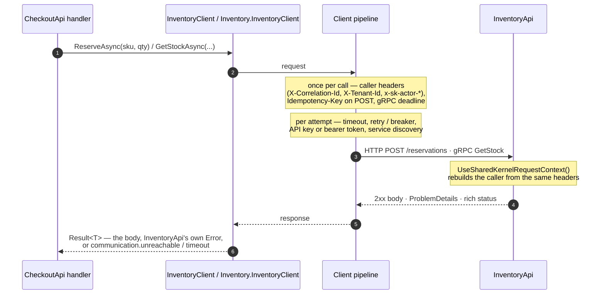

<div align="center">

# 11.Communication

**Outbound service-to-service calls: typed REST and gRPC clients configured from `appsettings.json`, resilient by
default, that carry the caller to the next service and return `Result` instead of throwing.**

[](https://dotnet.microsoft.com/)
[](../LICENSE)


</div>

A service calling another service needs the same things every time: an address that works on a laptop and in a
Kubernetes cluster; retries, timeouts and a circuit breaker that never repeat a side effect; credentials; a
correlation id so both sides' logs join up; the tenant and actor so the next service can authorise; and a failure that
arrives as the other service's own error. These packages do all of that once, at the composition root, so a typed
client method is one line.

## What this domain gives you

- **One registration, settings in configuration** — `AddSharedKernelCommunication(configuration)` plus one
  `AddRestClient`/`AddGrpcClient` per service; every client's address, timeouts, retries and credentials live under
  `SharedKernel:Communication:Clients:{name}` and are validated when the host starts.
- **Service discovery** through `Microsoft.Extensions.ServiceDiscovery` — configuration (Aspire), Kubernetes DNS or DNS
  SRV, round-robin per request.
- **Safe resilience** — Microsoft.Extensions.Http.Resilience for REST, gRPC's own retry policy for gRPC; a POST or
  PATCH is retried only with an `Idempotency-Key`.
- **Outbound credentials** — OAuth 2.0 client credentials, API key, your own `IAccessTokenProvider`, mutual TLS.
- **The caller travels** — correlation id, tenant, actor and client from `IRequestContextAccessor`, whether the call
  starts in an HTTP request, a message consumer, a workflow activity or a scheduled job.
- **Errors round-trip** — ProblemDetails and rich gRPC statuses become the called service's `Error`; a call that got
  no answer is `communication.unreachable`, `.timeout` or `.circuit_open`.

## Packages

| Package | Tier | When you need it |
| --- | --- | --- |
| [`SharedKernel.Communication`](SharedKernel.Communication/README.md) | Adapter | The shared base — service discovery, credentials, mTLS, `communication.*` codes. Comes with the two below |
| [`SharedKernel.Communication.Rest`](SharedKernel.Communication.Rest/README.md) | Adapter | You call another service over HTTP/JSON: `AddRestClient<IClient, Client>(name)`, `GetResultAsync`/`PostResultAsync` |
| [`SharedKernel.Communication.Grpc`](SharedKernel.Communication.Grpc/README.md) | Adapter | You call another service over gRPC: `AddGrpcClient<T>(name)`, `ToResultAsync()`, `google.type.Money` ↔ `Money` |

All three go into a service's **Infrastructure** project and reference nothing from ASP.NET Core. Test doubles live in
[`SharedKernel.Communication.Testing`](../16.Testing/SharedKernel.Communication.Testing/README.md)
(`StubHttpMessageHandler`, `GrpcCalls`, `TestServerCallContext`). Server-side conventions — the ProblemDetails and rich
statuses these clients read back — live in [`14.Presentation`](../14.Presentation/README.md).

## How a call travels

The call path of the sample: CheckoutApi reserves stock over REST and reads it over gRPC from InventoryApi.



## Get started

Reference the protocol package from your Infrastructure project:

```xml
<PackageReference Include="SharedKernel.Communication.Rest" />
```

Register the client and write it as one line per call:

```csharp
using SharedKernel.Communication;
using SharedKernel.Primitives.Results;

builder.Services.AddSharedKernelCommunication(builder.Configuration)
    .AddRestClient<IInventoryClient, InventoryClient>("inventory");

public sealed class InventoryClient(HttpClient http) : IInventoryClient
{
    public Task<Result<InventoryReservation>> ReserveAsync(string sku, int quantity, CancellationToken ct) =>
        http.PostResultAsync<ReserveRequest, InventoryReservation>(
            "reservations", new ReserveRequest(sku, quantity), cancellationToken: ct);
}
```

```json
{
  "SharedKernel": {
    "Communication": {
      "Clients": {
        "inventory": { "BaseAddress": "http://inventory", "PropagateIdempotencyKey": true }
      }
    }
  },
  "Services": { "inventory": { "http": [ "http://localhost:5080" ] } }
}
```

For the caller to travel, the host opens a request context — `AddSharedKernelRequestContext()` and
`app.UseSharedKernelRequestContext()` from
[`SharedKernel.ServiceDefaults.Security`](../13.ServiceDefaults/SharedKernel.ServiceDefaults.Security/README.md) — and
`builder.WithCommunicationTelemetry()` adds outbound spans and resilience metrics.

## The sample

[`samples/CheckoutApi`](../samples/CheckoutApi/) → [`samples/InventoryApi`](../samples/InventoryApi/) are two services
talking over both protocols:

- CheckoutApi registers `inventory` (REST, `http://inventory`, `PropagateIdempotencyKey`) and `inventory-grpc` (gRPC,
  `http://_grpc.inventory`), both resolved through the `Services` section and both sending InventoryApi's API key.
- InventoryApi authenticates the key (`SharedKernel.Security.ApiKey`), rebuilds the caller with
  `UseSharedKernelRequestContext()`, and answers errors as RFC 9457 problems over REST and rich statuses over gRPC.
- `CheckoutApi.Tests` runs the scenarios end to end: a retried reservation made once, no stock arriving as the
  inventory's 409, a bad quantity as its field error, an unknown SKU as the 404 from its gRPC status, the inventory
  down as a 503 rather than an exception, and the caller's correlation id and idempotency key reaching the inventory.

## Guarantees

- **Settings are validated at startup.** A missing address, a total timeout shorter than an attempt, a breaker window
  too short for its timeout, a missing certificate file: the host does not start, and says why.
- **Retries never repeat a side effect.** POST and PATCH are retried or hedged only with an `Idempotency-Key`; gRPC
  retries only calls the service has not answered.
- **Every switch is real.** `MaxRetryAttempts = 0` means one attempt; `CircuitBreaker:Enabled = false` means no breaker.
- **Caller-supplied values win.** A header, metadata entry, `Authorization` or deadline you set is never overwritten.
- **No exceptions for a failed call.** Unreachable, timed out, circuit open, no token: `Error` values. Only the
  caller's own cancellation throws.
- **The correlation id is the caller's**, end to end — never `Activity.Id`.
- **Secrets stay out of logs.** Event ids 11000–11999 (base 11000–11099, Grpc 11100–11199, Rest 11200–11299); tokens
  and secrets are never logged.

---

For maintainers: rules in [`CLAUDE.md`](CLAUDE.md), phase history in [`state-map.md`](state-map.md).
