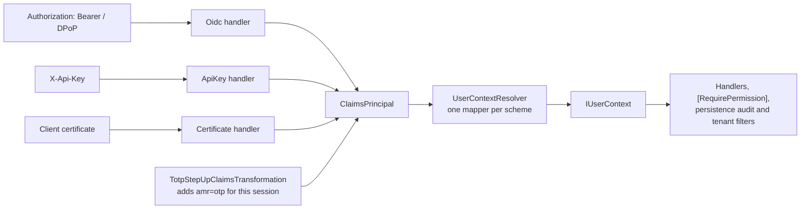

# 12.Security

[](https://dotnet.microsoft.com/)
[](https://github.com/Gresta-Vertex-Labs/platform-shared-kernel/blob/main/LICENSE)


> **Authentication for .NET services that turns every kind of caller into one `IUserContext`.**

A service is called by people signed in through an identity provider, by other services with client-credentials
tokens, by partners with API keys or client certificates, and by its own background jobs. Application code should not
care which. These packages authenticate each kind of caller with secure defaults and give the application one
identity model to read: who the caller is, which tenant they act for, what they may do, and how recently and how
strongly they signed in.

## Packages

| Package | Use it for | Entry point |
| --- | --- | --- |
| [`SharedKernel.Security.Abstractions`](SharedKernel.Security.Abstractions/README.md) | The identity model application code injects: `IUserContext` (caller, tenant, roles, permissions), `IUserContextMapper`. Abstractions tier | Referenced by the others; register `SystemUserContext.Instance` in background hosts |
| [`SharedKernel.Security.Oidc`](SharedKernel.Security.Oidc/README.md) | JWT access tokens from any OpenID Connect provider (Entra ID, External ID, Auth0, Okta, Keycloak), with DPoP, certificate-bound tokens and revocation | `AddOidcAuthentication(configuration)` |
| [`SharedKernel.Security.ApiKey`](SharedKernel.Security.ApiKey/README.md) | Machine clients with API keys: generated, hashed at rest, expiring and revocable, or checked by your own validator | `AddManagedApiKeyAuthentication<TStore>(...)` or `AddApiKeyAuthentication<TValidator>()` |
| [`SharedKernel.Security.Mtls`](SharedKernel.Security.Mtls/README.md) | Partners and services authenticating with client certificates, including a private certificate authority | `AddMtlsAuthentication<TValidator>()` |
| [`SharedKernel.Security.Totp`](SharedKernel.Security.Totp/README.md) | Authenticator-app enrollment, recovery codes and session-bound step-up for sensitive operations | `AddSharedKernelCryptography(configuration).AddTotpStepUp<TStepUpStore, TRecoveryCodeStore>()` |

Application and domain-adjacent code references only `SharedKernel.Security.Abstractions`. The other packages are
referenced by the host's `Program.cs`.

## Which package do I need?

| Caller | Package |
| --- | --- |
| A user signed in through an identity provider | `.Oidc` |
| Another service using the client-credentials flow | `.Oidc` (reported as `ActorKind.Service`) |
| A partner or script that cannot run an OAuth flow | `.ApiKey` |
| A regulated partner required to use mutual TLS | `.Mtls` |
| A user performing a payment, payout or settings change that needs a fresh second factor | `.Totp` on top of `.Oidc` |
| A background job, consumer or scheduled task | `.Abstractions` (`SystemUserContext`) |

## How the pieces fit

Each authentication package registers an authentication scheme and an `IUserContextMapper` for it. When code
resolves `IUserContext`, `UserContextResolver` takes the first authenticated identity on the request whose
authentication type has a mapper. Registration order does not matter, and a package never wraps another package's
registration.



## One host with every caller type

```csharp
using SharedKernel.Cryptography.Extensions;
using SharedKernel.Cryptography.Totp;
using SharedKernel.Security.Abstractions;
using SharedKernel.Security.ApiKey.Extensions;
using SharedKernel.Security.Mtls;
using SharedKernel.Security.Mtls.Extensions;
using SharedKernel.Security.Oidc.Extensions;
using SharedKernel.Security.Totp;

var builder = WebApplication.CreateBuilder(args);

// Users and client-credentials tokens: configuration in SharedKernel:Security:Oidc.
builder.Services.AddOidcAuthentication(builder.Configuration)
    .AddDpop<RedisDpopReplayCache>()                 // proof-of-possession tokens
    .AddTokenRevocation<IntrospectionRevocationCheck>();

// Partners with API keys. Requests carrying X-Api-Key use this scheme; all others use the bearer scheme.
builder.Services.AddManagedApiKeyAuthentication<SqlApiKeyStore>(keys => keys.Prefix = "acme");

// Partners with client certificates. Not a default scheme: endpoints opt in.
builder.Services.AddMtlsAuthentication<PartnerCertificateValidator>();

// Second factor for sensitive operations.
builder.Services.AddSingleton<ITotpReplayGuard, RedisTotpReplayGuard>();
builder.Services.AddSharedKernelCryptography(builder.Configuration)
    .AddTotpStepUp<SqlTotpStepUpStore, SqlRecoveryCodeStore>();

builder.Services.AddAuthorization();

var app = builder.Build();
app.UseAuthentication();
app.UseAuthorization();

app.MapGet("/me", (IUserContext user) => new { user.ActorKind, user.SubjectId, user.TenantId, user.Roles })
    .RequireAuthorization();

app.MapPost("/partner/settlements", (IUserContext partner) => Results.Accepted())
    .RequireAuthorization(policy => policy
        .AddAuthenticationSchemes(MtlsAuthenticationDefaults.AuthenticationScheme)
        .RequireAuthenticatedUser());

app.Run();
```

The store, cache, check and validator types are yours: each package README shows a complete implementation.

| Layer | Adds | Package |
| --- | --- | --- |
| Kestrel client-certificate negotiation, forwarded certificates behind a proxy | `AddMtlsClientCertificate`, `AddMtlsForwardedHeaderCertificate` | [`SharedKernel.ServiceDefaults.Security.Mtls`](https://github.com/Gresta-Vertex-Labs/platform-shared-kernel/tree/main/13.ServiceDefaults/SharedKernel.ServiceDefaults.Security.Mtls) |
| Endpoint attributes: `[RequireRole]`, `[RequireEndpointPermission]`, `[RequireFreshAuthentication]`, `[RequireAuthenticationMethod]` | ProblemDetails 401/403 | [`SharedKernel.Presentation.Core`](https://github.com/Gresta-Vertex-Labs/platform-shared-kernel/tree/main/14.Presentation/SharedKernel.Presentation.Core) (namespace `SharedKernel.Presentation.Authorization`) |
| Tenant resolution from the tenant claim, a header or a database | `AddSharedKernelMultiTenancy()` | [`SharedKernel.MultiTenancy`](https://github.com/Gresta-Vertex-Labs/platform-shared-kernel/tree/main/13.ServiceDefaults/SharedKernel.MultiTenancy) |
| Hashing, random values, TOTP algorithms | `AddSharedKernelCryptography(configuration)` | [`SharedKernel.Cryptography`](https://github.com/Gresta-Vertex-Labs/platform-shared-kernel/tree/main/01.Core/SharedKernel.Cryptography) |

## Shared defaults

- **Fail closed.** A token revocation check or DPoP replay cache that fails rejects the request instead of letting it
  through.
- **Asymmetric token signatures only.** `none` and HMAC algorithms are rejected at startup.
- **Claim names are not renamed.** `sub` stays `sub`; claim types come from configuration.
- **Ordinal comparisons.** Roles, permissions and scopes are case-sensitive.
- **Credentials in headers only.** API keys are never read from the query string.
- **Misconfiguration stops startup.** Options are validated when the host starts, not on the first request.
- **Scoped identity.** `IUserContext` is resolved per request; never capture it in a
  singleton.
- **Structured logs, no secrets.** Event ids 12100-12499; tokens, API keys and one-time codes are never logged.

| Package | Event ids |
| --- | --- |
| `.Oidc` | 12100-12199 |
| `.ApiKey` | 12200-12299 |
| `.Mtls` | 12300-12399 |
| `.Totp` | 12400-12499 |

## Reporting a vulnerability

Please do not open a public issue. Report privately through the repository's
[Security tab](https://github.com/Gresta-Vertex-Labs/platform-shared-kernel/security) (**Report a vulnerability**),
as described in the [security policy](https://github.com/Gresta-Vertex-Labs/platform-shared-kernel/blob/main/SECURITY.md).
