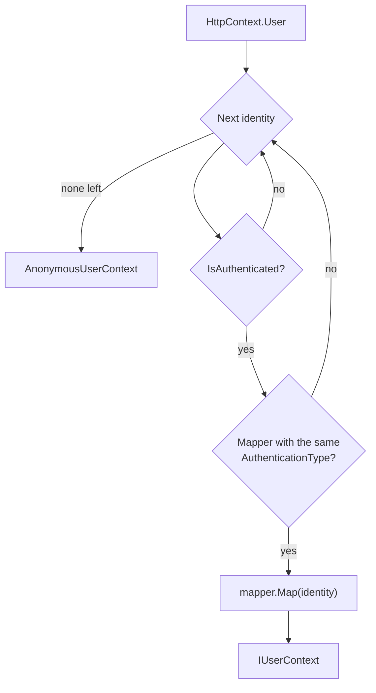
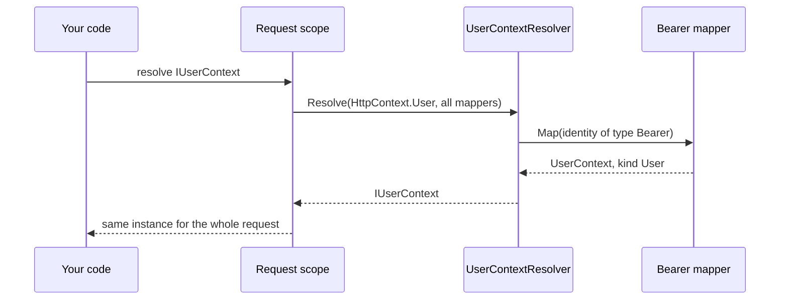

# SharedKernel.Security.Abstractions

[](https://dotnet.microsoft.com/)
[](https://github.com/Gresta-Vertex-Labs/platform-shared-kernel/blob/main/LICENSE)


> **One model of the caller for every .NET service: who is calling, for which tenant, with what rights, and how
> recently and strongly they signed in.**

A service is called by people, by other services, by partners with API keys or certificates, and by its own
background jobs. Each arrives through a different authentication scheme with different claim names. Code that reads
`ClaimsPrincipal` directly gets every one of those details wrong sooner or later: a GUID-parsed subject that breaks for
`auth0|…` users, a case-insensitive scope check, a job that runs as "anonymous", a claim from a scheme nobody vetted.
This package defines `IUserContext`, the one identity type application code reads, and the small seam authentication
packages use to produce it. It has no ASP.NET Core dependency, so domain-adjacent code and tests use it freely.

| 👤 Caller | 🏢 Tenant | 🔑 Rights | ⏱️ Step-up |
| --- | --- | --- | --- |
| `IdentityKind`: User, ServicePrincipal, System, Anonymous | `ITenantProvider` with a `Guid.Empty` no-tenant sentinel | Roles and permissions, compared ordinally | `amr`, `acr` and `auth_time` of the sign-in |
| String `SubjectId`, any identity provider format | Tenant asserted by the credential | Uninitialized values fail closed | Freshness checks against an injected clock |
| Ready-made anonymous and system contexts | `UserContextTenantProvider` | Checks read mapped values, never raw claims | Sender-constrained token flag (DPoP, mTLS) |

## Contents

- [Install](#install)
- [Quick start](#quick-start)
- [Which type do I need?](#which-type-do-i-need)
- [How it works](#how-it-works)
- [Recipes](#recipes)
- [Reference](#reference)
- [Security model](#security-model)
- [Pitfalls](#pitfalls)
- [AI quick reference](#ai-quick-reference)
- [Compatibility and guarantees](#compatibility-and-guarantees)

## Install

```shell
dotnet add package SharedKernel.Security.Abstractions
```

| Requirement | Value |
| --- | --- |
| Target framework | `net10.0` |
| Dependencies | None outside the .NET base class library |
| Namespace | `SharedKernel.Security.Abstractions` |
| Registration | None in this package. An authentication package registers `IUserContext` and `ITenantProvider`; a background host registers `SystemUserContext` |

Reference this package from application code. Reference an authentication package only from the host's `Program.cs`.

| Companion package | Adds |
| --- | --- |
| [`SharedKernel.Security.Oidc`](https://github.com/Gresta-Vertex-Labs/platform-shared-kernel/tree/main/12.Security/SharedKernel.Security.Oidc) | JWT access tokens from any OpenID Connect provider, as `User` or `ServicePrincipal` contexts |
| [`SharedKernel.Security.ApiKey`](https://github.com/Gresta-Vertex-Labs/platform-shared-kernel/tree/main/12.Security/SharedKernel.Security.ApiKey) | API key clients, as `ServicePrincipal` contexts |
| [`SharedKernel.Security.Mtls`](https://github.com/Gresta-Vertex-Labs/platform-shared-kernel/tree/main/12.Security/SharedKernel.Security.Mtls) | Client certificate clients, as `ServicePrincipal` contexts |
| [`SharedKernel.Security.Totp`](https://github.com/Gresta-Vertex-Labs/platform-shared-kernel/tree/main/12.Security/SharedKernel.Security.Totp) | Session step-up that adds `otp` to `AuthenticationMethods` |
| [`SharedKernel.Presentation.WebApi`](https://github.com/Gresta-Vertex-Labs/platform-shared-kernel/tree/main/14.Presentation/SharedKernel.Presentation.WebApi) | `[RequireRole]`, `[RequirePermission]`, `[RequireFreshAuthentication]`, `[RequireAuthenticationMethod]` endpoint attributes over `IUserContext` |
| [`SharedKernel.MultiTenancy`](https://github.com/Gresta-Vertex-Labs/platform-shared-kernel/tree/main/13.ServiceDefaults/SharedKernel.MultiTenancy) | Tenant resolution from claims, headers or a database, as its own `ITenantProvider` |

## Quick start

**1. Register an authentication package** in the host. It adds the scheme, its mapper, a scoped `IUserContext` and a
scoped `ITenantProvider`.

```csharp
// Program.cs
using SharedKernel.Security.Oidc.Extensions;

builder.Services.AddOidcAuthentication(builder.Configuration); // settings: SharedKernel:Security:Oidc
builder.Services.AddAuthorization();

WebApplication app = builder.Build();
app.UseAuthentication();
app.UseAuthorization();
```

**2. Inject `IUserContext`** wherever you need the caller. Nothing else in application code touches claims.

```csharp
using SharedKernel.Security.Abstractions;

app.MapGet("/me", (IUserContext caller) => Results.Ok(new
{
    Kind = caller.IdentityKind.ToString(),
    caller.SubjectId,
    caller.ClientId,
    caller.TenantId,
    caller.Roles,
    caller.Permissions,
}))
.RequireAuthorization();
```

**3. In a host without incoming requests** (a worker, a consumer), register the system context instead:

```csharp
builder.Services.AddScoped<IUserContext>(_ => SystemUserContext.Instance);
builder.Services.AddScoped<ITenantProvider, UserContextTenantProvider>();
```

> [!TIP]
> Authentication packages register `IUserContext` and `ITenantProvider` with `TryAdd`. A registration you make yourself
> wins regardless of order, which is how a service supplies its own implementation.

## Which type do I need?

| I need to… | Use | Recipe |
| --- | --- | --- |
| Know who is calling and treat people, integrations and jobs differently | `IUserContext.IdentityKind` | [Read the caller](#1-read-the-caller-in-a-handler) |
| Allow an action by permission (OAuth scope) or role | `HasPermission`, `HasRole` | [Permissions and roles](#2-check-permissions-and-roles) |
| Require a recent, strong sign-in for a payment or settings change | `WasAuthenticatedWith`, `IsAuthenticationFresherThan` | [Step-up checks](#3-require-a-recent-strong-sign-in) |
| Require a step-up that is still recent, also on a SignalR connection | `GetAuthenticationMethodTime` | [Step-up checks](#3-require-a-recent-strong-sign-in) |
| Run a background job under a trusted identity | `SystemUserContext` | [Background workers](#4-run-background-work-as-the-system) |
| Get the tenant of the current operation | `ITenantProvider` | [Read the caller](#1-read-the-caller-in-a-handler) |
| Support an authentication scheme no package covers | `IUserContextMapper`, `UserContextResolver` | [Custom scheme](#5-map-a-custom-authentication-scheme) |
| Feed the MediatR pipeline's authorization and caching | `IRequestContext` over `IUserContext` | [Application bridge](#6-bridge-to-the-application-pipeline) |
| Test code that reads the caller | `UserContext`, `AnonymousUserContext`, `SystemUserContext` | [Testing](#7-test-code-that-reads-the-caller) |
| Name a standard claim without a string literal | `SecurityClaimTypes` | [Reference](#securityclaimtypes) |

## How it works

### Four kinds of caller

Every `IUserContext` has an `IdentityKind`. `IsAuthenticated` is `true` for every kind except `Anonymous`, so branch on
the kind when a job or an integration must not be treated like a person.

| Member | `User` | `ServicePrincipal` | `System` | `Anonymous` |
| --- | --- | --- | --- | --- |
| Who | A person, signed in through an identity provider | An application acting for itself: client-credentials token, API key, client certificate | Trusted code with no caller: scheduled job, consumer, workflow activity | No authenticated caller |
| `IsAuthenticated` | `true` | `true` | `true` | `false` |
| `SubjectId` | The subject (`sub`, or the configured claim) | The client's id | `null` | `null` |
| `ClientId` | The application the user came through (`azp`, `client_id`), if present | The client's id | `null` | `null` |
| `TenantId` | From the credential, if it carries a GUID | From the credential, if it carries a GUID | `null` | `null` |
| `SessionId` | `sid`, else the token id | `sid` or token id for OIDC tokens; `null` for API keys and certificates | `null` | `null` |
| `Name`, `Email` | From the credential | Usually `null` | `null` | `null` |
| `Roles`, `Permissions` | Granted roles and scopes | Granted roles and scopes | Empty | Empty |
| `AuthenticationMethods`, `AuthContextClassReference`, `AuthTime` | `amr`, `acr`, `auth_time` | Usually empty or `null` | Empty, `null` | Empty, `null` |
| `IsSenderConstrained` | DPoP-bound or certificate-bound token | DPoP-bound or certificate-bound token | `false` | `false` |
| `HasRole`, `HasPermission`, `WasAuthenticatedWith`, `IsAuthenticationFresherThan` | Ordinal checks | Ordinal checks | Always `false` | Always `false` |

`SubjectId` is never `null` for `User` and `ServicePrincipal`, and always `null` for the other two. It is a string
because identity providers issue subjects in any format: `auth0|5f7c…`, Okta ids, pairwise identifiers, GUIDs.

`IdentityKind.Anonymous` is `0`, the enum's default, so an uninitialized value means "no caller", never "someone".

### From authentication to `IUserContext`

Each authentication scheme produces a `ClaimsIdentity` whose `AuthenticationType` is the scheme name (`Bearer`,
`ApiKey`, `Certificate`). Each authentication package registers one `IUserContextMapper` with the same
`AuthenticationType`. When code resolves `IUserContext`, `UserContextResolver` walks the request's identities in order
and maps the first authenticated one that has a mapper.



| Rule | Effect |
| --- | --- |
| Mappers are chosen by exact, ordinal `AuthenticationType` match | Registration order of packages never matters |
| Identities are tried in the principal's order; the first mappable one wins | A later identity is never mixed in |
| An identity from a scheme with no mapper is skipped | A cookie or an unvetted custom handler never becomes an authenticated caller by accident |
| A mapper returns `AnonymousUserContext.Instance` when the identity lacks what it needs (a subject) | Resolution stops there; later identities are not tried |
| No principal (outside a request) | `AnonymousUserContext.Instance` |

At request time the pieces call each other like this:



### Who registers what

| Registration | Registered by | Lifetime |
| --- | --- | --- |
| `IUserContextMapper` for its scheme | Each authentication package (`TryAddEnumerable`) | Singleton |
| `IUserContext` resolved through `UserContextResolver` | Each authentication package, only when none is registered | Scoped |
| `ITenantProvider` as `UserContextTenantProvider` | Each authentication package, only when none is registered | Scoped |
| `IUserContext` as `SystemUserContext.Instance` | A host without incoming requests, itself | Scoped |
| `ITenantProvider` from resolved tenant | `SharedKernel.MultiTenancy`, when a service uses it | Scoped |

An `AnonymousUserContext.Instance` registered as an instance is treated as a placeholder: authentication packages
remove it and register the real context.

## Recipes

Complete examples. Each lists the `using` directives it needs.

### 1. Read the caller in a handler

Decide by `IdentityKind`, take the tenant from `ITenantProvider`, and return expected failures as `Result` values.

```csharp
using SharedKernel.Primitives.Errors;
using SharedKernel.Primitives.Results;
using SharedKernel.Security.Abstractions;

public sealed record Order(Guid Id, Guid TenantId, string PlacedBy, decimal Total);

public interface IOrderStore
{
    Task AddAsync(Order order, CancellationToken ct);
}

public sealed class PlaceOrderHandler(IUserContext caller, ITenantProvider tenant, IOrderStore orders)
{
    public async Task<Result<Guid>> HandleAsync(decimal total, CancellationToken ct)
    {
        if (!caller.IsAuthenticated)
        {
            return Error.Unauthorized("orders.unauthenticated", "Sign in to place an order.");
        }

        string? placedBy = caller.IdentityKind switch
        {
            IdentityKind.User => caller.SubjectId,                          // a person
            IdentityKind.ServicePrincipal => $"client:{caller.SubjectId}",  // an integration acting for itself
            _ => null,                                                      // System: jobs do not place orders
        };

        if (placedBy is null)
        {
            return Error.Forbidden("orders.caller_not_allowed", "This caller cannot place orders.");
        }

        Guid tenantId = tenant.TenantId;
        if (tenantId == Guid.Empty)
        {
            return Error.Forbidden("orders.tenant_required", "Orders are placed within a tenant.");
        }

        var order = new Order(Guid.CreateVersion7(), tenantId, placedBy, total);
        await orders.AddAsync(order, ct);
        return order.Id;
    }
}
```

`Error.Unauthorized` maps to HTTP 401 and `Error.Forbidden` to 403. Use 401 only when there is no authenticated caller.
The one exception is at the HTTP boundary: `SharedKernel.Presentation.WebApi`'s step-up requirements
(`[RequireAuthenticationMethod]`, `[RequireFreshAuthentication]`) answer an authenticated caller who must authenticate
again with 401 `unauthorized.step_up_required` and an RFC 9470 challenge, which tells the client what to do.

### 2. Check permissions and roles

Permissions are OAuth scopes: fine-grained, per action. Roles are coarse groups. Both checks are ordinal, because
scopes are case-sensitive: `Payments:Refund` does not match `payments:refund`.

```csharp
using SharedKernel.Primitives.Errors;
using SharedKernel.Primitives.Results;
using SharedKernel.Security.Abstractions;

public sealed class RefundPolicy(IUserContext caller)
{
    public const string RefundPermission = "payments:refund";
    public const string FinanceManagerRole = "FinanceManager";

    public Result CanRefund(decimal amount)
    {
        if (!caller.IsAuthenticated)
        {
            return Error.Unauthorized("refunds.unauthenticated", "Sign in to issue refunds.");
        }

        if (!caller.HasPermission(RefundPermission))
        {
            return Error.Forbidden("refunds.permission_missing", "The payments:refund permission is required.");
        }

        if (amount > 1_000m && !caller.HasRole(FinanceManagerRole))
        {
            return Error.Forbidden("refunds.amount_requires_manager", "Refunds over 1,000 need a finance manager.");
        }

        return Result.Success();
    }
}
```

The checks read the mapped `Permissions` and `Roles`, never raw claims: a `roles` claim the mapper did not map grants
nothing. For HTTP endpoints, `[RequirePermission]` and `[RequireRole]` from `SharedKernel.Presentation.WebApi` run the
same checks declaratively. For a service-specific claim, read it with `FindClaim` or `FindClaims`:

```csharp
IReadOnlyList<string> regions = caller.FindClaims("allowed_regions"); // every value, in credential order
```

### 3. Require a recent, strong sign-in

For a payout or a change of bank details, ask how and how recently the user authenticated, not only whether the token
is valid. Take the current time from `IClock`.

```csharp
using SharedKernel.Primitives.Clocks;
using SharedKernel.Primitives.Errors;
using SharedKernel.Primitives.Results;
using SharedKernel.Security.Abstractions;

public sealed class PayoutStepUpPolicy(IUserContext caller, IClock clock)
{
    private static readonly TimeSpan MaxSignInAge = TimeSpan.FromMinutes(5);

    public Result EnsureStepUp()
    {
        if (caller.IdentityKind != IdentityKind.User)
        {
            return Error.Forbidden("payouts.user_required", "Payouts are initiated by a signed-in person.");
        }

        if (!caller.WasAuthenticatedWith("mfa"))
        {
            return Error.Forbidden("payouts.mfa_required", "Sign in with multi-factor authentication.");
        }

        if (!caller.IsAuthenticationFresherThan(MaxSignInAge, clock.UtcNow))
        {
            return Error.Forbidden("payouts.reauthentication_required", "Sign in again to continue.");
        }

        return Result.Success();
    }
}
```

`IsAuthenticationFresherThan(maxAge, now)` behaves as follows for `UserContext`:

| `AuthTime` | Result |
| --- | --- |
| `null` (the credential carries no `auth_time`) | `false` |
| At most `maxAge` before `now` (inclusive) | `true` |
| More than `maxAge` before `now` | `false` |
| After `now` by at most `UserContext.MaxFutureAuthTime` (5 minutes) | `true`, tolerating clock skew |
| After `now` by more than 5 minutes | `false`, so a forged or badly skewed value never passes for ever |

`AuthTime` is when the user signed in at the identity provider; a refreshed token keeps the original value. To force a
fresh sign-in, have the client request re-authentication from the provider (for example `max_age` or `prompt=login`).
A session step-up with `SharedKernel.Security.Totp` adds `otp` to `AuthenticationMethods` for its own freshness window,
together with the time it was verified (an `amr_time` claim), and does not change `AuthTime`. Gate on
`WasAuthenticatedWith("otp")` when that is the mechanism you use, and, when the step-up must also be recent, on
`GetAuthenticationMethodTime("otp")` against your clock:

```csharp
private static readonly TimeSpan MaxStepUpAge = TimeSpan.FromMinutes(5);

// ...
DateTimeOffset now = clock.UtcNow;
if (caller.GetAuthenticationMethodTime("otp") is not { } verifiedAt
    || verifiedAt - now > UserContext.MaxFutureAuthTime   // a far-future time is forged or badly skewed
    || now - verifiedAt > MaxStepUpAge)
{
    return Error.Forbidden("payouts.step_up_required", "Confirm with a one-time code to continue.");
}
```

The time check is what ends a step-up on a long-lived connection. A SignalR connection keeps the principal it opened
with, and a gRPC streaming call the principal it started with, so `otp` stays on them after the freshness window;
its time does not move. `[RequireAuthenticationMethod("otp", MaxAgeSeconds = 300)]` from
`SharedKernel.Presentation.WebApi` makes the same check, with the same five-minute tolerance for a time ahead of the
clock, on every call of a hub method it is on (on the hub class or on `MapHub<T>()` it is checked once, when the
connection opens); a gRPC streaming call is authorized only when it starts, so a stream that must stop with the
step-up checks the time itself.

| Situation | `GetAuthenticationMethodTime(method)` |
| --- | --- |
| `WasAuthenticatedWith(method)` is `false` | `null`, even if a time was recorded |
| An `amr_time` claim dates the method (a step-up added it) | That time; the latest when there are several |
| The credential carried the method, without an `amr_time` | `AuthTime`: the method was verified at sign-in; `null` when that is unknown too |
| An `IUserContext` implementation that does not override it | `null`, the default interface implementation |

### 4. Run background work as the system

A worker host has no request, so without a registration `IUserContext` has nothing to resolve. Register
`SystemUserContext` and let services recognize it by kind.

```csharp
// Program.cs of a worker host (no incoming HTTP requests)
using SharedKernel.Security.Abstractions;

HostApplicationBuilder builder = Host.CreateApplicationBuilder(args);

builder.Services.AddScoped<IUserContext>(_ => SystemUserContext.Instance);
builder.Services.AddScoped<ITenantProvider, UserContextTenantProvider>(); // Guid.Empty: no ambient tenant
builder.Services.AddScoped<IStatementWriter, MyStatementWriter>();
builder.Services.AddScoped<StatementGenerator>();
builder.Services.AddHostedService<NightlyStatementJob>();

builder.Build().Run();
```

```csharp
using SharedKernel.Primitives.Errors;
using SharedKernel.Primitives.Results;
using SharedKernel.Security.Abstractions;

public sealed class NightlyStatementJob(IServiceScopeFactory scopes) : BackgroundService
{
    protected override async Task ExecuteAsync(CancellationToken stoppingToken)
    {
        using var timer = new PeriodicTimer(TimeSpan.FromHours(24));
        do
        {
            await using AsyncServiceScope scope = scopes.CreateAsyncScope();
            StatementGenerator generator = scope.ServiceProvider.GetRequiredService<StatementGenerator>();

            Result result = await generator.GenerateForTenantsAsync([/* tenant ids from your catalog */], stoppingToken);
            if (result.IsFailure)
            {
                throw new InvalidOperationException($"Statement generation refused: {result.Error.Code}");
            }
        }
        while (await timer.WaitForNextTickAsync(stoppingToken));
    }
}

public interface IStatementWriter
{
    Task WriteAsync(Guid tenantId, CancellationToken ct);
}

public sealed class StatementGenerator(IUserContext caller, IStatementWriter statements)
{
    public async Task<Result> GenerateForTenantsAsync(IReadOnlyList<Guid> tenantIds, CancellationToken ct)
    {
        // Only trusted background code may generate statements for every tenant.
        if (caller.IdentityKind != IdentityKind.System)
        {
            return Error.Forbidden("statements.system_only", "Statements are generated by the scheduler.");
        }

        foreach (Guid tenantId in tenantIds)
        {
            await statements.WriteAsync(tenantId, ct); // the tenant is passed explicitly, not read ambiently
        }

        return Result.Success();
    }
}
```

`SystemUserContext` holds no roles or permissions: every `HasRole` and `HasPermission` returns `false`. What a system
caller may do is decided by your own rules, keyed on `IdentityKind.System`.

> [!WARNING]
> Register `SystemUserContext` only in hosts that serve no requests. Authentication packages keep an existing
> registration, so in a web host it would make every request, including anonymous ones, a trusted system caller. In a
> web host, background code resolved outside a request gets `AnonymousUserContext`; pass the identity it needs
> explicitly instead.

### 5. Map a custom authentication scheme

For a scheme no package covers, write the handler and a mapper whose `AuthenticationType` is the scheme name. Here a
partner signs requests; the partner id becomes a `ServicePrincipal`.

```csharp
using System.Security.Claims;
using System.Text.Encodings.Web;
using Microsoft.AspNetCore.Authentication;
using Microsoft.Extensions.Options;
using SharedKernel.Security.Abstractions;

/// <summary>Your signature check. Returns the partner id for a correctly signed request, otherwise null.</summary>
public interface IPartnerSignatureVerifier
{
    Task<string?> VerifyAsync(HttpRequest request, CancellationToken ct);
}

public sealed class PartnerSignatureHandler(
    IOptionsMonitor<AuthenticationSchemeOptions> options,
    ILoggerFactory logger,
    UrlEncoder encoder,
    IPartnerSignatureVerifier verifier)
    : AuthenticationHandler<AuthenticationSchemeOptions>(options, logger, encoder)
{
    protected override async Task<AuthenticateResult> HandleAuthenticateAsync()
    {
        string? partnerId = await verifier.VerifyAsync(Request, Context.RequestAborted);
        if (partnerId is null)
        {
            return AuthenticateResult.NoResult();
        }

        // The identity's authentication type must equal the mapper's AuthenticationType.
        var identity = new ClaimsIdentity([new Claim(SecurityClaimTypes.Subject, partnerId)], Scheme.Name);
        return AuthenticateResult.Success(new AuthenticationTicket(new ClaimsPrincipal(identity), Scheme.Name));
    }
}

public sealed class PartnerSignatureUserContextMapper : IUserContextMapper
{
    public const string Scheme = "PartnerSignature";

    public string AuthenticationType => Scheme;

    public IUserContext Map(ClaimsIdentity identity)
    {
        ArgumentNullException.ThrowIfNull(identity);

        if (identity.FindFirst(SecurityClaimTypes.Subject)?.Value is not { Length: > 0 } partnerId)
        {
            return AnonymousUserContext.Instance; // never an authenticated context without a subject
        }

        return new UserContext(IdentityKind.ServicePrincipal, partnerId, identity.Claims)
        {
            ClientId = partnerId,
            Permissions = [.. identity.FindAll(SecurityClaimTypes.Scope).Select(claim => claim.Value)],
        };
    }
}
```

```csharp
// Program.cs
using Microsoft.AspNetCore.Authentication;
using Microsoft.Extensions.DependencyInjection.Extensions;
using SharedKernel.Security.Abstractions;

builder.Services.AddSingleton<IPartnerSignatureVerifier, MyPartnerSignatureVerifier>();
builder.Services.AddAuthentication()
    .AddScheme<AuthenticationSchemeOptions, PartnerSignatureHandler>(PartnerSignatureUserContextMapper.Scheme, _ => { });

builder.Services.TryAddEnumerable(
    ServiceDescriptor.Singleton<IUserContextMapper, PartnerSignatureUserContextMapper>());

// Only needed when no authentication package is registered; the packages add the same two lines.
builder.Services.AddHttpContextAccessor();
builder.Services.TryAddScoped<IUserContext>(services => UserContextResolver.Resolve(
    services.GetRequiredService<IHttpContextAccessor>().HttpContext?.User,
    services.GetServices<IUserContextMapper>()));
builder.Services.TryAddScoped<ITenantProvider, UserContextTenantProvider>();
```

The identity must be on `HttpContext.User`: make the scheme the default, or name it in the endpoint's authorization
policy. `AuthenticationType` is compared ordinally, so `partnersignature` would not match and the caller would resolve
to anonymous.

### 6. Bridge to the application pipeline

[`SharedKernel.Application`](https://github.com/Gresta-Vertex-Labs/platform-shared-kernel/tree/main/05.Application/SharedKernel.Application)
authorizes and caches through its own `IRequestContext`, which does not reference this package. A web host normally
registers it with `SharedKernel.ServiceDefaults.Security`'s `services.AddSharedKernelRequestContext()`, which also
reports the actor kind, client and session that `05.Application` uses, for example to scope idempotency keys per caller.
The hand-written bridge below leaves those at their defaults: every authenticated caller is `ActorKind.User`, with no
client.

```csharp
using SharedKernel.Application.Context;
using SharedKernel.Security.Abstractions;

public sealed class UserRequestContext(IUserContext user, ITenantProvider tenants) : IRequestContext
{
    public bool IsAuthenticated => user.IsAuthenticated;

    public string? UserId => user.SubjectId;

    public Guid? TenantId => tenants.TenantId == Guid.Empty ? null : tenants.TenantId;

    public ValueTask<bool> HasPermissionAsync(string permission, CancellationToken cancellationToken) =>
        ValueTask.FromResult(user.HasPermission(permission));
}
```

```csharp
// Program.cs of a web host
builder.Services.AddScoped<IRequestContext, UserRequestContext>();

// Program.cs of a worker host: an explicit identity and permission set instead
builder.Services.AddScoped<IRequestContext>(_ =>
    new SystemRequestContext(["statements:generate"], identity: "statement-job"));
```

Reading the tenant through `ITenantProvider` rather than `IUserContext.TenantId` keeps the bridge correct when the
service resolves tenants another way, for example with `SharedKernel.MultiTenancy`.

### 7. Test code that reads the caller

No mocks and no web host: build a `UserContext` directly, or use the two singletons.

```csharp
using SharedKernel.Primitives.Clocks;
using SharedKernel.Security.Abstractions;
using Xunit;

public sealed class PayoutStepUpPolicyTests
{
    private static readonly DateTimeOffset Now = new(2026, 9, 16, 12, 0, 0, TimeSpan.Zero);

    [Fact]
    public void RecentMfaSignIn_IsAllowed()
    {
        var caller = new UserContext(IdentityKind.User, "auth0|5f7c1e")
        {
            AuthenticationMethods = ["pwd", "mfa"],
            AuthTime = Now.AddMinutes(-2),
        };

        Assert.True(new PayoutStepUpPolicy(caller, new FixedClock(Now)).EnsureStepUp().IsSuccess);
    }

    [Fact]
    public void OldSignIn_IsRejected()
    {
        var caller = new UserContext(IdentityKind.User, "auth0|5f7c1e")
        {
            AuthenticationMethods = ["mfa"],
            AuthTime = Now.AddHours(-1),
        };

        var result = new PayoutStepUpPolicy(caller, new FixedClock(Now)).EnsureStepUp();

        Assert.Equal("payouts.reauthentication_required", result.Error.Code);
    }

    [Fact]
    public void SystemAndAnonymousCallers_AreRejected()
    {
        Assert.True(new PayoutStepUpPolicy(SystemUserContext.Instance, new FixedClock(Now)).EnsureStepUp().IsFailure);
        Assert.True(new PayoutStepUpPolicy(AnonymousUserContext.Instance, new FixedClock(Now)).EnsureStepUp().IsFailure);
    }

    [Fact]
    public void TenantProvider_UsesTheCallersTenant()
    {
        var tenantId = Guid.Parse("0b7ad0a4-2d8c-4b9e-8a8e-4f5b1ce1e0d2");
        var caller = new UserContext(IdentityKind.ServicePrincipal, "billing-sync") { TenantId = tenantId };

        Assert.Equal(tenantId, new UserContextTenantProvider(caller).TenantId);
    }

    private sealed class FixedClock(DateTimeOffset now) : IClock
    {
        public DateTimeOffset UtcNow => now;

        public DateOnly Today => DateOnly.FromDateTime(now.UtcDateTime);
    }
}
```

To test a mapper, build the identity the handler would build (`new ClaimsIdentity(claims, "PartnerSignature")`) and
call `UserContextResolver.Resolve(new ClaimsPrincipal(identity), [mapper])`. Hand-built identities cannot catch
handler wiring or claim renaming, so also cover the scheme end to end with a test server and real credentials.

## Reference

### Public types

| Type | Kind | Purpose |
| --- | --- | --- |
| `IUserContext` | Interface | The caller of the current operation |
| `IdentityKind` | Enum | `Anonymous = 0`, `User = 1`, `ServicePrincipal = 2`, `System = 3` |
| `UserContext` | Sealed class | Immutable context for a `User` or `ServicePrincipal`, built by a mapper or a test |
| `AnonymousUserContext` | Sealed class | `Instance`: no caller; every check `false` |
| `SystemUserContext` | Sealed class | `Instance`: trusted code without a caller; authenticated, no roles or permissions |
| `IUserContextMapper` | Interface | Turns one scheme's `ClaimsIdentity` into an `IUserContext` |
| `UserContextResolver` | Static class | `Resolve(ClaimsPrincipal?, IEnumerable<IUserContextMapper>)` |
| `ITenantProvider` | Interface | `Guid TenantId`; `Guid.Empty` when the operation has no tenant |
| `UserContextTenantProvider` | Sealed class | `ITenantProvider` returning `IUserContext.TenantId ?? Guid.Empty`, read on every access |
| `SecurityClaimTypes` | Static class | Short claim type names |
| `AuthenticationMethodTimeClaim` | Static class | `Create(method, verifiedAt)` and `Read(claims)` for `amr_time` claims: when a method was verified |

### `IUserContext`

| Member | Type | Meaning |
| --- | --- | --- |
| `IdentityKind` | `IdentityKind` | The kind of caller |
| `IsAuthenticated` | `bool` | `true` for every kind except `Anonymous` |
| `SubjectId` | `string?` | Stable id of the user or service principal, unique per issuer; non-null exactly for `User` and `ServicePrincipal` |
| `ClientId` | `string?` | The application the call came through (`azp`/`client_id`, or the API key's or certificate's client id) |
| `TenantId` | `Guid?` | The tenant the credential asserts; `null` when absent or not a GUID |
| `SessionId` | `string?` | The sign-in session (`sid`), or the token id when the provider issues no session id |
| `Name` | `string?` | Display name |
| `Email` | `string?` | Email address; not verified unless the issuer says so |
| `Roles` | `IReadOnlyCollection<string>` | Granted roles; empty when none |
| `Permissions` | `IReadOnlyCollection<string>` | Granted permissions (OAuth scopes); empty when none |
| `AuthenticationMethods` | `IReadOnlyCollection<string>` | `amr` values such as `pwd`, `otp`, `mfa`; empty when not applicable |
| `AuthContextClassReference` | `string?` | `acr` value |
| `AuthTime` | `DateTimeOffset?` | When the user actually authenticated (`auth_time`) |
| `IsSenderConstrained` | `bool` | The credential is a DPoP-bound (RFC 9449) or certificate-bound (RFC 8705) token proven on this request |
| `FindClaim(claimType)` | `string?` | First value of a claim; type compared ordinally |
| `FindClaims(claimType)` | `IReadOnlyList<string>` | Every value of a claim, in credential order |
| `HasRole(role)` | `bool` | `Roles` contains `role`, ordinal |
| `HasPermission(permission)` | `bool` | `Permissions` contains `permission`, ordinal |
| `WasAuthenticatedWith(method)` | `bool` | `AuthenticationMethods` contains `method`, ordinal |
| `IsAuthenticationFresherThan(maxAge, now)` | `bool` | `AuthTime` is known and no older than `maxAge` at `now` |
| `GetAuthenticationMethodTime(method)` | `DateTimeOffset?` | When `method` was verified: its `amr_time`, else `AuthTime`; `null` when the caller lacks the method or the time is unknown. Default-implemented (`null`), so existing implementations keep compiling |

### `UserContext`

```csharp
var context = new UserContext(IdentityKind.User, subjectId: "auth0|5f7c1e", claims: identity.Claims)
{
    ClientId = "web-portal",
    TenantId = tenantId,
    SessionId = "8d2f…",
    Name = "Ada Lovelace",
    Email = "ada@example.com",
    Roles = ["Customer"],
    Permissions = ["orders:read", "orders:write"],
    AuthenticationMethods = ["pwd", "mfa"],
    AuthenticationMethodTimes = AuthenticationMethodTimeClaim.Read(identity.Claims),
    AuthContextClassReference = "urn:example:acr:high",
    AuthTime = authTime,
    IsSenderConstrained = false,
};
```

| Topic | Behavior |
| --- | --- |
| Constructor | `UserContext(IdentityKind identityKind, string subjectId, IEnumerable<Claim>? claims = null)` |
| Allowed kinds | `User` and `ServicePrincipal` only; use the singletons for `System` and `Anonymous` |
| Immutability | Every optional member is `init`-only |
| Copies | `claims`, `Roles`, `Permissions`, `AuthenticationMethods` and `AuthenticationMethodTimes` (keyed ordinally) are copied when set; later changes to the source do not affect the context |
| Duplicates | Kept as given; mappers normalize |
| Claims | `FindClaim`/`FindClaims` search the `claims` argument; role, permission and method checks read only the mapped collections |
| `MaxFutureAuthTime` | Static, 5 minutes: how far `AuthTime` may lie after `now` and still count as fresh |
| Thread safety | Safe to share once constructed |

### `UserContextResolver.Resolve`

| Input | Result |
| --- | --- |
| `principal` is `null` | `AnonymousUserContext.Instance` |
| No authenticated identity | `AnonymousUserContext.Instance` |
| Authenticated identities, none with a mapper | `AnonymousUserContext.Instance` |
| First authenticated identity with a mapper | That mapper's `Map(identity)` result, even if it is anonymous |
| Two mappers with the same `AuthenticationType` | The first in the sequence |
| `mappers` sequence | Enumerated once |

### `SecurityClaimTypes`

Short names as they appear on the wire. The authentication packages turn off ASP.NET Core's renaming of inbound
claims, so these are the names on the `ClaimsPrincipal`.

| Constant | Value | Specification |
| --- | --- | --- |
| `Subject` | `sub` | JWT (RFC 7519) |
| `Name` | `name` | OIDC Core |
| `Email` | `email` | OIDC Core |
| `Roles` | `roles` | One claim per role, or a JSON array |
| `Scope` | `scope` | Space-delimited scopes (RFC 8693) |
| `AuthenticationMethod` | `amr` | RFC 8176 |
| `AuthContextClassReference` | `acr` | OIDC Core |
| `AuthTime` | `auth_time` | OIDC Core, seconds since the Unix epoch |
| `SessionId` | `sid` | OIDC session management |
| `TokenId` | `jti` | JWT (RFC 7519) |
| `ClientId` | `client_id` | RFC 8693 |
| `AuthorizedParty` | `azp` | OIDC Core |
| `Confirmation` | `cnf` | RFC 7800 |
| `TenantId` | `tenant_id` | Tenant claim used by SharedKernel services |
| `AuthenticationMethodTime` | `amr_time` | When a method was verified, `{method} {seconds since the Unix epoch}`; added by SharedKernel step-ups |

### Exceptions

| Call | Throws | When |
| --- | --- | --- |
| `new UserContext(...)` | `ArgumentOutOfRangeException` | `identityKind` is not `User` or `ServicePrincipal` (checked first) |
| `new UserContext(...)` | `ArgumentException` (`ArgumentNullException` for `null`) | `subjectId` is null, empty or whitespace |
| `UserContext` `Roles`/`Permissions`/`AuthenticationMethods`/`AuthenticationMethodTimes` `init` | `ArgumentNullException` | Set to `null` |
| `UserContext.FindClaim`, `FindClaims`, `HasRole`, `HasPermission`, `WasAuthenticatedWith`, `GetAuthenticationMethodTime` | `ArgumentNullException` | Argument is `null` |
| `AuthenticationMethodTimeClaim.Create` | `ArgumentException` / `ArgumentOutOfRangeException` | `method` is null, empty or whitespace / `verifiedAt` is before the Unix epoch |
| `AuthenticationMethodTimeClaim.Read` | `ArgumentNullException` | `claims` is `null`; malformed values are skipped, never thrown |
| `UserContextResolver.Resolve` | `ArgumentNullException` | `mappers` is `null` |
| `new UserContextTenantProvider(null)` | `ArgumentNullException` | Always |

This package writes no logs and returns no `Result` values.

## Security model

### What it guarantees

| Threat | Protection |
| --- | --- |
| An uninitialized or default identity treated as a caller | `IdentityKind.Anonymous` is `0`; `IsAuthenticated` follows the kind |
| A context with a kind but no subject | `UserContext` requires a non-blank subject and accepts only `User` and `ServicePrincipal` |
| An identity from an unvetted scheme becoming a caller | Only identities with a mapper for their exact `AuthenticationType` are mapped; others resolve to anonymous |
| An identity that reports itself unauthenticated | Skipped, even when its authentication type has a mapper |
| A scope granted by case variation (`Orders.Write` for `orders.write`) | Ordinal comparison in every check |
| A raw claim granting a role or permission the mapper did not map | Checks read only the mapped collections |
| A caller's rights changing mid-request through a shared list | Collections and claims are copied at construction |
| A forged or far-future `auth_time` passing step-up checks for ever | `AuthTime` more than 5 minutes ahead of `now` is not fresh |
| An unknown sign-in time treated as fresh | A missing `AuthTime` is never fresh |
| A step-up method staying on a long-lived connection's principal for ever | The method carries its verification time (`amr_time`), which a check with a maximum age compares with the clock on every call |
| A recorded time standing in for a method the caller does not have | `GetAuthenticationMethodTime` answers only for methods in `AuthenticationMethods` |
| Background jobs inheriting privileges | `SystemUserContext` holds no roles or permissions |
| Code without a tenant reading another tenant's data | `ITenantProvider` returns `Guid.Empty`, which matches no real tenant |

### What it does not protect against

- **Credential validation.** Signatures, issuers, audiences, expiry, DPoP proofs and certificates are checked by the
  authentication packages, not here.
- **Tenant membership.** A signed `tenant_id` proves the issuer asserted that value, not that the subject belongs to
  the tenant. When one issuer serves several tenants, verify membership before high-impact actions.
- **Subjects from several issuers.** `SubjectId` is unique per issuer only. Store the issuer with it if a service
  accepts more than one.
- **Unverified email addresses.** `Email` is whatever the credential carries. Never use it as an identity key or for
  account linking without the issuer's verification.
- **Custom `IUserContext` implementations.** The interface cannot enforce the invariants above. Build contexts with
  `UserContext` and the two singletons.
- **Authorization decisions.** This package answers who the caller is. Which kinds, roles and permissions may do what is
  your service's rule.
- **Logging.** Never log claim values, tokens or email addresses from the context.

### Reporting a vulnerability

Please do not open a public issue. Report privately through the repository's
[Security tab](https://github.com/Gresta-Vertex-Labs/platform-shared-kernel/security) (**Report a vulnerability**),
as described in the [security policy](https://github.com/Gresta-Vertex-Labs/platform-shared-kernel/blob/main/SECURITY.md).

## Pitfalls

| ❌ Don't | ✅ Do | Why |
| --- | --- | --- |
| Register `IUserContext` or `ITenantProvider` as a singleton, or inject them into a singleton | Keep them scoped; resolve them inside a scope | A singleton captures the first request's caller and serves it to every later request. The architecture rule `SecurityArchitectureRules.NoSingletonRegistrationOfSecurityContextTypes` (`SharedKernel.ArchitectureTests`) flags `AddSingleton<IUserContext>` and `AddSingleton<ITenantProvider>` |
| Inject `ClaimsPrincipal`, `HttpContext` or `IHttpContextAccessor` to read the caller | Inject `IUserContext` | Raw claims skip the mapper rules: unknown schemes, claim names, normalization. Analyzer `SK0031` flags the injection |
| Compare permissions with `OrdinalIgnoreCase` or `ToLowerInvariant()` | Call `HasPermission` | OAuth scopes are case-sensitive; ignoring case grants rights nobody issued |
| `Guid.Parse(caller.SubjectId)` or a `uuid` column for subjects | Store `SubjectId` as text | Providers issue `auth0\|…`, Okta and pairwise ids; parsing fails or turns users into something else |
| Take the tenant from a header, query string or request body | Use `ITenantProvider` | Unauthenticated input lets a caller pick another tenant |
| Allow a privileged action on `IsAuthenticated` alone | Branch on `IdentityKind` | Service principals and the system context are authenticated too |
| Register `SystemUserContext` in a host that serves requests | Register it only in hosts without incoming requests | Authentication packages keep your registration, so every request would run as the system |
| Construct `UserContext` with `IdentityKind.System` or `Anonymous` | Use `SystemUserContext.Instance`, `AnonymousUserContext.Instance` | The constructor throws `ArgumentOutOfRangeException` |
| Check `FindClaim("roles") == "admin"` | Call `HasRole("admin")` | Mappers normalize multi-valued and configured claim names; the raw claim may not be the one that counts |
| Pass `DateTimeOffset.UtcNow` to `IsAuthenticationFresherThan` | Pass `IClock.UtcNow` | Tests can move an injected clock; analyzer `SK0001` flags direct reads |
| Use `Email` as the key for a user | Use `SubjectId` (with the issuer) | Email addresses change and may be unverified |
| Write `"sub"` or `"tenant_id"` as literals | Use `SecurityClaimTypes` | One spelling everywhere; analyzer `SK0022` flags string literals in claim comparisons |
| Give a mapper an `AuthenticationType` that differs from the handler's scheme name, even in case | Use the scheme name constant in both | Matching is ordinal; a mismatch resolves every caller to anonymous |

## AI quick reference

Rules for generating code with this package. Each line is a rule.

```text
INJECT       IUserContext (caller) and ITenantProvider (tenant) in application code. Both are scoped.
REGISTER     Nothing from this package. Hosts call an authentication package (AddOidcAuthentication,
             AddManagedApiKeyAuthentication, AddApiKeyAuthentication, AddMtlsAuthentication), which registers
             IUserContextMapper (singleton), IUserContext and ITenantProvider (scoped, TryAdd).
WORKERS      Host without requests: services.AddScoped<IUserContext>(_ => SystemUserContext.Instance);
             services.AddScoped<ITenantProvider, UserContextTenantProvider>(). Never in a web host.
KINDS        IdentityKind: Anonymous(0) | User | ServicePrincipal | System. IsAuthenticated == (kind != Anonymous).
             Branch on IdentityKind for privileged actions, not on IsAuthenticated.
SUBJECT      SubjectId is string?; non-null exactly for User and ServicePrincipal. Never parse as Guid.
TENANT       ITenantProvider.TenantId is Guid; Guid.Empty = no tenant. IUserContext.TenantId is Guid?.
CHECKS       HasPermission(scope), HasRole(role), WasAuthenticatedWith(amr): ordinal, case-sensitive.
             FindClaim(type) first value; FindClaims(type) all values. Use SecurityClaimTypes constants.
STEP-UP      caller.WasAuthenticatedWith("mfa") && caller.IsAuthenticationFresherThan(maxAge, clock.UtcNow).
             Null AuthTime -> false; AuthTime > now + 5 min (UserContext.MaxFutureAuthTime) -> false.
RECENT AMR   caller.GetAuthenticationMethodTime("otp") is { } at && at - now <= UserContext.MaxFutureAuthTime
             && now - at <= maxAge: the method's own time (amr_time, else AuthTime). Needed wherever the principal
             outlives the step-up (SignalR, gRPC streams). At the HTTP boundary:
             [RequireAuthenticationMethod("otp", MaxAgeSeconds = n)] (SharedKernel.Presentation.WebApi), on hub methods.
             Mappers set AuthenticationMethodTimes = AuthenticationMethodTimeClaim.Read(identity.Claims); code that adds
             an amr value after sign-in adds AuthenticationMethodTimeClaim.Create(method, verifiedAt) with it.
ERRORS       No caller -> Error.Unauthorized (401). Authenticated but not allowed -> Error.Forbidden (403).
             (14.Presentation's step-up requirements answer an authenticated caller 401 unauthorized.step_up_required.)
MAPPER       class : IUserContextMapper { AuthenticationType => scheme name; Map(identity) returns
             new UserContext(IdentityKind.User|ServicePrincipal, subjectId, identity.Claims) { ... }
             or AnonymousUserContext.Instance when the subject is missing }.
             Register: TryAddEnumerable(ServiceDescriptor.Singleton<IUserContextMapper, TMapper>()).
             Handler identity: new ClaimsIdentity(claims, Scheme.Name).
RESOLVE      UserContextResolver.Resolve(httpContext?.User, services.GetServices<IUserContextMapper>()).
BRIDGE       Prefer services.AddSharedKernelRequestContext() (SharedKernel.ServiceDefaults.Security). By hand:
             IRequestContext (SharedKernel.Application.Context): IsAuthenticated, UserId = SubjectId,
             TenantId from ITenantProvider (Guid.Empty -> null), HasPermissionAsync -> HasPermission.
TESTS        new UserContext(IdentityKind.User, "subject") { Roles = [...], Permissions = [...], AuthTime = ... };
             AnonymousUserContext.Instance; SystemUserContext.Instance; new UserContextTenantProvider(context).
FORBIDDEN    AddSingleton<IUserContext>/<ITenantProvider>; injecting ClaimsPrincipal/HttpContext/IHttpContextAccessor
             to read identity; case-insensitive permission or role compares; Guid.Parse(SubjectId); tenant ids from
             headers, query or body; UserContext with System or Anonymous kind; claim-type string literals.
```

## Compatibility and guarantees

- **Public API is tracked** with `Microsoft.CodeAnalysis.PublicApiAnalyzers`; changes are deliberate and reviewed.
- **Every public member is documented**, including the exceptions it throws.
- **No dependencies**: only `System.Security.Claims` from the base class library. Domain-adjacent libraries and test
  projects reference it without a web stack.
- **Thread-safe**: `UserContext` is immutable after construction, the two singletons are stateless, and
  `UserContextResolver` is a stateless static class.
- **Fail-closed defaults**: the default `IdentityKind`, an unmapped scheme, a missing subject and a missing `AuthTime`
  all resolve to "no" rather than "yes".

**Deliberately not included:** dependency injection extensions (authentication packages and hosts own registration),
authentication handlers, endpoint authorization attributes (`SharedKernel.Presentation.WebApi`), tenant resolution
strategies (`SharedKernel.MultiTenancy`), claims transformations, per-issuer subject namespacing, and logging.
