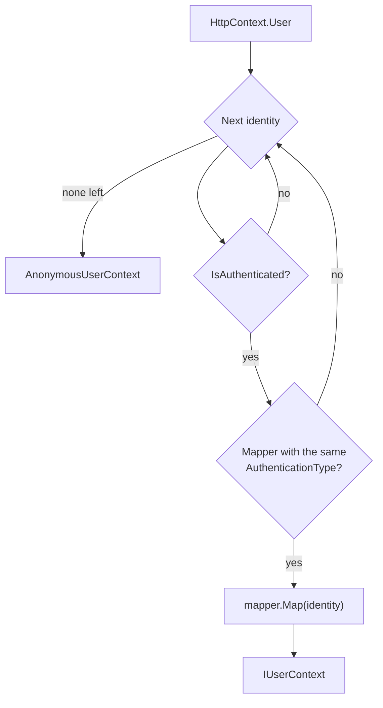

# SharedKernel.Security.Abstractions

[](https://dotnet.microsoft.com/)
[](https://github.com/Gresta-Vertex-Labs/platform-shared-kernel/blob/main/LICENSE)


> **One model of the caller for every .NET service — who is calling, for which tenant, with what rights, and how
> recently and strongly they signed in — so application code never reads raw claims.**

| You get | So that |
| --- | --- |
| `IUserContext` | One identity type for people, services, background jobs and anonymous callers, whatever the scheme |
| `ActorKind` (`User`, `Service`, `System`, `Anonymous`) | Privileged actions branch on the kind of caller, not on "is authenticated" |
| `HasPermission`, `HasRole`, `WasAuthenticatedWith` | Ordinal, case-sensitive checks over the mapped values, never raw claims |
| `IsAuthenticationFresherThan`, `GetAuthenticationMethodTime` | Step-up checks ("MFA within five minutes") against an injected clock |
| `IUserContextMapper` + `UserContextResolver` | Any authentication scheme plugs in; an identity from an unmapped scheme resolves to anonymous |
| `SystemUserContext`, `AnonymousUserContext` | Ready-made contexts for worker hosts and unauthenticated calls |
| `SecurityClaimTypes` | Short claim names (`sub`, `tenant_id`, `amr`, …) as constants, no string literals |

## Contents

- [Install](#install)
- [Quick start](#quick-start)
- [How it works](#how-it-works)
- [Recipes](#recipes)
- [Reference](#reference)
- [Testing](#testing)
- [Pitfalls](#pitfalls)
- [Design decisions](#design-decisions)

## Install

```xml
<PackageReference Include="SharedKernel.Security.Abstractions" />
```

The version comes from your central `SharedKernelVersion` property — every SharedKernel package ships at the same
version. See [Using the packages](https://github.com/Gresta-Vertex-Labs/platform-shared-kernel#using-the-packages).

| Requirement | Value |
| --- | --- |
| Target framework | `net10.0` |
| Tier | Abstractions — reference it from your **Application** project |
| Depends on | `SharedKernel.Execution` (`ActorKind`, `TenantId`); no ASP.NET Core, no third-party packages |
| Namespaces | `SharedKernel.Security.Abstractions` |
| Registration | None here. An authentication package registers `IUserContext`; a worker host registers `SystemUserContext` |

Handlers that only need "who and which tenant" read `IRequestContext` from `SharedKernel.Execution` instead;
`IUserContext` is for code that needs the credential itself (roles, scopes, step-up signals).

## Quick start

Register an authentication package in the host. It adds the scheme, its mapper and a scoped `IUserContext`;
`AddSharedKernelRequestContext()` exposes the same caller to the application pipeline as `IRequestContext`.

```csharp
using SharedKernel.Security.Oidc.Extensions;
using SharedKernel.ServiceDefaults.Security;

builder.Services.AddOidcAuthentication(builder.Configuration); // SharedKernel:Security:Oidc
builder.Services.AddSharedKernelRequestContext();              // IRequestContext over IUserContext
builder.Services.AddAuthorization();

WebApplication app = builder.Build();
app.UseSharedKernelRequestContext();                            // first: correlation id and the caller scope
app.UseAuthentication();
app.UseAuthorization();
```

Inject `IUserContext` wherever you need the caller:

```csharp
using SharedKernel.Security.Abstractions;

app.MapGet("/me", (IUserContext caller) => Results.Ok(new
{
    Kind = caller.ActorKind.ToString(),
    caller.SubjectId,
    caller.TenantId,
    caller.Roles,
    caller.Permissions,
}))
.RequireAuthorization();
```

In a host without incoming requests (a worker, a consumer), register the system context instead:

```csharp
builder.Services.AddScoped<IUserContext>(_ => SystemUserContext.Instance);
```

## How it works

Each authentication scheme produces a `ClaimsIdentity` whose `AuthenticationType` is the scheme name (`Bearer`,
`ApiKey`, `Certificate`), and each authentication package registers one `IUserContextMapper` with the same
`AuthenticationType`. `UserContextResolver` walks the request's identities in order and maps the first authenticated
one that has a mapper.



- **Order never matters.** Mappers are matched by exact, ordinal `AuthenticationType`; authentication packages register
  `IUserContext` with `TryAdd`, so a registration you make yourself wins.
- **Unmapped schemes fail closed.** A cookie or an unvetted custom handler without a mapper is skipped; with no mapped
  identity the caller is `AnonymousUserContext.Instance`.
- **First match wins.** A mapper that returns anonymous (the identity has no subject) ends resolution; later identities
  are never mixed in.
- **Placeholders are replaced.** An `AnonymousUserContext.Instance` registered as an instance descriptor is treated as a
  placeholder: authentication packages remove it and register the real context.

### The four kinds of caller

`ActorKind` is the same enum `IRequestContext` uses (`SharedKernel.Execution.Context`). `IsAuthenticated` is `true` for
every kind except `Anonymous`.

| Member | `User` | `Service` | `System` | `Anonymous` |
| --- | --- | --- | --- | --- |
| Who | A person signed in through an identity provider | An application acting for itself (client credentials, API key, certificate) | Trusted code with no caller (job, consumer) | No authenticated caller |
| `SubjectId` | The subject | The client's id | `null` | `null` |
| `TenantId` | From the credential, if a non-empty GUID | From the credential, if a non-empty GUID | `null` | `null` |
| `Roles`, `Permissions` | Granted roles and scopes | Granted roles and scopes | Empty | Empty |
| `HasRole`, `HasPermission`, … | Ordinal checks | Ordinal checks | Always `false` | Always `false` |

`SubjectId` is non-null exactly for `User` and `Service`. It is a string because providers issue subjects in any format
(`auth0|5f7c…`, Okta ids, pairwise identifiers, GUIDs).

## Recipes

### 1. Check permissions and roles

Permissions are OAuth scopes (fine-grained, per action); roles are coarse groups. Both checks are ordinal, because scopes
are case-sensitive: `Payments:Refund` does not match `payments:refund`.

```csharp
using SharedKernel.Primitives.Errors;
using SharedKernel.Primitives.Results;
using SharedKernel.Security.Abstractions;

public sealed class RefundPolicy(IUserContext caller)
{
    public Result CanRefund(decimal amount)
    {
        if (!caller.IsAuthenticated)
        {
            return Error.Unauthorized("refunds.unauthenticated", "Sign in to issue refunds.");
        }

        if (!caller.HasPermission("payments:refund"))
        {
            return Error.Forbidden("refunds.permission_missing", "The payments:refund permission is required.");
        }

        if (amount > 1_000m && !caller.HasRole("FinanceManager"))
        {
            return Error.Forbidden("refunds.amount_requires_manager", "Refunds over 1,000 need a finance manager.");
        }

        return Result.Success();
    }
}
```

On a command or query, prefer `[RequirePermission]` (`SharedKernel.Application.Authorization`), which checks
`IRequestContext` on every path; on an endpoint that sends no command, `[RequireEndpointPermission]` and `[RequireRole]`
from `SharedKernel.Presentation.Core` run the same checks declaratively. For a service-specific claim use
`caller.FindClaims("allowed_regions")`.

### 2. Require a recent, strong sign-in

For a payout or a change of bank details, check how and how recently the user authenticated. Take the time from
`IClock`.

```csharp
using SharedKernel.Execution.Context;
using SharedKernel.Primitives.Clocks;
using SharedKernel.Primitives.Errors;
using SharedKernel.Primitives.Results;
using SharedKernel.Security.Abstractions;

public sealed class PayoutStepUpPolicy(IUserContext caller, IClock clock)
{
    private static readonly TimeSpan MaxSignInAge = TimeSpan.FromMinutes(5);

    public Result EnsureStepUp()
    {
        if (caller.ActorKind != ActorKind.User)
        {
            return Error.Forbidden("payouts.user_required", "Payouts are initiated by a signed-in person.");
        }

        if (!caller.WasAuthenticatedWith("mfa"))
        {
            return Error.Forbidden("payouts.mfa_required", "Sign in with multi-factor authentication.");
        }

        return caller.IsAuthenticationFresherThan(MaxSignInAge, clock.UtcNow)
            ? Result.Success()
            : Error.Forbidden("payouts.reauthentication_required", "Sign in again to continue.");
    }
}
```

`IsAuthenticationFresherThan` is `false` when `AuthTime` is unknown, older than `maxAge`, or more than
`UserContext.MaxFutureAuthTime` (5 minutes) ahead of `now` — a forged or badly skewed value never passes for ever.

A session step-up from `SharedKernel.Security.Totp` adds `otp` to `AuthenticationMethods` together with an `amr_time`
claim, and never changes `AuthTime`. When the step-up itself must be recent — on a SignalR connection or gRPC stream
the principal outlives it — check the method's own time:

```csharp
DateTimeOffset now = clock.UtcNow;
if (caller.GetAuthenticationMethodTime("otp") is not { } verifiedAt
    || verifiedAt - now > UserContext.MaxFutureAuthTime
    || now - verifiedAt > TimeSpan.FromMinutes(5))
{
    return Error.Forbidden("payouts.step_up_required", "Confirm with a one-time code to continue.");
}
```

`GetAuthenticationMethodTime(method)` is `null` unless `WasAuthenticatedWith(method)`; it returns the latest `amr_time`
for the method, else `AuthTime`. At the HTTP boundary, `[RequireAuthenticationMethod("otp", MaxAgeSeconds = 300)]`
(`SharedKernel.Presentation.Core`) makes the same check.

### 3. Run background work as the system

```csharp
using SharedKernel.Execution.Context;
using SharedKernel.Primitives.Errors;
using SharedKernel.Primitives.Results;
using SharedKernel.Security.Abstractions;

// Program.cs of a worker host — no incoming requests.
builder.Services.AddScoped<IUserContext>(_ => SystemUserContext.Instance);

public sealed class StatementGenerator(IUserContext caller)
{
    public Result EnsureScheduler() =>
        caller.ActorKind == ActorKind.System
            ? Result.Success()
            : Error.Forbidden("statements.system_only", "Statements are generated by the scheduler.");
}
```

`SystemUserContext` holds no roles or permissions — every `HasRole`/`HasPermission` is `false`; decide what a system
caller may do by `ActorKind.System`. Code that goes through the application pipeline, persistence or an outbound client
also needs an `IRequestContext`: wrap each unit of work in
`RequestContextScope.Begin(new SystemRequestContext(permissions, "statement-job", tenantId, CorrelationIds.New()))`.

### 4. Map a custom authentication scheme

For a scheme no package covers, write the handler and a mapper whose `AuthenticationType` equals the scheme name. The
handler must build its identity with that name: `new ClaimsIdentity(claims, Scheme.Name)`.

```csharp
using System.Security.Claims;
using SharedKernel.Execution.Context;
using SharedKernel.Security.Abstractions;

public sealed class PartnerSignatureUserContextMapper : IUserContextMapper
{
    public const string Scheme = "PartnerSignature";

    public string AuthenticationType => Scheme;

    public IUserContext Map(ClaimsIdentity identity)
    {
        if (identity.FindFirst(SecurityClaimTypes.Subject)?.Value is not { Length: > 0 } partnerId)
        {
            return AnonymousUserContext.Instance; // never an authenticated context without a subject
        }

        return new UserContext(ActorKind.Service, partnerId, identity.Claims)
        {
            ClientId = partnerId,
            Permissions = [.. identity.FindAll(SecurityClaimTypes.Scope).Select(c => c.Value)],
            AuthenticationMethodTimes = AuthenticationMethodTimeClaim.Read(identity.Claims),
        };
    }
}
```

```csharp
using Microsoft.Extensions.DependencyInjection.Extensions;
using SharedKernel.Security.Abstractions;

builder.Services.AddAuthentication()
    .AddScheme<AuthenticationSchemeOptions, PartnerSignatureHandler>(PartnerSignatureUserContextMapper.Scheme, _ => { });
builder.Services.TryAddEnumerable(ServiceDescriptor.Singleton<IUserContextMapper, PartnerSignatureUserContextMapper>());

// Only when no authentication package is registered — the packages add the same registration.
builder.Services.AddHttpContextAccessor();
builder.Services.TryAddScoped<IUserContext>(sp => UserContextResolver.Resolve(
    sp.GetRequiredService<IHttpContextAccessor>().HttpContext?.User,
    sp.GetServices<IUserContextMapper>()));
```

The identity must reach `HttpContext.User`: make the scheme the default, or name it in the endpoint's policy.

## Reference

### Types

| Type | Purpose |
| --- | --- |
| `IUserContext` | The caller of the current operation |
| `UserContext` | Immutable context for a `User` or `Service` caller, built by a mapper or a test |
| `AnonymousUserContext.Instance` | No caller; every check `false` |
| `SystemUserContext.Instance` | Trusted code without a caller; authenticated, no roles or permissions |
| `IUserContextMapper` | `AuthenticationType` + `Map(ClaimsIdentity)`: one scheme's identity to an `IUserContext` |
| `UserContextResolver.Resolve(ClaimsPrincipal?, IEnumerable<IUserContextMapper>)` | First authenticated, mapped identity, else anonymous |
| `AuthenticationMethodTimeClaim` | `Create(method, verifiedAt)` and `Read(claims)` for `amr_time` claims |
| `SecurityClaimTypes` | Short claim type names |

### `IUserContext`

| Member | Type | Meaning |
| --- | --- | --- |
| `ActorKind` | `ActorKind` | The kind of caller |
| `IsAuthenticated` | `bool` | `true` for every kind except `Anonymous` |
| `SubjectId` | `string?` | Stable id of the user or service, unique per issuer |
| `ClientId` | `string?` | The application the call came through (`azp`/`client_id`, or the key's or certificate's client) |
| `TenantId` | `TenantId?` | The tenant the credential asserts; `null` when absent, empty or not a GUID |
| `SessionId` | `string?` | The sign-in session (`sid`), or the token id when there is none |
| `Name`, `Email` | `string?` | Display name; email address (not verified unless the issuer says so) |
| `Roles`, `Permissions` | `IReadOnlyCollection<string>` | Granted roles; granted permissions (OAuth scopes) |
| `AuthenticationMethods` | `IReadOnlyCollection<string>` | `amr` values such as `pwd`, `otp`, `mfa` |
| `AuthContextClassReference` | `string?` | `acr` value |
| `AuthTime` | `DateTimeOffset?` | When the user actually authenticated (`auth_time`) |
| `IsSenderConstrained` | `bool` | A DPoP-bound (RFC 9449) or certificate-bound (RFC 8705) token proven on this request |
| `FindClaim(type)` / `FindClaims(type)` | `string?` / `IReadOnlyList<string>` | First / every value of a claim, type compared ordinally |
| `HasRole`, `HasPermission`, `WasAuthenticatedWith` | `bool` | Ordinal membership in `Roles` / `Permissions` / `AuthenticationMethods` |
| `IsAuthenticationFresherThan(maxAge, now)` | `bool` | `AuthTime` known, no older than `maxAge`, at most 5 minutes ahead |
| `GetAuthenticationMethodTime(method)` | `DateTimeOffset?` | When `method` was verified; default-implemented as `null` |

`UserContext(ActorKind actorKind, string subjectId, IEnumerable<Claim>? claims = null)` accepts only `User` and
`Service` (`ArgumentOutOfRangeException` otherwise) and a non-blank subject (`ArgumentException`). Every other member is
`init`-only; `claims`, `Roles`, `Permissions`, `AuthenticationMethods` and `AuthenticationMethodTimes` are copied when
set. `UserContext.MaxFutureAuthTime` is 5 minutes.

### `SecurityClaimTypes`

The authentication packages turn off ASP.NET Core's inbound claim renaming, so these are the names on the principal.

| Constant | Value | Constant | Value |
| --- | --- | --- | --- |
| `Subject` | `sub` | `SessionId` | `sid` |
| `Name` | `name` | `TokenId` | `jti` |
| `Email` | `email` | `ClientId` | `client_id` |
| `Roles` | `roles` | `AuthorizedParty` | `azp` |
| `Scope` | `scope` | `Confirmation` | `cnf` |
| `AuthenticationMethod` | `amr` | `TenantId` | `tenant_id` |
| `AuthContextClassReference` | `acr` | `AuthenticationMethodTime` | `amr_time` (`{method} {unix seconds}`) |
| `AuthTime` | `auth_time` | | |

### Logging and errors

This package writes no logs and returns no `Result` values. Its event-id sub-block (12000–12099) is unused.

## Testing

Build a `UserContext` directly or use the two singletons — no mocks, no web host:

```csharp
using SharedKernel.Execution.Context;
using SharedKernel.Security.Abstractions;
using SharedKernel.Testing.Clocks;

var now = new DateTimeOffset(2026, 9, 16, 12, 0, 0, TimeSpan.Zero);
var caller = new UserContext(ActorKind.User, "auth0|5f7c1e")
{
    AuthenticationMethods = ["pwd", "mfa"],
    AuthTime = now.AddMinutes(-2),
};

Assert.True(new PayoutStepUpPolicy(caller, new FakeClock(now)).EnsureStepUp().IsSuccess);
Assert.True(new PayoutStepUpPolicy(SystemUserContext.Instance, new FakeClock(now)).EnsureStepUp().IsFailure);
```

When a test needs a mutable caller, reference
[`SharedKernel.Security.Testing`](https://github.com/Gresta-Vertex-Labs/platform-shared-kernel/blob/main/16.Testing/SharedKernel.Security.Testing/README.md)
(namespace `SharedKernel.Testing.Security`): `FakeUserContext` (settable members, `WithAuthenticationMethodTime`) and
`SecurityTestContextBuilder` (`Build()` → `ClaimsPrincipal`, `BuildUserContext()` → `FakeUserContext`). For handlers
that read `IRequestContext`, use `TestRequestContext` from
[`SharedKernel.Testing`](https://github.com/Gresta-Vertex-Labs/platform-shared-kernel/blob/main/16.Testing/SharedKernel.Testing/README.md).

To test a mapper, build the identity its handler would build (`new ClaimsIdentity(claims, "PartnerSignature")`) and call
`UserContextResolver.Resolve(new ClaimsPrincipal(identity), [mapper])`; cover the scheme end to end with a test server
too, since a hand-built identity cannot catch handler wiring or claim renaming.

## Pitfalls

| Don't | Do | Why |
| --- | --- | --- |
| Register `IUserContext` as a singleton, or inject it into one | Keep it scoped | A singleton serves the first request's caller to every later request; `SecurityArchitectureRules.NoSingletonRegistrationOfSecurityContextTypes` flags it |
| Inject `ClaimsPrincipal`, `HttpContext` or `IHttpContextAccessor` to read the caller | Inject `IUserContext` | Raw claims skip the mapper rules; analyzer `SK0031` flags the injection |
| Compare permissions with `OrdinalIgnoreCase` | Call `HasPermission` | OAuth scopes are case-sensitive; ignoring case grants rights nobody issued |
| `Guid.Parse(caller.SubjectId)` or a `uuid` column | Store `SubjectId` as text | Providers issue `auth0\|…`, Okta and pairwise ids |
| Take the tenant from a header or body in application code | Read `IRequestContext.TenantId` | Unauthenticated input lets a caller pick another tenant |
| Allow a privileged action on `IsAuthenticated` alone | Branch on `ActorKind` | Service callers and the system context are authenticated too |
| Register `SystemUserContext` in a host that serves requests | Only in hosts without incoming requests | Authentication packages keep your registration, so every request would run as the system |
| `new UserContext(ActorKind.System, …)` | `SystemUserContext.Instance` / `AnonymousUserContext.Instance` | The constructor throws |
| `FindClaim("roles") == "admin"` | `HasRole("admin")` | Mappers normalize multi-valued and configured claim names |
| Pass `DateTimeOffset.UtcNow` to freshness checks | Pass `IClock.UtcNow` | Tests can move an injected clock; analyzer `SK0001` flags direct reads |
| A mapper `AuthenticationType` that differs from the scheme name, even in case | One constant for both | Matching is ordinal; a mismatch resolves every caller to anonymous |
| Use `Email` as a user key | Use `SubjectId` (with the issuer) | Email addresses change and may be unverified |

## Design decisions

**Why a mapper per scheme instead of a chain of `IUserContext` factories?** A chain that captures the previous
registration depends on registration order and drops type- or instance-registered contexts. Matching by
`AuthenticationType` makes order irrelevant and makes an unvetted scheme fail closed.

**Why share `ActorKind` and `TenantId` with `SharedKernel.Execution`?** `IRequestContext` is built over `IUserContext`
by `AddSharedKernelRequestContext()` (`UserId = SubjectId ?? ClientId`, same kind, same `TenantId?`); one set of types
means no mapping layer between the two views of the caller.

**Why is `GetAuthenticationMethodTime` default-implemented?** Existing `IUserContext` implementations keep compiling,
and their `null` fails closed under any maximum age.

**What this package does not protect against.** Credential validation is the authentication packages' job. A signed
`tenant_id` proves the issuer asserted the value, not that the subject belongs to the tenant — verify membership before
high-impact actions when one issuer serves several tenants. `SubjectId` is unique per issuer only.

---

Part of [Platform.SharedKernel](https://github.com/Gresta-Vertex-Labs/platform-shared-kernel) ·
[Security domain](https://github.com/Gresta-Vertex-Labs/platform-shared-kernel/blob/main/12.Security/README.md) ·
[MIT license](https://github.com/Gresta-Vertex-Labs/platform-shared-kernel/blob/main/LICENSE)
