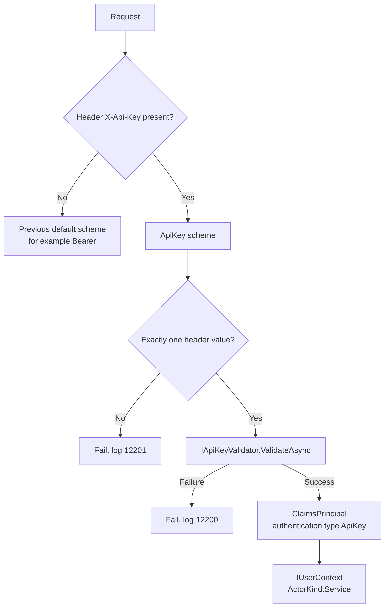
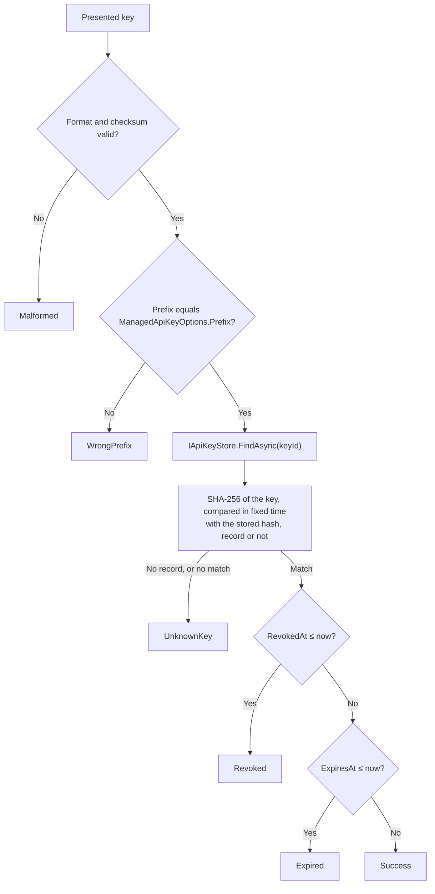
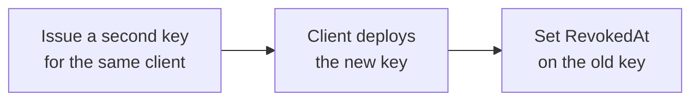

# SharedKernel.Security.ApiKey

[](https://dotnet.microsoft.com/)
[](https://github.com/Gresta-Vertex-Labs/platform-shared-kernel/blob/main/LICENSE)


> **API key authentication for machine clients in ASP.NET Core: keys that secret scanners recognize, stored only as
> hashes, with expiry and revocation, next to your bearer tokens on the same endpoints.**

Partners, scripts and internal jobs that cannot run an OAuth flow still need a credential. Hand-rolled API keys go
wrong in predictable ways: keys stored in plain text, compared with `==`, accepted from the query string, impossible
to rotate, invisible to secret scanners when they leak, and wired so that adding them breaks the bearer token scheme.
This package generates keys in a recognizable format, stores only their SHA-256 hash, checks expiry and revocation on
every request, and turns a valid key into the same `IUserContext` your application already reads.

| 🔑 Managed keys | 🗄️ Hashed at rest | 🔀 Composes with bearer | 🔍 Leak-detectable |
| --- | --- | --- | --- |
| `{prefix}_{key id}_{secret}{checksum}` from a cryptographic random source | Only the SHA-256 hash is stored | One default scheme selects API key or bearer per request | A fixed format and prefix for secret-scanning patterns |
| 190-bit secret | Fixed-time comparison, even for unknown ids | Works in either registration order | CRC-32 checksum rejects typos without a lookup |
| Expiry and revocation via `IClock` | You own the table; the package owns the checks | `ActorKind.Service` in `IUserContext` | Header only, never the query string |
| Or bring your own `IApiKeyValidator` | Keys never logged; key ids logged for audit | Tenant, roles and permissions per key | One prefix per environment |

## Contents

- [Install](#install)
- [Quick start](#quick-start)
- [Which registration do I need?](#which-registration-do-i-need)
- [How it works](#how-it-works)
- [Recipes](#recipes)
- [Reference](#reference)
- [Security model](#security-model)
- [Pitfalls](#pitfalls)
- [AI quick reference](#ai-quick-reference)
- [Compatibility and guarantees](#compatibility-and-guarantees)

## Install

```shell
dotnet add package SharedKernel.Security.ApiKey
```

| Requirement | Value |
| --- | --- |
| Target framework | `net10.0` |
| Tier | Host (references ASP.NET Core; reference it from the host project only) |
| Dependencies | [`SharedKernel.Security.Abstractions`](https://github.com/Gresta-Vertex-Labs/platform-shared-kernel/tree/main/12.Security/SharedKernel.Security.Abstractions), [`SharedKernel.Cryptography`](https://github.com/Gresta-Vertex-Labs/platform-shared-kernel/tree/main/01.Core/SharedKernel.Cryptography), the ASP.NET Core shared framework (`Microsoft.AspNetCore.App`) |
| Registration | `AddManagedApiKeyAuthentication<TStore>(...)` or `AddApiKeyAuthentication<TValidator>()` |

| Companion package | Adds |
| --- | --- |
| [`SharedKernel.Security.Oidc`](https://github.com/Gresta-Vertex-Labs/platform-shared-kernel/tree/main/12.Security/SharedKernel.Security.Oidc) | JWT bearer tokens from an OpenID Connect provider, accepted on the same endpoints as API keys |
| [`SharedKernel.Security.Mtls`](https://github.com/Gresta-Vertex-Labs/platform-shared-kernel/tree/main/12.Security/SharedKernel.Security.Mtls) | Client certificate authentication for partners that must use mutual TLS |
| [`SharedKernel.Presentation.WebApi`](https://github.com/Gresta-Vertex-Labs/platform-shared-kernel/tree/main/14.Presentation/SharedKernel.Presentation.WebApi) | `[RequireRole]` and `[RequireEndpointPermission]` checks against `IUserContext` (the attributes are `SharedKernel.Presentation.Core`'s, namespace `SharedKernel.Presentation.Authorization`; the `.RequireEndpointPermission(…)` route extensions and their enforcement are here), with ProblemDetails responses |
| [`SharedKernel.MultiTenancy`](https://github.com/Gresta-Vertex-Labs/platform-shared-kernel/tree/main/13.ServiceDefaults/SharedKernel.MultiTenancy) | Tenant resolution that reads the tenant of an API key caller through the registered mapper |

## Quick start

**1. Store keys** in a table you own. The package reads records through `IApiKeyStore`.

```csharp
using Microsoft.EntityFrameworkCore;
using SharedKernel.Execution.Tenancy;
using SharedKernel.Security.ApiKey.Keys;

public sealed class ApiKeyEntity
{
    public required string KeyId { get; init; }        // 16 characters, not secret
    public required string KeyHash { get; init; }      // 43 characters, SHA-256 of the key
    public required string ClientId { get; init; }
    public Guid? TenantId { get; set; }                // null for no tenant; converted with TenantId.FromNullable
    public List<string> Roles { get; set; } = [];
    public List<string> Permissions { get; set; } = [];
    public DateTimeOffset CreatedAt { get; init; }
    public DateTimeOffset? ExpiresAt { get; set; }
    public DateTimeOffset? RevokedAt { get; set; }
}

public sealed class AppDbContext(DbContextOptions<AppDbContext> options) : DbContext(options)
{
    public DbSet<ApiKeyEntity> ApiKeys => Set<ApiKeyEntity>();

    protected override void OnModelCreating(ModelBuilder modelBuilder) =>
        modelBuilder.Entity<ApiKeyEntity>(key =>
        {
            key.HasKey(k => k.KeyId);                  // unique: every lookup is by key id
            key.Property(k => k.KeyId).HasMaxLength(16);
            key.Property(k => k.KeyHash).HasMaxLength(43);
            key.Property(k => k.ClientId).HasMaxLength(256);
            key.HasIndex(k => k.ClientId);
        });
}

public sealed class EfApiKeyStore(AppDbContext db) : IApiKeyStore
{
    public async ValueTask<ApiKeyRecord?> FindAsync(string keyId, CancellationToken cancellationToken)
    {
        ApiKeyEntity? key = await db.ApiKeys
            .AsNoTracking()
            .SingleOrDefaultAsync(k => k.KeyId == keyId, cancellationToken);

        return key is null
            ? null
            : new ApiKeyRecord(key.KeyId, key.KeyHash, key.ClientId)
            {
                TenantId = TenantId.FromNullable(key.TenantId),
                Roles = key.Roles,
                Permissions = key.Permissions,
                ExpiresAt = key.ExpiresAt,
                RevokedAt = key.RevokedAt,
            };
    }
}
```

**2. Register** the scheme with a prefix for this environment.

```csharp
// Program.cs
using Microsoft.EntityFrameworkCore;
using SharedKernel.Security.Abstractions;
using SharedKernel.Security.ApiKey.Extensions;

builder.Services.AddDbContext<AppDbContext>(options =>
    options.UseNpgsql(builder.Configuration.GetConnectionString("App")));

builder.Services.AddManagedApiKeyAuthentication<EfApiKeyStore>(keys =>
    keys.Prefix = builder.Configuration["ApiKeys:Prefix"]!); // "acme_live" in production, "acme_test" elsewhere
builder.Services.AddAuthorization();

WebApplication app = builder.Build();
app.UseAuthentication();
app.UseAuthorization();

app.MapGet("/whoami", (IUserContext caller) => new { caller.SubjectId, caller.TenantId, caller.Permissions })
    .RequireAuthorization();

app.Run();
```

**3. Issue a key** with `ApiKeyGenerator` ([recipe 1](#1-issue-a-key-for-a-client)), store `KeyId` and `KeyHash`, and
give the client `Key` once.

**4. Call** the service with the key in the header:

```shell
curl -H "X-Api-Key: acme_live_…" https://orders.example.com/whoami
```

> [!TIP]
> Every registration uses `TryAdd`. An `IApiKeyStore`, `IApiKeyValidator`, `IClock` or `IUserContext`
> you register first is kept, which is how you replace a service or register a test double.

## Which registration do I need?

| I need to… | Use | Recipe |
| --- | --- | --- |
| Issue keys to clients and check them on every request | `AddManagedApiKeyAuthentication<TStore>`, `ApiKeyGenerator`, `IApiKeyStore` | [Issue a key](#1-issue-a-key-for-a-client) |
| Store key records in my database | `IApiKeyStore`, `ApiKeyRecord` | [Store keys](#2-store-keys-in-a-database) |
| Replace a client's key without an outage | A second managed key, then `RevokedAt` | [Rotate](#3-rotate-a-key-without-downtime) |
| Stop a key now, later, or on a fixed date | `ApiKeyRecord.RevokedAt`, `ApiKeyRecord.ExpiresAt` | [Revoke and expire](#4-revoke-or-expire-a-key) |
| Limit a key to one tenant and a set of operations | `ApiKeyRecord.TenantId`, `.Roles`, `.Permissions` | [Scope a key](#5-scope-a-key-to-permissions-and-a-tenant) |
| Accept API keys and OIDC bearer tokens on the same endpoints | Both registrations; the forwarding scheme picks per request | [Bearer and API keys](#6-accept-bearer-tokens-and-api-keys-on-the-same-endpoints) |
| Check keys that another system issued | `AddApiKeyAuthentication<TValidator>`, `IApiKeyValidator` | [Custom validator](#7-validate-keys-with-an-existing-system) |
| Find keys leaked into repositories | The key format | [Secret scanning](#8-detect-leaked-keys-with-secret-scanning) |
| Test endpoints that require a key | An in-memory `IApiKeyStore` | [Testing](#9-test-with-an-in-memory-store) |

## How it works

### Choosing a scheme for each request

Registration adds two schemes. `ApiKey` authenticates the header. `ApiKeyOrDefault` becomes the default scheme and
forwards each request: to `ApiKey` when the header is present, otherwise to the scheme that was the default before
(for example `Bearer`). The previous default is captured when options are built, so the order in which you register
the authentication packages does not matter.



A request with the header is decided by the API key alone. An invalid key is not retried with the bearer scheme, and
a valid key wins over an `Authorization` header on the same request. With no other scheme registered, a request
without the header gets no result and stays anonymous.

A failed key does not end the request by itself: endpoints that allow anonymous callers still run, with an anonymous
`IUserContext`. Endpoints that require authorization return `401`.

### Validating a managed key



Malformed keys, typos and keys from another environment are rejected before the store is called. `now` comes from
`IClock`, so a test can move time.

### Key anatomy

```text
acme_live_0123456789ABCDEF_abcdefghijklmnopqrstuvwxyzABCDEF0qA0Q2      (example, not a real key)
└───┬───┘ └──────┬───────┘ └──────────────┬───────────────┘└─┬──┘
  prefix      key id                    secret            checksum
  2-32 chars  16 Base62 chars           32 Base62 chars   6 Base62 chars
  [a-z0-9_]   ~95 bits, random          ~190 bits         CRC-32 of everything before it
  per env     stored, logged, not secret never stored     first character 0-4

Stored: KeyHash = Base64url(SHA-256(ASCII bytes of the whole key))  → 43 characters, no padding
```

Base62 is `0-9`, `A-Z`, `a-z`. The prefix starts with a lowercase letter, contains lowercase letters, digits and
single underscores, and does not end with an underscore. Parsing reads the fixed-length segments from the end, so a
prefix such as `acme_live_eu` works.

**Why SHA-256 and not a password hash?** A password hash is slow on purpose, to make guessing a low-entropy secret
expensive. The secret here is 190 random bits: no amount of hashing speed makes guessing it feasible, and a slow hash
would add tens of milliseconds to every request. A fast hash is enough to make a stolen table useless.

**Why a prefix and a checksum?** The prefix tells a secret scanner (and a person reading a log) what the string is
and which environment it belongs to, and it stops a test key from working in production. The checksum lets scanners
and the validator reject random strings and typos without a database lookup, so leaked-key alerts have few false
positives. It is not a secret and adds no security by itself.

## Recipes

Complete examples. Each one lists the `using` directives it needs; `AppDbContext`, `ApiKeyEntity` and
`EfApiKeyStore` are the types from the [quick start](#quick-start).

### 1. Issue a key for a client

Generate the key, store the id and hash, and return the key to the caller once. There is no way to recover it later.

```csharp
using SharedKernel.Primitives.Clocks;
using SharedKernel.Security.ApiKey.Keys;

public sealed record IssueApiKeyRequest(string ClientId, Guid? TenantId, string[] Permissions, int? ValidForDays);

public sealed record IssuedApiKey(string KeyId, string Key, DateTimeOffset? ExpiresAt);

public sealed class ApiKeyIssuer(ApiKeyGenerator generator, AppDbContext db, IClock clock)
{
    public async Task<IssuedApiKey> IssueAsync(IssueApiKeyRequest request, CancellationToken ct)
    {
        ArgumentException.ThrowIfNullOrWhiteSpace(request.ClientId);
        if (request.TenantId == Guid.Empty)
        {
            throw new ArgumentException("Use null for a key without a tenant.", nameof(request));
        }

        GeneratedApiKey generated = generator.Generate();
        DateTimeOffset now = clock.UtcNow;

        var entity = new ApiKeyEntity
        {
            KeyId = generated.KeyId,
            KeyHash = generated.KeyHash,          // the only value derived from the key that is stored
            ClientId = request.ClientId,
            TenantId = request.TenantId,
            Permissions = [.. request.Permissions],
            CreatedAt = now,
            ExpiresAt = request.ValidForDays is int days ? now.AddDays(days) : null,
        };

        db.ApiKeys.Add(entity);
        await db.SaveChangesAsync(ct);

        // Show generated.Key once. Never log it; generated.ToString() prints only the key id.
        return new IssuedApiKey(generated.KeyId, generated.Key, entity.ExpiresAt);
    }
}
```

```csharp
// Program.cs
builder.Services.AddScoped<ApiKeyIssuer>();

app.MapPost("/admin/api-keys", async (IssueApiKeyRequest request, ApiKeyIssuer issuer, CancellationToken ct) =>
        Results.Ok(await issuer.IssueAsync(request, ct)))
    .RequireAuthorization(policy => policy.RequireRole("platform-admin"));
```

`ApiKeyGenerator` is registered as a singleton by `AddManagedApiKeyAuthentication` and uses the same prefix the
validator checks. Serve the response only over HTTPS and never cache it.

### 2. Store keys in a database

The quick start's `EfApiKeyStore` is a complete store. What matters for any store:

| Rule | Why |
| --- | --- |
| Make `KeyId` unique (primary key or unique index) | `FindAsync` receives only the key id; the validator then compares the hash |
| Store `KeyHash`, never `Key` | A database leak must not reveal usable keys |
| Map `TenantId` to `null` when there is no tenant | `TenantId?` cannot hold `Guid.Empty`; `TenantId.FromNullable` turns an empty column value into `null` |
| Return `null` for an unknown id; let exceptions propagate | An unavailable store fails the request; it never authenticates it |
| Keep revoked rows | `Revoked` shows up in logs and audit trails; a deleted row reports `UnknownKey` |

The store is registered as scoped, so it can depend on a `DbContext`. If the store is remote or slow, add a cache
([recipe 4](#4-revoke-or-expire-a-key)).

### 3. Rotate a key without downtime

Keys are independent, so a client can hold two at once. Rotation is three steps, and none of them needs a special
mode.



```csharp
using Microsoft.EntityFrameworkCore;
using SharedKernel.Primitives.Clocks;

public sealed class ApiKeyRotation(ApiKeyIssuer issuer, AppDbContext db, IClock clock)
{
    /// <summary>Issues a replacement for the same client, tenant and permissions. The old key works until <paramref name="overlap"/> ends.</summary>
    public async Task<IssuedApiKey> RotateAsync(string oldKeyId, TimeSpan overlap, CancellationToken ct)
    {
        ApiKeyEntity old = await db.ApiKeys.SingleAsync(k => k.KeyId == oldKeyId, ct);

        IssuedApiKey replacement = await issuer.IssueAsync(
            new IssueApiKeyRequest(old.ClientId, old.TenantId, [.. old.Permissions], ValidForDays: null), ct);

        // A revocation time in the future is honored: the old key stops working exactly then.
        old.RevokedAt = clock.UtcNow.Add(overlap);
        await db.SaveChangesAsync(ct);

        return replacement;
    }
}
```

Tell the client the overlap deadline. If they switch early, set `RevokedAt` to now.

### 4. Revoke or expire a key

| Goal | Set | Failure reason logged |
| --- | --- | --- |
| Stop a key immediately | `RevokedAt = clock.UtcNow` | `Revoked` |
| Stop a key at a planned time | `RevokedAt = a future time` | `Revoked`, from that time |
| Give a key a fixed lifetime | `ExpiresAt` when issuing | `Expired` |

Both checks are `≤ now`: a key revoked or expiring at exactly the current instant is rejected. When both apply,
`Revoked` is reported.

```csharp
using Microsoft.EntityFrameworkCore;
using SharedKernel.Primitives.Clocks;

public sealed class ApiKeyRevocation(AppDbContext db, IClock clock, CachedApiKeyStore cache)
{
    public async Task<bool> RevokeAsync(string keyId, CancellationToken ct)
    {
        ApiKeyEntity? key = await db.ApiKeys.SingleOrDefaultAsync(k => k.KeyId == keyId, ct);
        if (key is null || key.RevokedAt <= clock.UtcNow)
        {
            return false; // unknown, or already revoked
        }

        key.RevokedAt = clock.UtcNow;
        await db.SaveChangesAsync(ct);
        cache.Evict(keyId);
        return true;
    }
}
```

Every request reads the store. When that is too slow, cache found records for a short time and evict on revocation:

```csharp
using Microsoft.Extensions.Caching.Memory;
using SharedKernel.Security.ApiKey.Keys;

public sealed class CachedApiKeyStore(EfApiKeyStore inner, IMemoryCache cache) : IApiKeyStore
{
    private static readonly TimeSpan TimeToLive = TimeSpan.FromSeconds(30);

    public async ValueTask<ApiKeyRecord?> FindAsync(string keyId, CancellationToken cancellationToken)
    {
        if (cache.TryGetValue(CacheKey(keyId), out ApiKeyRecord? cached))
        {
            return cached;
        }

        ApiKeyRecord? record = await inner.FindAsync(keyId, cancellationToken);
        if (record is not null)
        {
            // Only found records: anyone can build well-formed keys with random ids, and caching misses
            // would let them fill the cache.
            cache.Set(CacheKey(keyId), record, TimeToLive);
        }

        return record;
    }

    public void Evict(string keyId) => cache.Remove(CacheKey(keyId));

    private static string CacheKey(string keyId) => "api-key:" + keyId;
}
```

```csharp
// Program.cs
builder.Services.AddMemoryCache();
builder.Services.AddScoped<EfApiKeyStore>();
builder.Services.AddScoped<CachedApiKeyStore>();
builder.Services.AddScoped<ApiKeyRevocation>();
builder.Services.AddManagedApiKeyAuthentication<CachedApiKeyStore>(keys => keys.Prefix = "acme_live");
```

`Evict` clears only the local replica. With several replicas, the time to live is how long a revoked key can still
work elsewhere; keep it short, or invalidate through a shared cache.

### 5. Scope a key to permissions and a tenant

A record's grants become the caller's identity:

| Record | Claim | `IUserContext` | ASP.NET Core |
| --- | --- | --- | --- |
| `ClientId` | `sub`, `client_id` | `SubjectId`, `ClientId` | `User.Identity.Name` |
| `TenantId` | `tenant_id` | `TenantId`, and `IRequestContext.TenantId` | |
| `Roles` | one `roles` claim each | `Roles`, `HasRole` | `User.IsInRole`, `RequireRole` |
| `Permissions` | one `scope` claim each | `Permissions`, `HasPermission` | |
| `KeyId` | `api_key_id` | `FindClaim(ApiKeyAuthenticationDefaults.KeyIdClaimType)` | |

Check permissions in the handler, and scope queries to the tenant (this assumes your `AppDbContext` also has an
`Orders` set with a `TenantId` column):

```csharp
using Microsoft.EntityFrameworkCore;
using SharedKernel.Security.Abstractions;

app.MapGet("/orders", async (IUserContext caller, AppDbContext db, CancellationToken ct) =>
    {
        if (!caller.HasPermission("orders:read"))
        {
            return Results.Forbid();
        }

        if (caller.TenantId is not { } tenantId)
        {
            return Results.Forbid(); // a key without a tenant: fail closed instead of querying
        }

        return Results.Ok(await db.Orders.Where(o => o.TenantId == tenantId.Value).ToListAsync(ct));
    })
    .RequireAuthorization();
```

Or declare the requirement on the route with `SharedKernel.Presentation.WebApi`, which answers 401
`unauthorized.default` without a valid credential and 403 `forbidden.insufficient_permission` without the permission,
both as problem responses:

```csharp
using SharedKernel.Presentation.WebApi;

builder.AddSharedKernelWebApi();
// ...after builder.Build(): app.UseSharedKernelWebApi() before mapping, instead of UseAuthentication/UseAuthorization

RouteGroupBuilder orders = app.MapGroup("/orders");

orders.MapGet("/", ListOrders).RequireEndpointPermission("orders:read");     // ListOrders, CreateOrder: your handlers
orders.MapPost("/", CreateOrder).RequireEndpointPermission("orders:write");
```

Permissions and roles compare ordinally: `Orders:Read` does not grant `orders:read`. An API key caller has no
authentication time and, unless a claims transformation of yours adds an `amr` claim, no authentication methods. So
`[RequireFreshAuthentication]` never passes for it, and `[RequireAuthenticationMethod]` passes only for a method such a
transformation added; with `MaxAgeSeconds`, only while that method also carries a recent `amr_time`. A refusal is a
401 step-up challenge that a key client cannot answer.

### 6. Accept bearer tokens and API keys on the same endpoints

Register both packages, in any order:

```csharp
// Program.cs
using SharedKernel.Security.ApiKey.Extensions;
using SharedKernel.Security.Oidc.Extensions;

builder.Services.AddOidcAuthentication(builder.Configuration);   // Bearer, from SharedKernel:Security:Oidc
builder.Services.AddManagedApiKeyAuthentication<EfApiKeyStore>(keys => keys.Prefix = "acme_live");
builder.Services.AddAuthorization();
```

```json
{
  "SharedKernel": {
    "Security": {
      "Oidc": {
        "Authority": "https://login.example.com/",
        "Audiences": [ "api://orders" ]
      }
    }
  }
}
```

| Request carries | Authenticated by | Result |
| --- | --- | --- |
| `X-Api-Key` only | `ApiKey` | Service principal from the key record |
| `Authorization: Bearer …` only | `Bearer` | User or service principal from the token |
| Both | `ApiKey` only | The bearer token is ignored |
| An invalid `X-Api-Key` and a valid bearer token | `ApiKey` | `401`; no fallback to the token |
| Neither, on an endpoint that requires authorization | `Bearer` challenge | `401` with `WWW-Authenticate: Bearer` |

Application code reads `IUserContext` either way. To tell the credentials apart, check the key id claim:

```csharp
bool viaManagedKey = caller.FindClaim(ApiKeyAuthenticationDefaults.KeyIdClaimType) is not null;
```

To allow only API keys on one endpoint, name the scheme in its policy:

```csharp
app.MapPost("/partner/webhooks", HandlePartnerWebhook) // your handler
    .RequireAuthorization(policy => policy
        .AddAuthenticationSchemes(ApiKeyAuthenticationDefaults.AuthenticationScheme)
        .RequireAuthenticatedUser());
```

> [!WARNING]
> Composition relies on `AuthenticationOptions.DefaultScheme`. If your application sets `DefaultAuthenticateScheme`
> or `DefaultChallengeScheme`, ASP.NET Core uses those instead of the default scheme, and requests bypass
> `ApiKeyOrDefault`. Leave them unset.

### 7. Validate keys with an existing system

When keys already exist elsewhere, implement `IApiKeyValidator` and register it with `AddApiKeyAuthentication`. You
get the same header handling, forwarding, claims, `IUserContext` mapping and logs; you own the check.

```csharp
using System.Net;
using System.Net.Http.Json;
using SharedKernel.Execution.Tenancy;
using SharedKernel.Security.ApiKey.Validation;

public sealed record PartnerKeyIntrospection(
    string KeyId, string PartnerId, bool Active, Guid? TenantId, string[] Scopes);

/// <summary>Asks the partner portal, which issued the keys and compares them, whether a key is valid.</summary>
public sealed class PartnerPortalApiKeyValidator(HttpClient http) : IApiKeyValidator
{
    public async ValueTask<ApiKeyValidationResult> ValidateAsync(string presentedKey, CancellationToken cancellationToken)
    {
        using HttpResponseMessage response = await http.PostAsJsonAsync(
            "keys/introspect", new { key = presentedKey }, cancellationToken);

        if (response.StatusCode == HttpStatusCode.NotFound)
        {
            return ApiKeyValidationResult.Failure("UnknownKey");
        }

        response.EnsureSuccessStatusCode(); // portal unavailable: the request fails, it is never accepted

        PartnerKeyIntrospection? key =
            await response.Content.ReadFromJsonAsync<PartnerKeyIntrospection>(cancellationToken);

        if (key is null || !key.Active)
        {
            return ApiKeyValidationResult.Failure("Inactive", key?.KeyId);
        }

        return ApiKeyValidationResult.Success(
            clientId: key.PartnerId,
            tenantId: TenantId.FromNullable(key.TenantId),
            roles: ["partner"],
            permissions: key.Scopes,
            keyId: key.KeyId);
    }
}
```

```csharp
// Program.cs
using SharedKernel.Security.ApiKey.Extensions;
using SharedKernel.Security.ApiKey.Validation;

builder.Services.AddHttpClient<PartnerPortalApiKeyValidator>(client =>
    client.BaseAddress = new Uri(builder.Configuration["PartnerPortal:BaseUrl"]!));

// Resolve the validator through its typed client, then register the scheme.
builder.Services.AddScoped<IApiKeyValidator>(sp => sp.GetRequiredService<PartnerPortalApiKeyValidator>());
builder.Services.AddApiKeyAuthentication<PartnerPortalApiKeyValidator>(scheme => scheme.HeaderName = "X-Partner-Key");
```

A custom validator must:

- compare secrets in fixed time (`FixedTimeComparison` from `SharedKernel.Cryptography`) or look up by a hash;
- never store keys in plain text;
- return a short, non-secret `Failure` reason: it is logged (event 12200), never sent to the client;
- throw, or let exceptions propagate, when it cannot decide.

Every request calls `ValidateAsync`. Cache results of a remote validator keyed by a hash of the key, never the key
itself.

### 8. Detect leaked keys with secret scanning

The format is fixed, so a pattern matches your keys and little else. For GitHub secret scanning, add a custom pattern
(repository or organization settings, under **Advanced Security** or **Code security**, **Custom patterns**) for each
prefix you issue:

| Field | Value |
| --- | --- |
| Secret format | `acme_live_[0-9A-Za-z]{16}_[0-9A-Za-z]{32}[0-4][0-9A-Za-z]{5}` |
| Before secret | `\A\|[^0-9A-Za-z_]` |
| After secret | `\z\|[^0-9A-Za-z_]` |

The checksum's first character is always `0` to `4`, because a CRC-32 value is below 5 × 62⁵. To match keys
with any prefix, replace `acme_live` with `[a-z][a-z0-9_]{1,31}`. Enable push protection for the pattern so a commit
containing a key is blocked.

Tools that can run code on a match (a pre-commit hook, a CI job, a detector in your own scanner) can also verify the
checksum and discard look-alikes. The checksum is standard CRC-32 (the one in `zlib`) over the ASCII text before it,
written as 6 Base62 digits, most significant first:

```python
import re
import zlib

ALPHABET = "0123456789ABCDEFGHIJKLMNOPQRSTUVWXYZabcdefghijklmnopqrstuvwxyz"
PATTERN = re.compile(r"(?<![0-9A-Za-z_])acme_live_[0-9A-Za-z]{16}_[0-9A-Za-z]{38}(?![0-9A-Za-z_])")

def has_valid_checksum(key: str) -> bool:
    body, checksum = key[:-6], key[-6:]
    crc = zlib.crc32(body.encode("ascii"))
    digits = []
    for _ in range(6):
        crc, remainder = divmod(crc, 62)
        digits.append(ALPHABET[remainder])
    return "".join(reversed(digits)) == checksum

def find_keys(text: str) -> list[str]:
    return [match.group(0) for match in PATTERN.finditer(text) if has_valid_checksum(match.group(0))]
```

When a key is found, revoke it ([recipe 4](#4-revoke-or-expire-a-key)) and issue a replacement: the key id in the
match tells you which record and client it is.

### 9. Test with an in-memory store

No database or mocks needed. A dictionary store and a settable clock cover every case:

```csharp
using System.Collections.Concurrent;
using SharedKernel.Primitives.Clocks;
using SharedKernel.Security.ApiKey.Keys;

public sealed class TestApiKeyStore : IApiKeyStore
{
    private readonly ConcurrentDictionary<string, ApiKeyRecord> _records = new(StringComparer.Ordinal);

    public void Add(ApiKeyRecord record) => _records[record.KeyId] = record;

    public ValueTask<ApiKeyRecord?> FindAsync(string keyId, CancellationToken cancellationToken) =>
        ValueTask.FromResult(_records.GetValueOrDefault(keyId));
}

public sealed class TestClock(DateTimeOffset now) : IClock
{
    public DateTimeOffset UtcNow { get; set; } = now;

    public DateOnly Today => DateOnly.FromDateTime(UtcNow.UtcDateTime);
}
```

Test validation rules through the registered validator:

```csharp
using Microsoft.Extensions.DependencyInjection;
using SharedKernel.Primitives.Clocks;
using SharedKernel.Security.ApiKey.Extensions;
using SharedKernel.Security.ApiKey.Keys;
using SharedKernel.Security.ApiKey.Validation;
using Xunit;

public sealed class ApiKeyExpiryTests
{
    [Fact]
    public async Task Key_stops_working_when_it_expires()
    {
        var store = new TestApiKeyStore();
        var clock = new TestClock(new DateTimeOffset(2026, 3, 1, 12, 0, 0, TimeSpan.Zero));

        var services = new ServiceCollection();
        services.AddLogging();
        services.AddSingleton<IClock>(clock);        // registered first, so they are kept
        services.AddSingleton<IApiKeyStore>(store);
        services.AddManagedApiKeyAuthentication<TestApiKeyStore>(keys => keys.Prefix = "acme_test");
        await using ServiceProvider provider = services.BuildServiceProvider();

        GeneratedApiKey key = provider.GetRequiredService<ApiKeyGenerator>().Generate();
        store.Add(new ApiKeyRecord(key.KeyId, key.KeyHash, "billing-service") { ExpiresAt = clock.UtcNow.AddMinutes(5) });

        await using AsyncServiceScope scope = provider.CreateAsyncScope();
        IApiKeyValidator validator = scope.ServiceProvider.GetRequiredService<IApiKeyValidator>();

        Assert.True((await validator.ValidateAsync(key.Key, CancellationToken.None)).IsValid);

        clock.UtcNow = clock.UtcNow.AddMinutes(5);
        ApiKeyValidationResult result = await validator.ValidateAsync(key.Key, CancellationToken.None);

        Assert.False(result.IsValid);
        Assert.Equal("Expired", result.FailureReason);
    }
}
```

Test an endpoint end to end with `Microsoft.AspNetCore.TestHost`:

```csharp
using Microsoft.AspNetCore.Builder;
using Microsoft.AspNetCore.Hosting;
using Microsoft.AspNetCore.TestHost;
using Microsoft.Extensions.DependencyInjection;
using SharedKernel.Security.Abstractions;
using SharedKernel.Security.ApiKey;
using SharedKernel.Security.ApiKey.Extensions;
using SharedKernel.Security.ApiKey.Keys;
using Xunit;

public sealed class WhoAmIEndpointTests
{
    [Fact]
    public async Task Valid_key_authenticates_as_its_client()
    {
        var store = new TestApiKeyStore();

        WebApplicationBuilder builder = WebApplication.CreateBuilder();
        builder.WebHost.UseTestServer();
        builder.Services.AddSingleton<IApiKeyStore>(store);
        builder.Services.AddManagedApiKeyAuthentication<TestApiKeyStore>(keys => keys.Prefix = "acme_test");
        builder.Services.AddAuthorization();

        await using WebApplication app = builder.Build();
        app.UseAuthentication();
        app.UseAuthorization();
        app.MapGet("/whoami", (IUserContext caller) => caller.SubjectId).RequireAuthorization();
        await app.StartAsync();

        GeneratedApiKey key = app.Services.GetRequiredService<ApiKeyGenerator>().Generate();
        store.Add(new ApiKeyRecord(key.KeyId, key.KeyHash, "billing-service"));

        using HttpClient client = app.GetTestClient();
        client.DefaultRequestHeaders.Add(ApiKeyAuthenticationDefaults.HeaderName, key.Key);

        Assert.Equal("billing-service", await client.GetStringAsync("/whoami"));
    }
}
```

The repository's own test helpers (`SharedKernel.Testing`, not published as a package) contain an equivalent
`InMemoryApiKeyStore` with `Add` and `Revoke` helpers.

## Reference

### Namespaces

| Namespace | Types |
| --- | --- |
| `SharedKernel.Security.ApiKey.Extensions` | `ApiKeyServiceCollectionExtensions` |
| `SharedKernel.Security.ApiKey.Keys` | `ApiKeyGenerator`, `GeneratedApiKey`, `ApiKeyRecord`, `IApiKeyStore` |
| `SharedKernel.Security.ApiKey.Validation` | `IApiKeyValidator`, `ApiKeyValidationResult` |
| `SharedKernel.Security.ApiKey.Options` | `ApiKeyAuthenticationOptions`, `ManagedApiKeyOptions` |
| `SharedKernel.Security.ApiKey` | `ApiKeyAuthenticationDefaults` |

### Registration

```csharp
IServiceCollection AddManagedApiKeyAuthentication<TStore>(
    this IServiceCollection services,
    Action<ManagedApiKeyOptions> configureKeys,                       // required: sets Prefix
    Action<ApiKeyAuthenticationOptions>? configureScheme = null)      // optional: HeaderName
    where TStore : class, IApiKeyStore;

IServiceCollection AddApiKeyAuthentication<TValidator>(
    this IServiceCollection services,
    Action<ApiKeyAuthenticationOptions>? configureScheme = null)
    where TValidator : class, IApiKeyValidator;
```

Call one of the two, once. Both return the same `IServiceCollection`.

| Registered | Lifetime | By | Notes |
| --- | --- | --- | --- |
| `ApiKey` authentication scheme | | Both | Reads the configured header |
| `ApiKeyOrDefault` policy scheme, set as `DefaultScheme` | | Both | Forwards per request; remembers the previous default |
| `IApiKeyValidator` | Scoped | Both | `TValidator`, or the internal managed validator; `TryAdd` |
| `IUserContextMapper` (`ApiKey`) | Singleton | Both | Added once |
| `IUserContext` | Scoped | Both | Resolved from the request's principal through all registered mappers; `TryAdd`. A registered `AnonymousUserContext` instance is treated as a placeholder and replaced |
| `IHttpContextAccessor` | Singleton | Both | |
| `IApiKeyStore` | Scoped | Managed | `TStore`; `TryAdd` |
| `ApiKeyGenerator` | Singleton | Managed | `TryAdd` |
| `ISecureRandomGenerator` | Singleton | Managed | `SecureRandomGenerator`; `TryAdd` |
| `IClock` | Singleton | Managed | `SystemClock`; `TryAdd` |
| `ManagedApiKeyOptions` | | Managed | Prefix validated when the host starts |

### Options

| Option | Default | Rules |
| --- | --- | --- |
| `ApiKeyAuthenticationOptions.HeaderName` | `X-Api-Key` | The only place a key is read from: never the query string, never `Authorization` |
| `ManagedApiKeyOptions.Prefix` | empty (required) | 2–32 characters; lowercase letters, digits and single underscores; starts with a letter; does not end with `_`. An invalid prefix stops the host at startup (`OptionsValidationException`) and makes `ApiKeyGenerator.Generate` throw `InvalidOperationException` |

Options are set through the registration delegates, not bound from a configuration section. Read values from
configuration inside the delegate, as the quick start does.

### Constants

`ApiKeyAuthenticationDefaults`:

| Constant | Value | Meaning |
| --- | --- | --- |
| `AuthenticationScheme` | `ApiKey` | The scheme name and the identity's authentication type |
| `ForwardingScheme` | `ApiKeyOrDefault` | The default scheme that selects `ApiKey` or the previous default |
| `HeaderName` | `X-Api-Key` | The default request header |
| `KeyIdClaimType` | `api_key_id` | The claim carrying a key id |

### Key format

| Segment | Length | Characters | Content |
| --- | --- | --- | --- |
| Prefix | 2–32 | `a-z`, `0-9`, single `_` | `ManagedApiKeyOptions.Prefix`, followed by `_` |
| Key id | 16 | Base62 | Random, about 95 bits, followed by `_`. Stored and logged; not secret |
| Secret | 32 | Base62 | Random, about 190 bits, from `ISecureRandomGenerator` |
| Checksum | 6 | Base62 | CRC-32 (IEEE) of every character before it, most significant digit first |

A key is 58 to 88 characters. The stored `KeyHash` is the unpadded Base64url SHA-256 of the key's ASCII bytes (43
characters). `GeneratedApiKey.ToString()` returns only the key id.

### Authentication outcomes

| Request | Result | Logged |
| --- | --- | --- |
| No header, or an empty header value | No result: anonymous, or the previous default scheme decides | Nothing |
| Header containing only whitespace | Treated as no header: the previous default scheme decides | Nothing |
| More than one header value | Fail | 12201 |
| Validator returns `Failure` | Fail | 12200 with reason and key id |
| Validator returns `Success` | Success with scheme `ApiKey` | Nothing |
| Store or validator throws | The exception propagates; the request fails | By your host |

Surrounding whitespace is trimmed before validation. A failure's message is never sent to the client: the
challenge is a bare `401` from the `ApiKey` scheme, or the previous default scheme's challenge when the request has
no key. With `SharedKernel.Presentation.WebApi`, that 401 gets the problem body `unauthorized.default`, still without
the reason.

### Caller identity

`ApiKeyValidationResult` → claims → `IUserContext`:

| `IUserContext` member | Value |
| --- | --- |
| `ActorKind` | `Service` |
| `IsAuthenticated` | `true` |
| `SubjectId`, `ClientId` | `ClientId` |
| `TenantId` | `TenantId`, or `null` |
| `Roles` | `Roles` (`roles` claims) |
| `Permissions` | `Permissions` (`scope` claims) |
| `FindClaim("api_key_id")` | `KeyId`, when the validator set one (always for managed keys) |
| `Name`, `Email`, `SessionId`, `AuthTime` | `null` |
| `AuthenticationMethods` | empty, unless a claims transformation adds `amr` claims (dated by `amr_time`) |

The `ClaimsIdentity` uses `sub` as its name claim and `roles` as its role claim, so `User.IsInRole` and
`RequireRole` policies work.

### Validation results

`ApiKeyValidationResult`:

| Member | Description |
| --- | --- |
| `Success(clientId, tenantId = null, roles = null, permissions = null, keyId = null)` | A valid key. Throws `ArgumentException` for a blank `clientId` or a `default(TenantId)` tenant |
| `Failure(reason = "Rejected", keyId = null)` | An invalid key. `reason` must not be blank; it is logged, never returned to the client |
| `IsValid`, `ClientId`, `TenantId`, `Roles`, `Permissions`, `KeyId`, `FailureReason` | The outcome; `ClientId` and `FailureReason` are `null` on the other outcome |

Failure reasons from managed keys:

| Reason | Cause | Store called | Key id logged |
| --- | --- | --- | --- |
| `Malformed` | Wrong length, separators, characters, prefix rules or checksum | No | No |
| `WrongPrefix` | Well-formed, but a different prefix (for example a test key in production) | No | Yes |
| `UnknownKey` | No record, a hash mismatch, or a record with a different key id | Yes | Yes |
| `Revoked` | `RevokedAt ≤ now` | Yes | Yes |
| `Expired` | `ExpiresAt ≤ now` | Yes | Yes |

### `ApiKeyRecord`

| Member | Required | Description |
| --- | --- | --- |
| `KeyId` | Constructor | From `GeneratedApiKey.KeyId` |
| `KeyHash` | Constructor | From `GeneratedApiKey.KeyHash` |
| `ClientId` | Constructor | Becomes the caller's subject id |
| `TenantId` | `init` | `TenantId?`; `null` for no tenant |
| `Roles`, `Permissions` | `init` | Default empty |
| `ExpiresAt` | `init` | `null` for no expiry |
| `RevokedAt` | `init` | `null` when not revoked; a future time schedules the revocation |

The constructor throws `ArgumentException` when `KeyId`, `KeyHash` or `ClientId` is null, empty or whitespace.

### Log events

EventIds 12200–12299. Keys are never logged; key ids are logged for audit.

| EventId | Level | Message |
| --- | --- | --- |
| 12200 | Warning | `API key rejected (reason: {Reason}, key id: {KeyId}).` |
| 12201 | Warning | `API key rejected: the request carries more than one '{HeaderName}' header value.` |

## Security model

### What it guarantees

| Threat | Protection |
| --- | --- |
| A stolen database or backup | Only SHA-256 hashes of 190-bit secrets are stored; neither guessing nor reversal is feasible |
| Timing attacks on the stored hash | Fixed-time comparison, performed even when the key id is unknown |
| Guessing keys | 190 bits of secret; a random string almost never passes the checksum and is rejected before the store |
| Keys in URLs, access logs, browser history and referrers | Keys are read only from the configured header |
| Keys in application logs | Never logged; `GeneratedApiKey.ToString()` omits the key and its hash |
| A test or staging key used in production | Exact prefix match per environment |
| A leaked key staying valid | Revocation and expiry are checked on every request (subject to any cache you add) |
| Ambiguous credentials, such as a header added twice by a proxy | More than one header value is rejected, not resolved |
| An invalid key silently downgraded to another credential | A request with the header is decided by the API key alone |
| A key used outside its tenant or grants | Tenant, roles and permissions come from the stored record, not the request |
| A store outage accepting requests | Exceptions propagate; the request fails |

### What it does not protect against

- **Interception in transit.** An API key is a bearer credential. Serve only over HTTPS.
- **A stolen key before it is revoked.** Anyone holding the key is the client. Keep keys in a secret store on the
  client side, give them expiry, and revoke on suspicion. There is no binding to an IP address, certificate or proof
  of possession; use [`SharedKernel.Security.Mtls`](https://github.com/Gresta-Vertex-Labs/platform-shared-kernel/tree/main/12.Security/SharedKernel.Security.Mtls)
  when that is required.
- **Store lookup timing.** The hash comparison runs whether or not a record exists, but how long your store takes to
  find or miss a row is up to your store. Key ids are not secret, so this reveals nothing about secrets.
- **Load from well-formed garbage.** The checksum is public: anyone can build keys that pass it and reach the store.
  Rate-limit unauthenticated traffic and cache found records only.
- **Revocation delay from caching.** A cached record keeps working until it is evicted or expires.
- **Over-broad grants.** The package enforces nothing beyond what you store. Grant the fewest permissions, and verify
  tenant membership in your own data before high-impact actions.
- **Custom validators.** With `AddApiKeyAuthentication<TValidator>`, the comparison, storage and failure behavior are
  yours.

### Reporting a vulnerability

Please do not open a public issue. Report privately through the repository's
[Security tab](https://github.com/Gresta-Vertex-Labs/platform-shared-kernel/security) (**Report a vulnerability**),
as described in the [security policy](https://github.com/Gresta-Vertex-Labs/platform-shared-kernel/blob/main/SECURITY.md).

## Pitfalls

| ❌ Don't | ✅ Do | Why |
| --- | --- | --- |
| Accept keys from the query string | Send them in `X-Api-Key` (or your `HeaderName`) | URLs end up in logs, history and referrers |
| Store or log `GeneratedApiKey.Key` | Store `KeyId` and `KeyHash`; show `Key` once | A leaked table or log would expose working keys |
| Pass `default(TenantId)` as a tenant | Pass `null`, or convert a column with `TenantId.FromNullable` | `ApiKeyValidationResult.Success` throws, so every request with that key fails |
| Use one prefix in every environment | `acme_live` in production, `acme_test` elsewhere | A test key would work in production, and scanners cannot tell them apart |
| Hash keys with `IOneWayHasher` or another slow hash | Let the package use SHA-256 | High-entropy secrets gain nothing from a slow hash; every request pays for it |
| Delete a record to revoke a key | Set `RevokedAt` | Logs then say `Revoked`, and the audit trail survives |
| Cache store lookups without eviction, or cache misses | Cache found records briefly and evict on revocation | Revoked keys keep working; random ids fill the cache |
| Set `DefaultAuthenticateScheme` or `DefaultChallengeScheme` | Let `ApiKeyOrDefault` be the default scheme | Explicit defaults bypass the forwarding scheme, so API keys are never read |
| Expect an invalid key to fall back to the bearer token | Send one credential per request | A request with the API key header is decided by the key alone |
| Put `[RequireFreshAuthentication]` on endpoints for API key callers | Use permissions for machine clients | Keys carry no authentication time, so the check always fails |
| Compare keys with `==` in a custom validator | Hash and look up, or use `FixedTimeComparison` | Early exit leaks how much of a guess was right |
| Treat the checksum as a security check | Rely on the hash comparison | CRC-32 is public; it only filters typos and random strings |
| Call both registration methods, or one twice | Register once | There is one `ApiKey` scheme and one `IApiKeyValidator` |

## AI quick reference

Rules for generating code with this package. Each line is a rule.

```text
REGISTER     Managed keys: services.AddManagedApiKeyAuthentication<TStore>(keys => keys.Prefix = "acme_live").
             Existing keys: services.AddApiKeyAuthentication<TValidator>(). One registration per host, once.
             Pipeline: app.UseAuthentication(); app.UseAuthorization(); endpoints .RequireAuthorization().
PREFIX       2-32 chars, [a-z0-9_], starts with a letter, no double or trailing underscore. One per environment.
ISSUE        ApiKeyGenerator.Generate() -> GeneratedApiKey. Store KeyId + KeyHash in your table; return Key once.
             Never log or persist Key.
STORE        Implement IApiKeyStore.FindAsync(string keyId, CancellationToken) -> ValueTask<ApiKeyRecord?>.
             Look up by KeyId only; return null when not found; let exceptions propagate. Registered scoped.
RECORD       new ApiKeyRecord(keyId, keyHash, clientId) { TenantId, Roles, Permissions, ExpiresAt, RevokedAt }.
             TenantId is TenantId? (SharedKernel.Execution.Tenancy): null for no tenant; TenantId.FromNullable(guid?).
REVOKE       Set RevokedAt (now, or a future time to schedule). Expire with ExpiresAt. Both are "<= now".
ROTATE       Issue a second key for the same client, client switches, then set RevokedAt on the old key.
VALIDATOR    IApiKeyValidator.ValidateAsync(string presentedKey, CancellationToken) -> ValueTask<ApiKeyValidationResult>.
             ApiKeyValidationResult.Success(clientId, tenantId, roles, permissions, keyId) / Failure(reason, keyId).
             Fixed-time comparison or hashed lookup; reasons are logged, never returned.
HEADER       X-Api-Key by default; change with configureScheme: s => s.HeaderName = "...". Never query string.
CALLER       Inject IUserContext: ActorKind.Service, SubjectId == ClientId, TenantId (TenantId?), Roles,
             Permissions (HasPermission, ordinal), FindClaim(ApiKeyAuthenticationDefaults.KeyIdClaimType).
             TenantId is null when the key has no tenant; IRequestContext.TenantId is the same value.
WITH OIDC    AddOidcAuthentication(configuration) + AddManagedApiKeyAuthentication<TStore>(...) in any order.
             Header present -> ApiKey only; absent -> Bearer. Do not set DefaultAuthenticateScheme/DefaultChallengeScheme.
ONLY KEYS    .RequireAuthorization(p => p.AddAuthenticationSchemes(ApiKeyAuthenticationDefaults.AuthenticationScheme)
             .RequireAuthenticatedUser()).
TEST         Register IClock and IApiKeyStore instances before AddManagedApiKeyAuthentication; generate keys with
             ApiKeyGenerator from the provider; resolve IApiKeyValidator from a scope or use TestServer.
LOGS         12200 key rejected (Reason, KeyId); 12201 more than one header value.
FORBIDDEN    Query-string keys; storing or logging plaintext keys; == on keys; slow password hashes for keys;
             default(TenantId) tenants; one prefix across environments; caching store misses.
```

## Compatibility and guarantees

- **Public API is tracked** with `Microsoft.CodeAnalysis.PublicApiAnalyzers`; changes are deliberate and reviewed.
- **Every public member is documented**; an undocumented member fails the build.
- **No third-party dependencies**: the ASP.NET Core shared framework, Microsoft.Extensions packages and SharedKernel
  packages only.
- **Composes with the other `SharedKernel.Security` packages**: each registers its own scheme and mapper, and
  `IUserContext` resolves from whichever authenticated the request, independent of registration order.
- **Thread-safe**: `ApiKeyGenerator` is a singleton; the validator and store are resolved per request scope.

**Deliberately not included:** key storage (you own the table), key issuance endpoints or an admin UI, last-used
tracking, caching of store lookups, rate limiting, IP allow-lists, request signing, several prefixes in one host, and
keys in the query string or `Authorization` header.
