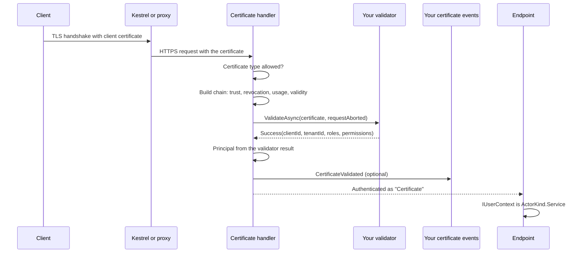
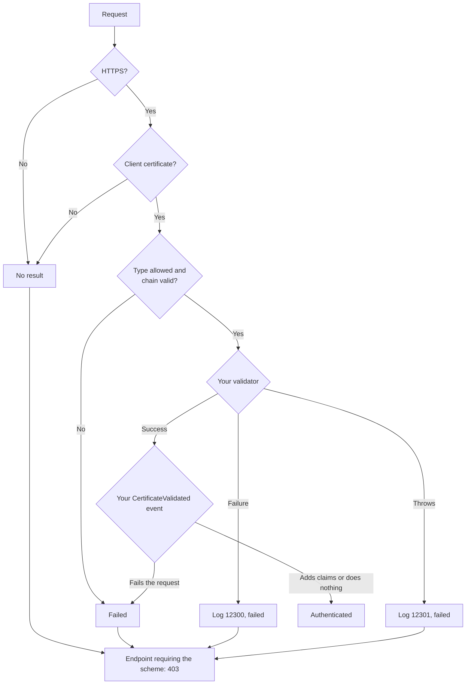
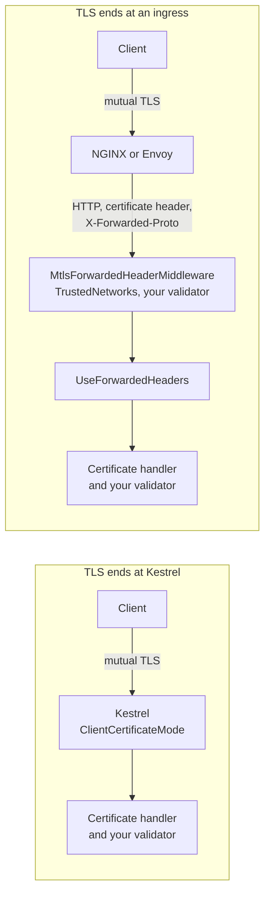
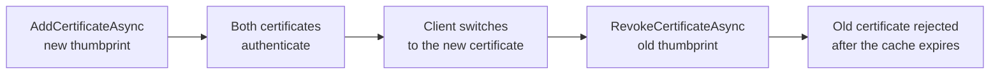

# SharedKernel.Security.Mtls

[](https://dotnet.microsoft.com/)
[](https://github.com/Gresta-Vertex-Labs/platform-shared-kernel/blob/main/LICENSE)


> **Client certificate (mutual TLS) authentication for machine clients in ASP.NET Core, with the chain checked
> before your code decides which client a certificate belongs to.**

A certificate that chains to a trusted authority proves who issued it, not that its holder is one of your clients.
Services that accept client certificates usually get one of two things wrong: they trust any certificate the
authority ever issued, or they skip chain and revocation checks and trust a thumbprint from wherever it came. This
package runs ASP.NET Core's certificate checks first, then calls an `IMtlsCertificateValidator` you write to map the
certificate to a registered client, its tenant, roles and permissions. Application code reads the result through
`IUserContext`, like any other caller.

| 🔗 Chain first | 🪪 Your registry decides | 🧩 One identity model | 🛡️ Cannot be skipped |
| --- | --- | --- | --- |
| System trust or a private CA | `IMtlsCertificateValidator` maps a certificate to a client | `IUserContext` as `ActorKind.Service` | Validator runs before application certificate events |
| Online revocation by default | Tenant, roles and permissions from your data | `TenantId?` from the same result | Replaced events fail startup |
| Client-authentication usage required | Short failure reasons, logged with the thumbprint | `x5t#S256` thumbprint claim | Defaults never weaker than ASP.NET Core's |

## Contents

- [Install](#install)
- [Quick start](#quick-start)
- [Which type do I need?](#which-type-do-i-need)
- [How it works](#how-it-works)
- [Recipes](#recipes)
- [Reference](#reference)
- [Security model](#security-model)
- [Pitfalls](#pitfalls)
- [AI quick reference](#ai-quick-reference)
- [Compatibility and guarantees](#compatibility-and-guarantees)

## Install

```shell
dotnet add package SharedKernel.Security.Mtls
```

| Requirement | Value |
| --- | --- |
| Target framework | `net10.0` |
| Tier | Host (references ASP.NET Core; reference it from the host project only) |
| Dependencies | [`SharedKernel.Security.Abstractions`](https://github.com/Gresta-Vertex-Labs/platform-shared-kernel/tree/main/12.Security/SharedKernel.Security.Abstractions), [`Microsoft.AspNetCore.Authentication.Certificate`](https://www.nuget.org/packages/Microsoft.AspNetCore.Authentication.Certificate), the ASP.NET Core shared framework |
| Registration | `services.AddMtlsAuthentication<TValidator>(configure)` |

| Companion package | Adds |
| --- | --- |
| [`SharedKernel.ServiceDefaults.Security.Mtls`](https://github.com/Gresta-Vertex-Labs/platform-shared-kernel/tree/main/13.ServiceDefaults/SharedKernel.ServiceDefaults.Security.Mtls) | Kestrel client certificate negotiation, and certificates forwarded by a TLS-terminating proxy |
| [`SharedKernel.Security.Oidc`](https://github.com/Gresta-Vertex-Labs/platform-shared-kernel/tree/main/12.Security/SharedKernel.Security.Oidc) | Bearer tokens, including certificate-bound tokens (RFC 8705) |
| [`SharedKernel.Presentation.WebApi`](https://github.com/Gresta-Vertex-Labs/platform-shared-kernel/tree/main/14.Presentation/SharedKernel.Presentation.WebApi) | Enforces `SharedKernel.Presentation.Core`'s `[RequireRole]` and `[RequirePermission]` (namespace `SharedKernel.Presentation.Authorization`) on endpoints |

## Quick start

**1. Write a validator** that maps a certificate to a client. This one reads an allow-list from configuration:

```csharp
using System.Security.Cryptography;
using System.Security.Cryptography.X509Certificates;
using Microsoft.Extensions.Configuration;
using SharedKernel.Security.Mtls.Validation;

/// <summary>Accepts only certificates listed under "MtlsClients" by SHA-256 thumbprint.</summary>
public sealed class ConfiguredClientValidator(IConfiguration configuration) : IMtlsCertificateValidator
{
    public ValueTask<MtlsValidationResult> ValidateAsync(X509Certificate2 certificate, CancellationToken cancellationToken)
    {
        string thumbprint = certificate.GetCertHashString(HashAlgorithmName.SHA256); // uppercase hex
        string? clientId = configuration[$"MtlsClients:{thumbprint}"];

        return ValueTask.FromResult(clientId is null
            ? MtlsValidationResult.Failure("UnknownClient")
            : MtlsValidationResult.Success(clientId, roles: ["internal-service"]));
    }
}
```

```json
{
  "MtlsClients": {
    "<64 hex characters: SHA-256 of the client certificate>": "billing-service"
  }
}
```

**2. Register** the scheme, ask Kestrel for client certificates, and protect an endpoint:

```csharp
// Program.cs
using Microsoft.AspNetCore.Server.Kestrel.Https;
using SharedKernel.Security.Abstractions;
using SharedKernel.Security.Mtls;
using SharedKernel.Security.Mtls.Extensions;

var builder = WebApplication.CreateBuilder(args);

// Ask every TLS client for a certificate. The Certificate handler checks chain, revocation,
// usage and validity later, so Kestrel accepts any certificate here.
builder.WebHost.ConfigureKestrel(kestrel => kestrel.ConfigureHttpsDefaults(https =>
{
    https.ClientCertificateMode = ClientCertificateMode.RequireCertificate;
    https.AllowAnyClientCertificate();
}));

builder.Services.AddMtlsAuthentication<ConfiguredClientValidator>();

builder.Services.AddAuthorizationBuilder()
    .AddPolicy("MtlsClient", policy => policy
        .AddAuthenticationSchemes(MtlsAuthenticationDefaults.AuthenticationScheme)
        .RequireAuthenticatedUser());

var app = builder.Build();
app.UseAuthentication();
app.UseAuthorization();

app.MapGet("/whoami", (IUserContext caller) => new { caller.ClientId, caller.Roles })
    .RequireAuthorization("MtlsClient");

app.Run();
```

**3. Call it** with a certificate issued by a CA the host trusts:

```shell
curl --cert client.crt --key client.key https://localhost:5001/whoami
```

> [!TIP]
> The defaults trust the operating system's root store. For certificates from your own or a partner's CA, see
> [Trust a private CA](#2-trust-a-private-ca-for-partner-certificates). `RequireCertificate` applies to every
> connection, health probes included; use `AllowCertificate` when some endpoints serve callers without one.

## Which type do I need?

| I need to… | Use | Recipe |
| --- | --- | --- |
| Accept a fixed set of certificates | An `IMtlsCertificateValidator` keyed by SHA-256 thumbprint | [Allow-list](#1-allow-list-clients-by-sha-256-thumbprint) |
| Trust certificates from a private CA | `ChainTrustValidationMode = CustomRootTrust` and `CustomTrustStore` | [Private CA](#2-trust-a-private-ca-for-partner-certificates) |
| Map regulated partner certificates to client ids | A validator that reads vetted subject attributes | [Open Banking](#3-onboard-open-banking-and-psd2-partners) |
| Run the validator during the TLS handshake | `AddMtlsClientCertificate` (companion package) | [Kestrel](#4-terminate-tls-at-kestrel-with-the-servicedefaults-integration) |
| Accept certificates forwarded by an ingress | `AddMtlsForwardedHeaderCertificate` (companion package) | [Ingress](#5-run-behind-an-nginx-or-envoy-ingress) |
| Use certificates on some endpoints and bearer tokens on others | An authorization policy naming `MtlsAuthenticationDefaults.AuthenticationScheme` | [Both schemes](#6-use-client-certificates-and-bearer-tokens-in-one-service) |
| Bind access tokens to a client certificate | `SharedKernel.Security.Oidc` | [Both schemes](#6-use-client-certificates-and-bearer-tokens-in-one-service) |
| Replace a client's certificate without downtime | Two registered thumbprints for one client | [Rotation](#7-rotate-a-client-certificate) |
| Test endpoints protected by certificates | `TestServer` and a CA generated in the test | [Testing](#8-test-with-a-generated-certificate-authority) |
| Read the caller's certificate thumbprint | `IUserContext.FindClaim(MtlsAuthenticationDefaults.CertificateThumbprintClaimType)` | [Claims](#claims-and-iusercontext) |

## How it works

### One request

The certificate arrives on the TLS connection, or from a proxy through the companion package. ASP.NET Core's
certificate handler checks it; only a certificate that passes reaches your validator.



The handler builds a new principal from the validator's result. The claims ASP.NET Core derives from the certificate
itself (subject, issuer, DNS name, email) are not kept, so nothing downstream can read an identity the validator did
not approve.

### Outcomes



An endpoint whose policy requires the `Certificate` scheme answers **403**, not 401: a certificate is negotiated on
the connection, so the client cannot be asked for one inside the request. Handle `OnChallenge` to return something
else.

### Deployment topologies



| Topology | TLS and certificate | Configure | Validator runs |
| --- | --- | --- | --- |
| Kestrel, plain | Kestrel requests the certificate and accepts any; the handler checks it | `ConfigureHttpsDefaults` with `ClientCertificateMode` and `AllowAnyClientCertificate()` ([quick start](#quick-start)) | Once per request that uses the scheme |
| Kestrel, ServiceDefaults | Kestrel requests the certificate and your validator decides during the handshake; the handler checks it again | `builder.AddMtlsClientCertificate(mode)` ([recipe 4](#4-terminate-tls-at-kestrel-with-the-servicedefaults-integration)) | During each handshake, blocking, and once per request that uses the scheme |
| Ingress | The proxy completes mutual TLS and forwards the certificate in a header | `builder.AddMtlsForwardedHeaderCertificate(...)`, the middleware and forwarded headers ([recipe 5](#5-run-behind-an-nginx-or-envoy-ingress)) | In the middleware, and once per request that uses the scheme |

In every topology the chain, revocation, usage and validity checks happen in the handler, with the options of this
package.

### Where certificate-bound tokens fit

This package authenticates a **client** by its certificate. It does not look at access tokens.
`SharedKernel.Security.Oidc` authenticates a **token**, and when the token carries an RFC 8705 confirmation
(`cnf` with `x5t#S256`), it requires the certificate on the connection to have that thumbprint. The two share only
the connection's certificate, so they work together or apart:

| You want | Use |
| --- | --- |
| Machine clients identified by their certificate | This package |
| Tokens that are useless without the client's private key | `SharedKernel.Security.Oidc` with a certificate-bound token and a certificate on the connection |
| Both on the same request | Not in one policy; see [recipe 6](#6-use-client-certificates-and-bearer-tokens-in-one-service) |

The `x5t#S256` claim this package adds uses the same encoding (Base64url SHA-256 of the DER certificate), so a
certificate caller's thumbprint can be compared with a token's confirmation.

## Recipes

Complete, compiling examples. Each one lists the `using` directives it needs.

### 1. Allow-list clients by SHA-256 thumbprint

Register each client certificate in a table. The validator looks the thumbprint up, caches the answer briefly and
rejects revoked rows.

```csharp
using System.Data.Common;
using System.Security.Cryptography;
using System.Security.Cryptography.X509Certificates;
using Microsoft.Extensions.Caching.Memory;
using SharedKernel.Execution.Tenancy;
using SharedKernel.Security.Mtls.Validation;

public sealed record RegisteredClient(
    string ClientId, TenantId? TenantId, string[] Roles, string[] Permissions, bool Revoked);

public interface IClientCertificateStore
{
    /// <summary>Finds the client registered for a SHA-256 thumbprint (uppercase hex).</summary>
    Task<RegisteredClient?> FindByThumbprintAsync(string thumbprint, CancellationToken ct);
}

public sealed class ThumbprintAllowListValidator(IClientCertificateStore store, IMemoryCache cache)
    : IMtlsCertificateValidator
{
    // Bounds how long a revocation in the store takes to apply.
    private static readonly TimeSpan CacheDuration = TimeSpan.FromMinutes(1);

    public async ValueTask<MtlsValidationResult> ValidateAsync(
        X509Certificate2 certificate, CancellationToken cancellationToken)
    {
        string thumbprint = certificate.GetCertHashString(HashAlgorithmName.SHA256);

        RegisteredClient? client = await cache.GetOrCreateAsync($"mtls-client:{thumbprint}", entry =>
        {
            entry.AbsoluteExpirationRelativeToNow = CacheDuration;
            return store.FindByThumbprintAsync(thumbprint, cancellationToken);
        });

        if (client is null)
        {
            return MtlsValidationResult.Failure("UnknownClient");
        }

        return client.Revoked
            ? MtlsValidationResult.Failure("Revoked")
            : MtlsValidationResult.Success(client.ClientId, client.TenantId, client.Roles, client.Permissions);
    }
}

/// <summary>PostgreSQL store: one row per certificate, several rows may share a client id.</summary>
public sealed class PostgresClientCertificateStore(DbDataSource database) : IClientCertificateStore
{
    private const string Sql = """
        SELECT client_id, tenant_id, roles, permissions, revoked
        FROM client_certificates
        WHERE thumbprint_sha256 = @thumbprint
        """;

    public async Task<RegisteredClient?> FindByThumbprintAsync(string thumbprint, CancellationToken ct)
    {
        await using DbCommand command = database.CreateCommand(Sql);
        DbParameter parameter = command.CreateParameter();
        parameter.ParameterName = "thumbprint";
        parameter.Value = thumbprint;
        command.Parameters.Add(parameter);

        await using DbDataReader reader = await command.ExecuteReaderAsync(ct);
        if (!await reader.ReadAsync(ct))
        {
            return null;
        }

        return new RegisteredClient(
            ClientId: reader.GetString(0),
            TenantId: reader.IsDBNull(1) ? null : new TenantId(reader.GetGuid(1)),
            Roles: reader.GetFieldValue<string[]>(2),
            Permissions: reader.GetFieldValue<string[]>(3),
            Revoked: reader.GetBoolean(4));
    }
}
```

```csharp
// Program.cs
builder.Services.AddMemoryCache();
builder.Services.AddSingleton<IClientCertificateStore, PostgresClientCertificateStore>();
builder.Services.AddMtlsAuthentication<ThumbprintAllowListValidator>();
```

The cache matters: the validator runs on every request that uses the scheme, and during every TLS handshake with
[recipe 4](#4-terminate-tls-at-kestrel-with-the-servicedefaults-integration). An unknown thumbprint is cached too,
so a newly registered certificate works within `CacheDuration`.

> [!NOTE]
> A thumbprint identifies one exact certificate, so an allow-list works with any trust setting. It still passes
> through the chain check first: keep the defaults unless your clients' CA is private.

### 2. Trust a private CA for partner certificates

Put the CA's root and any intermediates in `CustomTrustStore`. Only certificates that chain to them reach your
validator; the operating system's roots are not used.

```csharp
// Program.cs
using System.Security.Cryptography.X509Certificates;
using SharedKernel.Security.Mtls.Extensions;

// The partner CA's root and any intermediates, in one PEM bundle.
X509Certificate2Collection partnerCa = [];
partnerCa.ImportFromPemFile(builder.Configuration["Mtls:PartnerCaBundlePath"]!);

builder.Services.AddMtlsAuthentication<OpenBankingCertificateValidator>(options =>
{
    options.ChainTrustValidationMode = X509ChainTrustMode.CustomRootTrust;
    options.CustomTrustStore.AddRange(partnerCa);
    // RevocationMode stays Online: the CA publishes CRL distribution points or OCSP.
});
```

Include intermediates in the bundle: the handler builds the chain from the trust store and does not use
intermediates a client sends during the TLS handshake.

**Choose a revocation mode.** A certificate whose revocation status cannot be determined is rejected in every mode
that checks.

| `RevocationMode` | What happens | Latency | When revocation data is unavailable | Use when |
| --- | --- | --- | --- | --- |
| `Online` (default) | Downloads the CRL or queries OCSP named in the certificate; the platform caches the data | A network call when nothing is cached | Rejected | The CA publishes revocation data your hosts can reach |
| `Offline` | Uses only revocation data already cached on the machine | None | Rejected | Hosts without outbound access, when the cache is kept current |
| `NoCheck` | No revocation check | None | Not applicable | The CA publishes no revocation data; revoke clients in your validator instead |

A private CA without CRL distribution points or OCSP fails every certificate under `Online`. Set `NoCheck` and keep a
revoked flag in your registry, as in [recipe 1](#1-allow-list-clients-by-sha-256-thumbprint). `RevocationFlag`
(default `ExcludeRoot`) decides which chain elements are checked: `EndCertificateOnly`, `ExcludeRoot` or
`EntireChain`.

> [!WARNING]
> Never set `AllowedCertificateTypes` to `SelfSigned` or `All` to make a private CA work. A self-signed certificate
> passes chain validation by definition, with revocation off, so all trust moves to your validator.

### 3. Onboard Open Banking and PSD2 partners

Regulated partners present certificates from qualified or scheme-operated CAs. Trust only those CAs (recipe 2), then
map the certificate to the partner you onboarded. PSD2 qualified website authentication certificates (QWACs) carry
the partner's authorization number in the subject's `organizationIdentifier` attribute (OID 2.5.4.97), for example
`PSDGB-FCA-123456`. Other Open Banking directories define their own certificate profiles; check yours.

```csharp
using System.Security.Cryptography.X509Certificates;
using SharedKernel.Execution.Tenancy;
using SharedKernel.Security.Mtls.Validation;

/// <summary>A partner approved during onboarding.</summary>
public sealed record PartnerRegistration(
    string ClientId,
    string OrganizationIdentifier, // e.g. "PSDGB-FCA-123456"
    string IssuerName,             // issuer DN of the certificate presented at onboarding
    TenantId TenantId,
    string[] Roles,                // e.g. ["aisp"], from the regulator's register, not the certificate
    string[] Permissions,
    bool Suspended);

public interface IPartnerRegistry
{
    Task<PartnerRegistration?> FindByOrganizationIdentifierAsync(string organizationIdentifier, CancellationToken ct);
}

public sealed class OpenBankingCertificateValidator(IPartnerRegistry registry) : IMtlsCertificateValidator
{
    private const string OrganizationIdentifierOid = "2.5.4.97";

    public async ValueTask<MtlsValidationResult> ValidateAsync(
        X509Certificate2 certificate, CancellationToken cancellationToken)
    {
        string? organizationIdentifier = FindSingleSubjectAttribute(certificate.SubjectName, OrganizationIdentifierOid);
        if (organizationIdentifier is null)
        {
            return MtlsValidationResult.Failure("MissingOrganizationIdentifier");
        }

        PartnerRegistration? partner =
            await registry.FindByOrganizationIdentifierAsync(organizationIdentifier, cancellationToken);

        if (partner is null)
        {
            return MtlsValidationResult.Failure("UnknownPartner");
        }

        if (partner.Suspended)
        {
            return MtlsValidationResult.Failure("PartnerSuspended");
        }

        // The chain already proved a trusted CA signed this certificate. Requiring the CA recorded at
        // onboarding stops another trusted CA from issuing a certificate with the same identifier.
        if (!string.Equals(certificate.IssuerName.Name, partner.IssuerName, StringComparison.Ordinal))
        {
            return MtlsValidationResult.Failure("UnexpectedIssuer");
        }

        return MtlsValidationResult.Success(partner.ClientId, partner.TenantId, partner.Roles, partner.Permissions);
    }

    // Reads parsed attributes, never string-splits Subject: escaping and multi-valued names defeat splitting.
    private static string? FindSingleSubjectAttribute(X500DistinguishedName name, string oid)
    {
        string? found = null;
        foreach (X500RelativeDistinguishedName attribute in name.EnumerateRelativeDistinguishedNames())
        {
            if (attribute.HasMultipleElements || attribute.GetSingleElementType().Value != oid)
            {
                continue;
            }

            if (found is not null)
            {
                return null; // present twice: ambiguous, reject
            }

            found = attribute.GetSingleElementValue();
        }

        return found;
    }
}
```

**Which certificate fields are safe to use.** Your validator receives only certificates that passed the chain check,
but a valid chain proves only what the issuing CA verified.

| Field | Use it to identify a client? | Why |
| --- | --- | --- |
| SHA-256 thumbprint (`GetCertHashString(HashAlgorithmName.SHA256)`) | ✅ Yes, for one exact certificate | Unique to the certificate; TLS proved the holder has its private key |
| Subject attributes the CA's policy vets, such as `organizationIdentifier` and `O` | ✅ Yes, with a trust store limited to CAs that vet them | Only as reliable as the least careful CA you trust |
| Issuer name | ✅ As a pin, together with an identifier | Trustworthy only because the chain check verified the issuer's signature |
| Common name (`CN`) | ⚠️ Only if your CA's policy defines it | Public CAs put a domain name there, not an organization |
| DNS names in the subject alternative name | ⚠️ Only for domain identity | Domain validation proves control of a domain, not who the partner is |
| Email or UPN | ❌ No, unless your CA validates them for this purpose | Often copied from the request without checks |
| SHA-1 `X509Certificate2.Thumbprint` | ❌ Prefer SHA-256 | Matches `x5t#S256` and RFC 8705, and avoids SHA-1 |
| Roles or permissions encoded in the certificate | ❌ Take them from your registry | Revoking a role would otherwise require revoking the certificate |
| `HttpContext.Connection.ClientCertificate` on an endpoint without this scheme | ❌ No | No chain check ran for that request |

With `System` trust, any public CA can issue a certificate with a matching common name. Use `CustomRootTrust` with
only the CAs your scheme accepts.

### 4. Terminate TLS at Kestrel with the ServiceDefaults integration

[`SharedKernel.ServiceDefaults.Security.Mtls`](https://github.com/Gresta-Vertex-Labs/platform-shared-kernel/tree/main/13.ServiceDefaults/SharedKernel.ServiceDefaults.Security.Mtls)
configures Kestrel to request a certificate and run your validator during the TLS handshake, so an unregistered
client cannot even open a connection.

```csharp
// Program.cs
using Microsoft.AspNetCore.Server.Kestrel.Https;
using SharedKernel.Security.Mtls.Extensions;
using SharedKernel.ServiceDefaults.Security;

builder.Services.AddMemoryCache();
builder.Services.AddSingleton<IClientCertificateStore, PostgresClientCertificateStore>();
builder.Services.AddMtlsAuthentication<ThumbprintAllowListValidator>();

// Kestrel requests a certificate and runs the validator during the TLS handshake.
builder.AddMtlsClientCertificate(ClientCertificateMode.RequireCertificate); // default: AllowCertificate
```

| Behavior | Consequence |
| --- | --- |
| The validator runs in a new service scope per handshake, with `CancellationToken.None` | Scoped dependencies work; the call cannot be cancelled |
| Kestrel's callback is synchronous, so the async validator is blocked on | Keep the validator fast: an in-memory list or a cache ([recipe 1](#1-allow-list-clients-by-sha-256-thumbprint)), never a remote call per handshake |
| The validator's answer replaces Kestrel's own chain check at the handshake | The chain, revocation and usage checks still run in the Certificate handler for endpoints that use the scheme |
| A rejected certificate fails the handshake | The client sees a TLS error, not an HTTP response; logged as event 13001 |

Endpoints still need a policy naming the `Certificate` scheme, as in the [quick start](#quick-start).

### 5. Run behind an NGINX or Envoy ingress

When TLS ends at an ingress, the certificate reaches the service in a request header. The companion package's
middleware reads it, but only from the ingress's network, and only after your validator accepts it.

```csharp
// Program.cs
using System.Security.Cryptography.X509Certificates;
using Microsoft.AspNetCore.HttpOverrides;
using SharedKernel.Security.Mtls.Extensions;
using SharedKernel.ServiceDefaults.Security;
using IPNetwork = System.Net.IPNetwork;

var builder = WebApplication.CreateBuilder(args);
var ingressPods = IPNetwork.Parse("10.42.0.0/16"); // the ingress controller's pod network

builder.Services.AddMtlsAuthentication<OpenBankingCertificateValidator>(options =>
{
    options.ChainTrustValidationMode = X509ChainTrustMode.CustomRootTrust;
    options.CustomTrustStore.ImportFromPemFile("/etc/mtls/partner-ca.pem");
});

// Reads the certificate from the header, only when the request comes from the ingress.
builder.AddMtlsForwardedHeaderCertificate(options =>
{
    options.HeaderName = "ssl-client-cert";
    options.AddTrustedNetwork(ingressPods);
});

// Restores the original scheme: the Certificate handler ignores requests that are not HTTPS.
builder.Services.Configure<ForwardedHeadersOptions>(options =>
{
    options.ForwardedHeaders = ForwardedHeaders.XForwardedFor | ForwardedHeaders.XForwardedProto;
    options.KnownIPNetworks.Add(ingressPods);
});

builder.Services.AddAuthorization();

var app = builder.Build();
app.UseMiddleware<MtlsForwardedHeaderMiddleware>(); // first: checks the proxy's address, not the client's
app.UseForwardedHeaders();
app.UseAuthentication();
app.UseAuthorization();
```

**Order matters.** `UseForwardedHeaders` with `XForwardedFor` replaces the connection's remote address with the
client's. Run `MtlsForwardedHeaderMiddleware` before it, so `TrustedNetworks` is compared with the ingress's address.
Without `XForwardedProto`, the request is plain HTTP to the service and the Certificate handler returns no result.

**NGINX Ingress Controller** verifies the client and passes the certificate, URL-encoded PEM, in `ssl-client-cert`:

```yaml
metadata:
  annotations:
    nginx.ingress.kubernetes.io/auth-tls-secret: "payments/partner-ca"   # ca.crt: the partner CA
    nginx.ingress.kubernetes.io/auth-tls-verify-client: "on"
    nginx.ingress.kubernetes.io/auth-tls-pass-certificate-to-upstream: "true"
```

**Envoy and Istio** send client certificate details in the structured `x-forwarded-client-cert` header, which the
middleware does not parse. Configure the proxy to put the certificate alone in its own header (Envoy's
`%DOWNSTREAM_PEER_CERT%` command operator produces URL-encoded PEM), or add your own middleware.

| Header value format | Supported |
| --- | --- |
| Base64 DER (for example HAProxy `%[ssl_c_der,base64]`) | ✅ |
| URL-encoded PEM (NGINX `ssl-client-cert`, Envoy `%DOWNSTREAM_PEER_CERT%`) | ✅ |
| Envoy/Istio `x-forwarded-client-cert` (`Hash=…;Cert="…"`) | ❌ |

> [!IMPORTANT]
> The proxy must overwrite or remove any certificate header a client sends, and a `NetworkPolicy` should allow only
> the ingress to reach the service. `TrustedNetworks` stops forged headers from other network paths; it cannot stop
> a header your own proxy passes through.

### 6. Use client certificates and bearer tokens in one service

Bearer tokens stay the default scheme; certificate endpoints name the `Certificate` scheme in their policy.

```csharp
// Program.cs
using SharedKernel.Presentation.Authorization;
using SharedKernel.Presentation.WebApi.Authorization;
using SharedKernel.Security.Abstractions;
using SharedKernel.Security.Mtls;
using SharedKernel.Security.Mtls.Extensions;
using SharedKernel.Security.Oidc.Extensions;

var builder = WebApplication.CreateBuilder(args);

builder.Services.AddOidcAuthentication(builder.Configuration);                // "Bearer", the default scheme
builder.Services.AddMtlsAuthentication<OpenBankingCertificateValidator>();    // "Certificate", per endpoint
builder.Services.AddSharedKernelAuthorizationFilters();

builder.Services.AddAuthorizationBuilder()
    .AddPolicy("Partner", policy => policy
        .AddAuthenticationSchemes(MtlsAuthenticationDefaults.AuthenticationScheme)
        .RequireAuthenticatedUser());

var app = builder.Build();
app.UseAuthentication();
app.UseAuthorization();

// Users and first-party apps: bearer tokens.
app.MapGroup("/api")
    .RequireAuthorization()
    .MapGet("/me", (IUserContext caller) => new { caller.SubjectId });

// Partners: client certificates only.
RouteGroupBuilder partner = app.MapGroup("/partner").RequireAuthorization("Partner");
partner.AddEndpointFilter<AuthorizationRequirementEndpointFilter>();
partner.MapPost("/payments", (IUserContext caller) => Results.Accepted())
    .RequirePermission("payments:initiate");

app.Run();
```

With controllers, use `[Authorize(AuthenticationSchemes = MtlsAuthenticationDefaults.AuthenticationScheme)]`.
`RequirePermission` checks the permissions your validator returned; `RequireRole` checks its roles.

- **Do not list both schemes in one policy.** The request then has two identities, and `IUserContext` maps only one
  of them.
- **To require a token and a certificate together**, protect the endpoint with the bearer scheme and issue
  certificate-bound tokens. `SharedKernel.Security.Oidc` rejects a token with `cnf` `x5t#S256` unless the connection
  carries that certificate, from Kestrel or from the forwarding middleware.
- **`RequireFreshAuthentication` and `RequireAuthenticationMethod` always deny certificate callers.** A certificate
  has no authentication time or methods.

### 7. Rotate a client certificate

A client moves to a new certificate while the old one still works. With the thumbprint store from recipe 1:

```csharp
using System.Data.Common;
using System.Security.Cryptography;
using System.Security.Cryptography.X509Certificates;

public sealed class ClientCertificateRegistry(DbDataSource database)
{
    // Copies the client's grants from a certificate it already uses.
    private const string AddSql = """
        INSERT INTO client_certificates (thumbprint_sha256, client_id, tenant_id, roles, permissions, revoked)
        SELECT @thumbprint, client_id, tenant_id, roles, permissions, false
        FROM client_certificates
        WHERE client_id = @clientId AND NOT revoked
        LIMIT 1
        """;

    private const string RevokeSql = """
        UPDATE client_certificates SET revoked = true
        WHERE thumbprint_sha256 = @thumbprint AND client_id = @clientId
        """;

    /// <summary>Registers the client's next certificate; the current one keeps working.</summary>
    /// <param name="certificatePem">The public certificate only, never a private key.</param>
    public async Task<string> AddCertificateAsync(string clientId, string certificatePem, CancellationToken ct)
    {
        using X509Certificate2 certificate = X509Certificate2.CreateFromPem(certificatePem);
        string thumbprint = certificate.GetCertHashString(HashAlgorithmName.SHA256);

        await ExecuteAsync(AddSql, clientId, thumbprint, ct);
        return thumbprint;
    }

    /// <summary>Retires a certificate once the client has switched to its replacement.</summary>
    public Task RevokeCertificateAsync(string clientId, string thumbprint, CancellationToken ct) =>
        ExecuteAsync(RevokeSql, clientId, thumbprint, ct);

    private async Task ExecuteAsync(string sql, string clientId, string thumbprint, CancellationToken ct)
    {
        await using DbCommand command = database.CreateCommand(sql);
        foreach ((string name, string value) in new[] { ("clientId", clientId), ("thumbprint", thumbprint) })
        {
            DbParameter parameter = command.CreateParameter();
            parameter.ParameterName = name;
            parameter.Value = value;
            command.Parameters.Add(parameter);
        }

        if (await command.ExecuteNonQueryAsync(ct) != 1)
        {
            throw new InvalidOperationException($"No active certificate of client '{clientId}' matched.");
        }
    }
}
```



- Both thumbprints resolve to the same client id, so data owned by the client is unaffected.
- A validator that maps subject attributes (recipe 3) needs no registry change when the new certificate carries the
  same identifier and issuer. Revoke the old certificate at the CA if it must stop working before it expires.
- Access tokens bound to the old certificate stop working as soon as the client presents the new one. The client
  requests new tokens after switching.

### 8. Test with a generated certificate authority

`TestServer` has no TLS handshake. A test-only middleware puts the certificate on the connection, and the real
handler, trust settings and validator do the rest.

```csharp
using System.Net;
using System.Security.Cryptography;
using System.Security.Cryptography.X509Certificates;
using Microsoft.AspNetCore.Authorization;
using Microsoft.AspNetCore.Builder;
using Microsoft.AspNetCore.Hosting;
using Microsoft.AspNetCore.Http;
using Microsoft.AspNetCore.TestHost;
using Microsoft.Extensions.DependencyInjection;
using Microsoft.Extensions.Hosting;
using SharedKernel.Security.Abstractions;
using SharedKernel.Security.Mtls;
using SharedKernel.Security.Mtls.Extensions;
using SharedKernel.Security.Mtls.Validation;
using Xunit;

/// <summary>A throwaway certificate authority built in memory.</summary>
public sealed class TestCertificateAuthority : IDisposable
{
    private TestCertificateAuthority(X509Certificate2 certificate) => Certificate = certificate;

    public X509Certificate2 Certificate { get; }

    public static TestCertificateAuthority Create()
    {
        using var key = ECDsa.Create(ECCurve.NamedCurves.nistP256);
        var request = new CertificateRequest("CN=Test Root CA", key, HashAlgorithmName.SHA256);
        request.CertificateExtensions.Add(new X509BasicConstraintsExtension(true, false, 0, true));
        request.CertificateExtensions.Add(new X509KeyUsageExtension(X509KeyUsageFlags.KeyCertSign | X509KeyUsageFlags.CrlSign, true));
        request.CertificateExtensions.Add(new X509SubjectKeyIdentifierExtension(request.PublicKey, false));

        DateTimeOffset now = DateTimeOffset.UtcNow;
        return new TestCertificateAuthority(request.CreateSelfSigned(now.AddDays(-1), now.AddYears(1)));
    }

    public X509Certificate2 IssueClientCertificate(string subject)
    {
        using var key = ECDsa.Create(ECCurve.NamedCurves.nistP256);
        var request = new CertificateRequest(subject, key, HashAlgorithmName.SHA256);
        request.CertificateExtensions.Add(new X509BasicConstraintsExtension(false, false, 0, false));
        request.CertificateExtensions.Add(new X509KeyUsageExtension(X509KeyUsageFlags.DigitalSignature, false));
        request.CertificateExtensions.Add(new X509EnhancedKeyUsageExtension([new Oid("1.3.6.1.5.5.7.3.2")], false)); // client auth
        request.CertificateExtensions.Add(X509AuthorityKeyIdentifierExtension.CreateFromCertificate(Certificate, true, false));

        DateTimeOffset now = DateTimeOffset.UtcNow;
        using X509Certificate2 issued = request.Create(Certificate, now.AddHours(-1), now.AddDays(30), RandomNumberGenerator.GetBytes(16));
        return issued.CopyWithPrivateKey(key);
    }

    public void Dispose() => Certificate.Dispose();
}

/// <summary>Accepts exactly one certificate.</summary>
public sealed class SingleCertificateValidator(string thumbprint) : IMtlsCertificateValidator
{
    public ValueTask<MtlsValidationResult> ValidateAsync(X509Certificate2 certificate, CancellationToken cancellationToken) =>
        ValueTask.FromResult(certificate.GetCertHashString(HashAlgorithmName.SHA256) == thumbprint
            ? MtlsValidationResult.Success("partner-a", roles: ["partner"])
            : MtlsValidationResult.Failure("UnknownClient"));
}

public sealed class PartnerEndpointTests : IDisposable
{
    // TestServer has no TLS handshake, so a test-only middleware puts the certificate on the connection.
    private const string TestCertificateHeader = "X-Test-Client-Certificate";

    private readonly TestCertificateAuthority _ca = TestCertificateAuthority.Create();

    public void Dispose() => _ca.Dispose();

    [Fact]
    public async Task Registered_certificate_is_authenticated_as_a_service_principal()
    {
        using X509Certificate2 certificate = _ca.IssueClientCertificate("CN=partner-a");
        using IHost host = await StartHostAsync(certificate.GetCertHashString(HashAlgorithmName.SHA256));

        using HttpResponseMessage response = await SendAsync(host, certificate);

        Assert.Equal(HttpStatusCode.OK, response.StatusCode);
        Assert.Equal("Service:partner-a", await response.Content.ReadAsStringAsync());
    }

    [Fact]
    public async Task Certificate_from_another_ca_never_reaches_the_validator()
    {
        using TestCertificateAuthority otherCa = TestCertificateAuthority.Create();
        using X509Certificate2 certificate = otherCa.IssueClientCertificate("CN=partner-a");
        using IHost host = await StartHostAsync(certificate.GetCertHashString(HashAlgorithmName.SHA256));

        using HttpResponseMessage response = await SendAsync(host, certificate);

        Assert.Equal(HttpStatusCode.Forbidden, response.StatusCode); // the handler forbids rather than challenges
    }

    private async Task<IHost> StartHostAsync(string allowedThumbprint)
    {
        IHost host = new HostBuilder()
            .ConfigureWebHost(web => web
                .UseTestServer()
                .ConfigureServices(services =>
                {
                    services.AddRouting();
                    services.AddAuthorization();
                    services.AddSingleton<IMtlsCertificateValidator>(new SingleCertificateValidator(allowedThumbprint));
                    services.AddMtlsAuthentication<SingleCertificateValidator>(options =>
                    {
                        options.ChainTrustValidationMode = X509ChainTrustMode.CustomRootTrust;
                        options.CustomTrustStore.Add(_ca.Certificate);
                        options.RevocationMode = X509RevocationMode.NoCheck; // the test CA publishes no CRL
                    });
                })
                .Configure(app =>
                {
                    app.Use((context, next) =>
                    {
                        if (context.Request.Headers.TryGetValue(TestCertificateHeader, out var value))
                        {
                            context.Connection.ClientCertificate =
                                X509CertificateLoader.LoadCertificate(Convert.FromBase64String(value!));
                        }

                        return next(context);
                    });
                    app.UseRouting();
                    app.UseAuthentication();
                    app.UseAuthorization();
                    app.UseEndpoints(endpoints => endpoints
                        .MapGet("/partner", (IUserContext caller) => $"{caller.ActorKind}:{caller.ClientId}")
                        .RequireAuthorization(new AuthorizeAttribute
                        {
                            AuthenticationSchemes = MtlsAuthenticationDefaults.AuthenticationScheme,
                        }));
                }))
            .Build();

        await host.StartAsync();
        return host;
    }

    private static Task<HttpResponseMessage> SendAsync(IHost host, X509Certificate2 certificate)
    {
        HttpClient client = host.GetTestClient();
        client.BaseAddress = new Uri("https://localhost/"); // the handler ignores plain HTTP

        var request = new HttpRequestMessage(HttpMethod.Get, "/partner");
        request.Headers.Add(TestCertificateHeader, Convert.ToBase64String(certificate.RawData));
        return client.SendAsync(request);
    }
}
```

The test project needs `Microsoft.AspNetCore.TestHost` and xUnit. Registering the validator instance before
`AddMtlsAuthentication` makes the test's instance win. Never add the certificate-injecting middleware outside tests.

## Reference

### Namespaces

| Namespace | Types |
| --- | --- |
| `SharedKernel.Security.Mtls` | `MtlsAuthenticationDefaults` |
| `SharedKernel.Security.Mtls.Extensions` | `MtlsServiceCollectionExtensions.AddMtlsAuthentication<TValidator>` |
| `SharedKernel.Security.Mtls.Options` | `MtlsAuthenticationOptions` |
| `SharedKernel.Security.Mtls.Validation` | `IMtlsCertificateValidator`, `MtlsValidationResult` |

### Registration

```csharp
IServiceCollection AddMtlsAuthentication<TValidator>(
    this IServiceCollection services,
    Action<MtlsAuthenticationOptions>? configure = null)
    where TValidator : class, IMtlsCertificateValidator;
```

| Registered | Details |
| --- | --- |
| Authentication scheme `Certificate` | ASP.NET Core's certificate handler. **Not** made the default scheme |
| `IMtlsCertificateValidator` | `TValidator`, scoped. An earlier registration wins |
| `MtlsAuthenticationOptions` | From `configure`, validated when the host starts |
| `IUserContextMapper` | Maps identities of the `Certificate` scheme |
| `IUserContext` | Scoped, resolved from `HttpContext.User` through the registered mappers. An earlier registration wins, except an `AnonymousUserContext` instance placeholder, which is replaced |
| `IHttpContextAccessor` | Added |

The scheme name is fixed, so call `AddMtlsAuthentication` once per host. Outside a request, `IUserContext` resolves
to `AnonymousUserContext.Instance`, whose `TenantId` is `null`.

### Options

`MtlsAuthenticationOptions`, set through `configure`. Nothing is read from `IConfiguration`; bind your own settings
and apply them in the delegate.

| Option | Default | Effect |
| --- | --- | --- |
| `AllowedCertificateTypes` | `CertificateTypes.Chained` | Which certificates are accepted: `Chained`, `SelfSigned` or `All` |
| `ChainTrustValidationMode` | `X509ChainTrustMode.System` | `System`: the operating system's roots. `CustomRootTrust`: only `CustomTrustStore` |
| `CustomTrustStore` | Empty | Roots and intermediates trusted under `CustomRootTrust` (a get-only collection: add to it) |
| `RevocationMode` | `X509RevocationMode.Online` | `Online`, `Offline` or `NoCheck`; unknown status is rejected |
| `RevocationFlag` | `X509RevocationFlag.ExcludeRoot` | `EndCertificateOnly`, `ExcludeRoot` or `EntireChain` |
| `ValidateCertificateUse` | `true` | Requires the client authentication extended key usage (1.3.6.1.5.5.7.3.2) |
| `ValidateValidityPeriod` | `true` | Rejects expired and not-yet-valid certificates |

The defaults equal ASP.NET Core's own certificate authentication defaults.

### Startup validation

The host fails to start when:

| Condition | Failure message contains |
| --- | --- |
| `CustomRootTrust` with an empty `CustomTrustStore` | `CustomTrustStore must contain the trusted root` |
| `System` trust with a non-empty `CustomTrustStore` | `CustomTrustStore is ignored unless ChainTrustValidationMode is CustomRootTrust` |
| `ChainTrustValidationMode`, `RevocationMode` or `RevocationFlag` is not a defined value | `is not defined` |
| `AllowedCertificateTypes` is `0` or has undefined bits | `AllowedCertificateTypes '…' is not valid` |
| `CertificateAuthenticationOptions.EventsType` is set for the `Certificate` scheme | `EventsType is not supported for the Certificate scheme` |
| The scheme's `Events` were replaced in a `PostConfigure` registered after `AddMtlsAuthentication` | `configure events with Configure, not PostConfigure` |

### Validator and result

```csharp
public interface IMtlsCertificateValidator
{
    ValueTask<MtlsValidationResult> ValidateAsync(X509Certificate2 certificate, CancellationToken cancellationToken);
}
```

| Member | Description |
| --- | --- |
| `MtlsValidationResult.Success(clientId, tenantId = null, roles = null, permissions = null)` | Accepts the certificate. Throws `ArgumentException` for an empty or whitespace `clientId`, or a `default(TenantId)` tenant (pass `null` for no tenant) |
| `MtlsValidationResult.Failure(reason = "Rejected")` | Rejects it. `reason` is a short, non-secret code for logs, such as `UnknownClient`; empty throws |
| `IsValid`, `ClientId`, `TenantId`, `Roles`, `Permissions`, `FailureReason` | The result's values; `Roles` and `Permissions` are never null |

The validator receives the request's `RequestAborted` token. It is scoped, so it can use scoped services such as a
`DbContext`.

### Claims and IUserContext

After a successful validation the principal holds exactly these claims (plus any your `CertificateValidated` event
adds), with authentication type `Certificate`:

| Claim type | Value | `IUserContext` member |
| --- | --- | --- |
| `sub` | `ClientId` | `SubjectId` |
| `client_id` | `ClientId` | `ClientId` |
| `x5t#S256` (`MtlsAuthenticationDefaults.CertificateThumbprintClaimType`) | Base64url SHA-256 of the DER certificate, 43 characters | `FindClaim(...)` |
| `tenant_id` | `TenantId`, when set | `TenantId`, and `IRequestContext.TenantId` |
| `roles` | One claim per role | `Roles`, `HasRole` (ordinal) |
| `scope` | One claim per permission | `Permissions`, `HasPermission` (ordinal) |

| `IUserContext` member | Certificate caller |
| --- | --- |
| `ActorKind` | `Service` |
| `IsAuthenticated` | `true` |
| `AuthenticationMethods`, `AuthTime`, `AuthContextClassReference` | Empty, `null`, `null` |
| `SessionId`, `Name`, `Email` | `null` |
| `IsSenderConstrained` | `false` |

`HttpContext.User.Identity.Name` is the client id.

### Certificate events

Set events for the scheme with `Configure`, before or after `AddMtlsAuthentication`:

```csharp
// Program.cs
using Microsoft.AspNetCore.Authentication.Certificate;
using SharedKernel.Security.Mtls;

builder.Services.Configure<CertificateAuthenticationOptions>(
    MtlsAuthenticationDefaults.AuthenticationScheme,
    options => options.Events = new CertificateAuthenticationEvents
    {
        OnCertificateValidated = context => Task.CompletedTask, // add claims, or context.Fail(...)
    });
```

| Event | When it runs |
| --- | --- |
| `OnCertificateValidated` | Only after your validator accepted. Sees the validator's principal; may add claims, replace the principal or fail |
| `OnAuthenticationFailed` | After a chain failure, a validator rejection, or an exception from your events. It cannot turn a validator rejection into a success |
| `OnChallenge` | When an endpoint requiring the scheme has no authenticated caller; default response 403 |

### Log events

| EventId | Level | Package | Message |
| --- | --- | --- | --- |
| `12300` | Warning | This package | `Client certificate rejected by the validator (reason: {Reason}, thumbprint: {Thumbprint}).` |
| `12301` | Error | This package | `The certificate validator failed; the client certificate was rejected (thumbprint: {Thumbprint}).` Includes the exception |
| `13000` | Information | `SharedKernel.ServiceDefaults.Security.Mtls` | Certificate accepted during the handshake or by the forwarding middleware |
| `13001` | Warning | `SharedKernel.ServiceDefaults.Security.Mtls` | Certificate rejected there, or a forwarded header from outside `TrustedNetworks` |
| `13003` | Warning | `SharedKernel.ServiceDefaults.Security.Mtls` | Forwarding configured without `TrustedNetworks` |

`{Thumbprint}` is the Base64url SHA-256 thumbprint. The certificate itself is never logged. Chain, revocation and
usage failures are logged by ASP.NET Core under `Microsoft.AspNetCore.Authentication.Certificate`.

## Security model

### What it guarantees

| Threat | Protection |
| --- | --- |
| A certificate from an authority you do not trust | Chain validation against the system roots or only your `CustomTrustStore`, before your validator runs |
| A self-signed certificate | Rejected by default (`Chained`) |
| A revoked certificate | `Online` revocation checking by default; unknown status is rejected |
| A server or code-signing certificate used as a client certificate | The client authentication extended key usage is required |
| An expired or not-yet-valid certificate | Rejected by default |
| A certificate a trusted CA issued to someone who is not your client | Your validator must map it to a registered client; nothing is accepted without `Success` |
| Application certificate events that accept without the validator | The validator runs first; its rejection is final for `OnCertificateValidated` and `OnAuthenticationFailed`; `EventsType` or later replaced events fail startup |
| A validator that throws (registry down) | The certificate is rejected and event `12301` logged; cancellation still propagates |
| Trust settings weakened on `CertificateAuthenticationOptions` after registration | Startup fails unless they match `MtlsAuthenticationOptions` |
| Identity read from unvetted certificate fields | The principal holds only claims from the validator's result |
| An identity from another scheme treated as a certificate caller | `IUserContext` maps by exact authentication type; an unknown scheme resolves to anonymous |
| Accidentally authenticating every endpoint with certificates | The scheme is never the default; endpoints opt in |
| Misconfigured trust settings | Contradictory or undefined values fail startup |
| Secrets in logs | Only the thumbprint and your short reason are logged |

### What it does not protect against

- **A stolen client private key.** The certificate authenticates whoever holds the key. Revoke it at the CA or in your
  registry.
- **Your mapping logic.** The package cannot tell whether your validator identifies the right client. Use vetted
  fields ([recipe 3](#3-onboard-open-banking-and-psd2-partners)).
- **The TLS-terminating proxy.** Behind an ingress, the proxy performs the TLS handshake and is fully trusted to
  forward the right certificate and to strip client-supplied certificate headers.
- **Code that reads `HttpContext.Connection.ClientCertificate` directly.** With `AllowAnyClientCertificate` or a
  forwarded header, that certificate has not been validated unless this scheme authenticated the request.
- **Authorization.** Authentication yields roles and permissions; endpoints still have to require them.
- **Step-up checks.** Certificate callers have no authentication time or methods, so freshness requirements always
  deny them.
- **Resource exhaustion.** Revocation downloads and a slow validator add latency to every request that uses the
  scheme; rate-limit untrusted callers.

### Reporting a vulnerability

Please do not open a public issue. Report privately through the repository's
[Security tab](https://github.com/Gresta-Vertex-Labs/platform-shared-kernel/security) (**Report a vulnerability**),
as described in the [security policy](https://github.com/Gresta-Vertex-Labs/platform-shared-kernel/blob/main/SECURITY.md).

## Pitfalls

| ❌ Don't | ✅ Do | Why |
| --- | --- | --- |
| Accept every certificate the CA issued | Return `Success` only for registered clients | A trusted CA may issue certificates to parties that are not your clients |
| Set `AllowedCertificateTypes = All` for a private CA | `CustomRootTrust` with the CA in `CustomTrustStore` | Self-signed certificates skip trust and revocation checks |
| Use `System` trust for partner certificates | Trust only the CAs your scheme accepts | Any public CA can issue a certificate with a matching name |
| Keep `Online` revocation for a CA that publishes no CRL or OCSP | `NoCheck` plus a revoked flag in your registry | Every certificate is rejected with unknown revocation status |
| Parse `certificate.Subject` with string splitting | `SubjectName.EnumerateRelativeDistinguishedNames()` | Escaped commas and multi-valued names produce wrong values |
| Allow-list the SHA-1 `Thumbprint` | `GetCertHashString(HashAlgorithmName.SHA256)` | Matches `x5t#S256` and RFC 8705 |
| Call a remote service in the validator on every request | Cache lookups for a short, bounded time | The validator runs on every request, and during each handshake with `AddMtlsClientCertificate` |
| Read `HttpContext.Connection.ClientCertificate` in endpoints | Read `IUserContext` or the `x5t#S256` claim | The raw certificate may not have been validated |
| Set trust properties on `CertificateAuthenticationOptions` directly | Use `MtlsAuthenticationOptions` | Values that differ from `MtlsAuthenticationOptions` stop the host at startup |
| Replace `Events` in `PostConfigure`, or set `EventsType` | Set `Events` in `Configure` | The host refuses to start, because the validator would be skipped |
| Call `context.Success()` in `OnAuthenticationFailed` | Only `Fail`, or leave the result alone | After a validator rejection it is ignored; after other failures it would accept a certificate that failed the chain |
| Return `Failure` for an outage inside the validator | Let the exception escape | A thrown exception is rejected and logged as `12301` with the exception; a `Failure` hides the outage as a client error |
| Enable ASP.NET Core's `AddCertificateCache` without thinking | Cache inside your validator with a known lifetime | A cached result skips your validator, so registry revocations wait for the cache |
| Put `UseForwardedHeaders` before `MtlsForwardedHeaderMiddleware` | Run the certificate middleware first | `X-Forwarded-For` rewrites the address `TrustedNetworks` checks |
| Forget `XForwardedProto` behind a proxy | Restore the `https` scheme with forwarded headers | The Certificate handler ignores HTTP requests |
| List `Bearer` and `Certificate` in one policy | One scheme per endpoint, or certificate-bound tokens | `IUserContext` maps only one of the two identities |
| Put `[RequireFreshAuthentication]` on certificate endpoints | Use roles and permissions | Certificate callers have no authentication time |
| Pass a secret or certificate data as `Failure(reason)` | A short code such as `UnknownClient` | The reason is logged |

## AI quick reference

Rules for generating code with this package. Each line is a rule.

```text
REGISTER     services.AddMtlsAuthentication<TValidator>(options => { ... }); once per host. Scheme "Certificate"
             (MtlsAuthenticationDefaults.AuthenticationScheme) is NOT the default scheme.
ENDPOINTS    Policy with .AddAuthenticationSchemes(MtlsAuthenticationDefaults.AuthenticationScheme)
             .RequireAuthenticatedUser(), or [Authorize(AuthenticationSchemes = MtlsAuthenticationDefaults.AuthenticationScheme)].
VALIDATOR    class : IMtlsCertificateValidator; ValueTask<MtlsValidationResult> ValidateAsync(X509Certificate2, CancellationToken).
             Scoped. Runs only after chain/revocation/usage/validity checks pass. Map to a REGISTERED client or Failure.
RESULT       MtlsValidationResult.Success(clientId, tenantId?, roles?, permissions?) (no empty clientId, no default(TenantId));
             MtlsValidationResult.Failure("ShortCode").
IDENTIFY     Thumbprint: certificate.GetCertHashString(HashAlgorithmName.SHA256). Subject attributes:
             SubjectName.EnumerateRelativeDistinguishedNames(). Never string-split Subject; never SHA-1 Thumbprint.
PRIVATE CA   options.ChainTrustValidationMode = X509ChainTrustMode.CustomRootTrust; options.CustomTrustStore.Add(root/intermediates).
             No CRL/OCSP: options.RevocationMode = X509RevocationMode.NoCheck and revoke in the validator.
CALLER       Inject IUserContext: ActorKind.Service, SubjectId == ClientId, TenantId (TenantId?), Roles, Permissions,
             FindClaim(MtlsAuthenticationDefaults.CertificateThumbprintClaimType) = Base64url SHA-256.
KESTREL      ConfigureHttpsDefaults: ClientCertificateMode + AllowAnyClientCertificate(), or
             builder.AddMtlsClientCertificate(mode) from SharedKernel.ServiceDefaults.Security.Mtls (fast validator only).
INGRESS      builder.AddMtlsForwardedHeaderCertificate(o => { o.HeaderName = "..."; o.AddTrustedNetwork(...); });
             app.UseMiddleware<MtlsForwardedHeaderMiddleware>() BEFORE app.UseForwardedHeaders() (XForwardedProto),
             then UseAuthentication, UseAuthorization.
EVENTS       services.Configure<CertificateAuthenticationOptions>("Certificate", o => o.Events = ...). Never PostConfigure,
             never EventsType, never Success() in OnAuthenticationFailed. A throwing validator rejects (12301).
TOKENS       Certificate-bound access tokens (cnf x5t#S256) are enforced by SharedKernel.Security.Oidc, not here.
TESTS        TestServer + CertificateRequest-generated CA; test middleware sets Connection.ClientCertificate;
             https BaseAddress; RevocationMode.NoCheck.
FORBIDDEN    AllowedCertificateTypes.All/SelfSigned for a CA; reading Connection.ClientCertificate in app code;
             both Bearer and Certificate in one policy; trust properties set on CertificateAuthenticationOptions;
             logging certificates; remote calls per request without caching.
```

## Compatibility and guarantees

- **Public API is tracked** with `Microsoft.CodeAnalysis.PublicApiAnalyzers`; changes are deliberate and reviewed.
- **Every public member is documented**; an undocumented member fails the build.
- **Defaults are never weaker than ASP.NET Core's** certificate authentication defaults, and a test holds them equal.
- **Order-independent composition:** an `IUserContext` registered by you or another package is
  kept; each authentication package maps only its own scheme.
- **Fails at startup, not at the first request,** for contradictory trust settings and replaced events.

**Deliberately not included:** certificate issuance and CA management, revocation responders, parsing of PSD2
QCStatements or the Envoy `x-forwarded-client-cert` header, TLS configuration (Kestrel or the companion package owns
it), certificate-bound token checks (`SharedKernel.Security.Oidc`), validation-result caching (your validator decides
the lifetime), and more than one certificate scheme per host.
