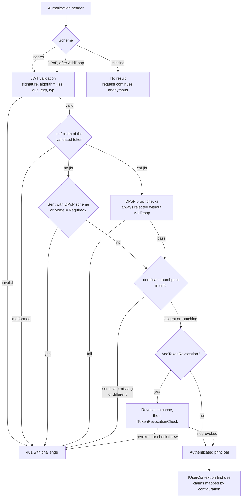
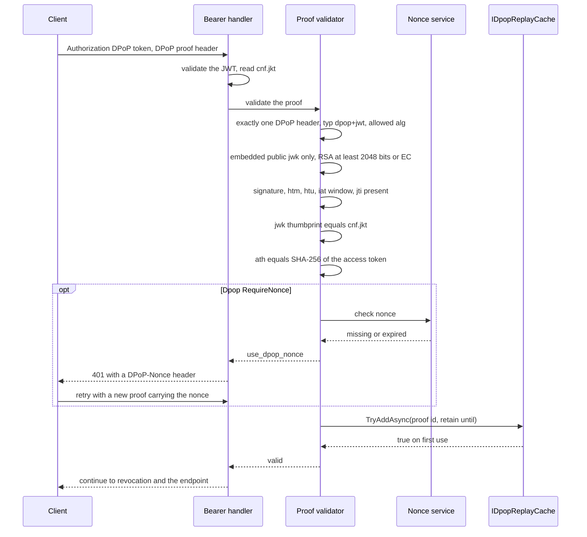

# SharedKernel.Security.Oidc

[](https://dotnet.microsoft.com/)
[](https://github.com/Gresta-Vertex-Labs/platform-shared-kernel/blob/main/LICENSE)


> **JWT bearer authentication for access tokens from any OpenID Connect provider, with the validation rules pinned,
> sender-constrained tokens enforced, and the caller exposed as `IUserContext`.**

A JWT bearer setup fails quietly. ASP.NET Core renames `sub` to a long URI, so the subject is missing. An allow-list
that permits `HS256` lets a public key act as an HMAC secret. An `OnTokenValidated` event that rebuilds the principal
drops the `cnf` claim, and a stolen DPoP-bound token works as a plain bearer token. This package configures the JWT
bearer handler once, keeps claim names as issued, pins the checks that must not be weakened, and runs the
proof-of-possession and revocation checks inside the handler, where application events cannot skip them.

| 🔑 Validate | 📌 Bind to the client | 🚫 Revoke | 👤 Identify |
| --- | --- | --- | --- |
| Issuer, audience, lifetime, signature | DPoP proofs (RFC 9449) | Your `ITokenRevocationCheck`, fails closed | `IUserContext` (caller and `TenantId?`) |
| Asymmetric allow-list: RS, PS, ES 256–512 | Replay cache and server nonces | Cache keyed by token hash | Users and service principals |
| Optional `typ` check (`at+jwt`) | Certificate-bound tokens (RFC 8705) | Bounded "not revoked" delay | Claim names from configuration |
| Settings validated at startup | Enforced in the handler, not in events | Introspection-ready request | Any OIDC provider, no provider SDK |

## Contents

- [Install](#install)
- [Quick start](#quick-start)
- [Which type do I need?](#which-type-do-i-need)
- [How it works](#how-it-works)
- [Recipes](#recipes)
- [Reference](#reference)
- [Security model](#security-model)
- [Pitfalls](#pitfalls)
- [AI quick reference](#ai-quick-reference)
- [Compatibility and guarantees](#compatibility-and-guarantees)

## Install

```shell
dotnet add package SharedKernel.Security.Oidc
```

| Requirement | Value |
| --- | --- |
| Target framework | `net10.0` |
| Tier | Host (references ASP.NET Core; reference it from the host project only) |
| Dependencies | [`SharedKernel.Security.Abstractions`](https://github.com/Gresta-Vertex-Labs/platform-shared-kernel/tree/main/12.Security/SharedKernel.Security.Abstractions), [`SharedKernel.Configuration`](https://github.com/Gresta-Vertex-Labs/platform-shared-kernel/tree/main/01.Core/SharedKernel.Configuration), [`Microsoft.AspNetCore.Authentication.JwtBearer`](https://www.nuget.org/packages/Microsoft.AspNetCore.Authentication.JwtBearer) (brings the ASP.NET Core shared framework) |
| Registration | `services.AddOidcAuthentication(configuration)`, then opt in to DPoP and revocation |
| Configuration section | `SharedKernel:Security:Oidc` |

| Companion package | Adds |
| --- | --- |
| [`SharedKernel.Security.Abstractions`](https://github.com/Gresta-Vertex-Labs/platform-shared-kernel/tree/main/12.Security/SharedKernel.Security.Abstractions) | `IUserContext`, `SystemUserContext`, `SecurityClaimTypes` (installed with this package) |
| [`SharedKernel.Presentation.WebApi`](https://github.com/Gresta-Vertex-Labs/platform-shared-kernel/tree/main/14.Presentation/SharedKernel.Presentation.WebApi) | Enforces `SharedKernel.Presentation.Core`'s `[RequireRole]`, `[RequirePermission]`, `[RequireFreshAuthentication]`, `[RequireAuthenticationMethod]` (namespace `SharedKernel.Presentation.Authorization`) over `IUserContext` |
| [`SharedKernel.ServiceDefaults.Security.Mtls`](https://github.com/Gresta-Vertex-Labs/platform-shared-kernel/tree/main/13.ServiceDefaults/SharedKernel.ServiceDefaults.Security.Mtls) | Client certificates from Kestrel or a TLS-terminating proxy, for certificate-bound tokens |
| [`SharedKernel.MultiTenancy`](https://github.com/Gresta-Vertex-Labs/platform-shared-kernel/tree/main/13.ServiceDefaults/SharedKernel.MultiTenancy) | Tenant resolution middleware; its claim strategy reads the tenant this package maps |
| [`SharedKernel.Security.Totp`](https://github.com/Gresta-Vertex-Labs/platform-shared-kernel/tree/main/12.Security/SharedKernel.Security.Totp) | Session-bound TOTP step-up (`amr` = `otp`) on top of an OIDC session |
| [`SharedKernel.Security.ApiKey`](https://github.com/Gresta-Vertex-Labs/platform-shared-kernel/tree/main/12.Security/SharedKernel.Security.ApiKey), [`SharedKernel.Security.Mtls`](https://github.com/Gresta-Vertex-Labs/platform-shared-kernel/tree/main/12.Security/SharedKernel.Security.Mtls) | Other authentication schemes that resolve to the same `IUserContext` |

## Quick start

**1. Configure** your provider. `Authority` and at least one audience are required.

```json
{
  "SharedKernel": {
    "Security": {
      "Oidc": {
        "Authority": "https://login.microsoftonline.com/<tenant-id>/v2.0",
        "Audiences": [ "api://orders" ]
      }
    }
  }
}
```

**2. Register** authentication and require an authenticated caller.

```csharp
// Program.cs
using SharedKernel.Security.Abstractions;
using SharedKernel.Security.Oidc.Extensions;

var builder = WebApplication.CreateBuilder(args);

builder.Services.AddOidcAuthentication(builder.Configuration);
builder.Services.AddAuthorization();

var app = builder.Build();

app.UseAuthentication();
app.UseAuthorization();

app.MapGet("/me", (IUserContext user) => new
{
    user.ActorKind,
    user.SubjectId,
    user.ClientId,
    user.TenantId,
    user.Roles,
    user.Permissions,
}).RequireAuthorization();

app.Run();
```

**3. Inject `IUserContext`** wherever you need the caller. It is scoped, read from the request's principal, and
anonymous outside a request.

```csharp
using SharedKernel.Execution.Context;
using SharedKernel.Security.Abstractions;

public sealed class OrderApprovals(IUserContext user)
{
    public bool CanApprove() =>
        user.ActorKind == ActorKind.User
        && user.HasPermission("orders.approve"); // ordinal: scopes are case-sensitive
}
```

> [!TIP]
> Settings are validated when the host starts. A missing `Authority`, an `HS256` in `ValidAlgorithms` or an out-of-range
> clock skew stops startup with an `OptionsValidationException` that lists every problem.

## Which type do I need?

| I need to… | Use | Recipe |
| --- | --- | --- |
| Accept tokens from Microsoft Entra ID | `AddOidcAuthentication` with `tid`/`oid` claim settings | [Entra ID](#1-protect-an-api-with-microsoft-entra-id) |
| Accept tokens from Entra External ID or Azure AD B2C | Same registration, provider-specific `Authority` | [External ID and B2C](#2-accept-tokens-from-entra-external-id-or-azure-ad-b2c) |
| Accept tokens from Keycloak or Auth0 | `Claims` settings for roles, permissions and tenant | [Keycloak](#3-accept-tokens-from-keycloak), [Auth0](#4-accept-tokens-from-auth0) |
| Tell a daemon's token from a user's | `IUserContext.ActorKind`, `Claims:ApplicationTokenClaims` | [Service-to-service](#5-accept-service-to-service-tokens) |
| Accept DPoP-bound tokens | `.AddDpop<TReplayCache>()`, your `IDpopReplayCache` | [DPoP](#6-accept-dpop-bound-tokens) |
| Reject every token that is not DPoP-bound | `Dpop:Mode = Required`, optional `Dpop:RequireNonce` | [Require DPoP](#7-require-dpop-with-server-nonces) |
| Accept certificate-bound tokens behind a proxy | Forwarded client certificate + this package's RFC 8705 check | [Certificate-bound tokens](#8-accept-certificate-bound-tokens-behind-a-tls-terminating-proxy) |
| Reject tokens revoked before they expire | `.AddTokenRevocation<TCheck>()`, `.AddTokenRevocationCache<TCache>()` | [Revocation](#9-reject-revoked-tokens-with-introspection) |
| Gate endpoints on roles, scopes, MFA or recent sign-in | `SharedKernel.Presentation.WebApi` attributes | [Authorize endpoints](#10-authorize-endpoints-with-sharedkernelpresentationwebapi) |
| Test endpoints without a real identity provider | Locally signed tokens, static signing keys | [Integration tests](#11-test-with-locally-signed-tokens) |
| Run a worker with no caller | Register `SystemUserContext.Instance` before `AddOidcAuthentication` | [Registered services](#registered-services) |

## How it works

### Inside the authentication handler

The package replaces the `Bearer` scheme's handler with one that runs ASP.NET Core's own JWT validation first, then
its own checks. Every check reads the token that passed validation, not the principal, which an application event may
rebuild.



`IUserContext` is not built inside the handler. It is a scoped service that maps `HttpContext.User` the first time
it is resolved in a request, through the OIDC `IUserContextMapper`. An identity from another scheme with no mapper
resolves to `AnonymousUserContext`, never to an authenticated context.

### What the JWT validation pins

Settings are applied in two steps. A `Configure` step copies your settings into `JwtBearerOptions`, so a later
`Configure` delegate can still adjust them (for example an `IssuerValidator`). A `PostConfigure` step then sets the
values that must not be weakened, and options validation, which runs after every `PostConfigure`, stops the host at
startup if a later registration changed any of them again:

| Setting | Pinned value |
| --- | --- |
| `MapInboundClaims` | `false`: claims keep the names the provider issued (`sub`, `roles`, `scp`, `tid`) |
| `TokenValidationParameters.ValidateIssuer` | `true`; accepted issuers are `ValidIssuers`, or the discovery document's issuer when empty |
| `TokenValidationParameters.ValidateAudience` | `true`; accepted audiences are `Audiences` |
| `TokenValidationParameters.ValidateLifetime` | `true`, with `ClockSkew` of at most five minutes |
| `TokenValidationParameters.RequireExpirationTime` | `true`: a token without `exp` is rejected |
| `TokenValidationParameters.RequireSignedTokens` | `true`: `alg: none` is rejected |
| `TokenValidationParameters.ValidAlgorithms` | `ValidAlgorithms`, or `RS256`, `PS256`, `ES256` |
| `NameClaimType`, `RoleClaimType` | From `Claims`, so `User.Identity.Name` and `User.IsInRole` agree with `IUserContext` |
| `AuthenticationType` | `Bearer`, which the mapper matches |

Signing keys and the issuer come from `{Authority}/.well-known/openid-configuration`, fetched on the first request, not
at startup.

### DPoP proof validation

A DPoP-bound token carries `cnf.jkt`, the thumbprint of the client's key. Every request must present it as
`Authorization: DPoP <token>` with a fresh proof signed by that key.



| Check | Rule |
| --- | --- |
| Header | Exactly one `DPoP` header |
| `typ` | `dpop+jwt`, case-insensitive |
| `alg` | In `Dpop:ValidAlgorithms` (default `ES256`, `PS256`, `RS256`) |
| `jwk` | Present in the header; no private members (`d`, `p`, `q`, `dp`, `dq`, `qi`, `oth`, `k`); `EC`, or `RSA` of at least 2048 bits |
| `htm` | Equals the request method, ordinal |
| `htu` | Equals scheme, host, path base and path of the request; scheme and host case-insensitive, query and fragment ignored |
| `iat` | Not after `now + ClockSkew`, not before `now - ProofLifetime - ClockSkew` |
| `jti` | Present, at most 256 characters |
| Key binding | RFC 7638 thumbprint of `jwk` equals `cnf.jkt` |
| `ath` | Base64url SHA-256 of the access token, compared in fixed time |
| `nonce` | When `RequireNonce`: issued by this service and not expired |
| Replay | `IDpopReplayCache.TryAddAsync` with id `Base64url(SHA-256("{jkt}.{jti}"))`, kept until `iat + ProofLifetime + ClockSkew` |

Nonces are stateless: an expiry time and 16 random bytes protected with ASP.NET Core Data Protection. Any replica with
the same key ring accepts them, and a nonce can be reused until it expires.

### Collection settings replace their defaults

Configuration binding appends to a list that already has items. If `ValidAlgorithms` started as `["RS256", "PS256",
"ES256"]`, configuring `["PS256"]` would produce all three plus `PS256`. So every collection setting starts empty, and
the documented defaults apply only while it stays empty. **A configured list replaces the default; it never adds to
it.** Setting `Claims:PermissionClaimTypes` to `["permissions"]` stops reading `scope` and `scp`.

## Recipes

Complete examples. Each one lists the `using` directives it needs; `Program.cs` snippets assume
`var builder = WebApplication.CreateBuilder(args);`.

### 1. Protect an API with Microsoft Entra ID

Entra ID puts the tenant in `tid`, and `oid` identifies a user across applications (`sub` is pairwise per
application). Application roles arrive in `roles` and delegated scopes in `scp`, both read by default.

```json
{
  "SharedKernel": {
    "Security": {
      "Oidc": {
        "Authority": "https://login.microsoftonline.com/<tenant-id>/v2.0",
        "Audiences": [ "api://orders", "<application-client-id>" ],
        "Claims": {
          "SubjectClaimType": "oid",
          "TenantClaimType": "tid"
        }
      }
    }
  }
}
```

```csharp
// Program.cs
using SharedKernel.Security.Oidc.Extensions;

builder.Services.AddOidcAuthentication(builder.Configuration);
builder.Services.AddAuthorization();
```

- The issuer from this `Authority` is `https://login.microsoftonline.com/<tenant-id>/v2.0`, which v2.0 access tokens
  carry. Set `"accessTokenAcceptedVersion": 2` in the app registration manifest, or add the v1.0 issuer
  `https://sts.windows.net/<tenant-id>/` to `ValidIssuers`.
- `tid` is a GUID, so `IUserContext.TenantId` is the Entra directory id. If your tenants are not directories, issue
  your own GUID claim instead.
- For app-only tokens to map as service principals, add the `idtyp` optional claim to access tokens in the app
  registration (see [recipe 5](#5-accept-service-to-service-tokens)).

**Multi-tenant applications.** With `Authority` `https://login.microsoftonline.com/organizations/v2.0`, the discovery
document's issuer is a template containing `{tenantid}`, which no token matches. Validate the issuer yourself. The
delegate goes in a `Configure` call registered **after** `AddOidcAuthentication`, whose own `Configure` step replaces
`TokenValidationParameters`:

```csharp
// Program.cs
using Microsoft.AspNetCore.Authentication.JwtBearer;
using Microsoft.IdentityModel.JsonWebTokens;
using Microsoft.IdentityModel.Tokens;
using SharedKernel.Security.Oidc;
using SharedKernel.Security.Oidc.Extensions;

HashSet<string> allowedTenants = [.. builder.Configuration.GetSection("Orders:AllowedTenants").Get<string[]>() ?? []];

builder.Services.AddOidcAuthentication(builder.Configuration);

builder.Services.Configure<JwtBearerOptions>(OidcAuthenticationDefaults.AuthenticationScheme, options =>
    options.TokenValidationParameters.IssuerValidator = (issuer, token, _) =>
        token is JsonWebToken jwt
        && jwt.TryGetPayloadValue("tid", out string? tenantId)
        && tenantId is not null
        && allowedTenants.Contains(tenantId)
        && string.Equals(issuer, $"https://login.microsoftonline.com/{tenantId}/v2.0", StringComparison.Ordinal)
            ? issuer
            : throw new SecurityTokenInvalidIssuerException("The token was not issued by an allowed tenant."));
```

`ValidateIssuer` stays pinned to `true`, so the delegate always runs.

### 2. Accept tokens from Entra External ID or Azure AD B2C

Both are standard OIDC providers; only `Authority` and a few claim names differ.

```json
{
  "SharedKernel": {
    "Security": {
      "Oidc": {
        "Authority": "https://<tenant-subdomain>.ciamlogin.com/<tenant-id>/v2.0",
        "Audiences": [ "<api-application-client-id>" ],
        "Claims": { "SubjectClaimType": "oid", "TenantClaimType": "tid" }
      }
    }
  }
}
```

For Azure AD B2C, `Authority` names the user flow or custom policy, and one registration serves one policy:

```json
{
  "SharedKernel": {
    "Security": {
      "Oidc": {
        "Authority": "https://<tenant-name>.b2clogin.com/<tenant-name>.onmicrosoft.com/<policy-name>/v2.0/",
        "Audiences": [ "<api-application-client-id>" ],
        "Claims": { "EmailClaimType": "emails" }
      }
    }
  }
}
```

- B2C issues no tenant or role claims by default. Add them as custom claims (a GUID for the tenant) and point
  `TenantClaimType` and `RoleClaimType` at them.
- If requests fail issuer validation, copy the `iss` value of a real access token into `ValidIssuers`.

### 3. Accept tokens from Keycloak

```json
{
  "SharedKernel": {
    "Security": {
      "Oidc": {
        "Authority": "https://keycloak.example.com/realms/orders",
        "Audiences": [ "orders-api" ],
        "Claims": {
          "TenantClaimType": "tenant_id",
          "ApplicationTokenClaims": { "token_kind": "service" }
        }
      }
    }
  }
}
```

Configure the realm so tokens carry flat claims:

| Need | Keycloak setting |
| --- | --- |
| `aud` contains `orders-api` | An **Audience** mapper on the client scope used by callers |
| Roles in `roles` | The realm roles mapper's token claim name set to `roles`, multivalued, added to the access token. The default `realm_access.roles` is a nested object, not a flat claim |
| Tenant in `tenant_id` | A user attribute mapper holding a GUID |
| Permissions | `scope` is read by default (space-separated) |
| Service accounts | A hardcoded claim mapper (`token_kind` = `service`) on clients that use client credentials, listed in `ApplicationTokenClaims` |

`ApplicationTokenClaims` is a configured collection, so it replaces the defaults `idtyp=app` and
`gty=client-credentials`. For a local Keycloak over plain HTTP, set `"RequireHttpsMetadata": false` in development
only; with it `true`, an `http://` authority fails startup validation.

### 4. Accept tokens from Auth0

Auth0 access tokens carry RBAC permissions in a `permissions` array and roles only through a namespaced custom claim
added by an Action.

```json
{
  "SharedKernel": {
    "Security": {
      "Oidc": {
        "Authority": "https://<tenant>.eu.auth0.com/",
        "Audiences": [ "https://api.example.com/orders" ],
        "Claims": {
          "RoleClaimType": "https://example.com/roles",
          "TenantClaimType": "https://example.com/tenant_id",
          "PermissionClaimTypes": [ "permissions", "scope" ]
        }
      }
    }
  }
}
```

- Enable **RBAC** and **Add Permissions in the Access Token** on the API. Each array element becomes one permission.
- `PermissionClaimTypes` replaces the defaults, so list `scope` too if you also grant scopes.
- Auth0 client-credentials tokens carry `gty=client-credentials`, a default application token claim, so they map as
  service principals with `SubjectId` `<client-id>@clients`.
- Claim types containing `:` (such as `https://example.com/kind`) work as values, like `RoleClaimType` above, but
  not as `ApplicationTokenClaims` keys in configuration, where `:` separates sections. Set those keys in code:

```csharp
// Program.cs
using SharedKernel.Security.Oidc.Extensions;
using SharedKernel.Security.Oidc.Options;

builder.Services.AddOidcAuthentication(builder.Configuration);
builder.Services.Configure<OidcAuthenticationOptions>(options =>
    options.Claims.ApplicationTokenClaims["https://example.com/kind"] = "service");
```

### 5. Accept service-to-service tokens

A client-credentials token has no user. The mapper returns `ActorKind.Service` when any of these holds:

| Rule | Typical provider |
| --- | --- |
| A claim matches `ApplicationTokenClaims` by type and value (default `idtyp=app`, `gty=client-credentials`) | Entra ID with the `idtyp` optional claim, Auth0 |
| The subject equals the client id (ordinal) | Okta, Duende IdentityServer |
| There is a client id but no subject | Providers that omit `sub` for clients |

For a service caller, `SubjectId` is the subject, or the client id when there is no subject. A token with neither
a subject nor a client id is rejected with `401` and logs event `12100`.

```csharp
using SharedKernel.Execution.Context;
using SharedKernel.Security.Abstractions;

app.MapPost("/internal/orders/{id:guid}/recalculate", (Guid id, IUserContext caller) =>
{
    // Only the billing daemon, and only with the application role granted to it.
    if (caller.ActorKind != ActorKind.Service
        || caller.ClientId != "billing-worker"
        || !caller.HasRole("Orders.Recalculate"))
    {
        return Results.Forbid();
    }

    return Results.Accepted();
}).RequireAuthorization();
```

A background worker in the same service has no token at all. Register the system identity before
`AddOidcAuthentication`, which then keeps it:

```csharp
// Worker Program.cs
using SharedKernel.Security.Abstractions;
using SharedKernel.Security.Oidc.Extensions;

builder.Services.AddScoped<IUserContext>(_ => SystemUserContext.Instance);
builder.Services.AddOidcAuthentication(builder.Configuration);
```

### 6. Accept DPoP-bound tokens

`.AddDpop<TReplayCache>()` turns DPoP on. The replay cache is yours: it must be shared by every replica and record a
proof in one atomic operation. With Redis, that is `SET key value NX PX`.

This example uses StackExchange.Redis and is illustrative; adapt connection handling to your service.

```csharp
using SharedKernel.Primitives.Clocks;
using SharedKernel.Security.Oidc.Dpop;
using StackExchange.Redis;

/// <summary>Records DPoP proofs in Redis with one atomic SET NX, shared by every replica.</summary>
public sealed class RedisDpopReplayCache(IConnectionMultiplexer redis, IClock clock) : IDpopReplayCache
{
    public async ValueTask<bool> TryAddAsync(string proofId, DateTimeOffset expiresAt, CancellationToken cancellationToken)
    {
        TimeSpan ttl = expiresAt - clock.UtcNow;
        if (ttl < TimeSpan.FromSeconds(1))
        {
            ttl = TimeSpan.FromSeconds(1); // Redis rejects a zero or negative expiry
        }

        // true: the key was created now. false: the proof was already used.
        // A connection failure throws, and the request is rejected.
        return await redis.GetDatabase().StringSetAsync($"dpop:{proofId}", 1, ttl, When.NotExists);
    }
}
```

```csharp
// Program.cs
using SharedKernel.Security.Oidc.Extensions;
using StackExchange.Redis;

builder.Services.AddSingleton<IConnectionMultiplexer>(
    ConnectionMultiplexer.Connect(builder.Configuration.GetConnectionString("Redis")!));

builder.Services.AddOidcAuthentication(builder.Configuration)
    .AddDpop<RedisDpopReplayCache>();
```

With the default `Dpop:Mode` `Allowed`, DPoP-bound tokens need a valid proof and plain bearer tokens keep working. Every
401 then also carries `WWW-Authenticate: DPoP algs="ES256 PS256 RS256"`.

**A single instance only** (local development, a service that never scales out) can keep proofs in memory. `AddDpop`
registers the cache as scoped, so register a singleton first; the package's `TryAdd` keeps it.

```csharp
using System.Collections.Concurrent;
using SharedKernel.Primitives.Clocks;
using SharedKernel.Security.Oidc.Dpop;

/// <summary>
/// In-memory replay cache. NOT for more than one replica: each instance would accept a proof the others have seen.
/// </summary>
public sealed class InMemoryDpopReplayCache(IClock clock) : IDpopReplayCache
{
    private readonly ConcurrentDictionary<string, DateTimeOffset> _proofs = new(StringComparer.Ordinal);

    public ValueTask<bool> TryAddAsync(string proofId, DateTimeOffset expiresAt, CancellationToken cancellationToken)
    {
        DateTimeOffset now = clock.UtcNow;
        foreach (KeyValuePair<string, DateTimeOffset> entry in _proofs)
        {
            if (entry.Value < now)
            {
                _proofs.TryRemove(entry);
            }
        }

        return ValueTask.FromResult(_proofs.TryAdd(proofId, expiresAt)); // TryAdd is atomic
    }
}
```

```csharp
// Program.cs
builder.Services.AddSingleton<IDpopReplayCache, InMemoryDpopReplayCache>();
builder.Services.AddOidcAuthentication(builder.Configuration)
    .AddDpop<InMemoryDpopReplayCache>();
```

> [!IMPORTANT]
> Behind a reverse proxy, the proof's `htu` names the public URL. Run `app.UseForwardedHeaders()` with
> `XForwardedProto` and `XForwardedHost` and your proxies listed as known, before `UseAuthentication`, or every proof
> fails with `UriMismatch`.

### 7. Require DPoP with server nonces

`Required` rejects every token that is not DPoP-bound. `RequireNonce` limits a proof created in advance to
`NonceLifetime`: the first request gets a 401 with a `DPoP-Nonce` header, and the client retries with that nonce.

```json
{
  "SharedKernel": {
    "Security": {
      "Oidc": {
        "Authority": "https://idp.example.com",
        "Audiences": [ "api://payments" ],
        "ValidAlgorithms": [ "PS256", "ES256" ],
        "Dpop": {
          "Mode": "Required",
          "RequireNonce": true,
          "ValidAlgorithms": [ "ES256", "PS256" ],
          "ProofLifetime": "00:00:30",
          "NonceLifetime": "00:05:00"
        }
      }
    }
  }
}
```

Nonces are protected with ASP.NET Core Data Protection, so every replica needs the same key ring, stored outside the
container. With Redis, using the `Microsoft.AspNetCore.DataProtection.StackExchangeRedis` package:

```csharp
// Program.cs
using Microsoft.AspNetCore.DataProtection;
using SharedKernel.Security.Oidc.Extensions;
using StackExchange.Redis;

ConnectionMultiplexer redis = ConnectionMultiplexer.Connect(builder.Configuration.GetConnectionString("Redis")!);
builder.Services.AddSingleton<IConnectionMultiplexer>(redis);

builder.Services.AddDataProtection()
    .SetApplicationName("payments-api")                  // the same on every replica
    .PersistKeysToStackExchangeRedis(redis, "DataProtection-Keys");

builder.Services.AddOidcAuthentication(builder.Configuration)
    .AddDpop<RedisDpopReplayCache>();                    // from recipe 6
```

`Mode: Required` or `RequireNonce: true` without `.AddDpop<…>()` fails startup validation, so a missing registration
cannot silently accept bearer tokens.

To require DPoP on some endpoints only, keep `Mode` `Allowed` and check the caller:

```csharp
using SharedKernel.Security.Abstractions;

app.MapPost("/payments", (IUserContext caller) =>
    caller.IsSenderConstrained ? Results.Accepted() : Results.Forbid())
    .RequireAuthorization();
```

`IsSenderConstrained` is `true` only for a token with a `cnf` binding that passed its proof or certificate check.

### 8. Accept certificate-bound tokens behind a TLS-terminating proxy

A token bound to a client certificate (RFC 8705) carries `cnf` `x5t#S256`, the Base64url SHA-256 of the certificate.
This package always enforces it: the request needs the same certificate on `HttpContext.Connection`, read with
`GetClientCertificateAsync`. No registration turns this on or off.

When TLS terminates at an ingress, the certificate must be forwarded and restored onto the connection. Use
`SharedKernel.ServiceDefaults.Security.Mtls`, whose middleware validates the forwarded certificate with an
`IMtlsCertificateValidator` and sets `HttpContext.Connection.ClientCertificate`.

```csharp
using System.Security.Cryptography;
using System.Security.Cryptography.X509Certificates;
using SharedKernel.Primitives.Clocks;
using SharedKernel.Security.Mtls.Validation;

/// <summary>
/// Accepts any currently valid certificate the ingress forwards. The binding to a client is enforced by the token's
/// cnf claim, so no client registry is needed here. The ingress must require the client to prove possession of the
/// certificate's private key in the TLS handshake.
/// </summary>
public sealed class ForwardedCertificateValidator(IClock clock) : IMtlsCertificateValidator
{
    public ValueTask<MtlsValidationResult> ValidateAsync(X509Certificate2 certificate, CancellationToken cancellationToken)
    {
        DateTime now = clock.UtcNow.UtcDateTime;
        bool current = certificate.NotBefore.ToUniversalTime() <= now && now <= certificate.NotAfter.ToUniversalTime();

        return ValueTask.FromResult(current
            ? MtlsValidationResult.Success(clientId: certificate.GetCertHashString(HashAlgorithmName.SHA256))
            : MtlsValidationResult.Failure("Expired"));
    }
}
```

```csharp
// Program.cs
using System.Net;
using SharedKernel.Security.Mtls.Validation;
using SharedKernel.Security.Oidc.Extensions;
using SharedKernel.ServiceDefaults.Security;

builder.Services.AddScoped<IMtlsCertificateValidator, ForwardedCertificateValidator>();
builder.AddMtlsForwardedHeaderCertificate(options =>
{
    options.HeaderName = "ssl-client-cert";                   // what your ingress sends
    options.AddTrustedNetwork(IPNetwork.Parse("10.0.0.0/16")); // only the ingress may set it
});

builder.Services.AddOidcAuthentication(builder.Configuration);
builder.Services.AddAuthorization();

var app = builder.Build();

app.UseMiddleware<MtlsForwardedHeaderMiddleware>(); // before UseAuthentication
app.UseAuthentication();
app.UseAuthorization();
```

- When TLS terminates at Kestrel, use `builder.AddMtlsClientCertificate()` from the same package instead of the
  forwarded header.
- A token bound to both a DPoP key and a certificate needs both.
- The thumbprint is compared in fixed time. A SHA-1 or hexadecimal thumbprint in `cnf` never matches.

### 9. Reject revoked tokens with introspection

A JWT stays valid until it expires. To end it earlier (sign-out, a compromised device, an offboarded client),
register a revocation check. It runs after every other check passes, and **an exception rejects the request**.

This check calls the provider's RFC 7662 introspection endpoint through `IHttpClientFactory`:

```csharp
using System.ComponentModel.DataAnnotations;
using System.Net.Http.Headers;
using System.Text;
using System.Text.Json;
using Microsoft.Extensions.Options;
using SharedKernel.Security.Oidc.Revocation;

public sealed class IntrospectionOptions
{
    [Required, Url]
    public string Endpoint { get; set; } = string.Empty;

    [Required]
    public string ClientId { get; set; } = string.Empty;

    [Required]
    public string ClientSecret { get; set; } = string.Empty;
}

public sealed class IntrospectionRevocationCheck(IHttpClientFactory httpClients, IOptions<IntrospectionOptions> options)
    : ITokenRevocationCheck
{
    public const string HttpClientName = "token-introspection";

    public async ValueTask<bool> IsRevokedAsync(TokenRevocationRequest request, CancellationToken cancellationToken)
    {
        IntrospectionOptions settings = options.Value;
        string credentials = $"{Uri.EscapeDataString(settings.ClientId)}:{Uri.EscapeDataString(settings.ClientSecret)}";

        using var message = new HttpRequestMessage(HttpMethod.Post, settings.Endpoint)
        {
            Content = new FormUrlEncodedContent(new Dictionary<string, string>
            {
                ["token"] = request.Token, // a live credential: never log it
                ["token_type_hint"] = "access_token",
            }),
        };
        message.Headers.Authorization = new AuthenticationHeaderValue(
            "Basic", Convert.ToBase64String(Encoding.UTF8.GetBytes(credentials)));

        using HttpResponseMessage response = await httpClients.CreateClient(HttpClientName)
            .SendAsync(message, cancellationToken);
        response.EnsureSuccessStatusCode(); // throws on an error status: the request is rejected

        await using Stream body = await response.Content.ReadAsStreamAsync(cancellationToken);
        using JsonDocument json = await JsonDocument.ParseAsync(body, cancellationToken: cancellationToken);

        // The token already passed signature and lifetime checks, so "not active" means revoked.
        return !(json.RootElement.TryGetProperty("active", out JsonElement active)
            && active.ValueKind == JsonValueKind.True);
    }
}
```

An introspection call on every request adds latency and load. Cache the answers:

```csharp
using Microsoft.Extensions.Caching.Distributed;
using SharedKernel.Security.Oidc.Revocation;

/// <summary>Caches revocation answers by token hash; the token itself is never stored.</summary>
public sealed class DistributedTokenRevocationCache(IDistributedCache cache) : ITokenRevocationCache
{
    private const string Prefix = "token-revocation:";

    public async ValueTask<bool?> GetAsync(string tokenHash, CancellationToken cancellationToken) =>
        await cache.GetStringAsync(Prefix + tokenHash, cancellationToken) switch
        {
            "1" => true,
            "0" => false,
            _ => null,
        };

    public async ValueTask SetAsync(string tokenHash, bool isRevoked, DateTimeOffset expiresAt, CancellationToken cancellationToken) =>
        await cache.SetStringAsync(
            Prefix + tokenHash,
            isRevoked ? "1" : "0",
            new DistributedCacheEntryOptions { AbsoluteExpiration = expiresAt },
            cancellationToken);
}
```

```csharp
// Program.cs
using SharedKernel.Configuration.Extensions;
using SharedKernel.Security.Oidc.Extensions;

builder.Services.AddValidatedOptions<IntrospectionOptions>(builder.Configuration.GetSection("Introspection"));
builder.Services.AddHttpClient(IntrospectionRevocationCheck.HttpClientName);
builder.Services.AddDistributedMemoryCache(); // or a shared cache such as Redis

builder.Services.AddOidcAuthentication(builder.Configuration)
    .AddTokenRevocation<IntrospectionRevocationCheck>()
    .AddTokenRevocationCache<DistributedTokenRevocationCache>();
```

```json
{
  "SharedKernel": {
    "Security": {
      "Oidc": {
        "Revocation": { "NotRevokedCacheDuration": "00:00:30" }
      }
    }
  }
}
```

| Answer | Cached until |
| --- | --- |
| Revoked | The token expires (revocation is permanent) |
| Not revoked | `NotRevokedCacheDuration` (0 to 5 minutes, default 30 seconds), never past the token's expiry |
| Cache read throws | Event `12106`; the check is called and its answer written to the cache |
| Cache write throws | Event `12106`; the answer is still used |
| Check throws | Request rejected; event `12103` with `CheckAvailable = false` |

`NotRevokedCacheDuration` is the longest a revoked token keeps working. A check that does not need the token itself
can use `TokenRevocationRequest.TokenId`, `SubjectId`, `ClientId` or `SessionId` against your own revocation list.

### 10. Authorize endpoints with SharedKernel.Presentation.WebApi

Authentication only establishes who is calling. The attributes in `SharedKernel.Presentation.WebApi` check what the
caller holds, through `IUserContext`, and return a 403 ProblemDetails.

```csharp
// Program.cs
using SharedKernel.Presentation.Authorization;
using SharedKernel.Presentation.WebApi.Authorization;
using SharedKernel.Security.Oidc.Extensions;

builder.Services.AddOidcAuthentication(builder.Configuration);
builder.Services.AddAuthorization();
builder.Services.AddSharedKernelAuthorizationFilters();

var app = builder.Build();

app.UseAuthentication();
app.UseAuthorization();

RouteGroupBuilder orders = app.MapGroup("/orders")
    .RequireAuthorization()                                       // 401 for anonymous callers
    .AddEndpointFilter<AuthorizationRequirementEndpointFilter>(); // evaluates the requirements below

orders.MapGet("/", () => Results.Ok())
    .RequirePermission("orders.read", "orders.write");            // any one of them

orders.MapPost("/{id:guid}/approve", (Guid id) => Results.NoContent())
    .RequireRole("approver")
    .RequireAuthenticationMethod("mfa", "otp")                    // amr claim
    .RequireFreshAuthentication(maxAgeSeconds: 300);              // auth_time within five minutes

app.Run();
```

| Requirement | Reads | Configured by |
| --- | --- | --- |
| `RequireRole` | `IUserContext.HasRole` | `Claims:RoleClaimType` |
| `RequirePermission` | `IUserContext.HasPermission` | `Claims:PermissionClaimTypes` |
| `RequireAuthenticationMethod` | `IUserContext.WasAuthenticatedWith` | `Claims:AuthenticationMethodClaimType` |
| `RequireFreshAuthentication` | `IUserContext.AuthTime` and the registered `IClock` | `Claims:AuthTimeClaimType` |

Values within one requirement are alternatives; separate requirements must all pass. The same checks exist as
`[RequireRole]`, `[RequirePermission]`, `[RequireAuthenticationMethod]` and `[RequireFreshAuthentication]` attributes;
see that package's README for controller wiring.

### 11. Test with locally signed tokens

Sign tokens with a key you create in the test, and give the handler that key instead of the provider's discovery
document. Nothing touches the network, and the real handler, pinned rules and claim mapping all run.

```csharp
using System.Net;
using System.Net.Http.Headers;
using System.Security.Cryptography;
using Microsoft.AspNetCore.Authentication.JwtBearer;
using Microsoft.AspNetCore.Hosting;
using Microsoft.AspNetCore.Mvc.Testing;
using Microsoft.AspNetCore.TestHost;
using Microsoft.Extensions.DependencyInjection;
using Microsoft.IdentityModel.JsonWebTokens;
using Microsoft.IdentityModel.Protocols;
using Microsoft.IdentityModel.Protocols.OpenIdConnect;
using Microsoft.IdentityModel.Tokens;
using SharedKernel.Security.Oidc;
using Xunit;

public sealed class OrdersApiFactory : WebApplicationFactory<Program>
{
    public const string Issuer = "https://issuer.test";
    public const string Audience = "api://orders";

    private static readonly RsaSecurityKey SigningKey = new(RSA.Create(2048)) { KeyId = "test-key" };

    public static string CreateToken(Dictionary<string, object> claims, DateTime? expires = null) =>
        new JsonWebTokenHandler().CreateToken(new SecurityTokenDescriptor
        {
            Issuer = Issuer,
            Audience = Audience,
            Claims = claims,
            Expires = expires ?? DateTime.UtcNow.AddMinutes(5),
            SigningCredentials = new SigningCredentials(SigningKey, SecurityAlgorithms.RsaSha256),
        });

    protected override void ConfigureWebHost(IWebHostBuilder builder)
    {
        builder.UseSetting("SharedKernel:Security:Oidc:Authority", Issuer);
        builder.UseSetting("SharedKernel:Security:Oidc:Audiences:0", Audience);

        builder.ConfigureTestServices(services =>
        {
            // Signing keys and issuer from memory instead of {Authority}/.well-known/openid-configuration.
            var metadata = new OpenIdConnectConfiguration { Issuer = Issuer };
            metadata.SigningKeys.Add(SigningKey);

            services.PostConfigure<JwtBearerOptions>(OidcAuthenticationDefaults.AuthenticationScheme, options =>
            {
                options.Configuration = metadata;
                options.ConfigurationManager = new StaticConfigurationManager<OpenIdConnectConfiguration>(metadata);
            });
        });
    }
}

public sealed class OrdersApiTests(OrdersApiFactory factory) : IClassFixture<OrdersApiFactory>
{
    [Fact]
    public async Task Me_ReturnsSubjectAndTenant()
    {
        Guid tenantId = Guid.NewGuid();
        string token = OrdersApiFactory.CreateToken(new()
        {
            ["sub"] = "user-42",
            ["tenant_id"] = tenantId.ToString(),
            ["scope"] = "orders.read",
        });

        using HttpClient client = factory.CreateClient();
        client.DefaultRequestHeaders.Authorization = new AuthenticationHeaderValue("Bearer", token);

        string body = await client.GetStringAsync("/me");

        Assert.Contains("user-42", body, StringComparison.Ordinal);
        Assert.Contains(tenantId.ToString(), body, StringComparison.Ordinal);
    }

    [Fact]
    public async Task Me_TokenSignedByUnknownKey_Returns401()
    {
        string token = new JsonWebTokenHandler().CreateToken(new SecurityTokenDescriptor
        {
            Issuer = OrdersApiFactory.Issuer,
            Audience = OrdersApiFactory.Audience,
            Claims = new Dictionary<string, object> { ["sub"] = "user-42" },
            Expires = DateTime.UtcNow.AddMinutes(5),
            SigningCredentials = new SigningCredentials(new RsaSecurityKey(RSA.Create(2048)), SecurityAlgorithms.RsaSha256),
        });

        using HttpClient client = factory.CreateClient();
        client.DefaultRequestHeaders.Authorization = new AuthenticationHeaderValue("Bearer", token);

        using HttpResponseMessage response = await client.GetAsync("/me");

        Assert.Equal(HttpStatusCode.Unauthorized, response.StatusCode);
    }
}
```

Add `public partial class Program;` to the API so the factory can see it. The `PostConfigure` above replaces only the
metadata source; changing a pinned setting there (for example the algorithm list) stops the host at startup.

For unit tests that need an identity without a token, construct `UserContext` directly:

```csharp
using SharedKernel.Execution.Context;
using SharedKernel.Security.Abstractions;

IUserContext approver = new UserContext(ActorKind.User, subjectId: "user-42")
{
    Roles = ["approver"],
    Permissions = ["orders.approve"],
};
```

## Reference

### Namespaces

| Namespace | Types |
| --- | --- |
| `SharedKernel.Security.Oidc` | `OidcAuthenticationDefaults` |
| `SharedKernel.Security.Oidc.Extensions` | `AddOidcAuthentication`, `OidcAuthenticationBuilder` |
| `SharedKernel.Security.Oidc.Options` | `OidcAuthenticationOptions`, `OidcClaimOptions`, `DpopOptions`, `DpopMode`, `TokenRevocationOptions` |
| `SharedKernel.Security.Oidc.Dpop` | `IDpopReplayCache` |
| `SharedKernel.Security.Oidc.Revocation` | `ITokenRevocationCheck`, `ITokenRevocationCache`, `TokenRevocationRequest` |

### Registration

```csharp
services.AddOidcAuthentication(configuration)   // Bearer scheme, IUserContext
    .AddDpop<MyReplayCache>()                   // DPoP tokens; needs a shared IDpopReplayCache
    .AddTokenRevocation<MyRevocationCheck>()    // revocation check on every validated token
    .AddTokenRevocationCache<MyRevocationCache>(); // optional; no effect without AddTokenRevocation
```

| Method | Returns | Registers |
| --- | --- | --- |
| `AddOidcAuthentication(this IServiceCollection, IConfiguration)` | `OidcAuthenticationBuilder` | See [registered services](#registered-services) |
| `OidcAuthenticationBuilder.AddDpop<TReplayCache>()` where `TReplayCache : class, IDpopReplayCache` | the builder | `IDpopReplayCache` (scoped, `TryAdd`), proof validator, nonce service, ASP.NET Core Data Protection |
| `OidcAuthenticationBuilder.AddTokenRevocation<TCheck>()` where `TCheck : class, ITokenRevocationCheck` | the builder | `ITokenRevocationCheck` (scoped, `TryAdd`) and the enforcer |
| `OidcAuthenticationBuilder.AddTokenRevocationCache<TCache>()` where `TCache : class, ITokenRevocationCache` | the builder | `ITokenRevocationCache` (scoped, `TryAdd`) |
| `OidcAuthenticationBuilder.Services` | `IServiceCollection` | — |

### Registered services

| Service | Lifetime | Implementation |
| --- | --- | --- |
| Authentication scheme `Bearer` | — | Default scheme; JWT bearer with this package's handler |
| `IUserContext` | Scoped, `TryAdd` | Maps `HttpContext.User` through the registered `IUserContextMapper`s; `AnonymousUserContext` outside a request |
| `IUserContextMapper` | Singleton, enumerable | The OIDC mapper for identities of type `Bearer` |
| `IClock` | Singleton, `TryAdd` | `SystemClock`; used for DPoP proof times, nonces and revocation caching |
| `IHttpContextAccessor` | Singleton | ASP.NET Core |
| `OidcAuthenticationOptions` | Options | Bound from `SharedKernel:Security:Oidc`, validated at startup |

- An `IUserContext` registered before `AddOidcAuthentication` (such as `SystemUserContext` in a worker) is kept.
- An `AnonymousUserContext.Instance` registered as a placeholder is removed and replaced, whichever order the calls
  run in.
- `AddOidcAuthentication` sets `Bearer` as the default authentication scheme.

### Configuration

```json
{
  "SharedKernel": {
    "Security": {
      "Oidc": {
        "Authority": "https://idp.example.com",
        "Audiences": [ "api://orders" ],
        "ValidIssuers": [],
        "RequireHttpsMetadata": true,
        "ValidAlgorithms": [],
        "ValidTokenTypes": [],
        "ClockSkew": "00:00:30",
        "Claims": {
          "SubjectClaimType": "sub",
          "NameClaimType": "name",
          "EmailClaimType": "email",
          "RoleClaimType": "roles",
          "PermissionClaimTypes": [],
          "ClientIdClaimTypes": [],
          "TenantClaimType": "tenant_id",
          "SessionIdClaimTypes": [],
          "AuthenticationMethodClaimType": "amr",
          "AuthContextClassReferenceClaimType": "acr",
          "AuthTimeClaimType": "auth_time",
          "ApplicationTokenClaims": {}
        },
        "Dpop": {
          "Mode": "Allowed",
          "ValidAlgorithms": [],
          "ProofLifetime": "00:01:00",
          "ClockSkew": "00:00:05",
          "RequireNonce": false,
          "NonceLifetime": "00:05:00"
        },
        "Revocation": {
          "NotRevokedCacheDuration": "00:00:30"
        }
      }
    }
  }
}
```

**Token validation** (`SharedKernel:Security:Oidc`)

| Setting | Default | Validation |
| --- | --- | --- |
| `Authority` | none | Required; absolute URL; `https` unless `RequireHttpsMetadata` is `false` |
| `Audiences` | none | At least one value; no empty values |
| `ValidIssuers` | empty: the discovery document's issuer | No empty values |
| `RequireHttpsMetadata` | `true` | — |
| `ValidAlgorithms` | empty: `RS256`, `PS256`, `ES256` | Each one of `RS256`, `RS384`, `RS512`, `PS256`, `PS384`, `PS512`, `ES256`, `ES384`, `ES512` |
| `ValidTokenTypes` | empty: any `typ` | No empty values; set `at+jwt` for RFC 9068 access tokens |
| `ClockSkew` | `00:00:30` | `00:00:00` to `00:05:00` |

**Claims** (`SharedKernel:Security:Oidc:Claims`)

| Setting | Default | Populates |
| --- | --- | --- |
| `SubjectClaimType` | `sub` | `SubjectId` |
| `NameClaimType` | `name` | `Name`, `User.Identity.Name` |
| `EmailClaimType` | `email` | `Email` |
| `RoleClaimType` | `roles` | `Roles` (every value, distinct), `User.IsInRole` |
| `PermissionClaimTypes` | empty: `scope`, `scp` | `Permissions` (each value split on spaces, distinct) |
| `ClientIdClaimTypes` | empty: `azp`, `client_id`, `appid` | `ClientId` (first match) |
| `TenantClaimType` | `tenant_id` | `TenantId`, when the value is a non-empty GUID |
| `SessionIdClaimTypes` | empty: `sid`, `jti`, `uti` | `SessionId` (first match) |
| `AuthenticationMethodClaimType` | `amr` | `AuthenticationMethods` |
| `AuthContextClassReferenceClaimType` | `acr` | `AuthContextClassReference` |
| `AuthTimeClaimType` | `auth_time` | `AuthTime` (Unix seconds) |
| `ApplicationTokenClaims` | empty: `idtyp` = `app`, `gty` = `client-credentials` | `ActorKind.Service` on a type and value match |

Single claim types must not be empty; lists and the dictionary must not contain empty entries. `IsSenderConstrained`
is `true` when the token has a `cnf` with `jkt` or `x5t#S256`.

**DPoP** (`SharedKernel:Security:Oidc:Dpop`, used after `AddDpop`)

| Setting | Default | Validation |
| --- | --- | --- |
| `Mode` | `Allowed` | `Allowed` or `Required`; `Required` needs `AddDpop` |
| `ValidAlgorithms` | empty: `ES256`, `PS256`, `RS256` | Same asymmetric list as token algorithms |
| `ProofLifetime` | `00:01:00` | `00:00:01` to `00:05:00` |
| `ClockSkew` | `00:00:05` | `00:00:00` to `00:01:00` |
| `RequireNonce` | `false` | `true` needs `AddDpop` |
| `NonceLifetime` | `00:05:00` | `00:01:00` to `01:00:00` |

**Revocation** (`SharedKernel:Security:Oidc:Revocation`, used after `AddTokenRevocationCache`)

| Setting | Default | Validation |
| --- | --- | --- |
| `NotRevokedCacheDuration` | `00:00:30` | `00:00:00` to `00:05:00`; zero disables caching of "not revoked" |

### Startup validation failures

Invalid settings make `IHost.StartAsync()` throw `OptionsValidationException`; `Failures` lists every message:

| Message | Cause |
| --- | --- |
| `Authority must be an absolute URL.` | `Authority` missing or relative |
| `Authority must use https unless RequireHttpsMetadata is false.` | `http://` authority |
| `Audiences must contain at least one value and no empty values.` | No audience configured |
| `ValidIssuers must not contain empty values.` / `ValidTokenTypes must not contain empty values.` | Empty list entry |
| `ValidAlgorithms contains '<alg>'. Allowed: …` / `Dpop.ValidAlgorithms contains '<alg>'. Allowed: …` | `none`, `HS256` or any other non-listed algorithm |
| `<setting> must be between <min> and <max>.` | `ClockSkew`, `Dpop.ProofLifetime`, `Dpop.ClockSkew`, `Dpop.NonceLifetime`, `Revocation.NotRevokedCacheDuration` out of range |
| `Claims.<setting> must not be empty.` | An empty single claim type |
| `Claims.<list> must not be null or contain empty values.` | An empty entry in a claim type list |
| `Claims.ApplicationTokenClaims must not be null or contain empty types or values.` | An empty key or value |
| `Dpop.Mode '<value>' is not defined.` | Unknown mode |
| `Dpop.Mode Required and Dpop.RequireNonce need AddDpop; without it DPoP tokens are rejected and plain bearer tokens accepted.` | DPoP settings without `.AddDpop<…>()` |

### Extension points

| Interface | Member | Contract |
| --- | --- | --- |
| `IDpopReplayCache` | `ValueTask<bool> TryAddAsync(string proofId, DateTimeOffset expiresAt, CancellationToken cancellationToken)` | Record atomically; `true` when recorded now, `false` when already present; throw when the store is unavailable (the request is rejected). `proofId` is fixed-length Base64url, safe as a storage key |
| `ITokenRevocationCheck` | `ValueTask<bool> IsRevokedAsync(TokenRevocationRequest request, CancellationToken cancellationToken)` | `true` rejects the request; an exception rejects the request |
| `ITokenRevocationCache` | `ValueTask<bool?> GetAsync(string tokenHash, CancellationToken cancellationToken)` | `true` revoked, `false` not revoked, `null` not cached |
| `ITokenRevocationCache` | `ValueTask SetAsync(string tokenHash, bool isRevoked, DateTimeOffset expiresAt, CancellationToken cancellationToken)` | Expire the entry at `expiresAt` |

Cancellation of the request propagates as `OperationCanceledException` and is not treated as a failure of the store,
check or cache.

`TokenRevocationRequest`:

| Property | Value |
| --- | --- |
| `Token` | The encoded access token, for introspection. A live credential: never log or store it |
| `TokenHash` | Base64url SHA-256 of `Token`; safe as a key |
| `TokenId` | The `jti` claim, or `null` |
| `SubjectId` | The `sub` claim, or `null` (always `sub`, whatever `SubjectClaimType` says) |
| `ClientId`, `SessionId` | As mapped into `IUserContext` by the configured claim types, or `null` |
| `ExpiresAt` | The token's `exp`, in UTC |
| `ToString()` | Token hash and expiry only |

### Constants

| Constant | Value |
| --- | --- |
| `OidcAuthenticationDefaults.AuthenticationScheme` | `Bearer` |
| `OidcAuthenticationDefaults.DpopScheme` | `DPoP` (authorization scheme and proof header name) |
| `OidcAuthenticationDefaults.DpopNonceHeader` | `DPoP-Nonce` |
| `OidcAuthenticationOptions.SectionName` | `SharedKernel:Security:Oidc` |

### Challenges

Every 401 carries the JWT bearer handler's `WWW-Authenticate: Bearer …` challenge. After `AddDpop`, it also carries:

```text
WWW-Authenticate: DPoP algs="ES256 PS256 RS256"[, error="<code>"]
DPoP-Nonce: <nonce>          only when Dpop:RequireNonce is true and the error is use_dpop_nonce or absent
```

| `error` | When |
| --- | --- |
| `invalid_dpop_proof` | A proof check failed, including a replay or an unavailable replay cache |
| `use_dpop_nonce` | `RequireNonce` is on and the nonce is missing, invalid or expired |
| `invalid_token` | Malformed `cnf`, a bound token sent as `Bearer`, an unbound token sent as `DPoP`, or an unbound token under `Mode = Required` |

### Log events

All events are `Warning`. No event contains a token, proof, claim value or certificate.

| EventId | Message | Properties |
| --- | --- | --- |
| `12100` | A validated token carries neither a subject nor a client id; authentication fails with `401`. | — |
| `12101` | The tenant claim '{TenantClaimType}' is not a GUID; the caller has no tenant. | `TenantClaimType` |
| `12102` | DPoP validation failed (reason: {Reason}). | `Reason` |
| `12103` | Access token rejected by the revocation check (CheckAvailable: {CheckAvailable}). | `CheckAvailable` (`false` when the check threw) |
| `12104` | Access token rejected: signing algorithm '{Algorithm}' is not allowed. | `Algorithm` (read from the rejected token's header) |
| `12105` | Certificate-bound access token rejected (reason: {Reason}). | `Reason` |
| `12106` | The revocation cache failed; the revocation check is called directly. | exception |

**`12102` reasons**

| Reason | Meaning |
| --- | --- |
| `MalformedConfirmation` | `cnf` is not a single JSON object with string `jkt`/`x5t#S256` members |
| `DpopNotEnabled` | A `cnf.jkt` token, but `AddDpop` was not called |
| `BoundTokenPresentedAsBearer` | A `cnf.jkt` token sent with the `Bearer` scheme |
| `UnboundTokenPresentedAsDpop` | A token without `cnf.jkt` sent with the `DPoP` scheme |
| `DpopRequired` | An unbound token under `Mode = Required` |
| `MissingProof`, `MultipleProofs`, `MalformedProof` | Not exactly one parsable `DPoP` header |
| `AlgorithmNotAllowed`, `InvalidType` | `alg` not allowed, `typ` not `dpop+jwt` |
| `MissingKey`, `MalformedKey`, `PrivateKeyInProof`, `WeakKey`, `UnsupportedKeyType` | The embedded `jwk` is absent, unreadable, private, RSA under 2048 bits, or neither EC nor RSA |
| `InvalidSignature` | The proof is not signed by its `jwk` |
| `MethodMismatch`, `UriMismatch` | `htm` or `htu` does not match the request |
| `MissingIssuedAt`, `Expired` | No `iat`, or `iat` outside the accepted window |
| `InvalidJti` | `jti` missing, empty or longer than 256 characters |
| `KeyMismatch` | The `jwk` thumbprint differs from `cnf.jkt` |
| `AccessTokenHashMismatch` | `ath` does not match the presented token |
| `NonceInvalid` | Required nonce missing, not issued here, or expired |
| `ReplayCacheUnavailable` | `IDpopReplayCache` threw |
| `Replayed` | The proof was already used |

**`12105` reasons:** `CertificateMissing` (no client certificate on the connection), `CertificateMismatch` (a
different certificate).

## Security model

### What it guarantees

| Threat | Protection |
| --- | --- |
| Unsigned tokens (`alg: none`) | `RequireSignedTokens` pinned to `true` |
| Algorithm confusion (a public key used as an HMAC secret) | Asymmetric allow-list only; `none` and `HS*` fail startup validation for tokens and DPoP proofs |
| A token issued for another API | `ValidateAudience` pinned; `Audiences` required |
| A token from another issuer or tenant | `ValidateIssuer` pinned; discovery issuer, `ValidIssuers` or your `IssuerValidator` |
| Expired tokens, tokens without `exp` | `ValidateLifetime` and `RequireExpirationTime` pinned; clock skew capped at five minutes |
| An ID token used as an access token | `ValidTokenTypes` (`at+jwt`), when the provider issues typed access tokens |
| Claims read under the wrong name | Inbound claim renaming pinned off; claim types come from configuration |
| A stolen DPoP-bound token | A proof signed by the bound key, for this method, URL, token and time window |
| A replayed DPoP proof | Atomic replay cache keyed by key and `jti`; a failing cache rejects the request |
| Proofs generated in advance by a compromised client | Optional server nonces with a bounded lifetime |
| Downgrading a bound token to a plain bearer token | Rejected with or without `AddDpop`; `Mode = Required` rejects unbound tokens |
| A stolen certificate-bound token | `cnf` `x5t#S256` compared in fixed time with the connection's client certificate, always |
| Application events that rebuild the principal or call `Success()` | Sender-constraint and revocation checks run in the handler after validation, on the validated token |
| An application `Configure` delegate that weakens validation | Issuer, audience, lifetime, signature, algorithm and claim-renaming settings re-applied in `PostConfigure` |
| An application `PostConfigure` registered later that weakens them again | Options validation after every `PostConfigure` stops the host at startup, naming each weakened setting |
| A signed token that names no caller | A token with neither a subject nor a client id fails authentication |
| A revoked token | Your `ITokenRevocationCheck`; exceptions reject; "not revoked" cached for at most five minutes |
| Tokens in caches and logs | Revocation cache keyed by SHA-256 hash; logs never contain tokens, proofs, claim values or certificates |
| An identity from another scheme treated as an OIDC user | `IUserContext` maps only identities of type `Bearer`; others resolve to anonymous |
| Missing configuration accepting everything | Invalid or missing settings stop the host at startup |

### What it does not protect against

- **Settings the package does not pin.** A later `Configure` or `PostConfigure` can still replace settings outside
  the pinned list, such as `IssuerValidator`, `IssuerSigningKeyResolver` or the metadata source. Review them like any
  other security code.
- **Missing authorization.** Authentication does not reject anonymous requests. Use `RequireAuthorization()` or
  `[Authorize]`, then check roles and permissions.
- **Stolen unbound bearer tokens.** With `Mode = Allowed`, a token without `cnf` works for whoever holds it until it
  expires or is revoked.
- **Revocation without a check.** Without `AddTokenRevocation`, a token stays valid until `exp`. With a cache, a
  revoked token keeps working for up to `NotRevokedCacheDuration`.
- **Tenant membership.** A signed tenant claim proves the provider issued that value, not that the subject belongs to
  the tenant. When one issuer serves several tenants, verify membership before high-impact actions.
- **Forged forwarded certificate headers.** Certificate binding trusts `HttpContext.Connection`. When a proxy
  forwards the certificate, restrict who can set the header (`TrustedNetworks`) and make the proxy verify possession
  of the private key.
- **Discovery over HTTP.** `RequireHttpsMetadata = false` lets a network attacker substitute signing keys. Use it for
  a local identity provider only.
- **Replay stores that are not atomic or not shared.** A check-then-insert implementation or a per-instance store
  accepts a replayed proof.
- **A compromised identity provider or signing key.** Tokens it signs are valid.

### Reporting a vulnerability

Please do not open a public issue. Report privately through the repository's
[Security tab](https://github.com/Gresta-Vertex-Labs/platform-shared-kernel/security) (**Report a vulnerability**),
as described in the [security policy](https://github.com/Gresta-Vertex-Labs/platform-shared-kernel/blob/main/SECURITY.md).

## Pitfalls

| ❌ Don't | ✅ Do | Why |
| --- | --- | --- |
| Register `Configure<JwtBearerOptions>("Bearer", …)` before `AddOidcAuthentication` | Register it after | The package's `Configure` step replaces `TokenValidationParameters` |
| Use `PostConfigure<JwtBearerOptions>` to relax validation | Change configuration, or adjust unpinned settings in `Configure` | Weakening a pinned setting stops the host at startup |
| List only the extra algorithm (`["RS384"]`) expecting it to be added | List the full set you accept | A configured list replaces the defaults |
| Set `PermissionClaimTypes` to `["permissions"]` and expect `scope` too | Include every claim type you read | Same: configured lists replace defaults |
| Put a claim type containing `:` as an `ApplicationTokenClaims` key in JSON | Add it with `Configure<OidcAuthenticationOptions>` | `:` separates configuration sections |
| Rely on `UseAuthentication` alone | Add `RequireAuthorization()` and role or permission checks | Anonymous requests pass through authentication |
| Resolve `IUserContext` in middleware before `UseAuthentication` | Resolve it after authentication | It is scoped and mapped once, so it stays anonymous for the rest of the request |
| Implement `IDpopReplayCache` as "exists, then insert" | One atomic operation (`SET NX`, unique key) | Two concurrent requests would both accept the proof |
| Use an in-memory replay cache with several replicas | A store shared by every replica | Each replica would accept a proof once |
| Catch store errors in the replay cache or revocation check and return a value | Let them throw | The package fails closed; a swallowed error can accept a replay or a revoked token |
| Enable `RequireNonce` without a shared Data Protection key ring | Persist keys to shared storage with one application name | A nonce issued by one replica fails on another |
| Put DPoP behind a proxy without forwarded headers | `UseForwardedHeaders` with known proxies, before authentication | `htu` names the public URL; every proof fails with `UriMismatch` |
| Call `AddTokenRevocationCache` alone | Call `AddTokenRevocation` too | The cache has no effect without a check |
| Log `TokenRevocationRequest.Token` | Log `TokenHash` or the request's `ToString()` | The token is a live credential |
| Issue a non-GUID tenant claim | Issue a GUID, or map your own claim | Non-GUID values give no tenant (event `12101`) |
| Set `RequireHttpsMetadata` to `false` outside development | Keep `true` | Signing keys could be substituted |
| Forward client certificates without `TrustedNetworks` | Restrict the header to the ingress network | Any direct network path could forge the certificate |
| Expect a DPoP-bound token to work without `AddDpop` | Call `AddDpop` | Bound tokens are always rejected when their proof cannot be checked |

## AI quick reference

Rules for generating code with this package. Each line is a rule.

```text
REGISTER     services.AddOidcAuthentication(configuration) from section SharedKernel:Security:Oidc.
             Required: Authority (absolute, https) and Audiences (at least one). Then app.UseAuthentication(),
             app.UseAuthorization(), and RequireAuthorization() on endpoints.
READ CALLER  Inject IUserContext (scoped). ActorKind (SharedKernel.Execution.Context): User | Service | Anonymous.
             HasRole/HasPermission/WasAuthenticatedWith compare ordinally. TenantId is TenantId? (null = no tenant).
CLAIMS       Names are as issued (no inbound renaming). Configure under Claims: SubjectClaimType, RoleClaimType,
             PermissionClaimTypes, ClientIdClaimTypes, TenantClaimType (GUID), SessionIdClaimTypes, ApplicationTokenClaims.
             Entra ID: SubjectClaimType=oid, TenantClaimType=tid. A configured list REPLACES its default.
ALGORITHMS   ValidAlgorithms / Dpop:ValidAlgorithms accept only RS/PS/ES 256-512. Never none or HS*.
ADJUST       services.Configure<JwtBearerOptions>("Bearer", ...) AFTER AddOidcAuthentication (e.g. IssuerValidator).
             Weakening a pinned setting (issuer/audience/lifetime/signature/algorithms/claim renaming) fails startup.
DPOP         .AddDpop<TReplayCache>(); implement IDpopReplayCache.TryAddAsync atomically in shared storage; throw on
             store failure. Dpop:Mode Required rejects unbound tokens. Dpop:RequireNonce needs a shared Data Protection
             key ring. Behind a proxy use UseForwardedHeaders before UseAuthentication.
CERT BOUND   cnf x5t#S256 is always enforced against HttpContext.Connection's client certificate. Behind a proxy use
             SharedKernel.ServiceDefaults.Security.Mtls with TrustedNetworks, middleware before UseAuthentication.
REVOCATION   .AddTokenRevocation<TCheck>() with ITokenRevocationCheck.IsRevokedAsync(request, ct) -> ValueTask<bool>;
             throwing rejects. Optional .AddTokenRevocationCache<TCache>() keyed by TokenHash.
             Revocation:NotRevokedCacheDuration 0..5 min (default 30 s).
WORKERS      Register services.AddScoped<IUserContext>(_ => SystemUserContext.Instance) BEFORE AddOidcAuthentication.
AUTHORIZE    SharedKernel.Presentation.WebApi: AddSharedKernelAuthorizationFilters(), group
             .AddEndpointFilter<AuthorizationRequirementEndpointFilter>(), then RequireRole / RequirePermission /
             RequireAuthenticationMethod / RequireFreshAuthentication.
TEST         WebApplicationFactory; UseSetting Authority/Audiences:0; ConfigureTestServices PostConfigure JwtBearerOptions
             "Bearer" with OpenIdConnectConfiguration + StaticConfigurationManager holding a local RsaSecurityKey;
             sign tokens with JsonWebTokenHandler.CreateToken.
FORBIDDEN    MapInboundClaims=true; HS256/none; RequireHttpsMetadata=false in production; logging tokens, proofs or
             claim values; non-atomic or per-instance replay caches; swallowing store/check exceptions;
             resolving IUserContext before UseAuthentication.
```

## Compatibility and guarantees

- **Public API is tracked** with `Microsoft.CodeAnalysis.PublicApiAnalyzers`; changes are deliberate and reviewed.
- **Every public member is documented.**
- **Any OpenID Connect provider**: no provider SDK. Microsoft Entra ID, Entra External ID, Azure AD B2C, Auth0, Okta
  and Keycloak differ only in configuration.
- **Standards**: JWT bearer (RFC 6750), DPoP (RFC 9449), certificate-bound tokens (RFC 8705), JWK thumbprints
  (RFC 7638); FAPI 2.0 algorithms (`PS256`, `ES256`) by configuration.
- **Order-independent registration**: `TryAdd` everywhere; an existing `IUserContext`, `IClock`,
  replay cache, revocation check or cache wins.
- **Not trimming- or AOT-safe**: `AddOidcAuthentication` binds configuration by reflection and is marked
  `[RequiresUnreferencedCode]` and `[RequiresDynamicCode]`.

**Deliberately not included:** more than one issuer per scheme (register another JWT bearer scheme with its own
`IUserContextMapper`), token acquisition for outgoing calls, interactive OpenID Connect sign-in with cookies, opaque
reference tokens, a replay store or introspection client (they need infrastructure your service owns), and provider
SDKs such as Microsoft.Identity.Web.
