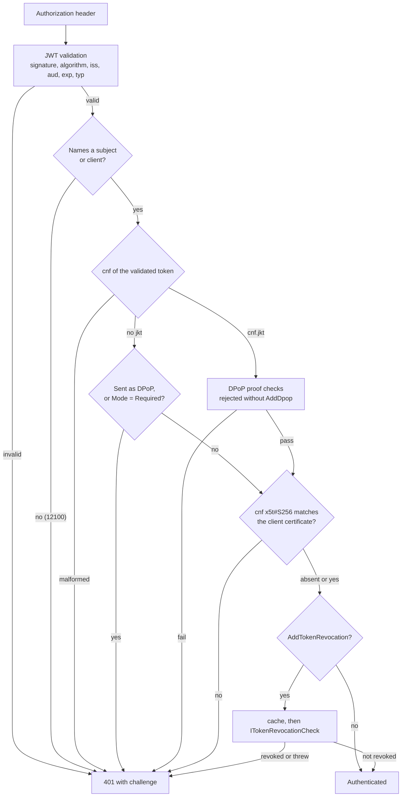

# SharedKernel.Security.Oidc

[](https://dotnet.microsoft.com/)
[](https://github.com/Gresta-Vertex-Labs/platform-shared-kernel/blob/main/LICENSE)


> **JWT bearer authentication for access tokens from any OpenID Connect provider — validation rules pinned,
> sender-constrained tokens enforced, and the caller exposed as `IUserContext`.**

| You get | So that |
| --- | --- |
| `AddOidcAuthentication(configuration)` | One call wires the `Bearer` scheme from `SharedKernel:Security:Oidc`, validated at startup |
| Pinned validation (issuer, audience, lifetime, signature, asymmetric algorithms only) | A later `Configure`/`PostConfigure` cannot quietly weaken token validation — the host refuses to start |
| Claim names as issued, mapped by configuration | `sub` stays `sub`; Entra ID, Auth0, Keycloak, Okta differ only in settings |
| `.AddDpop<TReplayCache>()` | DPoP-bound tokens (RFC 9449) with replay protection and optional server nonces |
| Certificate-bound tokens (RFC 8705), always on | A stolen `cnf.x5t#S256` token is useless without the client certificate |
| `.AddTokenRevocation<TCheck>()` (+ cache) | Revoked tokens rejected before they expire; a failing check fails closed |
| `IUserContext` with `ActorKind.User` or `ActorKind.Service` | Client-credentials tokens are told apart from people |

## Contents

- [Install](#install)
- [Quick start](#quick-start)
- [How it works](#how-it-works)
- [Recipes](#recipes)
- [Configuration](#configuration)
- [Reference](#reference)
- [Testing](#testing)
- [Pitfalls](#pitfalls)
- [Design decisions](#design-decisions)

## Install

```xml
<PackageReference Include="SharedKernel.Security.Oidc" />
```

The version comes from your central `SharedKernelVersion` property — every SharedKernel package ships at the same
version. See [Using the packages](https://github.com/Gresta-Vertex-Labs/platform-shared-kernel#using-the-packages).

| Requirement | Value |
| --- | --- |
| Target framework | `net10.0` |
| Tier | Host — reference it from your **Api** / **Worker** project |
| Depends on | `SharedKernel.Security.Abstractions`, `SharedKernel.Configuration`, `Microsoft.AspNetCore.Authentication.JwtBearer` |
| Namespaces | `SharedKernel.Security.Oidc`, `.Extensions`, `.Options`, `.Dpop`, `.Revocation` |

## Quick start

```json
{
  "SharedKernel": {
    "Security": {
      "Oidc": {
        "Authority": "https://login.microsoftonline.com/<tenant-id>/v2.0",
        "Audiences": [ "api://orders" ]
      }
    }
  }
}
```

```csharp
using SharedKernel.Security.Abstractions;
using SharedKernel.Security.Oidc.Extensions;

builder.Services.AddOidcAuthentication(builder.Configuration); // SharedKernel:Security:Oidc
builder.Services.AddAuthorization();

var app = builder.Build();
app.UseAuthentication();
app.UseAuthorization();

app.MapGet("/me", (IUserContext user) => new { user.ActorKind, user.SubjectId, user.TenantId, user.Permissions })
    .RequireAuthorization();
```

```csharp
using SharedKernel.Execution.Context;
using SharedKernel.Security.Abstractions;

public sealed class OrderApprovals(IUserContext user)
{
    public bool CanApprove() =>
        user.ActorKind == ActorKind.User && user.HasPermission("orders.approve"); // ordinal: scopes are case-sensitive
}
```

A missing `Authority`, an `HS256` in `ValidAlgorithms` or an out-of-range clock skew stops startup with an
`OptionsValidationException` listing every problem.

## How it works

The package replaces the `Bearer` scheme's handler with one that runs ASP.NET Core's JWT validation first, then its own
checks — on the **validated token**, not the principal an application event may rebuild.



- **Pinned settings.** `Configure` copies your settings into `JwtBearerOptions` (so a later `Configure` can still add an
  `IssuerValidator`). `PostConfigure` then pins `MapInboundClaims = false`, `UseSecurityTokenValidators = false`,
  `ValidateIssuer`, `ValidateAudience`, `ValidateLifetime`, `RequireExpirationTime`, `RequireSignedTokens` and the
  algorithm allow-list; a validator running after every `PostConfigure` fails startup if any was weakened again (or a
  `SignatureValidator` was set).
- **Discovery is lazy.** Signing keys and the issuer come from `{Authority}/.well-known/openid-configuration` on the first
  request, not at startup.
- **`IUserContext` is mapped on first use** in the request by the OIDC `IUserContextMapper`, from the claim types in
  `Claims`. A token is `ActorKind.Service` when a claim matches `ApplicationTokenClaims`, when the subject equals the
  client id, or when there is a client id but no subject.
- **Sender constraints are always enforced.** A `cnf.jkt` token needs `Authorization: DPoP` and a valid proof (without
  `AddDpop` it is rejected); an unbound token sent as `DPoP` is rejected; `Dpop:Mode = Required` rejects unbound
  tokens. A `cnf.x5t#S256` token needs the same client certificate on the connection, compared in fixed time.
- **Fail closed.** A throwing replay cache or revocation check rejects the request. A failing revocation *cache* is
  logged (12106) and bypassed; the check still runs.
- **Configured lists replace defaults.** Binding appends to a non-empty list, so every collection option starts empty
  and the documented defaults apply only while it stays empty. `Claims:PermissionClaimTypes = ["permissions"]` stops
  reading `scope` and `scp`.

### DPoP proof checks

| Check | Rule |
| --- | --- |
| Header | Exactly one `DPoP` header; `typ` `dpop+jwt` (case-insensitive); `alg` in `Dpop:ValidAlgorithms` |
| `jwk` | Embedded public key only (no private members); EC, or RSA of at least 2048 bits |
| `htm`, `htu` | Request method; scheme, host, path base and path (query and fragment ignored) |
| `iat` | Within `ProofLifetime` and `ClockSkew` of now |
| `jti` | Present, at most 256 characters |
| Binding | RFC 7638 thumbprint of `jwk` equals `cnf.jkt`; `ath` equals the access token's SHA-256, compared in fixed time |
| `nonce` | When `RequireNonce`: issued by this service (Data Protection) and not expired |
| Replay | `IDpopReplayCache.TryAddAsync(Base64url(SHA-256("{jkt}.{jti}")), …)` must return `true` |

## Recipes

### 1. Configure your provider

| Provider | Settings under `SharedKernel:Security:Oidc` |
| --- | --- |
| Microsoft Entra ID | `Authority` `https://login.microsoftonline.com/<tenant-id>/v2.0`; `Claims:SubjectClaimType` `oid`, `Claims:TenantClaimType` `tid`. Set `accessTokenAcceptedVersion: 2` or add the v1 issuer `https://sts.windows.net/<tenant-id>/` to `ValidIssuers`. Add the `idtyp` optional claim so app-only tokens map as `Service` |
| Entra External ID | `Authority` `https://<subdomain>.ciamlogin.com/<tenant-id>/v2.0`; `oid`/`tid` as above |
| Azure AD B2C | `Authority` `https://<name>.b2clogin.com/<name>.onmicrosoft.com/<policy>/v2.0/` (one policy per registration); `Claims:EmailClaimType` `emails`; tenant and roles only as custom claims |
| Keycloak | `Authority` `https://keycloak.example.com/realms/<realm>`; an Audience mapper; a flat `roles` claim (the default `realm_access.roles` is nested); `ApplicationTokenClaims` e.g. `{ "token_kind": "service" }` from a hardcoded mapper |
| Auth0 | `Authority` `https://<tenant>.eu.auth0.com/`; `Claims:PermissionClaimTypes` `["permissions", "scope"]`; namespaced `RoleClaimType`/`TenantClaimType`. Client-credentials tokens carry `gty=client-credentials` (a default) |

A claim type containing `:` works as a value but not as an `ApplicationTokenClaims` key in JSON (`:` separates
sections). Set it in code:

```csharp
using SharedKernel.Security.Oidc.Options;

builder.Services.Configure<OidcAuthenticationOptions>(o =>
    o.Claims.ApplicationTokenClaims["https://example.com/kind"] = "service");
```

**Multi-tenant Entra ID** (`.../organizations/v2.0`) has an issuer template no token matches. Validate the issuer in a
`Configure` registered **after** `AddOidcAuthentication` (whose own `Configure` replaces `TokenValidationParameters`):

```csharp
using Microsoft.AspNetCore.Authentication.JwtBearer;
using Microsoft.IdentityModel.JsonWebTokens;
using Microsoft.IdentityModel.Tokens;
using SharedKernel.Security.Oidc;

builder.Services.Configure<JwtBearerOptions>(OidcAuthenticationDefaults.AuthenticationScheme, options =>
    options.TokenValidationParameters.IssuerValidator = (issuer, token, _) =>
        token is JsonWebToken jwt
        && jwt.TryGetPayloadValue("tid", out string? tid) && tid is not null
        && allowedTenants.Contains(tid)
        && issuer == $"https://login.microsoftonline.com/{tid}/v2.0"
            ? issuer
            : throw new SecurityTokenInvalidIssuerException("The token was not issued by an allowed tenant."));
```

### 2. Accept DPoP-bound tokens

The replay cache is yours: shared by every replica, one atomic insert (Redis `SET NX PX`, or a unique key).

```csharp
using SharedKernel.Primitives.Clocks;
using SharedKernel.Security.Oidc.Dpop;
using StackExchange.Redis;

public sealed class RedisDpopReplayCache(IConnectionMultiplexer redis, IClock clock) : IDpopReplayCache
{
    public async ValueTask<bool> TryAddAsync(string proofId, DateTimeOffset expiresAt, CancellationToken cancellationToken)
    {
        TimeSpan ttl = expiresAt - clock.UtcNow;
        if (ttl < TimeSpan.FromSeconds(1)) ttl = TimeSpan.FromSeconds(1);

        // false = already used; a connection failure throws and the request is rejected.
        return await redis.GetDatabase().StringSetAsync($"dpop:{proofId}", 1, ttl, When.NotExists);
    }
}
```

```csharp
builder.Services.AddOidcAuthentication(builder.Configuration)
    .AddDpop<RedisDpopReplayCache>();
```

With `Dpop:Mode` `Allowed` (default), bound tokens need a proof and plain bearer tokens keep working; every 401 also
carries `WWW-Authenticate: DPoP algs="ES256 PS256 RS256"`. To require DPoP on some endpoints only, check
`IUserContext.IsSenderConstrained`. Behind a reverse proxy, run `UseForwardedHeaders()` (proto and host, known proxies)
before `UseAuthentication()`, or every proof fails with `UriMismatch`.

### 3. Require DPoP with server nonces

```json
{
  "SharedKernel": {
    "Security": {
      "Oidc": {
        "Authority": "https://idp.example.com",
        "Audiences": [ "api://payments" ],
        "Dpop": { "Mode": "Required", "RequireNonce": true, "ProofLifetime": "00:00:30" }
      }
    }
  }
}
```

The first request gets a 401 with a `DPoP-Nonce` header; the client retries with it. Nonces are protected with ASP.NET
Core Data Protection, so every replica needs one shared key ring (`AddDataProtection().SetApplicationName(...)
.PersistKeysTo…`). `Mode: Required` or `RequireNonce: true` without `.AddDpop<…>()` fails startup.

### 4. Accept certificate-bound tokens behind a TLS-terminating proxy

The `cnf.x5t#S256` check reads `HttpContext.Connection`'s client certificate; no registration turns it on or off. When
TLS ends at an ingress, restore the forwarded certificate with
[`SharedKernel.ServiceDefaults.Security.Mtls`](https://github.com/Gresta-Vertex-Labs/platform-shared-kernel/blob/main/13.ServiceDefaults/SharedKernel.ServiceDefaults.Security.Mtls/README.md):

```csharp
using System.Net;
using SharedKernel.Security.Mtls.Validation;
using SharedKernel.ServiceDefaults.Security;

builder.Services.AddScoped<IMtlsCertificateValidator, ForwardedCertificateValidator>(); // accepts current certificates
builder.AddMtlsForwardedHeaderCertificate(o =>
{
    o.HeaderName = "ssl-client-cert";
    o.AddTrustedNetwork(IPNetwork.Parse("10.0.0.0/16")); // only the ingress may set it
});
builder.Services.AddOidcAuthentication(builder.Configuration);

var app = builder.Build();
app.UseMiddleware<MtlsForwardedHeaderMiddleware>();   // before UseAuthentication
app.UseAuthentication();
app.UseAuthorization();
```

With TLS at Kestrel, use `builder.AddMtlsClientCertificate()` instead. A token bound to a DPoP key and a certificate
needs both.

### 5. Reject revoked tokens

Register a check (for example an RFC 7662 introspection call) and, optionally, a cache keyed by token hash.

```csharp
using Microsoft.Extensions.Caching.Distributed;
using SharedKernel.Security.Oidc.Revocation;

public sealed class RevokedSessionCheck(IRevokedSessionStore sessions) : ITokenRevocationCheck
{
    // An exception rejects the request.
    public ValueTask<bool> IsRevokedAsync(TokenRevocationRequest request, CancellationToken cancellationToken) =>
        sessions.IsRevokedAsync(request.SessionId, request.TokenId, cancellationToken);
}

public sealed class DistributedTokenRevocationCache(IDistributedCache cache) : ITokenRevocationCache
{
    public async ValueTask<bool?> GetAsync(string tokenHash, CancellationToken cancellationToken) =>
        await cache.GetStringAsync($"token-revocation:{tokenHash}", cancellationToken) switch
        {
            "1" => true,
            "0" => false,
            _ => null,
        };

    public async ValueTask SetAsync(string tokenHash, bool isRevoked, DateTimeOffset expiresAt, CancellationToken cancellationToken) =>
        await cache.SetStringAsync($"token-revocation:{tokenHash}", isRevoked ? "1" : "0",
            new DistributedCacheEntryOptions { AbsoluteExpiration = expiresAt }, cancellationToken);
}
```

```csharp
builder.Services.AddOidcAuthentication(builder.Configuration)
    .AddTokenRevocation<RevokedSessionCheck>()
    .AddTokenRevocationCache<DistributedTokenRevocationCache>();
```

| Answer | Cached until |
| --- | --- |
| Revoked | The token expires |
| Not revoked | `Revocation:NotRevokedCacheDuration` (default 30 s, max 5 min), never past expiry |
| Cache read or write throws | Event 12106; the check's answer is used |
| Check throws | Request rejected; event 12103 with `CheckAvailable = false` |

For introspection, `TokenRevocationRequest.Token` is the encoded token — a live credential; never log or store it.

### 6. Authorize endpoints

Authentication only establishes who is calling. `SharedKernel.Presentation.Core`'s conventions check what the caller
holds, through `IUserContext`:

```csharp
using SharedKernel.Presentation.Authorization;
using SharedKernel.Presentation.WebApi;

builder.Services.AddOidcAuthentication(builder.Configuration);
builder.AddSharedKernelWebApi();

var app = builder.Build();
app.UseSharedKernelWebApi();   // authentication and authorization included

app.MapPost("/orders/{id:guid}/approve", (Guid id) => Results.NoContent())
    .RequireRole("approver")
    .RequireAuthenticationMethod("mfa", "otp")        // amr; otherwise 401 step-up
    .RequireFreshAuthentication(maxAgeSeconds: 300);  // auth_time; otherwise 401 step-up
```

Anonymous → 401 `unauthorized.default`; missing role or permission → 403 `forbidden.insufficient_permission`; step-up →
401 `unauthorized.step_up_required` with an RFC 9470 challenge. On commands, prefer `[RequirePermission]`.

## Configuration

Section `SharedKernel:Security:Oidc` (`OidcAuthenticationOptions.SectionName`), validated when the host starts.

| Key | Type | Default | Meaning |
| --- | --- | --- | --- |
| `SharedKernel:Security:Oidc:Authority` | `string` | — (required) | Absolute `http`/`https` URL; `https` unless `RequireHttpsMetadata` is `false` |
| `SharedKernel:Security:Oidc:Audiences` | `string[]` | — (at least one) | Accepted audiences |
| `SharedKernel:Security:Oidc:ValidIssuers` | `string[]` | empty: the discovery issuer | Accepted issuers |
| `SharedKernel:Security:Oidc:RequireHttpsMetadata` | `bool` | `true` | `false` for a local provider only |
| `SharedKernel:Security:Oidc:ValidAlgorithms` | `string[]` | empty: `RS256`, `PS256`, `ES256` | Each one of RS/PS/ES 256–512 |
| `SharedKernel:Security:Oidc:ValidTokenTypes` | `string[]` | empty: any `typ` | e.g. `at+jwt` (RFC 9068) |
| `SharedKernel:Security:Oidc:ClockSkew` | `TimeSpan` | `00:00:30` | 0 to 5 minutes |
| `…:Claims:SubjectClaimType` | `string` | `sub` | `SubjectId` |
| `…:Claims:NameClaimType` | `string` | `name` | `Name`, `User.Identity.Name` |
| `…:Claims:EmailClaimType` | `string` | `email` | `Email` |
| `…:Claims:RoleClaimType` | `string` | `roles` | `Roles`, `User.IsInRole` |
| `…:Claims:PermissionClaimTypes` | `string[]` | empty: `scope`, `scp` | `Permissions` (values split on spaces) |
| `…:Claims:ClientIdClaimTypes` | `string[]` | empty: `azp`, `client_id`, `appid` | `ClientId` (first match) |
| `…:Claims:TenantClaimType` | `string` | `tenant_id` | `TenantId`, when a non-empty GUID |
| `…:Claims:SessionIdClaimTypes` | `string[]` | empty: `sid`, `jti`, `uti` | `SessionId` (first match) |
| `…:Claims:AuthenticationMethodClaimType` | `string` | `amr` | `AuthenticationMethods` |
| `…:Claims:AuthContextClassReferenceClaimType` | `string` | `acr` | `AuthContextClassReference` |
| `…:Claims:AuthTimeClaimType` | `string` | `auth_time` | `AuthTime` (Unix seconds) |
| `…:Claims:ApplicationTokenClaims` | `map<string,string>` | empty: `idtyp=app`, `gty=client-credentials` | A type/value match → `ActorKind.Service` |
| `…:Dpop:Mode` | `DpopMode` | `Allowed` | `Required` rejects unbound tokens; needs `AddDpop` |
| `…:Dpop:ValidAlgorithms` | `string[]` | empty: `ES256`, `PS256`, `RS256` | Proof algorithms, same allow-list |
| `…:Dpop:ProofLifetime` | `TimeSpan` | `00:01:00` | 1 second to 5 minutes |
| `…:Dpop:ClockSkew` | `TimeSpan` | `00:00:05` | 0 to 1 minute |
| `…:Dpop:RequireNonce` | `bool` | `false` | Server nonces; needs `AddDpop` |
| `…:Dpop:NonceLifetime` | `TimeSpan` | `00:05:00` | 1 minute to 1 hour |
| `…:Revocation:NotRevokedCacheDuration` | `TimeSpan` | `00:00:30` | 0 to 5 minutes; the longest a revoked token keeps working |

`…` is `SharedKernel:Security:Oidc`. Single claim types must not be empty; lists and the dictionary must not contain
empty entries.

## Reference

### Registration

| Method | Registers |
| --- | --- |
| `AddOidcAuthentication(IServiceCollection, IConfiguration)` | Default scheme `Bearer` with this package's handler; options; `IUserContextMapper` (singleton, enumerable); `IUserContext` (scoped, `TryAdd`); `IClock` (`TryAdd`); `IHttpContextAccessor`. Returns `OidcAuthenticationBuilder` |
| `.AddDpop<TReplayCache>()` | `IDpopReplayCache` (scoped, `TryAdd`), proof validator, nonce service, Data Protection |
| `.AddTokenRevocation<TCheck>()` | `ITokenRevocationCheck` (scoped, `TryAdd`) and the enforcer |
| `.AddTokenRevocationCache<TCache>()` | `ITokenRevocationCache` (scoped, `TryAdd`); no effect without a check |

An `IUserContext` registered earlier (such as `SystemUserContext` in a worker) is kept; an
`AnonymousUserContext.Instance` placeholder is removed. `AddOidcAuthentication` binds configuration by reflection and is
marked `[RequiresUnreferencedCode]`/`[RequiresDynamicCode]`.

### Extension points

| Interface | Contract |
| --- | --- |
| `IDpopReplayCache.TryAddAsync(proofId, expiresAt, ct)` | Atomic; `true` when recorded now, `false` when already present; throw when unavailable |
| `ITokenRevocationCheck.IsRevokedAsync(TokenRevocationRequest, ct)` | `true` rejects; an exception rejects |
| `ITokenRevocationCache.GetAsync(tokenHash, ct)` / `SetAsync(tokenHash, isRevoked, expiresAt, ct)` | `true`/`false`/`null` (not cached); expire at `expiresAt` |

`TokenRevocationRequest`: `Token`, `TokenHash` (Base64url SHA-256), `TokenId` (`jti`), `SubjectId`, `ClientId`,
`SessionId`, `ExpiresAt`; `ToString()` omits the token.

### Constants and challenges

| Constant | Value |
| --- | --- |
| `OidcAuthenticationDefaults.AuthenticationScheme` | `Bearer` |
| `OidcAuthenticationDefaults.DpopScheme` | `DPoP` |
| `OidcAuthenticationDefaults.DpopNonceHeader` | `DPoP-Nonce` |

After `AddDpop`, a 401 also carries `WWW-Authenticate: DPoP algs="…"[, error="…"]` — `invalid_dpop_proof`,
`use_dpop_nonce` (with a `DPoP-Nonce` header) or `invalid_token`.

### Logging

All events are `Warning`; none contains a token, proof, claim value or certificate.

| Event id | Event |
| --- | --- |
| 12100 | An authenticated token carries neither a subject nor a client id (authentication fails) |
| 12101 | The tenant claim `{TenantClaimType}` is not a GUID; the caller has no tenant |
| 12102 | DPoP validation failed (`{Reason}`) |
| 12103 | Access token rejected by the revocation check (`{CheckAvailable}`) |
| 12104 | Signing algorithm `{Algorithm}` is not allowed (read from the rejected token's header) |
| 12105 | Certificate-bound access token rejected (`{Reason}`: `CertificateMissing`, `CertificateMismatch`) |
| 12106 | The revocation cache failed; the check is called directly |

12102 reasons: `MalformedConfirmation`, `DpopNotEnabled`, `BoundTokenPresentedAsBearer`, `UnboundTokenPresentedAsDpop`,
`DpopRequired`, `MissingProof`, `MultipleProofs`, `MalformedProof`, `AlgorithmNotAllowed`, `InvalidType`, `MissingKey`,
`MalformedKey`, `PrivateKeyInProof`, `WeakKey`, `UnsupportedKeyType`, `InvalidSignature`, `MethodMismatch`,
`UriMismatch`, `MissingIssuedAt`, `Expired`, `InvalidJti`, `KeyMismatch`, `AccessTokenHashMismatch`, `NonceInvalid`,
`ReplayCacheUnavailable`, `Replayed`.

## Testing

Sign tokens with a key created in the test and hand the handler that key instead of the discovery document — the real
handler, pinned rules and claim mapping all run, with no network:

```csharp
using System.Security.Cryptography;
using Microsoft.AspNetCore.Authentication.JwtBearer;
using Microsoft.IdentityModel.JsonWebTokens;
using Microsoft.IdentityModel.Protocols;
using Microsoft.IdentityModel.Protocols.OpenIdConnect;
using Microsoft.IdentityModel.Tokens;
using SharedKernel.Security.Oidc;

var key = new RsaSecurityKey(RSA.Create(2048)) { KeyId = "test-key" };
var metadata = new OpenIdConnectConfiguration { Issuer = "https://issuer.test" };
metadata.SigningKeys.Add(key);

// In WebApplicationFactory.ConfigureWebHost: UseSetting Authority and Audiences:0, then
services.PostConfigure<JwtBearerOptions>(OidcAuthenticationDefaults.AuthenticationScheme, o =>
{
    o.Configuration = metadata;
    o.ConfigurationManager = new StaticConfigurationManager<OpenIdConnectConfiguration>(metadata);
});

string token = new JsonWebTokenHandler().CreateToken(new SecurityTokenDescriptor
{
    Issuer = "https://issuer.test",
    Audience = "api://orders",
    Claims = new Dictionary<string, object> { ["sub"] = "user-42", ["scope"] = "orders.read" },
    Expires = DateTime.UtcNow.AddMinutes(5),
    SigningCredentials = new SigningCredentials(key, SecurityAlgorithms.RsaSha256),
});
```

Replacing only the metadata source is fine; changing a pinned setting in that `PostConfigure` stops the host.
[`SharedKernel.Security.Testing`](https://github.com/Gresta-Vertex-Labs/platform-shared-kernel/blob/main/16.Testing/SharedKernel.Security.Testing/README.md)
(namespace `SharedKernel.Testing.Security`) adds `DpopTestProofBuilder` (valid and deliberately broken proofs),
`InMemoryDpopReplayCache` (single process only), `MtlsTestCertificateBuilder` for certificate-bound tokens, and
`FakeUserContext`/`SecurityTestContextBuilder` for code that only reads the caller.

## Pitfalls

| Don't | Do | Why |
| --- | --- | --- |
| `Configure<JwtBearerOptions>("Bearer", …)` before `AddOidcAuthentication` | Register it after | The package's `Configure` replaces `TokenValidationParameters` |
| Relax validation in `PostConfigure<JwtBearerOptions>` | Change configuration, or adjust unpinned settings in `Configure` | Weakening a pinned setting stops the host |
| List only the extra algorithm (`["RS384"]`) or claim type | List the full set you accept | A configured list replaces its default |
| Rely on `UseAuthentication` alone | Add `RequireAuthorization()` and role or permission checks | Anonymous requests pass authentication |
| Resolve `IUserContext` in middleware before `UseAuthentication` | Resolve it after | It is scoped and mapped once; it would stay anonymous |
| A check-then-insert or per-instance replay cache | One atomic operation in shared storage | Concurrent or cross-replica replays would be accepted |
| Catch store errors in the replay cache or revocation check | Let them throw | The package fails closed; a swallowed error accepts a replay or revoked token |
| `RequireNonce` without a shared Data Protection key ring | Persist keys with one application name | A nonce from one replica fails on another |
| DPoP behind a proxy without forwarded headers | `UseForwardedHeaders` before authentication | `htu` names the public URL (`UriMismatch`) |
| Log `TokenRevocationRequest.Token` | Log `TokenHash` | The token is a live credential |
| Issue a non-GUID tenant claim | Issue a GUID | Non-GUID values give no tenant (12101) |
| `RequireHttpsMetadata = false` outside development | Keep `true` | Signing keys could be substituted |
| Forward client certificates without trusted networks | Restrict the header to the ingress | Any direct path could forge the certificate |

## Design decisions

**Why generic OIDC and no Microsoft.Identity.Web?** `Authority` covers Entra ID, B2C and External ID; the provider SDK
added nothing the configuration cannot express and dragged in extra dependencies.

**Why are the checks in the handler, not in `JwtBearerEvents`?** An application event can rebuild the principal or call
`Success()`; checks on the captured validated token after `base.HandleAuthenticateAsync()` cannot be skipped.

**Why is the RFC 8705 check here and not in the mTLS package?** Certificate binding is a property of the token being
validated, and it keeps the mTLS package free of token concerns.

**Why DPoP nonces through Data Protection?** Services already share a key ring; there is no second secret to manage.

**Why one issuer per scheme?** Not requested so far. A service that needs several issuers registers another JWT bearer
scheme with its own `IUserContextMapper`.

**Limits.** A signed tenant claim proves the issuer asserted it, not that the subject belongs to the tenant. With
`Mode = Allowed`, an unbound bearer token works for whoever holds it until it expires or is revoked. Settings outside the
pinned list (`IssuerValidator`, `IssuerSigningKeyResolver`, the metadata source) remain yours to review.

---

Part of [Platform.SharedKernel](https://github.com/Gresta-Vertex-Labs/platform-shared-kernel) ·
[Security domain](https://github.com/Gresta-Vertex-Labs/platform-shared-kernel/blob/main/12.Security/README.md) ·
[MIT license](https://github.com/Gresta-Vertex-Labs/platform-shared-kernel/blob/main/LICENSE)
