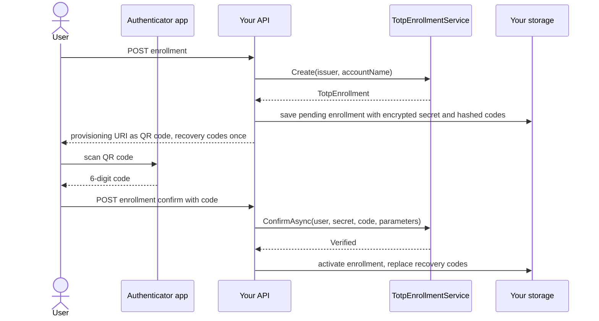
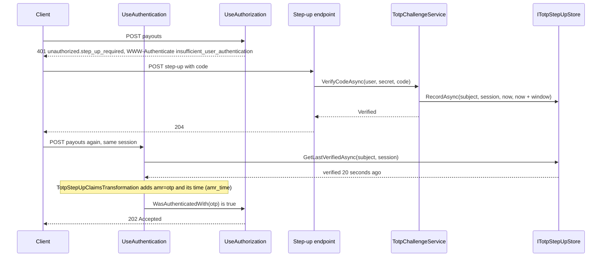
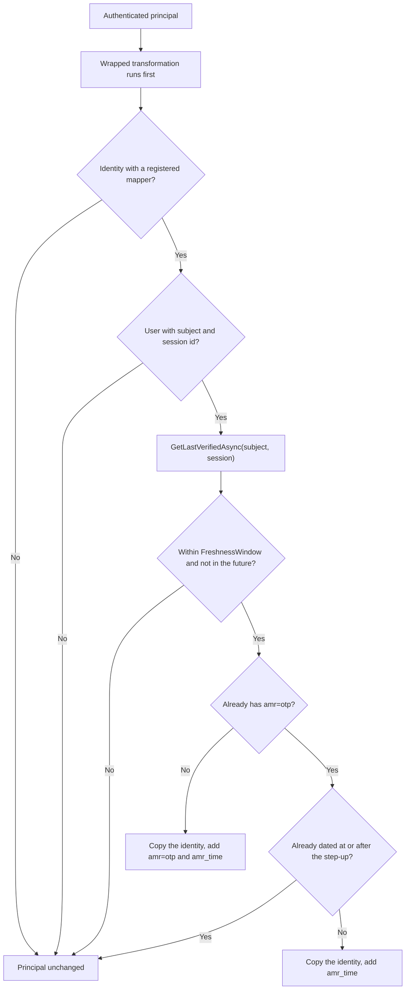
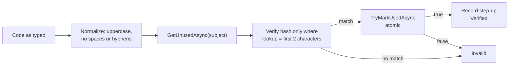

# SharedKernel.Security.Totp

[](https://dotnet.microsoft.com/)
[](https://github.com/Gresta-Vertex-Labs/platform-shared-kernel/blob/main/LICENSE)


> **Authenticator-app second factor and step-up authentication for ASP.NET Core: enroll with a confirmed code,
> challenge before sensitive actions, and mark only the session that answered as stepped up.**

A sign-in that happened an hour ago is weak proof that the person moving money now is the account owner. Step-up
authentication asks for a second factor right before a sensitive action and trusts it for a few minutes. The details
decide whether it helps: a code must not be accepted twice, guesses must be limited, recovery codes must not sit in
the database in clear, and a code entered on one device must not unlock a stolen token used somewhere else. This
package handles those details on top of
[`SharedKernel.Cryptography`](https://github.com/Gresta-Vertex-Labs/platform-shared-kernel/tree/main/01.Core/SharedKernel.Cryptography)'s
RFC 6238 primitives, and exposes the result as `amr=otp` on the caller's identity, so
`IUserContext.WasAuthenticatedWith("otp")` and `[RequireAuthenticationMethod("otp")]` just work.

| 📲 Enroll | ⬆️ Step up | 🧾 Recovery codes | 🔒 Session-bound |
| --- | --- | --- | --- |
| Secret, `otpauth://` URI and recovery codes in one call | `amr=otp` on the identity for a configurable window | Hashed with `IOneWayHasher`, never stored in clear | Keyed by subject **and** session, never the whole user |
| Activated only after the first code is confirmed | Works with `[RequireAuthenticationMethod("otp")]` | Single use through an atomic store update | Replay protection across all of the user's sessions |
| `ToString()` omits the secret and codes | Wraps the claims transformation you already have | Prefix lookup, so only matching hashes are checked | Service principals and anonymous callers are refused |

## Contents

- [Install](#install)
- [Quick start](#quick-start)
- [Which type do I need?](#which-type-do-i-need)
- [How it works](#how-it-works)
- [Recipes](#recipes)
- [Reference](#reference)
- [Security model](#security-model)
- [Pitfalls](#pitfalls)
- [AI quick reference](#ai-quick-reference)
- [Compatibility and guarantees](#compatibility-and-guarantees)

## Install

```shell
dotnet add package SharedKernel.Security.Totp
```

| Requirement | Value |
| --- | --- |
| Target framework | `net10.0` |
| Tier | Host (references ASP.NET Core; reference it from the host project only) |
| Dependencies | [`SharedKernel.Security.Abstractions`](https://github.com/Gresta-Vertex-Labs/platform-shared-kernel/tree/main/12.Security/SharedKernel.Security.Abstractions), [`SharedKernel.Cryptography`](https://github.com/Gresta-Vertex-Labs/platform-shared-kernel/tree/main/01.Core/SharedKernel.Cryptography), the ASP.NET Core shared framework (`Microsoft.AspNetCore.App`) |
| Namespace | `SharedKernel.Security.Totp` |
| Registration | `AddSharedKernelCryptography(configuration).AddTotpStepUp<TStepUpStore, TRecoveryCodeStore>()` |
| You provide | `ITotpStepUpStore`, `IRecoveryCodeStore`, `ITotpReplayGuard`, an authentication package that registers an `IUserContextMapper`; an `ITotpAttemptThrottle` is strongly recommended |

| Companion package | Adds |
| --- | --- |
| [`SharedKernel.Security.Oidc`](https://github.com/Gresta-Vertex-Labs/platform-shared-kernel/tree/main/12.Security/SharedKernel.Security.Oidc) | JWT bearer authentication; supplies the user's subject id, session id and `amr` claims |
| [`SharedKernel.Presentation.WebApi`](https://github.com/Gresta-Vertex-Labs/platform-shared-kernel/tree/main/14.Presentation/SharedKernel.Presentation.WebApi) | `[RequireAuthenticationMethod]` (from `SharedKernel.Presentation.Core`, namespace `SharedKernel.Presentation.Authorization`) and `.RequireAuthenticationMethod(…)`, native ASP.NET Core authorization policies once `AddSharedKernelWebApi()`/`UseSharedKernelWebApi()` are in place; they also work on SignalR hub methods and gRPC methods |
| [`SharedKernel.Cryptography.Argon2`](https://github.com/Gresta-Vertex-Labs/platform-shared-kernel/tree/main/01.Core/SharedKernel.Cryptography.Argon2) | Argon2id as the hash algorithm for recovery codes |

## Quick start

**1. Register** authentication, the stores and the step-up services.

```csharp
// Program.cs
using SharedKernel.Cryptography.Extensions;
using SharedKernel.Cryptography.Totp;
using SharedKernel.Presentation.WebApi;
using SharedKernel.Security.Abstractions;
using SharedKernel.Security.Oidc.Extensions;
using SharedKernel.Security.Totp;

builder.Services.AddOidcAuthentication(builder.Configuration);            // IUserContext with a session id
builder.AddSharedKernelWebApi();                                          // error responses and [RequireAuthenticationMethod]

builder.Services.AddSingleton<ITotpReplayGuard, RedisTotpReplayGuard>();      // shared by every replica
builder.Services.AddSingleton<ITotpAttemptThrottle, RedisTotpAttemptThrottle>();
builder.Services.AddSingleton<ITotpSecretSource, MyTotpSecretSource>();       // your code, see step 2

builder.Services.AddSharedKernelCryptography(builder.Configuration)
    .AddTotpStepUp<RedisTotpStepUpStore, PostgresRecoveryCodeStore>(options =>
        options.FreshnessWindow = TimeSpan.FromMinutes(10));

var app = builder.Build();

app.UseSharedKernelWebApi(); // authentication (runs the step-up claims transformation), then authorization
```

The store, replay guard and throttle types are yours; [recipe 5](#5-implement-the-stores) and
[recipe 6](#6-throttle-attempts) have Redis and PostgreSQL implementations.

**2. Verify a code** and record the step-up for the caller's session. The enrolled secret comes from your storage;
[recipe 1](#1-enroll-an-authenticator-app) and [recipe 2](#2-encrypt-the-stored-secret) show how it gets there.

```csharp
using SharedKernel.Cryptography.Totp;

/// <summary>Your code: returns the user's decrypted secret and its parameters, or null when not enrolled.</summary>
public interface ITotpSecretSource
{
    ValueTask<(byte[] Secret, TotpParameters Parameters)?> FindAsync(string subjectId, CancellationToken ct);
}

public sealed record TotpCodeRequest(string Code);
```

```csharp
// Program.cs
RouteGroupBuilder api = app.MapGroup("/api").RequireAuthorization();

api.MapPost("/step-up/totp", async (
    TotpCodeRequest request, IUserContext user, ITotpSecretSource secrets, TotpChallengeService challenges,
    CancellationToken ct) =>
{
    if (user.SubjectId is null || await secrets.FindAsync(user.SubjectId, ct) is not { } enrollment)
    {
        return Results.NotFound();
    }

    TotpChallengeResult result = await challenges.VerifyCodeAsync(
        user, enrollment.Secret, request.Code, enrollment.Parameters, ct);

    return result == TotpChallengeResult.Verified ? Results.NoContent() : Results.BadRequest(result.ToString());
});
```

**3. Gate the sensitive endpoint.** Requests from this session carry `amr=otp` for the next ten minutes; other
sessions of the same user do not.

```csharp
api.MapPost("/payouts", () => Results.Accepted())
    .RequireAuthenticationMethod("otp"); // 401 unauthorized.step_up_required until this session steps up
```

> [!IMPORTANT]
> Gate with `RequireAuthenticationMethod("otp")`, not `RequireFreshAuthentication`. The step-up adds an
> authentication method; it never changes `AuthTime`, which is when the identity provider signed the user in.

## Which type do I need?

| I need to… | Use | Recipe |
| --- | --- | --- |
| Let a user add an authenticator app | `TotpEnrollmentService.Create`, then `ConfirmAsync` | [Enroll](#1-enroll-an-authenticator-app) |
| Keep the TOTP secret safe in the database | `ISymmetricEncryptionService` from `SharedKernel.Cryptography` | [Encrypt the secret](#2-encrypt-the-stored-secret) |
| Ask for a code before a sensitive action | `TotpChallengeService.VerifyCodeAsync` + `[RequireAuthenticationMethod("otp", MaxAgeSeconds = 300)]` | [Step-up gate](#3-gate-an-endpoint-on-a-fresh-otp-step-up) |
| Let a user without their phone finish the second factor | `TotpChallengeService.RedeemRecoveryCodeAsync` | [Recovery codes](#4-complete-a-step-up-with-a-recovery-code) |
| Persist step-ups, recovery codes and used time steps | `ITotpStepUpStore`, `IRecoveryCodeStore`, `ITotpReplayGuard` | [Stores](#5-implement-the-stores) |
| Limit code guessing | `ITotpAttemptThrottle` | [Throttling](#6-throttle-attempts) |
| Test the flow without waiting for real time | `TotpGenerator` over a controllable `IClock` | [Testing](#7-test-with-a-controllable-clock) |
| Check in code whether this session stepped up | `IUserContext.WasAuthenticatedWith("otp")` | [Reference](#step-up-claims-transformation) |

## How it works

### Enrollment

The service creates everything in memory and stores nothing. You keep the enrollment pending, show the QR code and
recovery codes once, and activate it only after the user proves their app produces the right codes.



**Why confirmation is required.** A secret the user mistyped, scanned into the wrong app, or never scanned at all
would lock them out at the next challenge. Confirming the first code proves their app holds the same secret and a
usable clock. The accepted time step is recorded by the replay guard, so the confirmation code cannot be reused for
a step-up. `ConfirmAsync` records no step-up.

### Step-up



The claims transformation runs during authentication, so the step-up is visible from the **next** request, not in
the request that verified the code.

Next to `amr=otp` it adds the step-up's verification time, so `IUserContext.GetAuthenticationMethodTime("otp")` returns
it. That time is what ends a step-up on a SignalR connection: the connection authenticates once, when it opens, and
keeps `amr=otp` for as long as it stays open, but `[RequireAuthenticationMethod("otp", MaxAgeSeconds = 300)]` on a hub
method compares the time with the clock on every call.

### Why a step-up is bound to one session

A step-up is stored under the user's subject id **and** session id. If it applied to the whole user, a code the user
enters on their laptop would also elevate an access token stolen from their phone, or a session an attacker opened
elsewhere with a phished password. Bound to the session, an attacker holding another session must pass the second
factor themselves.

| Concern | Keyed by | Effect |
| --- | --- | --- |
| Step-up record | Subject id + session id | Elevates only the session that answered |
| Replay protection (`ITotpReplayGuard`) | Subject id | A code accepted in one session is `Replayed` in every other |
| Attempt throttling (`ITotpAttemptThrottle`) | Subject id | Guesses from all sessions share one budget |
| Recovery codes | Subject id | Redeeming a code in any session uses it up |

The session id comes from the authentication package. `SharedKernel.Security.Oidc` reads `sid`, then the token ids
`jti` and `uti` (configurable with `Claims:SessionIdClaimTypes`). When the identity provider issues no `sid`, the
session is the access token, and the step-up ends when the token is refreshed.

The transformation decides per request:



The original identity is never mutated, `AuthTime` never changes, and running the transformation twice adds the
claims once. The `amr_time` value is the step-up's verification time from the store, in whole seconds, not the time of
the request. An identity that already carries `otp` is dated by its latest `amr_time`, else by its sign-in (`AuthTime`).

### Recovery codes

Enrollment generates codes like `K7QXM-2RDPA` (10 characters from the Base32 alphabet, 50 bits). Each is stored as a
`StoredRecoveryCode`: a random id, a two-character lookup and a PHC hash from `IOneWayHasher` (PBKDF2 by default, or
Argon2id when configured). The code itself is shown once and never stored.



The lookup avoids hashing every unused code on each attempt, which would multiply the cost of a slow hash by ten. It
reveals 10 of the 50 bits; the remaining 40 stay behind the slow hash. `TryMarkUsedAsync` must check and update in
one operation, so two concurrent requests with the same code cannot both succeed.

## Recipes

Complete examples. Each one lists the `using` directives it needs beyond the ASP.NET Core defaults.

### 1. Enroll an authenticator app

The service owns the enrollment storage. A pending enrollment is replaced on every new attempt; activation makes it
the user's enrollment and replaces their recovery codes in one transaction.

```csharp
using SharedKernel.Cryptography.Totp;
using SharedKernel.Security.Totp;

/// <summary>An enrollment as your service stores it.</summary>
public sealed record TotpEnrollmentRecord(
    string EncryptedSecret,
    TotpParameters Parameters,
    IReadOnlyList<StoredRecoveryCode> RecoveryCodes);

public interface ITotpEnrollmentRepository
{
    /// <summary>Saves a pending enrollment, replacing an earlier pending one. An active enrollment stays active.</summary>
    Task SavePendingAsync(string subjectId, TotpEnrollmentRecord pending, CancellationToken ct);

    Task<TotpEnrollmentRecord?> FindPendingAsync(string subjectId, CancellationToken ct);

    Task<TotpEnrollmentRecord?> FindActiveAsync(string subjectId, CancellationToken ct);

    /// <summary>In one transaction: makes the pending enrollment active and replaces the user's recovery codes with its codes.</summary>
    Task ActivateAsync(string subjectId, CancellationToken ct);
}
```

```csharp
// Program.cs
using System.Security.Cryptography;
using SharedKernel.Presentation.WebApi;
using SharedKernel.Primitives.Errors;
using SharedKernel.Execution.Context;
using SharedKernel.Security.Abstractions;
using SharedKernel.Security.Totp;

RouteGroupBuilder enrollment = app.MapGroup("/account/authenticator").RequireAuthorization();

enrollment.MapPost("/", async (
    IUserContext user, HttpContext http, TotpEnrollmentService enrollments, TotpSecretProtector secrets,
    ITotpEnrollmentRepository repository, CancellationToken ct) =>
{
    if (user.ActorKind != ActorKind.User || user.SubjectId is not { } subjectId)
    {
        return Results.Problem(Error.Forbidden("totp.not_a_user", "Only users can enroll.").ToProblemDetails(http));
    }

    // Replacing an existing authenticator needs the current one, or a stolen session could swap it.
    if (await repository.FindActiveAsync(subjectId, ct) is not null && !user.WasAuthenticatedWith("otp"))
    {
        return Results.Problem(Error.Forbidden("totp.step_up_required", "Verify your current code first.").ToProblemDetails(http));
    }

    TotpEnrollment created = enrollments.Create(issuer: "Contoso", accountName: user.Email ?? subjectId);
    try
    {
        string encryptedSecret = await secrets.ProtectAsync(subjectId, created.Secret, ct);
        await repository.SavePendingAsync(
            subjectId, new TotpEnrollmentRecord(encryptedSecret, created.Parameters, created.StoredRecoveryCodes), ct);

        // Shown once. The client renders provisioningUri as a QR code.
        return Results.Ok(new
        {
            provisioningUri = created.ProvisioningUri.AbsoluteUri,
            manualEntryKey = created.SecretBase32,
            recoveryCodes = created.RecoveryCodes,
        });
    }
    finally
    {
        CryptographicOperations.ZeroMemory(created.Secret);
    }
});

enrollment.MapPost("/confirm", async (
    TotpCodeRequest request, IUserContext user, HttpContext http, TotpEnrollmentService enrollments,
    TotpSecretProtector secrets, ITotpEnrollmentRepository repository, CancellationToken ct) =>
{
    if (user.SubjectId is not { } subjectId
        || await repository.FindPendingAsync(subjectId, ct) is not { } pending
        || await secrets.UnprotectAsync(subjectId, pending.EncryptedSecret, ct) is not { } secret)
    {
        return Results.Problem(Error.NotFound("totp.no_pending_enrollment", "Start enrollment first.").ToProblemDetails(http));
    }

    try
    {
        TotpChallengeResult result = await enrollments.ConfirmAsync(user, secret, request.Code, pending.Parameters, ct);
        if (result != TotpChallengeResult.Verified)
        {
            return result.ToHttpResult(http);
        }

        await repository.ActivateAsync(subjectId, ct);
        return Results.NoContent();
    }
    finally
    {
        CryptographicOperations.ZeroMemory(secret);
    }
});
```

One mapping from `TotpChallengeResult` to an HTTP response, shared by recipes 1, 3 and 4:

```csharp
using SharedKernel.Presentation.WebApi;
using SharedKernel.Primitives.Errors;
using SharedKernel.Security.Totp;

public static class TotpHttpResults
{
    public static IResult ToHttpResult(this TotpChallengeResult result, HttpContext http) => result switch
    {
        TotpChallengeResult.Verified => Results.NoContent(),
        // An empty 429: UseSharedKernelWebApi() gives it the problem body, errorCode "http.429".
        TotpChallengeResult.Throttled => Results.StatusCode(StatusCodes.Status429TooManyRequests),
        TotpChallengeResult.NoSession => Problem(Error.Forbidden("totp.no_session", "A user sign-in session is required."), http),
        TotpChallengeResult.Replayed => Problem(Error.Validation("totp.replayed", "This code was already used. Wait for the next one."), http),
        _ => Problem(Error.Validation("totp.invalid", "The code is not valid."), http),
    };

    private static IResult Problem(Error error, HttpContext http) => Results.Problem(error.ToProblemDetails(http));
}
```

`Create` hashes every recovery code with the configured password hash, in parallel. With the defaults (10 codes,
PBKDF2 at 600,000 iterations) that is noticeable CPU; do not call it in a loop or without authentication.

### 2. Encrypt the stored secret

Anyone who reads a TOTP secret can generate valid codes forever, so store it encrypted. Associated data built from
the subject id means a secret copied onto another user's row fails to decrypt.

```csharp
using System.Text;
using SharedKernel.Cryptography.Symmetric;
using SharedKernel.Primitives.Results;

public sealed class TotpSecretProtector(ISymmetricEncryptionService encryption)
{
    public async Task<string> ProtectAsync(string subjectId, byte[] secret, CancellationToken ct)
    {
        EncryptedPayload payload = await encryption.EncryptAsync(secret, Context(subjectId), ct);
        return payload.ToString();
    }

    /// <summary>Returns the secret, or null when the stored value is not readable. Zero it after use.</summary>
    public async Task<byte[]?> UnprotectAsync(string subjectId, string stored, CancellationToken ct)
    {
        if (!EncryptedPayload.TryParse(stored, out EncryptedPayload? payload))
        {
            return null;
        }

        Result<byte[]> secret = await encryption.DecryptAsync(payload, Context(subjectId), ct);
        return secret.IsSuccess ? secret.Value : null;
    }

    private static byte[] Context(string subjectId) => Encoding.UTF8.GetBytes($"totp-secret/{subjectId}");
}
```

```csharp
// Program.cs: IEncryptionKeyProvider comes from your key source, see SharedKernel.Cryptography.
builder.Services.AddSingleton<TotpSecretProtector>();
builder.Services.AddSharedKernelCryptography(builder.Configuration)
    .AddSymmetricEncryption()
    .AddTotpStepUp<RedisTotpStepUpStore, PostgresRecoveryCodeStore>();
```

Key rotation, per-tenant keys and Key Vault-backed keys are covered in the
[`SharedKernel.Cryptography` README](https://github.com/Gresta-Vertex-Labs/platform-shared-kernel/tree/main/01.Core/SharedKernel.Cryptography#2-rotate-keys-without-downtime).

### 3. Gate an endpoint on a fresh OTP step-up

Require a step-up of this session, verified no more than five minutes ago, and give the client an endpoint that checks
the code. The requirement comes from `SharedKernel.Presentation.WebApi`; the verification time it reads comes from this
package.

```csharp
// Program.cs
using System.Security.Cryptography;
using SharedKernel.Presentation.WebApi;
using SharedKernel.Primitives.Errors;
using SharedKernel.Security.Abstractions;
using SharedKernel.Security.Totp;

builder.AddSharedKernelWebApi(); // the authorization policies behind RequireAuthenticationMethod

// ...after builder.Build():
app.UseSharedKernelWebApi();     // authentication (runs the step-up transformation), then authorization

RouteGroupBuilder api = app.MapGroup("/api").RequireAuthorization();

api.MapPost("/payouts", (PayoutRequest payout) => Results.Accepted())
    .RequireAuthenticationMethod(TimeSpan.FromMinutes(5), "otp");

api.MapPost("/step-up/totp", async (
    TotpCodeRequest request, IUserContext user, HttpContext http, TotpChallengeService challenges,
    TotpSecretProtector secrets, ITotpEnrollmentRepository repository, CancellationToken ct) =>
{
    if (user.SubjectId is not { } subjectId
        || await repository.FindActiveAsync(subjectId, ct) is not { } active
        || await secrets.UnprotectAsync(subjectId, active.EncryptedSecret, ct) is not { } secret)
    {
        return Results.Problem(Error.NotFound("totp.not_enrolled", "No authenticator app is enrolled.").ToProblemDetails(http));
    }

    try
    {
        TotpChallengeResult result = await challenges.VerifyCodeAsync(user, secret, request.Code, active.Parameters, ct);
        return result.ToHttpResult(http);
    }
    finally
    {
        CryptographicOperations.ZeroMemory(secret);
    }
});

public sealed record PayoutRequest(decimal Amount, string Currency, string Iban);
```

On a controller, a SignalR hub method or a gRPC method, use the attribute:

```csharp
[HttpPost("payouts")]
[RequireAuthenticationMethod("otp", MaxAgeSeconds = 300)]
public IActionResult CreatePayout(PayoutRequest payout) => Accepted();
```

What happens:

1. `VerifyCodeAsync` checks the code and records the step-up for this subject and session:
   `RecordAsync(subjectId, sessionId, now, now + FreshnessWindow)`.
2. From the next request of that session on, and while the step-up is within `FreshnessWindow`,
   `TotpStepUpClaimsTransformation` adds `amr=otp` and `amr_time` = `otp {unix seconds}`, the verification time
   rounded down to whole seconds. `IUserContext.GetAuthenticationMethodTime("otp")` returns that time.
3. The requirement holds while the caller has `otp` and its time is no more than 300 seconds before the clock
   (`IClock`); exactly 300 seconds still passes.
4. Otherwise a signed-in caller is refused with 401, problem `errorCode` `unauthorized.step_up_required`, and an
   RFC 9470 challenge. `max_age` is there whether the step-up is missing or too old:

```http
HTTP/1.1 401 Unauthorized
WWW-Authenticate: Bearer error="insufficient_user_authentication", error_description="A recent authentication with a stronger method is required", max_age="300"
Content-Type: application/problem+json
```

The challenge names `DPoP` instead of `Bearer` when the request authenticated with DPoP. A caller who is not signed in
gets a plain 401 `unauthorized.default` (sign in first), and a caller who also lacks a required role or permission gets
403. A gRPC call gets the same status and header, which the client sees as `Unauthenticated`. A refused SignalR hub
method fails with SignalR's own `HubException` ("… because user is unauthorized"), without the challenge.

The client flow:

1. Call the sensitive endpoint. On a 401 whose `WWW-Authenticate` has `error="insufficient_user_authentication"`,
   prompt for a code.
2. `POST /api/step-up/totp`. On `204`, retry the original request in the same session.
3. On `totp.replayed`, ask the user to wait for the next code. On `429`, stop prompting for a while.

| Attribute | Checks | Satisfied by a TOTP step-up? |
| --- | --- | --- |
| `[RequireAuthenticationMethod("otp")]` | `IUserContext.WasAuthenticatedWith("otp")` | ✅ Yes, for `FreshnessWindow` on plain requests; on a SignalR connection for as long as it stays open |
| `[RequireAuthenticationMethod("otp", MaxAgeSeconds = 300)]` | The same, and `GetAuthenticationMethodTime("otp")` no older than 300 seconds | ✅ Yes: over HTTP and in unary gRPC calls for the shorter of the two; on a SignalR hub method for 300 seconds from the verification, checked on every call; a gRPC stream only when it starts |
| `[RequireFreshAuthentication(maxAgeSeconds)]` | `IUserContext.AuthTime` from the identity provider | ❌ No, the step-up never changes `AuthTime` |

Stack both only when you want a recent sign-in at the identity provider **and** a step-up.

> [!IMPORTANT]
> On SignalR hub methods, always set `MaxAgeSeconds`, no longer than `FreshnessWindow`. A connection keeps the
> principal it opened with, so without a maximum age a step-up lasts as long as the connection. Put the attribute on
> the hub method: on the hub class it is checked once, when the connection opens. A gRPC streaming call is authorized
> once, when it starts.

### 4. Complete a step-up with a recovery code

A user who lost their phone is still signed in with their primary credential; a recovery code completes the second
factor for that session, once.

```csharp
// Program.cs
using SharedKernel.Security.Abstractions;
using SharedKernel.Security.Totp;

api.MapPost("/step-up/recovery-code", async (
    TotpCodeRequest request, IUserContext user, HttpContext http, TotpChallengeService challenges,
    IRecoveryCodeStore recoveryCodes, CancellationToken ct) =>
{
    TotpChallengeResult result = await challenges.RedeemRecoveryCodeAsync(user, request.Code, ct);
    if (result != TotpChallengeResult.Verified)
    {
        return result.ToHttpResult(http);
    }

    int remaining = (await recoveryCodes.GetUnusedAsync(user.SubjectId!, ct)).Count;
    return Results.Ok(new { remainingRecoveryCodes = remaining, shouldReenroll = remaining <= 2 });
});
```

Codes are compared after normalization, so `k7qxm 2rdpa` matches `K7QXM-2RDPA`. After a recovery-code step-up the
session carries `amr=otp`, so the user can immediately enroll a new phone with [recipe 1](#1-enroll-an-authenticator-app);
confirming that enrollment replaces all recovery codes. There is no separate "regenerate recovery codes only" call.

### 5. Implement the stores

All three stores must be shared by every replica. Keys combine user-supplied values, so encode them unambiguously:
`"a:b" + "c"` and `"a" + "b:c"` must not produce the same key.

**Step-up store on Redis.** Read on every authenticated request of a user with a session, so keep it fast. The entry
expires at `expiresAt`.

```csharp
using SharedKernel.Security.Totp;
using StackExchange.Redis;

public sealed class RedisTotpStepUpStore(IConnectionMultiplexer redis) : ITotpStepUpStore
{
    public async ValueTask RecordAsync(
        string subjectId, string sessionId, DateTimeOffset verifiedAt, DateTimeOffset expiresAt, CancellationToken cancellationToken)
    {
        await redis.GetDatabase().StringSetAsync(
            Key(subjectId, sessionId), verifiedAt.ToUnixTimeMilliseconds(), expiresAt - verifiedAt);
    }

    public async ValueTask<DateTimeOffset?> GetLastVerifiedAsync(
        string subjectId, string sessionId, CancellationToken cancellationToken)
    {
        RedisValue value = await redis.GetDatabase().StringGetAsync(Key(subjectId, sessionId));
        return value.TryParse(out long milliseconds) ? DateTimeOffset.FromUnixTimeMilliseconds(milliseconds) : null;
    }

    // The length prefix keeps (subject, session) pairs from colliding.
    private static RedisKey Key(string subjectId, string sessionId) =>
        $"totp:step-up:{subjectId.Length}:{subjectId}:{sessionId}";
}
```

To end a step-up early (sign-out, password change), delete the key yourself; the interface has no removal member.

**Recovery code store on PostgreSQL.** The redemption guard is the `used_at IS NULL` condition in a single `UPDATE`.

```sql
CREATE TABLE totp_recovery_codes (
    subject_id text        NOT NULL,
    code_id    text        NOT NULL,
    lookup     text        NOT NULL,
    hash       text        NOT NULL,
    used_at    timestamptz NULL,
    PRIMARY KEY (subject_id, code_id)
);
```

```csharp
using System.Data.Common;
using SharedKernel.Security.Totp;

public sealed class PostgresRecoveryCodeStore(DbDataSource database) : IRecoveryCodeStore
{
    public async ValueTask<IReadOnlyList<StoredRecoveryCode>> GetUnusedAsync(string subjectId, CancellationToken cancellationToken)
    {
        await using DbCommand command = database.CreateCommand(
            "SELECT code_id, lookup, hash FROM totp_recovery_codes WHERE subject_id = @subject AND used_at IS NULL");
        AddParameter(command, "subject", subjectId);

        var codes = new List<StoredRecoveryCode>();
        await using DbDataReader reader = await command.ExecuteReaderAsync(cancellationToken);
        while (await reader.ReadAsync(cancellationToken))
        {
            codes.Add(new StoredRecoveryCode(reader.GetString(0), reader.GetString(1), reader.GetString(2)));
        }

        return codes;
    }

    public async ValueTask<bool> TryMarkUsedAsync(
        string subjectId, string codeId, DateTimeOffset usedAt, CancellationToken cancellationToken)
    {
        await using DbCommand command = database.CreateCommand("""
            UPDATE totp_recovery_codes SET used_at = @usedAt
            WHERE subject_id = @subject AND code_id = @codeId AND used_at IS NULL
            """);
        AddParameter(command, "usedAt", usedAt);
        AddParameter(command, "subject", subjectId);
        AddParameter(command, "codeId", codeId);

        // One row when this call used the code; none when another request already did.
        return await command.ExecuteNonQueryAsync(cancellationToken) == 1;
    }

    private static void AddParameter(DbCommand command, string name, object value)
    {
        DbParameter parameter = command.CreateParameter();
        parameter.ParameterName = name;
        parameter.Value = value;
        command.Parameters.Add(parameter);
    }
}
```

`ITotpEnrollmentRepository.ActivateAsync` from recipe 1 writes this table: delete the subject's rows and insert the
pending `StoredRecoveryCodes`, in the same transaction that activates the enrollment.

**Replay guard on Redis.** `ITotpReplayGuard` comes from `SharedKernel.Cryptography`. Compare and store in one Lua
script; keep the entry for `retention`. Register it as a singleton: `ITotpVerifier`, which uses it, is a singleton.

```csharp
using SharedKernel.Cryptography.Totp;
using StackExchange.Redis;

public sealed class RedisTotpReplayGuard(IConnectionMultiplexer redis) : ITotpReplayGuard
{
    private const string Script = """
        local last = redis.call('GET', KEYS[1])
        if last and tonumber(last) >= tonumber(ARGV[1]) then return 0 end
        redis.call('SET', KEYS[1], ARGV[1], 'PX', ARGV[2])
        return 1
        """;

    public async ValueTask<bool> TryAcceptTimeStepAsync(
        string identityKey, long timeStep, TimeSpan retention, CancellationToken cancellationToken = default)
    {
        RedisResult accepted = await redis.GetDatabase().ScriptEvaluateAsync(
            Script,
            [(RedisKey)$"totp:last-step:{identityKey}"],
            [timeStep, (long)retention.TotalMilliseconds]);

        return (int)accepted == 1;
    }
}
```

A PostgreSQL replay guard is in the
[`SharedKernel.Cryptography` README](https://github.com/Gresta-Vertex-Labs/platform-shared-kernel/tree/main/01.Core/SharedKernel.Cryptography#8-add-authenticator-app-two-factor).

### 6. Throttle attempts

Six digits leave few enough combinations to guess without a limit. When an `ITotpAttemptThrottle` is registered, the
services check it before every confirmation, code and recovery-code attempt, return `Throttled` without checking the
code when it says so, and record every other attempt, successful or not. The identity key is the subject id.

```csharp
using SharedKernel.Cryptography.Totp;
using StackExchange.Redis;

/// <summary>At most 10 attempts per user in a 15-minute window, across all sessions and attempt kinds.</summary>
public sealed class RedisTotpAttemptThrottle(IConnectionMultiplexer redis) : ITotpAttemptThrottle
{
    private const int MaxAttempts = 10;
    private static readonly TimeSpan Window = TimeSpan.FromMinutes(15);

    private const string IncrementScript = """
        local attempts = redis.call('INCR', KEYS[1])
        if attempts == 1 then redis.call('PEXPIRE', KEYS[1], ARGV[1]) end
        return attempts
        """;

    public async ValueTask<bool> IsThrottledAsync(string identityKey, CancellationToken cancellationToken = default)
    {
        RedisValue attempts = await redis.GetDatabase().StringGetAsync(Key(identityKey));
        return attempts.TryParse(out long count) && count >= MaxAttempts;
    }

    public async ValueTask RecordAttemptAsync(string identityKey, CancellationToken cancellationToken = default)
    {
        await redis.GetDatabase().ScriptEvaluateAsync(
            IncrementScript, [Key(identityKey)], [(long)Window.TotalMilliseconds]);
    }

    private static RedisKey Key(string identityKey) => $"totp:attempts:{identityKey}";
}
```

```csharp
// Program.cs: before or after AddTotpStepUp; the services take it as an optional dependency.
builder.Services.AddSingleton<ITotpAttemptThrottle, RedisTotpAttemptThrottle>();
```

Successful attempts count too, so size the limit for legitimate use: a user stepping up several times in a window
must not lock themselves out.

### 7. Test with a controllable clock

Codes, the freshness window and the replay guard all read `IClock`. Register a clock you can move **before**
`AddSharedKernelCryptography` (its registration only adds a clock when none exists), and generate codes with
`TotpGenerator` over the same clock. Everything else is real.

```csharp
using System.Collections.Concurrent;
using System.Security.Claims;
using System.Security.Cryptography;
using Microsoft.AspNetCore.Authentication;
using Microsoft.Extensions.Configuration;
using Microsoft.Extensions.DependencyInjection;
using SharedKernel.Cryptography.Extensions;
using SharedKernel.Cryptography.Totp;
using SharedKernel.Primitives.Clocks;
using SharedKernel.Execution.Context;
using SharedKernel.Security.Abstractions;
using SharedKernel.Security.Totp;
using Xunit;

public sealed class TotpStepUpTests
{
    private readonly TestClock _clock = new(new DateTimeOffset(2026, 3, 1, 12, 0, 10, TimeSpan.Zero));
    private readonly InMemoryRecoveryCodeStore _recoveryCodes = new();

    [Fact]
    public async Task Step_up_applies_to_the_answering_session_for_the_window_only()
    {
        await using ServiceProvider provider = BuildProvider();
        byte[] secret = RandomNumberGenerator.GetBytes(20);
        string code = new TotpGenerator(_clock).GenerateCode(secret);

        await using (AsyncServiceScope scope = provider.CreateAsyncScope())
        {
            TotpChallengeService challenges = scope.ServiceProvider.GetRequiredService<TotpChallengeService>();
            Assert.Equal(TotpChallengeResult.Verified, await challenges.VerifyCodeAsync(User("session-1"), secret, code));
            Assert.Equal(TotpChallengeResult.Replayed, await challenges.VerifyCodeAsync(User("session-2"), secret, code));
        }

        Assert.True(await HasOtpAsync(provider, "session-1"));
        Assert.False(await HasOtpAsync(provider, "session-2"));

        _clock.Advance(TimeSpan.FromMinutes(15) + TimeSpan.FromSeconds(1)); // default FreshnessWindow is 15 minutes
        Assert.False(await HasOtpAsync(provider, "session-1"));
    }

    [Fact]
    public async Task Recovery_code_can_be_used_once()
    {
        await using ServiceProvider provider = BuildProvider();
        await using AsyncServiceScope scope = provider.CreateAsyncScope();
        TotpEnrollment enrollment = scope.ServiceProvider.GetRequiredService<TotpEnrollmentService>()
            .Create("Contoso", "alice@example.com", recoveryCodeCount: 2);
        _recoveryCodes.Save("user-1", enrollment.StoredRecoveryCodes);
        TotpChallengeService challenges = scope.ServiceProvider.GetRequiredService<TotpChallengeService>();

        string typed = enrollment.RecoveryCodes[0].ToLowerInvariant().Replace('-', ' ');
        Assert.Equal(TotpChallengeResult.Verified, await challenges.RedeemRecoveryCodeAsync(User("session-1"), typed));
        Assert.Equal(TotpChallengeResult.Invalid, await challenges.RedeemRecoveryCodeAsync(User("session-1"), typed));
    }

    private ServiceProvider BuildProvider()
    {
        IConfiguration configuration = new ConfigurationBuilder()
            .AddInMemoryCollection(new Dictionary<string, string?>
            {
                ["SharedKernel:Cryptography:Pbkdf2:Iterations"] = "100000", // the minimum; keeps tests fast
            })
            .Build();

        var services = new ServiceCollection();
        services.AddLogging();
        services.AddSingleton<IClock>(_clock);
        services.AddSingleton<ITotpReplayGuard, InMemoryReplayGuard>();
        services.AddSingleton<IUserContextMapper, TestMapper>();
        // Singletons registered first win over the scoped registrations AddTotpStepUp adds.
        services.AddSingleton<ITotpStepUpStore, InMemoryStepUpStore>();
        services.AddSingleton<IRecoveryCodeStore>(_recoveryCodes);
        services.AddSharedKernelCryptography(configuration)
            .AddTotpStepUp<InMemoryStepUpStore, InMemoryRecoveryCodeStore>();
        return services.BuildServiceProvider(new ServiceProviderOptions { ValidateScopes = true });
    }

    private static IUserContext User(string sessionId) =>
        new UserContext(ActorKind.User, "user-1") { SessionId = sessionId };

    private static async Task<bool> HasOtpAsync(ServiceProvider provider, string sessionId)
    {
        await using AsyncServiceScope scope = provider.CreateAsyncScope();
        var principal = new ClaimsPrincipal(new ClaimsIdentity(
            [new Claim("sub", "user-1"), new Claim("sid", sessionId)], authenticationType: TestMapper.Scheme));
        ClaimsPrincipal transformed = await scope.ServiceProvider.GetRequiredService<IClaimsTransformation>()
            .TransformAsync(principal);
        return transformed.HasClaim("amr", "otp");
    }

    private sealed class TestClock(DateTimeOffset start) : IClock
    {
        public DateTimeOffset UtcNow { get; private set; } = start;

        public DateOnly Today => DateOnly.FromDateTime(UtcNow.UtcDateTime);

        public void Advance(TimeSpan by) => UtcNow += by;
    }

    private sealed class TestMapper : IUserContextMapper
    {
        public const string Scheme = "Test";

        public string AuthenticationType => Scheme;

        public IUserContext Map(ClaimsIdentity identity) =>
            new UserContext(ActorKind.User, identity.FindFirst("sub")!.Value, identity.Claims)
            {
                SessionId = identity.FindFirst("sid")?.Value,
            };
    }

    private sealed class InMemoryReplayGuard : ITotpReplayGuard
    {
        private readonly ConcurrentDictionary<string, long> _lastSteps = new();

        public ValueTask<bool> TryAcceptTimeStepAsync(
            string identityKey, long timeStep, TimeSpan retention, CancellationToken cancellationToken = default)
        {
            while (true)
            {
                if (!_lastSteps.TryGetValue(identityKey, out long last))
                {
                    if (_lastSteps.TryAdd(identityKey, timeStep))
                    {
                        return ValueTask.FromResult(true);
                    }
                }
                else if (last >= timeStep)
                {
                    return ValueTask.FromResult(false);
                }
                else if (_lastSteps.TryUpdate(identityKey, timeStep, last))
                {
                    return ValueTask.FromResult(true);
                }
            }
        }
    }

    private sealed class InMemoryStepUpStore : ITotpStepUpStore
    {
        private readonly ConcurrentDictionary<(string, string), DateTimeOffset> _stepUps = new();

        public ValueTask RecordAsync(
            string subjectId, string sessionId, DateTimeOffset verifiedAt, DateTimeOffset expiresAt, CancellationToken cancellationToken)
        {
            _stepUps[(subjectId, sessionId)] = verifiedAt;
            return ValueTask.CompletedTask;
        }

        public ValueTask<DateTimeOffset?> GetLastVerifiedAsync(string subjectId, string sessionId, CancellationToken cancellationToken) =>
            ValueTask.FromResult(_stepUps.TryGetValue((subjectId, sessionId), out DateTimeOffset at) ? at : (DateTimeOffset?)null);
    }

    private sealed class InMemoryRecoveryCodeStore : IRecoveryCodeStore
    {
        private readonly ConcurrentDictionary<string, ConcurrentDictionary<string, StoredRecoveryCode>> _unused = new();

        public void Save(string subjectId, IEnumerable<StoredRecoveryCode> codes) =>
            _unused[subjectId] = new ConcurrentDictionary<string, StoredRecoveryCode>(codes.ToDictionary(code => code.Id));

        public ValueTask<IReadOnlyList<StoredRecoveryCode>> GetUnusedAsync(string subjectId, CancellationToken cancellationToken) =>
            ValueTask.FromResult<IReadOnlyList<StoredRecoveryCode>>(
                _unused.TryGetValue(subjectId, out var codes) ? [.. codes.Values] : []);

        public ValueTask<bool> TryMarkUsedAsync(string subjectId, string codeId, DateTimeOffset usedAt, CancellationToken cancellationToken) =>
            ValueTask.FromResult(_unused.TryGetValue(subjectId, out var codes) && codes.TryRemove(codeId, out _));
    }
}
```

To test HTTP endpoints end to end, host the app with `Microsoft.AspNetCore.TestHost`, register the same clock and
stores, and replace the bearer handler with one that builds a principal carrying `sub`, `sid` and `amr` claims.

## Reference

### Registration

```csharp
services.AddSharedKernelCryptography(configuration)
    .AddTotpStepUp<TStepUpStore, TRecoveryCodeStore>(options => { /* TotpStepUpOptions */ });
```

`AddTotpStepUp<TStepUpStore, TRecoveryCodeStore>(this ICryptographyBuilder, Action<TotpStepUpOptions>? configure = null)`
returns the same builder. `TStepUpStore : class, ITotpStepUpStore`; `TRecoveryCodeStore : class, IRecoveryCodeStore`.

| Registered | Lifetime | Notes |
| --- | --- | --- |
| `ITotpVerifier` → `TotpVerifier` | Singleton | Through `AddTotpVerification()` |
| `IClock` → `SystemClock` | Singleton | Only when no `IClock` is registered |
| `TotpStepUpOptions` | Options | Validated at startup |
| `ITotpStepUpStore` → `TStepUpStore` | Scoped | `TryAdd`: an earlier registration wins |
| `IRecoveryCodeStore` → `TRecoveryCodeStore` | Scoped | `TryAdd`: an earlier registration wins |
| `TotpEnrollmentService`, `TotpChallengeService` | Scoped | `TryAdd` |
| `IClaimsTransformation` → `TotpStepUpClaimsTransformation` | Scoped | Wraps the last unkeyed transformation registered earlier; the framework's no-op transformation is dropped, not wrapped. Registered once, however often `AddTotpStepUp` is called |

`AddSharedKernelCryptography` supplies the other dependencies: `ISecureRandomGenerator`, `IRecoveryCodeGenerator`,
`IOneWayHasher` and `ITotpGenerator`.

| You register | Lifetime | Why |
| --- | --- | --- |
| `ITotpReplayGuard` | Singleton | Required by `ITotpVerifier`; must be shared by every replica |
| An authentication package, such as `AddOidcAuthentication` | — | Registers the `IUserContextMapper` the transformation uses and the `IUserContext` your endpoints inject |
| `ITotpAttemptThrottle` | Any | Optional, strongly recommended; RFC 4226 section 7.3 requires limiting attempts |
| `app.UseAuthentication()` (added by `SharedKernel.Presentation.WebApi`'s `app.UseSharedKernelWebApi()`) | — | Runs the claims transformation |

### Options

`TotpStepUpOptions`, set through the `configure` delegate. The options are not bound from configuration.

| Option | Default | Validation | Effect |
| --- | --- | --- | --- |
| `FreshnessWindow` | 15 minutes | 1 minute – 24 hours | How long a verified code or recovery code counts as a step-up for the session |
| `AuthenticationMethodClaimType` | `amr` (`SecurityClaimTypes.AuthenticationMethod`) | Not empty | Claim type added; must match the claim your authentication package reads methods from (`SharedKernel.Security.Oidc`: `Claims:AuthenticationMethodClaimType`) |
| `AuthenticationMethod` | `otp` (RFC 8176) | Not empty | Claim value added, and the value to require |

Invalid options stop the host at startup with `OptionsValidationException`.

### Types

| Type | Kind | Purpose |
| --- | --- | --- |
| `TotpEnrollmentService` | Class | `Create` a new enrollment; `ConfirmAsync` its first code |
| `TotpEnrollment` | Class | The unconfirmed enrollment returned by `Create` |
| `TotpChallengeService` | Class | `VerifyCodeAsync` and `RedeemRecoveryCodeAsync`; records step-ups |
| `TotpChallengeResult` | Enum | `Invalid`, `Verified`, `Replayed`, `Throttled`, `NoSession` |
| `TotpStepUpClaimsTransformation` | Class | Adds `amr=otp` and its `amr_time` to a stepped-up session's identity |
| `TotpStepUpOptions` | Class | Freshness window and the claim added |
| `ITotpStepUpStore` | Interface, yours | Records and reads step-ups per subject and session |
| `IRecoveryCodeStore` | Interface, yours | Reads unused recovery codes; marks one used atomically |
| `StoredRecoveryCode` | Record | `Id`, `Lookup`, `Hash` of one recovery code |
| `TotpServiceCollectionExtensions` | Static class | `AddTotpStepUp` |

### Enrollment service

`TotpEnrollment Create(string issuer, string accountName, TotpParameters? parameters = null, int secretLengthBytes = 20, int recoveryCodeCount = 10)`

| Parameter | Rule |
| --- | --- |
| `issuer` | Service name shown in the app. Not empty; no colon |
| `accountName` | Account shown in the app, such as the email address. Not empty; no colon |
| `parameters` | `null` for 6 digits, 30-second steps, one step of drift, SHA-1: what every authenticator app supports |
| `secretLengthBytes` | 16 – 64 |
| `recoveryCodeCount` | 1 – 50 |

Throws `ArgumentException` (`ArgumentNullException` for `null`) for an invalid issuer or account name, and
`ArgumentOutOfRangeException` for a length or count out of range. Nothing is stored.

| `TotpEnrollment` member | What to do with it |
| --- | --- |
| `Secret` (`byte[]`) | Encrypt and store; zero after use |
| `SecretBase32` | Show once, for manual entry |
| `ProvisioningUri` | `otpauth://totp/…`; show once as a QR code |
| `Parameters` | Store with the secret; pass to `ConfirmAsync` and `VerifyCodeAsync` |
| `RecoveryCodes` | Show once; never store |
| `StoredRecoveryCodes` | Store when the enrollment is confirmed, replacing earlier codes |
| `ToString()` | Parameters and the number of codes only; safe to log |

`ValueTask<TotpChallengeResult> ConfirmAsync(IUserContext user, ReadOnlyMemory<byte> secret, string code, TotpParameters? parameters = null, CancellationToken cancellationToken = default)`
checks the first code. It needs a caller of kind `User` with a subject id, but no session id, and records no step-up.

### Challenge service

| Method | Returns |
| --- | --- |
| `VerifyCodeAsync(IUserContext user, ReadOnlyMemory<byte> secret, string code, TotpParameters? parameters = null, CancellationToken cancellationToken = default)` | `ValueTask<TotpChallengeResult>`; `Verified` records a step-up |
| `RedeemRecoveryCodeAsync(IUserContext user, string code, CancellationToken cancellationToken = default)` | `ValueTask<TotpChallengeResult>`; `Verified` uses up the code and records a step-up |

Checks run in this order: caller, throttle, code. A step-up is recorded as `RecordAsync(subjectId, sessionId, now, now + FreshnessWindow)`.

### Results

| `TotpChallengeResult` | `VerifyCodeAsync` | `RedeemRecoveryCodeAsync` | `ConfirmAsync` |
| --- | --- | --- | --- |
| `Invalid` | Wrong, malformed or out-of-window code | Unknown or already used code, or another request used it first | Wrong, malformed or out-of-window code |
| `Verified` | Step-up recorded | Code used, step-up recorded | Activate the enrollment; no step-up |
| `Replayed` | Correct code, but its time step was already accepted for this subject in any session | — | Same as `VerifyCodeAsync` |
| `Throttled` | `ITotpAttemptThrottle` refused; code not checked | Same; codes not read | Same |
| `NoSession` | Caller is not a `User`, or has no subject id or session id; code not checked | Same | Caller is not a `User` or has no subject id |

### Stores

| Member | Contract |
| --- | --- |
| `ITotpStepUpStore.RecordAsync(subjectId, sessionId, verifiedAt, expiresAt, ct)` | Replace any earlier entry for the pair; the entry may be deleted after `expiresAt` |
| `ITotpStepUpStore.GetLastVerifiedAsync(subjectId, sessionId, ct)` | `ValueTask<DateTimeOffset?>`; `null` when none. Called on every authenticated user request with a session |
| `IRecoveryCodeStore.GetUnusedAsync(subjectId, ct)` | `ValueTask<IReadOnlyList<StoredRecoveryCode>>`; empty when none |
| `IRecoveryCodeStore.TryMarkUsedAsync(subjectId, codeId, usedAt, ct)` | `ValueTask<bool>`; `true` only for the call that marked the code. Check and update atomically |
| `StoredRecoveryCode(Id, Lookup, Hash)` | `Id`: 16 random Base32 characters. `Lookup`: first two characters of the normalized code. `Hash`: PHC string of the normalized code |

### Step-up claims transformation

`TotpStepUpClaimsTransformation` runs inside `UseAuthentication`, after any transformation it wraps, and before
`IUserContext` is resolved. It picks the first authenticated identity whose authentication type matches a registered
`IUserContextMapper` (ordinal comparison), and adds `AuthenticationMethodClaimType = AuthenticationMethod` together
with an `amr_time` claim (`SecurityClaimTypes.AuthenticationMethodTime`) holding the step-up's verification time, in
whole seconds rounded down, when:

- the mapped caller is a `User` with a subject id and a session id,
- `ITotpStepUpStore` has a step-up for the pair that is not in the future and no older than `FreshnessWindow`
  (a step-up exactly `FreshnessWindow` old still counts).

When the identity already carries the method (the identity provider signed the user in with `otp`), only the
`amr_time` claim is added, and only when the step-up is more recent than what the identity already reports: its latest
`amr_time`, otherwise its sign-in time (`AuthTime`). Applying the transformation twice adds nothing the second time.

ASP.NET Core resolves a single `IClaimsTransformation`. Register any other transformation **before**
`AddTotpStepUp`; it is wrapped with its original lifetime and runs first. One registered after replaces the step-up
transformation.

### Log events

Event ids 12400–12402. No code, secret, recovery code or claim value is ever logged.

| Id | Level | Message | Properties |
| --- | --- | --- | --- |
| 12400 | Warning | TOTP challenge not accepted | `Result` (`TotpChallengeResult`), `Operation` (`Code`, `RecoveryCode`, `ConfirmEnrollment`) |
| 12401 | Information | TOTP step-up completed | `Operation` (`Code`, `RecoveryCode`) |
| 12402 | Information | Recovery code redeemed | `Remaining`: unused codes left after this one |

A verified `ConfirmAsync` logs nothing.

## Security model

### What it guarantees

| Threat | Protection |
| --- | --- |
| A code entered in one session elevating a stolen token or another session | Step-ups are keyed by subject id and session id |
| An observed code reused in another session or request | The replay guard accepts each time step once per subject; a later step supersedes earlier ones |
| The confirmation code reused for a step-up | Confirmation records its time step in the same replay guard |
| Activating a secret the user's app does not have | The enrollment is activated only after `ConfirmAsync` returns `Verified` |
| Guessing six-digit codes | With an `ITotpAttemptThrottle`, every attempt is counted per subject and refused attempts are not checked |
| A stolen table of recovery codes | Codes are stored as slow salted PHC hashes; the lookup reveals 10 of 50 bits |
| Two requests redeeming the same recovery code | Redemption succeeds only when `TryMarkUsedAsync` returns `true`, which an atomic store gives to one call |
| Timing attacks on codes | Codes are compared in fixed time across the drift window by `SharedKernel.Cryptography` |
| A step-up that lasts too long | `FreshnessWindow` is capped at 24 hours; a stored time in the future is ignored |
| A step-up that lasts as long as a SignalR connection | The step-up's time travels with `amr=otp` as an `amr_time` claim; `[RequireAuthenticationMethod("otp", MaxAgeSeconds = …)]` on the hub method compares it with the clock on every call |
| Non-human callers treated as stepped up | API key, client certificate, system and anonymous callers get `NoSession` and no claim |
| An identity from an unmapped scheme gaining `amr=otp` | Only identities whose authentication type has a registered mapper are considered |
| Secrets and codes in logs | Never logged; `TotpEnrollment.ToString()` omits them |

### What it does not protect against

- **Real-time phishing.** A proxy that relays the user's code within its validity window succeeds. TOTP is not
  phishing-resistant; use passkeys (WebAuthn) where that matters.
- **An `amr=otp` claim from the identity provider.** If the token already says `otp`,
  `[RequireAuthenticationMethod("otp")]` without a maximum age passes for the token's whole lifetime. With
  `MaxAgeSeconds`, that `otp` dates from the sign-in (`auth_time`) unless a more recent step-up in this session dates
  it. To require a service-local step-up regardless, set `AuthenticationMethod` to a value your provider never issues
  and require that value.
- **A gRPC streaming call.** gRPC authorizes a call once, when it starts; a stream opened during a step-up keeps
  running after it. Check `IUserContext.GetAuthenticationMethodTime("otp")` inside the stream when that matters.
- **Missing throttling.** Without an `ITotpAttemptThrottle`, attempts are unlimited.
- **Lockout by a session holder.** Throttling is per subject, so someone holding one of the user's sessions can use up
  the attempt budget for all of them.
- **Unencrypted secrets.** The package hands you the secret; storing it encrypted is your job.
- **Ending a step-up early.** There is no revoke call. Delete the store entry yourself on sign-out or credential
  change.
- **Sessions without an id.** A caller whose token yields no session id (with the OIDC defaults: no `sid`, `jti` or
  `uti`) gets `NoSession` and cannot step up.
- **A compromised device or server process.** Malware on the phone, or code running in your service, can read
  secrets and codes.

### Reporting a vulnerability

Please do not open a public issue. Report privately through the repository's
[Security tab](https://github.com/Gresta-Vertex-Labs/platform-shared-kernel/security) (**Report a vulnerability**),
as described in the [security policy](https://github.com/Gresta-Vertex-Labs/platform-shared-kernel/blob/main/SECURITY.md).

## Pitfalls

| ❌ Don't | ✅ Do | Why |
| --- | --- | --- |
| Gate step-up endpoints with `[RequireFreshAuthentication]` | Use `[RequireAuthenticationMethod("otp")]` | The step-up never changes `AuthTime` |
| Gate a SignalR hub method with `[RequireAuthenticationMethod("otp")]` alone | Add `MaxAgeSeconds`, no longer than `FreshnessWindow` | The connection keeps its principal; without a maximum age the step-up lasts as long as the connection |
| Skip `builder.AddSharedKernelWebApi()` (or `AddSharedKernelSignalR()`/`AddSharedKernelGrpc()`, which register the same policies) | Call it, and `app.UseSharedKernelWebApi()` before mapping endpoints | The attribute's policy name resolves only through the platform's policy provider |
| Register a claims transformation after `AddTotpStepUp` | Register it before | The last registration wins and replaces the step-up transformation |
| Register `ITotpReplayGuard` as scoped | Register it as a singleton | `ITotpVerifier` is a singleton; scope validation fails |
| Use in-memory stores with several replicas | Use Redis, SQL or another shared store | A step-up or used code on one replica is invisible to the others |
| Activate the enrollment after `Create` | Activate only when `ConfirmAsync` returns `Verified` | A wrong or unscanned secret locks the user out |
| Store `RecoveryCodes` or the plain secret | Store `StoredRecoveryCodes` and the encrypted secret | Plain codes and secrets are credentials |
| Read the code, then update it, in `TryMarkUsedAsync` | Use one conditional update (`WHERE used_at IS NULL`) | Concurrent requests both redeem the code |
| Build store keys as `subject + ":" + session` | Length-prefix, hash, or use separate columns | Different users can produce the same key |
| Skip `ITotpAttemptThrottle` | Register one | A million codes and no limit |
| Let a session replace an active authenticator freely | Require `amr=otp` first | A stolen session could swap in its own authenticator |
| Expect the step-up in the verifying request | Retry the original request | The transformation already ran for this request |
| Change `Claims:AuthenticationMethodClaimType` in OIDC only | Set `AuthenticationMethodClaimType` to the same value | The added claim would not be read |
| Log the code, secret or `SecretBase32` | Log the `TotpChallengeResult` | Codes and secrets are credentials |

## AI quick reference

Rules for generating code with this package. Each line is a rule.

```text
REGISTER     services.AddSharedKernelCryptography(configuration)
                 .AddTotpStepUp<TStepUpStore, TRecoveryCodeStore>(o => o.FreshnessWindow = ...);
             Also register: ITotpReplayGuard (singleton, shared store), an auth package that registers
             IUserContextMapper (services.AddOidcAuthentication(configuration)), ITotpAttemptThrottle (recommended).
             With SharedKernel.Presentation.WebApi: builder.AddSharedKernelWebApi(); app.UseSharedKernelWebApi() before
             mapping (it calls UseAuthentication/UseAuthorization). Otherwise call app.UseAuthentication().
             Register other IClaimsTransformation implementations BEFORE AddTotpStepUp.
ENROLL       TotpEnrollmentService.Create(issuer, accountName) -> TotpEnrollment. Show ProvisioningUri (QR) and
             RecoveryCodes once. Save pending: encrypted Secret, Parameters, StoredRecoveryCodes.
CONFIRM      await ConfirmAsync(user, secret, code, parameters). Only on Verified: activate and replace recovery codes.
SECRET       Encrypt Secret with ISymmetricEncryptionService, associated data = subject id context. Zero byte[] after use.
STEP UP      await TotpChallengeService.VerifyCodeAsync(user, secret, code, parameters) -> Verified records a
             step-up for (SubjectId, SessionId) lasting FreshnessWindow. Visible from the next request.
RECOVERY     await RedeemRecoveryCodeAsync(user, code) -> Verified uses the code once and records a step-up.
GATE         .RequireAuthenticationMethod(TimeSpan.FromMinutes(5), "otp") or
             [RequireAuthenticationMethod("otp", MaxAgeSeconds = 300)] (SharedKernel.Presentation.WebApi; native policies,
             no filter). Refusal: 401 unauthorized.step_up_required with WWW-Authenticate: Bearer
             error="insufficient_user_authentication", ..., max_age="300". In code: user.WasAuthenticatedWith("otp").
             [RequireFreshAuthentication] checks AuthTime and is NOT satisfied by a step-up.
LONG-LIVED   SignalR hub methods: [RequireAuthenticationMethod("otp", MaxAgeSeconds = n)], n <= FreshnessWindow, on the
             method, never only on the hub class. The step-up time is the amr_time claim the transformation adds;
             in code: user.GetAuthenticationMethodTime("otp") against IClock. gRPC streams: authorized once at start.
RESULTS      Invalid -> 400; Replayed -> 400 "wait for the next code"; Throttled -> 429; NoSession -> 403.
STORES       ITotpStepUpStore keyed by (subjectId, sessionId), expire at expiresAt, fast reads.
             IRecoveryCodeStore.TryMarkUsedAsync = single UPDATE ... WHERE used_at IS NULL, true when 1 row.
             ITotpReplayGuard.TryAcceptTimeStepAsync = atomic compare-and-set, keep for retention.
TEST         Register a controllable IClock before AddSharedKernelCryptography; codes from
             new TotpGenerator(clock).GenerateCode(secret); users as new UserContext(ActorKind.User, id) { SessionId = ... }.
FORBIDDEN    Plaintext secrets or recovery codes at rest; logging codes or secrets; activating without ConfirmAsync;
             keying a step-up by user only; in-memory stores in production; read-then-write redemption.
```

## Compatibility and guarantees

- **Public API is tracked** with `Microsoft.CodeAnalysis.PublicApiAnalyzers`; changes are deliberate and reviewed.
- **Every public member is documented**; an undocumented member fails the build.
- **No third-party dependencies**: two SharedKernel packages and the ASP.NET Core shared framework.
- **Standard codes**: RFC 6238 TOTP through `SharedKernel.Cryptography`, compatible with common authenticator apps
  with the default parameters; the added method value follows RFC 8176.
- **Composes with existing authentication**: works with any authentication package that registers an
  `IUserContextMapper` and supplies a session id, and keeps a claims transformation you already registered.

**Deliberately not included:** store implementations (they need storage your service owns), QR code image rendering,
SMS or email one-time codes, passkeys and WebAuthn, a call to revoke a step-up, a call to regenerate recovery codes
without re-enrolling, and enrollment user interface.
