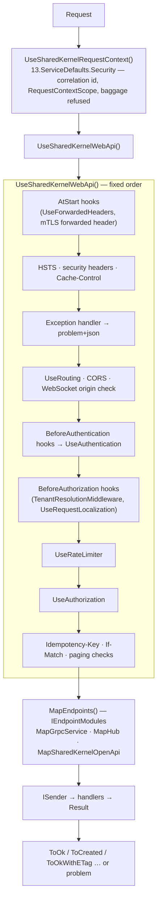

<div align="center">

# 14.Presentation

**The inbound boundary of a .NET service: one RFC 9457 error shape over HTTP, the same codes over gRPC and SignalR,
declarative authorization on every protocol, endpoint modules mapped at compile time, and versioned OpenAPI documents.**

[](https://dotnet.microsoft.com/)
[](../LICENSE)


</div>

Application code returns `Result` or `Result<T>` (or throws); these packages turn the outcome into the response for
each protocol. An endpoint turns the request into a command or query, sends it through `ISender` and maps the
`Result` — it never calls a repository or a client itself. Every package here is **Host tier** and goes into a
service's Api project.

## What this domain gives you

- **One error contract** — every failure over HTTP is `application/problem+json` with `errorCode`, `traceId`,
  `correlationId` and field errors; gRPC carries the same code in a rich `google.rpc.Status`, SignalR in a coded
  `HubException`. Server errors are redacted outside Development, messages translated per request culture.
- **One-line endpoints** — `sender.Send(command, ct).ToCreated(...)`, typed results OpenAPI can read, and
  `IEndpointModule`s mapped by a generated `app.MapEndpoints()`.
- **Edge checks before the handler** — `Idempotency-Key`, `If-Match`/`ETag` (412, 428, 304), and validated paging.
- **Authorization in one dialect** — `[RequireEndpointPermission]`, `[RequireRole]`, `[RequireFreshAuthentication]`,
  `[RequireAuthenticationMethod]` on endpoints, hubs and gRPC methods, over `IUserContext`.
- **Secure defaults** — security headers, deny-by-default CORS, body and JSON-depth limits, rate-limit problems.
- **Versioned OpenAPI** — one document per version, Scalar, deprecation and sunset headers, unpublished outside
  Development unless you decide otherwise.

## Packages

| Package | Tier | When you need it |
| --- | --- | --- |
| [`SharedKernel.Presentation.WebApi`](SharedKernel.Presentation.WebApi/README.md) | Host | Any HTTP API — `AddSharedKernelWebApi()` + `UseSharedKernelWebApi()`, typed results, endpoint modules (the source generator ships inside it) |
| [`SharedKernel.Presentation.Core`](SharedKernel.Presentation.Core/README.md) | Host | Comes with the others — the authorization attributes and the shared error rules |
| [`SharedKernel.Presentation.OpenApi`](SharedKernel.Presentation.OpenApi/README.md) | Host | You publish OpenAPI documents or version the API — `AddSharedKernelOpenApi()` + `MapSharedKernelOpenApi()` |
| [`SharedKernel.Presentation.Grpc`](SharedKernel.Presentation.Grpc/README.md) | Host | You serve gRPC — `AddSharedKernelGrpc()`; no dependency on WebApi or Contracts |
| [`SharedKernel.Presentation.SignalR`](SharedKernel.Presentation.SignalR/README.md) | Host | You serve SignalR hubs — `AddSharedKernelSignalR()` |
| [`SharedKernel.Presentation.GraphQL`](SharedKernel.Presentation.GraphQL/README.md) | Host | You serve GraphQL with HotChocolate — `AddSharedKernelGraphQL()` |

Every configuration key of the domain, with its rules, is in [CONFIGURATION.md](CONFIGURATION.md). Test helpers:
[`SharedKernel.Presentation.Testing`](../16.Testing/SharedKernel.Presentation.Testing/README.md). The client side of
these contracts is [`11.Communication`](../11.Communication/README.md).

## The canonical HTTP pipeline



gRPC calls and SignalR negotiation run through the same pipeline, so the request context, authentication and
authorization apply to them too.

## Get started

```xml
<PackageReference Include="SharedKernel.Presentation.WebApi" />
<PackageReference Include="SharedKernel.ServiceDefaults.Security" />
```

```csharp
using SharedKernel.Application.Messaging;
using SharedKernel.Presentation.WebApi;
using SharedKernel.ServiceDefaults.Security;

var builder = WebApplication.CreateBuilder(args);

builder.Services.AddSharedKernelRequestContext();
builder.AddSharedKernelWebApi();

var app = builder.Build();
app.UseSharedKernelRequestContext();   // first
app.UseSharedKernelWebApi();
app.MapEndpoints();                    // generated: every IEndpointModule of this assembly
app.Run();

public sealed class OrderEndpoints : IEndpointModule
{
    public static void Map(IEndpointRouteBuilder app)
    {
        var orders = app.MapGroup("/orders").WithTags("Orders");

        orders.MapGet("/{id:guid}", (Guid id, ISender sender, CancellationToken ct) =>
            sender.Send(new GetOrder(id), ct).ToOkWithETag(o => o.Version.ToString(), OrderResponse.From));

        orders.MapPost("/", (PlaceOrderRequest body, IdempotencyKey key, ISender sender, CancellationToken ct) =>
            sender.Send(new PlaceOrder(body.Customer, body.Amount, key.Value), ct).ToCreated(id => $"/orders/{id}"));
    }
}
```

A failed `Result` — `order.not_found`, a validation failure with field errors, a stale version — becomes the matching
problem (404, 400 with `errors`/`errorCodes`, 412) with no code in the endpoint.

## The sample

[`samples/OrderApi`](../samples/OrderApi/) is the reference service: four projects (Domain, Application,
Infrastructure, Api), each referencing only its tier. `OrderApi.Api/Program.cs` wires `AddSharedKernelWebApi()`,
`AddSharedKernelOpenApi()`, `UseSharedKernelRequestContext()` first, `UseSharedKernelWebApi()`, `MapEndpoints()` and
`MapSharedKernelOpenApi()`; its tests swap in a test authentication scheme to prove the 401/403/204 answers of a
command carrying `[RequirePermission]`. [`samples/InventoryApi`](../samples/InventoryApi/) serves the same errors over REST and gRPC.

## Guarantees

- **One shape per failure source.** Returned `Result` errors, thrown exceptions, binding failures, the framework's own
  404/405/415 and authorization refusals all produce the same problem members.
- **No leaks.** Server-error messages are replaced by a generic sentence outside Development; a gRPC `RpcException` from
  a downstream service is rebuilt with its status code only; exception details only in Development or by explicit
  setting (with a startup warning).
- **Checks before the handler.** `Idempotency-Key`, `If-Match` and paging are validated after authorization and before
  the endpoint runs, identically for minimal APIs and MVC.
- **Fixed middleware order.** `UseSharedKernelWebApi()` adds its middleware in one reviewed order; your middleware goes
  in named hooks, inside the exception handler.
- **Deny by default.** No CORS policy until origins are configured; unsafe CORS combinations stop the host; OpenAPI
  documents are not served outside Development unless `ExposeInProduction`.
- **No mediator coupling.** The presentation packages reference neither MediatR nor `05.Application`; any code that
  returns `Result` maps the same way. gRPC never references WebApi or `SharedKernel.Contracts`.
- **Structured logs.** EventIds 14000–14999 (WebApi and Core 14000–14099, SignalR 14100–14199, Grpc 14200–14299,
  OpenApi 14300–14399).

---

For maintainers: rules in [`CLAUDE.md`](CLAUDE.md), phase history in [`state-map.md`](state-map.md).
