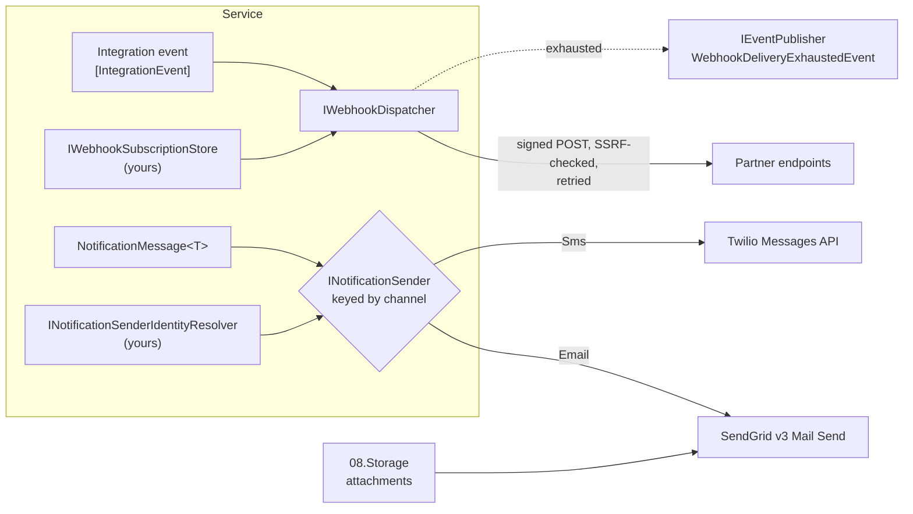

<div align="center">

# 15.Integration

**Outbound delivery to destinations outside your control — signed, retried, SSRF-guarded webhooks and
customer-facing email and SMS — where nothing about the caller except a correlation id leaves the platform, and a
retry never delivers twice.**

[](https://dotnet.microsoft.com/)
[](../LICENSE)


</div>

Two families share one identity here: **webhooks** push your integration events to partners' HTTP endpoints, and
**notifications** reach people by email or SMS. Both are delivery plumbing: they never decide which event matters to
whom, they own no persistence (your service supplies the subscriptions and the sender identity), they call vendors
over plain REST with no SDKs, and they report failures as values instead of exceptions.

## What this domain gives you

- **Webhooks that partners can trust** — HMAC-SHA256 signatures with timestamps, a verifier for the receiving side,
  and zero-downtime secret rotation.
- **Safe delivery to arbitrary URLs** — the resolved address is checked before every send, so a subscriber URL cannot
  reach your private network.
- **Retries without duplicates** — a stable `X-Webhook-Delivery-Id` for subscribers, a caller-supplied
  `NotificationDeliveryId` for email and SMS (enforced by Twilio as `Idempotency-Key`).
- **One notification contract** — `INotificationSender` keyed by channel, with SendGrid and Twilio behind it and
  attachments streamed from object storage.
- **Operational signals** — a `WebhookDeliveryExhaustedEvent` on the bus, delivery observers for your ledger, EventIds
  15000–15999 and spans on `SharedKernel.Integration`.

## Packages

| Package | Tier | When you need it |
| --- | --- | --- |
| [`SharedKernel.Integration.Webhooks`](SharedKernel.Integration.Webhooks/README.md) | Adapter | You push integration events to external subscribers, or verify webhooks from another platform service |
| [`SharedKernel.Integration.Notifications.Abstractions`](SharedKernel.Integration.Notifications.Abstractions/README.md) | Abstractions | Application code that sends email or SMS — the contract, options and observer seams |
| [`SharedKernel.Integration.Notifications.Email.SendGrid`](SharedKernel.Integration.Notifications.Email.SendGrid/README.md) | Adapter | Email through SendGrid dynamic templates, attachments from `08.Storage` |
| [`SharedKernel.Integration.Notifications.Sms.Twilio`](SharedKernel.Integration.Notifications.Sms.Twilio/README.md) | Adapter | SMS through Twilio Content templates, deduplicated by `Idempotency-Key` |

Test doubles: [`SharedKernel.Integration.Testing`](../16.Testing/SharedKernel.Integration.Testing/README.md)
(`AddInMemoryWebhookDispatcher()`, `AddInMemoryWebhookDeliveryObserver()`, `AddInMemoryNotificationSender(channel)`,
`AddInMemoryNotificationDeliveryObserver()`).

## How it fits together



## Get started

Webhooks:

```csharp
builder.Services.AddSharedKernelWebhooks();                                             // SharedKernel:Integration:Webhooks
builder.Services.AddScoped<IWebhookSubscriptionStore, EfWebhookSubscriptionStore>();    // yours
```

```csharp
[IntegrationEvent("orders.order-shipped")]
public sealed record OrderShipped(Guid EventId, DateTimeOffset OccurredOn, Guid OrderId) : IIntegrationEvent;

IReadOnlyList<WebhookDeliveryResult> results = await webhooks.DispatchAsync(evt, ct);   // never throws per subscriber
```

Notifications:

```csharp
builder.Services.AddSharedKernelNotifications();                                        // SharedKernel:Integration:Notifications
builder.Services.AddScoped<INotificationSenderIdentityResolver, TenantSenderIdentityResolver>();   // email "from"
builder.Services.AddSendGridEmailNotifications(o => o.ApiKey = builder.Configuration["SendGrid:ApiKey"]!);
builder.Services.AddTwilioSmsNotifications(o =>
{
    o.AccountSid = builder.Configuration["Twilio:AccountSid"]!;
    o.AuthToken = builder.Configuration["Twilio:AuthToken"]!;
    o.MessagingServiceSid = builder.Configuration["Twilio:MessagingServiceSid"];         // or From
});
```

```csharp
var sms = services.GetRequiredKeyedService<INotificationSender>(NotificationChannel.Sms);
NotificationDeliveryResult result = await sms.SendAsync(new NotificationMessage<OtpModel>
{
    NotificationDeliveryId = otpRequest.DeliveryId,    // created once, reused on retry
    Channel = NotificationChannel.Sms,
    Recipient = customer.PhoneNumberE164,
    TemplateId = contentSid,
    TemplateModel = new OtpModel(code),
}, ct);
```

Subscribe to traces with `builder.WithIntegrationTelemetry()` (`SharedKernel.ServiceDefaults`).

## Guarantees

| Guarantee | How |
| --- | --- |
| Only the correlation id leaves the platform | Webhooks send `X-Correlation-Id` and nothing else about the caller; notification providers send no platform headers |
| Subscribers can verify origin and freshness | `X-Webhook-Signature` = HMAC-SHA256 of `"{timestamp}.{body}"`; `WebhookSignatureVerifier` checks it in fixed time within `SignatureTolerance` |
| Secrets rotate without downtime | `Secrets` newest first: sign with the first, verify against any |
| No SSRF by default | The resolved address is checked before every send; private, loopback, link-local and multicast targets are rejected |
| One slow or broken subscriber cannot fault the rest | Bounded fan-out (`MaxConcurrentDeliveries`); every failure is a `WebhookDeliveryResult` |
| Retries are deduplicable | Stable `X-Webhook-Delivery-Id`; caller-supplied `NotificationDeliveryId` (Twilio `Idempotency-Key`) |
| A permanently failing subscriber is visible | Exactly one `WebhookDeliveryExhaustedEvent` per exhausted delivery |
| Options really drive behaviour | Retry, backoff, timeout and concurrency settings configure the standard resilience handler and are validated at startup |
| Personal data stays out of telemetry | Recipients, template models, URLs and secrets are never log parameters or span tags |

## Limits

- SendGrid deduplication is correlation only; prevent duplicate emails in your outbox.
- `SendGridNotificationOptions` and `TwilioNotificationOptions` are set in code (no configuration section is bound).
- There is no `Push` channel, and `NotificationMessage.Locale` is reserved but not used yet.

---

For maintainers: [CLAUDE.md](CLAUDE.md) (domain rules and invariants) · [state-map.md](state-map.md) (phase history).
