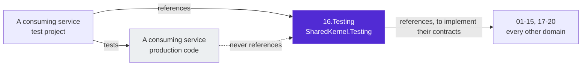
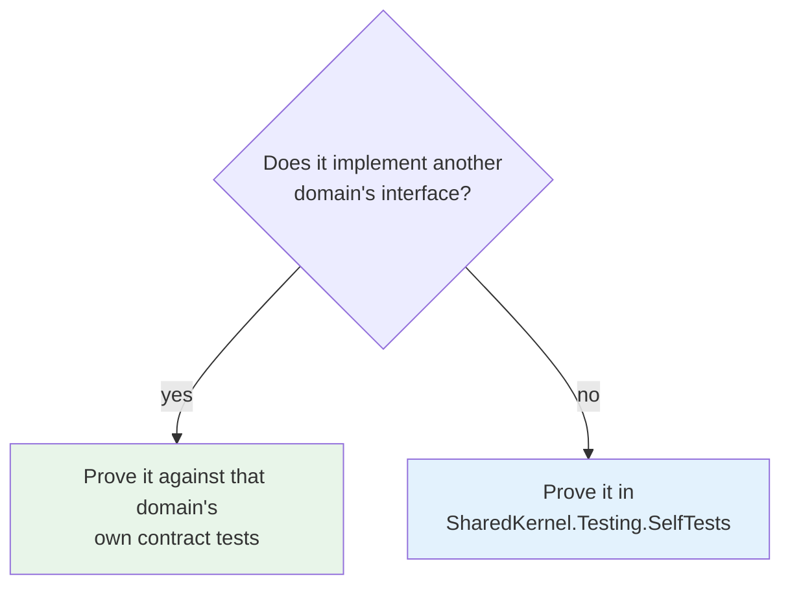

# 16.Testing


**The shared test infrastructure of Platform.SharedKernel.** `SharedKernel.Testing` holds a test double for
every abstraction the platform publishes, container fixtures for the real engines, and assertion helpers every
`.Tests` project in this repository uses. `SharedKernel.Persistence.Testing` is the published slice of it for
**consuming services' test projects**: fakes of the persistence and shared application contracts plus a
PostgreSQL with the production role split.

> Looking for how to use it? Read the
> [**SharedKernel.Testing README**](SharedKernel.Testing/README.md): quick start, the full inventory and the
> rules each double follows.

## Contents

| Project | What it is |
| --- | --- |
| [`SharedKernel.Testing`](SharedKernel.Testing/README.md) | The library itself — fakes, in-memory implementations, container fixtures, fakers, assertions |
| [`SharedKernel.Persistence.Testing`](SharedKernel.Persistence.Testing/README.md) | **Published (P-558).** `FakeRepository<,>`, `FakeUnitOfWork`, `FakeAuditTrailWriter`, `FakeCrossTenantScope`, `TestRequestContext`, `FakeDbConnectionFactory`, `Add*` DI helpers, `PostgresTestServer`/`PostgresTestDatabase` — for services built on `06.Persistence` |
| `SharedKernel.Persistence.Testing.Tests` | Its suite (Testcontainers; integration lane) |
| `SharedKernel.Testing.SelfTests` | Its own suite: proves every helper that has no other domain to prove it |

## Where the layer sits

This is the one domain that may reference **any** layer, because a double has to implement the contract it
stands in for. The rule that keeps that safe runs in the other direction: no production package may reference
it, enforced by `SharedKernelLayeringRules.TestingNeverReferencedByProduction`.



## How a double proves itself

A double that implements another domain's interface is proven by **that domain's** contract tests — the same
tests the real implementation passes. Only a helper with no interface behind it, such as a builder or an
assertion class, is proven here in `SharedKernel.Testing.SelfTests`.



## Design principles

- **Substitutable, not approximate.** A double satisfies the real contract, including its failure modes, so a
  test exercises the same wiring production does and needs no mocking framework for a SharedKernel type.
- **No provider dependency.** A fake references only the abstraction package it implements, never a provider,
  so using it pulls in no Redis, no EF Core and no cloud SDK.
- **Deterministic.** Fakers are seeded once per assembly, the clock moves only when a test moves it, and the
  embedding generator derives its vectors from a hash rather than a model.
- **Assertions read state.** Log assertions match an `EventId` and structured properties, never a rendered
  message, so rewording a message template never breaks a test.
- **`SharedKernel.Testing` is consumed by `ProjectReference` only** (`IsPackable=false`, never pushed to a feed).
  `SharedKernel.Persistence.Testing` is packable and published so consuming services can test against the same
  fakes and role split; it references `06.Persistence` concretely (EF Core, Auditing, Encryption) and
  Testcontainers, and — like everything here — is refused in production code by
  `TestingNeverReferencedByProduction`.

## Build and test

```bash
dotnet build 16.Testing/SharedKernel.Testing/SharedKernel.Testing.csproj -c Release
dotnet test  16.Testing/SharedKernel.Testing/SharedKernel.Testing.SelfTests/SharedKernel.Testing.SelfTests.csproj -c Release
```

The container fixtures need a running Docker daemon. Tests that use them belong in their own suite, because a
machine without Docker fails every one of them.

## Contributing, for people and AI agents

Maintainer rules — the folder-to-domain map, the reference policy, and where a new double belongs — live in
[`CLAUDE.md`](CLAUDE.md). Planned work is tracked in [`state-map.md`](state-map.md).
