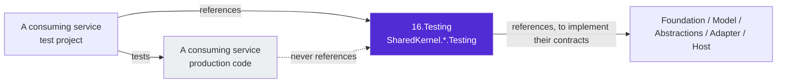

# 16.Testing


**The test infrastructure of Platform.SharedKernel, split so a test project takes only what it tests.** Twenty
packable Testing-tier packages — a lightweight core plus one `SharedKernel.{Capability}.Testing` package per
capability — give consuming services the same doubles this repository tests itself with. One non-packable project
holds the heavy, repository-only infrastructure (Testcontainers fixtures, EF Core helpers, the MassTransit harness).

## The packages

| Package | Doubles for |
| --- | --- |
| [`SharedKernel.Testing`](SharedKernel.Testing/README.md) | **The core.** `FakeClock`, the in-memory logger, `TestRequestContext`, fakers, domain/contract/validation/privacy assertions. Foundation and Model packages only |
| [`SharedKernel.Application.Testing`](SharedKernel.Application.Testing/README.md) | The application pipeline (`ApplicationPipelineTestHarness`) and its seams |
| [`SharedKernel.Persistence.Testing`](SharedKernel.Persistence.Testing/README.md) | Repositories, unit of work, audit trail, cross-tenant scope; PostgreSQL with the production role split |
| [`SharedKernel.Caching.Testing`](SharedKernel.Caching.Testing/README.md) / [`SharedKernel.Caching.Redis.Testing`](SharedKernel.Caching.Redis.Testing/README.md) | `ICacheService`, locks, key providers / Redis hashes and pub/sub |
| [`SharedKernel.Cryptography.Testing`](SharedKernel.Cryptography.Testing/README.md) | Encryption, signing, hashing, secure random, TOTP |
| [`SharedKernel.FeatureManagement.Testing`](SharedKernel.FeatureManagement.Testing/README.md) | OpenFeature `IFeatureClient` |
| [`SharedKernel.Idempotency.Testing`](SharedKernel.Idempotency.Testing/README.md) | `IIdempotencyStore` (request and message purposes) |
| [`SharedKernel.Messaging.Testing`](SharedKernel.Messaging.Testing/README.md) | `IMessageBus`, `IEventPublisher` |
| [`SharedKernel.Storage.Testing`](SharedKernel.Storage.Testing/README.md) | `IFileStorage` — in-memory named and tenant stores |
| [`SharedKernel.Search.Testing`](SharedKernel.Search.Testing/README.md) | `ISearchIndex<T>`, provisioner, descriptor |
| [`SharedKernel.AI.Testing`](SharedKernel.AI.Testing/README.md) | Embeddings, vector collections, semantic kernel |
| [`SharedKernel.Security.Testing`](SharedKernel.Security.Testing/README.md) | `IUserContext`, API-key, DPoP and TOTP stores, certificate builders |
| [`SharedKernel.Workflows.Testing`](SharedKernel.Workflows.Testing/README.md) | `IWorkflowDispatcher`, `IWorkflowHandle` |
| [`SharedKernel.Scheduling.Testing`](SharedKernel.Scheduling.Testing/README.md) | `IScheduledJobRegistry` |
| [`SharedKernel.Integration.Testing`](SharedKernel.Integration.Testing/README.md) | Webhooks and notifications |
| [`SharedKernel.Reporting.Testing`](SharedKernel.Reporting.Testing/README.md) | `IReportExporter<TRow>`, `IReportExporterFactory`, `IHtmlToPdfConverter` |
| [`SharedKernel.Communication.Testing`](SharedKernel.Communication.Testing/README.md) | REST and gRPC clients (`StubHttpMessageHandler`, `GrpcCalls`), gRPC `ServerCallContext` |
| [`SharedKernel.Presentation.Testing`](SharedKernel.Presentation.Testing/README.md) | gRPC server context with `HttpContext`, HotChocolate executor, `IHttpContextAccessor` |
| [`SharedKernel.ServiceDefaults.Testing`](SharedKernel.ServiceDefaults.Testing/README.md) | `ITenantCatalog`, tenant resolution, health-check assertions |
| [`SharedKernel.Testing.Internal`](SharedKernel.Testing.Internal/README.md) | **Not packable.** Testcontainers fixtures, EF Core/Npgsql/audit helpers, MassTransit `TestHarnessFactory` — this repository's own suites only |

```xml
<!-- in a TEST project -->
<PackageReference Include="SharedKernel.Testing" />
<PackageReference Include="SharedKernel.Messaging.Testing" />
```

Versions come from the consumer's single `SharedKernelVersion`; every package ships with the repo-wide release
train.

## Where the tier sits

Every package here declares `<SharedKernelTier>Testing</SharedKernelTier>`. A Testing package may reference any
production tier, because a double has to implement the contract it stands in for. The rule that keeps that safe
runs the other way: **no production project may reference a Testing package** — enforced by
`TestingNeverReferencedByProduction` (usable against a consuming service's own assemblies too) and by this
repository's architecture tests, which match by tier and by name.



## Design principles

- **Take only what you test.** The core depends only on Foundation and Model packages (locked by an architecture
  test); a capability package depends on that capability's abstractions, so using the messaging doubles pulls in
  no Redis, no EF Core and no cloud SDK.
- **Substitutable, not approximate.** A double satisfies the real contract, including its failure modes and the
  mandatory tenant scope, so a test exercises the same wiring production does and needs no mocking framework for a
  SharedKernel type.
- **Framework-free.** No packable package references xUnit, NUnit or MSTest; only `SharedKernel.Testing.Internal`
  (xUnit fixtures) does.
- **Deterministic.** Fakers are seeded once per assembly, the clock moves only when a test moves it, and the
  embedding generator derives its vectors from a hash rather than a model.
- **Assertions read state.** Log assertions match an `EventId` and structured properties, never a rendered message.

## Build and test

```bash
dotnet test Platform.SharedKernel.Unit.slnf -c Release          # every package's own {Name}.Tests
dotnet test Platform.SharedKernel.Integration.slnf -c Release   # SharedKernel.Testing.Internal.Tests, container suites (Docker)
```

## Contributing, for people and AI agents

Maintainer rules — where a new double belongs, the reference policy per package — live in [`CLAUDE.md`](CLAUDE.md).
Phase history is in [`state-map.md`](state-map.md).
