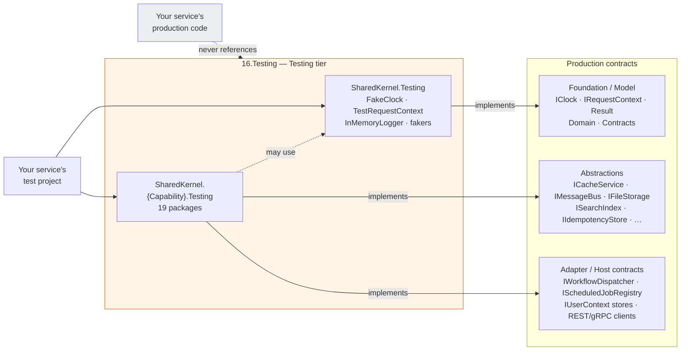

<div align="center">

# 16.Testing

**The test doubles of Platform.SharedKernel — one lightweight core and one package per capability, so a test
project takes only what it tests.**

[](https://dotnet.microsoft.com/)
[](https://github.com/Gresta-Vertex-Labs/platform-shared-kernel/blob/main/LICENSE)


</div>

---

## What this gives you

- **Doubles that honour the real contract.** Every fake implements the production interface it replaces — including
  its failure modes, its `Error` codes and its mandatory tenant scope — so a unit test exercises the same wiring
  production does, without a mocking framework.
- **Take only what you test.** The core (`SharedKernel.Testing`) depends on Foundation and Model packages only; a
  capability package depends on that capability's contracts. Using the messaging doubles pulls in no Redis, no EF
  Core and no cloud SDK.
- **Deterministic by construction.** Time moves only when the test moves a `FakeClock`, fakers are seeded, and no
  double does real I/O.
- **Framework-free.** No packable package references xUnit, NUnit, MSTest or an assertion library; built-in
  assertions throw `InvalidOperationException` with a readable message, so they work under any test runner.
- **The same doubles this repository tests itself with.** A behavioural fix happens once and reaches every consumer.

## The packages

Twenty packable packages, all in the **Testing** tier — reference them from **test projects only**.

| Package | Fakes | Register / create |
| --- | --- | --- |
| [`SharedKernel.Testing`](SharedKernel.Testing/README.md) | **The core.** `IClock` (`FakeClock`), `IRequestContext` (`TestRequestContext`), in-memory `ILogger` + `LoggerAssertions`, Bogus fakers, domain/contract/validation/privacy assertions | `new FakeClock(...)`, `TestRequestContext.ForTenant(...)`, `AddInMemoryLoggerFactory()`, `AddFakeDomainServices()` |
| [`SharedKernel.Application.Testing`](SharedKernel.Application.Testing/README.md) | The kernel request pipeline and its seams | `new ApplicationPipelineTestHarness()`, `AddFakeApplicationBehaviorServices()` |
| [`SharedKernel.Persistence.Testing`](SharedKernel.Persistence.Testing/README.md) | `IRepository<,>`, `IUnitOfWork`, `IAuditTrailWriter`, `ICrossTenantScope`, `IDbConnectionFactory`; PostgreSQL with the production role split | `AddFakeRepository<T,TId>()`, `AddFakeUnitOfWork()`, `AddFakeAuditTrailWriter()`, `AddFakeCrossTenantScope()`, `AddTestRequestContext()` |
| [`SharedKernel.Caching.Testing`](SharedKernel.Caching.Testing/README.md) | `ICacheService`, `ITenantCacheService`, `IDistributedLockService`, warmup, tenant key provider | `AddFakeCachingServices()`, `AddFakeTenantCacheService()`, `AddFakeCacheWarmupStrategy()` |
| [`SharedKernel.Caching.Redis.Testing`](SharedKernel.Caching.Redis.Testing/README.md) | `IRedisChannelService`, `IRedisHashService`, `ITypedHashStore<T>` | `AddFakeRedisServices()`, `AddFakeTypedHashStore<T>()` |
| [`SharedKernel.Communication.Testing`](SharedKernel.Communication.Testing/README.md) | Typed REST clients (the whole handler pipeline) and gRPC unary calls | `UseStubHttpMessageHandler(clientName, stub)`, `GrpcCalls` |
| [`SharedKernel.Cryptography.Testing`](SharedKernel.Cryptography.Testing/README.md) | Encryption, hashing, HMAC, signing, key providers, secure random, TOTP replay guard | `AddFakeCryptography()` |
| [`SharedKernel.FeatureManagement.Testing`](SharedKernel.FeatureManagement.Testing/README.md) | OpenFeature `IFeatureClient` | `AddFakeFeatureFlags()` |
| [`SharedKernel.Idempotency.Testing`](SharedKernel.Idempotency.Testing/README.md) | `IIdempotencyStore` (request and message purposes) | `AddFakeIdempotencyStore(purposes)` |
| [`SharedKernel.Integration.Testing`](SharedKernel.Integration.Testing/README.md) | `IWebhookDispatcher`, `INotificationSender` and their delivery observers | `AddInMemoryWebhookDispatcher()`, `AddInMemoryNotificationSender()` |
| [`SharedKernel.Messaging.Testing`](SharedKernel.Messaging.Testing/README.md) | `IMessageBus`, `IEventPublisher` | `AddInMemoryMessageBus()`, `AddInMemoryEventPublisher()` |
| [`SharedKernel.Storage.Testing`](SharedKernel.Storage.Testing/README.md) | `IFileStorage`, `ITenantFileStorage` — named and tenant stores in memory | `AddSharedKernelStorage().AddInMemoryStore(name)`, `.AddInMemoryTenantStore(name)` |
| [`SharedKernel.Search.Testing`](SharedKernel.Search.Testing/README.md) | `ISearchIndex<T>`, `ISearchIndexProvisioner`, `ISearchProviderDescriptor` | `AddInMemorySearchIndex<T>()`, `AddInMemorySearchProvisioning()` |
| [`SharedKernel.AI.Testing`](SharedKernel.AI.Testing/README.md) | Embedding generator, vector collections, provisioner, semantic kernel | `AddInMemoryEmbeddingGenerator()`, `AddInMemoryVectorCollection<T>()`, `AddInMemoryVectorProvisioning()`, `AddInMemorySemanticKernel()` |
| [`SharedKernel.Workflows.Testing`](SharedKernel.Workflows.Testing/README.md) | `IWorkflowDispatcher`, `IWorkflowHandle<TResult>` | `AddInMemoryWorkflowDispatcher()` |
| [`SharedKernel.Scheduling.Testing`](SharedKernel.Scheduling.Testing/README.md) | `IScheduledJobRegistry` — ticks fired by the test | `new InMemoryScheduledJobRegistry(sender)` |
| [`SharedKernel.Reporting.Testing`](SharedKernel.Reporting.Testing/README.md) | `IReportExporter<TRow>`, `IReportExporterFactory`, `IHtmlToPdfConverter` | `AddInMemoryReporting()` |
| [`SharedKernel.Security.Testing`](SharedKernel.Security.Testing/README.md) | `IUserContext`, API-key, DPoP and TOTP stores; DPoP proofs and mTLS certificates | `new FakeUserContext()`, `new SecurityTestContextBuilder()` |
| [`SharedKernel.Presentation.Testing`](SharedKernel.Presentation.Testing/README.md) | gRPC `ServerCallContext` with an `HttpContext`, HotChocolate executor, `IHttpContextAccessor` | `TestServerCallContext.Create(...)`, `GraphQLTestExecutorFactory.Create(services)` |
| [`SharedKernel.ServiceDefaults.Testing`](SharedKernel.ServiceDefaults.Testing/README.md) | `ITenantCatalog`, tenant resolution strategies, health-check registration assertions | `new InMemoryTenantCatalog()`, `new FakeTenantResolutionStrategy(tenantId)` |

One more project lives here but is **not published**:
[`SharedKernel.Testing.Internal`](SharedKernel.Testing.Internal/README.md) — Testcontainers fixtures, EF Core/Npgsql
helpers and a MassTransit harness for this repository's own suites.

## How it fits together



- A capability package references **the contract it fakes**, not a provider — unless the contract only exists in a
  concrete package (Workflows, Scheduling, the Security handlers, Webhooks, Communication).
- **No production project may reference a Testing package.** The tier check forbids it inside this repository, and
  `SharedKernelLayeringRules.TestingNeverReferencedByProduction` can check a consuming service's own assemblies.
- `SharedKernel.Security.Testing` references Host-tier packages, so it brings ASP.NET Core into the test project that
  uses it.

## Get started

A service's **test project** references the core plus the capability packages it needs:

```xml
<ItemGroup>
  <PackageReference Include="SharedKernel.Testing" />
  <PackageReference Include="SharedKernel.Messaging.Testing" />
</ItemGroup>
```

Every SharedKernel package ships at one version; set your central `SharedKernelVersion` once. See
[Using the packages](https://github.com/Gresta-Vertex-Labs/platform-shared-kernel#using-the-packages).

Given a piece of service code that reads the time, the caller and publishes a message:

```csharp
using SharedKernel.Execution.Context;
using SharedKernel.Messaging.Abstractions.MessageBus;
using SharedKernel.Primitives.Clocks;
using SharedKernel.Primitives.Errors;
using SharedKernel.Primitives.Results;

public sealed record InvoiceIssued(Guid InvoiceId, DateTimeOffset IssuedAt);

public sealed class InvoiceIssuer(IClock clock, IRequestContext caller, IMessageBus bus)
{
    public async Task<Result> IssueAsync(Guid invoiceId, CancellationToken ct)
    {
        if (!await caller.HasPermissionAsync("invoices.issue", ct))
            return Error.Forbidden("invoices.issue_denied", "The caller may not issue invoices.");

        return await bus.PublishAsync(new InvoiceIssued(invoiceId, clock.UtcNow), ct);
    }
}
```

the test uses real doubles — no mocks:

```csharp
using SharedKernel.Execution.Tenancy;
using SharedKernel.Testing.Clocks;
using SharedKernel.Testing.Execution;
using SharedKernel.Testing.Messaging;
using Xunit;

public sealed class InvoiceIssuerTests
{
    private readonly FakeClock _clock = new(new DateTimeOffset(2026, 3, 1, 9, 0, 0, TimeSpan.Zero));
    private readonly InMemoryMessageBus _bus = new();

    [Fact]
    public async Task Issue_publishes_the_event_stamped_with_the_clock()
    {
        var caller = TestRequestContext.ForTenant(new TenantId(Guid.NewGuid()))
            .WithPermissions("invoices.issue");
        var issuer = new InvoiceIssuer(_clock, caller, _bus);

        var result = await issuer.IssueAsync(Guid.NewGuid(), CancellationToken.None);

        Assert.True(result.IsSuccess);
        var issued = _bus.ShouldHavePublishedOnce<InvoiceIssued>();
        Assert.Equal(_clock.UtcNow, issued.IssuedAt);
    }

    [Fact]
    public async Task Issue_without_the_permission_is_forbidden_and_publishes_nothing()
    {
        var issuer = new InvoiceIssuer(_clock, TestRequestContext.ForUser(), _bus);

        var result = await issuer.IssueAsync(Guid.NewGuid(), CancellationToken.None);

        Assert.Equal("invoices.issue_denied", result.Error.Code);
        _bus.ShouldNotHavePublished<InvoiceIssued>();
    }
}
```

In a DI-based test, the same doubles register with one call each — `services.AddInMemoryMessageBus()`, then resolve
`InMemoryMessageBus` to assert. Call these after the production registrations so the double is the one resolved,
and you can swap a single dependency of an otherwise real host.

## Guarantees

These hold because the code and its self-tests make them hold — each is only as true as that code.

| Guarantee | What it means for your test |
| --- | --- |
| **Contract-faithful** | A double implements the production interface and fails where production fails: definition validation, conditional-write conflicts, idempotency fingerprint mismatches, and the owning domain's real `Error` codes |
| **Tenant fail-closed** | Tenants are `TenantId`, scopes are `TenantScope`, callers are `IRequestContext`; a global scope against tenant-declaring data is refused, as in production |
| **Deterministic** | Time comes from `FakeClock` or a supplied `TimeProvider`; randomness is seeded; no real I/O |
| **Thread-safe** | Every stateful double tolerates parallel test collections |
| **Assertable after the scope ends** | A double whose history you assert (message bus, event publisher, search index, vector collection, workflow dispatcher) is registered as a **singleton**, even where production is scoped |
| **Simplifications are documented** | Where a double simplifies — exact search counts, substring free-text, hash-derived embeddings, no optimistic concurrency in `FakeRepository` — its README says so; test those behaviours against the real engine |

Each package's self-tests live in a nested `{Package}.Tests` project and prove the double against the documented
behaviour of its production contract. They run in the Unit lane, except the PostgreSQL-backed
`SharedKernel.Persistence.Testing.Tests` and `SharedKernel.Testing.Internal.Tests`, which need Docker:

```bash
dotnet test Platform.SharedKernel.Unit.slnf -c Release
dotnet test Platform.SharedKernel.Integration.slnf -c Release   # Docker required
```

---

**For maintainers:** where a new double belongs, the reference policy and the domain rules are in
[`CLAUDE.md`](CLAUDE.md); phase history is in [`state-map.md`](state-map.md).

Part of [Platform.SharedKernel](https://github.com/Gresta-Vertex-Labs/platform-shared-kernel) ·
[MIT license](https://github.com/Gresta-Vertex-Labs/platform-shared-kernel/blob/main/LICENSE)
