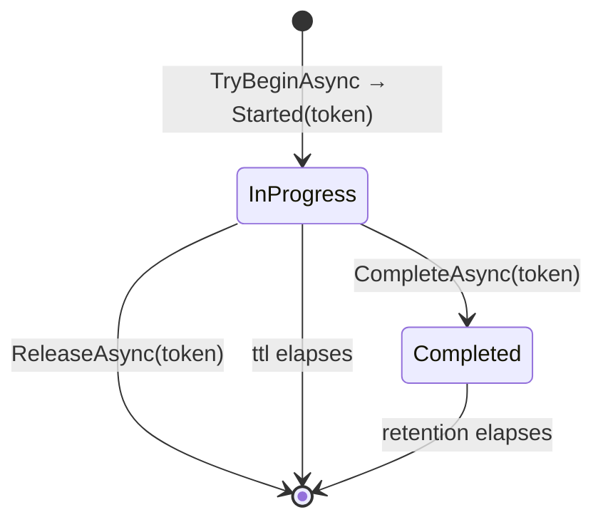

# SharedKernel.Idempotency.Abstractions

[](https://dotnet.microsoft.com/)
[](https://github.com/Gresta-Vertex-Labs/platform-shared-kernel/blob/main/LICENSE)


> **One reservation contract, `IIdempotencyStore`, behind every duplicate-execution guard in a service: command
> idempotency in the application pipeline and consumer deduplication in messaging. Stores are registered per purpose,
> scope every key by tenant, and classify a key in one atomic round trip.**

| You get | So that |
| --- | --- |
| `IIdempotencyStore` — `TryBeginAsync` / `CompleteAsync` / `ReleaseAsync` | Commands and messages share one protocol and one set of stores |
| `IdempotencyReservation` with four statuses | The caller knows at once whether to run, wait, replay or refuse |
| Token-conditional completion and release | A caller whose lease expired and was taken over cannot touch the new owner's entry |
| `IdempotencyPurpose` (`Request`, `Message`) and keyed registration | Requests can live in Redis and messages next to the outbox, each with its own store |
| `IdempotencyTenantScope` | Every store encodes the tenant the same way; a key can never collide across tenants |
| No Redis, EF Core or messaging dependency | Application code and custom stores depend on the contract alone |

## Contents

- [Install](#install)
- [Quick start](#quick-start)
- [How it works](#how-it-works)
- [Recipes](#recipes)
- [Reference](#reference)
- [Testing](#testing)
- [Pitfalls](#pitfalls)
- [Design decisions](#design-decisions)

## Install

```xml
<PackageReference Include="SharedKernel.Idempotency.Abstractions" />
```

The version comes from your central `SharedKernelVersion` property — every SharedKernel package ships at the same
version. See [Using the packages](https://github.com/Gresta-Vertex-Labs/platform-shared-kernel#using-the-packages).

Most services never reference it directly: it arrives with `SharedKernel.Application.Pipeline`,
`SharedKernel.Messaging.MassTransit` and both providers. Reference it yourself to write a custom store or to call the
contract from your own code.

| Requirement | Value |
| --- | --- |
| Target framework | `net10.0` |
| Tier | Abstractions — reference it from your **Application** project |
| Depends on | `SharedKernel.Execution`, `Microsoft.Extensions.DependencyInjection.Abstractions` |
| Namespaces | `SharedKernel.Idempotency.Abstractions` |
| Implementations | [`SharedKernel.Idempotency.Redis`](https://github.com/Gresta-Vertex-Labs/platform-shared-kernel/blob/main/18.Idempotency/SharedKernel.Idempotency.Redis/README.md), [`SharedKernel.Idempotency.EfCore`](https://github.com/Gresta-Vertex-Labs/platform-shared-kernel/blob/main/18.Idempotency/SharedKernel.Idempotency.EfCore/README.md) |

## Quick start

Pick a provider per purpose at the composition root; the callers find the store by purpose.

```csharp
using SharedKernel.Caching.Redis.Core.Extensions;
using SharedKernel.Idempotency.EfCore.Extensions;
using SharedKernel.Idempotency.Redis.Extensions;
using SharedKernel.Persistence;

builder.Services.AddRedisConnection(builder.Configuration);
builder.Services.AddRedisIdempotency(p => p.ForRequests());                               // commands in Redis
builder.Services.AddEfCoreIdempotency(db => db.UsePostgres(dataSource), p => p.ForMessages()); // messages in PostgreSQL
```

Using the contract directly:

```csharp
using SharedKernel.Idempotency.Abstractions;

public sealed class ImportGuard([FromKeyedServices(IdempotencyPurpose.Request)] IIdempotencyStore store)
{
    public async Task<bool> RunOnceAsync(string key, Func<Task> work, CancellationToken ct)
    {
        var reservation = await store.TryBeginAsync(
            IdempotencyPurpose.Request, key, fingerprint: "import-v1", ttl: TimeSpan.FromMinutes(5), ct);
        if (reservation.Status != IdempotencyReservationStatus.Started)
            return false;                                          // in flight, done, or key reused

        try
        {
            await work();
            await store.CompleteAsync(IdempotencyPurpose.Request, key, reservation.Token!, response: null,
                retention: TimeSpan.FromDays(1), ct);
            return true;
        }
        catch
        {
            await store.ReleaseAsync(IdempotencyPurpose.Request, key, reservation.Token!, ct);
            throw;
        }
    }
}
```

## How it works



| Existing entry for (tenant, purpose, key) | Same fingerprint | Different fingerprint |
| --- | --- | --- |
| None, or expired | `Started` — the caller holds the reservation and gets a `Token` | — |
| In flight | `InProgress` | `FingerprintMismatch` |
| Completed | `Completed`, with the stored response (none for a message) | `FingerprintMismatch` |

- **`TryBeginAsync` is one atomic compare-and-set.** A read followed by a write is not a valid implementation.
- **`ttl` is the in-flight lease.** A reservation never completed or released expires after it, so a crashed caller
  cannot wedge a key. It must outlast the guarded work.
- **The token guards completion.** `CompleteAsync` stores the response for `retention`; `ReleaseAsync` frees the key
  at once. Both act only while the token still owns an in-flight entry and return `false` (never throw) otherwise. A
  completed entry is never released.
- **Tenant scope comes from the ambient context.** Stores call `IdempotencyTenantScope.Current(accessor)` themselves;
  callers never pass a tenant. The inbound adapters set the context: `UseSharedKernelRequestContext()` for HTTP,
  `WithInboundRequestContext()` for messages, the job runner for scheduled work.
- **Responses are opaque.** The stored response is the caller's string, exactly as given.
- **Fail closed.** An unreachable store throws; each provider offers one explicit opt-out,
  `AllowExecutionOnStoreUnavailable`.

### How the two callers use it

| | `IdempotencyPurpose.Request` (application pipeline) | `IdempotencyPurpose.Message` (MassTransit) |
| --- | --- | --- |
| Enabled by | `app.WithIdempotency()` on `AddSharedKernelApplication` | `MessagingBusBuilder.WithIdempotency()` |
| Key | a 64-hex SHA-256 digest of tenant, caller and `IIdempotentRequest.IdempotencyKey` | `{MessageId:D}:` + SHA-256 hex of endpoint path and consumer type |
| `ttl` / `retention` | `IdempotencyBehaviorOptions.LeaseDuration` (30 s) / `.RetentionWindow` (24 h) | `IdempotencyOptions.LeaseDuration` (30 s) / `.ExpiryWindow` (24 h) |
| `Started` | runs the handler; completes with the serialized `Result` on success, releases on failure | runs the consumer; completes (no response) on success, releases when it throws |
| `InProgress` | `Error.Conflict("idempotency.in_progress")` | throws `ConcurrentMessageDeliveryException`; the message is redelivered |
| `Completed` | replays the stored response | acknowledges the duplicate without consuming |
| `FingerprintMismatch` | `Error.Conflict("idempotency.key_reused")` | a store defect (the fingerprint is fixed): throws |

Both callers fail at host start when their purpose has no store (`HasIdempotencyStore(purpose)`).

## Recipes

### 1. Back requests and messages with different stores

Register each purpose once. A second registration for the same purpose throws — it would silently leave the first
unused.

```csharp
builder.Services.AddRedisIdempotency(p => p.ForRequests());
builder.Services.AddEfCoreIdempotency(db => db.UsePostgres(dataSource), p => p.ForMessages());
```

### 2. Write a custom store

A third backend implements the three members with the same semantics and registers itself per purpose.

```csharp
public sealed class DynamoIdempotencyStore(IAmazonDynamoDB dynamo, IRequestContextAccessor context) : IIdempotencyStore
{
    public async Task<IdempotencyReservation> TryBeginAsync(
        IdempotencyPurpose purpose, string key, string fingerprint, TimeSpan ttl, CancellationToken ct)
    {
        var scope = IdempotencyTenantScope.Current(context);   // "D" tenant id, or "no-tenant"
        // ONE conditional write keyed by (scope, purpose, key) that returns the existing item on conflict.
        // Map it to IdempotencyReservation.Started(token) / InProgress() / Completed(response) / FingerprintMismatch().
        ...
    }

    // CompleteAsync / ReleaseAsync: mutate only while `token` owns an in-flight entry; otherwise return false.
    ...
}

services.AddIdempotencyStore<DynamoIdempotencyStore>(p => p.ForRequests().ForMessages());   // scoped
services.AddIdempotencyStore<InMemoryStore>(IdempotencyPurpose.Message, ServiceLifetime.Singleton);
```

- `TryBeginAsync` must be a single conditional write, never a read followed by a write.
- Never throw from `CompleteAsync`/`ReleaseAsync` for a lost or foreign token — return `false`.
- Store the response string exactly as given; never parse it.
- Throw on an unreachable backend unless the store offers an explicit, documented fail-open switch.

## Reference

### Contract

| Member | Returns |
| --- | --- |
| `TryBeginAsync(purpose, key, fingerprint, ttl, ct)` | `IdempotencyReservation` |
| `CompleteAsync(purpose, key, token, response, retention, ct)` | `true` when the token owned an in-flight entry and it is now completed |
| `ReleaseAsync(purpose, key, token, ct)` | `true` when the token owned an in-flight entry and it is now removed |

`IdempotencyReservation(Status, StoredResponse, Token)` is a `readonly record struct` with the factories `Started(token)`,
`InProgress()`, `Completed(storedResponse)` and `FingerprintMismatch()`. `Token` is set exactly when `Status` is
`Started`; `StoredResponse` only when it is `Completed` and a response was stored.

### Types

| Type | Purpose |
| --- | --- |
| `IdempotencyPurpose` | `Request` (command idempotency), `Message` (consumer deduplication) |
| `IdempotencyReservationStatus` | `Started`, `InProgress`, `Completed`, `FingerprintMismatch` |
| `IdempotencyPurposeSelection` | `ForRequests()`, `ForMessages()`, `For(purpose)` — passed to every registration method |
| `IdempotencyTenantScope` | `For(TenantId?)`, `Current(IRequestContextAccessor)`, `NoTenant` (`"no-tenant"`), `MaxLength` (36) |

### Registration

| Method | Does |
| --- | --- |
| `AddIdempotencyStore<TStore>(purpose, lifetime = Scoped)` | Registers `TStore` as the `IIdempotencyStore` keyed by `purpose`; throws when one exists |
| `AddIdempotencyStore<TStore>(Action<IdempotencyPurposeSelection>)` | The same for every selected purpose (scoped) |
| `HasIdempotencyStore(purpose)` | Whether a store is registered for the purpose |
| `IServiceProvider.GetRequiredIdempotencyStore(purpose)` | Resolves the keyed store |
| `SelectPurposes(Action<IdempotencyPurposeSelection>)` | Evaluates a selection; throws when it is empty (for provider authors) |

Resolve a store with `[FromKeyedServices(IdempotencyPurpose.Request)] IIdempotencyStore`.

### Error codes

Defined by the callers in `SharedKernel.Primitives`' `ErrorCodes.Idempotency`: `idempotency.key_required`,
`idempotency.key_invalid`, `idempotency.in_progress`, `idempotency.key_reused`. This package raises none itself.

### Logging

This package does not log.

## Testing

Reference [`SharedKernel.Idempotency.Testing`](https://github.com/Gresta-Vertex-Labs/platform-shared-kernel/blob/main/16.Testing/SharedKernel.Idempotency.Testing/README.md)
from your test project. `services.AddFakeIdempotencyStore()` registers one singleton `FakeIdempotencyStore` for both
purposes (or the ones you pass), replacing any real store. It implements the same protocol — the four statuses and
the stale-token rule — and adds `Expire(purpose, key)` to model a lease running out, `Calls`, `LastTtl`,
`LastRetention` and `Reset()`. Atomicity itself is only proved against the real providers.

## Pitfalls

| Don't | Do | Why |
| --- | --- | --- |
| Read an entry, then write it | One conditional write per `TryBeginAsync` | A check-then-act window lets two callers both start |
| Complete or release without the token | Pass `reservation.Token` back | The token is what makes a late caller harmless |
| Complete after a failure | Release on failure, complete only on success | A fault must not consume the key |
| Pass a tenant in the key | Let the store read `IRequestContextAccessor` | The scope is applied by construction and cannot be forgotten |
| Skip the inbound request-context adapters in a multi-tenant service | Establish the context before idempotency runs | Otherwise every tenant shares the `no-tenant` scope |
| Register a second store for a purpose "to override" | Register exactly one per purpose | The first would silently stop guarding anything; it throws |
| Choose a `ttl` shorter than the work | Size the lease to outlast the guarded work | An expired lease lets a duplicate start |

## Design decisions

**Why one purpose-keyed contract instead of one per caller?** Command idempotency and consumer deduplication need the
same reservation protocol. One contract means one set of providers, one fake and one set of atomicity tests.

**Why do stores resolve the tenant?** A caller that passed the tenant could pass the wrong one, or none. Reading it
from the ambient context makes tenant isolation impossible to forget at a call site.

**Why do callers own the lease and retention?** Only the caller knows how long its work runs and how long a replay is
useful, so providers have no TTL settings.

---

Part of [Platform.SharedKernel](https://github.com/Gresta-Vertex-Labs/platform-shared-kernel) ·
[Idempotency domain](https://github.com/Gresta-Vertex-Labs/platform-shared-kernel/blob/main/18.Idempotency/README.md) ·
[MIT license](https://github.com/Gresta-Vertex-Labs/platform-shared-kernel/blob/main/LICENSE)
