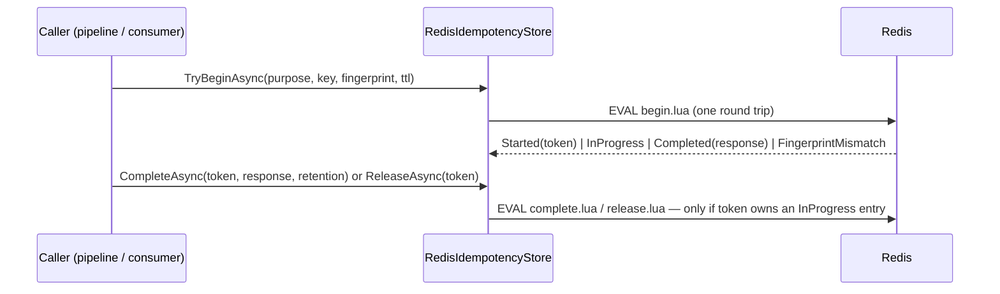

# SharedKernel.Idempotency.Redis

[](https://dotnet.microsoft.com/)
[](https://github.com/Gresta-Vertex-Labs/platform-shared-kernel/blob/main/LICENSE)


> **The Redis implementation of `IIdempotencyStore`: every reservation, completion and release is one Lua script, so
> a duplicate command or message is classified in one atomic round trip, scoped by tenant, over the service's shared
> Redis connection.**

| You get | So that |
| --- | --- |
| `AddRedisIdempotency(p => p.ForRequests().ForMessages())` | One call backs command idempotency, consumer deduplication, or both |
| One Lua script per operation | No `WATCH`/`MULTI` loop and no check-then-act window |
| Keys under `sk:idempotency:{tenantScope}:…` | A key can never collide across tenants or between requests and messages |
| Self-expiring entries (`ttl`, then `retention`) | A crashed caller cannot wedge a key and no cleanup job is needed |
| Fail closed, with one explicit fail-open switch | An outage never silently turns into duplicate execution |
| The shared `IConnectionMultiplexer` | TLS, timeouts and the `redis` readiness probe are configured once |

## Contents

- [Install](#install)
- [Quick start](#quick-start)
- [How it works](#how-it-works)
- [Configuration](#configuration)
- [Reference](#reference)
- [Testing](#testing)
- [Pitfalls](#pitfalls)
- [Design decisions](#design-decisions)

## Install

```xml
<PackageReference Include="SharedKernel.Idempotency.Redis" />
```

The version comes from your central `SharedKernelVersion` property — every SharedKernel package ships at the same
version. See [Using the packages](https://github.com/Gresta-Vertex-Labs/platform-shared-kernel#using-the-packages).

| Requirement | Value |
| --- | --- |
| Target framework | `net10.0` |
| Tier | Adapter — reference it from your **Infrastructure** project |
| Depends on | `SharedKernel.Idempotency.Abstractions`, `SharedKernel.Caching.Redis.Core`, `SharedKernel.Primitives` |
| Namespaces | `SharedKernel.Idempotency.Redis.Extensions`, `.Options`, `.Store` |

## Quick start

```csharp
using SharedKernel.Caching.Redis.Core.Extensions;
using SharedKernel.Idempotency.Redis.Extensions;

builder.Services.AddRedisConnection(builder.Configuration);          // the shared connection — first
builder.Services.AddRedisIdempotency(p => p.ForRequests().ForMessages());
```

```json
{
  "SharedKernel": {
    "Caching": {
      "Redis": { "ConnectionString": "redis.internal:6380", "Ssl": true }
    }
  }
}
```

Nothing else calls the store directly: `app.WithIdempotency()` on `AddSharedKernelApplication` and
`MessagingBusBuilder.WithIdempotency()` resolve it by purpose. To call it yourself, inject
`[FromKeyedServices(IdempotencyPurpose.Request)] IIdempotencyStore` — see the
[contract README](https://github.com/Gresta-Vertex-Labs/platform-shared-kernel/blob/main/18.Idempotency/SharedKernel.Idempotency.Abstractions/README.md).

## How it works



- **One hash per entry** — fields `status` (`InProgress`/`Completed`), `fingerprint`, `token` and, once completed
  with a response, `response` — at:

  ```text
  sk:idempotency:{tenantScope}:key:{key}   IdempotencyPurpose.Request
  sk:idempotency:{tenantScope}:msg:{key}   IdempotencyPurpose.Message
  ```

  `{tenantScope}` is `IdempotencyTenantScope`'s encoding (the tenant id in "D" form, or `no-tenant`), read from the
  ambient `IRequestContextAccessor`. `{key}` is stored exactly as given; for requests it is already a 64-hex digest
  of tenant, caller and key, built by the application pipeline.
- **Atomic.** `TryBeginAsync`, `CompleteAsync` and `ReleaseAsync` are each one Lua script that compares fingerprint,
  token and status and mutates the hash in the same call. The fingerprint is compared before the status.
- **Expiry.** A new reservation expires after the caller's `ttl`; `CompleteAsync` extends it to the caller's
  `retention`. The caller owns both values, so this package has no TTL settings.
- **Token-conditional.** `CompleteAsync`/`ReleaseAsync` act only while the token owns an `InProgress` entry and
  return `false` otherwise; a completed entry is never released.
- **Lifetime.** The store is scoped (one instance per keyed registration); the multiplexer underneath is the shared
  singleton. The package never opens its own connection.

## Configuration

Options are set through the `configure` delegate; the registration does not bind a configuration section (the
`RedisIdempotencyOptions.SectionName` constant, `SharedKernel:Idempotency:Redis`, is reserved for that).

| Option | Type | Default | Meaning |
| --- | --- | --- | --- |
| `RedisIdempotencyOptions.AllowExecutionOnStoreUnavailable` | `bool` | `false` | On a Redis connectivity or timeout failure, `TryBeginAsync` returns `Started` and `CompleteAsync`/`ReleaseAsync` return `false`, instead of throwing. Applies to every purpose of the registration |

```csharp
builder.Services.AddRedisIdempotency(p => p.ForMessages(), o => o.AllowExecutionOnStoreUnavailable = true);
```

The connection itself is configured by `SharedKernel.Caching.Redis.Core` under `SharedKernel:Caching:Redis`.

## Reference

### Registration

| Method | Registers |
| --- | --- |
| `AddRedisIdempotency(Action<IdempotencyPurposeSelection> purposes, Action<RedisIdempotencyOptions>? configure = null)` | `RedisIdempotencyStore` as the keyed `IIdempotencyStore` for each selected purpose (scoped); `IRequestContextAccessor` unless one exists |

It throws `InvalidOperationException` when `AddRedisConnection` has not been called, when no purpose is selected, or
when a store is already registered for a selected purpose.

### Failure classification

Only `RedisConnectionException`, `RedisTimeoutException`, `RedisServerException` and `TimeoutException` count as
"store unavailable". Anything else propagates regardless of the option.

### Logging

| Event id | Level | Event |
| --- | --- | --- |
| 18000 | Warning | Redis idempotency store was unavailable during `{Operation}`; `AllowExecutionOnStoreUnavailable` is enabled, so the call proceeds as not-yet-processed |

### Health

No probe of its own: the shared connection registers the `redis` readiness probe.

## Testing

Unit tests use [`SharedKernel.Idempotency.Testing`](https://github.com/Gresta-Vertex-Labs/platform-shared-kernel/blob/main/16.Testing/SharedKernel.Idempotency.Testing/README.md):
`services.AddFakeIdempotencyStore()` replaces this store with an in-memory `FakeIdempotencyStore` that follows the
same protocol. Atomicity, tenant isolation and expiry claims need a real Redis (for example Testcontainers); a fake
is not evidence for them.

## Pitfalls

| Don't | Do | Why |
| --- | --- | --- |
| Call `AddRedisIdempotency` before `AddRedisConnection` | Register the shared connection first | The registration throws without it |
| Turn on `AllowExecutionOnStoreUnavailable` by default | Leave it off unless running twice is safer than not running | While Redis is down every call — duplicates included — is treated as new |
| Expect settings under `SharedKernel:Idempotency:Redis` | Use the `configure` delegate | The section is not bound |
| Put Redis under `allkeys-*` eviction without headroom | Size memory for `retention`, or use `volatile-*` policies | An evicted entry lets a duplicate run |
| Register a second store for the same purpose | One store per purpose | The registration throws |

## Design decisions

**Why Lua instead of `WATCH`/`MULTI`?** A script runs atomically on the server in one round trip; an optimistic
transaction retries under contention and still needs a read first.

**Why no private connection?** One multiplexer per process is the Redis guidance, and it keeps TLS, timeouts and the
readiness probe in one place (`SharedKernel.Caching.Redis.Core`).

**Why hashes for messages too?** Requests and messages share one shape and one set of scripts; only the key segment
(`key` or `msg`) differs.

---

Part of [Platform.SharedKernel](https://github.com/Gresta-Vertex-Labs/platform-shared-kernel) ·
[Idempotency domain](https://github.com/Gresta-Vertex-Labs/platform-shared-kernel/blob/main/18.Idempotency/README.md) ·
[MIT license](https://github.com/Gresta-Vertex-Labs/platform-shared-kernel/blob/main/LICENSE)
