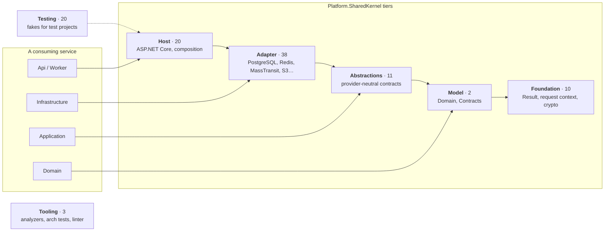

<div align="center">

# Platform.SharedKernel

**The building blocks of a .NET 10 microservice platform, as 104 NuGet packages.**

Primitives and the request context, DDD, CQRS, PostgreSQL, messaging, caching, storage, search, AI,
security, presentation, workflows, scheduling and reporting. No business logic, and a build that
enforces the architecture.

[](global.json)
[](LICENSE)
[](#-the-package-tree)
[](#-the-package-tree)
[](#-status--roadmap)
[](https://github.com/Gresta-Vertex-Labs/platform-shared-kernel/actions/workflows/ci.yml)

[What it is](#-what-it-is) · [Get started](#-get-started) · [Architecture](#-architecture) ·
[Layout](#-repository-layout) · [Package tree](#-the-package-tree) · [Samples](#-sample-services) · [Status](#-status--roadmap) ·
[Using it](#using-the-packages) · [Building](#-building-this-repository) · [Contributing](#-contributing)

</div>

---

## 🧭 What it is

Every service in a microservice platform needs the same plumbing: who is calling and for which tenant,
how a command is validated, authorized and committed, how an event reaches another service, how errors
become HTTP responses, how a dependency reports that it is ready. **Platform.SharedKernel** writes that
plumbing once, as small packages with narrow jobs, so a service only has to write its own business.

| | |
|---|---|
| 📦 **104 packages** | in 21 capability domains, released together at one version |
| 🧱 **7 tiers** | every package is Foundation, Model, Abstractions, Adapter, Host, Testing or Tooling, and the build rejects a reference its tier may not take |
| 🧪 **A test double for every contract** | 20 `*.Testing` packages, so a service's unit tests need no containers |
| 🛡️ **45 analyzer rules** | Roslyn rules for the conventions: `[LoggerMessage]`-only logging, no discarded `Result`, no raw SDK clients, no magic strings, deterministic workflows |
| 🚀 **7 sample services** | built only from the packed packages and run in CI against real PostgreSQL, RabbitMQ, MinIO, Meilisearch and Elasticsearch |
| 📖 **One README standard** | every package README has the same shape — install, quick start, configuration, reference, testing, pitfalls — [checked by a test](docs/package-readme-standard.md) |

### Principles

- **Capability-oriented.** One folder per capability, grouped into zones that mirror a service's projects
  ([layout](#-repository-layout)). A capability with several providers splits into `.Abstractions` +
  `.{Provider}`, so application code never depends on a vendor.
- **Tier-enforced.** What a package may reference is checked by MSBuild before compile
  (`SKTIER001`–`SKTIER006`) and again by architecture tests. ASP.NET Core never leaks below the Host tier.
- **Results, not exceptions.** Expected failures are `Result<T>` values with typed `Error`s, mapped once to
  RFC 9457 ProblemDetails, gRPC status or a message fault.
- **Multi-tenant by default.** One `TenantId` type flows from the HTTP edge through the pipeline, the
  database (row-level security), the cache, storage, search and the message bus, and code fails closed
  when it is missing.
- **Kubernetes-native.** OpenTelemetry built in, `/health/live` + `/health/ready`, and every provider
  registers its own readiness probe.
- **Licence-conscious.** MassTransit is pinned to 8.5.x (the last Apache-2.0 release) and MediatR to 12.4.1
  (the last MIT release). EPPlus, QuestPDF and iText7 were declined on licensing.

---

## ⚡ Get started

A service built on the kernel has four projects, and each one references only the tier made for it.
[`samples/OrderApi`](samples/OrderApi/) is exactly this shape, with an architecture test that keeps it so.

**1. Pin the version once** — see [Using the packages](#using-the-packages) for the full `Directory.Packages.props`.

**2. Reference by project:**

| Project | References | For example |
|---------|------------|-------------|
| `Orders.Domain` | Model tier | `SharedKernel.Domain` |
| `Orders.Application` | Abstractions tier | `SharedKernel.Application` |
| `Orders.Infrastructure` | Adapter tier | `SharedKernel.Persistence.EfCore`, `SharedKernel.Messaging.MassTransit.RabbitMq` |
| `Orders.Api` | Host tier | `SharedKernel.ServiceDefaults`, `SharedKernel.Presentation.WebApi`, `SharedKernel.Application.Pipeline` |

**3. Write the business, not the plumbing:**

```csharp
// Application — a command, its handler and the permission it needs
[RequirePermission("orders.create")]
public sealed record PlaceOrder(Guid CustomerId, decimal Amount, string IdempotencyKey)
    : ICommand<Guid>, IIdempotentRequest;

// Api — one registration call for the whole request pipeline
builder.AddServiceDefaults();
builder.Services.AddSharedKernelApplication(
    typeof(PlaceOrderHandler).Assembly,
    app => app.UseMediatR().WithIdempotency().WithTransactions());
```

Tracing, logging, metrics, authorization and validation run on every request; the `With…` stages are
opt-in, and the host refuses to start if a stage's dependency is missing. The
[samples guide](samples/README.md) walks through a complete service.

---

## 🏛️ Architecture

Each package has a **tier**. The tier says which project of a consuming service may reference it, and
which other packages the package itself may reference.



| Tier | May reference | Consumed by |
|------|---------------|-------------|
| **Foundation** | Foundation | every project |
| **Model** | Foundation, Model (`Microsoft.Extensions.*.Abstractions` only) | the Domain project |
| **Abstractions** | Foundation, Model, Abstractions (`Microsoft.Extensions.*.Abstractions` only) | the Application project |
| **Adapter** | the tiers above, plus declared adapter edges; never ASP.NET Core | the Infrastructure project |
| **Host** | everything except Testing and Tooling | the Api / Worker project |
| **Testing** | everything except Tooling | test projects only |
| **Tooling** | nothing | the build |

The full rules, including the purity rules that tiers cannot express, are in
[`CONTRIBUTING.md`](CONTRIBUTING.md#tiers). Build internals are in [`eng/README.md`](eng/README.md).
To see what depends on what, open [`docs/dependency-graph.md`](docs/dependency-graph.md) (generated, rendered by GitHub).

---

## 🗂️ Repository layout

The source tree mirrors the projects of a consuming service. Each **zone** holds one folder per
capability, and a capability keeps its contracts, its providers and its test doubles side by side.

```text
src/
├── Foundation/        every project           Result, request context, configuration, crypto, validation
├── Model/             the Domain project      Domain/ (DDD building blocks) · Contracts/ (wire contracts)
├── Application/       the Application project CQRS contracts and the request pipeline
├── Infrastructure/    the Infrastructure project
│   ├── Caching/  Persistence/  Messaging/  Storage/  Search/  AI/
│   └── Communication/  Integration/  Workflows/  Idempotency/  Scheduling/  Reporting/
├── Hosting/           the Api / Worker project   Security/ · ServiceDefaults/ · Presentation/
└── Testing/           test projects           SharedKernel.Testing + Testcontainers fixtures
tools/Governance/      the build               analyzers, architecture tests, linter
samples/               seven reference services built from the packed packages
docs/  eng/            generated package views, build internals, CI scripts
```

A zone says where a capability mainly belongs; the **tier** of each package decides what may reference it.
A capability's `.Abstractions` package, for example, is referenced from the Application project even though
the capability lives under `Infrastructure/`. Inside a capability folder:

```text
src/Infrastructure/Caching/
├── README.md, CLAUDE.md, state-map.md          overview, maintainer rules, work board
├── SharedKernel.Caching.Abstractions/          the contracts (Abstractions tier)
│   └── SharedKernel.Caching.Abstractions.Tests/   tests sit inside the project they test
├── SharedKernel.Caching.FusionCache/  …        the providers (Adapter tier)
└── SharedKernel.Caching.Testing/               the test doubles (Testing tier)
```

---

## 🌳 The package tree

All 104 packages, grouped by zone and capability folder. Every name links to the package's README, every
folder to its overview, and the badge after each name is the package's tier. Each capability's `Testing` package
(its test doubles) sits in the same folder. The same list, by tier, is generated in [`docs/packages.md`](docs/packages.md).

### `src/Foundation/` — referenced from every project

- 📁 **[Foundation](src/Foundation/README.md)** — primitives, the execution context and cross-cutting utilities · *15 packages*
  - [SharedKernel.Primitives](src/Foundation/SharedKernel.Primitives/README.md) `Foundation` — `Result<T>`, `Error`, `IClock`, `IIdGenerator`, SmartEnum, well-known headers, readiness probes
  - [SharedKernel.Execution](src/Foundation/SharedKernel.Execution/README.md) `Foundation` — `IRequestContext`, `TenantId`/`TenantScope`, `IUnitOfWork`: the caller on every channel
  - [SharedKernel.Core](src/Foundation/SharedKernel.Core/README.md) `Foundation` — railway extensions for `Result`, `ResultTry`, guard clauses, base exceptions
  - [SharedKernel.Configuration](src/Foundation/SharedKernel.Configuration/README.md) `Foundation` — options validated at startup, not at first use
  - [SharedKernel.FeatureManagement](src/Foundation/SharedKernel.FeatureManagement/README.md) `Foundation` — typed feature flags on OpenFeature, per-tenant rollouts
  - [SharedKernel.Compression](src/Foundation/SharedKernel.Compression/README.md) `Foundation` — framed Brotli/gzip with a decompression-size cap
  - [SharedKernel.Cryptography](src/Foundation/SharedKernel.Cryptography/README.md) `Foundation` — AES-256-GCM, envelope encryption, signatures, HMAC, password hashing, TOTP
  - [SharedKernel.Cryptography.Argon2](src/Foundation/SharedKernel.Cryptography.Argon2/README.md) `Adapter` — Argon2id password hashing as PHC strings
  - [SharedKernel.Cryptography.KeyVault.Azure](src/Foundation/SharedKernel.Cryptography.KeyVault.Azure/README.md) `Adapter` — Azure Key Vault keys for encryption and signing
  - [SharedKernel.DataPrivacy](src/Foundation/SharedKernel.DataPrivacy/README.md) `Foundation` — personal-data taxonomy, log redaction, masking, GDPR/KVKK data-subject requests
  - [SharedKernel.Localization](src/Foundation/SharedKernel.Localization/README.md) `Foundation` — translated error messages with typed arguments
  - [SharedKernel.Validation](src/Foundation/SharedKernel.Validation/README.md) `Foundation` — parsed value types: IBAN, BIC, card number, VAT, LEI, phone, national id…
  - [SharedKernel.Validation.FluentValidation](src/Foundation/SharedKernel.Validation.FluentValidation/README.md) `Adapter` — FluentValidation rules for those types
  - [SharedKernel.Cryptography.Testing](src/Foundation/SharedKernel.Cryptography.Testing/README.md) `Testing` — recording crypto fakes with failure simulation
  - [SharedKernel.FeatureManagement.Testing](src/Foundation/SharedKernel.FeatureManagement.Testing/README.md) `Testing` — a feature client with per-test flags

### `src/Model/` — the Domain project

- 📁 **[Domain](src/Model/Domain/README.md)** — domain-driven design building blocks · *1 package*
  - [SharedKernel.Domain](src/Model/Domain/SharedKernel.Domain/README.md) `Model` — entities, aggregates, value objects, strongly typed ids, specifications, `Money`

- 📁 **[Contracts](src/Model/Contracts/README.md)** — cross-service wire contracts · *1 package*
  - [SharedKernel.Contracts](src/Model/Contracts/SharedKernel.Contracts/README.md) `Model` — versioned integration events in a CloudEvents envelope, offset and cursor paging

### `src/Application/` — the Application project

- 📁 **[Application](src/Application/README.md)** — CQRS and the request pipeline · *5 packages*
  - [SharedKernel.Application](src/Application/SharedKernel.Application/README.md) `Abstractions` — commands, queries, handlers, `ISender` and pipeline markers, owned by the kernel
  - [SharedKernel.Application.Pipeline](src/Application/SharedKernel.Application.Pipeline/README.md) `Host` — one registration call: tracing, logging, metrics, authorization, validation, idempotency, auditing, transactions
  - [SharedKernel.Application.Pipeline.Caching](src/Application/SharedKernel.Application.Pipeline.Caching/README.md) `Host` — query caching and post-commit eviction
  - [SharedKernel.Application.Mediator.MediatR](src/Application/SharedKernel.Application.Mediator.MediatR/README.md) `Host` — MediatR 12.4.1 behind `ISender`, swappable
  - [SharedKernel.Application.Testing](src/Application/SharedKernel.Application.Testing/README.md) `Testing` — runs a request through the real pipeline, no mediator needed

### `src/Infrastructure/` — the Infrastructure project

- 📁 **[Caching](src/Infrastructure/Caching/README.md)** — hybrid caching, distributed locks and Redis · *9 packages*
  - [SharedKernel.Caching.Abstractions](src/Infrastructure/Caching/SharedKernel.Caching.Abstractions/README.md) `Abstractions` — `ICacheService`, `ITenantCacheService`, `IDistributedLockService`
  - [SharedKernel.Caching.FusionCache](src/Infrastructure/Caching/SharedKernel.Caching.FusionCache/README.md) `Adapter` — the cache: stampede protection, fail-safe, optional encryption
  - [SharedKernel.Caching.Redis.Core](src/Infrastructure/Caching/SharedKernel.Caching.Redis.Core/README.md) `Adapter` — the one shared Redis connection, TLS and readiness
  - [SharedKernel.Caching.Redis](src/Infrastructure/Caching/SharedKernel.Caching.Redis/README.md) `Adapter` — Redis L2 and backplane for FusionCache
  - [SharedKernel.Caching.Redis.DistributedLocking](src/Infrastructure/Caching/SharedKernel.Caching.Redis.DistributedLocking/README.md) `Adapter` — locks, leases and fencing tokens
  - [SharedKernel.Caching.Redis.HashStore](src/Infrastructure/Caching/SharedKernel.Caching.Redis.HashStore/README.md) `Adapter` — typed Redis hash storage
  - [SharedKernel.Caching.Redis.PubSub](src/Infrastructure/Caching/SharedKernel.Caching.Redis.PubSub/README.md) `Adapter` — loss-tolerant Redis Pub/Sub signals
  - [SharedKernel.Caching.Testing](src/Infrastructure/Caching/SharedKernel.Caching.Testing/README.md) `Testing` — fake cache, tenant cache and distributed locks
  - [SharedKernel.Caching.Redis.Testing](src/Infrastructure/Caching/SharedKernel.Caching.Redis.Testing/README.md) `Testing` — fake Redis hashes and Pub/Sub

- 📁 **[Persistence](src/Infrastructure/Persistence/README.md)** — PostgreSQL through EF Core and Dapper · *7 packages*
  - [SharedKernel.Persistence.Abstractions](src/Infrastructure/Persistence/SharedKernel.Persistence.Abstractions/README.md) `Abstractions` — ORM-free repositories, paging, bulk mutations, cross-tenant scope
  - [SharedKernel.Persistence.Npgsql](src/Infrastructure/Persistence/SharedKernel.Persistence.Npgsql/README.md) `Adapter` — data sources, TLS, database roles, SQLSTATE classification
  - [SharedKernel.Persistence.EfCore](src/Infrastructure/Persistence/SharedKernel.Persistence.EfCore/README.md) `Adapter` — EF Core 10 in one call: conventions, unit of work, tenant filter, row-level security
  - [SharedKernel.Persistence.Dapper](src/Infrastructure/Persistence/SharedKernel.Persistence.Dapper/README.md) `Adapter` — hand-written SQL that joins the same transaction and tenant
  - [SharedKernel.Persistence.EfCore.Auditing](src/Infrastructure/Persistence/SharedKernel.Persistence.EfCore.Auditing/README.md) `Adapter` — tamper-evident, HMAC-chained audit ledger
  - [SharedKernel.Persistence.EfCore.Encryption](src/Infrastructure/Persistence/SharedKernel.Persistence.EfCore.Encryption/README.md) `Adapter` — field-level encryption, blind indexes, key rotation, crypto-shredding
  - [SharedKernel.Persistence.Testing](src/Infrastructure/Persistence/SharedKernel.Persistence.Testing/README.md) `Testing` — fake repositories and unit of work, PostgreSQL test servers

- 📁 **[Messaging](src/Infrastructure/Messaging/README.md)** — integration events over MassTransit · *6 packages*
  - [SharedKernel.Messaging.Abstractions](src/Infrastructure/Messaging/SharedKernel.Messaging.Abstractions/README.md) `Abstractions` — `IMessageBus`, `IEventPublisher`, scheduling and version translation
  - [SharedKernel.Messaging.MassTransit](src/Infrastructure/Messaging/SharedKernel.Messaging.MassTransit/README.md) `Adapter` — one fluent chain: retry, circuit breaker, idempotency, ordering, payload encryption
  - [SharedKernel.Messaging.MassTransit.RabbitMq](src/Infrastructure/Messaging/SharedKernel.Messaging.MassTransit.RabbitMq/README.md) `Adapter` — RabbitMQ transport with delayed delivery
  - [SharedKernel.Messaging.MassTransit.AzureServiceBus](src/Infrastructure/Messaging/SharedKernel.Messaging.MassTransit.AzureServiceBus/README.md) `Adapter` — Azure Service Bus transport
  - [SharedKernel.Messaging.MassTransit.EfCore](src/Infrastructure/Messaging/SharedKernel.Messaging.MassTransit.EfCore/README.md) `Adapter` — transactional outbox on the service's own DbContext
  - [SharedKernel.Messaging.Testing](src/Infrastructure/Messaging/SharedKernel.Messaging.Testing/README.md) `Testing` — in-memory bus and publisher with assertions

- 📁 **[Storage](src/Infrastructure/Storage/README.md)** — object storage · *4 packages*
  - [SharedKernel.Storage.Abstractions](src/Infrastructure/Storage/SharedKernel.Storage.Abstractions/README.md) `Abstractions` — named and tenant stores, streaming, presigned URLs, conditional writes
  - [SharedKernel.Storage.S3](src/Infrastructure/Storage/SharedKernel.Storage.S3/README.md) `Adapter` — Amazon S3, MinIO and S3-compatible storage
  - [SharedKernel.Storage.Obs](src/Infrastructure/Storage/SharedKernel.Storage.Obs/README.md) `Adapter` — Huawei Cloud OBS
  - [SharedKernel.Storage.Testing](src/Infrastructure/Storage/SharedKernel.Storage.Testing/README.md) `Testing` — in-memory named and tenant stores

- 📁 **[Search](src/Infrastructure/Search/README.md)** — full-text search · *4 packages*
  - [SharedKernel.Search.Abstractions](src/Infrastructure/Search/SharedKernel.Search.Abstractions/README.md) `Abstractions` — `ISearchIndex<T>`, a provider-neutral filter AST, index provisioning
  - [SharedKernel.Search.Meilisearch](src/Infrastructure/Search/SharedKernel.Search.Meilisearch/README.md) `Adapter` — Meilisearch: instant search, tenant search tokens
  - [SharedKernel.Search.ElasticSearch](src/Infrastructure/Search/SharedKernel.Search.ElasticSearch/README.md) `Adapter` — Elasticsearch: aggregations, cursor export, suggestions
  - [SharedKernel.Search.Testing](src/Infrastructure/Search/SharedKernel.Search.Testing/README.md) `Testing` — an in-memory search index that evaluates the filter AST

- 📁 **[AI](src/Infrastructure/AI/README.md)** — embeddings, vectors and LLMs · *4 packages*
  - [SharedKernel.AI.Abstractions](src/Infrastructure/AI/SharedKernel.AI.Abstractions/README.md) `Abstractions` — embedding generation, tenant-scoped vector collections, orchestration
  - [SharedKernel.AI.Qdrant](src/Infrastructure/AI/SharedKernel.AI.Qdrant/README.md) `Adapter` — Qdrant vector database
  - [SharedKernel.AI.SemanticKernel](src/Infrastructure/AI/SharedKernel.AI.SemanticKernel/README.md) `Adapter` — LLM orchestration on Microsoft Semantic Kernel
  - [SharedKernel.AI.Testing](src/Infrastructure/AI/SharedKernel.AI.Testing/README.md) `Testing` — deterministic embeddings and an in-memory vector store

- 📁 **[Communication](src/Infrastructure/Communication/README.md)** — outbound service-to-service calls · *4 packages*
  - [SharedKernel.Communication](src/Infrastructure/Communication/SharedKernel.Communication/README.md) `Adapter` — the shared base: per-client settings, service discovery, outbound auth, mutual TLS
  - [SharedKernel.Communication.Rest](src/Infrastructure/Communication/SharedKernel.Communication.Rest/README.md) `Adapter` — typed `HttpClient`s: safe retries, caller propagation, `Result<T>` instead of exceptions
  - [SharedKernel.Communication.Grpc](src/Infrastructure/Communication/SharedKernel.Communication.Grpc/README.md) `Adapter` — gRPC clients: deadline, retry policy, load balancing, rich status → `Result<T>`
  - [SharedKernel.Communication.Testing](src/Infrastructure/Communication/SharedKernel.Communication.Testing/README.md) `Testing` — a stub HTTP handler for REST clients and gRPC call fakes

- 📁 **[Integration](src/Infrastructure/Integration/README.md)** — delivery to destinations outside the platform · *5 packages*
  - [SharedKernel.Integration.Webhooks](src/Infrastructure/Integration/SharedKernel.Integration.Webhooks/README.md) `Adapter` — signed, retried, SSRF-guarded webhooks with secret rotation
  - [SharedKernel.Integration.Notifications.Abstractions](src/Infrastructure/Integration/SharedKernel.Integration.Notifications.Abstractions/README.md) `Abstractions` — `INotificationSender` for email and SMS
  - [SharedKernel.Integration.Notifications.Email.SendGrid](src/Infrastructure/Integration/SharedKernel.Integration.Notifications.Email.SendGrid/README.md) `Adapter` — SendGrid email over REST
  - [SharedKernel.Integration.Notifications.Sms.Twilio](src/Infrastructure/Integration/SharedKernel.Integration.Notifications.Sms.Twilio/README.md) `Adapter` — Twilio SMS over REST
  - [SharedKernel.Integration.Testing](src/Infrastructure/Integration/SharedKernel.Integration.Testing/README.md) `Testing` — in-memory webhook dispatcher and notification sender

- 📁 **[Workflows](src/Infrastructure/Workflows/README.md)** — durable execution · *2 packages*
  - [SharedKernel.Workflows.Temporal](src/Infrastructure/Workflows/SharedKernel.Workflows.Temporal/README.md) `Adapter` — Temporal workflows and activities, tenant-scoped dispatch, payload encryption
  - [SharedKernel.Workflows.Testing](src/Infrastructure/Workflows/SharedKernel.Workflows.Testing/README.md) `Testing` — in-memory workflow dispatcher

- 📁 **[Idempotency](src/Infrastructure/Idempotency/README.md)** — duplicate-request and duplicate-message protection · *4 packages*
  - [SharedKernel.Idempotency.Abstractions](src/Infrastructure/Idempotency/SharedKernel.Idempotency.Abstractions/README.md) `Abstractions` — one atomic reservation contract, `IIdempotencyStore`
  - [SharedKernel.Idempotency.Redis](src/Infrastructure/Idempotency/SharedKernel.Idempotency.Redis/README.md) `Adapter` — Redis store with atomic Lua
  - [SharedKernel.Idempotency.EfCore](src/Infrastructure/Idempotency/SharedKernel.Idempotency.EfCore/README.md) `Adapter` — PostgreSQL store with `INSERT … ON CONFLICT`
  - [SharedKernel.Idempotency.Testing](src/Infrastructure/Idempotency/SharedKernel.Idempotency.Testing/README.md) `Testing` — an in-memory idempotency store

- 📁 **[Scheduling](src/Infrastructure/Scheduling/README.md)** — background jobs · *2 packages*
  - [SharedKernel.Scheduling](src/Infrastructure/Scheduling/SharedKernel.Scheduling/README.md) `Adapter` — cron, recurring and one-shot jobs that run once across replicas
  - [SharedKernel.Scheduling.Testing](src/Infrastructure/Scheduling/SharedKernel.Scheduling.Testing/README.md) `Testing` — a recording job registry

- 📁 **[Reporting](src/Infrastructure/Reporting/README.md)** — exports and documents · *6 packages*
  - [SharedKernel.Reporting.Abstractions](src/Infrastructure/Reporting/SharedKernel.Reporting.Abstractions/README.md) `Abstractions` — streaming `IReportExporter<TRow>` and `IHtmlToPdfConverter`
  - [SharedKernel.Reporting.Csv](src/Infrastructure/Reporting/SharedKernel.Reporting.Csv/README.md) `Adapter` — RFC 4180 CSV in constant memory, formula-injection guard
  - [SharedKernel.Reporting.Spreadsheet](src/Infrastructure/Reporting/SharedKernel.Reporting.Spreadsheet/README.md) `Adapter` — streamed Excel (.xlsx) on SpreadCheetah
  - [SharedKernel.Reporting.Pdf](src/Infrastructure/Reporting/SharedKernel.Reporting.Pdf/README.md) `Adapter` — tabular PDF on PDFsharp/MigraDoc
  - [SharedKernel.Reporting.Gotenberg](src/Infrastructure/Reporting/SharedKernel.Reporting.Gotenberg/README.md) `Adapter` — HTML → PDF through a Gotenberg container
  - [SharedKernel.Reporting.Testing](src/Infrastructure/Reporting/SharedKernel.Reporting.Testing/README.md) `Testing` — in-memory exporters and HTML-to-PDF converter

### `src/Hosting/` — the Api / Worker project

- 📁 **[Security](src/Hosting/Security/README.md)** — authentication · *6 packages*
  - [SharedKernel.Security.Abstractions](src/Hosting/Security/SharedKernel.Security.Abstractions/README.md) `Abstractions` — `IUserContext`: subject, tenant, roles, permissions, step-up signals
  - [SharedKernel.Security.Oidc](src/Hosting/Security/SharedKernel.Security.Oidc/README.md) `Host` — JWT bearer for any OIDC provider, DPoP, certificate-bound tokens, revocation
  - [SharedKernel.Security.ApiKey](src/Hosting/Security/SharedKernel.Security.ApiKey/README.md) `Host` — managed API keys for machine clients
  - [SharedKernel.Security.Mtls](src/Hosting/Security/SharedKernel.Security.Mtls/README.md) `Host` — client-certificate authentication, private CA trust
  - [SharedKernel.Security.Totp](src/Hosting/Security/SharedKernel.Security.Totp/README.md) `Host` — TOTP enrollment, step-up and recovery codes
  - [SharedKernel.Security.Testing](src/Hosting/Security/SharedKernel.Security.Testing/README.md) `Testing` — fake user context, test certificates and DPoP proofs

- 📁 **[ServiceDefaults](src/Hosting/ServiceDefaults/README.md)** — host composition · *8 packages*
  - [SharedKernel.ServiceDefaults](src/Hosting/ServiceDefaults/SharedKernel.ServiceDefaults/README.md) `Host` — OpenTelemetry, health endpoints, readiness, startup gate, rate limiting
  - [SharedKernel.ServiceDefaults.Security](src/Hosting/ServiceDefaults/SharedKernel.ServiceDefaults.Security/README.md) `Host` — the HTTP request context and correlation id middleware
  - [SharedKernel.ServiceDefaults.Persistence](src/Hosting/ServiceDefaults/SharedKernel.ServiceDefaults.Persistence/README.md) `Host` — database readiness checks
  - [SharedKernel.ServiceDefaults.Security.Mtls](src/Hosting/ServiceDefaults/SharedKernel.ServiceDefaults.Security.Mtls/README.md) `Host` — Kestrel client-certificate negotiation
  - [SharedKernel.ServiceDefaults.Configuration.KeyVault](src/Hosting/ServiceDefaults/SharedKernel.ServiceDefaults.Configuration.KeyVault/README.md) `Host` — Azure Key Vault as a configuration source
  - [SharedKernel.ServiceDefaults.Localization](src/Hosting/ServiceDefaults/SharedKernel.ServiceDefaults.Localization/README.md) `Host` — request culture from user, tenant or `Accept-Language`
  - [SharedKernel.MultiTenancy](src/Hosting/ServiceDefaults/SharedKernel.MultiTenancy/README.md) `Host` — tenant resolution (claim → header → database) and the tenant catalog
  - [SharedKernel.ServiceDefaults.Testing](src/Hosting/ServiceDefaults/SharedKernel.ServiceDefaults.Testing/README.md) `Testing` — in-memory tenant catalog and health-check assertions

- 📁 **[Presentation](src/Hosting/Presentation/README.md)** — inbound APIs · *7 packages*
  - [SharedKernel.Presentation.Core](src/Hosting/Presentation/SharedKernel.Presentation.Core/README.md) `Host` — authorization attributes and error presentation shared by HTTP and gRPC
  - [SharedKernel.Presentation.WebApi](src/Hosting/Presentation/SharedKernel.Presentation.WebApi/README.md) `Host` — minimal APIs: one ProblemDetails shape, typed results, endpoint modules, ETags, idempotency keys
  - [SharedKernel.Presentation.OpenApi](src/Hosting/Presentation/SharedKernel.Presentation.OpenApi/README.md) `Host` — API versioning, one OpenAPI document per version, Scalar
  - [SharedKernel.Presentation.Grpc](src/Hosting/Presentation/SharedKernel.Presentation.Grpc/README.md) `Host` — gRPC services with the same errors and authorization
  - [SharedKernel.Presentation.SignalR](src/Hosting/Presentation/SharedKernel.Presentation.SignalR/README.md) `Host` — hub error contract, request context and rate limiting
  - [SharedKernel.Presentation.GraphQL](src/Hosting/Presentation/SharedKernel.Presentation.GraphQL/README.md) `Host` — HotChocolate conventions
  - [SharedKernel.Presentation.Testing](src/Hosting/Presentation/SharedKernel.Presentation.Testing/README.md) `Testing` — gRPC and GraphQL test helpers

### `src/Testing/` — test projects

- 📁 **[Testing](src/Testing/README.md)** — test doubles for every capability · *1 package*
  - [SharedKernel.Testing](src/Testing/SharedKernel.Testing/README.md) `Testing` — `FakeClock`, in-memory logger, `TestRequestContext`, fakers, assertions

### `tools/Governance/` — the build

- 📁 **[Governance](tools/Governance/README.md)** — the rules the rest of the repo is held to · *3 packages*
  - [SharedKernel.Analyzers](tools/Governance/SharedKernel.Analyzers/README.md) `Tooling` — 45 Roslyn rules for the platform conventions, compiler-only
  - [SharedKernel.ArchitectureTests](tools/Governance/SharedKernel.ArchitectureTests/README.md) `Tooling` — prebuilt NetArchTest rules for dependency purity, provider isolation and secure defaults
  - [SharedKernel.Linter](tools/Governance/SharedKernel.Linter/README.md) `Tooling` — CSharpier format check for CI plus the shared `.editorconfig`


---

## 🚀 Sample services

Runnable services built only from the **packed** packages. Each one is the reference for one area, and
CI runs them against real infrastructure. Start with [`samples/README.md`](samples/README.md), the guide
to consuming the kernel.

| Sample | Reference for | Runs against |
|--------|---------------|--------------|
| [OrderApi](samples/OrderApi/) | The four-project service shape (Domain / Application / Infrastructure / Api), enforced by an architecture test | nothing external |
| [BillingApi](samples/BillingApi/) | The full persistence stack: EF Core + Dapper, row-level security, field encryption, audit ledger | PostgreSQL |
| [ShippingApi](samples/ShippingApi/) | Messaging: publish/send, delayed delivery, consumer idempotency, caller context across the bus | RabbitMQ |
| [DocumentsApi](samples/DocumentsApi/) | Object storage and reporting: named/tenant stores, presigned links, CSV/Excel/PDF exports | MinIO, Gotenberg |
| [CatalogApi](samples/CatalogApi/) | Search: Meilisearch and Elasticsearch side by side | Meilisearch, Elasticsearch |
| [CheckoutApi](samples/CheckoutApi/) → [InventoryApi](samples/InventoryApi/) | Two services talking: typed REST and gRPC clients, service discovery, an API key, safe retries with `Idempotency-Key`, the caller carried across, downstream errors returned as `Result` | nothing external (loopback ports) |

---

## 📍 Status & roadmap

> [!NOTE]
> **Release candidate.** All 104 packages are published to GitHub Packages at **`1.0.0-rc.2`**
> (October 2026). The public API is settling; breaking changes are still possible before `1.0.0`.

**Done**
- Tiered foundation: the seven tiers are enforced by the build, and one execution context covers every channel (HTTP, gRPC, messages, workflows, jobs)
- A kernel-owned CQRS model with a mediator-agnostic pipeline
- Pre-publish reviews of persistence, storage, messaging, application/presentation and reporting, each verified by a sample service
- A release train: one tag gates on every test suite, consumer harness and sample, then publishes all packages together; `v1.0.0-rc.2` shipped through it
- A source tree grouped by consumer project, with generated views of every package by tier and of the dependency graph
- One README standard across every package, checked by an architecture test

**Next**
- 🏷️ The next release candidate, which also points the analyzer help links at the new `tools/Governance/` location
- 🔍 Pre-publish reviews of the remaining domains, then `1.0.0`

---

<a id="using-the-packages"></a>

## 📦 Using the packages

Every package ships at **the same version**. Pin that version once, in your `Directory.Packages.props`,
and point every `SharedKernel.*` package at it. Upgrading is then a one-line change, and the packages can
never end up at mixed versions.

```xml
<Project>
  <PropertyGroup>
    <ManagePackageVersionsCentrally>true</ManagePackageVersionsCentrally>
    <!-- The one SharedKernel release this service builds against. -->
    <SharedKernelVersion>1.0.0-rc.2</SharedKernelVersion>
  </PropertyGroup>
  <ItemGroup>
    <PackageVersion Include="SharedKernel.Primitives" Version="$(SharedKernelVersion)" />
    <PackageVersion Include="SharedKernel.Application" Version="$(SharedKernelVersion)" />
    <PackageVersion Include="SharedKernel.ServiceDefaults" Version="$(SharedKernelVersion)" />
    <!-- One line per SharedKernel package you reference, always $(SharedKernelVersion). -->
  </ItemGroup>
</Project>
```

Don't pin one `SharedKernel.*` package to a different version, and don't float the version (`*`).
The package feed and its `NuGet.Config` setup are in
[`CONTRIBUTING.md` → Consuming the packages](CONTRIBUTING.md#consuming-the-packages). Which package goes in
which project of your service is in [`samples/README.md`](samples/README.md).

---

## 🛠️ Building this repository

You need the .NET 10 SDK (10.0.300 or newer, see [`global.json`](global.json)). The Integration lane
also needs Docker.

```bash
dotnet build Platform.SharedKernel.slnx -c Release
dotnet test  Platform.SharedKernel.Unit.slnf -c Release --no-build          # no Docker needed
dotnet test  Platform.SharedKernel.Integration.slnf -c Release --no-build   # Testcontainers
dotnet pack  Platform.SharedKernel.slnx -c Release --no-build               # into nupkgs/
bash eng/verify-packages.sh nupkgs   # checks the release set; the folder must hold one pack only
```

Build output goes to `artifacts/{bin,obj}/{project}/`, not next to the sources, and packages to `nupkgs/`
(the local feed the samples and consumer harnesses restore from). To work on one tier only, open its
solution filter, for example `eng/solution-filters/Platform.SharedKernel.Adapter.slnf`.

CI also runs these build-free checks; each takes seconds locally:

| Check | What it catches |
|-------|-----------------|
| `bash eng/verify-solution-filters.sh` | a test project in no lane or both, a project in the wrong solution folder |
| `bash eng/verify-path-lengths.sh` | a path too long for a Windows checkout (250 characters at `C:\Github\platform-shared-kernel\`) |
| `bash eng/verify-markdown-links.sh` | a README link left pointing at a moved or renamed file |
| `dotnet run eng/generate-package-index.cs -- --check` | `docs/packages.md`, `docs/dependency-graph.md` or a tier filter out of date — run it without `--check` to regenerate |
| `bash eng/verify-tier-errors.sh` | the tier check no longer failing the build |

**Releasing:** push a `v<major>.<minor>.<patch>[-prerelease]` tag on `main`.
[`release.yml`](.github/workflows/release.yml) runs every gate: the tier check, the build, both test
lanes, and every consumer harness and sample against the packed packages. Only then does it publish the
whole set at the tag's version. No package can be published on its own. Details are in
[`CONTRIBUTING.md`](CONTRIBUTING.md#versioning-and-releases).

### Repository map

| File | What's in it |
|------|--------------|
| [`CONTRIBUTING.md`](CONTRIBUTING.md) | How to build, test, add a package and open a pull request |
| [`eng/README.md`](eng/README.md) | Build internals: tier check, package checks, versioning, CI workflows |
| [`docs/packages.md`](docs/packages.md) | Generated: every package by tier, with the service project that references it |
| [`docs/dependency-graph.md`](docs/dependency-graph.md) | Generated: Mermaid graphs, folder to folder and inside each capability |
| [`eng/solution-filters/`](eng/solution-filters/) | Generated: one solution filter per tier, for the IDE |
| [`docs/package-readme-standard.md`](docs/package-readme-standard.md) | The shape every package README follows |
| `src/{Zone}/{Capability}/README.md` | The overview of one capability domain |
| [`CLAUDE.md`](CLAUDE.md), `src/{Zone}/{Capability}/CLAUDE.md` | Maintainer rules: architecture, conventions, "what goes where" |
| [`state-map.md`](state-map.md), `src/{Zone}/{Capability}/state-map.md` | The living work board: packages, open work, completed phases |

---

## 🤝 Contributing

Contributions are welcome. Read [`CONTRIBUTING.md`](CONTRIBUTING.md) first: it covers the tier rules the
build enforces, the conventions the analyzers check, and what must pass before a pull request can merge.
Everyone taking part is expected to follow the [Code of Conduct](CODE_OF_CONDUCT.md).

### AI-assisted development

The repository is set up for [Claude Code](https://claude.com/claude-code). Every domain has a
`CLAUDE.md` with its rules, and `.claude/` holds a team of agents (an architecture lead, a planner and an
implementer per domain, a DevOps lead) with commands such as `/arch`, `/implement-phase <domain>` and
`/sync-brain`. Using it is optional; the rules it follows are the same ones in `CONTRIBUTING.md`.

---

## 🔒 Security & license

Please report vulnerabilities privately, as described in [`SECURITY.md`](SECURITY.md).

Released under the [MIT License](LICENSE) © 2026 Gresta-Vertex-Labs.
